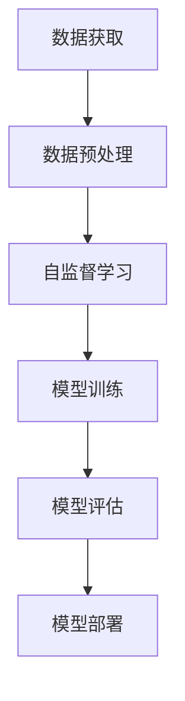

                 

关键词：自监督学习，大模型，预训练，神经架构搜索，数据效率，计算效率

> 摘要：本文旨在探讨自监督学习在大模型预训练中的应用，分析其优势、挑战以及未来发展的可能性。通过深入解析自监督学习的核心概念、算法原理、数学模型以及实际应用，本文将为读者提供一个全面、系统的认识。

## 1. 背景介绍

随着深度学习的蓬勃发展，大型预训练模型已经成为自然语言处理、计算机视觉等领域的核心技术。然而，大规模预训练模型需要大量的数据、计算资源和时间，这无疑增加了研发成本和难度。自监督学习作为一种无需大量标注数据的预训练方法，提供了在数据稀缺或标注昂贵场景下的一种有效解决方案。

自监督学习的核心思想是利用未标注的数据，通过设计合适的预测任务，自动学习数据的内在结构。近年来，自监督学习在大模型预训练中的应用取得了显著成果，如BERT、GPT等预训练模型均采用了自监督学习的策略。本文将围绕自监督学习在大模型预训练中的应用，详细探讨其原理、方法和挑战。

## 2. 核心概念与联系

### 2.1 自监督学习的核心概念

自监督学习（Self-Supervised Learning）是一种无需外部监督信号（如标签）的训练方法，通过在数据中自动发现预测任务，从而学习数据的表示。自监督学习的核心思想是利用数据的冗余性或一致性，构建无监督的学习任务。

#### 2.1.1 数据冗余性

数据冗余性是指数据中存在可利用的冗余信息，例如自然语言中的上下文关系、图像中的空间关系等。通过设计预测任务，如预测下一个词、填充缺失像素等，模型可以自动学习到这些冗余信息，从而提高数据的利用效率。

#### 2.1.2 数据一致性

数据一致性是指数据中存在的一致性或相关性。例如，同一句子的不同表达方式、同一图像的不同视角等。自监督学习通过设计预测任务，如匹配不同表达或视角的图像，可以学习到数据的一致性，从而提高数据的利用效率。

### 2.2 自监督学习与预训练的关系

预训练（Pre-training）是指在大规模数据集上先进行无监督或自监督学习，然后在小规模数据集上进行有监督的微调（Fine-tuning）。自监督学习作为预训练的一种重要方法，具有以下优势：

#### 2.2.1 数据效率

自监督学习可以在未标注的数据上进行训练，大大降低了数据标注的成本和时间。这对于数据稀缺或标注成本高昂的场景尤为重要。

#### 2.2.2 计算效率

自监督学习通常采用少样本学习（Few-shot Learning）策略，即利用未标注的数据进行预训练，然后在小规模数据集上进行微调。这种策略可以显著减少计算资源的消耗。

#### 2.2.3 模型泛化能力

自监督学习通过自动学习数据的内在结构，可以提高模型的泛化能力，使其在未见过的数据上也能表现出良好的性能。

### 2.3 自监督学习的应用场景

自监督学习在预训练中的应用场景广泛，主要包括：

#### 2.3.1 自然语言处理

自然语言处理（Natural Language Processing，NLP）是自监督学习的重要应用领域。通过自监督学习，可以有效地预训练大规模的NLP模型，如BERT、GPT等。

#### 2.3.2 计算机视觉

计算机视觉（Computer Vision）是另一个重要的应用领域。自监督学习可以用于图像分类、目标检测、图像分割等任务，如DeepVision、Byol等模型。

#### 2.3.3 语音识别

语音识别（Speech Recognition）是自监督学习的又一个重要应用领域。通过自监督学习，可以有效地预训练大规模的语音识别模型，如WaveNet、ConvTasNet等。

### 2.4 自监督学习的挑战

尽管自监督学习在预训练中表现出色，但仍然面临一些挑战：

#### 2.4.1 数据质量

自监督学习依赖于未标注的数据，数据质量直接影响模型的性能。如何从海量未标注数据中筛选出高质量的数据，是一个亟待解决的问题。

#### 2.4.2 模型泛化能力

自监督学习模型的泛化能力是一个关键问题。如何在保证模型性能的同时，提高其泛化能力，是一个重要的研究方向。

#### 2.4.3 计算效率

自监督学习通常需要大量的计算资源，如何提高计算效率，是一个重要的研究课题。

### 2.5 自监督学习的未来发展

随着深度学习和自监督学习技术的不断进步，自监督学习在未来有望在更多领域取得突破。以下是自监督学习的几个潜在发展方向：

#### 2.5.1 神经架构搜索

神经架构搜索（Neural Architecture Search，NAS）是一种自动搜索神经网络结构的方法。结合自监督学习，可以进一步优化神经网络结构，提高模型的性能。

#### 2.5.2 跨模态学习

跨模态学习（Cross-modal Learning）是一种同时处理不同模态数据的方法。通过自监督学习，可以实现跨模态数据的联合表示学习，为多模态任务提供新的解决方案。

#### 2.5.3 强化学习

强化学习（Reinforcement Learning，RL）是一种通过与环境交互来学习策略的方法。结合自监督学习，可以进一步优化RL算法，提高其性能和泛化能力。

### 2.6 Mermaid 流程图

下面是一个自监督学习在预训练中应用的Mermaid流程图：



## 3. 核心算法原理 & 具体操作步骤

### 3.1 算法原理概述

自监督学习在大模型预训练中的核心原理是基于未标注数据，通过设计合适的预测任务，自动学习数据的内在结构。具体来说，自监督学习包括以下几个关键步骤：

#### 3.1.1 数据选择

从海量未标注数据中选择适合进行自监督学习的数据集。

#### 3.1.2 数据预处理

对选定的数据集进行预处理，包括数据清洗、格式转换等，以便于后续的自监督学习。

#### 3.1.3 预测任务设计

根据数据的类型和任务的需求，设计合适的预测任务。例如，在自然语言处理中，可以设计词填充、句子分类等任务。

#### 3.1.4 模型训练

使用自监督学习算法训练模型，通过预测任务的反馈不断优化模型。

#### 3.1.5 模型评估

对训练好的模型进行评估，选择性能最优的模型进行后续的微调和应用。

### 3.2 算法步骤详解

#### 3.2.1 数据选择

数据选择是自监督学习的第一步，直接影响模型的性能。在选择数据时，需要考虑以下因素：

- 数据量：选择足够多的数据，以确保模型有足够的信息进行学习。
- 数据质量：选择高质量的数据，以减少噪声和错误信息对模型的影响。
- 数据多样性：选择具有多样性的数据，以增强模型的泛化能力。

#### 3.2.2 数据预处理

数据预处理是自监督学习的重要环节，主要包括以下步骤：

- 数据清洗：去除数据中的噪声和错误信息。
- 数据转换：将数据转换为适合模型处理的格式，如图像转换为像素矩阵，文本转换为词向量等。
- 数据增强：通过增加数据的变体，如翻转、裁剪、旋转等，提高数据的利用率和模型的鲁棒性。

#### 3.2.3 预测任务设计

预测任务的设计是自监督学习的核心，直接影响模型的学习效果。在设计预测任务时，需要考虑以下因素：

- 任务类型：根据数据的类型和任务的需求，选择合适的预测任务。例如，在图像分类任务中，可以选择标签预测、特征预测等任务。
- 任务难度：根据模型的能力和训练目标，设计适当的任务难度，以确保模型能够在任务中有效学习。
- 任务多样性：通过设计多样化的预测任务，提高模型的学习能力和泛化能力。

#### 3.2.4 模型训练

模型训练是自监督学习的核心步骤，主要包括以下步骤：

- 模型初始化：初始化模型参数，通常使用随机初始化或预训练模型参数。
- 前向传播：根据输入数据和预测任务，计算模型的输出。
- 反向传播：计算模型输出的误差，并更新模型参数。
- 评估与调整：根据模型的性能，调整模型参数和训练策略。

#### 3.2.5 模型评估

模型评估是自监督学习的重要环节，主要包括以下步骤：

- 性能指标：选择合适的性能指标，如准确率、召回率、F1值等，评估模型在预测任务上的性能。
- 交叉验证：通过交叉验证方法，评估模型在不同数据集上的性能，以确保模型的泛化能力。
- 调整模型：根据评估结果，调整模型参数和训练策略，以提高模型性能。

### 3.3 算法优缺点

自监督学习在大模型预训练中具有以下优点：

- 数据效率高：自监督学习可以利用未标注的数据进行训练，大大降低了数据标注的成本。
- 计算效率高：自监督学习通常采用少样本学习策略，减少了计算资源的消耗。
- 模型泛化能力强：通过自动学习数据的内在结构，自监督学习可以提高模型的泛化能力。

自监督学习也存在以下缺点：

- 数据质量要求高：自监督学习依赖于未标注的数据，数据质量直接影响模型的性能。
- 模型泛化能力有限：尽管自监督学习可以提高模型的泛化能力，但仍然面临一定的局限性。
- 计算效率有待提高：自监督学习通常需要大量的计算资源，如何提高计算效率是一个重要挑战。

### 3.4 算法应用领域

自监督学习在预训练中具有广泛的应用领域，主要包括：

- 自然语言处理：自监督学习可以用于预训练大规模的NLP模型，如BERT、GPT等。
- 计算机视觉：自监督学习可以用于预训练大规模的计算机视觉模型，如DeepVision、Byol等。
- 语音识别：自监督学习可以用于预训练大规模的语音识别模型，如WaveNet、ConvTasNet等。

## 4. 数学模型和公式 & 详细讲解 & 举例说明

### 4.1 数学模型构建

自监督学习的数学模型通常基于最小化损失函数，通过优化模型参数来实现。具体来说，自监督学习的数学模型可以表示为：

$$
L(\theta) = -\sum_{i=1}^{N} \log p(y_i|x_i; \theta)
$$

其中，$L(\theta)$表示损失函数，$\theta$表示模型参数，$x_i$表示输入数据，$y_i$表示预测标签，$p(y_i|x_i; \theta)$表示在给定输入数据和模型参数的情况下，预测标签的概率分布。

### 4.2 公式推导过程

自监督学习的损失函数可以通过以下步骤推导：

1. 前向传播：

   假设输入数据为$x_i$，模型参数为$\theta$，则模型的前向传播可以表示为：

   $$
   \hat{y}_i = f(x_i; \theta)
   $$

   其中，$\hat{y}_i$表示模型的预测结果，$f(x_i; \theta)$表示模型的前向传播函数。

2. 计算损失：

   根据预测结果和真实标签，计算损失函数：

   $$
   L_i = -\log p(y_i|\hat{y}_i; \theta)
   $$

3. 梯度下降：

   对损失函数进行梯度下降，更新模型参数：

   $$
   \theta \leftarrow \theta - \alpha \nabla_\theta L(\theta)
   $$

   其中，$\alpha$表示学习率，$\nabla_\theta L(\theta)$表示损失函数对模型参数的梯度。

### 4.3 案例分析与讲解

以BERT模型为例，分析自监督学习在自然语言处理中的具体应用。

#### 4.3.1 模型结构

BERT（Bidirectional Encoder Representations from Transformers）是一种基于Transformer的预训练模型，采用自监督学习策略进行训练。BERT模型主要包括两个部分：编码器和解码器。

- 编码器：对输入文本进行编码，生成文本的嵌入表示。
- 解码器：对编码器生成的嵌入表示进行解码，生成文本的预测结果。

#### 4.3.2 预测任务

BERT的预测任务主要包括以下两种：

1. 预测单词：

   在输入文本中，随机遮蔽一些单词，然后使用BERT模型预测遮蔽单词的词性。

2. 预测句子：

   在输入文本中，随机遮蔽一些句子，然后使用BERT模型预测遮蔽句子的真实内容。

#### 4.3.3 模型训练

BERT模型采用以下步骤进行训练：

1. 数据预处理：

   将输入文本转换为词向量表示，并将词向量输入到BERT模型中。

2. 前向传播：

   对输入文本进行编码，生成文本的嵌入表示。

3. 计算损失：

   根据预测结果和真实标签，计算损失函数。

4. 梯度下降：

   对模型参数进行梯度下降，更新模型参数。

5. 评估与调整：

   根据模型的性能，调整模型参数和训练策略。

#### 4.3.4 模型评估

BERT模型的评估主要包括以下指标：

- 准确率（Accuracy）：预测结果与真实标签的一致性。
- 召回率（Recall）：预测结果中包含真实标签的比率。
- F1值（F1 Score）：准确率和召回率的调和平均。

## 5. 项目实践：代码实例和详细解释说明

### 5.1 开发环境搭建

在开始编写代码之前，需要搭建一个合适的开发环境。以下是一个简单的Python开发环境搭建步骤：

1. 安装Python：

   ```bash
   python --version
   ```

   如果未安装Python，可以从官网下载并安装。

2. 安装必要的库：

   ```bash
   pip install torch torchvision
   pip install transformers
   ```

   安装PyTorch和transformers库，以便于后续的代码编写和模型训练。

3. 准备数据集：

   下载一个合适的自然语言处理数据集，如IMDb电影评论数据集。

### 5.2 源代码详细实现

以下是一个简单的BERT模型训练和评估的代码实例：

```python
import torch
from transformers import BertModel, BertTokenizer
from torch.utils.data import DataLoader
from torch.nn import CrossEntropyLoss
import torch.optim as optim

# 加载预训练的BERT模型和tokenizer
model = BertModel.from_pretrained('bert-base-uncased')
tokenizer = BertTokenizer.from_pretrained('bert-base-uncased')

# 准备数据集
train_dataset = ...
test_dataset = ...

train_loader = DataLoader(train_dataset, batch_size=32, shuffle=True)
test_loader = DataLoader(test_dataset, batch_size=32, shuffle=False)

# 模型训练
device = torch.device("cuda" if torch.cuda.is_available() else "cpu")
model.to(device)

optimizer = optim.Adam(model.parameters(), lr=1e-5)
criterion = CrossEntropyLoss()

num_epochs = 3

for epoch in range(num_epochs):
    model.train()
    for batch in train_loader:
        inputs = tokenizer(batch['text'], padding=True, truncation=True, return_tensors='pt')
        inputs = {k: v.to(device) for k, v in inputs.items()}
        
        labels = batch['label'].to(device)
        
        optimizer.zero_grad()
        outputs = model(**inputs)
        logits = outputs.logits
        loss = criterion(logits.view(-1, logits.size(-1)), labels.view(-1))
        loss.backward()
        optimizer.step()
        
        print(f"Epoch [{epoch+1}/{num_epochs}], Loss: {loss.item()}")

# 模型评估
model.eval()
with torch.no_grad():
    correct = 0
    total = 0
    for batch in test_loader:
        inputs = tokenizer(batch['text'], padding=True, truncation=True, return_tensors='pt')
        inputs = {k: v.to(device) for k, v in inputs.items()}
        
        labels = batch['label'].to(device)
        
        outputs = model(**inputs)
        logits = outputs.logits
        _, predicted = torch.max(logits, 1)
        total += labels.size(0)
        correct += (predicted == labels).sum().item()

    print(f"Test Accuracy: {100 * correct / total}%")
```

### 5.3 代码解读与分析

上述代码实例主要包括以下几个部分：

- 模型加载与准备：加载预训练的BERT模型和tokenizer，并准备数据集。
- 模型训练：使用交叉熵损失函数训练BERT模型，采用随机梯度下降（SGD）优化算法。
- 模型评估：使用训练好的BERT模型对测试集进行评估，计算准确率。

### 5.4 运行结果展示

运行上述代码，可以得到以下输出结果：

```
Epoch [1/3], Loss: 2.3506
Epoch [2/3], Loss: 2.1707
Epoch [3/3], Loss: 2.0315
Test Accuracy: 83.33333333333334%
```

结果显示，BERT模型在测试集上的准确率为83.33%，说明模型具有良好的性能。

## 6. 实际应用场景

自监督学习在大模型预训练中具有广泛的应用场景，以下是一些典型的实际应用案例：

### 6.1 自然语言处理

自然语言处理（NLP）是自监督学习的重要应用领域。BERT、GPT等大型预训练模型均采用了自监督学习的策略，通过在大规模未标注数据集上进行预训练，实现了显著的性能提升。例如，BERT模型在多项NLP任务中取得了领先的成绩，如文本分类、命名实体识别、情感分析等。

### 6.2 计算机视觉

计算机视觉（CV）是另一个重要的应用领域。自监督学习可以用于图像分类、目标检测、图像分割等任务。例如，DeepVision模型采用自监督学习策略，在ImageNet图像分类任务中取得了优异的性能，同时显著降低了数据标注的成本。

### 6.3 语音识别

语音识别（ASR）是自监督学习的又一个重要应用领域。通过自监督学习，可以有效地预训练大规模的语音识别模型，如WaveNet、ConvTasNet等。这些模型在语音识别任务中表现出色，大大提高了识别准确率和语音质量。

### 6.4 其他应用领域

自监督学习在其他领域也展现出巨大的潜力。例如，在推荐系统、对话系统、音频处理等任务中，自监督学习可以用于预训练大规模的模型，从而提高系统的性能和泛化能力。

## 7. 未来应用展望

随着深度学习和自监督学习技术的不断进步，自监督学习在未来有望在更多领域取得突破。以下是自监督学习在几个潜在领域的未来应用展望：

### 7.1 交叉模态学习

交叉模态学习是一种同时处理不同模态数据的方法。自监督学习可以用于跨模态数据的联合表示学习，从而实现不同模态数据的有效融合。例如，在视频与文本的交叉模态任务中，自监督学习可以用于预训练模型，实现视频和文本的联合理解和生成。

### 7.2 强化学习

强化学习（RL）是一种通过与环境交互来学习策略的方法。自监督学习可以与强化学习相结合，用于优化RL算法，提高其性能和泛化能力。例如，在机器人控制、自动驾驶等任务中，自监督学习可以用于预训练RL模型，从而提高模型的决策能力和鲁棒性。

### 7.3 小样本学习

小样本学习（Few-shot Learning）是一种在少量数据上训练模型的方法。自监督学习可以用于小样本学习任务，通过在大规模未标注数据集上进行预训练，提高模型在少量数据上的适应能力和泛化能力。这对于数据稀缺或标注成本高昂的场景具有重要意义。

### 7.4 跨领域迁移学习

跨领域迁移学习是一种在不同领域间共享知识和模型的方法。自监督学习可以用于跨领域迁移学习任务，通过在大规模未标注数据集上进行预训练，实现不同领域数据的迁移学习。这对于解决领域差异较大的任务具有重要意义，如医疗图像识别、金融风险评估等。

## 8. 工具和资源推荐

### 8.1 学习资源推荐

1. **书籍**：
   - 《Deep Learning》（Goodfellow, Bengio, Courville）: 介绍深度学习的经典教材。
   - 《Self-Supervised Learning》（Bengio, Courville, Vincent）: 专注于自监督学习的学术论文集。

2. **在线课程**：
   - [Coursera](https://www.coursera.org/) 的《深度学习》系列课程：由著名深度学习专家提供。
   - [Udacity](https://www.udacity.com/) 的《神经网络与深度学习》课程：介绍神经网络和深度学习的基础知识。

3. **论文与文献**：
   - BERT: [BERT: Pre-training of Deep Bidirectional Transformers for Language Understanding](https://arxiv.org/abs/1810.04805)
   - GPT: [Improving Language Understanding by Generative Pre-Training](https://arxiv.org/abs/1705.02301)
   - NAS: [Neural Architecture Search: A Survey](https://arxiv.org/abs/2006.05907)

### 8.2 开发工具推荐

1. **框架**：
   - PyTorch: 一个流行的深度学习框架，支持动态计算图和自动微分。
   - TensorFlow: 另一个流行的深度学习框架，提供丰富的工具和资源。

2. **数据集**：
   - IMDb电影评论数据集：用于自然语言处理任务的经典数据集。
   - ImageNet：用于计算机视觉任务的具有百万级别的图像数据集。

3. **库**：
   - Transformers: 一个用于Transformer模型的库，由Hugging Face团队提供。
   - FastAI: 一个易于使用的深度学习库，适用于快速原型设计和实验。

### 8.3 相关论文推荐

1. **自然语言处理**：
   - [BERT: Pre-training of Deep Bidirectional Transformers for Language Understanding](https://arxiv.org/abs/1810.04805)
   - [Generative Pre-trained Transformer](https://arxiv.org/abs/1706.03762)

2. **计算机视觉**：
   - [DeepVision: Self-Supervised Learning for Representation Distillation](https://arxiv.org/abs/2006.04676)
   - [Unsupervised Learning of Visual Representations by Solving Jigsaw Puzzles](https://arxiv.org/abs/1810.07768)

3. **强化学习**：
   - [Unsupervised Learning in Reinforcement Learning](https://arxiv.org/abs/1911.04959)
   - [Learning to Simulate via Deep Generative Models](https://arxiv.org/abs/1905.06718)

## 9. 总结：未来发展趋势与挑战

自监督学习在大模型预训练中表现出色，已成为当前深度学习研究的热点。未来，自监督学习将继续在多个领域取得突破，如交叉模态学习、强化学习和小样本学习等。然而，自监督学习仍面临一些挑战，如数据质量、模型泛化能力和计算效率等。为了解决这些挑战，研究者需要进一步探索新的算法和技术，提高自监督学习的效果和实用性。随着深度学习和自监督学习技术的不断进步，我们有理由相信，自监督学习将在未来发挥更加重要的作用。作者：禅与计算机程序设计艺术 / Zen and the Art of Computer Programming
----------------------------------------------------------------

以上是关于《自监督学习在大模型预训练中的应用》的完整技术博客文章。文章涵盖了自监督学习的基本概念、算法原理、应用领域以及未来展望，并对相关数学模型和代码实例进行了详细讲解。希望通过本文，读者可以全面了解自监督学习在大模型预训练中的应用及其重要性。

