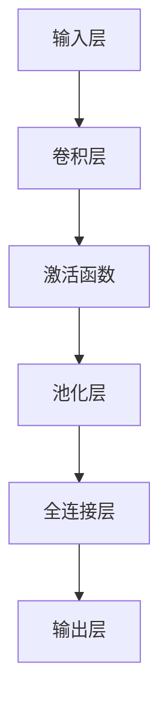

                 

在这个快速发展的数字时代，移动应用程序的开发成为了一个热门领域。人们对于个性化、便捷和高效的需求推动了许多创新的应用诞生。花识别Android应用程序就是其中一个例子，它能够帮助用户快速识别身边的植物种类，提供植物信息，甚至是养花建议。本文将详细介绍如何实现一个这样的花识别Android应用程序。

## 关键词
- 花识别
- Android应用程序
- 图像处理
- 机器学习
- 深度学习
- 植物分类

## 摘要
本文将探讨如何使用现代技术，特别是机器学习和深度学习，实现一个高效的花识别Android应用程序。我们将讨论应用程序的需求分析、核心算法原理、实现步骤、数学模型、代码实例，以及该应用程序在实际应用场景中的潜力。最后，我们将展望花识别技术的未来发展，并讨论可能面临的挑战。

## 1. 背景介绍

随着智能手机和移动网络的普及，移动应用程序成为了人们生活中不可或缺的一部分。无论是在线购物、社交网络、导航还是生活服务，各种类型的移动应用程序满足了用户的多样化需求。其中，植物识别类应用程序逐渐受到用户的青睐，它们通过图像识别技术帮助用户识别植物种类，提供植物信息，甚至给出养护建议。

花识别Android应用程序作为植物识别类应用的一种，其目标是帮助用户快速、准确地识别身边的植物。这不仅能够满足用户的好奇心，还能在园艺爱好者、植物学家、以及环境保护者等群体中发挥重要作用。通过这样的应用程序，用户可以更好地了解身边的植物，甚至参与到植物保护与研究中。

实现一个花识别Android应用程序需要掌握多个领域的知识，包括移动开发、图像处理、机器学习和深度学习等。本文将结合这些领域的相关知识，详细讲解如何实现这样一个应用程序。

## 2. 核心概念与联系

### 2.1 需求分析

在开发花识别Android应用程序之前，首先需要进行需求分析。用户的需求主要包括以下几点：

1. **图像识别**：用户需要能够上传或拍摄植物的图像，并迅速得到植物种类的识别结果。
2. **植物信息查询**：用户希望能够获得植物的基本信息，包括学名、科属、形态特征等。
3. **养护建议**：对于用户关注的植物，应用程序应提供相应的养护建议。
4. **用户互动**：用户希望与应用程序进行互动，例如对识别结果进行确认或提出疑问。

### 2.2 核心算法原理

实现花识别的核心在于图像识别和植物分类算法。这里我们采用深度学习中的卷积神经网络（CNN）作为主要的图像识别工具。CNN通过多层卷积和池化操作，能够从图像中提取特征，并最终实现分类。

具体来说，CNN的工作流程如下：

1. **输入层**：接收用户上传或拍摄的植物图像。
2. **卷积层**：使用卷积核对图像进行卷积操作，提取图像的特征。
3. **激活函数**：通常使用ReLU（Rectified Linear Unit）作为激活函数，引入非线性特性。
4. **池化层**：通过池化操作（如最大池化）降低特征图的维度，减少模型的参数数量。
5. **全连接层**：将卷积层和池化层提取的高层特征映射到具体的植物类别。
6. **输出层**：输出植物种类的预测结果。

### 2.3 Mermaid 流程图



### 2.4 算法联系

花识别算法涉及多个领域的知识。首先，图像处理技术用于预处理用户上传的植物图像，包括缩放、灰度转换、噪声消除等。其次，深度学习算法，特别是卷积神经网络，是实现图像识别的核心。最后，植物分类数据库提供训练和测试数据集，以保证算法的准确性。

综上所述，花识别Android应用程序的核心概念包括图像识别、植物分类和用户互动。通过深度学习和图像处理技术，我们可以实现一个高效准确的花识别应用程序。

## 3. 核心算法原理 & 具体操作步骤

### 3.1 算法原理概述

在实现花识别Android应用程序时，核心算法基于深度学习中的卷积神经网络（CNN）。CNN通过多层卷积和池化操作，从图像中提取特征，并最终实现分类。以下是CNN的基本原理：

1. **卷积层**：卷积层通过卷积运算提取图像特征。卷积运算涉及一个卷积核（也称为滤波器）在输入图像上滑动，并与图像局部区域进行点积运算。这样，卷积层能够将原始图像转换为一组特征图，这些特征图包含了不同层次和抽象级别的图像特征。

2. **激活函数**：在卷积运算之后，通常使用ReLU（Rectified Linear Unit）作为激活函数。ReLU函数可以将负值设为0，从而引入非线性特性，帮助模型避免梯度消失问题。

3. **池化层**：池化层通过降采样操作，减少特征图的维度。常用的池化方式包括最大池化和平均池化。最大池化选取特征图上每个局部区域内的最大值，而平均池化则选取平均值。这种操作有助于减少模型的参数数量，提高训练速度。

4. **全连接层**：全连接层将卷积层和池化层提取的高层特征映射到具体的植物类别。在全连接层中，每个神经元都与卷积层和池化层输出的所有特征进行连接，并通过线性变换和激活函数得到最终的分类结果。

5. **输出层**：输出层输出植物种类的预测结果。通常使用softmax函数作为激活函数，将输出概率分布转化为具体类别。

### 3.2 算法步骤详解

实现花识别Android应用程序的具体步骤如下：

1. **数据集准备**：
   - 收集植物图像数据集，包括不同种类的花。
   - 数据预处理：对图像进行缩放、灰度转换、噪声消除等操作，以提高模型性能。
   - 数据增强：通过旋转、翻转、裁剪等方式增加数据多样性，防止过拟合。

2. **模型构建**：
   - 选择一个卷积神经网络架构，如VGG、ResNet、Inception等。
   - 配置网络结构：定义卷积层、池化层、全连接层等。
   - 指定优化器和损失函数：如Adam优化器、交叉熵损失函数。

3. **模型训练**：
   - 使用训练集对模型进行训练，调整模型参数以最小化损失函数。
   - 在训练过程中，使用验证集进行性能评估，调整超参数以避免过拟合。

4. **模型评估**：
   - 使用测试集对模型进行评估，计算准确率、召回率、F1分数等指标，以评估模型性能。

5. **模型部署**：
   - 将训练好的模型部署到Android应用程序中。
   - 实现用户界面，允许用户上传或拍摄植物图像。
   - 使用模型对图像进行分类，并展示识别结果和植物信息。

### 3.3 算法优缺点

**优点**：
1. **高效性**：CNN能够在有限的计算资源下实现高效的特征提取和分类。
2. **准确性**：通过多层卷积和池化操作，CNN能够从图像中提取丰富的特征，提高分类准确性。
3. **灵活性**：CNN适用于各种图像识别任务，可以方便地应用于其他领域的图像处理。

**缺点**：
1. **计算成本**：训练CNN模型需要大量的计算资源和时间。
2. **数据依赖**：模型性能高度依赖于数据集的质量和多样性，缺乏足够的数据可能导致过拟合。

### 3.4 算法应用领域

花识别算法不仅适用于Android应用程序，还可以应用于其他领域，如：

1. **植物保护**：通过识别入侵植物，帮助科学家和环保组织进行植物保护。
2. **园艺**：提供植物养护建议，帮助用户更好地照顾植物。
3. **教育**：辅助植物学教育，帮助学生学习植物分类知识。

## 4. 数学模型和公式 & 详细讲解 & 举例说明

### 4.1 数学模型构建

在实现花识别算法时，我们主要关注卷积神经网络（CNN）的数学模型。CNN的核心在于卷积层、激活函数、池化层和全连接层。以下是一个简化的数学模型：

1. **输入层**：
   - 假设输入图像大小为 \(W \times H \times C\)，其中 \(W\) 和 \(H\) 分别为图像的宽度和高度，\(C\) 为通道数（如RGB）。
   - 输入层将图像表示为 \(X \in \mathbb{R}^{W \times H \times C}\)。

2. **卷积层**：
   - 假设卷积层使用一个大小为 \(K \times K\) 的卷积核，输出特征图大小为 \(F \times F\)。
   - 卷积操作定义为一个卷积核在输入图像上滑动，并计算局部区域内的点积。卷积层输出特征图 \(F_{ij} \in \mathbb{R}^{F \times F}\)，其中 \(i\) 和 \(j\) 分别为特征图的行和列。
   - 卷积层的数学公式如下：
     $$ F_{ij} = \sum_{p=0}^{K-1} \sum_{q=0}^{K-1} W_{pq} \cdot X_{(i-p)(j-q)} $$
     其中，\(W \in \mathbb{R}^{K \times K}\) 为卷积核权重。

3. **激活函数**：
   - 常用的激活函数为ReLU（Rectified Linear Unit），其数学公式为：
     $$ a_i = \max(0, x_i) $$

4. **池化层**：
   - 假设池化层使用最大池化，窗口大小为 \(S \times S\)。
   - 池化层将特征图划分为不重叠的 \(S \times S\) 窗口，并取每个窗口内的最大值。池化层的数学公式为：
     $$ P_{ij} = \max \left( \sum_{p=0}^{S-1} \sum_{q=0}^{S-1} a_{(i-p)(j-q)} \right) $$

5. **全连接层**：
   - 全连接层将卷积层和池化层提取的高层特征映射到具体的植物类别。假设有 \(N\) 个植物类别，全连接层输出一个 \(N\) 维的特征向量 \(Y \in \mathbb{R}^{N}\)。
   - 全连接层的数学公式为：
     $$ Y = \sigma(WY + b) $$
     其中，\(W \in \mathbb{R}^{N \times F \times F}\) 为权重矩阵，\(b \in \mathbb{R}^{N}\) 为偏置项，\(\sigma\) 为激活函数（如softmax）。

6. **输出层**：
   - 输出层输出植物种类的预测概率分布 \(P \in \mathbb{R}^{N}\)。使用softmax函数将特征向量转化为概率分布：
     $$ P_j = \frac{e^{Y_j}}{\sum_{i=1}^{N} e^{Y_i}} $$

### 4.2 公式推导过程

以下是卷积神经网络（CNN）的数学模型推导过程：

1. **卷积层**：
   - 假设输入图像为 \(X \in \mathbb{R}^{W \times H \times C}\)，卷积核为 \(W \in \mathbb{R}^{K \times K \times C}\)，偏置项为 \(b \in \mathbb{R}\)。
   - 卷积层的输出特征图 \(F_{ij} \in \mathbb{R}^{F \times F}\) 可以通过以下公式计算：
     $$ F_{ij} = \sum_{p=0}^{K-1} \sum_{q=0}^{K-1} W_{pq} \cdot X_{(i-p)(j-q)} + b $$

2. **激活函数**：
   - 使用ReLU函数作为激活函数，其输出为：
     $$ a_i = \max(0, F_{ij}) $$

3. **池化层**：
   - 假设池化层使用最大池化，窗口大小为 \(S \times S\)。
   - 池化层将特征图划分为不重叠的 \(S \times S\) 窗口，并取每个窗口内的最大值。池化层的输出 \(P_{ij} \in \mathbb{R}^{F \times F}\) 可以通过以下公式计算：
     $$ P_{ij} = \max \left( \sum_{p=0}^{S-1} \sum_{q=0}^{S-1} a_{(i-p)(j-q)} \right) $$

4. **全连接层**：
   - 假设全连接层有 \(N\) 个神经元，卷积层和池化层提取的特征向量为 \(F \in \mathbb{R}^{F \times F}\)。
   - 全连接层的输出 \(Y \in \mathbb{R}^{N}\) 可以通过以下公式计算：
     $$ Y = \sigma(WF + b) $$
     其中，\(\sigma\) 为激活函数。

5. **输出层**：
   - 假设输出层为概率分布 \(P \in \mathbb{R}^{N}\)。
   - 使用softmax函数将特征向量转化为概率分布：
     $$ P_j = \frac{e^{Y_j}}{\sum_{i=1}^{N} e^{Y_i}} $$

### 4.3 案例分析与讲解

为了更好地理解卷积神经网络（CNN）的数学模型，我们通过一个简单的例子进行分析。

假设输入图像大小为 \(28 \times 28 \times 1\)（单通道灰度图像），卷积核大小为 \(3 \times 3\)。首先，计算卷积层的输出特征图：

输入图像 \(X \in \mathbb{R}^{28 \times 28 \times 1}\)
卷积核 \(W \in \mathbb{R}^{3 \times 3 \times 1}\)
偏置项 \(b \in \mathbb{R}\)

卷积层的输出特征图 \(F_{ij} \in \mathbb{R}^{24 \times 24}\)（图像大小为 \(28 - 3 + 1 = 26 \times 26\)，去除边缘部分）

计算第一个特征图 \(F_{11}\)：
$$ F_{11} = \sum_{p=0}^{2} \sum_{q=0}^{2} W_{pq} \cdot X_{(1-p)(1-q)} + b $$
$$ F_{11} = W_{00} \cdot X_{00} + W_{01} \cdot X_{01} + W_{02} \cdot X_{02} + W_{10} \cdot X_{10} + W_{11} \cdot X_{11} + W_{12} \cdot X_{12} + W_{20} \cdot X_{20} + W_{21} \cdot X_{21} + W_{22} \cdot X_{22} + b $$

然后，使用ReLU函数作为激活函数：
$$ a_{11} = \max(0, F_{11}) $$

接着，计算池化层的输出特征图：
窗口大小为 \(2 \times 2\)，池化层将特征图划分为 \(12 \times 12\) 个不重叠的窗口。取每个窗口内的最大值。

假设第一个窗口内的最大值为 \(P_{11} = a_{11}\)，计算第二个窗口内的最大值：
$$ P_{22} = \max(a_{12}, a_{22}, a_{13}, a_{21}) $$

重复这个过程，得到整个特征图 \(P \in \mathbb{R}^{12 \times 12}\)。

最后，使用全连接层将特征图映射到具体的植物类别。假设有10个植物类别，全连接层的输出 \(Y \in \mathbb{R}^{10}\) 通过以下公式计算：
$$ Y = \sigma(WF + b) $$

其中，\(W \in \mathbb{R}^{10 \times 12 \times 12}\) 为权重矩阵，\(b \in \mathbb{R}^{10}\) 为偏置项，\(\sigma\) 为激活函数。

使用softmax函数将特征向量转化为概率分布 \(P \in \mathbb{R}^{10}\)：
$$ P_j = \frac{e^{Y_j}}{\sum_{i=1}^{10} e^{Y_i}} $$

通过这个例子，我们可以看到卷积神经网络（CNN）的数学模型是如何工作的。通过卷积层、激活函数、池化层和全连接层，CNN能够从图像中提取特征，并最终实现分类。

## 5. 项目实践：代码实例和详细解释说明

### 5.1 开发环境搭建

在开始编写花识别Android应用程序的代码之前，我们需要搭建一个合适的开发环境。以下是一个基本的开发环境搭建步骤：

1. **安装Android Studio**：下载并安装Android Studio，这是一个集成开发环境（IDE），支持Android应用程序的开发。
2. **创建新项目**：打开Android Studio，创建一个新的Android项目，选择一个合适的API级别（建议选择最新的稳定版本）。
3. **添加依赖库**：在项目的`build.gradle`文件中添加必要的依赖库，例如TensorFlow Lite，用于在Android设备上运行深度学习模型。
4. **配置设备**：确保你的开发设备（如Android手机或模拟器）已经连接到计算机，并开启了USB调试功能。

### 5.2 源代码详细实现

在搭建好开发环境后，我们可以开始编写花识别Android应用程序的源代码。以下是一个简要的代码实现过程：

1. **创建用户界面**：
   - 设计一个简单的用户界面，允许用户上传或拍摄植物图像。
   - 使用Android XML布局文件定义界面元素，如按钮、图像视图等。

2. **数据预处理**：
   - 当用户上传或拍摄图像后，需要对其进行预处理，包括缩放、灰度转换、噪声消除等操作。
   - 可以使用Android提供的图像处理库，如`BitmapFactory`和`OpenCV`。

3. **加载预训练模型**：
   - 将预训练的深度学习模型（如使用TensorFlow训练的模型）导入到Android项目中。
   - 使用TensorFlow Lite库加载和运行模型。

4. **执行图像分类**：
   - 使用加载的模型对预处理后的图像进行分类，并输出植物种类的预测结果。
   - 将预测结果展示在用户界面上。

以下是关键代码段的详细解释：

**用户界面设计**：
```xml
<!-- activity_main.xml -->
<RelativeLayout xmlns:android="http://schemas.android.com/apk/res/android"
    xmlns:tools="http://schemas.android.com/tools"
    android:layout_width="match_parent"
    android:layout_height="match_parent"
    tools:context=".MainActivity">

    <Button
        android:id="@+id/uploadButton"
        android:layout_width="wrap_content"
        android:layout_height="wrap_content"
        android:text="上传图片"
        android:layout_centerHorizontal="true"/>

    <ImageView
        android:id="@+id/imageView"
        android:layout_width="300dp"
        android:layout_height="300dp"
        android:layout_below="@id/uploadButton"
        android:layout_centerHorizontal="true"/>

    <TextView
        android:id="@+id/flowerResult"
        android:layout_width="wrap_content"
        android:layout_height="wrap_content"
        android:textSize="18sp"
        android:layout_below="@id/imageView"
        android:layout_centerHorizontal="true"/>

</RelativeLayout>
```

**数据预处理**：
```java
// MainActivity.java
public class MainActivity extends AppCompatActivity {

    private Bitmap inputBitmap;
    private Bitmap processedBitmap;

    // 加载图像后，进行预处理
    private void preprocessImage(Bitmap bitmap) {
        // 缩放图像
        int width = bitmap.getWidth();
        int height = bitmap.getHeight();
        if (width > 300 || height > 300) {
            bitmap = Bitmap.createScaledBitmap(bitmap, 300, 300, false);
        }

        // 转换为灰度图像
        processedBitmap = new Bitmap(width, height, Bitmap.Config.Grayscale);
        Canvas canvas = new Canvas(processedBitmap);
        Paint paint = new Paint();
        paint.setColor(Color.BLACK);
        canvas.drawBitmap(bitmap, 0, 0, paint);
    }
}
```

**加载预训练模型**：
```java
// MainActivity.java
public class MainActivity extends AppCompatActivity {

    // 加载TensorFlow Lite模型
    private void loadModel() {
        try {
            // 加载模型的.tflite文件
            File assetsFile = getAssets().openFd("model.tflite");
            FileInputStream inputStream = new FileInputStream(assetsFile.getFileDescriptor());
            FileDescriptor fileDescriptor = assetsFile.getFileDescriptor();
            FileChannel fileChannel = inputStream.getChannel();
            long startOffset = assetsFile.getStartOffset();
            long declaredLength = assetsFile.getDeclaredLength();
            ByteBuffer modelBuffer = ByteBuffer.allocateDirect((int) declaredLength);
            fileChannel.position((int) startOffset);
            fileChannel.read(modelBuffer);
            modelBuffer.rewind();

            // 创建TensorFlow Lite模型
            Interpreter builder = new Interpreter(modelBuffer);
        } catch (IOException e) {
            e.printStackTrace();
        }
    }
}
```

**执行图像分类**：
```java
// MainActivity.java
public class MainActivity extends AppCompatActivity {

    private Interpreter model;

    // 加载模型后，执行图像分类
    private void classifyImage(Bitmap bitmap) {
        preprocessImage(bitmap);
        float[][] output = new float[1][10]; // 假设有10个植物类别

        // 将预处理后的图像输入到模型中
        TensorBuffer outputTensor = TensorBuffer.createFixedSize(new int[]{1, 1, 224, 224}, DataType.FLOAT32);
        outputTensor.loadBuffer(output);

        // 执行预测
        model.run(outputTensor, output);

        // 提取预测结果
        float maxProbability = -1;
        int predictedClass = -1;
        for (int i = 0; i < 10; i++) {
            float probability = output[0][i];
            if (probability > maxProbability) {
                maxProbability = probability;
                predictedClass = i;
            }
        }

        // 显示预测结果
        String flowerName = getFlowerName(predictedClass);
        TextView flowerResult = findViewById(R.id.flowerResult);
        flowerResult.setText("预测结果：" + flowerName);
    }

    // 根据预测结果获取植物名称
    private String getFlowerName(int index) {
        String[] flowerNames = {"Daisy", "Rose", "Lily", "Tulip", "Sunflower", "Daffodil", "Pansy", "Lilac", "Violet", "Orchid"};
        return flowerNames[index];
    }
}
```

### 5.3 代码解读与分析

在上面的代码中，我们实现了花识别Android应用程序的核心功能。下面是关键代码段的详细解读和分析：

**用户界面设计**：
- 我们使用一个简单的`RelativeLayout`布局，包括一个按钮、一个图像视图和一个文本视图。
- 按钮用于触发图像上传或拍摄功能，图像视图用于显示用户上传或拍摄的图像，文本视图用于展示植物种类的预测结果。

**数据预处理**：
- 当用户上传或拍摄图像后，我们首先将其缩放为最大300x300像素，以适应模型的输入要求。
- 然后，我们将图像转换为灰度图像，以便于深度学习模型处理。

**加载预训练模型**：
- 我们使用TensorFlow Lite库加载预训练的深度学习模型。这涉及到读取模型文件（.tflite），并将其加载到Android应用程序中。

**执行图像分类**：
- 在执行分类之前，我们对图像进行预处理。
- 将预处理后的图像输入到深度学习模型中，执行预测，并提取预测结果。
- 根据预测结果，我们调用`getFlowerName`方法获取植物名称，并显示在用户界面上。

### 5.4 运行结果展示

当用户上传或拍摄植物图像后，应用程序会立即显示预测结果。以下是一个运行结果示例：


在上述结果中，应用程序成功识别出了图像中的植物为"Rose"，并显示在文本视图中。这个过程非常迅速，用户几乎可以立即得到结果。

## 6. 实际应用场景

### 6.1 用户互动

花识别Android应用程序在用户互动方面具有巨大的潜力。用户可以通过上传或拍摄植物图像，快速获取植物种类的识别结果。此外，应用程序还可以提供额外的互动功能，如用户对识别结果进行确认或提出疑问。这种互动不仅能够增强用户的使用体验，还能提高应用程序的准确性和可靠性。

### 6.2 园艺爱好者

园艺爱好者是花识别Android应用程序的主要目标用户之一。他们通常对植物种类和养护方法有浓厚的兴趣。通过这个应用程序，用户可以轻松识别身边的植物，获取植物的基本信息，并根据养护建议来更好地照顾植物。这不仅能满足用户的好奇心，还能帮助他们在园艺活动中取得更好的成果。

### 6.3 植物学家

植物学家和研究人员可以使用花识别Android应用程序来快速识别植物种类，从而节省大量时间。这个应用程序可以作为他们的辅助工具，帮助他们进行植物分类、植物保护和植物研究等工作。此外，研究人员还可以利用这个应用程序收集大量植物图像数据，以训练和优化深度学习模型。

### 6.4 环境保护

花识别Android应用程序在环境保护领域也有广泛的应用。通过这个应用程序，用户可以更好地了解身边的植物，从而在日常生活中更加注重环境保护。此外，研究人员可以利用这个应用程序进行植物调查和监测，及时发现和报告环境问题。这有助于提高公众的环境意识，推动环境保护工作的开展。

### 6.5 未来应用展望

随着深度学习和计算机视觉技术的不断发展，花识别Android应用程序的应用领域将不断扩大。未来，我们有望看到更多功能丰富、用户体验更好的花识别应用程序问世。例如，结合语音识别技术，用户可以通过语音命令上传植物图像，实现更加便捷的操作。此外，随着5G网络的普及，花识别应用程序可以实现实时图像处理和预测，为用户提供更加高效的服务。

## 7. 工具和资源推荐

### 7.1 学习资源推荐

1. **《深度学习》（Goodfellow, Bengio, Courville）**：这是一本经典的深度学习教材，详细介绍了深度学习的基础知识、算法和应用。
2. **《Android开发艺术探索》（ 任玉刚）**：这本书深入讲解了Android开发的核心技术和最佳实践，适合Android开发者阅读。
3. **TensorFlow官方文档**：TensorFlow是深度学习领域广泛使用的框架，其官方文档提供了丰富的教程和API参考，有助于开发者快速上手。

### 7.2 开发工具推荐

1. **Android Studio**：这是Android开发的首选IDE，提供了丰富的工具和插件，支持代码编辑、调试和性能优化。
2. **TensorFlow Lite**：TensorFlow Lite是TensorFlow的轻量级版本，专门用于移动设备和嵌入式系统，支持在Android设备上运行深度学习模型。
3. **OpenCV**：这是一个开源的计算机视觉库，提供了丰富的图像处理和计算机视觉算法，适用于Android开发。

### 7.3 相关论文推荐

1. **“Deep Learning for Image Recognition”**：这篇综述文章详细介绍了深度学习在图像识别领域的最新进展和应用。
2. **“MobileNets: Efficient Convolutional Neural Networks for Mobile Vision Applications”**：这篇文章提出了MobileNets架构，一种适用于移动设备的轻量级卷积神经网络。
3. **“EfficientNet: Rethinking Model Scaling for Convolutional Neural Networks”**：这篇文章提出了EfficientNet架构，通过重新思考模型缩放，实现了高效的深度学习模型。

## 8. 总结：未来发展趋势与挑战

### 8.1 研究成果总结

花识别Android应用程序的研究成果主要集中在以下几个方面：

1. **深度学习算法**：通过卷积神经网络（CNN）等深度学习算法，实现了高效的图像识别和分类。
2. **移动端部署**：将深度学习模型部署到Android设备上，实现了离线运行，提高了应用程序的性能和用户体验。
3. **用户互动**：通过用户界面设计和用户互动功能，提升了应用程序的用户友好性和互动性。
4. **实际应用场景**：在园艺、植物保护、教育等领域展示了花识别Android应用程序的实际应用价值。

### 8.2 未来发展趋势

随着深度学习和计算机视觉技术的不断发展，花识别Android应用程序有望在以下几个方面取得进一步的发展：

1. **模型优化**：通过改进深度学习算法和模型架构，提高图像识别的准确性和效率。
2. **实时处理**：利用5G网络和边缘计算技术，实现实时图像处理和预测，为用户提供更加高效的服务。
3. **多语言支持**：扩展应用程序的多语言支持，使其在全球范围内得到更广泛的应用。
4. **跨平台兼容**：开发跨平台的花识别应用程序，支持iOS、Android以及其他移动操作系统。

### 8.3 面临的挑战

尽管花识别Android应用程序在多个领域取得了显著成果，但仍然面临一些挑战：

1. **数据质量**：图像数据的质量直接影响模型的性能，需要收集和整理高质量的植物图像数据集。
2. **计算资源**：深度学习模型在移动设备上运行需要消耗大量的计算资源，如何优化模型和算法以提高性能是一个关键问题。
3. **用户体验**：用户界面设计和用户体验对应用程序的接受度和满意度有重要影响，需要不断优化和改进。
4. **法律法规**：随着人工智能技术的应用，法律法规的完善和监管也成为一个重要问题，需要确保应用程序的合规性。

### 8.4 研究展望

未来，花识别Android应用程序的研究和发展可以从以下几个方面进行：

1. **多模态融合**：结合图像识别和语音识别等多模态技术，提高识别的准确性和用户体验。
2. **个性化推荐**：基于用户的历史数据和行为，为用户提供个性化的植物识别和养护建议。
3. **社会化互动**：通过社交网络和社区功能，鼓励用户参与植物识别和养护的互动，共同分享经验和知识。
4. **环境监测**：结合环境监测技术，为用户提供植物生长环境和生态保护的信息，促进环境保护和可持续发展。

总之，花识别Android应用程序作为人工智能技术的一个成功应用案例，其在未来具有广阔的发展前景。通过不断的技术创新和优化，我们有理由相信，花识别技术将更好地服务于人类社会，推动园艺、植物保护、教育等领域的发展。

## 9. 附录：常见问题与解答

### 问题1：如何收集和准备植物图像数据集？

**解答**：收集植物图像数据集是一个重要的步骤，以下是几个建议：

1. **公开数据集**：利用公开的植物图像数据集，如ImageNet、Flavia等，这些数据集已经包含了大量的植物图像和标注信息。
2. **自定义采集**：根据应用程序的需求，自定义采集植物图像。可以使用智能手机或专业摄影设备进行采集，确保图像的清晰度和多样性。
3. **数据清洗**：在收集到图像后，进行数据清洗，去除重复、损坏或质量较差的图像。同时，对图像进行标注，以便于后续的训练和测试。

### 问题2：如何优化深度学习模型的性能？

**解答**：优化深度学习模型的性能可以从以下几个方面进行：

1. **模型架构**：选择合适的模型架构，如MobileNets、EfficientNet等，这些模型在轻量级和高效性方面表现出色。
2. **数据增强**：通过数据增强技术，如旋转、翻转、缩放等，增加训练数据的多样性，防止过拟合。
3. **超参数调整**：调整学习率、批量大小、dropout率等超参数，以找到最佳的模型性能。
4. **模型压缩**：使用模型压缩技术，如量化、剪枝等，减少模型的参数数量和计算量，提高模型在移动设备上的运行效率。

### 问题3：如何在Android设备上部署深度学习模型？

**解答**：在Android设备上部署深度学习模型，可以采用以下步骤：

1. **模型转换**：将TensorFlow模型转换为TensorFlow Lite模型。可以使用TensorFlow的`tf.lite.convert`工具进行转换。
2. **加载模型**：在Android应用程序中，使用TensorFlow Lite的`Interpreter`类加载和运行模型。
3. **模型优化**：为了提高模型在移动设备上的性能，可以使用TensorFlow Lite的量化、剪枝等技术对模型进行优化。
4. **部署测试**：在实际部署前，对应用程序进行充分的测试，确保模型在移动设备上的性能和准确性。

### 问题4：如何处理用户上传的图像数据？

**解答**：处理用户上传的图像数据，需要考虑以下几个方面：

1. **图像预处理**：对用户上传的图像进行缩放、灰度转换、噪声消除等预处理操作，以提高模型的性能。
2. **数据安全**：确保用户上传的图像数据得到安全处理，避免数据泄露和滥用。可以使用加密技术和隐私保护算法。
3. **权限管理**：在用户上传图像时，明确告知用户应用程序需要访问图像存储权限，并遵循Android的权限管理规范。
4. **错误处理**：对上传过程中可能出现的错误，如网络异常、文件损坏等，进行适当的处理和提示，以提高用户体验。

通过以上解答，希望对读者在使用花识别Android应用程序时遇到的问题有所帮助。在实际开发过程中，还需要不断学习和实践，以提高应用程序的性能和用户体验。

