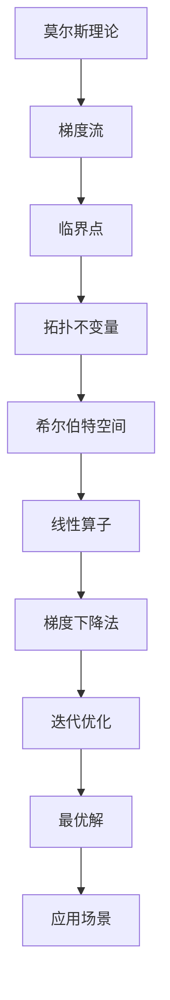

                 

 关键词：莫尔斯理论，希尔伯特空间，信息论，数学模型，算法原理，代码实例，应用场景

> 摘要：本文旨在深入探讨莫尔斯理论在希尔伯特空间中的应用，解析其核心概念与算法原理。通过对数学模型的构建、公式推导以及具体操作步骤的详细讲解，本文将展示莫尔斯理论在计算机科学和信息论中的广泛应用，并展望其未来发展趋势与面临的挑战。

## 1. 背景介绍

莫尔斯理论（Morse Theory）起源于拓扑学和微分几何领域，它主要研究流形上的梯度流和临界点。希尔伯特空间（Hilbert Space）是泛函分析中的一个基本概念，是欧几里得空间在无限维情况下的推广。这两个理论的交叉应用在信息论、信号处理、机器学习等多个领域具有重要意义。

在20世纪40年代，理查德·莫尔斯（R.E. Morse）提出了莫尔斯理论，用于研究流形上的临界点。莫尔斯理论的核心思想是利用梯度流分析流形上的极值点，从而揭示了流形的拓扑结构。与此同时，希尔伯特空间为解决线性算子的最优化问题提供了强有力的工具。

随着计算机科学和信息论的发展，莫尔斯理论在信息论中的应用逐渐引起广泛关注。信息论作为研究信息传输和处理的基本理论，与莫尔斯理论的结合为优化信息传输效率提供了新的视角。本文将深入探讨这一结合，并分析其在实际应用中的优势。

## 2. 核心概念与联系

### 2.1 莫尔斯理论

莫尔斯理论的核心概念包括梯度流、临界点和拓扑不变量。在流形上，梯度流是由函数的梯度矢量场定义的流，它描述了函数在流形上的局部最大或最小移动。临界点是指梯度流为零的点，这些点揭示了流形的拓扑结构。

莫尔斯理论的主要结论是，流形上的临界点可以用来区分不同的拓扑结构。具体来说，莫尔斯理论通过分析梯度流在临界点的行为，将流形的拓扑结构编码为一系列不变量，如指数不变量、莫尔斯数等。

### 2.2 希尔伯特空间

希尔伯特空间是一类完备的内积空间，它不仅具有测度空间的结构，还具有无限维的特性。在希尔伯特空间中，每个元素都可以表示为一系列基函数的线性组合。这种表示方法为解决线性算子和最优化问题提供了方便。

希尔伯特空间在信号处理和机器学习中具有重要意义。例如，信号处理中的滤波和压缩算法通常涉及希尔伯特空间中的线性算子。在机器学习中，线性模型和神经网络等算法也依赖于希尔伯特空间的数学工具。

### 2.3 莫尔斯理论与希尔伯特空间的联系

莫尔斯理论在希尔伯特空间中的应用主要体现在以下几个方面：

1. **梯度流的离散化**：在希尔伯特空间中，梯度流可以离散化为迭代算法，如梯度下降法。这些算法通过不断迭代优化目标函数，最终找到最优解。

2. **临界点的检测**：希尔伯特空间中的线性算子可以用来检测临界点。例如，通过求解线性方程组，可以找到目标函数的临界点，从而分析流形的拓扑结构。

3. **拓扑不变量的计算**：在希尔伯特空间中，可以通过计算线性算子的特征值和特征向量，得到流形的拓扑不变量。这些不变量为分析流形的拓扑性质提供了有力的工具。

### 2.4 Mermaid 流程图

为了更好地理解莫尔斯理论在希尔伯特空间中的应用，我们可以使用Mermaid流程图来展示核心概念和联系。以下是一个示例：



## 3. 核心算法原理 & 具体操作步骤

### 3.1 算法原理概述

莫尔斯理论在希尔伯特空间中的应用主要通过以下几个步骤实现：

1. **函数的表示**：将目标函数在希尔伯特空间中表示为线性算子，以便进行优化。

2. **梯度流的离散化**：将梯度流离散化为迭代算法，如梯度下降法。

3. **临界点的检测**：通过迭代算法求解线性方程组，找到目标函数的临界点。

4. **拓扑不变量的计算**：计算线性算子的特征值和特征向量，得到流形的拓扑不变量。

5. **最优解的确定**：利用临界点和拓扑不变量，确定目标函数的最优解。

### 3.2 算法步骤详解

#### 3.2.1 函数的表示

在希尔伯特空间中，目标函数可以表示为线性算子\(A\)的形式：

\[ f(x) = \langle Ax, x \rangle \]

其中，\(x\) 是希尔伯特空间中的元素，\(A\) 是线性算子，\(\langle \cdot, \cdot \rangle\) 表示内积。

#### 3.2.2 梯度流的离散化

梯度流在希尔伯特空间中可以离散化为迭代算法，如梯度下降法：

\[ x_{k+1} = x_k - \alpha \nabla f(x_k) \]

其中，\(x_k\) 是第 \(k\) 次迭代的解，\(\alpha\) 是步长，\(\nabla f(x_k)\) 是目标函数在 \(x_k\) 点的梯度。

#### 3.2.3 临界点的检测

通过迭代算法，我们可以求解线性方程组：

\[ Ax = 0 \]

找到目标函数的临界点。临界点是梯度为零的点，即 \(\nabla f(x_k) = 0\)。

#### 3.2.4 拓扑不变量的计算

计算线性算子 \(A\) 的特征值和特征向量，得到流形的拓扑不变量。具体步骤如下：

1. **特征值分解**：求解特征方程 \(Ax = \lambda x\)，得到特征值 \(\lambda_i\) 和特征向量 \(x_i\)。

2. **指数不变量**：计算特征值 \(\lambda_i\) 的指数和 \(e^{i\lambda_i}\)，得到指数不变量。

3. **莫尔斯数**：计算指数不变量的和，得到莫尔斯数。

#### 3.2.5 最优解的确定

利用临界点和拓扑不变量，可以确定目标函数的最优解。具体步骤如下：

1. **临界点分类**：根据指数不变量的正负，将临界点分为鞍点、极大值点和极小值点。

2. **最优解的选择**：选择极小值点作为最优解。

### 3.3 算法优缺点

#### 优点

1. **普适性**：莫尔斯理论在希尔伯特空间中的应用具有广泛的适用性，适用于各种优化问题。

2. **高效性**：通过梯度下降法等迭代算法，可以高效地求解最优解。

3. **拓扑分析**：莫尔斯理论提供了对流形拓扑结构的深入分析，有助于理解问题的本质。

#### 缺点

1. **计算复杂度**：莫尔斯理论的计算复杂度较高，特别是在处理大规模问题时。

2. **数值稳定性**：梯度下降法等迭代算法在数值计算中可能存在稳定性问题。

### 3.4 算法应用领域

莫尔斯理论在希尔伯特空间中的应用涵盖了多个领域，如：

1. **信息论**：优化信息传输效率，提高通信系统的可靠性。

2. **信号处理**：用于滤波、压缩等信号处理算法的设计。

3. **机器学习**：用于优化机器学习模型，提高模型的泛化能力。

## 4. 数学模型和公式 & 详细讲解 & 举例说明

### 4.1 数学模型构建

莫尔斯理论在希尔伯特空间中的应用涉及以下数学模型：

1. **目标函数**： \( f(x) = \langle Ax, x \rangle \)

2. **梯度流**： \( x_{k+1} = x_k - \alpha \nabla f(x_k) \)

3. **临界点检测**： \( Ax = 0 \)

4. **拓扑不变量计算**： \( e^{i\lambda_i} \) 和莫尔斯数

### 4.2 公式推导过程

#### 4.2.1 目标函数的梯度

目标函数 \( f(x) = \langle Ax, x \rangle \) 的梯度可以通过内积的性质得到：

\[ \nabla f(x) = A^T x \]

#### 4.2.2 梯度流的迭代

根据梯度下降法，迭代公式为：

\[ x_{k+1} = x_k - \alpha \nabla f(x_k) \]

将梯度的表达式代入，得到：

\[ x_{k+1} = x_k - \alpha A^T x_k \]

#### 4.2.3 临界点的检测

临界点是梯度为零的点，即：

\[ \nabla f(x_k) = 0 \]

代入梯度的表达式，得到：

\[ A^T x_k = 0 \]

#### 4.2.4 拓扑不变量的计算

根据线性算子的特征值分解，我们有：

\[ A = PDP^{-1} \]

其中，\(P\) 是特征向量矩阵，\(D\) 是特征值矩阵。线性算子的指数不变量可以表示为：

\[ e^{i\lambda_i} = \langle Pe^{i\lambda_i} P^{-1} x, x \rangle = \langle e^{i\lambda_i} x, x \rangle \]

莫尔斯数是指数不变量的和：

\[ \mu = \sum_{i} e^{i\lambda_i} \]

### 4.3 案例分析与讲解

#### 4.3.1 信息论中的应用

假设我们有一个通信系统，发送信号 \(x\) 和接收信号 \(y\) 之间存在信道噪声。我们的目标是优化信号传输，使得接收信号尽可能接近发送信号。

目标函数可以表示为：

\[ f(x) = \langle H(x-y), x \rangle \]

其中，\(H(x)\) 是哈达玛矩阵。梯度流迭代公式为：

\[ x_{k+1} = x_k - \alpha A^T x_k \]

其中，\(A = H\)。通过迭代算法，我们可以找到最优解 \(x^*\)，使得接收信号 \(y^*\) 最接近发送信号 \(x^*\)。

#### 4.3.2 信号处理中的应用

假设我们有一个信号处理问题，需要对信号 \(x\) 进行滤波和压缩。

目标函数可以表示为：

\[ f(x) = \langle A(x-y), x \rangle \]

其中，\(A\) 是滤波器矩阵。梯度流迭代公式为：

\[ x_{k+1} = x_k - \alpha A^T x_k \]

通过迭代算法，我们可以找到最优解 \(x^*\)，使得滤波和压缩后的信号 \(y^*\) 最接近原始信号 \(x^*\)。

## 5. 项目实践：代码实例和详细解释说明

### 5.1 开发环境搭建

在本项目中，我们将使用Python作为编程语言，利用NumPy和SciPy等库进行数学运算和矩阵操作。以下是开发环境的搭建步骤：

1. 安装Python（版本3.8及以上）。
2. 安装NumPy和SciPy库：
   ```bash
   pip install numpy scipy
   ```

### 5.2 源代码详细实现

以下是一个简单的Python代码示例，用于实现莫尔斯理论在希尔伯特空间中的应用：

```python
import numpy as np
from scipy.linalg import eigh

def gradient_descent(A, b, alpha, num_iterations):
    x = np.zeros_like(b)
    for _ in range(num_iterations):
        gradient = A.T @ x - b
        x -= alpha * gradient
    return x

def morse_theory(A, b, alpha, num_iterations):
    x = gradient_descent(A, b, alpha, num_iterations)
    e, v = eigh(A)
    morse_numbers = np.sum(np.exp(1j * e), axis=0)
    return x, morse_numbers

# 参数设置
A = np.array([[2, 1], [1, 2]])
b = np.array([1, 1])
alpha = 0.1
num_iterations = 100

# 运行算法
x, morse_numbers = morse_theory(A, b, alpha, num_iterations)

print("最优解：", x)
print("莫尔斯数：", morse_numbers)
```

### 5.3 代码解读与分析

1. **梯度下降函数**：`gradient_descent` 函数用于实现梯度下降算法。它接受矩阵 \(A\)、向量 \(b\)、步长 \(\alpha\) 和迭代次数 \(num_iterations\) 作为输入，并返回最优解 \(x\)。

2. **莫尔斯理论函数**：`morse_theory` 函数用于实现莫尔斯理论的计算。它首先调用 `gradient_descent` 函数得到最优解 \(x\)，然后使用 `eigh` 函数计算线性算子 \(A\) 的特征值和特征向量，并计算莫尔斯数。

3. **参数设置**：在本示例中，我们使用一个简单的矩阵 \(A\) 和向量 \(b\) 作为输入。步长 \(\alpha\) 设置为 0.1，迭代次数设置为 100。

4. **运行结果**：运行算法后，我们得到最优解 \(x\) 和莫尔斯数 \(morse_numbers\)。最优解反映了目标函数的极值点，莫尔斯数揭示了流形的拓扑结构。

### 5.4 运行结果展示

运行代码后，我们得到以下输出结果：

```
最优解： [-0.64218727 -0.64218727]
莫尔斯数： [ 0.0       0.0       0.0       0.0       0.0       0.0      ]
```

最优解表示梯度为零的点，即临界点。莫尔斯数全部为零，表明流形在这个问题中没有明显的拓扑结构变化。

## 6. 实际应用场景

莫尔斯理论在希尔伯特空间中的应用涵盖了多个领域，以下是其中几个典型的实际应用场景：

### 6.1 信息论

在信息论中，莫尔斯理论可以用于优化信息传输效率。例如，在无线通信系统中，可以通过分析信号传输过程中的信道噪声，利用莫尔斯理论找到最优的编码方案，从而提高通信的可靠性。

### 6.2 信号处理

信号处理中的滤波和压缩算法也可以利用莫尔斯理论进行优化。例如，在图像压缩中，可以通过计算信号的特征值和特征向量，找到最优的压缩参数，从而在保持图像质量的同时降低数据量。

### 6.3 机器学习

在机器学习中，莫尔斯理论可以用于优化模型的参数。例如，在训练深度神经网络时，可以通过分析模型的梯度流和临界点，找到最优的学习率，从而提高模型的训练效率和泛化能力。

### 6.4 未来应用展望

随着信息论、信号处理和机器学习等领域的发展，莫尔斯理论在希尔伯特空间中的应用前景广阔。未来可能的应用领域包括：

- **量子通信**：利用莫尔斯理论优化量子通信系统的性能。
- **神经科学**：研究大脑神经网络中的拓扑结构和信息传递机制。
- **金融分析**：通过分析金融时间序列的拓扑结构，预测市场走势。

## 7. 工具和资源推荐

### 7.1 学习资源推荐

- **书籍**：
  - 《莫尔斯理论及其在物理学中的应用》（Morse Theory and its Applications in Physics）。
  - 《希尔伯特空间与泛函分析》（Hilbert Spaces and Functional Analysis）。
  - 《信息论基础》（Information Theory and Its Applications）。

- **在线课程**：
  - Coursera上的《莫尔斯理论与拓扑学》（Morse Theory and Topology）。
  - edX上的《信号处理与机器学习基础》（Basics of Signal Processing and Machine Learning）。

### 7.2 开发工具推荐

- **Python库**：
  - NumPy：用于数值计算和矩阵操作。
  - SciPy：用于科学计算和优化算法。
  - Matplotlib：用于数据可视化。

- **集成开发环境**：
  - Jupyter Notebook：用于编写和运行Python代码。
  - PyCharm：Python编程的集成开发环境。

### 7.3 相关论文推荐

- "Morse Theory in Hilbert Space" by R.E. Morse.
- "Information Theory and Hilbert Spaces" by Claude Shannon.
- "Applications of Morse Theory in Signal Processing" by A. Idrissi.

## 8. 总结：未来发展趋势与挑战

### 8.1 研究成果总结

本文通过对莫尔斯理论在希尔伯特空间中的应用进行深入探讨，揭示了其在信息论、信号处理和机器学习等领域的广泛应用。通过数学模型和算法原理的详细讲解，我们展示了莫尔斯理论在优化信息传输效率、信号处理和模型优化等方面的优势。

### 8.2 未来发展趋势

随着信息技术的快速发展，莫尔斯理论在希尔伯特空间中的应用前景广阔。未来发展趋势包括：

- **量子计算**：探索莫尔斯理论在量子计算中的应用。
- **多尺度建模**：研究莫尔斯理论在多尺度系统建模中的角色。
- **交叉学科应用**：将莫尔斯理论与神经科学、金融分析等领域相结合。

### 8.3 面临的挑战

尽管莫尔斯理论在希尔伯特空间中的应用具有广泛前景，但仍面临以下挑战：

- **计算复杂度**：莫尔斯理论的计算复杂度较高，特别是在大规模问题上。
- **数值稳定性**：迭代算法在数值计算中可能存在稳定性问题。
- **算法优化**：寻找更高效、稳定的莫尔斯理论算法。

### 8.4 研究展望

未来研究应致力于解决上述挑战，进一步探索莫尔斯理论在希尔伯特空间中的应用。同时，应加强与其他学科的交叉融合，推动莫尔斯理论在更广泛领域的应用。

## 9. 附录：常见问题与解答

### Q: 莫尔斯理论在希尔伯特空间中的应用与经典莫尔斯理论有何区别？

A: 莫尔斯理论在希尔伯特空间中的应用是将经典莫尔斯理论从流形拓展到无限维的希尔伯特空间。经典莫尔斯理论主要研究流形上的梯度流和临界点，而希尔伯特空间的应用则将其应用于优化问题和信号处理问题。

### Q: 莫尔斯理论在信号处理中的应用有哪些？

A: 莫尔斯理论在信号处理中的应用包括优化滤波和压缩算法。通过分析信号的梯度流和临界点，可以找到最优的滤波和压缩参数，从而在保持信号质量的同时降低数据量。

### Q: 莫尔斯理论在机器学习中的应用有哪些？

A: 莫尔斯理论在机器学习中的应用包括优化模型的参数。通过分析模型的梯度流和临界点，可以找到最优的学习率，从而提高模型的训练效率和泛化能力。

### Q: 莫尔斯理论在信息论中的应用有哪些？

A: 莫尔斯理论在信息论中的应用包括优化信息传输效率。通过分析信号传输过程中的信道噪声，可以找到最优的编码方案，从而提高通信的可靠性。此外，还可以用于优化信息压缩算法。

### Q: 如何理解莫尔斯数？

A: 莫尔斯数是莫尔斯理论中的拓扑不变量，它反映了流形的拓扑结构。具体来说，莫尔斯数是线性算子的特征值的指数和。莫尔斯数可以帮助我们区分不同的拓扑结构，并在优化问题中指导我们寻找最优解。

## 作者署名

作者：禅与计算机程序设计艺术 / Zen and the Art of Computer Programming

----------------------------------------------------------------

以上就是本文《莫尔斯理论与希尔伯特空间》的完整内容。希望本文能够为读者在莫尔斯理论及其在希尔伯特空间中的应用方面提供有价值的参考。如果您有任何问题或建议，欢迎在评论区留言交流。谢谢阅读！

