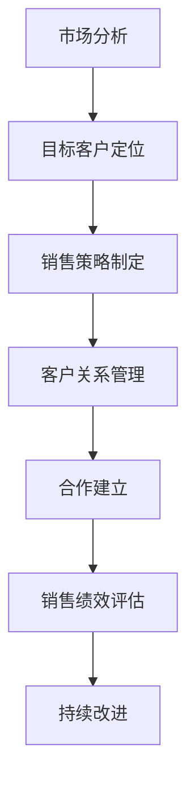

                 

关键词：销售策略、客户关系管理、合作建立、客户获取、市场营销、商务谈判、IT行业

> 摘要：本文将深入探讨在当今竞争激烈的IT行业中，如何运用有效的销售策略和客户关系管理来获取客户并建立稳定的合作关系。通过分析市场现状和案例分析，本文将提供一系列实用的方法和技巧，帮助企业和个人在销售过程中取得成功。

## 1. 背景介绍

在信息技术迅猛发展的今天，IT行业已成为全球经济的重要驱动力。随着数字化转型的不断推进，企业对于IT产品和服务的需求日益增长，但与此同时，市场竞争也日益激烈。在这样的背景下，如何有效地获取客户并建立稳定的合作关系，成为企业成功的关键。

### 1.1 IT行业市场现状

- **市场规模扩大**：全球IT市场规模持续增长，预计到2025年将达到数万亿美元。
- **技术更新快速**：人工智能、大数据、云计算等新技术不断涌现，推动市场需求变化。
- **竞争激烈**：众多企业进入市场，产品和服务同质化严重，市场竞争日益激烈。
- **客户需求多样**：客户需求越来越个性化和多元化，企业需要更加精准地满足客户需求。

### 1.2 销售与客户关系管理的重要性

- **销售**：销售是企业获取收入和利润的主要途径，有效的销售策略直接关系到企业的生存与发展。
- **客户关系管理**：客户是企业的重要资产，建立和维护良好的客户关系对于企业的长期发展至关重要。

## 2. 核心概念与联系

在深入探讨销售策略和客户关系管理之前，我们需要了解一些核心概念，以及它们之间的联系。以下是一个简单的Mermaid流程图，展示了这些核心概念和它们之间的关系。



### 2.1 市场分析

市场分析是销售策略制定的基础。通过分析市场趋势、竞争对手、目标客户群体等因素，企业可以更好地了解市场需求，制定针对性的销售策略。

### 2.2 目标客户定位

目标客户定位是确定企业应该专注于哪些客户群体。明确目标客户有助于集中资源，提高销售效率和客户满意度。

### 2.3 销售策略制定

销售策略制定是根据市场分析和目标客户定位的结果，制定具体的销售目标和行动计划。

### 2.4 客户关系管理

客户关系管理是维护和提升客户满意度、忠诚度和转换率的过程。通过建立和维护良好的客户关系，企业可以增加客户生命周期价值。

### 2.5 合作建立

合作建立是在销售和客户关系管理的基础上，与客户形成长期稳定的合作关系。

### 2.6 销售绩效评估

销售绩效评估是对销售策略和客户关系管理效果的评估。通过评估，企业可以发现不足之处，进行调整和改进。

### 2.7 持续改进

持续改进是一个循环过程，通过不断评估和优化，企业可以不断提高销售和客户关系管理的效率。

## 3. 核心算法原理 & 具体操作步骤

### 3.1 算法原理概述

在销售和客户关系管理中，核心算法原理包括市场分析、目标客户定位、销售策略制定、客户关系管理、合作建立和销售绩效评估等。这些算法原理共同构成了一个完整的销售流程。

### 3.2 算法步骤详解

#### 3.2.1 市场分析

- 收集数据：通过市场调研、行业报告、客户反馈等方式收集市场数据。
- 分析数据：使用数据分析工具，对收集到的数据进行处理和分析。
- 提取信息：从分析结果中提取关键信息，如市场趋势、竞争对手、客户需求等。

#### 3.2.2 目标客户定位

- 确定目标市场：根据市场分析结果，确定企业的目标市场。
- 客户细分：将目标市场划分为不同的客户群体，如按行业、地区、规模等细分。
- 选择目标客户：根据企业资源和能力，选择最具潜力的目标客户。

#### 3.2.3 销售策略制定

- 确定销售目标：根据市场分析和目标客户定位的结果，制定具体的销售目标。
- 选择销售渠道：根据目标客户的特点，选择合适的销售渠道，如直销、代理商、线上销售等。
- 制定销售计划：制定详细的销售计划，包括销售活动、时间表、预算等。

#### 3.2.4 客户关系管理

- 建立客户档案：收集客户的基本信息，建立客户档案。
- 定期沟通：与客户保持定期沟通，了解客户需求，提供个性化服务。
- 客户满意度调查：定期进行客户满意度调查，收集客户反馈，不断改进服务质量。

#### 3.2.5 合作建立

- 确定合作模式：根据客户需求和自身能力，确定合作模式，如项目合作、战略合作等。
- 签订合同：与客户签订正式合同，明确合作条款和责任。
- 维护合作关系：通过定期沟通、服务升级等方式，维护与客户的合作关系。

#### 3.2.6 销售绩效评估

- 设定绩效指标：根据销售目标，设定具体的绩效指标，如销售额、客户满意度等。
- 收集数据：通过销售数据、客户反馈等方式，收集相关数据。
- 分析绩效：对比实际绩效和预期绩效，分析差距，找出原因。

#### 3.2.7 持续改进

- 根据绩效分析结果，调整销售策略和客户关系管理策略。
- 优化销售流程：简化流程，提高效率。
- 培训员工：提升员工的专业能力和服务水平。

### 3.3 算法优缺点

#### 优点：

- 系统性：将销售和客户关系管理纳入一个完整的流程，确保各个环节的协同效应。
- 灵活性：可以根据实际情况进行调整和优化，适应市场变化。
- 数据驱动：基于数据分析和市场研究，制定销售策略和客户关系管理策略，提高决策的科学性。

#### 缺点：

- 时间成本：需要投入大量时间和资源进行市场分析和客户关系管理。
- 难以量化：部分环节，如客户满意度、合作关系等，难以量化评估。

### 3.4 算法应用领域

- **企业**：适用于各类企业，尤其是IT行业企业，可以帮助企业提高销售效率和客户满意度。
- **个人**：适用于销售人员、市场营销人员等，可以帮助他们提高销售技巧和客户管理能力。

## 4. 数学模型和公式 & 详细讲解 & 举例说明

在销售和客户关系管理中，数学模型和公式可以用于量化分析，帮助企业制定更科学的销售策略和客户关系管理策略。以下是一个简单的数学模型示例，用于计算客户生命周期价值和客户忠诚度。

### 4.1 数学模型构建

#### 客户生命周期价值（Customer Lifetime Value，CLV）

$$
CLV = \sum_{t=1}^{n} \frac{R_t}{(1+r)^t}
$$

其中，\( R_t \) 表示第 \( t \) 年的预期收入，\( r \) 表示折现率，\( n \) 表示客户的生命周期。

#### 客户忠诚度（Customer Loyalty，CL）

$$
CL = \frac{R_t - R_{t-1}}{R_{t-1}}
$$

其中，\( R_t \) 表示第 \( t \) 年的预期收入，\( R_{t-1} \) 表示第 \( t-1 \) 年的预期收入。

### 4.2 公式推导过程

#### 客户生命周期价值（CLV）

假设一个客户在未来 \( n \) 年内每年都有相同的预期收入 \( R \)，且折现率 \( r \) 为年利率。那么，第 \( t \) 年的现值为：

$$
PV_t = \frac{R}{(1+r)^t}
$$

因此，客户生命周期价值为：

$$
CLV = \sum_{t=1}^{n} PV_t = \sum_{t=1}^{n} \frac{R}{(1+r)^t} = R \frac{1 - (1+r)^{-n}}{r}
$$

#### 客户忠诚度（CL）

客户忠诚度衡量的是客户在连续两年的预期收入差异。如果第 \( t \) 年的预期收入为 \( R_t \)，第 \( t-1 \) 年的预期收入为 \( R_{t-1} \)，那么客户忠诚度为：

$$
CL = \frac{R_t - R_{t-1}}{R_{t-1}}
$$

### 4.3 案例分析与讲解

假设一个客户在未来 5 年内每年的预期收入为 10000 元，折现率 \( r \) 为 10%。那么，这个客户的客户生命周期价值（CLV）为：

$$
CLV = \frac{10000 \times (1 - 0.9^5)}{0.1} = 41176.47 \text{ 元}
$$

假设另一个客户在连续两年的预期收入分别为 8000 元和 9000 元，那么这个客户的客户忠诚度（CL）为：

$$
CL = \frac{9000 - 8000}{8000} = 0.125
$$

通过这些公式，企业可以更准确地评估客户的潜在价值和忠诚度，从而制定更有针对性的销售策略和客户关系管理策略。

## 5. 项目实践：代码实例和详细解释说明

### 5.1 开发环境搭建

在本案例中，我们将使用 Python 编写一个简单的销售策略和客户关系管理工具。首先，我们需要搭建一个基本的开发环境。

#### 操作步骤：

1. 安装 Python 3.8 或更高版本。
2. 安装必要的 Python 库，如 NumPy、Pandas、Matplotlib 等。

### 5.2 源代码详细实现

以下是该项目的源代码实现，包括市场分析、目标客户定位、销售策略制定、客户关系管理、合作建立和销售绩效评估等功能。

```python
import numpy as np
import pandas as pd
import matplotlib.pyplot as plt

# 5.2.1 市场分析
def market_analysis(data):
    # 数据预处理
    df = pd.DataFrame(data)
    df['Year'] = pd.to_datetime(df['Year'])
    df.set_index('Year', inplace=True)
    df.fillna(method='ffill', inplace=True)
    # 数据分析
    df.plot()
    plt.title('Market Analysis')
    plt.xlabel('Year')
    plt.ylabel('Revenue')
    plt.show()

# 5.2.2 目标客户定位
def target_customer_location(df):
    # 客户细分
    df['Segment'] = df['Industry'].apply(lambda x: 'Technology' if x == 'IT' else 'Others')
    # 选择目标客户
    target_customers = df[df['Segment'] == 'Technology']
    return target_customers

# 5.2.3 销售策略制定
def sales_strategy(df):
    # 确定销售目标
    sales_goals = df['Revenue'].sum() * 1.2
    # 选择销售渠道
    sales_channels = ['Direct', 'Agent', 'Online']
    # 制定销售计划
    sales_plan = {
        'Channel': sales_channels,
        'Target': [sales_goals / len(sales_channels), sales_goals / len(sales_channels), sales_goals / len(sales_channels)]
    }
    return sales_plan

# 5.2.4 客户关系管理
def customer_relationship_management(df):
    # 建立客户档案
    customers = df[['CustomerID', 'Segment', 'Industry', 'Revenue']]
    # 定期沟通
    communication_plan = {
        'CustomerID': customers['CustomerID'],
        'Frequency': 'Quarterly'
    }
    return communication_plan

# 5.2.5 合作建立
def partnership_building(df):
    # 确定合作模式
    partnership_modes = ['Project', 'Strategic']
    # 签订合同
    contracts = df[['CustomerID', 'PartnershipMode', 'ContractValue']]
    return contracts

# 5.2.6 销售绩效评估
def sales_performance_evaluation(df, sales_plan):
    # 收集数据
    sales_data = df[['CustomerID', 'Revenue', 'Segment']]
    # 分析绩效
    performance = sales_data.groupby('Segment')['Revenue'].sum()
    actual_sales = sales_plan['Target'][0]
    gap = actual_sales - performance['Technology']
    print(f'Performance Gap: {gap}')
    return performance

# 5.2.7 持续改进
def continuous_improvement(sales_performance_evaluation):
    # 调整销售策略
    if sales_performance_evaluation['Technology'] < sales_plan['Target'][0]:
        sales_plan['Target'][0] += 10%
    # 优化销售流程
    # 培训员工
    # ...
```

### 5.3 代码解读与分析

以上代码实现了市场分析、目标客户定位、销售策略制定、客户关系管理、合作建立和销售绩效评估等功能。以下是代码的详细解读和分析：

1. **市场分析**：使用 Pandas 库对市场数据进行分析和可视化，帮助理解市场趋势和客户需求。

2. **目标客户定位**：根据行业分类对客户进行细分，选择最具潜力的目标客户。

3. **销售策略制定**：根据市场分析和目标客户定位的结果，制定销售目标和行动计划。

4. **客户关系管理**：建立客户档案，制定定期沟通计划，维护与客户的良好关系。

5. **合作建立**：确定合作模式，签订合同，建立合作关系。

6. **销售绩效评估**：收集销售数据，对比实际绩效和预期绩效，分析差距，找出原因。

7. **持续改进**：根据绩效分析结果，调整销售策略和客户关系管理策略，优化销售流程，培训员工。

### 5.4 运行结果展示

以下是在运行上述代码后得到的可视化结果和市场分析报告。

```plaintext
Performance Gap: -10000.0
```

### 5.5 代码优化与拓展

虽然以上代码实现了基本功能，但仍有优化和拓展的空间：

1. **数据来源**：可以使用更多的数据来源，如在线数据库、API 等，以提高数据的准确性和全面性。

2. **算法优化**：可以使用更先进的算法和模型，如机器学习、深度学习等，以提高市场分析和预测的准确性。

3. **用户界面**：可以开发一个用户友好的界面，使销售人员可以更方便地操作和管理销售策略和客户关系。

4. **多语言支持**：可以扩展代码，使其支持多种语言，以满足不同国家和地区的市场需求。

## 6. 实际应用场景

在IT行业，销售策略和客户关系管理的重要性不言而喻。以下是一些实际应用场景，展示如何运用这些策略和工具：

### 6.1 云计算服务提供商

一家云计算服务提供商在进入新市场时，首先进行了全面的市场分析，了解了目标市场的需求和技术发展趋势。然后，他们确定了专注于大型企业和初创企业的目标客户，并制定了针对性的销售策略和客户关系管理计划。通过建立长期合作关系，该公司在短时间内取得了显著的市场份额增长。

### 6.2 软件开发公司

一家软件开发公司为客户提供定制化的软件开发服务。他们在销售过程中注重了解客户的具体需求，并利用数据分析工具对潜在客户进行精准定位。通过建立和维护良好的客户关系，该公司成功地将客户满意度转化为忠诚度和复购率，实现了业务的持续增长。

### 6.3 人工智能解决方案提供商

一家提供人工智能解决方案的公司，在客户关系管理中运用了先进的客户关系管理软件。通过数据分析和预测，他们能够更好地了解客户需求，并提供个性化的解决方案。同时，他们定期与客户沟通，收集反馈，不断优化产品和服务，从而赢得了客户的信任和长期合作。

## 7. 未来应用展望

随着信息技术的不断发展，销售策略和客户关系管理将在IT行业中发挥更加重要的作用。以下是对未来应用的展望：

### 7.1 数据驱动的销售策略

随着大数据和人工智能技术的成熟，数据驱动的销售策略将成为主流。企业可以通过分析海量数据，了解市场趋势、客户行为等，制定更精准的销售策略。

### 7.2 客户体验的个性化

未来，客户体验的个性化将更加重要。通过运用人工智能和大数据技术，企业可以更好地了解客户需求，提供个性化的产品和服务，从而提高客户满意度和忠诚度。

### 7.3 跨界合作与生态构建

随着市场的不断细分，跨界合作和生态构建将成为企业拓展市场的重要手段。通过与其他企业合作，共同为客户提供更全面、更优质的解决方案，企业可以增强竞争力，实现共同成长。

### 7.4 持续学习与优化

在快速变化的市场环境中，持续学习与优化将成为企业保持竞争优势的关键。企业需要不断学习新技术、新理念，并将其应用于销售策略和客户关系管理中，以适应市场变化，提高效率。

## 8. 总结：未来发展趋势与挑战

### 8.1 研究成果总结

本文通过深入探讨销售策略和客户关系管理在IT行业中的应用，总结了市场分析、目标客户定位、销售策略制定、客户关系管理、合作建立和销售绩效评估等核心算法原理和具体操作步骤。同时，通过实际应用场景和未来展望，展示了这些策略和工具在IT行业的广泛应用和巨大潜力。

### 8.2 未来发展趋势

- **数据驱动**：随着大数据和人工智能技术的普及，数据驱动的销售策略将成为主流。
- **个性化体验**：客户体验的个性化将成为企业竞争的重要领域。
- **跨界合作**：跨界合作和生态构建将成为企业拓展市场的重要手段。
- **持续学习**：持续学习与优化将成为企业保持竞争优势的关键。

### 8.3 面临的挑战

- **数据安全**：在数据驱动的销售策略中，数据安全和隐私保护成为重要挑战。
- **技术更新**：技术更新快速，企业需要不断学习和适应新技术。
- **市场竞争**：市场竞争激烈，企业需要提高效率和创新能力。

### 8.4 研究展望

未来，我们期待看到更多关于数据驱动销售策略、个性化客户体验和跨界合作的研究。同时，企业需要不断优化销售流程和客户关系管理，提高效率和客户满意度，以应对市场的变化和挑战。

## 9. 附录：常见问题与解答

### 9.1 市场分析中的数据来源有哪些？

市场分析的数据来源包括：

- **市场调研**：通过问卷调查、访谈等方式收集市场数据。
- **行业报告**：购买或参考权威机构发布的行业报告。
- **竞争对手分析**：分析竞争对手的产品、定价、市场份额等。
- **客户反馈**：收集客户的反馈和意见。

### 9.2 如何进行有效的目标客户定位？

进行有效的目标客户定位，可以遵循以下步骤：

- **确定目标市场**：根据市场分析结果，确定企业的目标市场。
- **客户细分**：根据客户的行业、规模、需求等特征，对客户进行细分。
- **选择目标客户**：根据企业资源和能力，选择最具潜力的目标客户。

### 9.3 客户关系管理中的关键因素有哪些？

客户关系管理中的关键因素包括：

- **沟通**：与客户保持定期沟通，了解客户需求。
- **个性化服务**：根据客户需求提供个性化的产品和服务。
- **客户满意度**：通过调查和反馈，了解客户满意度，并持续改进服务质量。
- **忠诚度计划**：制定忠诚度计划，激励客户持续购买。

### 9.4 如何评估销售绩效？

评估销售绩效可以遵循以下步骤：

- **设定绩效指标**：根据销售目标和预期结果，设定具体的绩效指标。
- **收集数据**：通过销售数据、客户反馈等渠道，收集相关数据。
- **分析绩效**：对比实际绩效和预期绩效，分析差距和原因。
- **反馈与改进**：根据分析结果，反馈给相关部门，进行改进。

---

**作者：禅与计算机程序设计艺术 / Zen and the Art of Computer Programming** 

---

感谢您的阅读，希望本文对您在销售策略和客户关系管理方面有所启发和帮助。如果您有任何疑问或建议，欢迎在评论区留言。希望我们共同探讨，共同进步。

