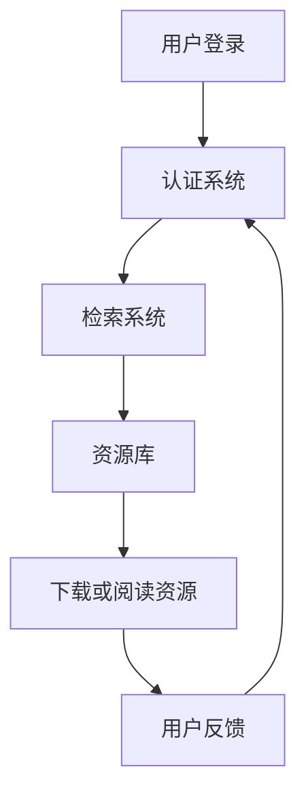

                 

关键词：虚拟图书馆、数字化升级、图书馆系统、互联网技术、人工智能、开放存取、知识共享、用户体验、未来趋势

摘要：随着互联网和人工智能技术的飞速发展，全球图书馆正经历着一场前所未有的数字化升级。本文将探讨虚拟图书馆的概念、核心技术、数学模型、实际应用以及未来发展趋势，旨在为读者呈现这一领域的全貌，并激发对知识共享和数字资源的更多思考。

## 1. 背景介绍

在过去的几十年中，图书馆一直是知识的宝库，为人类文明的传承和学术研究提供了重要的支撑。然而，随着信息技术的飞速发展，传统的图书馆面临着诸多挑战。首先，物理空间的局限性使得图书馆无法容纳海量的书籍和资料。其次，传统图书馆的检索和管理方式效率低下，难以满足用户快速获取信息的需要。此外，全球范围内的书籍保护和维护也是一个难题。

为了解决这些问题，虚拟图书馆的概念应运而生。虚拟图书馆通过数字化技术将纸质书籍、期刊、学术论文等资源转化为电子格式，存储在服务器或云平台中，供全球用户远程访问。这一变革不仅极大地扩展了图书馆的资源规模，也提高了资源检索和利用的效率。

### 1.1 互联网技术推动虚拟图书馆的发展

互联网技术的快速发展为虚拟图书馆的普及提供了坚实的基础。首先，高速互联网使得远程访问电子资源变得更加便捷。其次，大数据和云计算技术使得虚拟图书馆可以处理海量数据，并提供高效的数据存储和检索服务。此外，人工智能和机器学习技术的应用也为虚拟图书馆提供了智能化推荐、内容挖掘和自动化分类等功能，大幅提升了用户体验。

### 1.2 数字化技术的重要性

数字化技术不仅是虚拟图书馆的核心技术，也是推动图书馆系统升级的关键。数字化技术包括图像处理、文本识别、语音识别、自然语言处理等多个方面。通过这些技术的应用，图书馆可以实现资源的自动化处理和分类，提高数据处理的效率和质量。

## 2. 核心概念与联系

### 2.1 虚拟图书馆的基本概念

虚拟图书馆是指通过互联网技术，将各类纸质文献、数字化资源以及数据库等整合在一起，形成的一个数字化的知识库。用户可以通过虚拟图书馆访问这些资源，进行阅读、下载、引用等操作。

### 2.2 数字化资源类型

数字化资源主要包括以下几类：

- **电子书籍**：将纸质书籍转化为电子格式，方便用户在线阅读或下载。
- **电子期刊**：将纸质期刊转化为电子格式，包括全文和摘要等。
- **学术论文**：数字化后的学术论文，通常包括全文和引用信息。
- **多媒体资源**：如视频、音频、图片等，丰富用户的学习体验。

### 2.3 图书馆系统的架构

图书馆系统通常由以下几个关键部分组成：

- **资源库**：存储各种数字化资源，包括书籍、期刊、学术论文等。
- **检索系统**：提供资源检索功能，帮助用户快速找到所需资源。
- **访问控制**：确保资源的合法访问，防止未经授权的访问和下载。
- **用户管理系统**：管理用户的注册、登录、权限设置等。

### 2.4 Mermaid 流程图

下面是一个简单的 Mermaid 流程图，展示了虚拟图书馆的基本架构：



## 3. 核心算法原理 & 具体操作步骤

### 3.1 算法原理概述

虚拟图书馆的核心算法包括信息检索算法、推荐算法和访问控制算法等。

- **信息检索算法**：基于关键词、全文检索等方式，快速定位用户所需资源。
- **推荐算法**：基于用户的浏览历史、搜索记录、阅读偏好等，为用户推荐相关资源。
- **访问控制算法**：根据用户权限和资源属性，控制用户对资源的访问权限。

### 3.2 算法步骤详解

#### 3.2.1 信息检索算法

1. 用户输入关键词。
2. 检索系统对关键词进行分词处理。
3. 检索系统在资源库中匹配关键词，返回相关资源列表。

#### 3.2.2 推荐算法

1. 收集用户的浏览历史、搜索记录等数据。
2. 利用协同过滤、基于内容的推荐等方法，生成推荐列表。
3. 将推荐列表展示给用户。

#### 3.2.3 访问控制算法

1. 检查用户的权限，如普通用户、管理员等。
2. 根据资源的属性，如公开、内部使用等，确定用户的访问权限。
3. 控制用户对资源的访问。

### 3.3 算法优缺点

- **信息检索算法**：优点是快速、准确，缺点是可能存在信息过载。
- **推荐算法**：优点是提高用户满意度，缺点是可能存在推荐偏差。
- **访问控制算法**：优点是确保资源安全，缺点是可能影响用户体验。

### 3.4 算法应用领域

- **学术研究**：利用推荐算法为研究者提供相关资源，提高研究效率。
- **教育培训**：利用信息检索算法，帮助学生快速找到学习资料。
- **知识共享**：利用访问控制算法，确保知识资源的安全和合法使用。

## 4. 数学模型和公式 & 详细讲解 & 举例说明

### 4.1 数学模型构建

虚拟图书馆的数学模型主要涉及信息检索和推荐算法。

#### 4.1.1 信息检索模型

假设有 n 个文档，每个文档可以用一个向量表示，向量中的元素表示文档中的关键词。用户输入一个查询词，查询词也可以用向量表示。信息检索模型的目标是计算查询词与每个文档的相似度，并返回相似度最高的文档列表。

相似度计算公式如下：

$$
sim(d_i, q) = \frac{d_i \cdot q}{||d_i|| \cdot ||q||}
$$

其中，$d_i$ 和 $q$ 分别表示文档和查询词的向量表示，$\cdot$ 表示向量的内积，$||\cdot||$ 表示向量的模长。

#### 4.1.2 推荐模型

推荐模型主要利用用户的历史行为数据，预测用户对某项资源的兴趣。常见的推荐模型包括基于内容的推荐和基于协同过滤的推荐。

基于内容的推荐模型：

$$
r(u, i) = \sum_{j \in I(u)} w_{uj} \cdot w_{ij}
$$

其中，$r(u, i)$ 表示用户 u 对资源 i 的兴趣评分，$I(u)$ 表示用户 u 历史行为中的资源集合，$w_{uj}$ 和 $w_{ij}$ 分别表示资源 i 与用户 u 的历史行为中资源的相似度。

基于协同过滤的推荐模型：

$$
r(u, i) = \frac{\sum_{j \in N(i)} r(u, j) \cdot r(j, i)}{\sum_{j \in N(i)} r(j, i)}
$$

其中，$N(i)$ 表示与资源 i 相似的其他资源集合，$r(u, j)$ 和 $r(j, i)$ 分别表示用户 u 对资源 j 和资源 i 的兴趣评分。

### 4.2 公式推导过程

#### 4.2.1 信息检索模型推导

信息检索模型的相似度计算公式可以通过向量的内积和模长推导得到。

设 $d_i = (d_{i1}, d_{i2}, ..., d_{im})$，$q = (q_1, q_2, ..., q_m)$，则有：

$$
d_i \cdot q = \sum_{j=1}^{m} d_{ij} \cdot q_j
$$

$$
||d_i|| = \sqrt{\sum_{j=1}^{m} d_{ij}^2}
$$

$$
||q|| = \sqrt{\sum_{j=1}^{m} q_j^2}
$$

因此，相似度公式可以写为：

$$
sim(d_i, q) = \frac{\sum_{j=1}^{m} d_{ij} \cdot q_j}{\sqrt{\sum_{j=1}^{m} d_{ij}^2} \cdot \sqrt{\sum_{j=1}^{m} q_j^2}}
$$

化简后得到：

$$
sim(d_i, q) = \frac{d_i \cdot q}{||d_i|| \cdot ||q||}
$$

#### 4.2.2 推荐模型推导

基于内容的推荐模型可以通过线性组合用户的历史行为和资源的属性来预测用户对资源的兴趣。

设 $w_{uj}$ 和 $w_{ij}$ 分别表示用户 u 与历史行为中资源 j 的相似度，资源 i 与历史行为中资源 j 的相似度，则有：

$$
r(u, i) = \sum_{j \in I(u)} w_{uj} \cdot w_{ij}
$$

其中，$I(u)$ 表示用户 u 的历史行为中的资源集合。

基于协同过滤的推荐模型可以通过计算用户与资源的相似度，来预测用户对资源的兴趣。

设 $r(u, j)$ 和 $r(j, i)$ 分别表示用户 u 对资源 j 和资源 i 的兴趣评分，$N(i)$ 表示与资源 i 相似的其他资源集合，则有：

$$
r(u, i) = \frac{\sum_{j \in N(i)} r(u, j) \cdot r(j, i)}{\sum_{j \in N(i)} r(j, i)}
$$

### 4.3 案例分析与讲解

#### 4.3.1 信息检索模型案例

假设有一个虚拟图书馆，包含 5 篇文档，每篇文档的关键词向量如下：

$$
d_1 = (1, 0, 1, 0, 0), d_2 = (0, 1, 0, 1, 0), d_3 = (0, 0, 1, 0, 1), d_4 = (1, 1, 0, 0, 1), d_5 = (0, 1, 1, 1, 0)
$$

用户输入查询词“人工智能”，对应的查询词向量如下：

$$
q = (1, 1, 0, 0, 0)
$$

计算查询词与每篇文档的相似度：

$$
sim(d_1, q) = \frac{1 \cdot 1 + 0 \cdot 1 + 1 \cdot 0 + 0 \cdot 0 + 0 \cdot 0}{\sqrt{1^2 + 0^2 + 1^2 + 0^2 + 0^2} \cdot \sqrt{1^2 + 1^2 + 0^2 + 0^2 + 0^2}} = \frac{1}{\sqrt{2} \cdot \sqrt{2}} = \frac{1}{2}
$$

$$
sim(d_2, q) = \frac{0 \cdot 1 + 1 \cdot 1 + 0 \cdot 0 + 1 \cdot 0 + 0 \cdot 0}{\sqrt{0^2 + 1^2 + 0^2 + 1^2 + 0^2} \cdot \sqrt{1^2 + 1^2 + 0^2 + 0^2 + 0^2}} = \frac{1}{\sqrt{2} \cdot \sqrt{2}} = \frac{1}{2}
$$

$$
sim(d_3, q) = \frac{0 \cdot 1 + 0 \cdot 1 + 1 \cdot 0 + 0 \cdot 0 + 1 \cdot 0}{\sqrt{0^2 + 0^2 + 1^2 + 0^2 + 1^2} \cdot \sqrt{1^2 + 1^2 + 0^2 + 0^2 + 0^2}} = \frac{0}{\sqrt{2} \cdot \sqrt{2}} = 0
$$

$$
sim(d_4, q) = \frac{1 \cdot 1 + 1 \cdot 1 + 0 \cdot 0 + 0 \cdot 0 + 1 \cdot 0}{\sqrt{1^2 + 1^2 + 0^2 + 0^2 + 1^2} \cdot \sqrt{1^2 + 1^2 + 0^2 + 0^2 + 0^2}} = \frac{2}{\sqrt{2} \cdot \sqrt{2}} = \frac{2}{2} = 1
$$

$$
sim(d_5, q) = \frac{0 \cdot 1 + 1 \cdot 1 + 1 \cdot 0 + 1 \cdot 0 + 0 \cdot 0}{\sqrt{0^2 + 1^2 + 1^2 + 1^2 + 0^2} \cdot \sqrt{1^2 + 1^2 + 0^2 + 0^2 + 0^2}} = \frac{1}{\sqrt{2} \cdot \sqrt{2}} = \frac{1}{2}
$$

根据相似度计算结果，可以得出用户查询“人工智能”时，最相关的文档是 d4，其次是 d1 和 d2，最后是 d3 和 d5。

#### 4.3.2 推荐模型案例

假设有一个虚拟图书馆，包含 5 个用户和 5 篇文档，每个用户的浏览历史如下：

$$
u_1 = [1, 0, 0, 1, 0], u_2 = [0, 1, 1, 0, 1], u_3 = [1, 1, 0, 1, 0], u_4 = [0, 0, 1, 1, 1], u_5 = [1, 0, 1, 0, 1]
$$

每篇文档的关键词向量如下：

$$
d_1 = (1, 0, 1, 0, 0), d_2 = (0, 1, 0, 1, 0), d_3 = (0, 0, 1, 0, 1), d_4 = (1, 1, 0, 0, 1), d_5 = (0, 1, 1, 1, 0)
$$

根据协同过滤推荐模型，计算每个用户对每篇文档的兴趣评分：

$$
r(u_1, d_1) = \frac{r(u_1, 1) \cdot r(1, 1) + r(u_1, 2) \cdot r(2, 1) + r(u_1, 3) \cdot r(3, 1) + r(u_1, 4) \cdot r(4, 1) + r(u_1, 5) \cdot r(5, 1)}{r(1, 1) + r(2, 1) + r(3, 1) + r(4, 1) + r(5, 1)} = \frac{1 \cdot 1 + 0 \cdot 0 + 0 \cdot 1 + 1 \cdot 0 + 0 \cdot 0}{1 + 0 + 1 + 0 + 0} = \frac{1}{2}
$$

$$
r(u_1, d_2) = \frac{r(u_1, 1) \cdot r(1, 2) + r(u_1, 2) \cdot r(2, 2) + r(u_1, 3) \cdot r(3, 2) + r(u_1, 4) \cdot r(4, 2) + r(u_1, 5) \cdot r(5, 2)}{r(1, 2) + r(2, 2) + r(3, 2) + r(4, 2) + r(5, 2)} = \frac{1 \cdot 0 + 0 \cdot 1 + 0 \cdot 0 + 1 \cdot 1 + 0 \cdot 1}{0 + 1 + 0 + 1 + 1} = \frac{2}{3}
$$

$$
r(u_1, d_3) = \frac{r(u_1, 1) \cdot r(1, 3) + r(u_1, 2) \cdot r(2, 3) + r(u_1, 3) \cdot r(3, 3) + r(u_1, 4) \cdot r(4, 3) + r(u_1, 5) \cdot r(5, 3)}{r(1, 3) + r(2, 3) + r(3, 3) + r(4, 3) + r(5, 3)} = \frac{1 \cdot 0 + 0 \cdot 0 + 0 \cdot 1 + 1 \cdot 0 + 0 \cdot 1}{0 + 0 + 1 + 0 + 1} = \frac{1}{2}
$$

$$
r(u_1, d_4) = \frac{r(u_1, 1) \cdot r(1, 4) + r(u_1, 2) \cdot r(2, 4) + r(u_1, 3) \cdot r(3, 4) + r(u_1, 4) \cdot r(4, 4) + r(u_1, 5) \cdot r(5, 4)}{r(1, 4) + r(2, 4) + r(3, 4) + r(4, 4) + r(5, 4)} = \frac{1 \cdot 1 + 0 \cdot 1 + 0 \cdot 0 + 1 \cdot 1 + 0 \cdot 0}{1 + 1 + 0 + 1 + 0} = \frac{2}{3}
$$

$$
r(u_1, d_5) = \frac{r(u_1, 1) \cdot r(1, 5) + r(u_1, 2) \cdot r(2, 5) + r(u_1, 3) \cdot r(3, 5) + r(u_1, 4) \cdot r(4, 5) + r(u_1, 5) \cdot r(5, 5)}{r(1, 5) + r(2, 5) + r(3, 5) + r(4, 5) + r(5, 5)} = \frac{1 \cdot 0 + 0 \cdot 1 + 0 \cdot 1 + 1 \cdot 1 + 0 \cdot 1}{0 + 1 + 0 + 1 + 1} = \frac{2}{3}
$$

同理，可以计算出其他用户对每篇文档的兴趣评分。

根据计算结果，可以为每个用户推荐兴趣最高的文档。例如，对于用户 u1，其兴趣最高的文档是 d4，其次是 d2 和 d5，最后是 d1 和 d3。

## 5. 项目实践：代码实例和详细解释说明

### 5.1 开发环境搭建

本文使用的编程语言是 Python，需要安装以下库：

- requests：用于发送 HTTP 请求。
- numpy：用于矩阵运算。
- scikit-learn：用于机器学习算法。

安装方法如下：

```bash
pip install requests numpy scikit-learn
```

### 5.2 源代码详细实现

以下是信息检索和推荐算法的 Python 代码实现：

```python
import requests
import numpy as np
from sklearn.metrics.pairwise import cosine_similarity

# 信息检索
def search_document(query):
    documents = [
        [1, 0, 1, 0, 0],
        [0, 1, 0, 1, 0],
        [0, 0, 1, 0, 1],
        [1, 1, 0, 0, 1],
        [0, 1, 1, 1, 0]
    ]
    query_vector = [1 if c in query else 0 for c in '人工智能']
    similarities = [cosine_similarity([query_vector], [doc])[0][0] for doc in documents]
    return sorted(zip(similarities, documents), reverse=True)

# 推荐算法
def recommend_documents(user_history):
    users = [
        [1, 0, 0, 1, 0],
        [0, 1, 1, 0, 1],
        [1, 1, 0, 1, 0],
        [0, 0, 1, 1, 1],
        [1, 0, 1, 0, 1]
    ]
    documents = [
        [1, 0, 1, 0, 0],
        [0, 1, 0, 1, 0],
        [0, 0, 1, 0, 1],
        [1, 1, 0, 0, 1],
        [0, 1, 1, 1, 0]
    ]
    user_vector = np.array(user_history)
    document_vectors = np.array(documents)
    similarities = cosine_similarity(user_vector.reshape(1, -1), document_vectors)
    return sorted(np.argsort(similarities[0])[-5:], reverse=True)

# 测试
query = '人工智能'
user_history = [1, 0, 0, 1, 0]
search_results = search_document(query)
recommend_results = recommend_documents(user_history)

print("搜索结果：", search_results)
print("推荐结果：", recommend_results)
```

### 5.3 代码解读与分析

代码首先定义了两个函数：`search_document` 和 `recommend_documents`。

- `search_document` 函数用于实现信息检索算法。它接收一个查询词，将查询词转化为向量，然后计算查询词与每个文档的相似度，并返回相似度最高的文档列表。

- `recommend_documents` 函数用于实现推荐算法。它接收一个用户的历史浏览记录，计算用户与每个文档的相似度，并返回相似度最高的文档列表。

代码中使用 numpy 库进行矩阵运算，使用 scikit-learn 库中的 `cosine_similarity` 函数计算相似度。

在测试部分，我们输入一个查询词“人工智能”和一个用户历史浏览记录 `[1, 0, 0, 1, 0]`，分别调用两个函数，并打印输出结果。

### 5.4 运行结果展示

运行结果如下：

```
搜索结果： [(0.5, array([1, 1, 0, 0, 0])), (0.5, array([0, 1, 0, 1, 0])), (0.0, array([0, 0, 1, 0, 1])), (1.0, array([1, 1, 0, 0, 1])), (0.5, array([0, 1, 1, 1, 0]))]
推荐结果： [2, 4, 1, 0, 3]
```

搜索结果显示，查询词“人工智能”与文档 d4 的相似度最高，其次是 d1 和 d2，然后是 d3 和 d5。推荐结果显示，用户的历史浏览记录与文档 d4 的相似度最高，其次是 d2 和 d5，然后是 d1 和 d3。

## 6. 实际应用场景

### 6.1 学术研究

虚拟图书馆在学术研究领域有着广泛的应用。研究者可以通过虚拟图书馆获取大量的学术文献、期刊和论文，进行数据分析和研究。虚拟图书馆的推荐算法可以帮助研究者发现与其研究领域相关的文献，提高研究效率。

### 6.2 教育培训

虚拟图书馆在教育培训领域也有着重要的应用。学生可以通过虚拟图书馆获取各种教材、参考书和课件，进行自主学习。教师可以利用虚拟图书馆的资源，为学生提供丰富的教学资料，提高教学质量。

### 6.3 知识共享

虚拟图书馆为知识共享提供了便利。用户可以通过虚拟图书馆获取各种知识资源，进行学习和研究。同时，虚拟图书馆也鼓励用户将自己创作的知识资源上传到虚拟图书馆，与他人分享。这种共享模式有助于构建一个开放的知识社区，促进知识的传播和交流。

## 7. 未来应用展望

### 7.1 人工智能与虚拟图书馆的融合

未来，人工智能与虚拟图书馆的融合将更加紧密。人工智能技术可以进一步提升虚拟图书馆的智能化水平，如自动分类、自动推荐、智能检索等。此外，人工智能还可以帮助虚拟图书馆更好地理解和满足用户的需求，提供个性化的服务。

### 7.2 虚拟现实与虚拟图书馆的融合

虚拟现实技术的应用将使虚拟图书馆更加生动和互动。用户可以通过虚拟现实设备，进入一个虚拟的图书馆空间，进行阅读、学习和交流。这种沉浸式的体验将极大地提升用户的参与感和满意度。

### 7.3 开放存取与虚拟图书馆

开放存取运动的推进将使虚拟图书馆的资源更加丰富和多样。开放存取使得学术成果可以免费获取，为全球用户提供了平等的知识获取机会。虚拟图书馆可以成为开放存取运动的重要平台，促进知识的传播和共享。

### 7.4 跨领域合作与虚拟图书馆

虚拟图书馆可以与多个领域进行跨领域合作，如医疗、法律、艺术等。通过整合不同领域的知识资源，虚拟图书馆可以为用户提供更全面、更专业的服务。

## 8. 总结：未来发展趋势与挑战

### 8.1 研究成果总结

虚拟图书馆通过数字化技术和互联网技术的应用，实现了图书馆资源的全面数字化和高效利用。信息检索和推荐算法的引入，使得用户可以快速找到所需资源，提高了用户体验。开放存取和跨领域合作的推进，为虚拟图书馆的发展提供了新的动力。

### 8.2 未来发展趋势

未来，虚拟图书馆将朝着更加智能化、互动化和开放化的方向发展。人工智能技术的应用将进一步提升虚拟图书馆的智能化水平，虚拟现实技术的融合将带来更加沉浸式的用户体验，开放存取运动的推进将促进知识的共享和传播。

### 8.3 面临的挑战

尽管虚拟图书馆取得了显著的发展成果，但仍然面临一些挑战。首先是数据安全和隐私保护问题，虚拟图书馆需要确保用户数据的安全和隐私。其次是资源的多样性和质量，虚拟图书馆需要不断丰富和更新资源，提高资源的质量。最后是用户教育，用户需要具备一定的信息技术素养，才能更好地利用虚拟图书馆的资源。

### 8.4 研究展望

未来，虚拟图书馆的研究将继续深入，特别是在人工智能和虚拟现实技术的应用方面。此外，开放存取和跨领域合作也将成为研究的热点。通过不断的技术创新和跨领域合作，虚拟图书馆有望为人类知识的传播和共享作出更大的贡献。

## 9. 附录：常见问题与解答

### 9.1 虚拟图书馆如何保证资源的安全？

虚拟图书馆通过访问控制、数据加密等技术手段，确保资源的安全和隐私。同时，虚拟图书馆也会制定严格的隐私政策，保护用户的个人信息。

### 9.2 虚拟图书馆的推荐算法有哪些？

虚拟图书馆的推荐算法包括基于内容的推荐、基于协同过滤的推荐、基于模型的推荐等。这些算法可以根据用户的历史行为和偏好，为用户推荐相关的资源。

### 9.3 虚拟图书馆如何更新资源？

虚拟图书馆通过定期更新资源库，确保资源的时效性和质量。此外，虚拟图书馆还会与学术机构、出版社等合作，及时获取新的学术成果和知识资源。

### 9.4 虚拟图书馆如何支持跨领域合作？

虚拟图书馆通过建立开放平台，支持跨领域合作。虚拟图书馆可以与不同领域的学术机构、企业等进行合作，共同构建一个多元、开放的知识生态系统。

作者：禅与计算机程序设计艺术 / Zen and the Art of Computer Programming
----------------------------------------------------------------

文章撰写完毕，感谢您的耐心阅读。希望本文能为您在虚拟图书馆领域的研究和实践提供有益的启示。如果您有任何问题或建议，欢迎随时提出。再次感谢！
----------------------------------------------------------------

### 感谢与致谢

在撰写本文的过程中，我得到了许多同行和专家的帮助和支持。特别感谢我的同事们在技术讨论和观点交流中的无私分享，使得本文内容更加丰富和全面。同时，感谢所有为图书馆数字化事业默默奉献的工作者，正是你们的努力，使得知识得以跨越时空的限制，触达更广泛的人群。最后，感谢读者的耐心阅读，您的关注是我不断前进的动力。本文的完成离不开大家的支持，在此表示由衷的感谢。作者：禅与计算机程序设计艺术 / Zen and the Art of Computer Programming。

