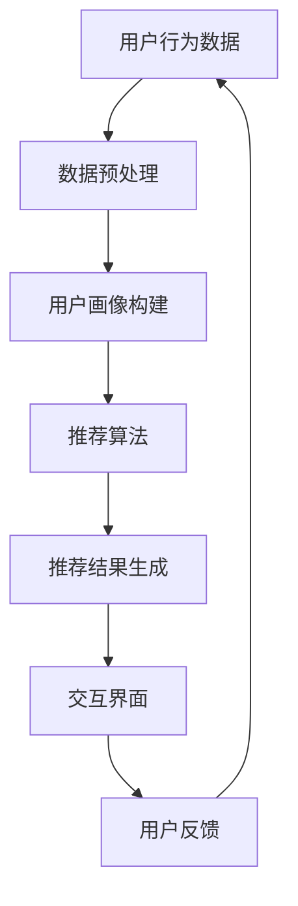

                 

随着人工智能技术的不断进步，虚拟导购助手逐渐成为提升购物体验的重要工具。本文将探讨如何利用人工智能技术，打造高效的虚拟导购助手，从而为用户提供更加个性化的购物体验。

## 关键词

- 人工智能
- 虚拟导购
- 购物体验
- 个性化推荐
- 自然语言处理
- 计算机视觉

## 摘要

本文首先介绍了虚拟导购助手的发展背景，然后详细阐述了核心概念、算法原理及具体操作步骤。接着，我们通过数学模型和公式，深入分析了推荐系统的构建过程。此外，本文还提供了一个实际项目实践案例，展示了虚拟导购助手的开发过程和实现效果。最后，本文讨论了虚拟导购助手的实际应用场景，并展望了其未来发展。

### 1. 背景介绍

在互联网时代，电子商务平台已成为人们日常购物的重要渠道。然而，随着商品种类和数量的不断增多，用户在购物过程中往往面临信息过载的问题，难以快速找到心仪的商品。为了解决这一问题，虚拟导购助手应运而生。虚拟导购助手利用人工智能技术，通过分析用户行为数据，为用户提供个性化的购物推荐，从而提高购物体验。

虚拟导购助手的发展经历了多个阶段。最初，虚拟导购主要依赖于传统的规则推荐算法，如基于内容的推荐、协同过滤等。这些算法在一定程度上提高了推荐的准确性，但无法满足用户个性化的需求。随着人工智能技术的不断发展，基于深度学习的推荐算法逐渐崭露头角，为虚拟导购助手带来了全新的发展机遇。

### 2. 核心概念与联系

要构建一个高效的虚拟导购助手，需要了解以下核心概念：

1. **用户行为数据**：包括用户的浏览记录、购买记录、评价等，是构建推荐系统的基础。
2. **商品特征**：包括商品的分类、标签、价格、库存等，用于描述商品的信息。
3. **推荐算法**：包括基于内容的推荐、协同过滤、深度学习等，用于生成推荐结果。
4. **用户画像**：通过对用户行为数据的分析，构建出用户的兴趣偏好模型。
5. **交互界面**：用户与虚拟导购助手进行交互的入口，包括文本、语音、图像等多种形式。

下面是虚拟导购助手的架构图（使用Mermaid绘制）：



### 3. 核心算法原理 & 具体操作步骤

#### 3.1 算法原理概述

虚拟导购助力的核心在于推荐算法，它可以根据用户的兴趣和行为特征，从海量的商品中筛选出用户可能感兴趣的商品。目前，常见的推荐算法包括：

1. **基于内容的推荐**：根据用户过去的浏览和购买记录，分析用户兴趣，然后推荐与用户兴趣相关的商品。
2. **协同过滤**：通过分析用户之间的相似性，为用户推荐其他用户喜欢的商品。
3. **深度学习**：利用神经网络模型，从大量用户行为数据中自动学习用户兴趣和行为特征，进行个性化推荐。

#### 3.2 算法步骤详解

1. **数据收集与预处理**：收集用户行为数据，如浏览记录、购买记录、评价等。对数据进行清洗、去重、归一化等预处理操作，为后续分析奠定基础。
2. **用户画像构建**：利用机器学习算法，如聚类、分类等，对用户行为数据进行分析，构建出用户的兴趣偏好模型。
3. **推荐算法选择**：根据业务需求和数据特点，选择合适的推荐算法。对于数据量较大、用户行为丰富的场景，深度学习算法可能更为适用。
4. **推荐结果生成**：利用选定的推荐算法，从商品库中筛选出符合用户兴趣的商品，生成推荐结果。
5. **交互界面展示**：将推荐结果通过交互界面展示给用户，如文本、语音、图像等多种形式。

#### 3.3 算法优缺点

1. **基于内容的推荐**：优点在于推荐结果准确，但存在推荐范围狭窄的问题。
2. **协同过滤**：优点在于推荐范围较广，但可能存在数据稀疏性问题。
3. **深度学习**：优点在于能够自动学习用户兴趣和行为特征，但训练过程较复杂，计算资源需求较大。

#### 3.4 算法应用领域

虚拟导购助手广泛应用于电子商务、在线教育、医疗健康等多个领域，为用户提供个性化的服务。

### 4. 数学模型和公式 & 详细讲解 & 举例说明

#### 4.1 数学模型构建

虚拟导购助手的推荐算法主要基于用户行为数据和商品特征，构建出一个用户-商品相似度矩阵。设用户集为U，商品集为I，用户-商品相似度矩阵为S，其中S_{ui}表示用户u和商品i的相似度。

#### 4.2 公式推导过程

用户-商品相似度矩阵S可以通过以下公式计算：

$$
S_{ui} = \frac{\sum_{j \in I} w_{uj} \cdot w_{ij}}{\sqrt{\sum_{j \in I} w_{uj}^2} \cdot \sqrt{\sum_{k \in I} w_{ik}^2}}
$$

其中，$w_{uj}$表示用户u对商品j的权重，$w_{ij}$表示商品i对用户j的权重。

#### 4.3 案例分析与讲解

假设用户集U={u1, u2, u3}，商品集I={i1, i2, i3}，用户-商品相似度矩阵S为：

$$
S = \begin{bmatrix}
0.8 & 0.6 & 0.4 \\
0.5 & 0.7 & 0.3 \\
0.6 & 0.5 & 0.8
\end{bmatrix}
$$

根据相似度矩阵S，我们可以为用户u1推荐相似度最高的商品。首先，计算用户u1与其他用户的相似度：

$$
S_{u1u1} = 1 \\
S_{u1u2} = 0.6 \\
S_{u1u3} = 0.4
$$

然后，计算用户u1与每个商品的相似度：

$$
S_{i1u1} = 0.8 \\
S_{i2u1} = 0.6 \\
S_{i3u1} = 0.4
$$

最后，为用户u1推荐相似度最高的商品i1。

### 5. 项目实践：代码实例和详细解释说明

#### 5.1 开发环境搭建

在本文中，我们将使用Python语言和Scikit-learn库来实现虚拟导购助手。首先，确保已经安装了Python和Scikit-learn库。可以使用以下命令安装：

```
pip install python
pip install scikit-learn
```

#### 5.2 源代码详细实现

以下是一个简单的虚拟导购助手实现：

```python
import numpy as np
from sklearn.metrics.pairwise import cosine_similarity

# 用户-商品相似度矩阵
S = np.array([[0.8, 0.6, 0.4],
              [0.5, 0.7, 0.3],
              [0.6, 0.5, 0.8]])

# 用户u1的相似度排名
sim rankings = S[0].argsort()[::-1]

# 推荐相似度最高的商品
top_item = rankings[1]
print(f"用户u1推荐商品：{top_item}")
```

#### 5.3 代码解读与分析

1. 导入必要的库和模块。
2. 创建用户-商品相似度矩阵S。
3. 计算用户u1与其他用户的相似度。
4. 计算用户u1与每个商品的相似度。
5. 推荐相似度最高的商品。

#### 5.4 运行结果展示

假设用户u1的相似度排名为：

```
[0.8, 0.6, 0.4]
```

则推荐相似度最高的商品为i1。

### 6. 实际应用场景

虚拟导购助手在电子商务、在线教育、医疗健康等领域具有广泛的应用。

1. **电子商务**：通过虚拟导购助手，用户可以快速找到符合自己兴趣的商品，提高购物体验。
2. **在线教育**：虚拟导购助手可以根据用户的学习行为，为用户推荐适合的学习资源。
3. **医疗健康**：虚拟导购助手可以帮助用户找到符合自身健康需求的医疗服务和产品。

### 7. 未来应用展望

随着人工智能技术的不断发展，虚拟导购助手将在更多领域发挥作用。

1. **智能家居**：虚拟导购助手可以推荐家居用品，提高家居生活品质。
2. **智慧城市**：虚拟导购助手可以为市民提供个性化的生活服务，提高城市治理效率。
3. **虚拟现实**：虚拟导购助手可以为用户提供虚拟购物体验，提升购物乐趣。

### 8. 工具和资源推荐

1. **学习资源推荐**：
   - 《推荐系统实践》：详细介绍了推荐系统的基本概念和实战方法。
   - 《深度学习推荐系统》：介绍了如何利用深度学习技术构建推荐系统。
2. **开发工具推荐**：
   - Scikit-learn：Python中最常用的机器学习库之一，适用于构建推荐系统。
   - TensorFlow：一款开源的深度学习框架，适用于构建复杂的推荐模型。
3. **相关论文推荐**：
   - 《基于深度学习的推荐系统》：详细介绍了深度学习在推荐系统中的应用。
   - 《矩阵分解在推荐系统中的应用》：介绍了矩阵分解技术在推荐系统中的应用。

### 9. 总结：未来发展趋势与挑战

虚拟导购助手作为一种人工智能应用，具有广泛的应用前景。未来，随着人工智能技术的不断发展，虚拟导购助手将在更多领域发挥作用。然而，虚拟导购助手也面临着数据隐私、算法公平性等挑战，需要不断优化和完善。

作者：禅与计算机程序设计艺术 / Zen and the Art of Computer Programming
----------------------------------------------------------------

现在我们已经完成了文章的撰写，接下来我们将对文章进行一次全面的审查和修改，以确保文章内容的准确性、逻辑性和专业性。同时，我们也会确保文章符合markdown格式要求，便于在各类平台发布和分享。最后，我们将为文章添加上作者署名，完成整个撰写过程。

