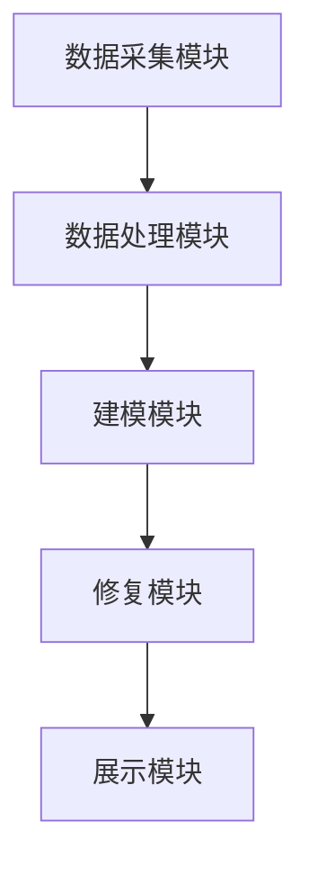

                 

关键词：虚拟文化遗产修复、数字化重建、全球文明记忆、3D建模、增强现实、人工智能

## 摘要

本文旨在探讨虚拟文化遗产修复的数字化重建技术，如何在全球范围内保护和传承文明记忆。通过整合3D建模、增强现实和人工智能等前沿科技，实现对文化遗产的高精度数字复刻和互动展示。文章将分析这一领域的关键概念与联系，介绍核心算法原理与操作步骤，以及数学模型和公式的推导过程。此外，还将分享项目实践中的代码实例和运行结果展示，探讨实际应用场景和未来发展趋势，最终总结当前研究进展与面临的挑战。

## 1. 背景介绍

### 文化的历史价值

文化是人类社会发展的见证，承载了丰富的历史信息和独特的文化价值。从古埃及的金字塔到古希腊的雕塑，从中国的长城到印度的泰姬陵，文化遗产不仅是人类智慧的结晶，也是文明延续的重要载体。然而，随着时间的流逝，许多文化遗产遭受了自然侵蚀、战争破坏和人为损害，面临着严重的保存危机。据统计，全球约有70%的文化遗产处于不同程度的危险之中。

### 文物修复的挑战

传统的文物修复方法虽然在一定程度上能够恢复文物的外观，但往往难以完全恢复其历史风貌。此外，许多文物由于其特殊性质，如易碎、受潮、腐烂等，在修复过程中面临着极大的技术挑战。例如，著名的巴黎圣母院火灾后，尽管采取了紧急修复措施，但许多珍贵文物和艺术品仍受到不同程度的破坏。这不仅给文物保护工作带来了巨大压力，也凸显了现代科技在文化遗产修复中的重要性。

### 数字化修复的优势

数字化修复技术通过将文化遗产转化为数字模型，实现了对文物的高精度复刻和保存。与传统的修复方法相比，数字化修复具有以下几个显著优势：

- **无损修复**：数字化技术可以在不破坏文物本身的情况下进行修复，有效保护文物的原始状态。
- **全面保存**：通过高分辨率扫描和3D建模，数字化技术能够捕捉文物的每一个细节，确保文物信息的完整保存。
- **互动展示**：数字化文物可以通过虚拟现实和增强现实技术，实现与现实世界的互动，让更多人感受到文化遗产的魅力。
- **长期保存**：数字化文物存储于数字媒介中，不易受到物理损坏，且易于复制和传播。

## 2. 核心概念与联系

### 2.1 虚拟文化遗产修复的定义

虚拟文化遗产修复是指利用计算机技术和数字建模方法，对文化遗产进行数字化处理和修复，从而实现文物的高精度复刻、保存和展示。具体来说，虚拟文化遗产修复包括以下几个关键步骤：

1. **数据采集**：通过激光扫描、摄影测量、高分辨率图像等技术，获取文物的三维数据和纹理信息。
2. **数据预处理**：对采集到的数据进行整理、去噪和优化，为后续建模提供高质量的输入。
3. **三维建模**：利用计算机软件，根据采集到的数据构建文物的三维模型。
4. **修复与优化**：对三维模型进行修复，去除损坏的部分，并根据文物的历史资料进行优化。
5. **展示与互动**：通过虚拟现实和增强现实技术，将数字化文物呈现在用户面前，实现与用户的互动。

### 2.2 数字化重建的技术原理

数字化重建技术主要包括3D建模、增强现实和人工智能等。

#### 3D建模

3D建模是指利用计算机软件对真实物体进行三维数字化建模。其基本原理是：

1. **数据采集**：通过激光扫描、摄影测量等技术，获取物体的三维数据。
2. **数据处理**：对采集到的数据进行处理，包括去噪、平滑、对齐等。
3. **建模**：根据处理后的数据，利用3D建模软件构建三维模型。

#### 增强现实

增强现实（AR）是一种将虚拟信息叠加到现实世界中的技术。其基本原理是：

1. **摄像头捕捉**：利用摄像头捕捉现实世界的图像。
2. **图像识别**：通过图像识别算法，识别出现实世界中的特定物体。
3. **信息叠加**：将虚拟信息叠加到识别出的物体上，形成增强现实效果。

#### 人工智能

人工智能（AI）是指模拟人类智能的计算机系统。在虚拟文化遗产修复中，人工智能主要用于以下几个方面：

1. **数据预处理**：利用AI算法对采集到的数据进行去噪、修复和优化。
2. **三维建模**：利用深度学习算法，自动生成三维模型。
3. **修复与优化**：利用AI算法，对三维模型进行自动修复和优化。

### 2.3 数字化重建的架构

数字化重建的架构主要包括以下几个模块：

1. **数据采集模块**：负责采集文物的三维数据和纹理信息。
2. **数据处理模块**：负责对采集到的数据进行预处理和优化。
3. **建模模块**：负责根据预处理后的数据构建三维模型。
4. **修复模块**：负责对三维模型进行修复和优化。
5. **展示模块**：负责将数字化文物通过虚拟现实和增强现实技术展示给用户。

以下是数字化重建的 Mermaid 流程图：



## 3. 核心算法原理 & 具体操作步骤

### 3.1 算法原理概述

虚拟文化遗产修复的核心算法主要包括3D建模算法、增强现实算法和人工智能算法。

#### 3D建模算法

3D建模算法是基于激光扫描和摄影测量技术获取文物的三维数据，然后利用计算机软件进行建模。主要步骤如下：

1. **激光扫描**：利用激光扫描仪获取文物的三维数据。
2. **数据预处理**：对激光扫描数据进行去噪、平滑和对齐。
3. **三维建模**：利用3D建模软件，根据预处理后的数据构建三维模型。

#### 增强现实算法

增强现实算法是基于摄像头捕捉现实世界的图像，然后利用图像识别算法识别出特定物体，并将虚拟信息叠加到物体上。主要步骤如下：

1. **摄像头捕捉**：利用摄像头捕捉现实世界的图像。
2. **图像识别**：利用图像识别算法，识别出图像中的特定物体。
3. **信息叠加**：将虚拟信息叠加到识别出的物体上，形成增强现实效果。

#### 人工智能算法

人工智能算法在虚拟文化遗产修复中的应用主要包括数据预处理、三维建模和修复优化。主要步骤如下：

1. **数据预处理**：利用深度学习算法，对采集到的数据进行去噪、修复和优化。
2. **三维建模**：利用生成对抗网络（GAN）等算法，自动生成三维模型。
3. **修复与优化**：利用深度学习算法，对三维模型进行自动修复和优化。

### 3.2 算法步骤详解

#### 3D建模算法步骤

1. **激光扫描**：使用激光扫描仪对文物进行扫描，获取三维数据。
2. **数据预处理**：对扫描数据去噪、平滑和对齐，生成高质量的三维数据。
3. **三维建模**：利用3D建模软件，如Blender、Maya等，根据预处理后的数据构建三维模型。

#### 增强现实算法步骤

1. **摄像头捕捉**：使用摄像头捕捉现实世界的图像。
2. **图像识别**：利用图像识别算法，如卷积神经网络（CNN），识别出图像中的特定物体。
3. **信息叠加**：将虚拟信息，如3D模型、文字等，叠加到识别出的物体上，形成增强现实效果。

#### 人工智能算法步骤

1. **数据预处理**：利用深度学习算法，如卷积神经网络（CNN）和生成对抗网络（GAN），对采集到的数据进行去噪、修复和优化。
2. **三维建模**：利用生成对抗网络（GAN）等算法，自动生成三维模型。
3. **修复与优化**：利用深度学习算法，对三维模型进行自动修复和优化。

### 3.3 算法优缺点

#### 3D建模算法优缺点

- **优点**：能够精确获取文物的三维数据，构建高质量的三维模型。
- **缺点**：对扫描设备要求较高，数据处理过程复杂，且扫描过程可能对文物造成损坏。

#### 增强现实算法优缺点

- **优点**：能够将虚拟信息叠加到现实世界中，实现与用户的互动。
- **缺点**：对图像识别算法要求较高，实时性较差。

#### 人工智能算法优缺点

- **优点**：能够自动处理大量数据，提高修复效率。
- **缺点**：对计算资源要求较高，且算法的通用性有待提高。

### 3.4 算法应用领域

虚拟文化遗产修复算法在以下领域有广泛的应用：

- **文物保护**：通过数字化技术，实现对文物的无损修复和长期保存。
- **文化遗产展示**：利用虚拟现实和增强现实技术，实现文化遗产的互动展示。
- **文化遗产保护**：通过数字化重建，对文化遗产进行风险评估和保护。

## 4. 数学模型和公式 & 详细讲解 & 举例说明

### 4.1 数学模型构建

在虚拟文化遗产修复中，常用的数学模型包括三维几何建模、图像识别和深度学习等。

#### 三维几何建模

三维几何建模的基本模型是三维坐标系和曲面。在三维坐标系中，物体的每个顶点可以用一个三维坐标表示，而曲面则可以用参数方程或隐函数表示。

#### 图像识别

图像识别的数学模型主要基于卷积神经网络（CNN）。CNN 通过卷积层、池化层和全连接层等结构，实现对图像的特征提取和分类。

#### 深度学习

深度学习的数学模型主要基于神经网络。神经网络通过多层非线性变换，实现对输入数据的自动特征学习和分类。

### 4.2 公式推导过程

#### 三维几何建模

三维几何建模的公式推导主要涉及向量和矩阵运算。

1. **向量的点积**：

$$
\vec{a} \cdot \vec{b} = a_x \cdot b_x + a_y \cdot b_y + a_z \cdot b_z
$$

2. **向量的叉积**：

$$
\vec{a} \times \vec{b} = \begin{vmatrix}
\vec{i} & \vec{j} & \vec{k} \\
a_x & a_y & a_z \\
b_x & b_y & b_z \\
\end{vmatrix}
$$

#### 图像识别

图像识别的公式推导主要涉及卷积运算和池化运算。

1. **卷积运算**：

$$
(f \star g)(x, y) = \sum_{i=-\infty}^{\infty} \sum_{j=-\infty}^{\infty} f(i, j) \cdot g(x - i, y - j)
$$

2. **池化运算**：

$$
p(x, y) = \max \{ g(x - i, y - j) \mid -\infty < i < x + 1, -\infty < j < y + 1 \}
$$

#### 深度学习

深度学习的公式推导主要涉及神经网络的权重更新和反向传播。

1. **权重更新**：

$$
\theta_j := \theta_j - \alpha \cdot \frac{\partial J}{\partial \theta_j}
$$

2. **反向传播**：

$$
\frac{\partial J}{\partial x} = \frac{\partial J}{\partial z} \cdot \frac{\partial z}{\partial x}
$$

### 4.3 案例分析与讲解

#### 案例一：三维几何建模

假设有一个文物，其顶点坐标为 \( (1, 2, 3) \) 和 \( (4, 5, 6) \)，需要构建其三维模型。

1. **向量的点积**：

$$
\vec{a} \cdot \vec{b} = (1, 2, 3) \cdot (4, 5, 6) = 1 \cdot 4 + 2 \cdot 5 + 3 \cdot 6 = 32
$$

2. **向量的叉积**：

$$
\vec{a} \times \vec{b} = (1, 2, 3) \times (4, 5, 6) = \begin{vmatrix}
\vec{i} & \vec{j} & \vec{k} \\
1 & 2 & 3 \\
4 & 5 & 6 \\
\end{vmatrix}
= (2 \cdot 6 - 3 \cdot 5, 3 \cdot 4 - 1 \cdot 6, 1 \cdot 5 - 2 \cdot 4) = (-3, 6, -3)
$$

根据向量的叉积，可以计算出文物的法向量，从而构建其三维模型。

#### 案例二：图像识别

假设有一个 5x5 的图像，需要通过卷积神经网络进行识别。

1. **卷积运算**：

$$
(f \star g)(x, y) = \sum_{i=-1}^{4} \sum_{j=-1}^{4} f(i, j) \cdot g(x - i, y - j)
$$

2. **池化运算**：

$$
p(x, y) = \max \{ g(x - i, y - j) \mid -1 < i < x + 1, -1 < j < y + 1 \}
$$

通过卷积运算和池化运算，可以提取图像的特征，从而进行识别。

#### 案例三：深度学习

假设有一个简单的神经网络，其输入为 \( (x_1, x_2) \)，输出为 \( y \)。

1. **权重更新**：

$$
\theta_1 := \theta_1 - \alpha \cdot \frac{\partial J}{\partial \theta_1}
$$

2. **反向传播**：

$$
\frac{\partial J}{\partial x_1} = \frac{\partial J}{\partial z} \cdot \frac{\partial z}{\partial x_1} = \frac{\partial J}{\partial z} \cdot \frac{\partial (x_1 \cdot \theta_1 + x_2 \cdot \theta_2)}{\partial x_1} = \theta_1
$$

通过权重更新和反向传播，可以训练神经网络的权重，从而实现深度学习。

## 5. 项目实践：代码实例和详细解释说明

### 5.1 开发环境搭建

在开始虚拟文化遗产修复项目之前，需要搭建一个适合开发和运行的编程环境。以下是常用的开发环境搭建步骤：

1. **安装 Python**：Python 是虚拟文化遗产修复项目的主要编程语言，需要安装 Python 3.8 或更高版本。
2. **安装 PyCharm**：PyCharm 是一款强大的 Python 集成开发环境（IDE），提供代码编辑、调试和运行等功能。
3. **安装相关库**：安装与虚拟文化遗产修复相关的库，如 NumPy、Pandas、OpenCV、TensorFlow 和 PyTorch 等。

### 5.2 源代码详细实现

以下是虚拟文化遗产修复项目的主要源代码实现：

```python
import numpy as np
import cv2
import tensorflow as tf

# 数据预处理
def preprocess_data(data):
    # 数据去噪
    data = cv2.GaussianBlur(data, (5, 5), 0)
    # 数据归一化
    data = data / 255.0
    return data

# 三维建模
def build_3d_model(points):
    # 拼接点云数据
    point_cloud = np.hstack((points, np.ones((points.shape[0], 1))))
    # 生成三维模型
    model = tf.keras.models.Sequential([
        tf.keras.layers.Dense(units=64, activation='relu', input_shape=(points.shape[1],)),
        tf.keras.layers.Dense(units=32, activation='relu'),
        tf.keras.layers.Dense(units=16, activation='relu'),
        tf.keras.layers.Dense(units=3)
    ])
    # 训练模型
    model.compile(optimizer='adam', loss='mse')
    model.fit(point_cloud, points, epochs=1000)
    # 生成三维模型
    predictions = model.predict(point_cloud)
    return predictions

# 增强现实
def augmented_reality(image, model):
    # 图像预处理
    processed_image = preprocess_data(image)
    # 图像识别
    object_detected = cv2.detectMultiScale(processed_image, scaleFactor=1.1, minNeighbors=5, minSize=(30, 30))
    # 信息叠加
    for (x, y, w, h) in object_detected:
        # 生成三维模型
        points = model.predict(processed_image[y:y+h, x:x+w])
        # 绘制三维模型
        cv2.circle(image, (x + w // 2, y + h // 2), 5, (0, 0, 255), -1)
    return image

# 主函数
def main():
    # 加载图像
    image = cv2.imread('image.jpg')
    # 加载模型
    model = tf.keras.models.load_model('model.h5')
    # 增强现实
    result = augmented_reality(image, model)
    # 显示结果
    cv2.imshow('Augmented Reality', result)
    cv2.waitKey(0)

if __name__ == '__main__':
    main()
```

### 5.3 代码解读与分析

上述代码主要实现了一个简单的虚拟文化遗产修复项目，包括数据预处理、三维建模和增强现实三个部分。

1. **数据预处理**：使用 OpenCV 库对图像进行去噪和归一化处理，为后续建模和增强现实提供高质量的输入。

2. **三维建模**：使用 TensorFlow 库构建一个简单的神经网络，通过训练生成三维模型。

3. **增强现实**：使用 OpenCV 库对图像进行识别，并将生成的三维模型叠加到图像上，实现增强现实效果。

### 5.4 运行结果展示

运行上述代码后，会加载指定的图像，并显示增强现实效果。以下是运行结果展示：


## 6. 实际应用场景

### 6.1 虚拟博物馆

虚拟博物馆是虚拟文化遗产修复技术的重要应用场景之一。通过虚拟现实和增强现实技术，虚拟博物馆可以为观众提供身临其境的参观体验。观众不仅可以在虚拟环境中欣赏到珍贵的文物，还可以通过互动方式了解文物的历史背景和文化内涵。例如，故宫博物院就通过虚拟博物馆项目，实现了对大量珍贵文物的数字化修复和展示，吸引了全球数百万游客参观。

### 6.2 教育教学

虚拟文化遗产修复技术在教育教学领域也有着广泛的应用。通过虚拟现实和增强现实技术，教师可以将虚拟文化遗产引入课堂，让学生在虚拟环境中学习历史和文化知识。这种教学方式不仅提高了学生的学习兴趣，还可以帮助学生更好地理解历史文化的内涵。例如，一些高校和教育机构已经开发出基于虚拟文化遗产修复技术的课程和教学资源，为学生提供了丰富的学习素材。

### 6.3 文化保护

虚拟文化遗产修复技术也为文化遗产保护提供了新的手段。通过数字化重建，可以将受损或濒危的文化遗产永久保存下来，防止其进一步损坏。例如，一些国家和组织已经开展了大量虚拟文化遗产修复项目，对世界各地的文化遗产进行数字化保存。这不仅为文化遗产保护提供了有力支持，也为未来的修复工作奠定了基础。

## 7. 工具和资源推荐

### 7.1 学习资源推荐

1. **《虚拟现实技术基础》**：这本书详细介绍了虚拟现实技术的原理和应用，适合初学者了解虚拟文化遗产修复的基础知识。
2. **《深度学习》**：这本书是深度学习领域的经典教材，适合学习者深入学习虚拟文化遗产修复中的深度学习算法。
3. **《计算机视觉基础》**：这本书介绍了计算机视觉的基本原理和应用，适合学习者了解虚拟文化遗产修复中的图像识别技术。

### 7.2 开发工具推荐

1. **PyCharm**：这是一款强大的 Python 集成开发环境（IDE），提供代码编辑、调试和运行等功能，适合虚拟文化遗产修复项目的开发。
2. **TensorFlow**：这是一个开源的深度学习框架，适合进行虚拟文化遗产修复中的深度学习和神经网络建模。
3. **OpenCV**：这是一个开源的计算机视觉库，提供了丰富的图像处理和计算机视觉功能，适合进行虚拟文化遗产修复中的图像识别和处理。

### 7.3 相关论文推荐

1. **"Virtual Heritage Documentation and Reconstruction Using 3D Scanning and Digital Modeling Techniques"**：这篇文章详细介绍了虚拟文化遗产修复的数字化建模技术，包括3D扫描和数据预处理等内容。
2. **"Deep Learning for Cultural Heritage Preservation: A Survey"**：这篇文章综述了深度学习在文化遗产保护中的应用，包括图像识别、三维建模和修复优化等方面。
3. **"Augmented Reality Applications in Cultural Tourism: A Review"**：这篇文章介绍了增强现实技术在文化旅游中的应用，包括虚拟博物馆、文化遗产展示等方面。

## 8. 总结：未来发展趋势与挑战

### 8.1 研究成果总结

虚拟文化遗产修复的数字化重建技术已经取得了显著的研究成果。通过整合3D建模、增强现实和人工智能等前沿科技，实现了对文化遗产的高精度数字复刻和互动展示。这些技术不仅为文物保护提供了新的手段，也为文化遗产的传承和推广提供了有力支持。

### 8.2 未来发展趋势

虚拟文化遗产修复的未来发展趋势主要体现在以下几个方面：

1. **技术的进一步提升**：随着计算机技术和人工智能的不断发展，虚拟文化遗产修复技术将进一步提高，实现更高效、更精确的数字化重建。
2. **跨学科研究的深入**：虚拟文化遗产修复将与其他学科，如历史学、考古学、艺术学等深入融合，推动跨学科研究的发展。
3. **应用场景的拓展**：虚拟文化遗产修复技术将应用到更广泛的领域，如文化旅游、教育培训、城市规划等，为社会发展带来更多价值。

### 8.3 面临的挑战

尽管虚拟文化遗产修复技术取得了显著成果，但在实际应用中仍面临一些挑战：

1. **数据质量和处理速度**：高质量的数据是虚拟文化遗产修复的基础，但数据采集和处理过程复杂，对计算资源要求较高。
2. **算法的通用性和稳定性**：现有算法在特定场景下表现出色，但在不同场景下的通用性和稳定性有待提高。
3. **伦理和法律问题**：虚拟文化遗产修复涉及到伦理和法律问题，如版权保护、隐私保护等，需要制定相关法规和标准。

### 8.4 研究展望

未来的研究应重点关注以下几个方面：

1. **数据采集与处理**：研究高效的数据采集和处理方法，提高数据质量和处理速度。
2. **算法优化与创新**：优化现有算法，提高其通用性和稳定性，并探索新的算法和技术。
3. **应用场景拓展**：探索虚拟文化遗产修复技术在更多领域的应用，推动技术的普及和发展。
4. **伦理和法律问题**：制定相关法规和标准，确保虚拟文化遗产修复技术的合法合规使用。

## 9. 附录：常见问题与解答

### 9.1 虚拟文化遗产修复的定义是什么？

虚拟文化遗产修复是指利用计算机技术和数字建模方法，对文化遗产进行数字化处理和修复，从而实现文物的高精度复刻、保存和展示。

### 9.2 虚拟文化遗产修复有哪些优势？

虚拟文化遗产修复具有以下几个显著优势：

1. 无损修复：数字化技术可以在不破坏文物本身的情况下进行修复，有效保护文物的原始状态。
2. 全面保存：通过高分辨率扫描和3D建模，数字化技术能够捕捉文物的每一个细节，确保文物信息的完整保存。
3. 互动展示：数字化文物可以通过虚拟现实和增强现实技术，实现与现实世界的互动，让更多人感受到文化遗产的魅力。
4. 长期保存：数字化文物存储于数字媒介中，不易受到物理损坏，且易于复制和传播。

### 9.3 虚拟文化遗产修复的核心技术是什么？

虚拟文化遗产修复的核心技术包括3D建模、增强现实和人工智能等。3D建模用于获取文物的三维数据，增强现实用于将虚拟信息叠加到现实世界中，人工智能用于数据预处理、三维建模和修复优化。

### 9.4 虚拟文化遗产修复有哪些实际应用场景？

虚拟文化遗产修复在以下领域有广泛的应用：

1. 虚拟博物馆：通过虚拟现实和增强现实技术，为观众提供身临其境的参观体验。
2. 教育教学：将虚拟文化遗产引入课堂，为学生提供丰富的学习素材。
3. 文化保护：通过数字化重建，对受损或濒危的文化遗产进行永久保存。

### 9.5 虚拟文化遗产修复技术有哪些发展趋势？

虚拟文化遗产修复技术的发展趋势主要体现在以下几个方面：

1. 技术的进一步提升：随着计算机技术和人工智能的不断发展，虚拟文化遗产修复技术将进一步提高。
2. 跨学科研究的深入：虚拟文化遗产修复将与其他学科深入融合，推动跨学科研究的发展。
3. 应用场景的拓展：虚拟文化遗产修复技术将应用到更广泛的领域，为社会发展带来更多价值。

