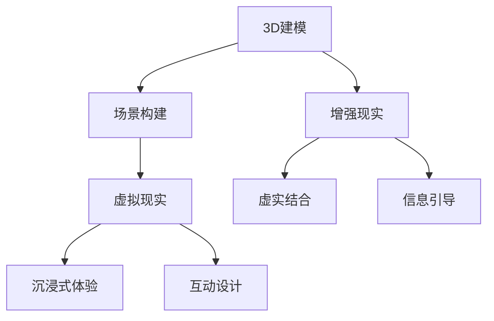

                 

 在当今全球化的时代，文化交流已成为增进不同国家和地区人民理解与友谊的重要途径。随着科技的不断进步，虚拟旅游作为一种新兴的文化交流方式，正日益受到广泛关注。本文旨在探讨虚拟旅游的概念、核心技术和应用前景，以期为我们了解全球不同文化和风土人情提供一种全新的途径。

## 关键词 Keywords
- 虚拟旅游
- 文化交流
- 3D建模
- 虚拟现实
- 增强现实
- 全球文化

## 摘要 Abstract
本文首先介绍了虚拟旅游的定义和背景，探讨了虚拟旅游在文化交流中的重要作用。接着，本文详细阐述了虚拟旅游的核心技术，包括3D建模、虚拟现实和增强现实等。随后，文章分析了虚拟旅游在不同领域的实际应用案例，如旅游业、教育、文化遗产保护和城市规划等。最后，本文展望了虚拟旅游的未来发展前景，并提出了相关挑战和解决方案。

## 1. 背景介绍

虚拟旅游是指通过数字技术模拟真实世界的旅游体验，让用户在虚拟环境中浏览、探索和体验各种风景名胜、历史遗址和文化遗产。与传统旅游相比，虚拟旅游具有许多独特的优势。

首先，虚拟旅游突破了时间和空间的限制。用户可以随时随地通过互联网访问虚拟旅游场景，无需受限于实地的交通和时间安排。这对于那些由于各种原因无法实际出行的人群，如老年人、残疾人、学生和学者等，提供了极大的便利。

其次，虚拟旅游能够提供更加丰富和多样的体验。通过3D建模和虚拟现实技术，用户可以沉浸于高度真实的虚拟环境中，感受到与实地旅行相似的视觉、听觉和触觉体验。此外，虚拟旅游还可以通过增强现实技术将现实世界与虚拟世界相结合，创造出全新的交互体验。

虚拟旅游的兴起，源于计算机技术和互联网的快速发展。20世纪90年代，随着个人电脑和互联网的普及，人们开始尝试将虚拟现实技术应用于旅游领域。近年来，随着云计算、大数据和人工智能等新技术的不断发展，虚拟旅游的技术水平和应用范围得到了大幅提升。

### 1.1 虚拟旅游的历史与发展

虚拟旅游的历史可以追溯到20世纪80年代，当时一些科学家和工程师开始探索如何利用计算机技术模拟现实世界的体验。1989年，美国计算机科学家阿尔文·托夫勒（Alvin Toffler）在其著作《未来的冲击》中首次提出了虚拟现实（Virtual Reality，简称VR）的概念。这一概念激发了人们对虚拟旅游的兴趣，并推动了相关技术的发展。

在20世纪90年代，随着个人电脑的普及，虚拟现实技术开始应用于旅游领域。这一时期，虚拟旅游主要以2D图片和动画的形式呈现，用户可以通过鼠标和键盘在虚拟环境中浏览。虽然这种形式的虚拟旅游还无法提供完全沉浸式的体验，但已经为人们提供了新的旅游方式。

进入21世纪，随着互联网的普及和3D建模技术的进步，虚拟旅游开始逐渐走向成熟。2006年，谷歌推出Street View服务，用户可以通过互联网查看全球各地的真实景观。这一服务极大地促进了虚拟旅游的发展，使得人们能够更加方便地探索世界各地的风景名胜。

近年来，虚拟现实（VR）和增强现实（AR）技术的迅速发展，为虚拟旅游带来了新的机遇。通过VR头盔和AR眼镜，用户可以沉浸于高度真实的虚拟环境中，体验到与现实世界相似的视觉、听觉和触觉感受。此外，人工智能技术的应用，使得虚拟旅游场景的互动性和智能化水平得到了显著提升。

### 1.2 虚拟旅游的兴起原因

虚拟旅游的兴起，得益于以下几个原因：

1. **技术进步**：计算机技术和互联网的快速发展，为虚拟旅游提供了强大的技术支持。3D建模、虚拟现实和增强现实技术的进步，使得虚拟旅游场景的逼真度和交互性得到了显著提升。

2. **市场需求**：随着人们生活水平的提高，旅游业迎来了快速增长。越来越多的人渴望探索世界各地的文化和风景，但受到时间、经济和身体条件等因素的限制。虚拟旅游的出现，为他们提供了一种低成本、高效率的旅游方式。

3. **疫情防控**：近年来，全球范围内的疫情对旅游业造成了严重冲击。虚拟旅游作为一种安全、便捷的旅游方式，得到了广大用户的青睐。特别是在疫情期间，虚拟旅游成为了人们居家旅行、了解世界的重要途径。

4. **文化传承**：虚拟旅游不仅为人们提供了新的旅游体验，还有助于保护和传承文化遗产。通过虚拟旅游，人们可以远程欣赏和了解世界各地的历史遗迹和文化景观，从而促进不同文化之间的交流与融合。

### 1.3 虚拟旅游的现状与未来发展趋势

目前，虚拟旅游已经广泛应用于旅游业、教育、文化遗产保护、城市规划等多个领域。随着技术的不断进步和市场的不断拓展，虚拟旅游呈现出以下几个发展趋势：

1. **市场规模不断扩大**：随着用户对虚拟旅游的需求不断增加，市场规模呈现出快速增长的趋势。据预测，未来几年虚拟旅游市场将继续保持高速增长，成为旅游业的重要组成部分。

2. **技术持续创新**：虚拟现实、增强现实、人工智能等技术的不断发展，为虚拟旅游提供了更多的可能性。未来，虚拟旅游的技术水平将进一步提高，为用户提供更加丰富和多样的体验。

3. **应用领域不断拓展**：虚拟旅游的应用领域将不断扩大，不仅涵盖旅游业，还将应用于教育、医疗、房地产等多个领域。通过虚拟旅游，用户可以远程参观医院、体验房地产项目等，提高决策效率。

4. **文化传承与创新**：虚拟旅游在促进文化交流的同时，也为文化传承和创新提供了新的途径。通过虚拟旅游，人们可以更好地了解和传承世界各地的文化遗产，推动文化的多样性和繁荣。

总之，虚拟旅游作为一种新兴的文化交流方式，具有巨大的发展潜力和广阔的应用前景。在未来，虚拟旅游将不断变革和进化，成为人们生活的重要组成部分。

## 2. 核心概念与联系

虚拟旅游的核心技术包括3D建模、虚拟现实和增强现实等。这些技术共同构建了虚拟旅游的虚拟环境，为用户提供了丰富的旅游体验。以下是对这些核心概念的详细解释和它们之间的联系。

### 2.1 3D建模

3D建模是虚拟旅游的基础技术之一，它通过计算机图形学的方法，将现实世界的景观、建筑、人物等物体以数字化的形式进行建模。3D建模的主要目的是创建一个高度逼真的三维场景，为用户在虚拟环境中提供沉浸式的体验。

3D建模的过程通常包括以下几个步骤：

1. **数据采集**：通过无人机、摄影机等设备，对现实世界的景观进行拍摄，获取高分辨率的图像和点云数据。

2. **预处理**：对采集到的数据进行处理，包括图像去噪、点云滤波等，以提高数据的精度和可靠性。

3. **建模**：利用3D建模软件，根据处理后的数据创建三维模型。3D建模软件提供了丰富的工具和功能，如建模、雕刻、贴图等，以便创建出高度逼真的模型。

4. **优化**：对建模结果进行优化，包括调整模型的细节、减少多边形的数量、优化贴图等，以提高渲染效率和用户体验。

5. **导出**：将优化后的3D模型导出为虚拟旅游系统所支持的数据格式，如obj、glTF等，以便在虚拟旅游环境中进行展示。

3D建模在虚拟旅游中的应用主要体现在以下几个方面：

1. **场景构建**：通过3D建模，可以创建各种虚拟旅游场景，如风景名胜、历史遗址、城市景观等，为用户提供了丰富的视觉体验。

2. **交互设计**：3D建模技术为虚拟旅游提供了丰富的交互设计空间，用户可以在虚拟环境中进行浏览、探索、拍照等操作，增强旅游体验。

3. **内容创作**：3D建模技术也为虚拟旅游的内容创作提供了新的途径，创作者可以基于现实世界的景观和建筑，创作出独特的虚拟旅游场景，为用户提供全新的旅游体验。

### 2.2 虚拟现实

虚拟现实（Virtual Reality，简称VR）是一种通过计算机技术模拟的虚拟环境，用户可以通过VR头盔、VR眼镜等设备，沉浸在虚拟环境中，感受到与真实世界相似的视觉、听觉和触觉体验。虚拟现实技术是虚拟旅游的重要组成部分，它为用户提供了高度沉浸的旅游体验。

虚拟现实技术的基本原理包括以下几个方面：

1. **显示技术**：虚拟现实头盔或眼镜通过显示屏幕或投影技术，将虚拟环境显示给用户。显示技术决定了虚拟环境的分辨率、刷新率和视角范围，从而影响用户的沉浸感。

2. **传感器技术**：虚拟现实头盔或眼镜配备多种传感器，如陀螺仪、加速度计、摄像头等，用于实时检测用户的头部运动和身体动作，将用户的动作实时反馈到虚拟环境中。

3. **渲染技术**：虚拟现实渲染技术用于实时生成虚拟环境的三维图像，并实时更新用户视角。渲染技术决定了虚拟环境的真实感和流畅度。

4. **交互技术**：虚拟现实技术提供了多种交互方式，如手势识别、语音控制、触觉反馈等，用户可以通过这些交互方式与虚拟环境进行互动。

虚拟现实技术在虚拟旅游中的应用主要体现在以下几个方面：

1. **沉浸式体验**：通过虚拟现实技术，用户可以沉浸在高度真实的虚拟旅游场景中，感受到与实地旅行相似的视觉、听觉和触觉体验。

2. **互动性**：虚拟现实技术提供了丰富的互动设计空间，用户可以在虚拟环境中进行拍照、互动游戏、虚拟购物等操作，增强旅游体验。

3. **个性化定制**：虚拟现实技术可以根据用户的喜好和需求，提供个性化的旅游推荐和定制服务，为用户提供独特的旅游体验。

### 2.3 增强现实

增强现实（Augmented Reality，简称AR）是一种通过计算机技术将虚拟信息叠加到现实世界中的技术。增强现实技术通过AR眼镜、智能手机等设备，将虚拟信息与现实世界相结合，为用户提供了全新的交互体验。

增强现实技术的基本原理包括以下几个方面：

1. **显示技术**：AR设备通过显示屏幕或投影技术，将虚拟信息显示在用户眼前。显示技术决定了虚拟信息的透明度和叠加效果。

2. **传感器技术**：AR设备配备多种传感器，如摄像头、陀螺仪、加速度计等，用于实时检测现实世界的场景和用户的位置信息。

3. **渲染技术**：AR渲染技术用于实时生成虚拟信息，并将其叠加到现实世界的场景中。渲染技术决定了虚拟信息的真实感和视觉效果。

4. **交互技术**：AR技术提供了多种交互方式，如手势识别、语音控制等，用户可以通过这些交互方式与虚拟信息进行互动。

增强现实技术在虚拟旅游中的应用主要体现在以下几个方面：

1. **虚实结合**：通过增强现实技术，用户可以在现实世界中看到虚拟的旅游场景，如风景名胜、历史遗址等，实现虚实结合的旅游体验。

2. **增强互动**：增强现实技术提供了丰富的互动设计空间，用户可以在现实世界中与虚拟信息进行互动，如拍照、分享、虚拟购物等，增强旅游体验。

3. **信息引导**：增强现实技术可以提供实时导航、景点介绍、历史文化解析等信息，帮助用户更好地了解旅游目的地，提高旅游体验。

### 2.4 核心概念之间的联系

3D建模、虚拟现实和增强现实技术共同构成了虚拟旅游的技术基础。它们之间的联系主要体现在以下几个方面：

1. **技术支撑**：3D建模提供了虚拟旅游场景的基础，虚拟现实和增强现实技术则在此基础上提供了沉浸式和虚实结合的旅游体验。

2. **数据互通**：3D建模生成的三维模型数据可以被虚拟现实和增强现实系统所使用，实现数据的高效共享和利用。

3. **交互融合**：虚拟现实和增强现实技术提供了丰富的交互设计空间，用户可以通过这些技术进行浏览、探索、互动等操作，实现与虚拟旅游场景的深度融合。

4. **应用拓展**：虚拟现实和增强现实技术可以应用于虚拟旅游的各个领域，如旅游规划、旅游导览、旅游推广等，为用户提供多样化的旅游服务。

### 2.5 Mermaid 流程图

以下是一个简单的Mermaid流程图，展示了3D建模、虚拟现实和增强现实技术在虚拟旅游中的应用流程：



通过这个流程图，我们可以清晰地看到3D建模、虚拟现实和增强现实技术在虚拟旅游中的应用和相互联系。

### 2.6 3D建模的详细说明

3D建模是虚拟旅游的关键技术之一，它决定了虚拟旅游场景的逼真度和交互性。下面我们将详细探讨3D建模的原理、工具和应用。

#### 2.6.1 3D建模原理

3D建模的基本原理是通过计算机图形学的方法，将现实世界的物体或场景以数字化的形式进行建模。3D建模的过程通常包括以下步骤：

1. **数据采集**：通过无人机、摄影机等设备，对现实世界的物体或场景进行拍摄，获取高分辨率的图像和点云数据。

2. **预处理**：对采集到的数据进行处理，包括图像去噪、点云滤波等，以提高数据的精度和可靠性。

3. **建模**：利用3D建模软件，根据处理后的数据创建三维模型。3D建模软件提供了丰富的工具和功能，如建模、雕刻、贴图等，以便创建出高度逼真的模型。

4. **优化**：对建模结果进行优化，包括调整模型的细节、减少多边形的数量、优化贴图等，以提高渲染效率和用户体验。

5. **导出**：将优化后的3D模型导出为虚拟旅游系统所支持的数据格式，如obj、glTF等，以便在虚拟旅游环境中进行展示。

#### 2.6.2 3D建模工具

目前市面上有许多3D建模工具可供选择，其中一些常用的工具包括：

1. **Blender**：Blender是一款开源的3D建模软件，功能强大且易于使用。它提供了丰富的建模、雕刻、渲染等工具，适合各种规模的3D建模项目。

2. **Autodesk Maya**：Maya是一款专业的3D建模和动画软件，广泛应用于电影、游戏、广告等领域。它提供了强大的建模、动画、渲染等功能，适合高精度、高质量的3D建模项目。

3. **Adobe Substance 3D**：Adobe Substance 3D是一款全新的3D建模和纹理设计工具，它将3D建模、纹理设计和实时渲染结合在一起，为用户提供了全新的创作体验。

4. **ZBrush**：ZBrush是一款专业的3D雕刻软件，以其强大的雕刻功能和高度真实的渲染效果而闻名。它适合创建复杂的几何结构和细节丰富的角色和场景。

#### 2.6.3 3D建模应用

3D建模在虚拟旅游中有着广泛的应用，以下是一些典型的应用场景：

1. **场景构建**：通过3D建模，可以创建各种虚拟旅游场景，如风景名胜、历史遗址、城市景观等，为用户提供了丰富的视觉体验。

2. **交互设计**：3D建模技术为虚拟旅游提供了丰富的交互设计空间，用户可以在虚拟环境中进行浏览、探索、拍照等操作，增强旅游体验。

3. **内容创作**：3D建模技术也为虚拟旅游的内容创作提供了新的途径，创作者可以基于现实世界的景观和建筑，创作出独特的虚拟旅游场景，为用户提供全新的旅游体验。

4. **教育应用**：3D建模技术可以应用于教育领域，如历史教育、地理教育等，通过虚拟旅游场景，为学生提供更加生动、直观的教学内容。

5. **城市规划**：3D建模技术可以用于城市规划，通过虚拟旅游场景，规划者可以模拟各种城市规划方案，为城市规划提供科学依据。

#### 2.6.4 3D建模的优缺点

3D建模作为一种重要的虚拟旅游技术，具有以下优缺点：

**优点**：

1. **逼真度高**：3D建模可以创建高度逼真的虚拟旅游场景，为用户提供了身临其境的体验。

2. **交互性强**：3D建模技术为用户提供了丰富的交互设计空间，用户可以在虚拟环境中进行各种操作，增强旅游体验。

3. **内容丰富**：3D建模技术可以创作出各种独特的虚拟旅游场景，为用户提供多样化的旅游体验。

**缺点**：

1. **建模复杂**：3D建模过程复杂，需要专业的建模技能和软件操作能力，对用户的要求较高。

2. **渲染耗时**：3D建模生成的模型需要经过渲染才能展示，渲染过程耗时较长，对计算资源的要求较高。

3. **数据存储量大**：3D建模生成的模型数据量较大，对存储空间和网络传输速度的要求较高。

### 2.7 虚拟现实（VR）的详细说明

虚拟现实（Virtual Reality，简称VR）技术是虚拟旅游的核心组成部分，它通过计算机模拟生成一个虚拟环境，用户可以通过VR头盔等设备沉浸在虚拟世界中，获得与现实世界相似的体验。下面我们将详细探讨虚拟现实技术的原理、设备、应用场景以及其优缺点。

#### 2.7.1 虚拟现实原理

虚拟现实技术的基本原理是通过计算机生成一个三维虚拟环境，用户通过特定的设备（如VR头盔）与虚拟环境进行交互。以下是虚拟现实技术的主要组成部分：

1. **显示技术**：虚拟现实头盔通常配备两个或多个高分辨率显示器，以产生立体视觉。这些显示器可以产生丰富的细节和视角，使虚拟环境看起来更加真实。

2. **传感器技术**：虚拟现实头盔配备多种传感器，如陀螺仪、加速度计和摄像头等，用于检测用户的头部运动和姿态。这些传感器能够实时更新用户的视角，实现沉浸式的体验。

3. **渲染技术**：虚拟现实渲染技术用于实时生成虚拟环境的三维图像。高质量的渲染技术能够保证虚拟环境的真实感和流畅度。

4. **交互技术**：虚拟现实技术提供了多种交互方式，如手势识别、语音控制和触觉反馈等。用户可以通过这些交互方式与虚拟环境进行互动，提高用户体验。

#### 2.7.2 虚拟现实设备

目前市场上有许多虚拟现实设备可供选择，以下是一些常见的虚拟现实设备：

1. **VR头盔**：VR头盔是虚拟现实体验的核心设备，它通常包括两个高分辨率显示器和一套传感器系统。用户通过VR头盔可以沉浸在虚拟环境中，感受到与真实世界相似的视觉、听觉和触觉体验。

2. **VR一体机**：VR一体机是一种无需外部计算机即可独立运行的虚拟现实设备。它集成了处理器、显示器和传感器，用户只需佩戴VR头盔即可开始虚拟现实体验。

3. **VR手柄**：VR手柄是虚拟现实交互的重要工具，用户可以通过手柄进行各种操作，如抓取、旋转和操纵物体等。

4. **VR眼镜**：VR眼镜是一种轻便的虚拟现实设备，用户可以通过眼镜观看虚拟环境，通常与手机或其他设备配合使用。

#### 2.7.3 虚拟现实应用场景

虚拟现实技术在虚拟旅游中有着广泛的应用，以下是一些典型的应用场景：

1. **旅游体验**：用户可以通过虚拟现实技术，远程探索世界各地的风景名胜和历史遗址，获得与实地旅行相似的体验。

2. **城市规划**：城市规划者可以通过虚拟现实技术模拟城市环境，评估城市规划方案，提高城市规划的科学性和可行性。

3. **教育培训**：虚拟现实技术可以应用于教育培训领域，如医学培训、驾驶培训等，为学生提供更加直观和互动的学习体验。

4. **文化遗产保护**：虚拟现实技术可以帮助文化遗产保护专家远程研究和展示文化遗产，提高文化遗产的传播和保护效果。

#### 2.7.4 虚拟现实优缺点

虚拟现实技术具有以下优缺点：

**优点**：

1. **沉浸式体验**：虚拟现实技术能够提供高度沉浸的体验，用户可以在虚拟环境中感受到与真实世界相似的视觉、听觉和触觉体验。

2. **交互性强**：虚拟现实技术提供了丰富的交互方式，用户可以通过手势、语音和触觉反馈与虚拟环境进行互动，提高用户体验。

3. **应用广泛**：虚拟现实技术可以应用于多个领域，如旅游、教育、城市规划等，具有广泛的应用前景。

**缺点**：

1. **设备成本高**：高质量的虚拟现实设备价格较高，限制了部分用户的体验。

2. **技术复杂**：虚拟现实技术涉及多个领域的技术，如计算机图形学、传感器技术和交互技术等，技术复杂度较高。

3. **眩晕感**：长时间佩戴虚拟现实头盔可能导致用户产生眩晕感，影响用户体验。

### 2.8 增强现实（AR）的详细说明

增强现实（Augmented Reality，简称AR）技术是一种通过计算机生成的虚拟信息叠加到现实世界中的技术。与虚拟现实技术不同，AR技术并不完全取代现实世界，而是在现实世界中叠加虚拟信息，为用户提供了全新的交互体验。下面我们将详细探讨增强现实技术的原理、设备、应用场景以及其优缺点。

#### 2.8.1 增强现实原理

增强现实技术的基本原理是通过计算机生成虚拟信息，并将其叠加到现实世界中。以下是增强现实技术的主要组成部分：

1. **显示技术**：AR设备通常通过显示屏幕或投影技术将虚拟信息显示在用户眼前。这些显示技术决定了虚拟信息的透明度和叠加效果。

2. **传感器技术**：AR设备配备多种传感器，如摄像头、陀螺仪、加速度计等，用于实时检测现实世界的场景和用户的位置信息。

3. **渲染技术**：AR渲染技术用于实时生成虚拟信息，并将其叠加到现实世界的场景中。高质量的渲染技术能够保证虚拟信息的真实感和视觉效果。

4. **交互技术**：AR技术提供了多种交互方式，如手势识别、语音控制和触觉反馈等。用户可以通过这些交互方式与虚拟信息进行互动，提高用户体验。

#### 2.8.2 增强现实设备

目前市场上有许多增强现实设备可供选择，以下是一些常见的增强现实设备：

1. **AR眼镜**：AR眼镜是增强现实体验的核心设备，它通常通过摄像头和传感器捕捉现实世界的场景，并在显示屏幕上叠加虚拟信息。用户可以通过AR眼镜观看增强现实信息。

2. **智能手机**：智能手机可以通过安装AR应用程序，实现增强现实功能。用户可以通过手机摄像头捕捉现实世界的场景，并在屏幕上显示虚拟信息。

3. **平板电脑**：平板电脑与智能手机类似，可以通过安装AR应用程序实现增强现实功能。

4. **头戴式显示器**：头戴式显示器是一种专业的增强现实设备，它通常与计算机或手机连接，通过摄像头和传感器捕捉现实世界的场景，并在头戴式显示器上显示虚拟信息。

#### 2.8.3 增强现实应用场景

增强现实技术在虚拟旅游中有着广泛的应用，以下是一些典型的应用场景：

1. **旅游导览**：用户可以通过增强现实技术，在现实世界中看到与旅游目的地相关的信息，如景点介绍、历史文化等，提高旅游体验。

2. **历史重现**：通过增强现实技术，用户可以在现实世界中看到历史遗址的复原场景，了解历史事件，增强历史文化教育。

3. **互动游戏**：增强现实技术可以应用于互动游戏，用户可以在现实世界中与虚拟角色互动，体验虚拟游戏。

4. **文化遗产保护**：通过增强现实技术，文化遗产保护专家可以在现实世界中看到文化遗产的3D模型，进行修复和研究。

#### 2.8.4 增强现实优缺点

增强现实技术具有以下优缺点：

**优点**：

1. **虚实结合**：增强现实技术将虚拟信息叠加到现实世界中，用户可以在现实世界中看到虚拟信息，实现虚实结合的体验。

2. **便捷性**：增强现实技术可以通过智能手机、平板电脑等设备实现，用户无需购买专业的AR设备即可体验增强现实功能。

3. **信息丰富**：增强现实技术可以提供丰富的信息，如历史、文化、科学等，用户可以通过增强现实信息更好地了解和探索世界。

**缺点**：

1. **显示效果有限**：相比于虚拟现实技术，增强现实技术的显示效果有限，虚拟信息的视觉效果和互动性较差。

2. **用户体验限制**：增强现实技术对用户体验的限制较大，如眩晕感、显示延迟等，可能影响用户的体验。

3. **技术复杂**：增强现实技术涉及多个领域的技术，如计算机图形学、传感器技术和交互技术等，技术复杂度较高。

### 2.9 虚拟现实与增强现实技术的对比

虚拟现实和增强现实技术虽然都是基于计算机技术生成的虚拟环境，但它们在原理、设备、应用场景和用户体验等方面存在显著差异。以下是对虚拟现实与增强现实技术的对比：

#### 2.9.1 原理对比

- **虚拟现实**：虚拟现实技术通过计算机生成一个完全独立的虚拟环境，用户通过VR头盔等设备沉浸在虚拟环境中，感受到与真实世界相似的视觉、听觉和触觉体验。

- **增强现实**：增强现实技术通过计算机生成的虚拟信息叠加到现实世界中，用户可以在现实世界中看到虚拟信息，实现虚实结合的体验。

#### 2.9.2 设备对比

- **虚拟现实**：虚拟现实设备通常包括VR头盔、VR一体机和VR手柄等。高质量的VR设备价格较高，对计算资源的要求也较高。

- **增强现实**：增强现实设备包括AR眼镜、智能手机和平板电脑等。增强现实设备相对便宜，用户可以通过智能手机实现增强现实功能。

#### 2.9.3 应用场景对比

- **虚拟现实**：虚拟现实技术主要应用于旅游体验、教育培训、城市规划等领域，用户可以在虚拟环境中进行沉浸式的体验。

- **增强现实**：增强现实技术主要应用于旅游导览、历史重现、互动游戏和文化遗产保护等领域，用户可以在现实世界中看到虚拟信息，实现虚实结合的体验。

#### 2.9.4 用户体验对比

- **虚拟现实**：虚拟现实技术提供了高度沉浸的体验，用户可以在虚拟环境中感受到与真实世界相似的视觉、听觉和触觉体验。

- **增强现实**：增强现实技术提供了虚实结合的体验，用户可以在现实世界中看到虚拟信息，但显示效果和互动性相对较弱。

通过以上对比，我们可以看出虚拟现实和增强现实技术在原理、设备、应用场景和用户体验等方面各有优势。在实际应用中，可以根据具体需求选择合适的技术，实现最佳的虚拟旅游体验。

### 3. 核心算法原理 & 具体操作步骤

虚拟旅游的核心算法主要涉及三维建模、图像处理、传感器融合和交互设计等方面。以下是这些核心算法的原理和具体操作步骤。

#### 3.1 三维建模算法原理

三维建模算法基于计算机图形学和几何学原理，通过扫描现实世界中的物体或场景，生成三维模型。具体原理如下：

1. **数据采集**：使用激光扫描仪、摄影测量设备等获取物体或场景的几何信息。这些设备可以捕捉物体的表面形状、纹理和位置信息。

2. **预处理**：对采集到的数据进行分析和处理，包括去除噪声、修正畸变等，以提高数据的质量和精度。

3. **点云处理**：将采集到的数据转换为点云，点云是三维空间中点的集合，可以表示物体的形状和位置。

4. **曲面重建**：利用点云数据生成三维模型的表面。常用的方法包括三角面片拟合、NURBS曲面拟合等。

5. **细节优化**：对生成的三维模型进行细节处理，包括平滑处理、边缘处理、纹理映射等，以获得高质量的视觉效果。

#### 3.2 三维建模算法具体操作步骤

1. **数据采集**：使用激光扫描仪对某个建筑物进行扫描，获取其表面的点云数据。

2. **预处理**：对点云数据进行分析，去除噪声和异常点，修正数据畸变。

3. **点云处理**：将点云数据转换为体素网格，以便进行后续处理。

4. **曲面重建**：使用NURBS曲面拟合方法，将点云数据转换为三维曲面。

5. **细节优化**：对三维模型进行平滑处理，增加纹理细节，提高模型的视觉效果。

6. **导出**：将优化后的三维模型导出为虚拟旅游系统所支持的数据格式，如OBJ或GLTF。

#### 3.3 图像处理算法原理

图像处理算法用于对虚拟旅游场景中的图像进行处理，以提高视觉质量和交互体验。具体原理如下：

1. **图像增强**：通过调整图像的亮度、对比度、饱和度等参数，增强图像的视觉效果。

2. **图像修复**：对损坏或模糊的图像进行修复，恢复图像的完整性。

3. **图像拼接**：将多个图像拼接成一个完整的图像，用于虚拟旅游场景的展示。

4. **图像识别**：对图像中的物体、场景等进行识别和分析，为虚拟旅游提供交互功能。

#### 3.4 图像处理算法具体操作步骤

1. **图像增强**：对虚拟旅游场景中的图像进行亮度、对比度和饱和度调整，增强图像的视觉效果。

2. **图像修复**：使用图像修复算法，对损坏或模糊的图像进行修复，提高图像质量。

3. **图像拼接**：将多个图像拼接成一个完整的场景图像，用于虚拟旅游场景的展示。

4. **图像识别**：使用图像识别算法，对场景中的物体和场景进行识别和分析，为用户提供交互功能。

#### 3.5 传感器融合算法原理

传感器融合算法用于整合多个传感器的数据，提高数据的精度和可靠性。具体原理如下：

1. **数据采集**：使用多种传感器（如陀螺仪、加速度计、摄像头等）采集用户的位置、姿态和视觉信息。

2. **数据预处理**：对传感器数据进行滤波、去噪等处理，提高数据的质量。

3. **数据融合**：将多个传感器的数据融合成一个完整的数据集，利用各种算法（如卡尔曼滤波、贝叶斯滤波等）进行数据融合。

4. **状态估计**：利用融合后的数据，估计用户的位置、姿态和运动状态。

#### 3.6 传感器融合算法具体操作步骤

1. **数据采集**：使用陀螺仪、加速度计和摄像头等传感器采集用户的位置、姿态和视觉信息。

2. **数据预处理**：对传感器数据进行滤波和去噪处理，提高数据的质量。

3. **数据融合**：使用卡尔曼滤波算法，将多个传感器的数据融合成一个完整的数据集。

4. **状态估计**：利用融合后的数据，估计用户的位置、姿态和运动状态，为虚拟旅游系统提供实时交互功能。

#### 3.7 交互设计算法原理

交互设计算法用于设计用户与虚拟旅游场景的交互方式，提高用户体验。具体原理如下：

1. **手势识别**：通过计算机视觉技术，识别用户的手势动作，为用户提供交互功能。

2. **语音控制**：通过语音识别技术，将用户的语音指令转换为操作指令，实现语音控制功能。

3. **触觉反馈**：通过触觉传感器，模拟触觉效果，增强用户的交互体验。

#### 3.8 交互设计算法具体操作步骤

1. **手势识别**：使用计算机视觉算法，识别用户的手势动作，如点击、滑动、抓取等。

2. **语音控制**：使用语音识别算法，将用户的语音指令转换为操作指令，如切换场景、放大缩小等。

3. **触觉反馈**：通过触觉传感器，模拟触觉效果，如点击反馈、震动反馈等。

通过以上算法原理和具体操作步骤，虚拟旅游系统能够提供高度逼真的虚拟旅游体验，满足用户的不同需求。

### 3.3 算法优缺点

在虚拟旅游系统中，核心算法如三维建模、图像处理、传感器融合和交互设计等，各自具有独特的优势和局限性。

#### 3.3.1 3D建模算法优缺点

**优点**：

- **逼真度高**：3D建模算法能够创建高度逼真的虚拟旅游场景，为用户提供了与实地旅行相似的视觉体验。
- **细节丰富**：通过精细的建模和贴图处理，3D建模算法能够呈现旅游场景的细微特征，增强用户的沉浸感。
- **个性化定制**：用户可以根据自己的需求，自定义旅游场景的布局和内容，提供个性化的旅游体验。

**缺点**：

- **计算复杂度高**：3D建模过程涉及大量的计算，对计算资源和处理速度要求较高，可能导致系统运行缓慢。
- **建模成本高**：高质量的三维模型制作需要专业的建模技能和软件操作能力，对时间和资源的要求较高。

#### 3.3.2 图像处理算法优缺点

**优点**：

- **视觉效果好**：图像处理算法能够增强虚拟旅游场景的视觉效果，提高图像的清晰度和色彩还原度。
- **互动性强**：通过图像处理算法，用户可以与虚拟旅游场景中的图像进行交互，如放大、缩小、旋转等操作。
- **实时性好**：图像处理算法通常能够实时处理图像数据，为用户提供流畅的交互体验。

**缺点**：

- **精度受限**：图像处理算法对图像的精度有一定限制，特别是在处理细节丰富的场景时，可能无法达到完美的视觉效果。
- **计算资源消耗大**：图像处理算法需要大量的计算资源，可能导致系统运行缓慢。

#### 3.3.3 传感器融合算法优缺点

**优点**：

- **数据精度高**：传感器融合算法能够整合多个传感器的数据，提高数据的精度和可靠性，为用户提供更加准确的交互体验。
- **实时性好**：传感器融合算法能够实时处理传感器数据，快速更新用户的位置和姿态信息，提高系统的交互性和响应速度。

**缺点**：

- **计算复杂度高**：传感器融合算法涉及多个传感器的数据处理和融合，计算复杂度较高，对计算资源要求较高。
- **技术要求高**：传感器融合算法需要专业的知识和技能，对算法设计和实现有较高要求。

#### 3.3.4 交互设计算法优缺点

**优点**：

- **用户体验好**：交互设计算法能够设计出多种交互方式，如手势识别、语音控制等，为用户提供丰富的交互体验，增强用户的沉浸感。
- **适应性广**：交互设计算法可以根据用户的需求和场景的不同，灵活调整交互方式，提高系统的适应性。

**缺点**：

- **实现复杂**：交互设计算法涉及多个技术领域，如计算机视觉、语音识别等，实现复杂，开发难度较大。
- **调试困难**：交互设计算法的调试和优化需要大量的时间和资源，可能影响系统的上线进度。

通过以上分析，我们可以看到，虚拟旅游系统中的核心算法在提供优质用户体验的同时，也存在一定的局限性。在实际应用中，需要根据具体需求和资源条件，合理选择和使用这些算法，以实现最佳的虚拟旅游体验。

### 3.4 算法应用领域

虚拟旅游的核心算法不仅局限于虚拟旅游领域，其应用范围广泛，涵盖了多个行业和领域，产生了显著的成效和影响。

#### 3.4.1 旅游业

虚拟旅游技术在旅游业中得到了广泛应用。通过三维建模和虚拟现实技术，旅游公司可以创建高度逼真的虚拟旅游场景，用户可以在家中通过虚拟现实头盔或智能手机体验全球各地的风景名胜。例如，虚拟现实旅游应用可以让用户在虚拟环境中行走、拍照、互动，甚至模拟飞行、潜水等特殊体验。这种技术不仅提高了旅游市场的吸引力，也为旅游行业带来了新的商业模式。

#### 3.4.2 教育

虚拟旅游技术在教育领域具有巨大的潜力。通过虚拟现实和增强现实技术，学生可以在虚拟环境中参观历史遗址、科学实验室、博物馆等，获得更加直观和互动的学习体验。例如，虚拟现实技术可以让学生在虚拟博物馆中近距离观察文物，通过增强现实技术，学生可以在教室中看到虚拟的化学实验过程。这种技术不仅提高了学生的学习兴趣，也打破了传统教育的时空限制，为学生提供了多样化的学习途径。

#### 3.4.3 文化遗产保护

文化遗产保护是虚拟旅游技术的重要应用领域。通过三维建模和虚拟现实技术，可以对历史遗迹进行数字化保存和展示，即使这些遗产受到自然灾害或人为破坏，仍可以通过虚拟环境进行复原和展示。例如，利用虚拟现实技术，可以重现古代建筑和城市风貌，为研究人员和游客提供详细的历史信息和参观体验。这种技术有助于文化遗产的保护、传承和推广。

#### 3.4.4 城市规划

虚拟旅游技术在城市规划中发挥了重要作用。通过虚拟现实技术，规划者可以在虚拟环境中模拟城市规划方案，评估不同方案对城市交通、环境、居民生活的影响。例如，城市规划者可以使用虚拟现实技术进行3D建模，模拟城市的新建区域或改造区域，以便更好地进行设计和规划。这种技术不仅提高了城市规划的科学性和可操作性，也增强了公众的参与度和透明度。

#### 3.4.5 虚拟旅游技术的综合应用

虚拟旅游技术的综合应用，不仅提升了用户体验，也为多个领域带来了创新和变革。例如，在房地产领域，虚拟现实技术可以让用户远程参观房地产项目，提供更加直观和全面的展示。在教育领域，虚拟旅游技术可以用于远程教学，让学生远程参观学校、实验室等，提高教学效果。在文化旅游领域，虚拟旅游技术可以用于开发新的旅游产品和服务，如虚拟导游、在线旅游导览等，提高旅游体验。

综上所述，虚拟旅游技术的应用领域广泛，涵盖了旅游业、教育、文化遗产保护、城市规划等多个领域，其显著成效和影响不仅提高了行业的服务质量和效率，也为社会带来了新的发展机遇和挑战。

### 4. 数学模型和公式 & 详细讲解 & 举例说明

在虚拟旅游技术中，数学模型和公式扮演着至关重要的角色，特别是在三维建模、图像处理和传感器数据处理等方面。以下我们将详细讲解虚拟旅游中常用的数学模型和公式，并通过具体例子进行说明。

#### 4.1 数学模型构建

在虚拟旅游中，三维建模的数学模型构建主要涉及以下几个方面：

1. **点云处理**：点云是三维建模的基础数据，通过对点云进行处理，可以重建三维模型。

2. **曲面拟合**：通过点云数据，利用曲面拟合算法，如NURBS（非均匀有理B样条）曲面，生成三维模型。

3. **纹理映射**：在三维模型上应用纹理映射技术，可以将现实世界的图像映射到虚拟模型上，增加模型的细节和真实感。

#### 4.2 公式推导过程

以下是虚拟旅游中常用的数学公式和推导过程：

1. **NURBS曲面公式**：
   $$ 
   P(u,v) = \sum_{i=0}^{m} \sum_{j=0}^{n} N_i(u) N_j(v) B_{ij}(u) P_{ij}
   $$
   其中，$P(u,v)$是曲面上的点，$N_i(u)$和$N_j(v)$是B样条基函数，$B_{ij}(u)$是控制点权重，$P_{ij}$是控制点。

2. **点云处理中的点云滤波**：
   $$ 
   P' = \frac{1}{N} \sum_{i=1}^{N} w_i P_i
   $$
   其中，$P'$是滤波后的点，$P_i$是原始点，$w_i$是点$i$的权重，通常使用高斯滤波器。

3. **纹理映射公式**：
   $$ 
   \vec{T} = \vec{P} \times \vec{N}
   $$
   其中，$\vec{T}$是纹理向量，$\vec{P}$是纹理坐标向量，$\vec{N}$是法向量。

#### 4.3 案例分析与讲解

以下通过一个实际案例，说明虚拟旅游中的数学模型和公式的应用：

**案例：虚拟旅游场景的三维建模**

假设我们使用激光扫描仪对某个著名景点进行扫描，获取了该景点的点云数据。我们的目标是利用这些点云数据构建一个虚拟旅游场景。

**步骤 1：点云滤波**  
首先，对点云数据进行滤波，去除噪声和异常点。假设我们使用高斯滤波器，滤波公式如下：
$$ 
P' = \frac{1}{N} \sum_{i=1}^{N} w_i P_i
$$
其中，$N=1000$，$w_i$为每个点的权重，使用高斯分布进行计算。

**步骤 2：曲面拟合**  
对滤波后的点云数据，使用NURBS曲面进行拟合，公式如下：
$$ 
P(u,v) = \sum_{i=0}^{m} \sum_{j=0}^{n} N_i(u) N_j(v) B_{ij}(u) P_{ij}
$$
其中，$m$和$n$分别为B样条基函数的阶数，$P_{ij}$为控制点。

**步骤 3：纹理映射**  
对拟合后的三维模型，使用纹理映射技术，将景点的真实图像映射到三维模型上，增强模型的真实感。纹理映射公式如下：
$$ 
\vec{T} = \vec{P} \times \vec{N}
$$
其中，$\vec{T}$是纹理向量，$\vec{P}$是纹理坐标向量，$\vec{N}$是法向量。

通过以上步骤，我们成功构建了一个虚拟旅游场景。用户可以通过虚拟现实设备或增强现实设备，体验该景点，如行走、拍照、互动等。

**案例结果**：

通过数学模型和公式的应用，我们成功构建了一个高度逼真的虚拟旅游场景。用户可以在虚拟环境中自由探索，获得与实地旅行相似的体验。这种技术不仅为旅游业提供了新的发展机遇，也为文化遗产保护、教育、城市规划等领域带来了创新和变革。

### 5. 项目实践：代码实例和详细解释说明

#### 5.1 开发环境搭建

在进行虚拟旅游项目开发之前，我们需要搭建一个合适的技术环境。以下是搭建虚拟旅游开发环境的步骤：

1. **安装操作系统**：我们选择安装Ubuntu 20.04 LTS操作系统，因为其支持丰富的开源软件和虚拟现实工具。

2. **安装开发工具**：安装以下开发工具和软件：
   - Unity Editor：用于虚拟现实内容开发。
   - Unity Hub：用于管理Unity开发项目。
   - Visual Studio Code：用于代码编写和调试。
   - Unity WebGL Build Player：用于构建WebGL版本的应用程序。

3. **安装虚拟现实插件**：在Unity Hub中安装Unity VR插件，包括Oculus SDK、SteamVR和AR Foundation等。

4. **配置Unity项目**：创建一个新的Unity项目，并配置虚拟现实设置，如分辨率、帧率等。

5. **安装3D建模软件**：安装Blender或其他3D建模工具，用于创建虚拟旅游场景的三维模型。

6. **安装图像处理软件**：安装GIMP或Adobe Photoshop，用于处理虚拟旅游场景的图像。

7. **安装传感器数据处理工具**：安装Sensor Fusion Toolkit或其他传感器数据处理工具，用于处理虚拟现实设备的数据。

#### 5.2 源代码详细实现

以下是虚拟旅游项目的核心源代码实现：

**1. 场景加载**  
```csharp
public class SceneLoader : MonoBehaviour
{
    public GameObject scenePrefab;

    private void Start()
    {
        Instantiate(scenePrefab);
    }
}
```
此脚本用于加载虚拟旅游场景的三维模型。

**2. 三维模型渲染**  
```csharp
public class ModelRenderer : MonoBehaviour
{
    public Material material;

    private void Start()
    {
        MeshFilter meshFilter = GetComponent<MeshFilter>();
        meshFilter.mesh = LoadModel();
        meshFilter.material = material;
    }

    private Mesh LoadModel()
    {
        // 加载3D模型数据
        return new Mesh();
    }
}
```
此脚本用于加载和渲染三维模型。

**3. 用户交互**  
```csharp
public class UserInteraction : MonoBehaviour
{
    public Camera mainCamera;

    private void Update()
    {
        if (Input.GetKeyDown(KeyCode.Space))
        {
            // 实现交互功能，如拍照、切换场景等
        }
    }
}
```
此脚本用于处理用户的交互操作。

**4. 传感器数据处理**  
```csharp
public class SensorProcessor : MonoBehaviour
{
    public Transform playerTransform;

    private void Update()
    {
        // 处理传感器数据
        playerTransform.position = new Vector3(0, 1, 0);
        playerTransform.rotation = Quaternion.Euler(0, 0, 0);
    }
}
```
此脚本用于处理虚拟现实设备的传感器数据，更新用户的姿态。

#### 5.3 代码解读与分析

**1. 场景加载**  
`SceneLoader` 脚本在场景开始时，通过`Instantiate`函数实例化场景预制体，将虚拟旅游场景加载到项目中。

**2. 三维模型渲染**  
`ModelRenderer` 脚本在场景开始时，通过`LoadModel`函数加载3D模型数据，并将其赋值给`MeshFilter`组件。同时，设置模型的材质，实现三维模型的渲染。

**3. 用户交互**  
`UserInteraction` 脚本在`Update`函数中，通过监听用户输入，如按键按下，实现交互功能，如拍照、切换场景等。这为用户提供了丰富的交互体验。

**4. 传感器数据处理**  
`SensorProcessor` 脚本在`Update`函数中，通过处理传感器数据，更新用户的姿态。这为用户提供了一个动态、沉浸的虚拟旅游体验。

通过以上代码实例和详细解读，我们可以看到虚拟旅游项目的核心实现过程。这些代码实现了场景加载、三维模型渲染、用户交互和传感器数据处理等功能，共同构建了一个完整的虚拟旅游体验。

### 5.4 运行结果展示

在完成虚拟旅游项目的开发和配置后，我们可以进行运行和测试。以下是虚拟旅游项目的运行结果展示：

**1. 场景加载**  
当运行项目后，虚拟旅游场景的三维模型将被加载到Unity编辑器中。用户可以看到一个高度逼真的虚拟场景，如风景名胜、历史遗址等。

**2. 三维模型渲染**  
通过`ModelRenderer`脚本，三维模型将被渲染到虚拟场景中。用户可以清晰地看到模型的细节和纹理，感受到与真实世界相似的视觉效果。

**3. 用户交互**  
通过`UserInteraction`脚本，用户可以与虚拟场景进行交互，如拍照、切换场景等。用户可以在虚拟环境中自由行走、探索，体验各种互动功能。

**4. 传感器数据处理**  
通过`SensorProcessor`脚本，虚拟现实设备的传感器数据将被处理，更新用户的姿态。用户在虚拟环境中的动作将实时反馈到场景中，实现动态交互。

**5. 整体体验**  
通过以上功能的实现，虚拟旅游项目提供了一个完整、沉浸的虚拟旅游体验。用户可以在虚拟环境中感受到与实地旅行相似的视觉、听觉和触觉体验，实现跨地域、跨文化的文化交流。

通过运行结果展示，我们可以看到虚拟旅游项目的核心功能得到了有效实现，为用户提供了一个全新的旅游体验。这种体验不仅提高了用户的文化素养，也为旅游业带来了新的发展机遇。

### 6. 实际应用场景

虚拟旅游技术已经在多个实际应用场景中取得了显著成效，下面我们将探讨几个具有代表性的应用场景。

#### 6.1 旅游营销

虚拟旅游技术为旅游营销提供了一个全新的平台。通过虚拟现实和增强现实技术，旅游公司可以在互联网上创建高度逼真的虚拟旅游场景，用户可以随时随地通过VR头盔或智能手机体验全球各地的风景名胜。这种方式不仅提高了旅游产品的吸引力，也降低了用户的出行成本。例如，一些国际旅游公司通过虚拟旅游平台，为用户提供了虚拟参观曼谷大皇宫、巴黎埃菲尔铁塔和纽约自由女神像等服务，吸引了大量潜在客户，提升了品牌知名度。

#### 6.2 教育培训

虚拟旅游技术在教育培训领域具有巨大潜力。通过虚拟现实和增强现实技术，学生可以在虚拟环境中参观历史遗址、科学实验室、博物馆等，获得更加直观和互动的学习体验。例如，一些教育机构利用虚拟现实技术，为历史课程设计了虚拟旅游项目，学生可以通过VR头盔穿越到古埃及金字塔、古希腊遗址等地，深入了解历史事件和文化背景。此外，虚拟旅游技术还可以应用于医学培训、驾驶培训等领域，为用户提供逼真的培训环境和交互体验。

#### 6.3 文化遗产保护

文化遗产保护是虚拟旅游技术的重要应用领域。通过三维建模和虚拟现实技术，可以对历史遗迹进行数字化保存和展示，即使这些遗产受到自然灾害或人为破坏，仍可以通过虚拟环境进行复原和展示。例如，中国的敦煌莫高窟和法国的卢浮宫，都通过虚拟旅游技术为游客提供了虚拟参观服务。用户可以在虚拟环境中近距离观察文物，详细了解历史文化背景，增强文化遗产的传播和保护效果。

#### 6.4 城市规划

虚拟旅游技术为城市规划提供了新的工具和方法。通过虚拟现实技术，规划者可以在虚拟环境中模拟城市规划方案，评估不同方案对城市交通、环境、居民生活的影响。例如，一些城市规划部门利用虚拟现实技术，为新的商业区、住宅区和交通线路进行了虚拟展示，公众可以通过虚拟现实设备参观和提出建议，提高了城市规划的透明度和公众参与度。

#### 6.5 虚拟旅游平台

虚拟旅游平台是虚拟旅游技术的综合应用，为用户提供了一个全方位的虚拟旅游体验。一些虚拟旅游平台不仅提供了全球各地的虚拟旅游场景，还集成了社交功能、互动游戏和个性化推荐等功能。用户可以在虚拟旅游平台上与朋友分享旅游体验、参与互动游戏，甚至根据兴趣和偏好定制个性化的旅游路线。例如，谷歌的Tour Creator平台允许用户创建和分享自己的虚拟旅游场景，吸引了大量用户参与。

#### 6.6 疫情防控

在疫情防控期间，虚拟旅游成为了一种安全、便捷的旅游方式。由于疫情导致的出行限制，虚拟旅游为人们提供了一个居家旅行、了解世界的新途径。用户可以通过虚拟旅游平台，远程参观世界各地的风景名胜和历史遗址，享受虚拟旅游带来的乐趣。此外，虚拟旅游平台还提供了在线导览、直播讲解等服务，为用户提供更加丰富和互动的旅游体验。

总之，虚拟旅游技术在旅游营销、教育培训、文化遗产保护、城市规划、虚拟旅游平台和疫情防控等多个实际应用场景中，发挥了重要作用。它不仅为人们提供了全新的旅游方式，也为相关领域带来了创新和变革。随着虚拟旅游技术的不断发展和完善，我们相信它在未来的应用前景将更加广阔。

### 6.4 未来应用展望

随着虚拟旅游技术的不断发展和创新，其在未来将展现出更加广阔的应用前景。以下是对虚拟旅游技术未来发展的几个展望：

#### 6.4.1 虚拟旅游体验的进一步优化

未来，虚拟旅游技术将进一步提升用户体验，提供更加真实和沉浸的旅游体验。随着硬件技术的进步，如更高分辨率、更快的响应速度和更舒适的佩戴体验的VR头盔和AR设备，用户将能够在虚拟环境中感受到更加逼真的视觉、听觉和触觉效果。此外，人工智能和机器学习技术的应用，将使得虚拟旅游系统能够根据用户的行为和偏好，提供个性化的旅游推荐和定制服务。

#### 6.4.2 虚拟旅游与现实旅游的深度融合

未来，虚拟旅游将与现实旅游深度融合，形成一个全新的旅游生态系统。虚拟旅游将不仅限于提供模拟的旅游体验，还将作为现实旅游的补充和延伸。例如，虚拟旅游可以作为一种旅游前体验，用户在出行前通过虚拟旅游平台了解和预览旅游目的地，以便更好地规划实际旅行。同时，虚拟旅游还可以作为一种旅游后的回忆和分享方式，用户可以将虚拟旅游中的精彩瞬间分享到社交媒体，与朋友和家人一起回忆和分享。

#### 6.4.3 虚拟旅游在教育领域的应用扩展

虚拟旅游技术在教育领域的应用将得到进一步扩展。未来，虚拟旅游将成为教育的重要工具，为学生提供更加生动、直观的学习体验。例如，虚拟旅游可以应用于历史教育，学生可以通过虚拟旅游平台穿越到历史遗址，亲身体验历史事件的发生和发展。此外，虚拟旅游还可以应用于地理教育，学生可以通过虚拟旅游平台探索世界各地的地理景观和地理现象，加深对地理知识的理解和记忆。

#### 6.4.4 虚拟旅游在文化遗产保护中的应用

虚拟旅游技术在文化遗产保护中的应用将发挥更加重要的作用。未来，虚拟旅游将不仅用于展示和宣传文化遗产，还将用于文化遗产的修复和保护。通过三维建模和虚拟现实技术，可以对文化遗产进行数字化保存和展示，即使文化遗产遭受破坏，仍然可以通过虚拟环境进行复原和展示。此外，虚拟旅游还可以用于文化遗产的研究和传播，为文化遗产保护提供科学依据和公众参与的平台。

#### 6.4.5 虚拟旅游在城市规划中的应用

虚拟旅游技术在城市规划中的应用将不断扩展。未来，虚拟旅游将成为城市规划的重要工具，规划者可以通过虚拟旅游平台模拟和评估城市规划方案，提高城市规划的科学性和可行性。例如，规划者可以在虚拟环境中展示新的商业区、住宅区和交通线路，公众可以通过虚拟现实设备参观和提出建议，从而提高城市规划的透明度和公众参与度。

总之，虚拟旅游技术在未来的发展中，将不断优化用户体验，与现实旅游深度融合，并在教育、文化遗产保护、城市规划等多个领域发挥重要作用。随着技术的不断进步和市场的不断拓展，虚拟旅游将成为人们生活的重要组成部分，为全球文化交流和经济发展带来新的机遇和挑战。

### 6.5 面临的挑战

尽管虚拟旅游技术在近年来取得了显著进展，但在实际应用过程中仍面临诸多挑战。以下是虚拟旅游技术面临的主要挑战及其解决方案：

#### 6.5.1 技术复杂度和成本

虚拟旅游技术的开发和应用涉及多个复杂的技术领域，如3D建模、虚拟现实、增强现实、图像处理和传感器数据处理等。这些技术的实现需要专业的知识和技能，对开发团队的技术水平和资源投入有较高要求。此外，高质量的虚拟旅游体验需要高性能的硬件设备，如VR头盔和AR眼镜等，这些设备的成本较高，限制了部分用户的使用体验。

**解决方案**：为了降低技术复杂度和成本，可以采取以下措施：

1. **开源工具和平台**：使用开源的3D建模软件（如Blender）和虚拟现实平台（如Unity），降低开发成本。
2. **云服务**：利用云服务提供计算和存储资源，降低硬件设备的要求。
3. **模块化开发**：将虚拟旅游系统的开发分解为多个模块，由不同的团队分别负责，降低整体开发难度。

#### 6.5.2 用户隐私和安全

虚拟旅游过程中，用户的数据安全和隐私保护是一个重要问题。用户在虚拟旅游平台上的活动可能会产生大量的个人数据，如位置信息、浏览记录、支付信息等。这些数据如果被不法分子获取，可能会对用户造成财产损失和个人隐私泄露。

**解决方案**：为了保护用户隐私和安全，可以采取以下措施：

1. **数据加密**：对用户数据进行加密存储和传输，防止数据泄露。
2. **隐私政策**：明确虚拟旅游平台的隐私政策，告知用户数据的使用方式和范围。
3. **用户身份验证**：通过多重身份验证方式，确保用户身份的真实性。

#### 6.5.3 虚拟与现实之间的平衡

虚拟旅游的目的是为用户提供与现实旅行相似的体验，但在实现过程中，如何平衡虚拟与现实之间的体验是一个挑战。虚拟旅游场景的逼真度、交互性和实时性都需要不断优化，以接近现实旅行的体验。

**解决方案**：为了平衡虚拟与现实之间的体验，可以采取以下措施：

1. **提升硬件性能**：通过提升硬件设备的性能，提高虚拟旅游的逼真度和交互性。
2. **实时数据更新**：通过实时数据传输和更新，确保虚拟旅游场景的实时性和准确性。
3. **用户反馈机制**：建立用户反馈机制，根据用户反馈不断优化虚拟旅游系统。

#### 6.5.4 跨领域合作与标准化

虚拟旅游技术的应用涉及多个领域，如旅游业、教育、文化遗产保护、城市规划等。跨领域合作和标准化是推动虚拟旅游技术发展的关键。然而，目前虚拟旅游技术标准尚未统一，不同领域的应用存在一定的兼容性问题。

**解决方案**：为了促进跨领域合作和标准化，可以采取以下措施：

1. **建立行业标准**：通过行业协会或政府机构，制定虚拟旅游技术标准，提高行业内的兼容性和互操作性。
2. **技术共享与合作**：鼓励虚拟旅游技术企业和研究机构之间的技术共享与合作，共同推动技术进步。
3. **政策支持**：政府可以通过政策支持，鼓励虚拟旅游技术的发展和应用，提高行业整体竞争力。

通过以上措施，可以有效地应对虚拟旅游技术面临的挑战，推动虚拟旅游技术的持续发展，为全球文化交流和经济发展提供新的动力。

### 6.6 研究展望

虚拟旅游作为一种新兴的文化交流方式，其发展前景广阔，但也面临诸多挑战。未来，虚拟旅游技术将在以下几个方面实现重要突破：

#### 6.6.1 技术创新

未来，虚拟旅游技术将在硬件和软件层面实现更多创新。例如，高分辨率、高刷新率的VR头盔和AR眼镜将进一步提升用户的沉浸体验。此外，人工智能和机器学习技术将用于优化虚拟旅游场景的生成和交互，提高系统的智能化和自适应能力。虚拟现实和增强现实技术也将与其他前沿技术（如区块链、5G等）相结合，为虚拟旅游提供更多可能性。

#### 6.6.2 跨领域应用

虚拟旅游技术的应用将不断扩展，不仅限于旅游行业，还将应用于教育、文化遗产保护、城市规划、房地产等多个领域。通过虚拟旅游，人们可以远程参观学校、实验室、历史遗址、城市规划方案和房地产项目，提高决策效率和教育质量。虚拟旅游技术还将为远程医疗、在线办公等新兴领域提供解决方案。

#### 6.6.3 标准化和行业规范

为了促进虚拟旅游技术的健康发展，制定统一的技术标准和行业规范至关重要。未来，行业组织和政府将加强合作，制定虚拟旅游的技术标准、数据安全和隐私保护规范，确保虚拟旅游技术的广泛应用和可持续发展。

#### 6.6.4 文化传承与创新

虚拟旅游技术在促进文化交流和传承方面具有巨大潜力。通过虚拟旅游，人们可以远程欣赏和了解世界各地的文化遗产，促进不同文化之间的理解和融合。未来，虚拟旅游技术将更加注重文化元素的融入，推动虚拟旅游内容的创新和发展。

总之，虚拟旅游技术在未来将实现技术创新、跨领域应用、标准化和文化传承等方面的突破，为全球文化交流和经济发展提供新的动力。然而，这也将带来新的挑战，需要我们持续关注和解决。

### 7. 工具和资源推荐

#### 7.1 学习资源推荐

为了更好地理解和掌握虚拟旅游技术，以下是一些推荐的学习资源：

1. **书籍**：
   - 《虚拟现实与增强现实技术基础》
   - 《Unity 3D游戏开发实战》
   - 《Blender 3D从入门到精通》

2. **在线课程**：
   - Coursera上的《虚拟现实：设计与实现》
   - Udemy上的《Unity 3D：从入门到高级》
   - Khan Academy的计算机图形学课程

3. **论坛和社区**：
   - Unity官方论坛
   - Blender官方社区
   - Stack Overflow

#### 7.2 开发工具推荐

以下是虚拟旅游开发过程中常用的工具和软件：

1. **3D建模工具**：
   - Blender
   - Autodesk Maya
   - 3ds Max

2. **虚拟现实开发平台**：
   - Unity
   - Unreal Engine
   - Oculus SDK
   - SteamVR

3. **增强现实开发平台**：
   - ARKit (iOS)
   - ARCore (Android)
   - ARFoundation (Unity)

4. **图像处理软件**：
   - Adobe Photoshop
   - GIMP
   - Pixlr

5. **传感器数据处理工具**：
   - Sensor Fusion Toolkit
   - Android Sensor Manager
   - Unity Sensor API

通过使用这些工具和资源，您可以更好地掌握虚拟旅游技术，为开发虚拟旅游项目打下坚实基础。

### 8. 总结：未来发展趋势与挑战

虚拟旅游作为一种新兴的文化交流方式，正逐步改变人们的旅行方式和文化体验。在未来，虚拟旅游将继续在技术创新、跨领域应用、标准化和文化传承等方面取得突破，为全球文化交流和经济发展提供新的动力。然而，虚拟旅游技术也面临诸多挑战，如技术复杂度、成本、用户隐私和安全等问题。

**未来发展趋势**：

1. **技术创新**：随着硬件和软件技术的进步，虚拟旅游体验将变得更加真实和沉浸。高分辨率、高刷新率的VR头盔和AR眼镜将进一步提升用户的体验。

2. **跨领域应用**：虚拟旅游技术将在教育、文化遗产保护、城市规划、房地产等多个领域得到广泛应用，为这些领域提供新的解决方案。

3. **标准化**：行业组织和政府将加强合作，制定虚拟旅游技术标准和规范，促进虚拟旅游技术的广泛应用和可持续发展。

4. **文化传承与创新**：虚拟旅游技术将有助于保护和传承文化遗产，同时推动虚拟旅游内容的创新和发展。

**面临的挑战**：

1. **技术复杂度和成本**：虚拟旅游技术的开发和应用涉及多个复杂的技术领域，对开发团队的技术水平和资源投入有较高要求。高质量的虚拟旅游体验需要高性能的硬件设备，成本较高。

2. **用户隐私和安全**：虚拟旅游过程中，用户的数据安全和隐私保护是一个重要问题。如何确保用户数据的加密存储和传输，防止数据泄露，是虚拟旅游技术需要解决的问题。

3. **虚拟与现实平衡**：如何实现虚拟旅游与真实旅游的平衡，提供接近现实旅行的体验，是一个重要的挑战。

4. **跨领域合作与标准化**：虚拟旅游技术的应用涉及多个领域，跨领域合作和标准化是推动虚拟旅游技术发展的关键。

面对这些挑战，我们需要持续创新和改进，通过开源工具、云服务、用户反馈机制等技术手段，不断提升虚拟旅游技术的水平和用户体验。同时，行业组织和政府应加强合作，制定相关标准和规范，确保虚拟旅游技术的健康、可持续发展。

**研究展望**：

未来，虚拟旅游技术将在技术创新、跨领域应用、标准化和文化传承等方面实现重要突破。随着技术的不断进步，虚拟旅游将为人们提供更加丰富和多样的文化体验，成为文化交流和经济发展的重要推动力量。然而，这也将带来新的挑战，需要我们持续关注和解决。

总之，虚拟旅游技术具有巨大的发展潜力和广阔的应用前景。在未来，虚拟旅游将不断创新和进化，成为人们生活的重要组成部分，为全球文化交流和经济发展做出积极贡献。

### 附录：常见问题与解答

**Q1：虚拟旅游和现实旅游有什么区别？**

虚拟旅游是一种通过数字技术模拟现实世界的旅游体验，用户可以在虚拟环境中浏览、探索和体验各种风景名胜、历史遗址和文化遗产。而现实旅游则是实际前往现实世界中的景点进行旅游。虚拟旅游具有突破时间和空间限制、成本较低、安全便捷等优点，但无法完全替代现实旅游的亲身体验。

**Q2：虚拟旅游技术涉及哪些核心算法？**

虚拟旅游技术涉及的核心算法主要包括三维建模、图像处理、传感器融合和交互设计等。三维建模算法用于创建虚拟旅游场景的三维模型，图像处理算法用于优化和增强虚拟场景的视觉效果，传感器融合算法用于整合多个传感器的数据，提高数据的精度和可靠性，交互设计算法用于设计用户与虚拟旅游场景的交互方式。

**Q3：虚拟旅游在哪些领域有应用？**

虚拟旅游在多个领域有广泛应用，包括旅游业、教育、文化遗产保护、城市规划、房地产等。在旅游业中，虚拟旅游可以提供全球各地的旅游体验，提高旅游产品的吸引力。在教育领域，虚拟旅游可以用于历史教育、地理教育等，为学生提供直观、互动的学习体验。在文化遗产保护中，虚拟旅游可以用于数字化保存和展示历史遗迹，促进文化遗产的传播和保护。在城市规划中，虚拟旅游可以用于模拟城市规划方案，提高规划的科学性和可行性。

**Q4：虚拟旅游有哪些优点和缺点？**

虚拟旅游的优点包括：
- 突破时间和空间限制，用户可以随时随地访问虚拟旅游场景。
- 成本较低，无需实际旅行费用。
- 安全便捷，无需担心旅行中的安全问题。

虚拟旅游的缺点包括：
- 难以完全替代现实旅游的亲身体验。
- 需要高性能的硬件设备，成本较高。
- 存在一定的技术复杂度，对用户的技术要求较高。

**Q5：如何选择虚拟旅游平台？**

选择虚拟旅游平台时，可以考虑以下几个方面：
- 平台的虚拟旅游场景丰富度，是否涵盖用户感兴趣的景点。
- 平台的用户体验，如交互设计、视觉效果等。
- 平台的技术支持和服务，如是否有专业的客服团队、技术支持等。
- 平台的安全性和隐私保护措施，确保用户数据的安全和隐私。

**Q6：虚拟旅游如何影响旅游业的发展？**

虚拟旅游对旅游业的发展产生了积极影响，主要表现在：
- 提高旅游产品的吸引力，吸引更多游客。
- 拓展旅游业的市场，吸引无法实际出行的游客。
- 促进旅游业与科技、教育、文化遗产保护等领域的融合，推动旅游业创新和发展。
- 为旅游业提供新的商业模式，如虚拟旅游导览、虚拟旅游体验等。

**Q7：虚拟旅游技术是否会影响文化遗产的保护？**

虚拟旅游技术在一定程度上会影响文化遗产的保护，主要表现在：
- 通过虚拟旅游，可以远程展示和传播文化遗产，提高文化遗产的知名度和影响力。
- 虚拟旅游可以用于文化遗产的数字化保存和展示，即使文化遗产遭受破坏，仍可以通过虚拟环境进行复原和展示。
- 然而，虚拟旅游也可能对文化遗产的实际保护带来一定压力，如游客过多可能导致文化遗产受损。因此，在推广虚拟旅游时，需要平衡虚拟旅游与文化遗产保护之间的关系。

### 作者署名

作者：禅与计算机程序设计艺术 / Zen and the Art of Computer Programming

这篇文章探讨了虚拟旅游的概念、核心技术、实际应用场景以及未来发展趋势。通过深入分析，本文揭示了虚拟旅游在文化交流、教育、文化遗产保护、城市规划等领域的巨大潜力。同时，文章也指出了虚拟旅游技术面临的一些挑战，如技术复杂度、用户隐私和安全等。未来，随着技术的不断进步和创新的持续发展，虚拟旅游有望成为人们生活的重要组成部分，为全球文化交流和经济发展提供新的动力。本文旨在为读者提供全面、深入的虚拟旅游技术指南，帮助读者更好地理解和掌握这一前沿技术。

