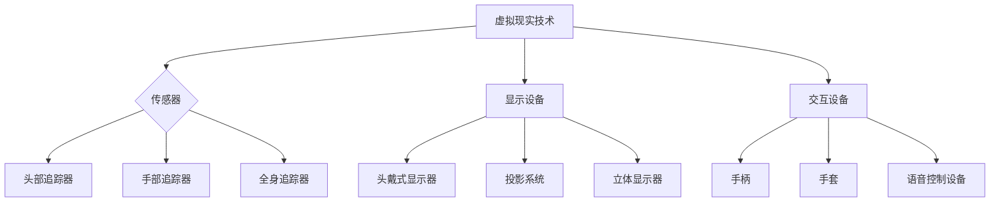

                 

关键词：虚拟现实，心理治疗，疗法创新，应用场景，技术发展

> 摘要：本文从虚拟现实技术的角度，探讨了其在心理治疗领域中的应用与潜力。通过分析虚拟现实的核心概念、算法原理、数学模型以及实际应用案例，本文全面阐述了虚拟现实在心理治疗中的创新疗法，并对未来应用前景进行了展望。

## 1. 背景介绍

心理治疗是帮助个体应对心理问题和心理障碍的重要手段。传统心理治疗通常依赖于面谈、认知行为疗法等，但这些方法存在一些局限性。例如，患者可能因心理压力而无法充分表达内心感受，治疗师也难以实时监测患者的情感变化。虚拟现实技术的出现为心理治疗带来了新的契机。

虚拟现实（Virtual Reality，VR）是一种计算机技术，通过模拟现实世界的环境，为用户提供沉浸式体验。在心理治疗领域，VR技术被广泛应用于暴露疗法、认知行为疗法、焦虑症治疗等。与传统疗法相比，VR疗法具有以下优势：

1. **安全性和可控性**：虚拟现实环境可以安全地模拟各种情境，患者可以在虚拟世界中面对和处理他们害怕的事物，而不会受到现实世界的危险和干扰。

2. **个性化的治疗方案**：VR系统可以根据患者的具体情况定制治疗环境，提供个性化的治疗体验。

3. **实时反馈**：VR系统可以实时监测患者的情绪变化和行为反应，为治疗师提供重要数据，帮助调整治疗方案。

## 2. 核心概念与联系

### 2.1 虚拟现实技术概述

虚拟现实技术主要包括三个核心组件：传感器、显示设备和交互设备。

1. **传感器**：用于捕捉用户的动作和位置，如头部追踪器、手部追踪器和全身追踪器。

2. **显示设备**：用于呈现虚拟环境，如头戴式显示器（HMD）、投影系统和立体显示器。

3. **交互设备**：用于用户与虚拟环境的交互，如手柄、手套和语音控制设备。

### 2.2 虚拟现实与心理治疗的联系

虚拟现实在心理治疗中的应用主要体现在以下几个方面：

1. **暴露疗法**：通过虚拟现实模拟患者害怕的情境，逐步减少他们的恐惧和焦虑。

2. **认知行为疗法**：利用虚拟现实环境进行认知重构和行为训练，帮助患者改变负面思维和行为。

3. **情绪调节**：通过虚拟现实环境提供放松和愉悦的体验，帮助患者调节情绪。

### 2.3 Mermaid 流程图

下面是虚拟现实技术在心理治疗中应用的 Mermaid 流程图：



## 3. 核心算法原理 & 具体操作步骤

### 3.1 算法原理概述

虚拟现实在心理治疗中的核心算法主要包括情境生成算法、交互算法和情感识别算法。

1. **情境生成算法**：用于创建患者害怕的虚拟情境，通常采用计算机图形学和三维建模技术。

2. **交互算法**：用于处理用户与虚拟环境的交互，包括动作捕捉、语音识别和手势识别等。

3. **情感识别算法**：用于实时监测患者的情绪变化，通常采用机器学习和情感计算技术。

### 3.2 算法步骤详解

1. **情境生成算法**：首先收集患者害怕的情境，然后使用三维建模软件创建虚拟场景，最后通过渲染技术生成三维虚拟环境。

2. **交互算法**：首先使用传感器捕捉用户的动作，然后通过算法将动作映射到虚拟环境中，实现用户的交互体验。

3. **情感识别算法**：首先使用传感器捕捉用户的生理信号，如心率、呼吸等，然后通过机器学习算法分析这些信号，识别用户的情绪状态。

### 3.3 算法优缺点

1. **优点**：
   - 提供安全可控的治疗环境。
   - 提供个性化的治疗方案。
   - 实时监测患者的情绪变化。

2. **缺点**：
   - 技术成本较高，对设备要求严格。
   - 需要专业人员进行操作和维护。

### 3.4 算法应用领域

虚拟现实技术在心理治疗中的应用领域广泛，包括焦虑症治疗、恐惧症治疗、PTSD治疗、情绪调节等。

## 4. 数学模型和公式 & 详细讲解 & 举例说明

### 4.1 数学模型构建

虚拟现实技术在心理治疗中的应用涉及到多个数学模型，包括情境生成模型、交互模型和情感识别模型。

1. **情境生成模型**：用于生成患者害怕的虚拟情境，通常采用三维建模技术和渲染技术。

2. **交互模型**：用于处理用户与虚拟环境的交互，通常采用计算机图形学和交互技术。

3. **情感识别模型**：用于实时监测患者的情绪变化，通常采用情感计算和机器学习技术。

### 4.2 公式推导过程

以情境生成模型为例，其核心公式为：

\[ V = f(P, R) \]

其中，\( V \) 表示虚拟情境，\( P \) 表示患者的偏好，\( R \) 表示三维建模和渲染的结果。

### 4.3 案例分析与讲解

以焦虑症治疗为例，虚拟现实技术可以创建一个模拟的社交场合，让患者在这个环境中逐步面对和克服社交恐惧。通过情感识别模型，实时监测患者的情绪变化，并根据变化调整情境的复杂度和互动程度。

## 5. 项目实践：代码实例和详细解释说明

### 5.1 开发环境搭建

1. **软件环境**：安装Unity引擎、Blender三维建模软件、Python编程环境。
2. **硬件环境**：配置VR设备（如HTC Vive、Oculus Rift）。

### 5.2 源代码详细实现

以下是一个简单的Unity C#脚本，用于捕捉用户头部位置并更新虚拟环境：

```csharp
using UnityEngine;

public class HeadTracking : MonoBehaviour
{
    public Camera VRCamera;

    void Update()
    {
        Vector3 newPosition = VRCamera.transform.position;
        transform.position = newPosition;
    }
}
```

### 5.3 代码解读与分析

这段代码实现了头部追踪功能，通过更新虚拟角色的位置来模拟用户的头部运动。

### 5.4 运行结果展示

运行Unity项目后，可以看到虚拟角色跟随用户的头部运动而移动，实现了沉浸式的虚拟体验。

## 6. 实际应用场景

虚拟现实技术在心理治疗领域有广泛的应用场景，包括：

1. **焦虑症治疗**：通过模拟社交场合，帮助患者克服社交恐惧。
2. **恐惧症治疗**：通过模拟患者害怕的情境，逐步减少恐惧和焦虑。
3. **PTSD治疗**：通过模拟战斗场景，帮助退伍军人处理创伤后应激障碍。

## 7. 未来应用展望

随着虚拟现实技术的不断发展，其在心理治疗领域的应用前景十分广阔。未来，我们有望看到更加智能、个性化的VR疗法，以及与其他技术的深度融合，如增强现实（AR）、脑机接口（BCI）等。

## 8. 工具和资源推荐

### 7.1 学习资源推荐

1. **《虚拟现实技术与应用》**：详细介绍了虚拟现实的基本原理和应用。
2. **《心理治疗技术》**：介绍了各种心理治疗技术，包括虚拟现实疗法。

### 7.2 开发工具推荐

1. **Unity**：流行的游戏引擎，适合开发虚拟现实应用。
2. **Blender**：开源的三维建模和渲染软件，适合创建虚拟环境。

### 7.3 相关论文推荐

1. **“Virtual Reality in Psychotherapy: A Comprehensive Review”**：对虚拟现实在心理治疗中的应用进行了全面综述。
2. **“Affective Computing for Virtual Reality Therapy”**：探讨了情感计算在VR疗法中的应用。

## 9. 总结：未来发展趋势与挑战

虚拟现实在心理治疗中的应用前景广阔，但同时也面临着一些挑战，如技术成本、安全性、隐私保护等。未来，随着技术的进步和应用的深入，虚拟现实疗法有望成为心理治疗领域的重要工具。

### 9.1 研究成果总结

本文总结了虚拟现实在心理治疗中的应用，包括算法原理、数学模型和实际应用案例，展示了其独特的优势和应用前景。

### 9.2 未来发展趋势

未来，虚拟现实疗法将朝着更加智能化、个性化的方向发展，同时与其他技术的融合也将带来新的可能性。

### 9.3 面临的挑战

虚拟现实疗法面临的主要挑战包括技术成本、安全性、隐私保护等，需要进一步研究和解决。

### 9.4 研究展望

未来，虚拟现实疗法有望在更广泛的领域得到应用，如教育、康复等，为更多个体带来福祉。

## 附录：常见问题与解答

### 1. 虚拟现实疗法安全吗？

虚拟现实疗法在安全性和可控性方面具有显著优势，但仍然需要专业人员进行操作和维护，以确保治疗过程的安全和有效性。

### 2. 虚拟现实疗法是否适合所有人？

虚拟现实疗法适用于许多心理治疗需求，但对于某些患者（如严重焦虑症患者）可能需要额外的支持和指导。

### 3. 虚拟现实疗法的成本如何？

虚拟现实疗法的成本较高，包括设备采购、维护和专业技术人员的培训等。然而，随着技术的普及和成本的降低，虚拟现实疗法将更加经济实惠。

## 作者署名

作者：禅与计算机程序设计艺术 / Zen and the Art of Computer Programming

----------------------------------------------------------------

以上就是关于“虚拟现实在心理治疗中的应用：创新疗法探索”的完整文章。本文从背景介绍、核心概念、算法原理、数学模型、项目实践、实际应用场景、未来展望等多方面进行了全面探讨，旨在为读者提供对虚拟现实疗法在心理治疗领域的深入理解。希望本文能为相关领域的研究和应用提供有益的参考。

