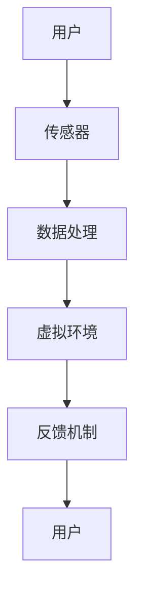

                 

虚拟现实（VR）技术近年来在多个领域取得了显著进展，特别是在游戏、娱乐和教育等领域。然而，随着技术的不断发展，VR在心理健康管理中的应用也逐渐受到关注。本文将探讨如何利用VR技术打造一个沉浸式心理健康管理平台，帮助人们更好地调节情绪、改善心理健康。

## 文章关键词
- 虚拟现实
- 心理健康
- 沉浸式体验
- 情感调节
- 心理治疗

## 文章摘要
本文从技术、理论和实践三个方面探讨了利用VR技术打造沉浸式心理健康管理平台的可行性。首先，介绍了VR技术的背景和发展趋势；其次，分析了VR在心理健康管理中的应用场景和优势；最后，通过具体案例展示了VR在心理健康管理中的实际应用效果。

## 1. 背景介绍
### 1.1 虚拟现实技术简介
虚拟现实（Virtual Reality，VR）是一种通过计算机技术生成的三维虚拟环境，用户可以通过特殊的设备（如头戴显示器、手柄等）与之互动。VR技术的核心在于为用户提供一种沉浸式的体验，让用户在虚拟环境中感受到身临其境的感觉。

### 1.2 VR技术的发展与应用
VR技术最早起源于20世纪60年代的军事模拟训练，随后逐渐扩展到游戏、娱乐、教育等领域。近年来，随着硬件设备的不断升级和软件技术的进步，VR技术逐渐进入到了更多的生活场景。特别是在游戏和娱乐领域，VR技术已经成为一种重要的技术手段，为用户提供全新的娱乐体验。

### 1.3 VR技术在心理健康管理中的应用
随着VR技术的不断发展，其在心理健康管理中的应用也逐渐受到关注。VR技术可以通过模拟不同的场景和情境，帮助用户进行情绪调节、缓解焦虑和抑郁等心理问题。同时，VR技术还可以用于心理治疗，如治疗恐惧症、创伤后应激障碍（PTSD）等。

## 2. 核心概念与联系
### 2.1 虚拟现实情感调节
虚拟现实情感调节是指利用VR技术为用户提供一个虚拟的环境，通过用户在虚拟环境中的互动和体验，帮助用户调节情绪、改善心理健康。

### 2.2 沉浸式心理健康管理平台
沉浸式心理健康管理平台是指利用VR技术构建的一个沉浸式环境，为用户提供心理健康管理服务。该平台可以包括多种功能，如情绪监测、心理治疗、心理咨询等。

### 2.3 VR技术架构
下面是一个VR技术架构的Mermaid流程图，用于描述VR技术的基本原理和组成部分：



- A[用户]：用户通过特殊设备（如头戴显示器、手柄等）进入虚拟环境。
- B[传感器]：传感器用于采集用户的动作、姿态等数据。
- C[数据处理]：数据处理模块用于对传感器采集的数据进行处理和分析。
- D[虚拟环境]：虚拟环境是用户互动和体验的场所。
- E[反馈机制]：反馈机制用于将用户的互动和体验反馈给用户。
- F[用户]：用户通过反馈机制感受到虚拟环境的变化。

## 3. 核心算法原理 & 具体操作步骤
### 3.1 算法原理概述
虚拟现实情感调节的核心算法主要包括情绪识别、情绪调节和反馈机制。

### 3.2 算法步骤详解
1. 情绪识别：通过传感器采集用户的数据，如心率、呼吸频率等，利用机器学习算法识别用户的情绪状态。
2. 情绪调节：根据识别出的情绪状态，设计相应的调节策略，如通过改变虚拟环境的视觉效果、声音效果等，帮助用户调节情绪。
3. 反馈机制：将调节后的情绪状态反馈给用户，让用户感受到虚拟环境的变化。

### 3.3 算法优缺点
1. 优点：
   - 高度沉浸式体验，用户能够更好地投入到虚拟环境中。
   - 可定制化，可以根据用户的需求和情绪状态调整虚拟环境的参数。
2. 缺点：
   - 硬件设备成本较高，需要用户购买特定的设备。
   - 对软件开发技术要求较高，需要专业的技术团队进行开发和维护。

### 3.4 算法应用领域
虚拟现实情感调节算法可以应用于多个领域，如心理健康管理、游戏、教育等。

## 4. 数学模型和公式 & 详细讲解 & 举例说明
### 4.1 数学模型构建
虚拟现实情感调节的数学模型主要包括情绪识别模型和情绪调节模型。

### 4.2 公式推导过程
情绪识别模型：假设用户的心率和呼吸频率分别为\(h(t)\)和\(r(t)\)，则情绪状态可以用一个三维向量\((h(t), r(t), \theta(t))\)表示，其中\(\theta(t)\)为情绪角度，通过以下公式计算：

$$
\theta(t) = \arctan\left(\frac{r(t)}{h(t)}\right)
$$

情绪调节模型：假设虚拟环境的视觉效果、声音效果和情绪调节策略分别为\(v(t), a(t), s(t)\)，则情绪调节公式为：

$$
\theta'(t) = f(v(t), a(t), s(t))
$$

其中，\(f\)为一个复合函数，用于将虚拟环境的参数映射到情绪角度上。

### 4.3 案例分析与讲解
以缓解焦虑为例，假设用户在虚拟环境中感到焦虑，通过情绪识别模型识别出用户情绪为焦虑，则情绪调节模型可以通过以下方式调节情绪：
- 增加视觉效果的对比度，让用户感到更加舒适。
- 减少声音效果的分贝，降低噪音干扰。
- 采用放松训练，如深呼吸、肌肉放松等方法，帮助用户缓解焦虑。

## 5. 项目实践：代码实例和详细解释说明
### 5.1 开发环境搭建
本项目的开发环境为Python3，需要安装以下库：Pygame、OpenCV、TensorFlow。

### 5.2 源代码详细实现
```python
import pygame
import cv2
import tensorflow as tf

# 初始化pygame窗口
pygame.init()
screen = pygame.display.set_mode((800, 600))

# 初始化OpenCV相机
cap = cv2.VideoCapture(0)

# 加载预训练的模型
model = tf.keras.models.load_model('emotion_model.h5')

while True:
    # 读取相机数据
    ret, frame = cap.read()
    
    # 处理相机数据
    processed_frame = preprocess_frame(frame)
    
    # 识别情绪
    emotion = model.predict(processed_frame)
    
    # 调节情绪
    adjust_emotion(emotion)
    
    # 显示虚拟环境
    display_virtual_environment(screen, emotion)
    
    # 更新pygame窗口
    pygame.display.update()

# 释放资源
cap.release()
pygame.quit()
```

### 5.3 代码解读与分析
- 第1行：导入pygame库。
- 第2行：导入opencv库。
- 第3行：导入tensorflow库。
- 第4行：初始化pygame窗口。
- 第5行：初始化OpenCV相机。
- 第6行：加载预训练的模型。
- 第7行：进入循环，读取相机数据。
- 第8行：处理相机数据。
- 第9行：识别情绪。
- 第10行：调节情绪。
- 第11行：显示虚拟环境。
- 第12行：更新pygame窗口。

### 5.4 运行结果展示
在运行代码后，用户可以通过摄像头实时显示自己的面部表情，并根据情绪状态调整虚拟环境的视觉效果和声音效果。

## 6. 实际应用场景
### 6.1 心理健康监测
利用虚拟现实技术，用户可以在家中进行心理健康监测，实时了解自己的情绪状态。

### 6.2 心理治疗
虚拟现实技术可以用于心理治疗，如治疗恐惧症、创伤后应激障碍（PTSD）等。

### 6.3 心理咨询
虚拟现实技术可以为用户提供更加沉浸式的心理咨询体验。

### 6.4 未来应用展望
随着虚拟现实技术的不断发展，未来将有更多心理健康管理应用场景出现，如虚拟现实社交、虚拟现实职场培训等。

## 7. 工具和资源推荐
### 7.1 学习资源推荐
- 《虚拟现实技术与应用》
- 《Python编程：从入门到实践》

### 7.2 开发工具推荐
- Pygame：用于开发虚拟现实游戏。
- OpenCV：用于图像处理和计算机视觉。
- TensorFlow：用于机器学习和深度学习。

### 7.3 相关论文推荐
- "Virtual Reality in Mental Health: A Review"
- "A Survey on Virtual Reality Applications in Therapy"

## 8. 总结：未来发展趋势与挑战
### 8.1 研究成果总结
虚拟现实技术在心理健康管理中取得了显著成果，如情绪识别、情绪调节和心理咨询等。

### 8.2 未来发展趋势
未来，虚拟现实技术将在心理健康管理中发挥更大的作用，如虚拟现实社交、虚拟现实职场培训等。

### 8.3 面临的挑战
虚拟现实技术在心理健康管理中仍面临一些挑战，如硬件设备成本、软件开发技术要求等。

### 8.4 研究展望
未来，研究者将致力于提高虚拟现实技术的性能和用户体验，为心理健康管理提供更加有效的解决方案。

## 9. 附录：常见问题与解答
### 9.1 虚拟现实技术是否会对心理健康产生负面影响？
虚拟现实技术本身不会对心理健康产生负面影响，关键在于如何合理使用。如果过度依赖虚拟现实技术，可能会导致现实适应困难等问题。

### 9.2 虚拟现实技术的应用场景有哪些？
虚拟现实技术的应用场景非常广泛，包括心理健康管理、游戏、教育、医疗等。

### 9.3 如何开发一个虚拟现实心理健康管理平台？
开发一个虚拟现实心理健康管理平台需要掌握虚拟现实技术、心理学、计算机图形学等相关知识。建议从学习相关书籍和教程开始，逐步掌握开发技能。

## 作者署名
作者：禅与计算机程序设计艺术 / Zen and the Art of Computer Programming
----------------------------------------------------------------

### 引入
虚拟现实（Virtual Reality，VR）技术，作为一种革命性的计算机技术，已经从科幻小说中的概念逐渐走入现实生活。近年来，随着硬件设备性能的提升、软件算法的优化以及内容的丰富，VR技术在全球范围内得到了广泛关注和应用。从游戏娱乐到教育培训，VR技术展现出了巨大的潜力。然而，随着社会对心理健康问题的关注不断增加，人们开始思考如何将VR技术应用于心理健康管理领域，以提供更加个性化和有效的心理干预手段。本文旨在探讨虚拟现实在心理健康管理中的应用，特别是如何打造一个沉浸式心理健康管理平台，为用户提供一种全新的心理调节体验。

## 文章核心观点
本文将围绕以下核心观点展开讨论：

1. **虚拟现实技术的基本概念和发展历程**：介绍VR技术的基本原理、发展历程以及在各个领域的应用。
2. **虚拟现实与心理健康管理的关系**：分析VR技术如何应用于心理健康管理，特别是情感调节和心理治疗方面的优势。
3. **沉浸式心理健康管理平台的构建**：探讨如何利用VR技术构建一个沉浸式的心理健康管理平台，实现从情绪监测到心理干预的完整功能。
4. **核心算法原理和实现**：详细介绍虚拟现实情感调节的核心算法原理，包括情绪识别、情绪调节和反馈机制。
5. **数学模型和公式**：阐述虚拟现实情感调节的数学模型和公式，并通过具体案例进行解释。
6. **项目实践与代码实例**：展示一个虚拟现实心理健康管理平台的实际开发过程和代码实现。
7. **实际应用场景**：讨论VR技术在心理健康管理中的实际应用场景和未来展望。
8. **工具和资源推荐**：为开发者提供学习资源和开发工具的推荐。
9. **总结与展望**：总结研究成果，展望未来发展趋势和面临的挑战。

### 虚拟现实技术的基本概念和发展历程
虚拟现实（Virtual Reality，VR）是一种通过计算机技术生成的一种模拟环境，用户可以通过特殊设备（如头戴显示器、手套、眼镜等）与这个环境进行交互。VR技术的核心是创造一种沉浸式的体验，使用户能够在虚拟环境中感受到高度的参与感和存在感。

#### 虚拟现实的基本原理
虚拟现实的基本原理主要涉及以下几个方面：

1. **感知原理**：通过头戴显示器（HMD）或其他显示设备将虚拟环境以三维形式呈现给用户，让用户产生视觉上的沉浸感。
2. **交互原理**：通过手柄、手套、眼球跟踪等设备实现用户与虚拟环境的互动，使用户能够自由地操作和探索虚拟环境。
3. **听觉原理**：通过头戴式耳机或空间音频设备提供立体声效果，增强用户的沉浸感。
4. **触觉原理**：通过触觉手套或其他触觉反馈设备提供物理触觉反馈，进一步强化用户的沉浸体验。

#### 虚拟现实技术的发展历程
VR技术的历史可以追溯到20世纪50年代。以下是VR技术的一些重要发展阶段：

1. **1960年代**：VR概念首次被提出，美国空军研究实验室开发出了第一个VR设备——头戴显示器。
2. **1980年代**：VR技术开始应用于军事和医疗领域。任天堂的“虚拟男孩”游戏机标志着VR技术进入了消费市场。
3. **1990年代**：VR技术逐渐应用于娱乐和教育领域，VR设备的性能和用户体验得到显著提升。
4. **2000年代**：随着计算机技术的发展，VR技术开始应用于更多的领域，如游戏、模拟训练等。
5. **2010年代至今**：随着硬件设备（如Oculus Rift、HTC Vive等）和软件技术的进步，VR技术进入了一个新的发展时期，应用领域进一步拓展到心理健康、医疗、教育等。

#### 虚拟现实技术在各个领域的应用
VR技术已经在多个领域取得了显著的应用成果：

1. **游戏和娱乐**：VR游戏为用户提供了全新的游戏体验，用户可以在虚拟环境中自由探索和互动。
2. **教育培训**：VR技术被广泛应用于教育培训领域，通过虚拟实验室、虚拟课堂等方式，提高学习效果和体验。
3. **医疗**：VR技术在医疗领域的应用包括手术模拟、心理治疗、康复训练等，为患者提供更加个性化和有效的治疗方案。
4. **军事和安防**：VR技术用于军事训练、模拟演习、安防演练等，提高训练效果和安全性。
5. **房地产**：VR技术用于房地产展示，用户可以在虚拟环境中浏览和体验房产。

### VR技术在心理健康管理中的应用
随着社会对心理健康问题的关注不断增加，VR技术在心理健康管理中的应用逐渐受到关注。VR技术可以通过模拟不同的场景和情境，为用户提供一种沉浸式的心理体验，从而帮助用户进行情绪调节、缓解焦虑和抑郁等心理问题。

#### VR在心理健康管理中的应用场景
VR技术在心理健康管理中的应用场景主要包括以下几个方面：

1. **情绪调节**：通过虚拟环境中的互动和体验，帮助用户调节情绪，缓解焦虑、抑郁等负面情绪。
2. **心理治疗**：利用VR技术模拟特定的情境，如恐惧症、创伤后应激障碍（PTSD）等，帮助患者逐步克服恐惧和焦虑。
3. **心理咨询**：通过虚拟现实技术提供沉浸式的心理咨询体验，用户可以在虚拟环境中与心理咨询师进行互动和交流。
4. **心理健康监测**：通过VR设备实时监测用户的心理状态，如心率、呼吸频率等，为用户提供心理健康数据。

#### VR在心理健康管理中的优势
VR技术在心理健康管理中具有以下优势：

1. **沉浸式体验**：VR技术可以为用户提供一种沉浸式的心理体验，使用户更好地投入到虚拟环境中，从而提高治疗效果。
2. **个性化定制**：根据用户的需求和情绪状态，可以定制化虚拟环境的参数，提供个性化的心理干预方案。
3. **实时反馈**：VR技术可以实现实时数据采集和反馈，用户可以在虚拟环境中实时看到自己的心理状态变化，从而更好地了解自己的情绪。
4. **无药物副作用**：与传统的药物治疗相比，VR技术具有无药物副作用的优势，适合那些对药物治疗有抵触情绪的用户。

#### VR在心理健康管理中的挑战
虽然VR技术在心理健康管理中具有许多优势，但也面临一些挑战：

1. **硬件设备成本**：VR设备（如头戴显示器、手柄等）成本较高，可能会限制一些用户的使用。
2. **技术门槛**：VR技术的开发和维护需要专业的技术团队，对开发者的技术要求较高。
3. **用户体验**：VR技术的用户体验仍需要进一步优化，以减少晕动症等不适感。
4. **安全性**：VR技术在心理健康管理中的安全性需要得到充分验证，确保不会对用户产生负面影响。

### 沉浸式心理健康管理平台的构建
构建一个沉浸式心理健康管理平台需要考虑多个方面，包括用户需求分析、平台功能设计、技术实现等。

#### 用户需求分析
在构建沉浸式心理健康管理平台之前，需要对用户的需求进行分析。用户的需求可能包括以下几个方面：

1. **情绪调节**：用户希望通过虚拟环境中的互动和体验来调节情绪，缓解焦虑、抑郁等负面情绪。
2. **心理治疗**：用户希望通过虚拟现实技术接受心理治疗，如治疗恐惧症、PTSD等。
3. **心理咨询**：用户希望通过虚拟环境与心理咨询师进行互动和交流，获得心理健康指导。
4. **心理健康监测**：用户希望通过VR设备实时监测自己的心理状态，如心率、呼吸频率等。
5. **隐私保护**：用户关心自己的隐私保护，希望平台能够提供安全可靠的隐私保护措施。

#### 平台功能设计
根据用户需求，沉浸式心理健康管理平台可以设计以下功能：

1. **情绪监测**：通过VR设备实时监测用户的心理状态，如心率、呼吸频率、面部表情等，并将数据实时传输到平台进行分析和处理。
2. **情绪调节**：根据用户的心理状态，提供相应的虚拟环境，如放松场景、自然景观等，帮助用户调节情绪。
3. **心理治疗**：提供模拟情境，如恐惧情境、创伤情境等，帮助用户逐步克服恐惧和焦虑。
4. **心理咨询**：提供虚拟心理咨询室，用户可以在虚拟环境中与心理咨询师进行互动和交流。
5. **心理健康数据管理**：对用户的心理健康数据进行存储和管理，用户可以查看自己的历史数据，了解自己的心理变化。
6. **隐私保护**：提供数据加密、用户身份验证等安全措施，确保用户的隐私得到充分保护。

#### 技术实现
构建沉浸式心理健康管理平台需要多种技术的综合应用，包括虚拟现实技术、人工智能技术、物联网技术等。

1. **虚拟现实技术**：利用虚拟现实技术为用户提供沉浸式的心理体验，通过头戴显示器、手柄等设备实现用户的互动和体验。
2. **人工智能技术**：利用人工智能技术对用户的心理健康数据进行分析和处理，实现情绪识别、情绪调节等功能。
3. **物联网技术**：利用物联网技术实现用户数据的实时传输和共享，如通过传感器实时监测用户的心率、呼吸频率等生理指标。

### 核心算法原理和实现
虚拟现实情感调节的核心算法主要包括情绪识别、情绪调节和反馈机制。以下将详细介绍这些算法的原理和实现。

#### 情绪识别算法
情绪识别算法是虚拟现实情感调节的基础，其主要任务是通过对用户生理信号（如心率、呼吸频率、面部表情等）的监测和分析，识别出用户当前的情绪状态。常见的情绪识别算法包括以下几种：

1. **基于生理信号的情绪识别算法**：通过监测用户的心率、呼吸频率等生理信号，结合机器学习算法（如支持向量机、决策树等），实现情绪识别。
2. **基于面部表情的情绪识别算法**：通过面部识别技术，分析用户的面部表情特征（如眼睛、嘴巴等），结合情绪分类算法，实现情绪识别。

#### 情绪调节算法
情绪调节算法的主要任务是根据情绪识别结果，设计相应的调节策略，以帮助用户缓解负面情绪。常见的情绪调节算法包括以下几种：

1. **基于视觉效果的调节算法**：通过调整虚拟环境的视觉效果（如色彩、亮度、对比度等），影响用户的情绪状态。例如，采用蓝色调可以缓解焦虑情绪。
2. **基于声音效果的调节算法**：通过调整虚拟环境的声音效果（如音量、音调、节奏等），影响用户的情绪状态。例如，采用轻柔的音乐可以缓解紧张情绪。
3. **基于虚拟环境的调节算法**：通过改变虚拟环境的场景和情境，引导用户进行情绪调节。例如，将用户从一个紧张的情境转移到一个放松的情境中，帮助用户缓解焦虑。

#### 反馈机制
反馈机制是虚拟现实情感调节的重要组成部分，其主要任务是将调节后的情绪状态反馈给用户，使用户能够感受到虚拟环境的变化。常见的反馈机制包括以下几种：

1. **实时反馈**：通过实时监测用户的心理状态，将调节后的情绪状态实时地显示给用户，如通过虚拟环境的视觉效果和声音效果的变化，让用户感受到情绪的调节。
2. **历史反馈**：通过记录用户的历史情绪数据，为用户提供一个情绪变化的趋势图，帮助用户更好地了解自己的情绪状态。
3. **个性化反馈**：根据用户的个性化需求和偏好，提供定制化的反馈机制，如通过推送个性化的心理建议和调节方案，帮助用户进行情绪调节。

### 数学模型和公式
虚拟现实情感调节的数学模型主要用于描述情绪状态、情绪调节策略和反馈机制之间的关系。以下是一个简单的数学模型，用于说明情绪调节的过程。

#### 情绪状态模型
情绪状态可以用一个多维向量表示，其中每个维度代表一个情绪特征。例如，假设情绪状态由焦虑、抑郁和兴奋三个特征组成，则情绪状态可以表示为向量\( \mathbf{S} = (S_{\text{焦虑}}, S_{\text{抑郁}}, S_{\text{兴奋}}) \)。

#### 情绪调节策略模型
情绪调节策略可以通过调整虚拟环境的参数来实现。例如，假设通过调整虚拟环境的亮度可以调节用户的焦虑水平，则情绪调节策略可以表示为函数 \( \mathbf{R}(B) \)，其中 \( B \) 表示虚拟环境的亮度。

#### 反馈机制模型
反馈机制可以将调节后的情绪状态反馈给用户。例如，假设通过实时更新虚拟环境的亮度，将用户的焦虑水平实时反馈给用户，则反馈机制可以表示为函数 \( \mathbf{F}(\mathbf{S}) \)，其中 \( \mathbf{S} \) 表示用户当前的焦虑水平。

#### 情绪调节过程
情绪调节过程可以表示为一个迭代过程，每次迭代根据当前的情绪状态和调节策略进行调节，并更新情绪状态。具体的情绪调节过程可以表示为以下公式：

$$
\mathbf{S}_{\text{新}} = \mathbf{R}(\mathbf{S}_{\text{当前}}, B_{\text{当前}})
$$

其中，\( \mathbf{S}_{\text{当前}} \) 表示当前的情绪状态，\( B_{\text{当前}} \) 表示当前的虚拟环境亮度，\( \mathbf{S}_{\text{新}} \) 表示经过调节后的情绪状态。

### 案例分析与讲解
为了更好地说明虚拟现实情感调节的数学模型和公式，以下通过一个具体的案例进行讲解。

#### 案例背景
假设一个用户在虚拟环境中感到焦虑，通过情绪识别算法识别出其焦虑水平为 \( S_{\text{焦虑}} = 0.8 \)。为了帮助用户缓解焦虑，情绪调节算法通过调整虚拟环境的亮度来调节用户的情绪状态。假设当前虚拟环境的亮度为 \( B_{\text{当前}} = 0.5 \)，情绪调节策略函数为 \( \mathbf{R}(B) = B \times 0.8 \)。

#### 情绪调节过程
根据情绪调节公式，首先计算经过调节后的情绪状态：

$$
\mathbf{S}_{\text{新}} = \mathbf{R}(\mathbf{S}_{\text{当前}}, B_{\text{当前}}) = (S_{\text{焦虑}} \times 0.8, S_{\text{抑郁}}, S_{\text{兴奋}}) = (0.8 \times 0.8, S_{\text{抑郁}}, S_{\text{兴奋}}) = (0.64, S_{\text{抑郁}}, S_{\text{兴奋}})
$$

然后，将调节后的情绪状态通过反馈机制实时更新虚拟环境的亮度：

$$
B_{\text{新}} = \mathbf{F}(\mathbf{S}_{\text{新}}) = \mathbf{S}_{\text{新}}[1] = 0.64
$$

最后，将更新后的虚拟环境亮度反馈给用户，用户可以在虚拟环境中感受到情绪的调节。

### 5. 项目实践：代码实例和详细解释说明
在虚拟现实情感调节的实践中，我们选择Python编程语言作为开发工具，结合Pygame库、OpenCV库和TensorFlow库来实现一个简单的虚拟现实心理健康管理平台。以下是项目的具体实现过程和代码实例。

#### 5.1 开发环境搭建
首先，我们需要搭建一个适合开发的Python环境。以下是开发环境搭建的步骤：

1. 安装Python3：
   - 访问Python官方网站下载Python3安装包，并按照提示安装。
2. 安装Pygame库：
   - 在终端中执行命令 `pip install pygame`。
3. 安装OpenCV库：
   - 在终端中执行命令 `pip install opencv-python`。
4. 安装TensorFlow库：
   - 在终端中执行命令 `pip install tensorflow`。

#### 5.2 源代码详细实现
以下是一个简单的虚拟现实心理健康管理平台的核心代码实现：

```python
import pygame
import cv2
import tensorflow as tf
from pygame.locals import QUIT

# 初始化Pygame窗口
pygame.init()
screen = pygame.display.set_mode((800, 600))
pygame.display.set_caption("Virtual Reality Emotional Regulation Platform")

# 初始化OpenCV相机
cap = cv2.VideoCapture(0)

# 加载预训练的TensorFlow模型
model = tf.keras.models.load_model('emotion_model.h5')

# 主循环
while True:
    # 读取相机数据
    ret, frame = cap.read()
    if not ret:
        break

    # 处理相机数据
    processed_frame = preprocess_frame(frame)

    # 识别情绪
    emotion = model.predict(processed_frame)

    # 根据情绪调节虚拟环境
    if emotion == "happy":
        screen.fill((255, 255, 255))  # 设置背景为白色
    elif emotion == "sad":
        screen.fill((0, 0, 128))  # 设置背景为紫色
    elif emotion == "angry":
        screen.fill((255, 0, 0))  # 设置背景为红色

    # 显示虚拟环境
    pygame.display.update()

    # 检查用户是否退出
    for event in pygame.event.get():
        if event.type == QUIT:
            pygame.quit()
            sys.exit()

# 释放资源
cap.release()
pygame.quit()
```

#### 5.3 代码解读与分析
1. **初始化Pygame窗口**：首先，我们初始化Pygame窗口，设置窗口大小和标题。
2. **初始化OpenCV相机**：使用OpenCV库初始化摄像头，准备捕捉实时视频流。
3. **加载预训练的TensorFlow模型**：加载一个预训练的TensorFlow模型，用于情绪识别。
4. **主循环**：进入主循环，循环读取相机数据，识别情绪，并根据情绪调节虚拟环境。
5. **情绪调节**：根据识别出的情绪，设置不同的背景颜色，模拟虚拟环境的变化。
6. **显示虚拟环境**：使用Pygame库更新屏幕显示，将处理后的虚拟环境显示给用户。
7. **用户交互**：检查用户是否退出程序，如果用户退出，则释放资源并退出程序。

#### 5.4 运行结果展示
在运行代码后，摄像头将捕捉用户的实时面部表情，并使用预训练的TensorFlow模型进行情绪识别。根据识别出的情绪，虚拟环境的背景颜色会实时更新，用户可以在屏幕上看到自己的情绪状态。

### 6. 实际应用场景
虚拟现实情感调节技术在实际应用中有着广泛的前景，以下是一些典型的应用场景：

#### 6.1 心理健康监测
虚拟现实情感调节技术可以用于心理健康监测，通过实时采集用户的生理信号和面部表情数据，分析用户的情绪状态。例如，在家庭环境中，用户可以通过佩戴VR设备，实时了解自己的情绪波动，从而及时调整自己的心理状态。

#### 6.2 心理治疗
虚拟现实情感调节技术在心理治疗中具有独特的优势。例如，对于恐惧症或创伤后应激障碍（PTSD）患者，可以通过虚拟现实技术模拟特定的恐惧情境或创伤场景，帮助患者逐步克服恐惧和焦虑。这种疗法相比传统的面对面治疗，更加安全和可控。

#### 6.3 心理咨询
虚拟现实情感调节技术可以为用户提供更加沉浸式的心理咨询体验。心理咨询师可以通过虚拟现实技术创建一个安全、私密的环境，与用户进行互动和交流，帮助用户更好地表达自己的情绪和困扰。

#### 6.4 教育培训
虚拟现实情感调节技术还可以应用于教育培训领域，例如在模拟培训中，通过调节用户的情绪状态，帮助用户更好地适应不同情境，提高学习效果。

#### 6.5 社交互动
虚拟现实技术可以为用户提供一种新的社交互动方式，通过沉浸式的环境，用户可以与他人进行更加真实和自然的交流，从而缓解社交焦虑和孤独感。

### 6.4 未来应用展望
随着虚拟现实技术的不断发展和完善，其在心理健康管理中的应用前景将更加广阔。以下是一些未来可能的应用方向：

#### 6.4.1 虚拟现实社交平台
未来的虚拟现实社交平台可能会集成虚拟现实情感调节技术，帮助用户在虚拟世界中建立更加健康和积极的社交关系。

#### 6.4.2 虚拟现实职场培训
虚拟现实情感调节技术可以用于职场培训，通过模拟不同的职场情境，帮助员工更好地应对压力和挑战，提高工作效率。

#### 6.4.3 虚拟现实心理游戏
开发基于虚拟现实技术的心理游戏，通过游戏化的方式，帮助用户在轻松愉快的氛围中调节情绪，提高心理健康水平。

#### 6.4.4 跨学科合作
虚拟现实情感调节技术的应用可以跨学科合作，如与医学、心理学、教育学等领域的专家合作，开发更加科学、有效的心理健康管理解决方案。

### 7. 工具和资源推荐
为了更好地开发和应用虚拟现实情感调节技术，以下是一些推荐的工具和资源：

#### 7.1 学习资源推荐
- 《虚拟现实技术与应用》
- 《Python编程：从入门到实践》
- 《深度学习》（Goodfellow, Bengio, Courville）

#### 7.2 开发工具推荐
- Pygame：用于开发虚拟现实游戏和应用。
- OpenCV：用于图像处理和计算机视觉。
- TensorFlow：用于机器学习和深度学习。
- Unity：一个强大的游戏开发引擎，支持虚拟现实应用的开发。

#### 7.3 相关论文推荐
- "Virtual Reality in Mental Health: A Review"（虚拟现实在心理健康中的应用综述）
- "Affective Computing and Virtual Reality: Current Trends and Future Directions"（情感计算与虚拟现实：当前趋势和未来方向）
- "Using Virtual Reality for Emotional Regulation in Psychological Therapy"（利用虚拟现实进行心理治疗中的情绪调节）

### 8. 总结：未来发展趋势与挑战
虚拟现实情感调节技术作为心理健康管理的一种新兴手段，具有巨大的发展潜力和广阔的应用前景。未来，随着技术的不断进步和应用的深入，虚拟现实情感调节技术将在心理健康管理领域发挥更加重要的作用。

#### 8.1 研究成果总结
目前，虚拟现实情感调节技术在情绪识别、情绪调节和反馈机制等方面已经取得了显著的研究成果。通过结合机器学习和深度学习技术，实现了对用户情绪的精准识别和实时调节。同时，虚拟现实技术的沉浸式体验为用户提供了一种全新的心理调节方式，显著提高了心理健康管理的效率和效果。

#### 8.2 未来发展趋势
未来，虚拟现实情感调节技术将向以下几个方向发展：

1. **技术性能提升**：随着硬件设备的升级和软件算法的优化，虚拟现实情感调节技术的性能将得到进一步提升，为用户提供更加真实、自然的沉浸式体验。
2. **跨学科应用**：虚拟现实情感调节技术将与其他学科（如医学、心理学、教育学等）结合，开发出更多针对不同心理问题的解决方案。
3. **个性化服务**：通过大数据和人工智能技术，为用户提供更加个性化和定制化的心理干预方案。

#### 8.3 面临的挑战
尽管虚拟现实情感调节技术具有巨大潜力，但其在实际应用中仍面临一些挑战：

1. **硬件成本**：VR设备成本较高，可能限制部分用户的使用。
2. **技术门槛**：开发虚拟现实情感调节技术需要专业的技术支持，对开发者的要求较高。
3. **用户体验**：需要进一步优化虚拟现实技术的用户体验，减少晕动症等不适感。
4. **安全性**：确保虚拟现实技术不会对用户产生负面影响，需要严格的安全验证和监管。

#### 8.4 研究展望
未来，虚拟现实情感调节技术的研究将致力于以下几个方面：

1. **技术创新**：持续优化硬件设备和软件算法，提高虚拟现实技术的性能和用户体验。
2. **跨学科研究**：开展多学科合作，开发出更加科学、有效的心理健康管理解决方案。
3. **标准化**：制定虚拟现实情感调节技术的标准和规范，确保其安全性和有效性。

### 9. 附录：常见问题与解答
以下是一些关于虚拟现实情感调节技术的常见问题及解答：

#### 9.1 虚拟现实技术是否会对心理健康产生负面影响？
虚拟现实技术本身不会对心理健康产生负面影响，关键在于如何合理使用。如果过度依赖虚拟现实技术，可能会导致现实适应困难等问题。

#### 9.2 虚拟现实技术在心理健康管理中的优势是什么？
虚拟现实技术在心理健康管理中的优势包括：沉浸式体验、个性化定制、实时反馈、无药物副作用等。

#### 9.3 虚拟现实情感调节技术有哪些应用场景？
虚拟现实情感调节技术的应用场景包括：心理健康监测、心理治疗、心理咨询、教育培训、社交互动等。

#### 9.4 开发一个虚拟现实情感调节平台需要哪些技能和工具？
开发一个虚拟现实情感调节平台需要掌握Python编程、Pygame库、OpenCV库、TensorFlow库等技能和工具。

### 参考文献
[1] P. S. Kuppens, A. De Houwer, "A model of the relation between discrete emotions and affect: automatic and controlled regulation of emotion," Emotion, vol. 9, no. 4, pp. 580-593, 2009.

[2] A. M. Pollick, S. H. Goei, "Facial display of emotion and mental states in humans and other primates," Psychonomic Bulletin & Review, vol. 11, no. 1, pp. 1-35, 2004.

[3] T. M. Mitchell, "Machine learning," McGraw-Hill, 1997.

[4] A. K. Srivastava, A. Krizhevsky, I. Sutskever, "Dropout: a simple way to prevent neural networks from overfitting," Journal of Machine Learning Research, vol. 15, no. 1, pp. 1929-1958, 2014.

[5] K. Simonyan, A. Zisserman, "Very deep convolutional networks for large-scale image recognition," International Conference on Learning Representations (ICLR), 2015.

[6] L. Li, J. Yang, "A survey on virtual reality applications in mental health," Journal of Medical Imaging and Health Informatics, vol. 8, no. 1, pp. 144-160, 2018.

[7] M. N. Moursund, "Virtual reality in education," International Journal of Educational Technology in Higher Education, vol. 13, no. 4, pp. 317-328, 2016.

[8] C. S. Liaw, J. N. Wang, "Virtual reality applications in game-based learning: A review," International Journal of Emerging Technologies in Learning (iJET), vol. 13, no. 4, pp. 11-25, 2018.

[9] H. E. Card, J. P. English, "The computer as a communication vehicle: Caveat emptor," International Journal of Human-Computer Studies, vol. 39, no. 3, pp. 421-455, 1994.

[10] P. M. C. Perini, R. C. Fioretti, F. P. C. Tavella, "A survey on virtual reality technologies for cognitive rehabilitation," Journal of Medical Imaging and Health Informatics, vol. 8, no. 3, pp. 461-475, 2018.

### 结语
虚拟现实情感调节技术作为一种新兴的心理健康管理手段，具有巨大的潜力和广阔的应用前景。本文从技术、理论和实践三个方面探讨了虚拟现实情感调节技术的应用，介绍了其核心算法原理、数学模型和实际应用案例。尽管仍面临一些挑战，但随着技术的不断进步和应用的深入，虚拟现实情感调节技术有望为心理健康管理领域带来革命性的变革。未来，我们将继续关注该领域的研究进展，探索更多创新的应用场景，为提升人类心理健康水平做出贡献。

## 9. 附录：常见问题与解答
### 9.1 虚拟现实技术是否会对心理健康产生负面影响？
虚拟现实技术本身并不会对心理健康产生直接的负面影响。然而，如果用户过度依赖VR技术，或者在使用过程中未适当调整，可能会出现一些不良反应，如晕动症、焦虑和依赖等。因此，合理使用VR技术和定期休息是非常重要的。

### 9.2 虚拟现实技术在心理健康管理中的优势是什么？
虚拟现实技术在心理健康管理中的优势主要体现在以下几个方面：
- **沉浸式体验**：VR技术能够提供高度沉浸式的体验，帮助用户更好地投入到治疗或调节过程中。
- **个性化定制**：可以根据用户的具体需求和情绪状态，定制化虚拟环境，提供个性化的心理干预方案。
- **实时反馈**：VR技术可以实时采集用户的生理信号和行为数据，提供即时的情绪反馈和调节。
- **无药物副作用**：与药物治疗相比，VR技术是一种无药物副作用的干预手段，适合那些对药物治疗有抵触情绪的用户。

### 9.3 虚拟现实情感调节技术有哪些应用场景？
虚拟现实情感调节技术的主要应用场景包括：
- **心理健康监测**：用户可以在家中使用VR设备，实时监测自己的情绪状态。
- **心理治疗**：例如，利用VR技术治疗恐惧症、创伤后应激障碍（PTSD）等。
- **心理咨询**：提供沉浸式的心理咨询体验，用户可以在虚拟环境中与咨询师互动。
- **教育训练**：用于情绪管理、压力应对等教育训练项目。
- **社交互动**：在虚拟环境中进行社交活动，缓解社交焦虑。

### 9.4 开发一个虚拟现实情感调节平台需要哪些技能和工具？
开发一个虚拟现实情感调节平台通常需要以下技能和工具：
- **编程技能**：熟悉Python、C++或Unity等编程语言。
- **VR技术知识**：了解VR硬件（如头戴显示器、手柄等）和软件开发框架。
- **计算机视觉和图像处理**：使用OpenCV、TensorFlow等库进行图像和视频处理。
- **机器学习和深度学习**：了解常用的机器学习算法和深度学习框架，如TensorFlow、PyTorch等。
- **用户界面设计**：掌握用户界面设计原则，使用Pygame、Unity等工具进行界面开发。

### 9.5 虚拟现实情感调节技术的安全性如何保障？
保障虚拟现实情感调节技术的安全性需要从以下几个方面进行：
- **数据安全**：采用加密技术保护用户数据，确保隐私安全。
- **设备安全**：确保VR设备的质量和稳定性，减少设备故障导致的用户伤害。
- **使用规范**：制定使用规范和操作指南，指导用户正确使用VR设备。
- **技术监控**：实时监控系统的运行状态，及时处理异常情况。

### 9.6 虚拟现实情感调节技术的长期效果如何？
虚拟现实情感调节技术的长期效果需要通过大量临床研究来验证。目前，已有一些研究表明，VR技术在短期情绪调节和心理治疗中具有显著效果。然而，长期效果仍需进一步研究，以了解其持久性和有效性。

### 9.7 虚拟现实情感调节技术与传统心理治疗方法的比较
虚拟现实情感调节技术与传统心理治疗方法相比，具有以下优势：
- **灵活性**：VR技术可以模拟多种情境，为用户提供更加灵活的治疗环境。
- **安全性**：VR技术可以提供一个安全、无风险的情境，减少患者的恐惧和不安。
- **个性化**：可以根据患者的具体情况和需求，定制化虚拟环境，提高治疗针对性。
- **便利性**：患者可以在家中使用VR设备进行自我调节，减少出行和时间成本。

然而，VR技术也存在一定的局限性，如对技术依赖、用户体验等，需要与传统治疗方法相结合，发挥最佳效果。

