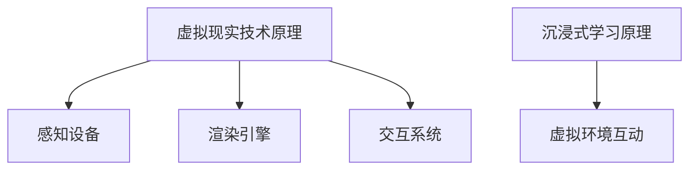

                 

关键词：虚拟现实，职业培训，沉浸式学习，技能提升，创业

> 摘要：随着虚拟现实技术的迅猛发展，虚拟现实职业培训成为现代教育领域的新趋势。本文将探讨虚拟现实在职业培训中的应用，如何通过沉浸式学习方式提高技能水平，以及创业者在这一领域的机遇和挑战。

## 1. 背景介绍

虚拟现实（VR）技术是一种能够创建模拟环境的计算机技术，用户可以在这个环境中进行交互和体验。近年来，VR技术在娱乐、医疗、教育等多个领域取得了显著的应用成果。在职业培训领域，虚拟现实技术以其独特的沉浸式学习体验，为学员提供了全新的学习方式和机会。

### 1.1 虚拟现实技术的发展历程

虚拟现实技术起源于20世纪60年代的美国，最初的VR设备主要是用于军事和航空航天领域。随着计算机技术和图形处理技术的不断发展，VR技术逐渐应用于娱乐、医疗、教育等领域。近年来，随着硬件设备的进步和成本的降低，VR技术在职业培训领域的应用逐渐兴起。

### 1.2 职业培训的现状

传统的职业培训通常依赖于课堂教学和实际操作，存在一定的时间和空间限制。而虚拟现实技术则可以突破这些限制，提供一种全新的学习方式。通过虚拟现实技术，学员可以在虚拟环境中进行实践操作，从而提高学习效果。

## 2. 核心概念与联系

### 2.1 虚拟现实技术原理

虚拟现实技术的基本原理是通过计算机生成一个三维虚拟环境，用户可以通过头戴式显示器（HMD）和手柄等设备与这个环境进行交互。虚拟现实技术的主要组成部分包括：

1. **感知设备**：如HMD、手柄等，用于感知用户的动作和位置。
2. **渲染引擎**：用于生成三维虚拟环境。
3. **交互系统**：用于处理用户输入和系统输出。

### 2.2 沉浸式学习原理

沉浸式学习是指学习者在一个完全沉浸的环境中学习，这种环境通常是由计算机模拟的。沉浸式学习的关键在于学习者可以与虚拟环境进行深度交互，从而提高学习效果。

### 2.3 虚拟现实与沉浸式学习的联系

虚拟现实技术为沉浸式学习提供了一个理想的平台。通过虚拟现实技术，学员可以进入一个模拟的职业环境，进行实践操作和互动，从而更好地掌握相关技能。



## 3. 核心算法原理 & 具体操作步骤

### 3.1 算法原理概述

虚拟现实职业培训的核心算法主要包括以下几个方面：

1. **三维建模与渲染**：通过计算机图形学技术，生成三维模型和渲染环境。
2. **用户交互**：处理用户的输入和输出，实现虚拟环境与用户的互动。
3. **学习评估**：通过算法对学员的学习效果进行评估和反馈。

### 3.2 算法步骤详解

1. **三维建模与渲染**：

   - 收集相关数据：包括职业场景的图像、视频等。
   - 建立三维模型：使用计算机图形学技术生成三维模型。
   - 渲染虚拟环境：将三维模型渲染成虚拟环境。

2. **用户交互**：

   - 用户输入：收集用户的动作和操作。
   - 交互处理：根据用户输入，调整虚拟环境。

3. **学习评估**：

   - 学习行为分析：分析学员在虚拟环境中的行为。
   - 学习效果评估：根据学员的行为，评估学习效果。

### 3.3 算法优缺点

**优点**：

- **沉浸式体验**：通过虚拟现实技术，学员可以身临其境地学习，提高学习效果。
- **实践操作**：学员可以在虚拟环境中进行实践操作，更好地掌握技能。
- **实时反馈**：系统可以实时评估学员的学习效果，提供反馈。

**缺点**：

- **技术成本**：虚拟现实技术设备较为昂贵，对创业公司来说可能是一个挑战。
- **技术依赖**：虚拟现实技术的稳定性和可靠性对学习效果有较大影响。

### 3.4 算法应用领域

虚拟现实技术主要应用于以下领域：

- **医疗培训**：如外科手术模拟、医学影像学习等。
- **工程培训**：如建筑、机械等工程领域的模拟训练。
- **军事培训**：如战术演练、模拟实战等。
- **职业培训**：如航空、航运、酒店等行业的技能培训。

## 4. 数学模型和公式 & 详细讲解 & 举例说明

### 4.1 数学模型构建

虚拟现实职业培训中的数学模型主要包括以下几个方面：

1. **三维建模**：使用三维几何学中的公式和算法，生成三维模型。
2. **渲染算法**：使用计算机图形学中的公式和算法，实现虚拟环境的渲染。
3. **用户交互**：使用控制理论和机器学习算法，实现用户与虚拟环境的交互。

### 4.2 公式推导过程

以下是一个简单的三维建模公式推导：

```latex
\begin{aligned}
P &= (x, y, z) \\
P &= P_0 + r \cdot \cos(\theta) + h \cdot \sin(\theta)
\end{aligned}
```

其中，\(P\) 表示三维空间中的一个点，\(P_0\) 表示参考点，\(r\) 表示点到参考点的距离，\(\theta\) 表示点与参考点的连线与水平线的夹角，\(h\) 表示点的高度。

### 4.3 案例分析与讲解

以下是一个虚拟现实职业培训中的案例：

**案例**：模拟飞行训练

- **三维建模**：使用三维建模软件建立飞行模拟器的外形和内部结构。
- **渲染算法**：使用渲染引擎将三维模型渲染成虚拟环境。
- **用户交互**：用户通过手柄和显示器与虚拟环境进行交互。

通过这个案例，我们可以看到数学模型在虚拟现实职业培训中的应用。

## 5. 项目实践：代码实例和详细解释说明

### 5.1 开发环境搭建

为了实现虚拟现实职业培训项目，我们需要搭建以下开发环境：

- **操作系统**：Windows 10 或更高版本。
- **开发工具**：Unity Hub、Unity 2020.3 或更高版本。
- **VR 设备**：Oculus Rift S 或更高版本。

### 5.2 源代码详细实现

以下是一个简单的虚拟现实职业培训项目的源代码实现：

```csharp
using UnityEngine;

public class VRTraining : MonoBehaviour
{
    public GameObject airplaneModel;
    public Transform playerCamera;

    void Start()
    {
        // 加载飞机模型
        airplaneModel = Instantiate(airplaneModel, Vector3.zero, Quaternion.identity);
        
        // 设置相机位置
        playerCamera.position = new Vector3(0, 1.5f, -5);
    }

    void Update()
    {
        // 根据用户输入，控制飞机模型旋转
        if (Input.GetKeyDown(KeyCode.A))
        {
            airplaneModel.transform.Rotate(0, -10, 0);
        }
        else if (Input.GetKeyDown(KeyCode.D))
        {
            airplaneModel.transform.Rotate(0, 10, 0);
        }
    }
}
```

### 5.3 代码解读与分析

- **飞机模型加载**：使用 `Instantiate` 方法加载飞机模型。
- **相机位置设置**：使用 `playerCamera.position` 设置相机位置。
- **用户输入处理**：使用 `Input.GetKeyDown` 方法处理用户输入，控制飞机模型旋转。

### 5.4 运行结果展示

运行上述代码后，我们可以看到一个简单的飞机模型，通过用户输入，可以控制飞机模型的旋转。

## 6. 实际应用场景

### 6.1 医疗培训

虚拟现实技术在医疗培训中的应用十分广泛，如外科手术模拟、医学影像学习等。通过虚拟现实技术，医生可以在虚拟环境中进行实践操作，提高手术技能和医学知识。

### 6.2 工程培训

在工程领域，虚拟现实技术可以用于建筑、机械等工程领域的模拟训练。通过虚拟现实技术，工程师可以在虚拟环境中进行设计和操作，提高工程技能和设计能力。

### 6.3 军事培训

虚拟现实技术在军事培训中的应用也非常广泛，如战术演练、模拟实战等。通过虚拟现实技术，士兵可以在虚拟环境中进行训练和演练，提高战术素养和战斗技能。

### 6.4 职业培训

在职业培训领域，虚拟现实技术可以用于航空、航运、酒店等行业的技能培训。通过虚拟现实技术，学员可以在虚拟环境中进行实践操作，提高专业技能和服务水平。

## 7. 工具和资源推荐

### 7.1 学习资源推荐

- **《虚拟现实技术原理与应用》**：介绍虚拟现实技术的基本原理和应用领域。
- **《Unity 2020 完全入门教程》**：Unity 是实现虚拟现实项目的重要工具，这本书适合初学者。

### 7.2 开发工具推荐

- **Unity Hub**：用于管理Unity项目和插件。
- **Unity**：用于开发虚拟现实项目的游戏引擎。

### 7.3 相关论文推荐

- **“Virtual Reality in Education: A Review”**：对虚拟现实在教育领域的应用进行了详细综述。
- **“A Survey on Virtual Reality Applications in Healthcare”**：对虚拟现实在医疗领域的应用进行了详细分析。

## 8. 总结：未来发展趋势与挑战

### 8.1 研究成果总结

虚拟现实技术在职业培训领域的应用取得了显著成果，通过沉浸式学习方式，学员可以更好地掌握相关技能。同时，虚拟现实技术也在医疗、工程、军事等领域取得了广泛应用。

### 8.2 未来发展趋势

随着技术的不断进步，虚拟现实技术在职业培训领域的应用前景广阔。未来，虚拟现实技术将更加智能化和个性化，为学员提供更好的学习体验。

### 8.3 面临的挑战

尽管虚拟现实技术在职业培训领域具有巨大潜力，但同时也面临一些挑战，如技术成本、稳定性、可靠性等问题。

### 8.4 研究展望

未来，虚拟现实技术在职业培训领域的应用将更加深入和广泛。研究者应关注虚拟现实技术的智能化、个性化发展，以提高职业培训的效果和效率。

## 9. 附录：常见问题与解答

### 9.1 虚拟现实技术如何提高职业培训效果？

虚拟现实技术通过提供沉浸式学习环境和实践操作机会，可以显著提高职业培训效果。学员可以在虚拟环境中进行重复操作，加深对技能的理解和掌握。

### 9.2 虚拟现实技术有哪些应用领域？

虚拟现实技术广泛应用于医疗、工程、军事、职业培训等多个领域。如外科手术模拟、建筑设计、军事演练等。

### 9.3 开发虚拟现实项目需要哪些工具和技能？

开发虚拟现实项目通常需要掌握以下工具和技能：Unity游戏引擎、计算机图形学、三维建模软件、编程语言等。

## 作者署名

作者：禅与计算机程序设计艺术 / Zen and the Art of Computer Programming
----------------------------------------------------------------

以上就是本文的全部内容。希望通过本文的探讨，读者可以更好地了解虚拟现实技术在职业培训领域的应用，以及沉浸式学习的优势。未来，随着虚拟现实技术的不断发展，职业培训将迎来更多创新和变革。

