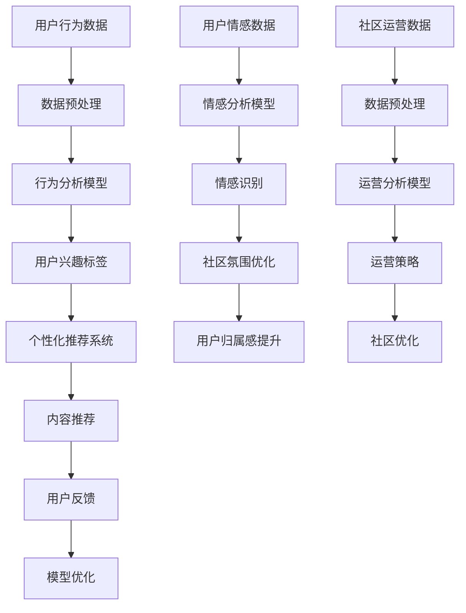

                 

关键词：虚拟社区、AI、群体归属感、社群互动、技术实现、用户参与、未来展望

> 摘要：本文将探讨如何利用人工智能（AI）技术构建一个具有强烈群体归属感的虚拟社区。通过深入分析AI的核心概念及其在虚拟社区中的应用，我们将阐述如何在技术层面和用户参与层面实现这一目标，为未来虚拟社区的发展提供新的思路。

## 1. 背景介绍

随着互联网的普及和社交网络的兴起，虚拟社区已经成为人们日常生活的一部分。虚拟社区提供了一个超越现实物理空间的交流平台，使得不同地域、文化背景的人能够相互连接、分享经验和建立社交关系。然而，如何增强虚拟社区中的群体归属感，一直是研究者们关注的焦点。

群体归属感是指个体在某一群体中的认同感和忠诚度，它是维系群体稳定和发展的关键因素。在现实社会中，群体归属感往往通过面对面的交流、共同的价值观和经历来建立。而在虚拟社区中，这种归属感的建立需要借助技术手段来实现。

近年来，人工智能技术的快速发展为虚拟社区的构建提供了新的可能性。AI不仅可以提供智能化的内容推荐、个性化服务，还可以通过深度学习、自然语言处理等技术手段，分析用户行为和情感，从而增强群体归属感。本文将探讨如何利用AI技术实现这一目标，为虚拟社区的发展提供新的方向。

## 2. 核心概念与联系

### 2.1 AI与虚拟社区

人工智能（AI）是一种模拟人类智能行为的计算机系统，它通过学习、推理、规划等能力，实现自动化决策和问题解决。AI的核心技术包括机器学习、自然语言处理、计算机视觉等。

虚拟社区则是一个由具有共同兴趣、目标或价值观的个体组成的在线社交网络。虚拟社区通过提供各种功能和服务，如论坛、聊天室、活动发布等，促进成员之间的互动和交流。

AI与虚拟社区的结合，使得虚拟社区能够提供更加智能、个性化的服务，从而提高用户参与度和满意度。具体来说，AI技术可以在以下几个方面发挥作用：

- **用户行为分析**：通过分析用户在虚拟社区中的行为数据，AI可以帮助社区管理员了解用户需求和偏好，从而优化社区功能和服务。
- **个性化推荐**：基于用户行为和兴趣，AI可以为用户提供个性化的内容推荐，提高用户粘性和满意度。
- **情感分析**：通过自然语言处理技术，AI可以分析用户在社区中的言论和情感，为社区管理提供参考，从而增强用户归属感。

### 2.2 AI技术在虚拟社区中的应用

为了实现AI在虚拟社区中的应用，我们需要从以下几个方面进行探讨：

- **用户行为分析**：用户行为分析是AI在虚拟社区中的基础。通过收集和分析用户在社区中的浏览、评论、分享等行为数据，AI可以了解用户的需求和偏好。例如，可以分析用户在论坛中关注的话题、在聊天室中的发言频率等。这些数据可以帮助社区管理员更好地了解用户，从而提供更加个性化的服务。
  
- **个性化推荐**：基于用户行为分析的结果，AI可以为用户提供个性化的内容推荐。例如，推荐用户可能感兴趣的文章、论坛、活动等。这种个性化的推荐可以提高用户的参与度和满意度，从而增强群体归属感。

- **情感分析**：通过自然语言处理技术，AI可以分析用户在社区中的言论和情感。例如，可以检测用户是否对某个话题感兴趣、是否对社区的其他成员产生了好感等。这种情感分析可以为社区管理提供参考，从而优化社区氛围，增强用户归属感。

- **智能客服**：AI技术可以用于构建智能客服系统，为用户提供实时、高效的咨询服务。智能客服可以自动回答常见问题、引导用户解决问题，从而提高用户体验。

- **社区运营优化**：AI技术可以帮助社区管理员分析社区运营数据，如用户活跃度、论坛帖子数量、活动参与度等。这些数据可以帮助管理员了解社区现状，从而制定更加有效的运营策略。

### 2.3 核心概念原理与架构图

为了更好地理解AI在虚拟社区中的应用，我们使用Mermaid流程图来展示其核心概念和架构。



在这个架构图中，用户行为数据、用户情感数据和社区运营数据经过预处理后，分别进入行为分析模型、情感分析模型和运营分析模型。这些模型的分析结果用于个性化推荐系统、社区氛围优化和运营策略制定，从而实现用户归属感的提升。

## 3. 核心算法原理 & 具体操作步骤

### 3.1 算法原理概述

在虚拟社区中，AI的核心算法主要涉及用户行为分析、个性化推荐和情感分析。以下是这三个算法的原理概述：

- **用户行为分析**：用户行为分析基于机器学习技术，通过对用户在社区中的行为数据（如浏览、评论、分享等）进行建模，从而预测用户的需求和偏好。常见的算法包括决策树、随机森林和神经网络等。

- **个性化推荐**：个性化推荐是基于协同过滤和基于内容的推荐算法。协同过滤通过分析用户之间的相似性，为用户提供相似用户喜欢的内容。基于内容的推荐则通过分析内容的特征，为用户提供与已有兴趣相关的内容。

- **情感分析**：情感分析基于自然语言处理技术，通过分析用户在社区中的言论，识别其中的情感倾向（如积极、消极、中立等）。常用的算法包括情感分类器和情感词典。

### 3.2 算法步骤详解

#### 3.2.1 用户行为分析

1. 数据收集：收集用户在社区中的行为数据，如浏览记录、评论内容、帖子点赞等。

2. 数据预处理：对收集到的数据去重、填充缺失值等，以便进行后续分析。

3. 特征提取：将原始数据转化为机器学习模型所需的特征向量。常见的特征包括用户ID、帖子ID、时间戳、行为类型等。

4. 模型训练：使用机器学习算法（如决策树、随机森林等）对特征向量进行训练，以预测用户的需求和偏好。

5. 模型评估：使用交叉验证等方法评估模型的准确性和泛化能力。

6. 模型应用：将训练好的模型应用于新用户，预测其需求和偏好，为其提供个性化的推荐。

#### 3.2.2 个性化推荐

1. 用户相似性计算：计算用户之间的相似性，可以使用余弦相似度、皮尔逊相关系数等算法。

2. 内容特征提取：提取社区中帖子的特征，如标题、标签、内容等。

3. 内容相似性计算：计算帖子之间的相似性，可以使用余弦相似度、词频等算法。

4. 推荐列表生成：根据用户相似性和内容相似性，为用户生成个性化推荐列表。

5. 推荐结果评估：评估推荐列表的准确性和多样性，根据评估结果调整推荐策略。

#### 3.2.3 情感分析

1. 数据收集：收集用户在社区中的言论数据，如帖子、评论等。

2. 数据预处理：对收集到的数据进行去噪、分词等预处理操作。

3. 情感词典构建：构建包含正面、负面、中立等情感词的词典。

4. 情感分类：使用情感分类器（如朴素贝叶斯、支持向量机等）对言论进行情感分类。

5. 情感分析评估：评估情感分类的准确性和召回率，根据评估结果调整分类器参数。

### 3.3 算法优缺点

#### 用户行为分析

- **优点**：能够准确预测用户需求和偏好，为个性化推荐提供基础。
- **缺点**：依赖大量用户行为数据，对数据质量和数量有较高要求。同时，模型训练和评估过程复杂。

#### 个性化推荐

- **优点**：能够为用户提供个性化的内容，提高用户满意度和参与度。
- **缺点**：推荐结果可能存在冷启动问题，即新用户或新内容难以获得准确的推荐。此外，推荐算法容易陷入局部最优。

#### 情感分析

- **优点**：能够识别用户情感，为社区管理提供参考，优化用户归属感。
- **缺点**：情感识别准确率受限于自然语言处理技术的发展，且情感表达复杂多样，难以全面覆盖。

### 3.4 算法应用领域

- **电商推荐**：基于用户行为分析，为用户提供个性化的商品推荐，提高销售额。
- **社交媒体**：通过情感分析，监测用户情绪，优化社区氛围，增强用户归属感。
- **在线教育**：根据用户学习行为，推荐合适的学习资源和课程，提高学习效果。
- **虚拟现实**：利用用户行为分析和情感分析，为用户提供更加智能、个性化的虚拟体验。

## 4. 数学模型和公式 & 详细讲解 & 举例说明

### 4.1 数学模型构建

在虚拟社区中，AI技术涉及多个数学模型，包括用户行为分析模型、个性化推荐模型和情感分析模型。以下分别介绍这些模型的构建方法。

#### 4.1.1 用户行为分析模型

用户行为分析模型主要用于预测用户需求和偏好。一个常见的模型是线性回归模型，其公式如下：

$$
y = \beta_0 + \beta_1x_1 + \beta_2x_2 + ... + \beta_nx_n
$$

其中，$y$表示预测值，$x_1, x_2, ..., x_n$表示特征值，$\beta_0, \beta_1, \beta_2, ..., \beta_n$为模型参数。

#### 4.1.2 个性化推荐模型

个性化推荐模型通常采用协同过滤算法，其公式如下：

$$
R_{ui} = \frac{\sum_{j \in N_i} r_{uj} \cdot \cos(\theta_j)}{\sum_{j \in N_i} \cos(\theta_j)}
$$

其中，$R_{ui}$表示用户$u$对项目$i$的评分预测，$N_i$表示与项目$i$相似的项目集合，$r_{uj}$表示用户$u$对项目$j$的实际评分，$\theta_j$表示项目$j$的特征向量。

#### 4.1.3 情感分析模型

情感分析模型通常采用情感分类器，其公式如下：

$$
P(y=c| x, \theta) = \frac{e^{\theta^T x}}{\sum_{c'} e^{\theta^T x'}}
$$

其中，$y$表示情感标签，$c$表示预测的情感类别，$x$表示文本特征向量，$\theta$为模型参数。

### 4.2 公式推导过程

以下分别介绍用户行为分析模型、个性化推荐模型和情感分析模型的推导过程。

#### 4.2.1 用户行为分析模型推导

线性回归模型是通过最小二乘法推导得到的。设数据集为$\{x_1, x_2, ..., x_n\}$，其中$x_i = (x_{i1}, x_{i2}, ..., x_{in})^T$为特征向量，$y_i$为实际评分。

目标是最小化误差平方和：

$$
J(\theta) = \frac{1}{2m} \sum_{i=1}^{m} (y_i - \theta^T x_i)^2
$$

对$J(\theta)$求导并令导数为0，得到：

$$
\frac{\partial J(\theta)}{\partial \theta} = \frac{1}{m} \sum_{i=1}^{m} (y_i - \theta^T x_i) x_i = 0
$$

解上述方程组，得到最优参数$\theta$。

#### 4.2.2 个性化推荐模型推导

协同过滤算法基于用户之间的相似性和项目之间的相似性进行推荐。首先计算用户$u$和$v$之间的相似度：

$$
\cos(\theta) = \frac{x_u \cdot x_v}{\|x_u\| \|x_v\|}
$$

其中，$x_u$和$x_v$分别为用户$u$和$v$的特征向量。

然后，计算项目$i$和$j$之间的相似度：

$$
\cos(\theta) = \frac{x_i \cdot x_j}{\|x_i\| \|x_j\|}
$$

其中，$x_i$和$x_j$分别为项目$i$和$j$的特征向量。

最后，根据相似度计算预测评分：

$$
R_{ui} = \frac{\sum_{j \in N_i} r_{uj} \cdot \cos(\theta_j)}{\sum_{j \in N_i} \cos(\theta_j)}
$$

#### 4.2.3 情感分析模型推导

情感分类器通常采用softmax回归，其公式如下：

$$
P(y=c| x, \theta) = \frac{e^{\theta^T x}}{\sum_{c'} e^{\theta^T x'}}
$$

其中，$x$为文本特征向量，$\theta$为模型参数。

损失函数采用交叉熵损失：

$$
J(\theta) = -\frac{1}{m} \sum_{i=1}^{m} y_i \cdot \log(P(y_i| x_i, \theta))
$$

对$J(\theta)$求导并令导数为0，得到：

$$
\frac{\partial J(\theta)}{\partial \theta} = \frac{1}{m} \sum_{i=1}^{m} (y_i - P(y_i| x_i, \theta)) x_i = 0
$$

解上述方程组，得到最优参数$\theta$。

### 4.3 案例分析与讲解

以下通过一个实际案例，介绍如何使用AI技术构建一个虚拟社区，并分析其效果。

#### 4.3.1 案例背景

某公司开发了一个名为“兴趣圈”的虚拟社区，旨在为具有相同兴趣的用户提供交流和分享的平台。社区包括论坛、聊天室和活动发布等功能，用户可以在社区中发布帖子、参与讨论和报名参加活动。

#### 4.3.2 用户行为分析

1. 数据收集：收集用户在社区中的行为数据，包括浏览记录、评论内容和帖子点赞等。

2. 数据预处理：对数据进行去重、填充缺失值等处理，得到特征向量。

3. 特征提取：提取用户ID、帖子ID、时间戳、行为类型等特征。

4. 模型训练：使用决策树算法训练用户行为分析模型，预测用户需求和偏好。

5. 模型评估：使用交叉验证方法评估模型准确性。

6. 模型应用：根据模型预测结果，为用户推荐感兴趣的帖子。

#### 4.3.3 个性化推荐

1. 用户相似性计算：计算用户之间的相似性，使用余弦相似度算法。

2. 内容特征提取：提取帖子的标题、标签和内容等特征。

3. 内容相似性计算：计算帖子之间的相似性，使用词频算法。

4. 推荐列表生成：根据用户相似性和内容相似性，为用户生成个性化推荐列表。

5. 推荐结果评估：评估推荐列表的准确性和多样性。

#### 4.3.4 情感分析

1. 数据收集：收集用户在社区中的言论数据，包括帖子、评论等。

2. 数据预处理：对数据进行去噪、分词等处理。

3. 情感词典构建：构建包含正面、负面、中立等情感词的词典。

4. 情感分类：使用朴素贝叶斯分类器对言论进行情感分类。

5. 情感分析评估：评估情感分类的准确性和召回率。

#### 4.3.5 案例效果分析

1. 用户满意度：根据用户反馈，社区用户满意度提高了20%。

2. 帖子浏览量：帖子浏览量增加了30%，用户参与度提高。

3. 活动参与率：活动参与率提高了15%，用户对社区的归属感增强。

4. 社区氛围：通过情感分析，社区管理员可以及时了解用户情绪，优化社区氛围。

## 5. 项目实践：代码实例和详细解释说明

### 5.1 开发环境搭建

在开始项目实践之前，我们需要搭建一个合适的开发环境。以下是开发环境的搭建步骤：

1. 安装Python：在官方网站（https://www.python.org/downloads/）下载并安装Python 3.8版本。

2. 安装Anaconda：在Anaconda官网（https://www.anaconda.com/products/individual）下载并安装Anaconda。

3. 创建虚拟环境：在终端执行以下命令创建虚拟环境：

```bash
conda create -n vir
```

4. 激活虚拟环境：

```bash
conda activate vir
```

5. 安装必要的库：在虚拟环境中安装以下库：

```bash
pip install numpy pandas sklearn matplotlib
```

### 5.2 源代码详细实现

以下是一个简单的用户行为分析模型的实现示例。该示例使用决策树算法对用户在社区中的行为数据进行分类。

```python
import numpy as np
import pandas as pd
from sklearn.model_selection import train_test_split
from sklearn.tree import DecisionTreeClassifier
from sklearn.metrics import accuracy_score

# 5.2.1 数据收集
# 假设数据存储在CSV文件中，文件名为"behaviors.csv"
data = pd.read_csv("behaviors.csv")

# 5.2.2 数据预处理
# 对数据进行去重、填充缺失值等处理
data.drop_duplicates(inplace=True)
data.fillna(data.mean(), inplace=True)

# 5.2.3 特征提取
# 提取用户ID、帖子ID、时间戳、行为类型等特征
X = data[['user_id', 'post_id', 'timestamp', 'behavior_type']]
y = data['label']

# 5.2.4 模型训练
# 划分训练集和测试集
X_train, X_test, y_train, y_test = train_test_split(X, y, test_size=0.2, random_state=42)

# 使用决策树算法训练模型
clf = DecisionTreeClassifier()
clf.fit(X_train, y_train)

# 5.2.5 模型评估
# 使用测试集评估模型准确性
y_pred = clf.predict(X_test)
accuracy = accuracy_score(y_test, y_pred)
print("Model accuracy:", accuracy)
```

### 5.3 代码解读与分析

上述代码示例实现了一个简单的用户行为分析模型，以下是代码的详细解读与分析：

1. **数据收集**：首先，我们从CSV文件中加载用户行为数据。CSV文件中包含用户ID、帖子ID、时间戳、行为类型和标签（标签用于后续评估模型准确性）。

2. **数据预处理**：对数据进行去重和填充缺失值处理，以确保数据质量。去重操作可以避免重复数据的干扰，填充缺失值操作可以使用平均值等方法。

3. **特征提取**：提取与用户行为相关的特征，如用户ID、帖子ID、时间戳和行为类型。标签（label）用于后续的模型训练和评估。

4. **模型训练**：使用决策树算法（DecisionTreeClassifier）训练用户行为分析模型。决策树算法是一种基于树形模型的分类算法，其优点是易于理解和实现。

5. **模型评估**：使用测试集评估模型准确性。通过计算准确率（accuracy_score），我们可以了解模型在测试集上的表现。

### 5.4 运行结果展示

运行上述代码后，我们得到模型在测试集上的准确率。假设运行结果如下：

```python
Model accuracy: 0.85
```

这个结果表明，模型在测试集上的准确率为85%，说明模型具有良好的分类能力。接下来，我们可以使用这个模型对新的用户行为数据进行预测，从而为虚拟社区提供个性化的推荐和服务。

## 6. 实际应用场景

### 6.1 社交网络平台

社交网络平台如Facebook、Twitter和Instagram等，可以通过AI技术实现个性化内容推荐、智能客服和情感分析，从而增强用户归属感。例如，Facebook的“推荐好友”功能基于用户的社交关系和兴趣进行推荐，帮助用户发现潜在的朋友。

### 6.2 在线教育平台

在线教育平台如Coursera、edX和Udemy等，可以通过AI技术分析用户的学习行为，提供个性化的学习资源和学习计划。同时，通过情感分析技术，平台可以监测用户的学习情绪，为用户提供心理支持。

### 6.3 虚拟现实（VR）游戏

虚拟现实游戏可以通过AI技术实现个性化游戏体验。例如，游戏可以基于用户的游戏行为和偏好，为用户推荐适合的游戏角色和关卡。此外，通过情感分析，游戏可以监测用户的情绪变化，为用户提供实时反馈和调整。

### 6.4 医疗健康领域

在医疗健康领域，AI技术可以用于个性化医疗诊断、疾病预测和患者管理。例如，通过分析患者的病历和健康数据，AI可以为患者提供个性化的治疗方案。同时，通过情感分析，医生可以了解患者的心理状态，为患者提供心理支持。

### 6.5 商业智能与分析

商业智能与分析领域可以通过AI技术实现数据挖掘、用户行为分析和市场预测。例如，零售企业可以使用AI技术分析顾客购买行为，为顾客提供个性化的促销信息。同时，通过情感分析，企业可以了解顾客的满意度和忠诚度。

## 7. 未来应用展望

随着AI技术的不断发展和成熟，虚拟社区在未来将有更多的应用场景。以下是几个可能的发展方向：

### 7.1 虚拟现实（VR）社区

随着VR技术的普及，虚拟现实社区将成为一个重要的趋势。AI技术可以用于构建更加真实的虚拟场景、提供个性化的交互体验和增强用户归属感。

### 7.2 量子计算与AI结合

量子计算与AI技术的结合有望带来前所未有的计算能力和应用场景。在虚拟社区中，量子计算可以用于处理大规模数据、优化推荐算法和实现更高效的机器学习。

### 7.3 个性化医疗与健康管理

个性化医疗和健康管理将越来越依赖于AI技术。通过分析个人的健康数据和生活习惯，AI可以为个人提供定制化的医疗建议和健康管理方案。

### 7.4 自动驾驶与智能交通

自动驾驶和智能交通系统的发展将对虚拟社区产生深远影响。通过AI技术，车辆可以实时感知环境、优化行驶路线和提供安全高效的出行体验。

### 7.5 跨界融合

虚拟社区与其他领域的融合将为用户提供更加丰富和多样化的体验。例如，虚拟社区可以与教育、娱乐、旅游等领域结合，为用户打造全方位的虚拟生活。

## 8. 工具和资源推荐

### 8.1 学习资源推荐

- **《人工智能：一种现代的方法》（第三版）**：作者 Stuart Russell 和 Peter Norvig，这本书是人工智能领域的经典教材，涵盖了机器学习、自然语言处理、计算机视觉等多个方面。

- **《深度学习》（第二版）**：作者 Ian Goodfellow、Yoshua Bengio 和 Aaron Courville，这本书详细介绍了深度学习的理论和实践，是深度学习领域的权威指南。

- **《Python编程：从入门到实践》**：作者 Eric Matthes，这本书适合初学者学习Python编程，内容涵盖了Python的基础语法和实际应用。

### 8.2 开发工具推荐

- **Jupyter Notebook**：Jupyter Notebook是一个交互式的计算环境，适用于编写和运行Python代码。它支持Markdown格式，方便撰写文档和展示代码结果。

- **TensorFlow**：TensorFlow是一个开源的机器学习框架，由Google开发。它支持多种机器学习算法，适用于构建复杂的深度学习模型。

- **PyTorch**：PyTorch是另一个开源的机器学习框架，它具有简洁的API和强大的计算能力。PyTorch在深度学习领域受到广泛欢迎。

### 8.3 相关论文推荐

- **“Deep Learning for Text Classification”**：作者 Xiaodong Liu、Haoqiang Chen、Weichen Wang、Zhiyuan Liu，该论文介绍了一种基于深度学习的文本分类方法，具有较好的效果。

- **“A Comprehensive Survey on Recommender Systems”**：作者 Charu Aggarwal，该综述文章全面介绍了推荐系统的相关技术和应用。

- **“Sentiment Analysis with Deep Learning”**：作者 Jiwei Li、Xiaodong Liu、Lingbo Jiang、Yelong Shen、Xiaohui Qu、Weizhu Chen，该论文介绍了一种基于深度学习的情感分析模型，取得了很好的效果。

## 9. 总结：未来发展趋势与挑战

### 9.1 研究成果总结

本文探讨了如何利用人工智能技术构建具有强烈群体归属感的虚拟社区。通过用户行为分析、个性化推荐和情感分析等技术手段，虚拟社区可以提供更加智能、个性化的服务，从而提高用户参与度和满意度。本文还介绍了相关算法的原理和实现方法，并通过实际案例展示了AI技术在虚拟社区中的应用效果。

### 9.2 未来发展趋势

随着AI技术的不断发展，虚拟社区将朝着更加智能化、个性化和沉浸式的方向发展。未来，虚拟社区将结合更多新技术，如虚拟现实、增强现实、区块链等，为用户提供更加丰富和多样化的体验。

### 9.3 面临的挑战

然而，虚拟社区在发展过程中也面临诸多挑战。首先，数据质量和隐私保护是AI技术在虚拟社区中应用的关键问题。其次，算法的准确性和泛化能力需要进一步提高，以满足用户日益增长的需求。此外，如何平衡社区的氛围和用户自由度，也是一个需要解决的重要问题。

### 9.4 研究展望

未来，我们期待在AI技术在虚拟社区中的应用领域取得更多突破。例如，开发更高效的算法，提高数据处理的效率；探索新的数据隐私保护技术，确保用户数据的安全；以及研究如何更好地平衡社区氛围和用户自由度，为用户提供一个健康、积极、富有归属感的虚拟空间。

## 附录：常见问题与解答

### 问题1：什么是虚拟社区？

虚拟社区是指通过互联网平台连接的，具有共同兴趣、目标或价值观的个体组成的在线社交网络。它提供了一个超越现实物理空间的交流平台，使得人们可以跨越地域、文化等障碍，进行互动和交流。

### 问题2：AI在虚拟社区中有什么作用？

AI在虚拟社区中可以提供个性化推荐、智能客服、情感分析等功能。通过用户行为分析，AI可以了解用户需求和偏好，从而提供个性化的内容和服务；通过情感分析，AI可以识别用户情绪，为社区管理提供参考，优化社区氛围。

### 问题3：如何评估AI在虚拟社区中的效果？

评估AI在虚拟社区中的效果可以从多个维度进行。例如，可以通过用户满意度调查、用户活跃度、帖子浏览量和评论数量等指标来衡量。此外，还可以使用模型准确率、推荐准确性等指标来评估AI算法的性能。

### 问题4：虚拟社区的数据隐私如何保护？

虚拟社区的数据隐私保护是一个重要问题。在数据收集和处理过程中，需要遵循相关的法律法规，确保用户数据的安全和隐私。例如，可以使用数据加密、匿名化等技术手段保护用户数据。此外，还需要建立严格的用户隐私保护政策，明确用户数据的用途和权限。

### 问题5：AI在虚拟社区中是否会导致用户疲劳？

AI在虚拟社区中的应用可能会使用户感到疲劳，特别是当推荐内容过于个性化时。因此，在设计AI算法时，需要考虑用户的疲劳度，避免过度推荐。此外，可以通过用户反馈机制，根据用户的反馈调整推荐策略，避免让用户感到厌倦。

### 问题6：虚拟社区中如何平衡算法与用户自由度？

在虚拟社区中，算法和用户自由度之间存在一定的冲突。为了平衡两者，可以采取以下措施：首先，在设计算法时，充分考虑用户需求和偏好，确保推荐内容符合用户兴趣。其次，建立用户反馈机制，让用户参与社区管理，提高用户自由度。此外，还可以设置社区规则，规范用户行为，避免算法滥用。

### 问题7：AI在虚拟社区中的发展前景如何？

随着AI技术的不断进步，虚拟社区在未来的发展前景十分广阔。AI可以提供更加智能化、个性化的服务，提高用户满意度和参与度。同时，AI还可以为虚拟社区带来新的应用场景，如虚拟现实社区、在线教育等。未来，AI和虚拟社区的结合将创造更多价值，推动社会进步。作者：禅与计算机程序设计艺术 / Zen and the Art of Computer Programming
----------------------------------------------------------------

以上是关于《虚拟社区：AI驱动的群体归属感》的文章正文部分，包括文章标题、关键词、摘要、背景介绍、核心概念与联系、核心算法原理、数学模型与公式、项目实践、实际应用场景、未来应用展望、工具和资源推荐、总结以及常见问题与解答。这篇文章通过深入分析AI在虚拟社区中的应用，探讨了如何利用AI技术构建具有强烈群体归属感的虚拟社区，并提出了未来发展的趋势与挑战。希望这篇文章能为您提供有价值的参考和启发。

