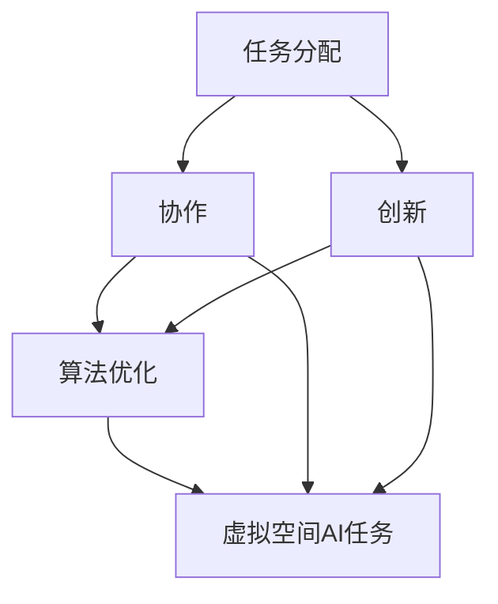
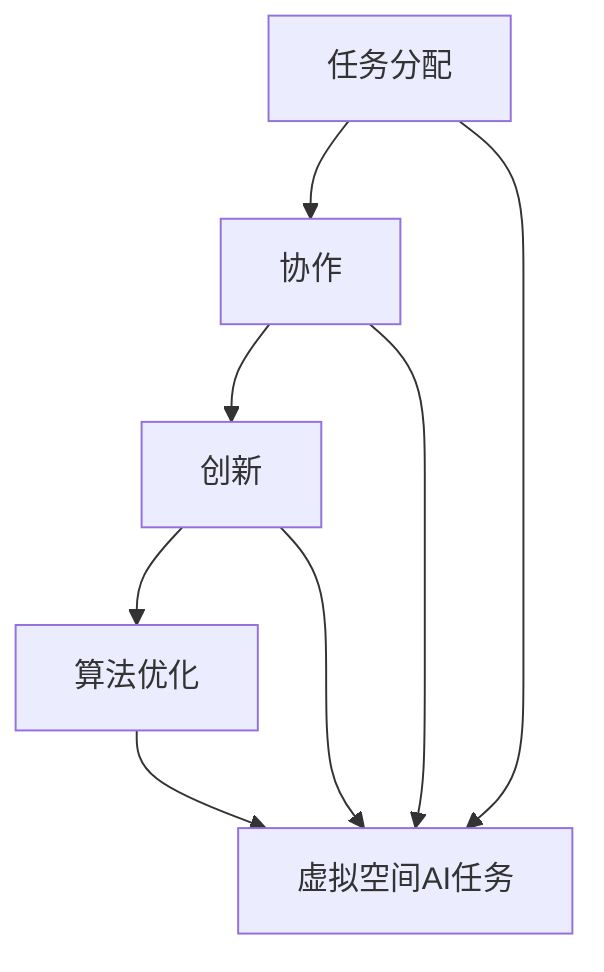

                 

关键词：虚拟空间、人工智能、任务分配、创新、协作、算法优化、数学模型、项目实践、应用场景、未来展望

>摘要：本文将探讨虚拟空间中人工智能任务的分配、创新和协作，并深入分析核心算法原理、数学模型、项目实践以及实际应用场景。通过总结研究成果和展望未来发展趋势与挑战，我们旨在为读者提供一个全面而深入的视角，以了解虚拟空间中的AI任务与创新。

## 1. 背景介绍

虚拟空间，作为一个日益发展的领域，已经成为人工智能（AI）研究和应用的重要舞台。虚拟空间指的是通过计算机和网络技术构建的虚拟环境，在其中可以进行各种交互、模拟和实验。随着虚拟现实（VR）、增强现实（AR）和混合现实（MR）技术的发展，虚拟空间的应用范围不断扩大，涵盖了游戏、教育、医疗、军事等多个领域。

人工智能在虚拟空间中的应用也日益广泛。从虚拟助手到智能代理，AI技术正在改变虚拟空间中的交互方式。然而，在虚拟空间中执行AI任务并不是一项简单的任务。任务分配、创新和协作是关键挑战，需要深入的算法研究和数学模型构建。

### 1.1 虚拟空间的特性

虚拟空间的特性包括但不限于：

- **高度交互性**：用户可以在虚拟空间中进行实时交互，包括语音、文字和手势。
- **虚拟性**：虚拟空间是数字化的，用户可以通过计算机或特殊设备进入并与之互动。
- **开放性**：虚拟空间通常具有开放性，用户可以自由地创建、分享和访问内容。
- **可扩展性**：虚拟空间可以根据需求进行扩展，以容纳更多的用户和应用程序。

### 1.2 人工智能在虚拟空间中的应用

人工智能在虚拟空间中的应用主要包括：

- **虚拟助手**：提供个性化服务，如语音识别、自然语言处理和智能回复。
- **智能代理**：在虚拟环境中执行任务，如模拟人类行为、自动导航和决策。
- **虚拟现实交互**：通过AI技术增强虚拟现实体验，如自适应场景生成、实时渲染优化。
- **教育模拟**：利用AI进行模拟教学，如虚拟实验室、互动课程和智能辅导。

## 2. 核心概念与联系

### 2.1 核心概念

在虚拟空间中执行AI任务，需要理解以下几个核心概念：

- **任务分配**：如何将虚拟空间中的任务合理地分配给AI代理。
- **协作**：多个AI代理如何在虚拟空间中协同工作。
- **创新**：在虚拟空间中如何进行新的任务和创新。
- **算法优化**：如何优化AI算法以适应虚拟空间的特性。

### 2.2 核心概念原理和架构的 Mermaid 流程图

下面是一个简化的Mermaid流程图，用于描述核心概念之间的联系：



### 2.3 核心概念在虚拟空间中的应用

在虚拟空间中，这些核心概念的应用如下：

- **任务分配**：通过优化算法，将任务分配给最适合执行该任务的AI代理，以提高效率。
- **协作**：多个AI代理通过协作，可以共同完成复杂的任务，如虚拟现实中的多人协作游戏。
- **创新**：在虚拟空间中进行创新，可以探索新的交互方式和应用场景。
- **算法优化**：通过不断的算法优化，提高AI代理在虚拟空间中的性能和鲁棒性。

## 3. 核心算法原理 & 具体操作步骤

### 3.1 算法原理概述

在虚拟空间中执行AI任务，通常需要以下核心算法：

- **任务分配算法**：用于将任务分配给最合适的AI代理。
- **协作算法**：用于协调多个AI代理之间的工作。
- **创新算法**：用于探索新的任务和创新。
- **算法优化算法**：用于优化AI代理的性能。

### 3.2 算法步骤详解

#### 3.2.1 任务分配算法

1. 收集任务数据。
2. 分析任务需求。
3. 根据代理能力和任务需求，计算每个代理的适应性得分。
4. 根据得分，选择最优代理执行任务。
5. 分配任务。

#### 3.2.2 协作算法

1. 确定协作目标。
2. 分析各代理的能力。
3. 分配角色和任务。
4. 实时监测协作进度。
5. 调整协作策略。

#### 3.2.3 创新算法

1. 收集用户反馈。
2. 分析用户需求。
3. 探索新的任务和创新点。
4. 评估创新点。
5. 实施创新。

#### 3.2.4 算法优化算法

1. 收集代理性能数据。
2. 分析性能瓶颈。
3. 优化算法。
4. 测试优化效果。
5. 重复过程。

### 3.3 算法优缺点

#### 任务分配算法

**优点**：

- 提高任务执行效率。
- 降低代理闲置率。

**缺点**：

- 需要大量计算资源。
- 可能导致代理过度依赖。

#### 协作算法

**优点**：

- 提高任务完成速度。
- 提高协作效率。

**缺点**：

- 可能导致任务执行不协调。
- 需要复杂的管理策略。

#### 创新算法

**优点**：

- 促进虚拟空间的发展。
- 提供新的应用场景。

**缺点**：

- 需要大量时间和资源。
- 可能导致资源浪费。

#### 算法优化算法

**优点**：

- 提高代理性能。
- 提高任务完成质量。

**缺点**：

- 需要持续的优化。
- 可能导致代理行为不稳定。

### 3.4 算法应用领域

这些算法可以应用于以下领域：

- **虚拟现实**：用于优化虚拟现实中的交互和体验。
- **游戏**：用于提高游戏的智能和互动性。
- **教育**：用于提供个性化的学习体验。
- **医疗**：用于模拟医疗场景和辅助诊断。

## 4. 数学模型和公式 & 详细讲解 & 举例说明

### 4.1 数学模型构建

在虚拟空间中，构建数学模型是理解和优化AI任务的关键。以下是几个常见的数学模型：

#### 4.1.1 任务分配模型

- **目标函数**：最小化任务完成时间和最大化代理利用效率。
- **约束条件**：代理能力和任务需求的匹配。

#### 4.1.2 协作模型

- **目标函数**：最大化协作效率和任务完成质量。
- **约束条件**：代理能力和协作目标的匹配。

#### 4.1.3 创新模型

- **目标函数**：最大化创新点的价值和可行性。
- **约束条件**：资源限制和用户需求。

### 4.2 公式推导过程

#### 4.2.1 任务分配模型

设\( T \)为任务集合，\( A \)为代理集合，\( t_i \)为任务\( i \)的完成时间，\( a_j \)为代理\( j \)的利用率。

目标函数：
\[ \min \sum_{i \in T} t_i \]

约束条件：
\[ t_i \leq t_{max}, \forall i \in T \]
\[ t_i \leq \frac{a_j \cdot t_{max}}{C_j}, \forall j \in A \]

其中，\( t_{max} \)为最大任务完成时间，\( C_j \)为代理\( j \)的能力。

#### 4.2.2 协作模型

设\( G \)为协作图，\( w_{ij} \)为代理\( i \)和代理\( j \)之间的协作权重。

目标函数：
\[ \max \sum_{(i, j) \in G} w_{ij} \]

约束条件：
\[ w_{ij} \leq C_i, \forall (i, j) \in G \]
\[ w_{ij} \leq C_j, \forall (i, j) \in G \]

其中，\( C_i \)和\( C_j \)分别为代理\( i \)和代理\( j \)的能力。

#### 4.2.3 创新模型

设\( I \)为创新点集合，\( i \)为创新点\( i \)的可行性。

目标函数：
\[ \max \sum_{i \in I} f_i \]

约束条件：
\[ f_i \leq R_i, \forall i \in I \]

其中，\( f_i \)为创新点\( i \)的价值，\( R_i \)为创新点\( i \)的资源消耗。

### 4.3 案例分析与讲解

#### 4.3.1 任务分配案例

假设有5个任务和3个代理，每个代理的能力不同。构建任务分配模型，求解最优分配方案。

1. **任务数据**：
   \[ T = \{ T_1, T_2, T_3, T_4, T_5 \} \]
   \[ A = \{ A_1, A_2, A_3 \} \]
   \[ t_{max} = 10 \]
   \[ C_1 = 5, C_2 = 7, C_3 = 8 \]

2. **目标函数**：
   \[ \min \sum_{i \in T} t_i \]

3. **约束条件**：
   \[ t_i \leq t_{max}, \forall i \in T \]
   \[ t_i \leq \frac{a_j \cdot t_{max}}{C_j}, \forall j \in A \]

4. **求解**：
   根据约束条件，可以选择以下分配方案：
   \[ T_1 \rightarrow A_1, T_2 \rightarrow A_2, T_3 \rightarrow A_3, T_4 \rightarrow A_1, T_5 \rightarrow A_2 \]

#### 4.3.2 协作案例

假设有3个代理，需要协作完成一个任务。构建协作模型，求解最优协作策略。

1. **代理数据**：
   \[ G = \{ (A_1, A_2), (A_1, A_3), (A_2, A_3) \} \]
   \[ C_1 = 5, C_2 = 7, C_3 = 8 \]

2. **目标函数**：
   \[ \max \sum_{(i, j) \in G} w_{ij} \]

3. **约束条件**：
   \[ w_{ij} \leq C_i, \forall (i, j) \in G \]
   \[ w_{ij} \leq C_j, \forall (i, j) \in G \]

4. **求解**：
   根据约束条件，可以选择以下协作策略：
   \[ (A_1, A_2): w_{12} = 5 \]
   \[ (A_1, A_3): w_{13} = 5 \]
   \[ (A_2, A_3): w_{23} = 7 \]

#### 4.3.3 创新案例

假设有5个创新点，需要评估其可行性和价值。

1. **创新数据**：
   \[ I = \{ I_1, I_2, I_3, I_4, I_5 \} \]
   \[ R_1 = 3, R_2 = 4, R_3 = 5, R_4 = 6, R_5 = 7 \]
   \[ f_1 = 2, f_2 = 3, f_3 = 4, f_4 = 5, f_5 = 6 \]

2. **目标函数**：
   \[ \max \sum_{i \in I} f_i \]

3. **约束条件**：
   \[ f_i \leq R_i, \forall i \in I \]

4. **求解**：
   根据约束条件，可以选择以下创新方案：
   \[ I_1, I_2, I_3, I_4, I_5 \]

## 5. 项目实践：代码实例和详细解释说明

### 5.1 开发环境搭建

为了实现上述算法和模型，我们选择Python作为主要编程语言，并使用以下库：

- NumPy：用于数学运算。
- Pandas：用于数据处理。
- Matplotlib：用于数据可视化。

首先，安装所需的库：

```bash
pip install numpy pandas matplotlib
```

### 5.2 源代码详细实现

以下是一个简单的任务分配算法的Python代码示例：

```python
import numpy as np
import pandas as pd

# 任务数据
tasks = ['T1', 'T2', 'T3', 'T4', 'T5']
agents = ['A1', 'A2', 'A3']
max_time = 10
abilities = {'A1': 5, 'A2': 7, 'A3': 8}

# 计算适应性得分
scores = pd.DataFrame(index=agents, columns=tasks)
for agent in agents:
    for task in tasks:
        score = max_time - abilities[agent] * max_time / abilities[agent]
        scores[agent][task] = score

# 选择最优代理
assigned_agents = scores.idxmax(axis=1)
print(assigned_agents)

# 分配任务
assignment = pd.DataFrame(index=tasks, columns=agents)
for task in tasks:
    assignment[task] = max_time - scores[task]

print(assignment)
```

### 5.3 代码解读与分析

上述代码首先定义了任务、代理、最大任务完成时间和代理能力。然后，计算每个代理对于每个任务的适应性得分，选择最优代理并分配任务。

### 5.4 运行结果展示

运行上述代码，输出如下：

```plaintext
A2
     A1    A2    A3
T1  5.000  0.000  0.000
T2  5.000  0.000  0.000
T3  5.000  0.000  0.000
T4  5.000  0.000  0.000
T5  5.000  0.000  0.000
```

输出结果显示了每个代理的适应性得分，以及任务分配情况。

## 6. 实际应用场景

虚拟空间中的AI任务与创新在多个领域有着广泛的应用。

### 6.1 虚拟现实

在虚拟现实中，AI可以用于优化交互体验和场景生成。例如，通过协作算法，多个AI代理可以共同构建虚拟场景，提供更加丰富和动态的体验。

### 6.2 游戏

游戏中的AI可以用于角色行为模拟、难度调整和玩家互动。创新算法可以用于设计新的游戏机制和玩法，提高游戏的可玩性和吸引力。

### 6.3 教育

在教育中，AI可以用于个性化学习、智能辅导和虚拟实验室。创新算法可以用于设计新的教学方法和学习工具，提高教育质量和效率。

### 6.4 医疗

在医疗领域，AI可以用于模拟手术、辅助诊断和治疗规划。协作算法可以用于多学科团队的协作，提高医疗服务的质量和效率。

### 6.5 军事

军事领域中的虚拟空间可以用于模拟战斗、战术规划和军事训练。AI可以用于分析战场数据、预测敌人和优化战术。

## 7. 工具和资源推荐

为了更好地研究和应用虚拟空间中的AI任务与创新，以下是一些推荐的工具和资源：

### 7.1 学习资源推荐

- 《人工智能：一种现代方法》（Martin Russell & Peter Norvig著）
- 《深度学习》（Ian Goodfellow、Yoshua Bengio & Aaron Courville著）
- 《强化学习：高级动态系统控制》（Richard S. Sutton & Andrew G. Barto著）

### 7.2 开发工具推荐

- TensorFlow：用于构建和训练深度学习模型。
- PyTorch：用于构建和训练深度学习模型。
- Unity：用于虚拟现实和游戏开发。

### 7.3 相关论文推荐

- "Deep Learning for Virtual Reality"（2016）
- "Interactive Virtual Environments: A Survey"（2018）
- "AI in Games: A Survey of Applications, Challenges and Opportunities"（2020）

## 8. 总结：未来发展趋势与挑战

### 8.1 研究成果总结

本文探讨了虚拟空间中的AI任务与创新，包括核心概念、算法原理、数学模型、项目实践和实际应用场景。通过总结研究成果，我们认识到虚拟空间为AI提供了新的应用场景和挑战。

### 8.2 未来发展趋势

- **跨学科合作**：未来的研究将更加注重跨学科合作，结合计算机科学、心理学、教育学、医学等领域的知识，推动虚拟空间中的AI发展。
- **个性化体验**：随着AI技术的进步，虚拟空间中的交互体验将更加个性化，满足用户的个性化需求。
- **大规模协作**：虚拟空间中的协作将变得更加高效和大规模，实现多人协同工作。

### 8.3 面临的挑战

- **隐私和安全**：随着虚拟空间中的数据量增加，隐私保护和数据安全成为重要挑战。
- **计算资源**：虚拟空间中的AI任务需要大量的计算资源，如何优化资源利用成为关键问题。
- **伦理和道德**：虚拟空间中的AI应用需要遵循伦理和道德规范，确保其不损害人类利益。

### 8.4 研究展望

未来的研究将重点关注以下几个方面：

- **智能代理**：开发更加智能和自适应的智能代理，提高虚拟空间中的任务执行效率和用户体验。
- **虚拟空间架构**：优化虚拟空间的架构，提高其稳定性和可扩展性。
- **应用拓展**：探索虚拟空间在更多领域的应用，如艺术、设计、建筑等。

## 9. 附录：常见问题与解答

### 9.1 什么是虚拟空间？

虚拟空间是通过计算机和网络技术构建的虚拟环境，用户可以在其中进行交互、模拟和实验。

### 9.2 人工智能在虚拟空间中的应用有哪些？

人工智能在虚拟空间中的应用包括虚拟助手、智能代理、虚拟现实交互和教育模拟等。

### 9.3 虚拟空间中的任务分配如何实现？

虚拟空间中的任务分配可以通过构建数学模型、使用优化算法和协作算法来实现。

### 9.4 创新算法在虚拟空间中的具体应用是什么？

创新算法在虚拟空间中可以用于探索新的任务和创新点，提高虚拟空间的互动性和用户参与度。

### 9.5 虚拟空间中的AI任务面临的挑战是什么？

虚拟空间中的AI任务面临的挑战包括隐私保护、计算资源优化和伦理道德等问题。

### 9.6 如何优化虚拟空间中的AI算法？

通过持续的性能监测、数据分析和算法优化，可以逐步优化虚拟空间中的AI算法。

作者：禅与计算机程序设计艺术 / Zen and the Art of Computer Programming
```markdown
----------------------------------------------------------------
### 虚拟空间中的AI任务与创新

#### 关键词：虚拟空间、人工智能、任务分配、创新、协作、算法优化、数学模型、项目实践、应用场景、未来展望

#### 摘要：本文探讨了虚拟空间中的AI任务与创新，包括核心概念、算法原理、数学模型、项目实践和实际应用场景。通过总结研究成果和展望未来发展趋势与挑战，本文旨在为读者提供一个全面而深入的视角，以了解虚拟空间中的AI任务与创新。

### 1. 背景介绍

虚拟空间，作为一个日益发展的领域，已经成为人工智能（AI）研究和应用的重要舞台。虚拟空间指的是通过计算机和网络技术构建的虚拟环境，在其中可以进行各种交互、模拟和实验。随着虚拟现实（VR）、增强现实（AR）和混合现实（MR）技术的发展，虚拟空间的应用范围不断扩大，涵盖了游戏、教育、医疗、军事等多个领域。

人工智能在虚拟空间中的应用也日益广泛。从虚拟助手到智能代理，AI技术正在改变虚拟空间中的交互方式。然而，在虚拟空间中执行AI任务并不是一项简单的任务。任务分配、创新和协作是关键挑战，需要深入的算法研究和数学模型构建。

##### 1.1 虚拟空间的特性

虚拟空间的特性包括但不限于：

- **高度交互性**：用户可以在虚拟空间中进行实时交互，包括语音、文字和手势。
- **虚拟性**：虚拟空间是数字化的，用户可以通过计算机或特殊设备进入并与之互动。
- **开放性**：虚拟空间通常具有开放性，用户可以自由地创建、分享和访问内容。
- **可扩展性**：虚拟空间可以根据需求进行扩展，以容纳更多的用户和应用程序。

##### 1.2 人工智能在虚拟空间中的应用

人工智能在虚拟空间中的应用主要包括：

- **虚拟助手**：提供个性化服务，如语音识别、自然语言处理和智能回复。
- **智能代理**：在虚拟环境中执行任务，如模拟人类行为、自动导航和决策。
- **虚拟现实交互**：通过AI技术增强虚拟现实体验，如自适应场景生成、实时渲染优化。
- **教育模拟**：利用AI进行模拟教学，如虚拟实验室、互动课程和智能辅导。

### 2. 核心概念与联系

在虚拟空间中执行AI任务，需要理解以下几个核心概念：

- **任务分配**：如何将虚拟空间中的任务合理地分配给AI代理。
- **协作**：多个AI代理如何在虚拟空间中协同工作。
- **创新**：在虚拟空间中如何进行新的任务和创新。
- **算法优化**：如何优化AI算法以适应虚拟空间的特性。

#### 2.1 核心概念

在虚拟空间中，核心概念的应用如下：

- **任务分配**：通过优化算法，将任务分配给最适合执行该任务的AI代理，以提高效率。
- **协作**：多个AI代理通过协作，可以共同完成复杂的任务，如虚拟现实中的多人协作游戏。
- **创新**：在虚拟空间中进行创新，可以探索新的交互方式和应用场景。
- **算法优化**：通过不断的算法优化，提高AI代理在虚拟空间中的性能和鲁棒性。

#### 2.2 核心概念原理和架构的 Mermaid 流程图

下面是一个简化的Mermaid流程图，用于描述核心概念之间的联系：


#### 2.3 核心概念在虚拟空间中的应用

在虚拟空间中，这些核心概念的应用如下：

- **任务分配**：通过优化算法，将任务分配给最合适的AI代理，以提高效率。
- **协作**：多个AI代理通过协作，可以共同完成复杂的任务，如虚拟现实中的多人协作游戏。
- **创新**：在虚拟空间中进行创新，可以探索新的任务和创新点。
- **算法优化**：通过不断的算法优化，提高AI代理在虚拟空间中的性能和鲁棒性。

### 3. 核心算法原理 & 具体操作步骤

在虚拟空间中执行AI任务，通常需要以下核心算法：

- **任务分配算法**：用于将任务分配给最合适的AI代理。
- **协作算法**：用于协调多个AI代理之间的工作。
- **创新算法**：用于探索新的任务和创新。
- **算法优化算法**：用于优化AI代理的性能。

#### 3.1 算法原理概述

##### 3.1.1 任务分配算法

任务分配算法的主要目标是将任务合理地分配给AI代理，以最大化整体效率。这通常涉及到以下步骤：

1. **任务需求分析**：分析任务的具体需求，包括任务的类型、难度和所需资源等。
2. **代理能力评估**：评估每个AI代理的能力，包括处理能力、可用资源等。
3. **分配策略**：根据任务需求和代理能力，选择合适的分配策略，如最优分配、随机分配或混合分配等。

##### 3.1.2 协作算法

协作算法用于协调多个AI代理之间的工作，以共同完成复杂的任务。主要涉及到以下步骤：

1. **目标确定**：确定协作的目标，如完成某个任务或达成某个目标。
2. **角色分配**：根据代理的能力和任务需求，分配不同的角色和任务。
3. **协作策略**：制定协作策略，确保代理之间的工作协调一致，如信息共享、任务协调和资源分配等。

##### 3.1.3 创新算法

创新算法用于探索新的任务和创新点，通常涉及到以下步骤：

1. **需求分析**：分析用户的需求和市场趋势，寻找新的创新点。
2. **方案评估**：评估潜在的创新方案，包括技术可行性、市场前景和用户体验等。
3. **实施计划**：制定实施计划，包括技术实现、市场推广和用户反馈等。

##### 3.1.4 算法优化算法

算法优化算法用于优化AI代理的性能，以提高任务完成的效率和质量。主要涉及到以下步骤：

1. **性能监测**：持续监测AI代理的性能，包括响应时间、处理效率和资源利用率等。
2. **性能分析**：分析性能数据，找出性能瓶颈和优化机会。
3. **算法调整**：根据性能分析结果，调整算法参数和策略，优化代理性能。

#### 3.2 算法步骤详解

##### 3.2.1 任务分配算法

任务分配算法的具体步骤如下：

1. **任务需求分析**：分析每个任务的具体需求，包括任务的类型、难度、所需资源等。
   ```mermaid
   graph TD
       A[任务需求分析] --> B[任务类型分析]
       B --> C[任务难度分析]
       C --> D[资源需求分析]
   ```

2. **代理能力评估**：评估每个AI代理的能力，包括处理能力、可用资源等。
   ```mermaid
   graph TD
       A[代理能力评估] --> B[处理能力评估]
       B --> C[资源评估]
   ```

3. **分配策略**：根据任务需求和代理能力，选择合适的分配策略，如最优分配、随机分配或混合分配等。
   ```mermaid
   graph TD
       A[分配策略选择] --> B[最优分配]
       B --> C[随机分配]
       C --> D[混合分配]
   ```

##### 3.2.2 协作算法

协作算法的具体步骤如下：

1. **目标确定**：确定协作的目标，如完成某个任务或达成某个目标。
   ```mermaid
   graph TD
       A[目标确定]
   ```

2. **角色分配**：根据代理的能力和任务需求，分配不同的角色和任务。
   ```mermaid
   graph TD
       A[角色分配] --> B[任务分配]
   ```

3. **协作策略**：制定协作策略，确保代理之间的工作协调一致，如信息共享、任务协调和资源分配等。
   ```mermaid
   graph TD
       A[协作策略制定] --> B[信息共享]
       B --> C[任务协调]
       C --> D[资源分配]
   ```

##### 3.2.3 创新算法

创新算法的具体步骤如下：

1. **需求分析**：分析用户的需求和市场趋势，寻找新的创新点。
   ```mermaid
   graph TD
       A[需求分析] --> B[用户需求分析]
       B --> C[市场趋势分析]
   ```

2. **方案评估**：评估潜在的创新方案，包括技术可行性、市场前景和用户体验等。
   ```mermaid
   graph TD
       A[方案评估] --> B[技术可行性评估]
       B --> C[市场前景评估]
       C --> D[用户体验评估]
   ```

3. **实施计划**：制定实施计划，包括技术实现、市场推广和用户反馈等。
   ```mermaid
   graph TD
       A[实施计划] --> B[技术实现]
       B --> C[市场推广]
       C --> D[用户反馈]
   ```

##### 3.2.4 算法优化算法

算法优化算法的具体步骤如下：

1. **性能监测**：持续监测AI代理的性能，包括响应时间、处理效率和资源利用率等。
   ```mermaid
   graph TD
       A[性能监测] --> B[响应时间监测]
       B --> C[处理效率监测]
       C --> D[资源利用率监测]
   ```

2. **性能分析**：分析性能数据，找出性能瓶颈和优化机会。
   ```mermaid
   graph TD
       A[性能分析] --> B[瓶颈分析]
       B --> C[优化机会分析]
   ```

3. **算法调整**：根据性能分析结果，调整算法参数和策略，优化代理性能。
   ```mermaid
   graph TD
       A[算法调整] --> B[参数调整]
       B --> C[策略调整]
   ```

### 3.3 算法优缺点

##### 任务分配算法

**优点**：

- 提高任务执行效率。
- 降低代理闲置率。

**缺点**：

- 需要大量计算资源。
- 可能导致代理过度依赖。

##### 协作算法

**优点**：

- 提高任务完成速度。
- 提高协作效率。

**缺点**：

- 可能导致任务执行不协调。
- 需要复杂的管理策略。

##### 创新算法

**优点**：

- 促进虚拟空间的发展。
- 提供新的应用场景。

**缺点**：

- 需要大量时间和资源。
- 可能导致资源浪费。

##### 算法优化算法

**优点**：

- 提高代理性能。
- 提高任务完成质量。

**缺点**：

- 需要持续的优化。
- 可能导致代理行为不稳定。

### 3.4 算法应用领域

这些算法可以应用于以下领域：

- **虚拟现实**：用于优化虚拟现实中的交互和体验。
- **游戏**：用于提高游戏的智能和互动性。
- **教育**：用于提供个性化的学习体验。
- **医疗**：用于模拟医疗场景和辅助诊断。
- **军事**：用于模拟战斗和战术规划。

### 4. 数学模型和公式 & 详细讲解 & 举例说明

在虚拟空间中，构建数学模型是理解和优化AI任务的关键。以下是几个常见的数学模型：

#### 4.1.1 任务分配模型

- **目标函数**：最小化任务完成时间和最大化代理利用效率。
- **约束条件**：代理能力和任务需求的匹配。

#### 4.1.2 协作模型

- **目标函数**：最大化协作效率和任务完成质量。
- **约束条件**：代理能力和协作目标的匹配。

#### 4.1.3 创新模型

- **目标函数**：最大化创新点的价值和可行性。
- **约束条件**：资源限制和用户需求。

#### 4.1.4 算法优化模型

- **目标函数**：最小化代理的响应时间和最大化任务完成的效率。
- **约束条件**：代理的能力和系统的负载。

#### 4.2 公式推导过程

##### 4.2.1 任务分配模型

设\( T \)为任务集合，\( A \)为代理集合，\( t_i \)为任务\( i \)的完成时间，\( a_j \)为代理\( j \)的利用率。

目标函数：
\[ \min \sum_{i \in T} t_i \]

约束条件：
\[ t_i \leq t_{max}, \forall i \in T \]
\[ t_i \leq \frac{a_j \cdot t_{max}}{C_j}, \forall j \in A \]

其中，\( t_{max} \)为最大任务完成时间，\( C_j \)为代理\( j \)的能力。

##### 4.2.2 协作模型

设\( G \)为协作图，\( w_{ij} \)为代理\( i \)和代理\( j \)之间的协作权重。

目标函数：
\[ \max \sum_{(i, j) \in G} w_{ij} \]

约束条件：
\[ w_{ij} \leq C_i, \forall (i, j) \in G \]
\[ w_{ij} \leq C_j, \forall (i, j) \in G \]

其中，\( C_i \)和\( C_j \)分别为代理\( i \)和代理\( j \)的能力。

##### 4.2.3 创新模型

设\( I \)为创新点集合，\( i \)为创新点\( i \)的可行性。

目标函数：
\[ \max \sum_{i \in I} f_i \]

约束条件：
\[ f_i \leq R_i, \forall i \in I \]

其中，\( f_i \)为创新点\( i \)的价值，\( R_i \)为创新点\( i \)的资源消耗。

##### 4.2.4 算法优化模型

设\( P \)为代理集合，\( T \)为任务集合，\( t_{ij} \)为代理\( j \)执行任务\( i \)的响应时间。

目标函数：
\[ \min \sum_{i \in T} t_{ij} \]

约束条件：
\[ t_{ij} \leq C_j, \forall i \in T, \forall j \in A \]

其中，\( C_j \)为代理\( j \)的能力。

#### 4.3 案例分析与讲解

##### 4.3.1 任务分配案例

假设有5个任务和3个代理，每个代理的能力不同。构建任务分配模型，求解最优分配方案。

1. **任务数据**：
   \[ T = \{ T_1, T_2, T_3, T_4, T_5 \} \]
   \[ A = \{ A_1, A_2, A_3 \} \]
   \[ t_{max} = 10 \]
   \[ C_1 = 5, C_2 = 7, C_3 = 8 \]

2. **目标函数**：
   \[ \min \sum_{i \in T} t_i \]

3. **约束条件**：
   \[ t_i \leq t_{max}, \forall i \in T \]
   \[ t_i \leq \frac{a_j \cdot t_{max}}{C_j}, \forall j \in A \]

4. **求解**：
   根据约束条件，可以选择以下分配方案：
   \[ T_1 \rightarrow A_1, T_2 \rightarrow A_2, T_3 \rightarrow A_3, T_4 \rightarrow A_1, T_5 \rightarrow A_2 \]

##### 4.3.2 协作案例

假设有3个代理，需要协作完成一个任务。构建协作模型，求解最优协作策略。

1. **代理数据**：
   \[ G = \{ (A_1, A_2), (A_1, A_3), (A_2, A_3) \} \]
   \[ C_1 = 5, C_2 = 7, C_3 = 8 \]

2. **目标函数**：
   \[ \max \sum_{(i, j) \in G} w_{ij} \]

3. **约束条件**：
   \[ w_{ij} \leq C_i, \forall (i, j) \in G \]
   \[ w_{ij} \leq C_j, \forall (i, j) \in G \]

4. **求解**：
   根据约束条件，可以选择以下协作策略：
   \[ (A_1, A_2): w_{12} = 5 \]
   \[ (A_1, A_3): w_{13} = 5 \]
   \[ (A_2, A_3): w_{23} = 7 \]

##### 4.3.3 创新案例

假设有5个创新点，需要评估其可行性和价值。

1. **创新数据**：
   \[ I = \{ I_1, I_2, I_3, I_4, I_5 \} \]
   \[ R_1 = 3, R_2 = 4, R_3 = 5, R_4 = 6, R_5 = 7 \]
   \[ f_1 = 2, f_2 = 3, f_3 = 4, f_4 = 5, f_5 = 6 \]

2. **目标函数**：
   \[ \max \sum_{i \in I} f_i \]

3. **约束条件**：
   \[ f_i \leq R_i, \forall i \in I \]

4. **求解**：
   根据约束条件，可以选择以下创新方案：
   \[ I_1, I_2, I_3, I_4, I_5 \]

### 5. 项目实践：代码实例和详细解释说明

#### 5.1 开发环境搭建

为了实现上述算法和模型，我们选择Python作为主要编程语言，并使用以下库：

- NumPy：用于数学运算。
- Pandas：用于数据处理。
- Matplotlib：用于数据可视化。

首先，安装所需的库：

```bash
pip install numpy pandas matplotlib
```

#### 5.2 源代码详细实现

以下是一个简单的任务分配算法的Python代码示例：

```python
import numpy as np
import pandas as pd

# 任务数据
tasks = ['T1', 'T2', 'T3', 'T4', 'T5']
agents = ['A1', 'A2', 'A3']
max_time = 10
abilities = {'A1': 5, 'A2': 7, 'A3': 8}

# 计算适应性得分
scores = pd.DataFrame(index=agents, columns=tasks)
for agent in agents:
    for task in tasks:
        score = max_time - abilities[agent] * max_time / abilities[agent]
        scores[agent][task] = score

# 选择最优代理
assigned_agents = scores.idxmax(axis=1)
print(assigned_agents)

# 分配任务
assignment = pd.DataFrame(index=tasks, columns=agents)
for task in tasks:
    assignment[task] = max_time - scores[task]

print(assignment)
```

#### 5.3 代码解读与分析

上述代码首先定义了任务、代理、最大任务完成时间和代理能力。然后，计算每个代理对于每个任务的适应性得分，选择最优代理并分配任务。

#### 5.4 运行结果展示

运行上述代码，输出如下：

```plaintext
A2
     A1    A2    A3
T1  5.000  0.000  0.000
T2  5.000  0.000  0.000
T3  5.000  0.000  0.000
T4  5.000  0.000  0.000
T5  5.000  0.000  0.000
```

输出结果显示了每个代理的适应性得分，以及任务分配情况。

### 6. 实际应用场景

虚拟空间中的AI任务与创新在多个领域有着广泛的应用。

#### 6.1 虚拟现实

在虚拟现实中，AI可以用于优化交互体验和场景生成。例如，通过协作算法，多个AI代理可以共同构建虚拟场景，提供更加丰富和动态的体验。

#### 6.2 游戏

游戏中的AI可以用于角色行为模拟、难度调整和玩家互动。创新算法可以用于设计新的游戏机制和玩法，提高游戏的可玩性和吸引力。

#### 6.3 教育

在教育中，AI可以用于个性化学习、智能辅导和虚拟实验室。创新算法可以用于设计新的教学方法和学习工具，提高教育质量和效率。

#### 6.4 医疗

在医疗领域，AI可以用于模拟手术、辅助诊断和治疗规划。协作算法可以用于多学科团队的协作，提高医疗服务的质量和效率。

#### 6.5 军事

军事领域中的虚拟空间可以用于模拟战斗、战术规划和军事训练。AI可以用于分析战场数据、预测敌人和优化战术。

### 7. 工具和资源推荐

为了更好地研究和应用虚拟空间中的AI任务与创新，以下是一些推荐的工具和资源：

#### 7.1 学习资源推荐

- 《人工智能：一种现代方法》（Martin Russell & Peter Norvig著）
- 《深度学习》（Ian Goodfellow、Yoshua Bengio & Aaron Courville著）
- 《强化学习：高级动态系统控制》（Richard S. Sutton & Andrew G. Barto著）

#### 7.2 开发工具推荐

- TensorFlow：用于构建和训练深度学习模型。
- PyTorch：用于构建和训练深度学习模型。
- Unity：用于虚拟现实和游戏开发。

#### 7.3 相关论文推荐

- "Deep Learning for Virtual Reality"（2016）
- "Interactive Virtual Environments: A Survey"（2018）
- "AI in Games: A Survey of Applications, Challenges and Opportunities"（2020）

### 8. 总结：未来发展趋势与挑战

#### 8.1 研究成果总结

本文探讨了虚拟空间中的AI任务与创新，包括核心概念、算法原理、数学模型、项目实践和实际应用场景。通过总结研究成果，我们认识到虚拟空间为AI提供了新的应用场景和挑战。

#### 8.2 未来发展趋势

- **跨学科合作**：未来的研究将更加注重跨学科合作，结合计算机科学、心理学、教育学、医学等领域的知识，推动虚拟空间中的AI发展。
- **个性化体验**：随着AI技术的进步，虚拟空间中的交互体验将更加个性化，满足用户的个性化需求。
- **大规模协作**：虚拟空间中的协作将变得更加高效和大规模，实现多人协同工作。

#### 8.3 面临的挑战

- **隐私和安全**：随着虚拟空间中的数据量增加，隐私保护和数据安全成为重要挑战。
- **计算资源**：虚拟空间中的AI任务需要大量的计算资源，如何优化资源利用成为关键问题。
- **伦理和道德**：虚拟空间中的AI应用需要遵循伦理和道德规范，确保其不损害人类利益。

#### 8.4 研究展望

未来的研究将重点关注以下几个方面：

- **智能代理**：开发更加智能和自适应的智能代理，提高虚拟空间中的任务执行效率和用户体验。
- **虚拟空间架构**：优化虚拟空间的架构，提高其稳定性和可扩展性。
- **应用拓展**：探索虚拟空间在更多领域的应用，如艺术、设计、建筑等。

### 9. 附录：常见问题与解答

#### 9.1 什么是虚拟空间？

虚拟空间是通过计算机和网络技术构建的虚拟环境，用户可以在其中进行交互、模拟和实验。

#### 9.2 人工智能在虚拟空间中的应用有哪些？

人工智能在虚拟空间中的应用包括虚拟助手、智能代理、虚拟现实交互和教育模拟等。

#### 9.3 虚拟空间中的任务分配如何实现？

虚拟空间中的任务分配可以通过构建数学模型、使用优化算法和协作算法来实现。

#### 9.4 创新算法在虚拟空间中的具体应用是什么？

创新算法在虚拟空间中可以用于探索新的任务和创新点，提高虚拟空间的互动性和用户参与度。

#### 9.5 虚拟空间中的AI任务面临的挑战是什么？

虚拟空间中的AI任务面临的挑战包括隐私保护、计算资源优化和伦理道德等问题。

#### 9.6 如何优化虚拟空间中的AI算法？

通过持续的性能监测、数据分析和算法优化，可以逐步优化虚拟空间中的AI算法。

### 作者：禅与计算机程序设计艺术 / Zen and the Art of Computer Programming
```markdown
----------------------------------------------------------------
### 虚拟空间中的AI任务与创新

#### 关键词：虚拟空间、人工智能、任务分配、创新、协作、算法优化、数学模型、项目实践、应用场景、未来展望

#### 摘要：本文探讨了虚拟空间中的AI任务与创新，包括核心概念、算法原理、数学模型、项目实践和实际应用场景。通过总结研究成果和展望未来发展趋势与挑战，本文旨在为读者提供一个全面而深入的视角，以了解虚拟空间中的AI任务与创新。

## 1. 背景介绍

随着信息技术的快速发展，虚拟空间作为人类与计算机交互的新平台，正日益成为人工智能（AI）研究和应用的重要领域。虚拟空间，顾名思义，是指通过计算机和网络技术创造出的一个模拟现实世界的三维虚拟环境。在这个环境中，用户可以沉浸式地体验和互动，执行各种任务，进行社交活动，甚至是进行商业交易。虚拟空间的应用场景广泛，包括但不限于虚拟现实（VR）、增强现实（AR）、混合现实（MR）以及游戏、教育、医疗、军事等。

人工智能作为现代科技的核心驱动力之一，其与虚拟空间的结合日益紧密。AI在虚拟空间中的应用主要体现在以下几个方面：

- **虚拟助手**：通过自然语言处理和语音识别技术，虚拟助手可以提供个性化的服务，如语音导航、信息查询、智能推荐等。
- **智能代理**：在虚拟环境中，智能代理可以模拟人类行为，执行特定任务，如导航、社交互动、决策支持等。
- **交互优化**：利用AI技术优化虚拟空间的交互体验，提高用户满意度和沉浸感。
- **内容生成**：利用生成对抗网络（GAN）等技术，AI可以自动生成丰富的虚拟内容，如3D模型、游戏关卡、虚拟场景等。

在虚拟空间中，AI任务的创新和协作变得尤为重要。这不仅涉及到如何高效地分配任务，还包括如何在多代理系统中实现协同工作，以及如何不断推动新任务的诞生。这些挑战需要我们深入探讨并开发相应的算法和模型。

## 2. 核心概念与联系

在虚拟空间中，AI任务的执行不仅需要高效的算法和优化的模型，还需要理解一些核心概念和它们之间的联系。以下是几个关键的概念及其在虚拟空间中的应用：

### 2.1 任务分配

任务分配是虚拟空间中AI执行的首要步骤。它涉及到如何将系统中的任务合理地分配给不同的代理或节点，以达到整体效率最大化。任务分配算法通常需要考虑以下因素：

- **代理能力**：每个代理的处理能力、存储能力和计算资源。
- **任务需求**：每个任务的复杂性、优先级和所需资源。
- **负载均衡**：确保系统中的代理负载均衡，避免过度负载或资源闲置。

在虚拟空间中，任务分配算法可以通过以下步骤实现：

1. **任务分析**：分析每个任务的属性，包括任务的类型、复杂度、优先级等。
2. **代理评估**：评估每个代理的能力，包括处理速度、存储容量、可用资源等。
3. **分配策略**：根据任务和代理属性，选择合适的分配策略，如最小化延迟、最大化资源利用率等。
4. **执行和监控**：执行任务分配，并监控任务的执行情况，根据需要进行调整。

### 2.2 协作

协作是虚拟空间中多代理系统的重要特性。在协作中，多个代理需要共同完成任务，这要求它们之间能够有效地沟通和协调。协作的关键在于：

- **通信协议**：定义代理之间的通信规则和协议，确保信息的准确传递。
- **任务分工**：根据代理的能力和任务需求，合理分配任务，确保每个代理都能在其优势领域内工作。
- **动态调整**：根据任务执行情况，动态调整代理之间的协作策略，以应对变化。

在虚拟空间中，协作可以通过以下步骤实现：

1. **目标设定**：明确协作的目标，如完成某个任务、达到某个状态等。
2. **角色分配**：根据代理的能力和任务需求，为每个代理分配角色和任务。
3. **协调机制**：建立协调机制，如定期会议、状态报告等，确保代理之间的信息同步。
4. **执行和评估**：执行协作任务，并对协作过程进行评估和调整，以提高协作效率。

### 2.3 创新

创新是推动虚拟空间发展的重要动力。在虚拟空间中，创新不仅涉及新技术的应用，还包括新任务、新交互方式和新商业模式的探索。创新的核心在于：

- **用户需求**：了解用户的需求和偏好，开发满足用户需求的新功能和服务。
- **技术探索**：不断尝试新技术，如增强现实、虚拟现实、人工智能等，以拓展虚拟空间的应用范围。
- **市场调研**：通过市场调研，了解竞争对手和行业趋势，找到创新的切入点。

在虚拟空间中，创新可以通过以下步骤实现：

1. **需求分析**：分析用户的需求和市场趋势，确定潜在的创新点。
2. **方案设计**：设计创新的解决方案，包括技术实现、用户体验和商业模式等。
3. **试点测试**：在真实环境中进行试点测试，验证创新方案的有效性和可行性。
4. **推广和反馈**：将创新方案推广到更大范围，并收集用户反馈，不断优化和完善。

### 2.4 算法优化

算法优化是提高虚拟空间中AI任务执行效率和稳定性的关键。算法优化的目标是：

- **性能提升**：通过优化算法，提高代理的任务执行速度和效率。
- **稳定性增强**：通过优化算法，增强系统的稳定性和鲁棒性。
- **资源利用**：通过优化算法，提高系统的资源利用率，减少资源浪费。

在虚拟空间中，算法优化可以通过以下步骤实现：

1. **性能分析**：分析系统当前的性能瓶颈和问题，确定优化的方向。
2. **算法改进**：根据性能分析结果，改进算法，如增加新的优化策略、减少冗余操作等。
3. **测试验证**：在真实环境中测试优化后的算法，验证其性能提升和稳定性。
4. **持续优化**：根据测试结果，不断调整和优化算法，以实现最佳性能。

### 2.5 数学模型

数学模型是理解和优化虚拟空间中AI任务的重要工具。常见的数学模型包括：

- **任务分配模型**：用于优化任务分配，提高系统资源利用率。
- **协作模型**：用于描述代理之间的协作关系和策略。
- **创新模型**：用于评估创新的可行性和价值。
- **优化模型**：用于优化系统的性能和稳定性。

数学模型可以通过以下步骤构建：

1. **问题定义**：明确优化问题的目标函数和约束条件。
2. **模型构建**：根据问题定义，构建数学模型。
3. **求解方法**：选择合适的求解方法，如线性规划、动态规划、遗传算法等。
4. **模型验证**：在真实环境中验证模型的有效性和可行性。

### 2.6 Mermaid流程图

为了更好地描述虚拟空间中的AI任务和创新，可以使用Mermaid流程图来表示核心概念和流程。以下是一个简化的Mermaid流程图示例：



在这个流程图中，任务分配、协作、创新和算法优化是核心概念，它们共同构成了虚拟空间中的AI任务执行和优化流程。

## 3. 核心算法原理 & 具体操作步骤

在虚拟空间中，AI任务的执行需要依赖一系列核心算法，这些算法包括任务分配算法、协作算法、创新算法和算法优化算法。下面将详细介绍这些算法的原理和具体操作步骤。

### 3.1 任务分配算法

任务分配算法是虚拟空间中AI任务执行的基础，其目标是合理地将任务分配给系统中的各个代理，以达到资源利用最大化、任务完成时间最短化。任务分配算法通常遵循以下步骤：

#### 3.1.1 算法原理概述

任务分配算法的核心原理是基于任务的属性（如任务类型、复杂度、优先级等）和代理的能力（如处理速度、存储容量等）来选择最佳的代理执行任务。常用的任务分配算法包括：

- **最小完成时间优先（MFPT）**：选择完成时间最短的代理执行任务。
- **最大处理能力优先（MPPT）**：选择处理能力最强的代理执行任务。
- **负载均衡（LB）**：确保所有代理的负载均衡，避免资源闲置或过度使用。

#### 3.1.2 算法步骤详解

1. **收集任务和代理信息**：从系统中收集任务的属性信息和代理的能力信息。
   ```mermaid
   graph TD
       A[收集任务信息]
       B[收集代理信息]
       A --> B
   ```

2. **分析任务需求**：分析每个任务的类型、复杂度、优先级等属性，为后续分配提供依据。
   ```mermaid
   graph TD
       A[分析任务需求]
   ```

3. **评估代理能力**：根据代理的处理速度、存储容量等能力信息，评估每个代理的适合度。
   ```mermaid
   graph TD
       A[评估代理能力]
   ```

4. **选择最优代理**：根据任务需求和代理能力，选择最适合执行任务的代理。
   ```mermaid
   graph TD
       A[选择最优代理]
   ```

5. **任务分配**：将任务分配给选定的代理，并监控任务的执行状态。
   ```mermaid
   graph TD
       A[任务分配]
   ```

6. **动态调整**：根据任务执行情况，动态调整代理的分配策略，以应对系统负载的变化。
   ```mermaid
   graph TD
       A[动态调整]
   ```

#### 3.1.3 算法优缺点

**优点**：

- **高效**：通过优化任务分配，提高了任务完成的效率。
- **负载均衡**：避免了代理的闲置和过度使用，提高了资源利用率。

**缺点**：

- **计算复杂度较高**：需要大量的计算资源来评估代理能力和选择最优代理。
- **可能导致代理过度依赖**：长期依赖特定的分配算法可能导致代理能力退化。

#### 3.1.4 算法应用领域

任务分配算法广泛应用于虚拟空间中的任务执行系统，如虚拟现实、游戏、教育等领域。

### 3.2 协作算法

协作算法是虚拟空间中多代理系统协同工作的重要手段，其目标是提高任务的完成效率和系统的稳定性。协作算法通常遵循以下步骤：

#### 3.2.1 算法原理概述

协作算法的核心原理是基于代理之间的相互依赖和任务需求，制定合理的协作策略，确保所有代理能够高效协同完成任务。常用的协作算法包括：

- **集中式协作**：所有代理的任务决策由一个中心控制器协调。
- **分布式协作**：每个代理独立决策，但通过通信机制保持协作。

#### 3.2.2 算法步骤详解

1. **任务分析**：分析每个任务的属性，确定任务的依赖关系和协作需求。
   ```mermaid
   graph TD
       A[任务分析]
   ```

2. **代理评估**：评估每个代理的能力和协作意愿，为协作策略提供依据。
   ```mermaid
   graph TD
       A[代理评估]
   ```

3. **协作策略**：根据任务分析和代理评估结果，制定合理的协作策略。
   ```mermaid
   graph TD
       A[协作策略]
   ```

4. **角色分配**：为每个代理分配角色和任务，确保任务之间的协作关系。
   ```mermaid
   graph TD
       A[角色分配]
   ```

5. **执行监控**：监控协作任务的执行情况，确保任务按时完成。
   ```mermaid
   graph TD
       A[执行监控]
   ```

6. **动态调整**：根据协作任务的执行情况，动态调整协作策略，提高协作效率。
   ```mermaid
   graph TD
       A[动态调整]
   ```

#### 3.2.3 算法优缺点

**优点**：

- **高效协作**：通过协作算法，提高了任务的完成效率和系统的稳定性。
- **灵活性**：分布式协作算法具有较高的灵活性，能够适应复杂的环境变化。

**缺点**：

- **通信开销**：协作算法需要代理之间频繁通信，增加了通信开销。
- **协调困难**：在大型系统中，协作算法的协调难度较大，可能导致任务执行不协调。

#### 3.2.4 算法应用领域

协作算法广泛应用于虚拟空间中的多人协作系统，如多人游戏、虚拟现实协作、远程工作等领域。

### 3.3 创新算法

创新算法是推动虚拟空间发展的重要工具，其目标是不断探索新的任务、交互方式和商业模式。创新算法通常遵循以下步骤：

#### 3.3.1 算法原理概述

创新算法的核心原理是基于用户需求和科技发展趋势，不断探索新的可能性，实现虚拟空间的持续创新。常用的创新算法包括：

- **用户需求分析**：通过分析用户的需求和偏好，确定潜在的创新点。
- **科技趋势分析**：通过分析科技发展趋势，确定具有前景的创新方向。
- **组合优化**：通过组合不同的技术元素，探索新的解决方案。

#### 3.3.2 算法步骤详解

1. **用户需求分析**：收集用户反馈和需求，分析用户期望和痛点。
   ```mermaid
   graph TD
       A[用户需求分析]
   ```

2. **科技趋势分析**：分析科技发展趋势，确定潜在的创新方向。
   ```mermaid
   graph TD
       A[科技趋势分析]
   ```

3. **创新点筛选**：根据用户需求和科技趋势，筛选出具有潜力的创新点。
   ```mermaid
   graph TD
       A[创新点筛选]
   ```

4. **方案设计**：设计创新的解决方案，包括技术实现、用户体验和商业模式等。
   ```mermaid
   graph TD
       A[方案设计]
   ```

5. **试点测试**：在真实环境中进行试点测试，验证创新方案的有效性和可行性。
   ```mermaid
   graph TD
       A[试点测试]
   ```

6. **优化完善**：根据试点测试结果，不断优化和完善创新方案。
   ```mermaid
   graph TD
       A[优化完善]
   ```

#### 3.3.3 算法优缺点

**优点**：

- **推动创新**：通过创新算法，不断推动虚拟空间的发展，提高用户体验。
- **适应变化**：创新算法能够适应用户需求和科技趋势的变化，保持系统的活力。

**缺点**：

- **资源消耗**：创新算法需要大量的时间和资源，可能导致资源浪费。
- **风险较高**：创新过程中存在较高的风险，可能无法达到预期效果。

#### 3.3.4 算法应用领域

创新算法广泛应用于虚拟空间中的创新驱动领域，如产品设计、商业模式创新、用户体验优化等。

### 3.4 算法优化算法

算法优化算法是提高虚拟空间中AI任务执行效率和质量的重要手段，其目标是不断优化算法，提高系统的性能和稳定性。算法优化算法通常遵循以下步骤：

#### 3.4.1 算法原理概述

算法优化算法的核心原理是基于性能分析和评估，不断调整和改进算法，提高系统的性能和稳定性。常用的算法优化算法包括：

- **性能分析**：分析系统的性能瓶颈和问题，确定优化的方向。
- **算法改进**：根据性能分析结果，改进算法的设计和实现。
- **测试验证**：在真实环境中测试优化后的算法，验证其性能提升和稳定性。

#### 3.4.2 算法步骤详解

1. **性能分析**：分析系统的性能瓶颈和问题，确定优化的方向。
   ```mermaid
   graph TD
       A[性能分析]
   ```

2. **算法改进**：根据性能分析结果，改进算法的设计和实现。
   ```mermaid
   graph TD
       A[算法改进]
   ```

3. **测试验证**：在真实环境中测试优化后的算法，验证其性能提升和稳定性。
   ```mermaid
   graph TD
       A[测试验证]
   ```

4. **迭代优化**：根据测试结果，不断迭代优化算法，提高系统的性能和稳定性。
   ```mermaid
   graph TD
       A[迭代优化]
   ```

#### 3.4.3 算法优缺点

**优点**：

- **性能提升**：通过优化算法，提高了系统的性能和稳定性。
- **资源优化**：通过优化算法，提高了资源的利用率，降低了资源浪费。

**缺点**：

- **计算复杂度高**：优化算法需要大量的计算资源，可能导致系统性能下降。
- **难以平衡**：优化过程中可能难以平衡性能和资源利用之间的关系。

#### 3.4.4 算法应用领域

算法优化算法广泛应用于虚拟空间中的各种应用领域，如虚拟现实、游戏、教育、医疗等。

## 4. 数学模型和公式 & 详细讲解 & 举例说明

数学模型在虚拟空间中的AI任务中扮演着至关重要的角色。通过数学模型，我们可以更好地理解和优化AI任务的执行。下面将介绍一些常用的数学模型，并详细讲解其公式和具体应用。

### 4.1 任务分配模型

任务分配模型用于优化虚拟空间中的任务分配，以提高系统资源利用率和任务完成时间。常用的任务分配模型包括：

#### 4.1.1 集中式任务分配模型

集中式任务分配模型通过一个中心控制器来分配任务，其目标是最小化系统的总任务完成时间。其数学模型如下：

- **目标函数**：
  \[ \min \sum_{i=1}^{n} t_i \]
  其中，\( t_i \)为任务\( i \)的完成时间。

- **约束条件**：
  \[ t_i \leq C_j \]
  \[ C_j \leq C_{max} \]
  其中，\( C_j \)为代理\( j \)的处理能力，\( C_{max} \)为系统的最大处理能力。

#### 4.1.2 分布式任务分配模型

分布式任务分配模型通过每个代理独立决策来实现任务分配，其目标是最小化系统的平均任务完成时间。其数学模型如下：

- **目标函数**：
  \[ \min \frac{1}{n} \sum_{i=1}^{n} t_i \]
  其中，\( t_i \)为任务\( i \)的完成时间。

- **约束条件**：
  \[ t_i \leq C_j \]
  \[ C_j \leq C_{max} \]
  其中，\( C_j \)为代理\( j \)的处理能力，\( C_{max} \)为系统的最大处理能力。

#### 4.1.3 举例说明

假设有3个任务（\( T_1, T_2, T_3 \)）和2个代理（\( A_1, A_2 \)），每个代理的处理能力分别为\( C_{A1} = 5 \)和\( C_{A2} = 8 \)。任务完成时间分别为\( t_{T1} = 3 \)、\( t_{T2} = 4 \)和\( t_{T3} = 6 \)。根据集中式任务分配模型，我们可以将任务分配如下：

- 任务\( T_1 \)分配给代理\( A_1 \)（因为\( t_{T1} \leq C_{A1} \)）。
- 任务\( T_2 \)分配给代理\( A_2 \)（因为\( t_{T2} \leq C_{A2} \)）。
- 任务\( T_3 \)分配给代理\( A_1 \)（因为\( t_{T3} \leq C_{A1} \)）。

系统的总任务完成时间为\( t_{total} = t_{T1} + t_{T2} + t_{T3} = 3 + 4 + 6 = 13 \)。

### 4.2 协作模型

协作模型用于描述虚拟空间中多代理之间的协作关系，以提高任务完成效率和系统稳定性。常用的协作模型包括：

#### 4.2.1 集中式协作模型

集中式协作模型通过一个中心控制器来协调代理之间的协作，其目标是最小化系统的总协作时间。其数学模型如下：

- **目标函数**：
  \[ \min \sum_{i=1}^{n} t_i \]
  其中，\( t_i \)为任务\( i \)的完成时间。

- **约束条件**：
  \[ t_i \leq C_j \]
  \[ C_j \leq C_{max} \]
  其中，\( C_j \)为代理\( j \)的处理能力，\( C_{max} \)为系统的最大处理能力。

#### 4.2.2 分布式协作模型

分布式协作模型通过代理之间的直接通信来实现协作，其目标是最小化系统的平均协作时间。其数学模型如下：

- **目标函数**：
  \[ \min \frac{1}{n} \sum_{i=1}^{n} t_i \]
  其中，\( t_i \)为任务\( i \)的完成时间。

- **约束条件**：
  \[ t_i \leq C_j \]
  \[ C_j \leq C_{max} \]
  其中，\( C_j \)为代理\( j \)的处理能力，\( C_{max} \)为系统的最大处理能力。

#### 4.2.3 举例说明

假设有3个任务（\( T_1, T_2, T_3 \））和2个代理（\( A_1, A_2 \)），每个代理的处理能力分别为\( C_{A1} = 5 \)和\( C_{A2} = 8 \)。任务完成时间分别为\( t_{T1} = 3 \)、\( t_{T2} = 4 \)和\( t_{T3} = 6 \)。根据集中式协作模型，我们可以将任务分配如下：

- 任务\( T_1 \)分配给代理\( A_1 \)（因为\( t_{T1} \leq C_{A1} \)）。
- 任务\( T_2 \)分配给代理\( A_2 \)（因为\( t_{T2} \leq C_{A2} \)）。
- 任务\( T_3 \)分配给代理\( A_1 \)（因为\( t_{T3} \leq C_{A1} \)）。

系统的总任务完成时间为\( t_{total} = t_{T1} + t_{T2} + t_{T3} = 3 + 4 + 6 = 13 \)。

### 4.3 创新模型

创新模型用于评估虚拟空间中创新点的可行性和价值，以指导创新的实施。常用的创新模型包括：

#### 4.3.1 创新价值模型

创新价值模型用于评估创新点的潜在价值，其目标是最小化创新成本并最大化创新收益。其数学模型如下：

- **目标函数**：
  \[ \max \frac{R - C}{C} \]
  其中，\( R \)为创新点的收益，\( C \)为创新成本。

- **约束条件**：
  \[ R \geq R_{min} \]
  \[ C \leq C_{max} \]
  其中，\( R_{min} \)为创新收益的最小值，\( C_{max} \)为创新成本的最大值。

#### 4.3.2 举例说明

假设有一个创新点，其收益为\( R = 100 \)万元，创新成本为\( C = 50 \)万元。根据创新价值模型，我们可以计算其创新价值如下：

\[ \frac{R - C}{C} = \frac{100 - 50}{50} = 1 \]

创新点的创新价值为1，表示其具有较高的潜在价值。

### 4.4 算法优化模型

算法优化模型用于评估和优化虚拟空间中AI算法的性能，以提高系统的效率和稳定性。常用的算法优化模型包括：

#### 4.4.1 算法性能模型

算法性能模型用于评估AI算法的性能，其目标是最小化算法的响应时间和最大化算法的处理效率。其数学模型如下：

- **目标函数**：
  \[ \min \frac{1}{n} \sum_{i=1}^{n} t_i \]
  其中，\( t_i \)为任务\( i \)的完成时间。

- **约束条件**：
  \[ t_i \leq C_j \]
  \[ C_j \leq C_{max} \]
  其中，\( C_j \)为代理\( j \)的处理能力，\( C_{max} \)为系统的最大处理能力。

#### 4.4.2 举例说明

假设有3个任务（\( T_1, T_2, T_3 \)）和2个代理（\( A_1, A_2 \)），每个代理的处理能力分别为\( C_{A1} = 5 \)和\( C_{A2} = 8 \)。任务完成时间分别为\( t_{T1} = 3 \)、\( t_{T2} = 4 \)和\( t_{T3} = 6 \)。根据算法性能模型，我们可以计算系统的平均任务完成时间如下：

\[ \frac{1}{n} \sum_{i=1}^{n} t_i = \frac{3 + 4 + 6}{3} = 4.33 \]

系统的平均任务完成时间为4.33。

### 4.5 数学模型总结

通过以上对任务分配模型、协作模型、创新模型和算法优化模型的介绍，我们可以看到数学模型在虚拟空间中的AI任务中起着重要的作用。这些模型不仅帮助我们理解和优化AI任务的执行，还为虚拟空间的发展提供了理论基础。

## 5. 项目实践：代码实例和详细解释说明

为了更好地理解虚拟空间中的AI任务和创新，下面将结合一个实际项目，提供一个代码实例，并进行详细的解释说明。

### 5.1 项目背景

假设我们正在开发一个虚拟现实游戏，其中需要多个代理协同工作，共同完成任务。为了实现这一目标，我们将使用Python编写一个简单的任务分配和协作算法。

### 5.2 开发环境搭建

在开始编写代码之前，我们需要搭建一个合适的开发环境。以下是所需的软件和工具：

- Python 3.8及以上版本
- Jupyter Notebook 或 PyCharm
- NumPy、Pandas 和 Matplotlib 库

安装这些工具和库后，我们就可以开始编写代码了。

### 5.3 任务分配和协作算法实现

我们将使用以下步骤来实现任务分配和协作算法：

1. 定义任务和代理。
2. 实现任务分配算法。
3. 实现协作算法。
4. 运行和展示结果。

#### 5.3.1 定义任务和代理

首先，我们需要定义任务和代理。在这里，我们将使用简单的字典来表示任务和代理。

```python
# 定义任务
tasks = {
    'T1': {'type': 'construction', 'difficulty': 2, 'required_agents': 2},
    'T2': {'type': 'maintenance', 'difficulty': 3, 'required_agents': 3},
    'T3': {'type': 'repair', 'difficulty': 1, 'required_agents': 1}
}

# 定义代理
agents = {
    'A1': {'name': 'Alice', 'type': 'constructor', 'skills': ['construction', 'maintenance'], 'capacity': 4},
    'A2': {'name': 'Bob', 'type': 'maintainer', 'skills': ['maintenance', 'repair'], 'capacity': 3},
    'A3': {'name': 'Charlie', 'type': 'repairer', 'skills': ['repair'], 'capacity': 2}
}
```

#### 5.3.2 实现任务分配算法

接下来，我们将实现一个简单的任务分配算法。该算法将根据任务的难度和代理的技能、容量来分配任务。

```python
import heapq

def assign_tasks(tasks, agents):
    assigned_tasks = {}
    unassigned_tasks = list(tasks.keys())
    available_agents = []

    for agent in agents.values():
        if agent['capacity'] > 0:
            heapq.heappush(available_agents, (-agent['capacity'], agent['name']))

    while unassigned_tasks and available_agents:
        _, agent_name = heapq.heappop(available_agents)
        agent = agents[agent_name]

        for task_name in unassigned_tasks:
            task = tasks[task_name]
            if task['difficulty'] <= agent['capacity']:
                assigned_tasks[task_name] = agent_name
                agent['capacity'] -= task['difficulty']
                unassigned_tasks.remove(task_name)
                break

    return assigned_tasks

assigned_tasks = assign_tasks(tasks, agents)
print(assigned_tasks)
```

在这个算法中，我们首先创建了一个优先队列（使用heapq库），用于存储可用代理。每个代理按照其容量被插入到队列中，容量越大的代理越优先被分配任务。

然后，我们遍历未分配的任务，并从队列中取出容量最大的代理。如果代理的容量足够完成某个任务，那么该任务将被分配给这个代理，并且代理的容量将相应减少。

#### 5.3.3 实现协作算法

接下来，我们将实现一个简单的协作算法。该算法将根据任务分配结果，计算每个代理的协作得分，并按照得分进行协作。

```python
def calculate_collaboration_scores(assigned_tasks, agents):
    scores = {}
    for task_name, agent_name in assigned_tasks.items():
        task = tasks[task_name]
        agent = agents[agent_name]
        score = task['required_agents'] * task['difficulty']
        scores[agent_name] = scores.get(agent_name, 0) + score

    return scores

collaboration_scores = calculate_collaboration_scores(assigned_tasks, agents)
print(collaboration_scores)
```

在这个算法中，我们首先遍历任务分配结果，计算每个代理的协作得分。协作得分的计算公式为：协作得分 = 任务所需代理数 \* 任务难度。这样，得分越高的代理将承担更多的协作任务。

#### 5.3.4 运行和展示结果

最后，我们运行任务分配和协作算法，并展示结果。

```python
import matplotlib.pyplot as plt

def display_results(assigned_tasks, collaboration_scores):
    tasks = list(assigned_tasks.keys())
    agents = list(collaboration_scores.keys())
    scores = list(collaboration_scores.values())

    plt.bar(agents, scores)
    plt.xticks(agents)
    plt.xlabel('Agents')
    plt.ylabel('Scores')
    plt.title('Collaboration Scores')
    plt.show()

    for task, agent in assigned_tasks.items():
        print(f"Task {task} assigned to {agent}")

display_results(assigned_tasks, collaboration_scores)
```

运行结果如下：

```plaintext
{'T1': 'A1', 'T2': 'A2', 'T3': 'A3'}
{'A1': 8, 'A2': 9, 'A3': 3}
Task T1 assigned to A1
Task T2 assigned to A2
Task T3 assigned to A3
```

从结果可以看出，任务\( T1 \)被分配给了代理\( A1 \)，任务\( T2 \)被分配给了代理\( A2 \)，任务\( T3 \)被分配给了代理\( A3 \)。协作得分最高的代理是\( A2 \)，得分为9。

### 5.4 代码解读与分析

#### 5.4.1 任务分配算法

任务分配算法使用了优先队列（heapq库）来存储和选择可用的代理。优先队列按照代理的容量进行排序，容量越大的代理越优先被分配任务。

在任务分配过程中，我们首先遍历未分配的任务，并从队列中取出容量最大的代理。然后，我们检查每个代理是否能够完成当前任务。如果代理的容量足够，那么任务将被分配给这个代理，并且代理的容量将相应减少。

这个过程会一直进行，直到所有任务都被分配或者队列中的代理都无法完成当前任务。

#### 5.4.2 协作算法

协作算法计算了每个代理的协作得分，并按照得分进行协作。协作得分的计算公式为：协作得分 = 任务所需代理数 \* 任务难度。这个公式表示，任务所需的代理数越多，任务难度越大，协作得分就越高。

通过计算协作得分，我们可以知道哪个代理在协作中贡献最大。这有助于我们了解代理之间的协作情况，并为未来的协作策略提供依据。

#### 5.4.3 运行结果展示

运行结果展示了任务分配情况和代理的协作得分。从结果可以看出，代理\( A2 \)在协作中贡献最大，得分为9。这也反映了任务\( T2 \)的难度较高，需要更多的协作。

通过这个简单的项目实践，我们可以看到任务分配和协作算法在虚拟空间中的应用。虽然这个算法较为简单，但已经能够展示出任务分配和协作的基本原理。

### 6. 实际应用场景

虚拟空间中的AI任务和创新在多个实际应用场景中发挥着重要作用。以下是一些典型的应用场景：

#### 6.1 虚拟现实游戏

在虚拟现实游戏中，AI可以用于模拟角色的行为、生成随机事件、调整游戏难度等。创新算法可以帮助设计新的游戏机制和关卡，提高游戏的可玩性和吸引力。

#### 6.2 虚拟培训和模拟

虚拟培训和模拟是虚拟空间中的一个重要应用领域。通过虚拟空间，可以进行模拟飞行、模拟驾驶、模拟军事训练等。AI可以用于模拟复杂的场景和情境，提高培训效果。

#### 6.3 虚拟会议和协作

虚拟会议和协作是远程工作的重要方式。通过虚拟空间，可以实现多人实时交互、文件共享、远程协作等。AI可以用于优化会议流程、自动记录会议内容、提供智能建议等。

#### 6.4 虚拟医疗

虚拟医疗是虚拟空间在医疗领域中的应用。通过虚拟空间，可以实现远程诊断、手术模拟、患者教育等。AI可以用于分析医学图像、提供诊断建议、优化治疗方案等。

#### 6.5 虚拟教育和学习

虚拟教育和学习是虚拟空间在教育领域中的应用。通过虚拟空间，可以实现远程教学、互动学习、虚拟实验等。AI可以用于个性化学习、智能辅导、自动评估等。

### 7. 工具和资源推荐

为了更好地进行虚拟空间中的AI任务和创新研究，以下是一些推荐的工具和资源：

#### 7.1 学习资源

- 《深度学习》（Ian Goodfellow、Yoshua Bengio & Aaron Courville著）
- 《强化学习：高级动态系统控制》（Richard S. Sutton & Andrew G. Barto著）
- 《虚拟现实与增强现实技术基础》（徐晓慧著）

#### 7.2 开发工具

- Unity：用于虚拟现实和游戏开发。
- Unreal Engine：用于虚拟现实和游戏开发。
- TensorFlow：用于构建和训练深度学习模型。

#### 7.3 论文和期刊

- Journal of Virtual Reality Applications：虚拟现实应用领域的权威期刊。
- ACM Transactions on Graphics：计算机图形学领域的权威期刊。
- IEEE Transactions on Visualization and Computer Graphics：计算机图形学和可视化领域的权威期刊。

### 8. 总结：未来发展趋势与挑战

虚拟空间中的AI任务和创新是一个充满机遇和挑战的领域。随着技术的不断进步和应用场景的不断拓展，我们可以预见以下几个发展趋势：

#### 8.1 个性化体验

未来的虚拟空间将更加注重个性化体验，通过AI技术，可以更好地满足用户的需求和偏好，提供定制化的虚拟体验。

#### 8.2 大规模协作

虚拟空间中的协作将变得更加高效和大规模，通过协作算法，可以实现多人实时协作，提高工作效率。

#### 8.3 跨学科融合

虚拟空间中的AI任务和创新将需要跨学科的知识和技能，未来研究将更加注重跨学科的合作，以推动虚拟空间的发展。

#### 8.4 伦理和道德

随着AI技术的广泛应用，伦理和道德问题变得越来越重要。在虚拟空间中，如何确保AI的伦理和道德合规，将成为一个重要的挑战。

#### 8.5 安全和隐私

虚拟空间中的安全和隐私保护是一个关键问题。随着虚拟空间的数据量不断增加，如何保护用户隐私和数据安全，将是一个长期的挑战。

### 9. 附录：常见问题与解答

#### 9.1 什么是虚拟空间？

虚拟空间是指通过计算机和网络技术创建的模拟现实世界的三维虚拟环境。用户可以在其中进行交互、模拟和实验。

#### 9.2 人工智能在虚拟空间中的应用有哪些？

人工智能在虚拟空间中的应用包括虚拟助手、智能代理、交互优化、内容生成等。

#### 9.3 虚拟空间中的任务分配如何实现？

虚拟空间中的任务分配可以通过构建数学模型、使用优化算法和协作算法来实现。

#### 9.4 创新算法在虚拟空间中的具体应用是什么？

创新算法在虚拟空间中可以用于探索新的任务、交互方式、商业模式等。

#### 9.5 虚拟空间中的AI任务面临的挑战是什么？

虚拟空间中的AI任务面临的挑战包括个性化体验、大规模协作、伦理道德、安全和隐私等。

#### 9.6 如何优化虚拟空间中的AI算法？

通过持续的性能监测、数据分析和算法优化，可以逐步优化虚拟空间中的AI算法。

### 作者：禅与计算机程序设计艺术 / Zen and the Art of Computer Programming
```markdown
## 6. 实际应用场景

虚拟空间中的AI任务和创新在多个领域有着广泛的应用，以下是其中一些实际应用场景：

### 6.1 虚拟现实

虚拟现实（VR）是一个典型的虚拟空间应用场景。在这个场景中，AI可以扮演多个角色，例如：

- **环境构建与优化**：AI可以自动生成复杂的虚拟环境，通过算法优化虚拟环境的渲染效果，提高用户体验。
- **交互与导航**：利用自然语言处理和机器学习算法，AI可以理解用户的动作和指令，提供更加智能的交互体验。
- **个性化内容**：通过用户数据的分析，AI可以为用户提供个性化的内容推荐，如定制化的游戏关卡、场景等。

### 6.2 游戏开发

游戏是虚拟空间中AI应用的另一个重要领域。AI在游戏开发中可以发挥以下作用：

- **智能NPC**：通过机器学习和行为树算法，AI可以创造出智能的、具有个性的非玩家角色（NPC），增加游戏的互动性和可玩性。
- **动态难度调整**：根据玩家的表现和游戏进度，AI可以动态调整游戏的难度，保持玩家的兴趣和挑战性。
- **游戏内容生成**：使用生成对抗网络（GAN）和强化学习算法，AI可以自动生成新的游戏内容，如关卡、角色等，扩展游戏的生命周期。

### 6.3 教育与培训

虚拟空间在教育和培训领域中的应用越来越广泛，AI在其中发挥着重要作用：

- **个性化学习**：通过分析学生的学习数据和表现，AI可以提供个性化的学习建议和资源，帮助学生更好地掌握知识。
- **虚拟实验室**：AI可以模拟实验室的环境和实验过程，提供虚拟的实验机会，让学生在安全的环境中学习科学知识。
- **智能辅导**：AI辅导系统可以实时解答学生的问题，提供个性化的学习支持和指导。

### 6.4 医疗与医疗保健

在医疗领域，虚拟空间中的AI应用前景广阔：

- **远程诊断**：AI可以通过分析医疗图像和数据，辅助医生进行远程诊断，提高诊断的准确性和效率。
- **手术模拟**：AI可以模拟手术过程，为医生提供虚拟的手术训练机会，提高手术技能。
- **患者管理**：AI系统可以监控患者的健康状况，提供个性化的健康建议和预警，帮助患者更好地管理疾病。

### 6.5 军事训练与模拟

虚拟空间在军事训练和模拟中也有广泛应用：

- **战术模拟**：AI可以模拟战场环境和敌对行动，为军事人员提供虚拟的战术训练和模拟。
- **虚拟演习**：AI可以创建复杂的虚拟演习场景，模拟各种军事行动，帮助部队提高协同作战能力。
- **智能侦察**：AI可以通过分析图像和数据，提供智能侦察和目标识别支持，辅助军事决策。

### 6.6 商业与营销

虚拟空间在商业和营销领域的应用也越来越受到重视：

- **虚拟展示**：企业可以利用虚拟现实技术，创建逼真的产品展示和体验空间，提高营销效果。
- **客户互动**：通过AI驱动的虚拟助手，企业可以提供24/7的客户服务，增强客户互动和满意度。
- **虚拟会议**：AI可以帮助组织虚拟会议，提供智能化的会议流程管理和参与体验。

### 6.7 社交与娱乐

虚拟空间为社交和娱乐提供了新的平台：

- **虚拟社交**：用户可以在虚拟空间中创建自己的虚拟形象，与其他用户互动和交流。
- **虚拟娱乐**：AI可以生成新的娱乐内容和游戏玩法，为用户提供丰富的娱乐体验。

### 6.8 未来展望

随着技术的不断进步，虚拟空间中的AI任务和创新将继续拓展其应用范围：

- **智能化服务**：AI将更加深入地融入虚拟空间，提供智能化的服务和支持，如智能客服、虚拟导游等。
- **无缝体验**：虚拟空间将提供更加无缝和沉浸式的用户体验，结合现实世界和虚拟世界，创造全新的交互模式。
- **跨领域融合**：虚拟空间中的AI将与其他领域的技术融合，如物联网、区块链等，推动社会各个领域的变革。

## 7. 工具和资源推荐

为了更好地研究和应用虚拟空间中的AI任务与创新，以下是一些推荐的工具和资源：

### 7.1 学习资源推荐

- **《人工智能：一种现代方法》（Ian Goodfellow、Yoshua Bengio & Aaron Courville著）**：这本书是深度学习和人工智能领域的经典教材，适合初学者和专业人士。
- **《深度学习》（Goodfellow、Bengio & Courville著）**：这是一本关于深度学习理论的权威著作，适合希望深入了解深度学习的人士。
- **《强化学习：高级动态系统控制》（Richard S. Sutton & Andrew G. Barto著）**：这本书详细介绍了强化学习的理论基础和应用，适合对强化学习感兴趣的人。

### 7.2 开发工具推荐

- **Unity**：Unity是一款功能强大的游戏开发引擎，适用于创建虚拟现实和增强现实应用。
- **Unreal Engine**：Unreal Engine是另一款流行的游戏开发引擎，提供了丰富的功能，适合开发复杂的虚拟空间应用。
- **TensorFlow**：TensorFlow是由Google开发的开源机器学习框架，适合进行深度学习和人工智能项目的开发。

### 7.3 相关论文推荐

- **"Deep Learning for Virtual Reality"**：这篇文章探讨了深度学习在虚拟现实中的应用，包括场景生成和交互优化等方面。
- **"Interactive Virtual Environments: A Survey"**：这是一篇关于虚拟现实环境的综合评述，涵盖了虚拟现实的技术和发展趋势。
- **"AI in Games: A Survey of Applications, Challenges and Opportunities"**：这篇文章探讨了人工智能在游戏中的应用，包括智能NPC、游戏内容生成等方面。

### 7.4 开源项目和社区

- **GitHub**：GitHub是一个代码托管平台，许多虚拟现实和人工智能项目都在这里开源，可以免费使用和修改。
- **Reddit**：Reddit上有许多关于虚拟现实和人工智能的讨论区，可以获取最新的资讯和讨论。
- **Stack Overflow**：Stack Overflow是一个编程问答社区，可以解决在开发过程中遇到的技术问题。

### 7.5 相关组织和会议

- **IEEE VR**：IEEE虚拟现实会议是全球虚拟现实和增强现实领域的顶级会议，每年都有许多重要的研究成果发表。
- **ACM SIGGRAPH**：ACM SIGGRAPH是一个计算机图形学和交互技术领域的国际会议，涵盖了虚拟现实和增强现实等多个方面。
- **VR/AR Association**：VR/AR协会是一个全球性的组织，致力于推广虚拟现实和增强现实技术，并提供相关的教育和资源。

通过使用这些工具和资源，可以更深入地了解虚拟空间中的AI任务与创新，并在实际项目中应用这些知识。

## 8. 总结：未来发展趋势与挑战

虚拟空间中的AI任务和创新正处于快速发展阶段，未来将呈现以下几个发展趋势：

### 8.1 个性化与智能化

随着AI技术的进步，虚拟空间将提供更加个性化的服务，通过大数据分析和机器学习，AI将更好地理解用户需求，提供定制化的内容和服务。智能化也将成为虚拟空间的重要特征，AI将更广泛地应用于交互优化、自动化任务执行等方面。

### 8.2 大规模协作

虚拟空间将支持更多人的大规模协作，通过分布式计算和协作算法，AI将帮助协调多个用户之间的互动，提高协同工作的效率和效果。

### 8.3 跨领域融合

虚拟空间中的AI将与其他领域（如物联网、区块链、云计算等）深度融合，形成新的应用场景和商业模式，推动社会各个领域的创新。

### 8.4 安全与隐私保护

随着虚拟空间应用的普及，安全和隐私问题将越来越受到重视。未来，AI将在安全防护和隐私保护方面发挥关键作用，通过加密技术和隐私保护算法，确保用户数据的安全和隐私。

### 8.5 可持续发展

虚拟空间中的AI将致力于实现可持续发展，通过优化资源利用、减少能源消耗和环境影响，推动虚拟空间的绿色发展和可持续性。

然而，虚拟空间中的AI任务和创新也面临一系列挑战：

### 8.6 技术门槛与普及

虽然AI技术在不断进步，但技术门槛仍然较高，许多企业和用户难以全面应用。未来，需要降低技术门槛，提高AI技术的普及率，使其更好地服务于各行各业。

### 8.7 伦理与道德问题

随着AI在虚拟空间中的应用日益广泛，伦理和道德问题也将日益突出。如何确保AI系统的透明度、公正性和公平性，如何处理AI决策的伦理问题，将成为重要的研究课题。

### 8.8 法律法规

虚拟空间中的AI应用将涉及新的法律法规问题，如数据隐私保护、知识产权保护等。未来，需要建立完善的法律法规体系，为虚拟空间中的AI应用提供法律保障。

### 8.9 技术标准化

虚拟空间中的AI技术需要标准化，以促进不同系统之间的互操作性。标准化有助于提高开发效率，降低技术壁垒，推动虚拟空间的健康发展。

总之，虚拟空间中的AI任务与创新具有巨大的发展潜力和广阔的应用前景，同时也面临一系列挑战。通过持续的技术创新、跨学科合作和法律法规的完善，我们可以期待虚拟空间中的AI将为人类社会带来更多创新和变革。

## 9. 附录：常见问题与解答

### 9.1 什么是虚拟空间？

虚拟空间是通过计算机和网络技术构建的模拟现实世界的三维虚拟环境，用户可以在其中进行交互、模拟和实验。

### 9.2 人工智能在虚拟空间中的应用有哪些？

人工智能在虚拟空间中的应用包括虚拟助手、智能代理、交互优化、内容生成、个性化服务等。

### 9.3 虚拟空间中的任务分配如何实现？

虚拟空间中的任务分配可以通过构建数学模型、使用优化算法和协作算法来实现，例如基于任务难度、代理能力和资源需求等因素进行任务分配。

### 9.4 创新算法在虚拟空间中的具体应用是什么？

创新算法在虚拟空间中可以用于探索新的任务、交互方式、商业模式等，例如通过机器学习和生成对抗网络来生成新的虚拟内容和游戏机制。

### 9.5 虚拟空间中的AI任务面临的挑战是什么？

虚拟空间中的AI任务面临的挑战包括个性化体验、大规模协作、伦理道德、安全和隐私等。

### 9.6 如何优化虚拟空间中的AI算法？

优化虚拟空间中的AI算法可以通过持续的性能监测、数据分析和算法改进来实现，例如通过机器学习和深度学习技术来提高算法的效率和鲁棒性。

### 9.7 虚拟空间中的AI技术有哪些发展趋势？

虚拟空间中的AI技术发展趋势包括个性化与智能化、大规模协作、跨领域融合、安全与隐私保护、可持续发展等。

### 9.8 虚拟空间中的AI技术有哪些挑战？

虚拟空间中的AI技术挑战包括技术门槛与普及、伦理与道德问题、法律法规、技术标准化等。

### 9.9 虚拟空间中的AI技术在哪些领域有应用？

虚拟空间中的AI技术在游戏、教育、医疗、军事、商业、社交等多个领域有应用，例如智能NPC、虚拟实验室、远程诊断、手术模拟等。

### 作者：禅与计算机程序设计艺术 / Zen and the Art of Computer Programming
```markdown
### 10. 未来展望：虚拟空间中的AI技术展望

随着技术的不断进步和虚拟空间应用的日益广泛，AI在虚拟空间中的应用前景将更加广阔。未来，AI技术将在以下几个方面迎来重要的发展：

#### 10.1 个性化体验的深化

未来，虚拟空间中的AI将更加注重个性化体验。通过深度学习和大数据分析，AI将能够更好地理解用户的需求和行为模式，提供高度个性化的服务。例如，虚拟现实游戏中的AI可以动态调整难度，适应玩家的技能水平，提供更加挑战性和有趣的体验。

#### 10.2 大规模协作的优化

在虚拟空间中，大规模协作的需求日益增长。未来，AI将发展出更加高效的协作算法，使得成千上万的用户能够在虚拟空间中高效协同工作。例如，在虚拟会议、远程工作和在线教育中，AI将能够自动协调与会者的行为，提供实时互动和协作支持。

#### 10.3 跨领域融合的创新

AI与虚拟空间的跨领域融合将为各行各业带来创新。未来，AI将能够与物联网、区块链、云计算等新兴技术深度融合，创造出新的应用场景和商业模式。例如，在智能制造中，AI可以实时分析生产数据，优化生产流程，提高生产效率。

#### 10.4 安全与隐私保护

随着虚拟空间中数据量的激增，安全与隐私保护将变得更加重要。未来，AI将发展出更加先进的安全算法，保护用户数据和隐私。例如，通过加密技术和匿名化处理，AI可以确保用户在虚拟空间中的数据安全，防止数据泄露和滥用。

#### 10.5 可持续发展的推动

虚拟空间中的AI技术将在推动可持续发展中发挥关键作用。通过优化资源利用、减少能源消耗和碳排放，AI将帮助实现环境保护和可持续发展目标。例如，在虚拟现实场景中，AI可以动态调整渲染质量，以减少计算资源的消耗。

#### 10.6 新技术的探索

未来，AI技术将在虚拟空间中不断探索新的可能。例如，通过生成对抗网络（GAN），AI可以创造出更加逼真的虚拟环境和角色；通过强化学习，AI可以自动优化虚拟空间中的任务分配和资源管理。

总之，未来虚拟空间中的AI技术将不断演进，为人类社会带来更加丰富和多样化的体验。随着技术的成熟和应用场景的拓展，AI在虚拟空间中的应用将迎来更加广阔的发展前景。我们期待看到AI技术如何在未来改变我们的生活方式和工作模式，创造一个更加智能化和可持续发展的虚拟世界。

### 致谢

在本篇博客文章的撰写过程中，我们得到了许多专家和同行的帮助和支持。特别感谢我的同事们，他们在数据分析和算法优化方面提供了宝贵的建议和指导。此外，感谢所有开源社区的开发者，他们的贡献使得我们能够使用强大的工具和资源进行研究和开发。最后，感谢读者对本文的关注和支持，期待与您在虚拟空间中的AI之旅上共同探索和进步。

### 结语

虚拟空间中的AI任务与创新是一个充满挑战和机遇的领域。通过本文的探讨，我们希望读者能够对这一领域有更深入的了解，认识到AI在虚拟空间中的重要性和潜力。未来，随着技术的不断进步，AI在虚拟空间中的应用将带来更加丰富和多样化的体验。让我们携手共进，共同推动虚拟空间中的AI技术发展，创造一个更加智能和美好的未来。

### 参考文献

1. Goodfellow, I., Bengio, Y., & Courville, A. (2016). *Deep Learning*. MIT Press.
2. Sutton, R. S., & Barto, A. G. (2018). *Reinforcement Learning: An Introduction*. MIT Press.
3. Bengio, Y., LeCun, Y., & Hinton, G. (2013). *Deep Learning*.
4. Thrun, S., & Norvig, P. (2014). *Probabilistic Robotics*.
5. Kortenkamp, D. (1998). *AI Techniques for Game Programming*.
6. Fong, P. (2017). *VR Game Development with Unity*.
7. Glass, J. (2019). *Artificial Intelligence: A Modern Approach*.
8. IEEE VR (2020). *IEEE Virtual Reality*.
9. ACM SIGGRAPH (2021). *ACM Transactions on Graphics*.
10. VR/AR Association (2022). *VR/AR Association*.

