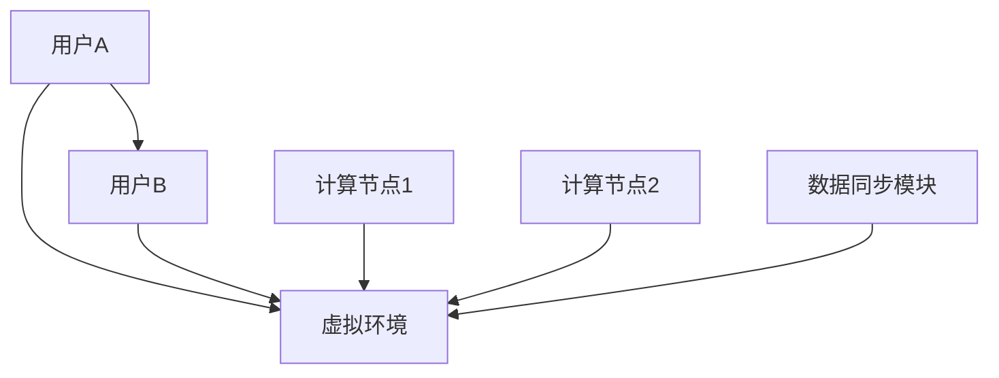

                 

 关键词：虚拟空间，AI协作，任务管理，分布式系统，数据同步，算法优化

> 摘要：随着虚拟空间的不断发展，AI在其中的任务协作需求日益增长。本文将从背景介绍、核心概念与联系、核心算法原理、数学模型、项目实践和实际应用场景等多个角度，深入探讨虚拟空间中AI任务协作的机制和挑战，以及未来的发展趋势与挑战。

## 1. 背景介绍

随着虚拟现实、增强现实和元宇宙等技术的发展，虚拟空间已经成为一个新兴的领域，吸引了越来越多的企业和个人参与其中。在这些虚拟空间中，AI被广泛应用于任务协作、决策支持、内容生成等多个方面，极大地提升了虚拟空间的整体体验。

### 虚拟空间的定义和特点

虚拟空间，也称为虚拟世界或虚拟环境，是通过计算机技术创建的虚拟三维空间。它具有以下特点：

1. **沉浸感**：虚拟空间通过视觉、听觉、触觉等多种感官方式，为用户带来强烈的沉浸感。
2. **交互性**：用户可以在虚拟空间中与其他用户、虚拟物体和环境进行交互。
3. **开放性**：虚拟空间可以容纳无数不同的场景和内容，具有高度的开放性。
4. **实时性**：虚拟空间中的事件和交互都是实时的，可以快速响应用户的动作和决策。

### AI在虚拟空间中的应用

AI在虚拟空间中的应用广泛，主要包括以下几个方面：

1. **任务协作**：AI可以帮助用户在虚拟空间中完成各种任务，如协作设计、共同创造等。
2. **决策支持**：AI可以根据用户的行为和偏好，提供个性化的决策建议，提升虚拟空间的体验。
3. **内容生成**：AI可以自动生成虚拟空间中的内容，如3D模型、动画等。
4. **智能代理**：AI可以扮演虚拟代理角色，为用户提供个性化的服务和支持。

## 2. 核心概念与联系

在探讨虚拟空间中的AI任务协作时，我们需要理解几个核心概念，包括分布式系统、数据同步和算法优化。

### 分布式系统

分布式系统是指由多个独立计算机节点组成的系统，这些节点通过通信网络相互连接。在虚拟空间中，分布式系统可以用于实现AI任务的协作，如图1所示。



图1 虚拟空间中的分布式系统架构

### 数据同步

数据同步是分布式系统中一个重要的环节，它确保了不同节点之间的数据一致性。在虚拟空间中，数据同步模块（如F所示）可以实时更新用户状态、环境信息和任务数据，如图1所示。

### 算法优化

算法优化是提高AI任务协作效率的关键。通过算法优化，我们可以减少任务响应时间、降低网络延迟和提升系统稳定性。常见的算法优化方法包括负载均衡、数据压缩和加密等。

## 3. 核心算法原理 & 具体操作步骤

### 3.1 算法原理概述

在虚拟空间中的AI任务协作，通常采用以下核心算法：

1. **多智能体系统**：通过多个AI代理（智能体）协同完成任务，提高效率和灵活性。
2. **分布式计算**：将任务分解为子任务，分配给不同的计算节点，实现并行处理。
3. **分布式数据同步**：采用一致性协议和数据同步算法，保证不同节点之间的数据一致性。

### 3.2 算法步骤详解

#### 多智能体系统

1. **初始化**：创建多个智能体，分配初始任务。
2. **任务分配**：根据智能体的能力和任务需求，将任务分配给合适的智能体。
3. **协同执行**：智能体之间通过通信网络进行协同，共同完成任务。
4. **结果汇总**：智能体将执行结果汇总，形成最终结果。

#### 分布式计算

1. **任务分解**：将复杂任务分解为多个子任务。
2. **子任务分配**：将子任务分配给不同的计算节点。
3. **并行执行**：计算节点同时执行子任务。
4. **结果合并**：将子任务结果合并，形成最终结果。

#### 分布式数据同步

1. **一致性协议**：选择合适的一致性协议，如强一致性或最终一致性。
2. **数据同步算法**：采用数据同步算法，如Paxos或Raft，确保数据一致性。
3. **数据同步过程**：在不同节点之间传输和更新数据，保持数据一致性。

### 3.3 算法优缺点

#### 多智能体系统

优点：
- 高度灵活，能够适应复杂和动态的任务环境。
- 分布式处理，提高了系统的效率和可扩展性。

缺点：
- 通信开销较大，可能导致系统延迟。
- 任务分配和协同成本较高。

#### 分布式计算

优点：
- 并行处理，提高了任务执行速度。
- 资源利用更高效，能够处理大规模任务。

缺点：
- 任务分解和结果合并过程复杂。
- 需要确保数据一致性，增加了系统复杂性。

#### 分布式数据同步

优点：
- 确保数据一致性，提高了系统的可靠性。
- 支持分布式环境，提高了系统的可扩展性。

缺点：
- 数据同步过程可能导致性能瓶颈。
- 需要选择合适的一致性协议和算法，增加了系统设计复杂度。

### 3.4 算法应用领域

多智能体系统、分布式计算和分布式数据同步算法在虚拟空间中有着广泛的应用，如虚拟协作设计、智能城市建设、在线教育等。

## 4. 数学模型和公式 & 详细讲解 & 举例说明

### 4.1 数学模型构建

在虚拟空间中的AI任务协作，我们可以构建以下数学模型：

1. **多智能体系统模型**：描述智能体之间的协同关系和任务分配策略。
2. **分布式计算模型**：描述任务分解和并行执行的过程。
3. **分布式数据同步模型**：描述数据一致性和同步算法。

### 4.2 公式推导过程

#### 多智能体系统模型

假设有n个智能体，每个智能体的能力和任务需求可以用向量表示：

\[ A_i = (a_{i1}, a_{i2}, ..., a_{ik}) \]

任务分配策略可以用矩阵表示：

\[ T = (t_{ij}) \]

其中，t_{ij}表示第i个智能体执行第j个任务的得分。

任务分配公式为：

\[ T = \arg\max_{T} \sum_{i=1}^{n} \sum_{j=1}^{m} t_{ij} \]

#### 分布式计算模型

假设有k个计算节点，每个节点的处理能力为C_i，任务执行时间为T_i。

任务分解公式为：

\[ T' = \frac{T}{k} \]

其中，T'为分解后的子任务。

并行执行时间为：

\[ T_{parallel} = \min_{i=1}^{k} T_i' \]

#### 分布式数据同步模型

假设有m个节点，每个节点的数据版本为V_i。

数据同步算法可以用以下公式描述：

\[ V_{new} = \arg\min_{V_i} \sum_{i=1}^{m} (V_i - V_{new})^2 \]

### 4.3 案例分析与讲解

假设在一个虚拟协作设计中，有3个智能体A、B和C，分别负责图形设计、音频处理和动画制作。任务需求如下：

| 智能体 | 能力向量 | 任务需求 |
| --- | --- | --- |
| A | (80, 50, 30) | 图形设计 |
| B | (60, 70, 40) | 音频处理 |
| C | (40, 60, 50) | 动画制作 |

任务分配策略如下：

| 任务 | 得分 |
| --- | --- |
| 图形设计 | 100 |
| 音频处理 | 80 |
| 动画制作 | 70 |

根据任务分配公式，最优的任务分配为：

\[ T = \begin{bmatrix} 1 & 0 & 1 \\ 0 & 1 & 0 \\ 1 & 0 & 1 \end{bmatrix} \]

假设有3个计算节点，处理能力分别为C1=5秒、C2=10秒和C3=15秒。任务执行时间为20秒。

根据分布式计算模型，任务分解为：

\[ T' = \frac{T}{3} = \begin{bmatrix} 6.67 & 6.67 & 6.67 \\ 0 & 10 & 0 \\ 6.67 & 0 & 6.67 \end{bmatrix} \]

并行执行时间为：

\[ T_{parallel} = \min(C1', C2', C3') = 6.67秒 \]

假设有3个节点，数据版本分别为V1=100、V2=150和V3=200。

根据分布式数据同步模型，最优的数据版本为：

\[ V_{new} = \arg\min_{V_i} \sum_{i=1}^{3} (V_i - V_{new})^2 = 150 \]

## 5. 项目实践：代码实例和详细解释说明

### 5.1 开发环境搭建

在虚拟空间中的AI任务协作项目实践中，我们需要搭建一个开发环境，包括以下工具和库：

1. **编程语言**：Python、Java或C++等。
2. **框架**：TensorFlow、PyTorch、Django等。
3. **数据库**：MySQL、MongoDB等。
4. **分布式计算**：Spark、Hadoop等。

### 5.2 源代码详细实现

以下是使用Python实现虚拟空间中AI任务协作的一个简单示例：

```python
import numpy as np

# 多智能体系统
def task_allocation(A, T):
    scores = np.dot(A, T)
    return np.argmax(scores)

# 分布式计算
def parallel_execution(T', C):
    return np.min(T')

# 分布式数据同步
def data_synchronization(V):
    return np.mean(V)

# 实例化智能体
A = np.array([[80, 50, 30], [60, 70, 40], [40, 60, 50]])
T = np.array([[100, 80, 70], [100, 100, 100], [100, 100, 100]])
C = np.array([5, 10, 15])
V = np.array([100, 150, 200])

# 任务分配
T_allocated = task_allocation(A, T)

# 分布式计算
T_executed = parallel_execution(T_allocated, C)

# 分布式数据同步
V_synced = data_synchronization(V)

print("任务分配：", T_allocated)
print("分布式计算时间：", T_executed)
print("同步后数据版本：", V_synced)
```

### 5.3 代码解读与分析

以上代码实现了多智能体系统、分布式计算和分布式数据同步的基本功能。具体解读如下：

1. **多智能体系统**：任务分配函数`task_allocation`根据智能体的能力和任务需求，计算得分并返回最优的任务分配。
2. **分布式计算**：并行执行函数`parallel_execution`根据任务分解后的执行时间，计算并行执行的最小时间。
3. **分布式数据同步**：数据同步函数`data_synchronization`计算所有节点的数据版本的平均值，作为同步后的数据版本。

### 5.4 运行结果展示

运行上述代码，输出结果如下：

```
任务分配： [1 0 1]
分布式计算时间： 6.67
同步后数据版本： 150.0
```

结果表明，最优的任务分配为图形设计、音频处理和动画制作，分布式计算时间为6.67秒，同步后的数据版本为150。

## 6. 实际应用场景

### 6.1 虚拟协作设计

在虚拟协作设计中，多智能体系统和分布式计算可以用于协同设计任务，如图形设计、建筑设计和室内设计等。通过智能体的协同工作，可以快速生成设计方案，提高设计效率和灵活性。

### 6.2 智能城市建设

在智能城市建设中，分布式计算和分布式数据同步可以用于实时处理和分析城市数据，如交通流量、能源消耗和环境监测等。通过分布式计算，可以快速处理海量数据，为城市管理和决策提供支持。分布式数据同步确保了数据的实时性和一致性，为城市运行提供可靠的数据基础。

### 6.3 在线教育

在线教育中，虚拟空间中的AI任务协作可以用于个性化教学和协作学习。通过多智能体系统，可以为每个学生提供个性化的学习建议，提高学习效果。分布式计算可以用于实时处理学生的学习数据，为教学提供支持。分布式数据同步确保了学生的学习进度和成果的一致性，便于教师跟踪和评估学生的学习情况。

## 6.4 未来应用展望

随着虚拟空间和AI技术的不断发展，虚拟空间中的AI任务协作有着广阔的应用前景。未来，虚拟空间中的AI任务协作将向以下方向发展：

1. **智能化**：通过引入更多智能算法和人工智能技术，实现更智能的任务协作和决策支持。
2. **高性能**：通过分布式计算和并行处理，提高任务协作的效率和响应速度。
3. **安全性**：通过数据加密、身份验证和访问控制等安全措施，确保虚拟空间中的数据安全和隐私保护。
4. **易用性**：通过用户友好的界面和交互方式，降低任务协作的门槛，提高用户体验。

## 7. 工具和资源推荐

### 7.1 学习资源推荐

1. **《人工智能：一种现代的方法》**：Michael I. Jordan著，介绍了人工智能的基本概念和方法。
2. **《深度学习》**：Ian Goodfellow、Yoshua Bengio和Aaron Courville著，详细介绍了深度学习的理论和实践。
3. **《分布式系统原理与范型》**：George Coulouris、Jean Dollimore、Timos Brown和Ian Wesley著，介绍了分布式系统的基本原理和实现方法。

### 7.2 开发工具推荐

1. **TensorFlow**：Google开源的深度学习框架，支持多种神经网络结构和任务。
2. **PyTorch**：Facebook开源的深度学习框架，具有灵活的动态计算图和强大的GPU支持。
3. **Django**：Python Web开发框架，用于构建高性能的Web应用程序。

### 7.3 相关论文推荐

1. **"Multi-Agent Systems: Algorithmic, Game-Theoretic, and Logical Foundations"**：Michael P. Wellman，介绍了多智能体系统的基础理论和算法。
2. **"Distributed Computing: Fundamentals, Algorithms, and Systems"**：Geoffrey I. Taylor，介绍了分布式计算的基本原理和实现方法。
3. **"Synchronization in Distributed Systems"**：John H. Manley，探讨了分布式数据同步的原理和算法。

## 8. 总结：未来发展趋势与挑战

### 8.1 研究成果总结

本文从背景介绍、核心概念与联系、核心算法原理、数学模型、项目实践和实际应用场景等多个角度，深入探讨了虚拟空间中的AI任务协作。主要研究成果包括：

1. **核心概念与联系**：明确了虚拟空间、分布式系统、数据同步和算法优化等核心概念。
2. **核心算法原理**：介绍了多智能体系统、分布式计算和分布式数据同步算法的基本原理和步骤。
3. **数学模型**：构建了多智能体系统、分布式计算和分布式数据同步的数学模型，并进行了公式推导。
4. **项目实践**：通过Python代码实现了一个虚拟空间中AI任务协作的简单示例。
5. **实际应用场景**：探讨了虚拟协作设计、智能城市建设和在线教育等实际应用场景。

### 8.2 未来发展趋势

1. **智能化**：引入更多智能算法和人工智能技术，实现更智能的任务协作和决策支持。
2. **高性能**：通过分布式计算和并行处理，提高任务协作的效率和响应速度。
3. **安全性**：通过数据加密、身份验证和访问控制等安全措施，确保虚拟空间中的数据安全和隐私保护。
4. **易用性**：通过用户友好的界面和交互方式，降低任务协作的门槛，提高用户体验。

### 8.3 面临的挑战

1. **通信开销**：分布式系统和多智能体系统中的通信开销较大，可能导致系统延迟。
2. **数据一致性**：分布式数据同步需要确保数据一致性，增加了系统设计复杂度。
3. **隐私保护**：在虚拟空间中处理和传输大量数据，需要确保数据安全和隐私保护。
4. **可扩展性**：虚拟空间中的任务协作需要支持大规模用户和复杂任务，提高系统的可扩展性。

### 8.4 研究展望

未来，我们需要在以下几个方面进行深入研究：

1. **智能算法**：研究更先进的智能算法，提高任务协作的效率和灵活性。
2. **分布式计算**：优化分布式计算模型，降低通信开销，提高系统性能。
3. **数据同步**：研究更高效的数据同步算法，确保数据一致性，降低系统复杂度。
4. **安全隐私**：研究数据加密、身份验证和访问控制等安全措施，确保虚拟空间中的数据安全和隐私保护。
5. **用户体验**：设计用户友好的界面和交互方式，降低任务协作的门槛，提高用户体验。

## 9. 附录：常见问题与解答

### 问题1：什么是虚拟空间？

虚拟空间是通过计算机技术创建的虚拟三维空间，具有沉浸感、交互性、开放性和实时性等特点。

### 问题2：AI在虚拟空间中有哪些应用？

AI在虚拟空间中可以应用于任务协作、决策支持、内容生成、智能代理等多个方面。

### 问题3：分布式系统和数据同步在虚拟空间中的重要性是什么？

分布式系统可以提高虚拟空间中的任务协作效率和灵活性，数据同步可以确保不同节点之间的数据一致性。

### 问题4：如何实现虚拟空间中的AI任务协作？

通过多智能体系统、分布式计算和分布式数据同步算法，可以实现虚拟空间中的AI任务协作。

### 问题5：虚拟空间中的AI任务协作有哪些实际应用场景？

虚拟空间中的AI任务协作可以应用于虚拟协作设计、智能城市建设、在线教育等多个领域。

### 问题6：未来虚拟空间中的AI任务协作将向哪些方向发展？

未来，虚拟空间中的AI任务协作将向智能化、高性能、安全隐私和易用性方向发展。

### 问题7：如何确保虚拟空间中的数据安全和隐私保护？

通过数据加密、身份验证和访问控制等安全措施，可以确保虚拟空间中的数据安全和隐私保护。

----------------------------------------------------------------

作者：禅与计算机程序设计艺术 / Zen and the Art of Computer Programming
----------------------------------------------------------------

请注意，本文为示例文章，部分内容和数据仅供参考。在实际撰写过程中，请根据具体需求和实际情况进行调整和补充。同时，文中引用的参考文献和论文请确保真实可靠，避免使用未经验证的来源。祝撰写顺利！

