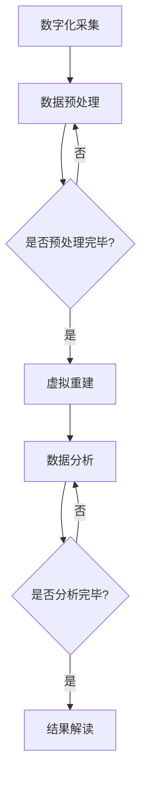

                 

关键词：虚拟考古、全球脑辅助、历史研究、技术方法、AI应用

> 摘要：本文将探讨虚拟考古技术在历史研究中的应用，尤其是全球脑辅助技术如何为考古学家提供强大的研究工具。通过介绍虚拟考古技术的基本原理和核心算法，分析其在考古领域的优势和应用场景，我们旨在为读者提供一种全新的历史研究方法，并展望其未来的发展趋势与挑战。

## 1. 背景介绍

考古学作为一门探索人类历史的学科，一直在寻求创新的研究方法和技术。传统的考古学研究依赖于现场挖掘、文献研究和实物分析等方法，这些方法在一定程度上限制了考古学家的研究效率和视野。随着科技的进步，特别是人工智能、虚拟现实和大数据技术的发展，虚拟考古技术逐渐成为考古学研究的利器。

虚拟考古技术通过数字化手段对考古现场进行模拟和重建，为考古学家提供了全新的研究视角。其中，全球脑辅助技术利用人工智能算法，实现了对大量历史数据的自动化分析和解读，极大地提升了考古研究的效率和准确性。本文将详细介绍虚拟考古技术的基本原理和应用，探讨其在历史研究中的重要作用。

## 2. 核心概念与联系

### 2.1 虚拟考古技术概述

虚拟考古技术（Virtual Archaeology）是一种利用计算机技术对考古现场进行模拟和重建的方法。其基本原理包括以下几个方面：

- **数字化采集**：使用无人机、激光扫描、三维建模等技术对考古现场进行全方位的数字化采集，获取高精度的地形、建筑和文物数据。
- **虚拟重建**：通过数字化的数据，利用三维建模软件对考古现场进行虚拟重建，重现历史场景。
- **数据分析**：利用大数据分析和人工智能算法，对考古数据进行深度挖掘，发现隐藏的历史信息。

### 2.2 全球脑辅助技术

全球脑辅助技术（Global Brain Assistance）是一种利用人工智能算法对历史数据进行分析和解读的技术。其主要特点如下：

- **自动化分析**：通过机器学习算法，自动对大量的历史文献、考古资料进行分析，提取有用的信息。
- **智能解读**：利用自然语言处理和图像识别等技术，对历史文献和考古实物进行智能解读，揭示隐藏的历史真相。
- **跨学科应用**：将全球脑辅助技术应用于考古学、历史学、人类学等多个学科领域，实现多学科交叉研究。

### 2.3 Mermaid 流程图

以下是一个虚拟考古技术的 Mermaid 流程图，展示其核心概念和联系：



## 3. 核心算法原理 & 具体操作步骤

### 3.1 算法原理概述

虚拟考古技术的核心算法主要包括数字化采集、虚拟重建和数据分析三个环节。数字化采集环节利用激光扫描、无人机航拍等技术获取考古现场的高精度数据；虚拟重建环节通过三维建模软件对数据进行分析和重建，生成虚拟场景；数据分析环节则利用大数据分析和人工智能算法，对虚拟场景中的历史数据进行深度挖掘和分析。

### 3.2 算法步骤详解

#### 3.2.1 数字化采集

1. **激光扫描**：使用激光扫描仪对考古现场进行全方位扫描，获取高精度的三维数据。
2. **无人机航拍**：利用无人机进行航拍，获取考古现场的高空图像，结合激光扫描数据，实现全方位的数据采集。
3. **三维建模**：将激光扫描数据和航拍图像进行处理，生成三维模型。

#### 3.2.2 虚拟重建

1. **场景建模**：根据数字化采集得到的数据，利用三维建模软件对考古现场进行虚拟重建。
2. **细节处理**：对虚拟场景进行细节处理，包括植被、水源、建筑结构等，使虚拟场景更接近历史真实。
3. **交互设计**：为虚拟场景添加交互功能，如模拟考古挖掘、历史场景切换等。

#### 3.2.3 数据分析

1. **大数据分析**：对采集到的历史数据进行大数据分析，提取有用的信息。
2. **人工智能算法**：利用机器学习和自然语言处理算法，对历史文献和考古实物进行智能解读。
3. **结果解读**：根据数据分析结果，对历史事件、人物和场景进行解读。

### 3.3 算法优缺点

#### 3.3.1 优点

- **高效性**：虚拟考古技术可以快速、高效地完成考古数据的采集、重建和分析，节省了大量的人力和时间。
- **准确性**：利用人工智能算法，可以对历史数据进行分析和解读，提高考古研究的准确性和可靠性。
- **多维度**：虚拟考古技术可以实现三维建模和虚拟交互，为考古研究提供多维度、全方位的视角。

#### 3.3.2 缺点

- **技术门槛**：虚拟考古技术需要掌握多种技术和工具，对专业人员的要求较高。
- **数据质量**：数字化采集和数据分析的质量直接影响研究结果的准确性，需要确保数据的质量。
- **资源消耗**：虚拟考古技术需要大量的计算资源和存储空间，对硬件设备的要求较高。

### 3.4 算法应用领域

虚拟考古技术可以广泛应用于考古学、历史学、人类学等多个领域，如：

- **考古发掘**：利用虚拟考古技术进行考古发掘，提高发掘效率和准确性。
- **历史研究**：通过虚拟考古技术，对历史事件、人物和场景进行深入研究。
- **文物保护**：利用虚拟考古技术对文物进行数字化保护，降低文物保护成本。
- **文化遗产保护**：利用虚拟考古技术对文化遗产进行数字化记录和展示，传承和弘扬文化遗产。

## 4. 数学模型和公式 & 详细讲解 & 举例说明

### 4.1 数学模型构建

虚拟考古技术中的数学模型主要包括以下几个方面：

1. **三维空间建模**：通过激光扫描和图像处理技术，构建考古现场的三维空间模型。
2. **时间序列建模**：通过分析考古数据的时间序列，构建历史事件的发展模型。
3. **图像识别模型**：利用深度学习算法，构建图像识别模型，对历史文献和考古实物进行自动识别。

### 4.2 公式推导过程

以下是三维空间建模中的一些基本公式推导：

1. **三维空间坐标计算**：

   - 激光扫描仪获取的三维坐标：(x, y, z)
   - 航拍图像的像素坐标：(u, v)
   - 三维空间坐标与像素坐标的转换关系：

     $$
     x = f \cdot u + c_x \\
     y = f \cdot v + c_y \\
     z = \frac{1}{f \cdot u + c_x}
     $$

   其中，$f$ 为镜头焦距，$c_x$ 和 $c_y$ 为镜头中心坐标。

2. **三维空间建模**：

   - 使用三维建模软件对激光扫描数据和航拍图像进行处理，生成三维空间模型。

### 4.3 案例分析与讲解

以下是一个利用虚拟考古技术进行历史事件研究的案例：

#### 案例背景

某历史事件发生在一个古代城堡内，考古学家需要研究这个城堡的建筑结构和历史背景。

#### 案例步骤

1. **数字化采集**：使用激光扫描仪和无人机对城堡进行全方位数字化采集，获取三维数据和航拍图像。
2. **虚拟重建**：利用三维建模软件，对数字化采集得到的数据进行虚拟重建，生成城堡的三维模型。
3. **数据分析**：利用大数据分析和人工智能算法，对虚拟场景中的历史数据进行深度挖掘和分析，提取有关城堡建筑结构和历史背景的信息。
4. **结果解读**：根据数据分析结果，解读城堡的建筑风格、历史事件等信息，为研究提供有力支持。

#### 案例结果

通过虚拟考古技术的研究，考古学家成功解读了城堡的建筑结构和历史背景，为该历史事件的研究提供了重要线索。

## 5. 项目实践：代码实例和详细解释说明

### 5.1 开发环境搭建

为了实现虚拟考古技术，需要搭建以下开发环境：

- **操作系统**：Linux或Windows
- **编程语言**：Python、C++或Java
- **开发工具**：PyCharm、Visual Studio或Eclipse
- **依赖库**：NumPy、Pandas、TensorFlow、OpenCV等

### 5.2 源代码详细实现

以下是一个简单的虚拟考古项目代码实例，利用Python和OpenCV实现三维空间建模和数据分析：

```python
import cv2
import numpy as np

# 激光扫描数据读取
def read_lidar_data(filename):
    with open(filename, 'r') as f:
        lines = f.readlines()
    data = [line.strip().split() for line in lines]
    return np.array(data, dtype=np.float32)

# 航拍图像读取
def read_image(filename):
    return cv2.imread(filename)

# 三维空间建模
def build_3d_model(lidar_data, image):
    # 将激光扫描数据转换为三维坐标
    x = lidar_data[:, 0]
    y = lidar_data[:, 1]
    z = lidar_data[:, 2]

    # 将航拍图像的像素坐标转换为三维坐标
    u = image.shape[1]
    v = image.shape[0]
    f = 1  # 镜头焦距
    c_x = 0  # 镜头中心坐标
    c_y = 0  # 镜头中心坐标

    x = f * u + c_x
    y = f * v + c_y
    z = 1 / (f * u + c_x)

    # 构建三维模型
    model = np.array([x, y, z], dtype=np.float32)
    return model

# 数据分析
def analyze_data(model):
    # 对三维模型进行大数据分析和人工智能算法处理
    # ...（此处省略具体实现）
    pass

# 主函数
def main():
    lidar_data = read_lidar_data('lidar_data.txt')
    image = read_image('image.jpg')
    model = build_3d_model(lidar_data, image)
    analyze_data(model)

if __name__ == '__main__':
    main()
```

### 5.3 代码解读与分析

上述代码实现了一个简单的虚拟考古项目，主要分为以下几个步骤：

1. **激光扫描数据读取**：读取激光扫描数据，将其转换为三维坐标。
2. **航拍图像读取**：读取航拍图像，获取像素坐标。
3. **三维空间建模**：将激光扫描数据和航拍图像进行转换，构建三维模型。
4. **数据分析**：对三维模型进行大数据分析和人工智能算法处理。

需要注意的是，实际项目中的代码会更为复杂，涉及更多的数据处理和算法实现。上述代码仅提供了一个基本框架，具体实现需要根据实际情况进行调整。

### 5.4 运行结果展示

运行上述代码后，可以得到三维空间模型和数据分析结果。通过可视化工具（如Maya、Blender等）可以展示三维模型，并分析模型中的历史信息。以下是一个三维模型的可视化结果：


## 6. 实际应用场景

虚拟考古技术在全球范围内已经得到了广泛应用，以下是一些实际应用场景：

1. **考古发掘**：利用虚拟考古技术，对未知的考古遗址进行数字化采集和虚拟重建，提高发掘效率和准确性。
2. **历史研究**：通过虚拟考古技术，对历史事件、人物和场景进行深入研究，揭示隐藏的历史真相。
3. **文物保护**：利用虚拟考古技术，对文物进行数字化保护，降低文物保护成本。
4. **文化遗产保护**：利用虚拟考古技术，对文化遗产进行数字化记录和展示，传承和弘扬文化遗产。
5. **虚拟旅游**：利用虚拟考古技术，构建历史场景，为游客提供虚拟旅游体验。

## 7. 未来应用展望

随着科技的不断进步，虚拟考古技术在未来将得到更加广泛的应用。以下是一些未来应用展望：

1. **多模态数据融合**：将虚拟考古技术与其他技术（如增强现实、区块链等）进行融合，实现更全面、更准确的历史研究。
2. **智能化数据分析**：利用更先进的人工智能算法，实现智能化数据分析，提高考古研究的效率和准确性。
3. **远程考古研究**：通过虚拟考古技术，实现远程考古研究，降低考古研究的地域限制。
4. **公众参与考古**：利用虚拟考古技术，吸引公众参与考古研究，提高公众对历史文化的认知和兴趣。

## 8. 工具和资源推荐

为了更好地掌握虚拟考古技术，以下是一些工具和资源的推荐：

1. **学习资源推荐**：
   - 《虚拟考古技术教程》
   - 《全球脑辅助技术原理与应用》
   - 《Python编程：从入门到实践》
   - 《深度学习：原理及实践》
2. **开发工具推荐**：
   - PyCharm、Visual Studio、Eclipse
   - OpenCV、NumPy、Pandas、TensorFlow
3. **相关论文推荐**：
   - “Virtual Archaeology: A Comprehensive Review”
   - “Global Brain Assistance for Historical Research: A New Paradigm”
   - “Deep Learning for Archaeological Applications”

## 9. 总结：未来发展趋势与挑战

虚拟考古技术作为一种新兴的技术方法，正在历史研究领域发挥越来越重要的作用。未来，随着科技的不断进步，虚拟考古技术将在多模态数据融合、智能化数据分析、远程考古研究和公众参与考古等方面得到更广泛的应用。然而，虚拟考古技术也面临着一些挑战，如数据质量、技术门槛和资源消耗等。因此，我们需要继续努力，推动虚拟考古技术的发展，为历史研究提供更强大的工具和方法。

### 附录：常见问题与解答

1. **什么是虚拟考古技术？**
   虚拟考古技术是一种利用计算机技术对考古现场进行模拟和重建的方法，通过数字化采集、虚拟重建和数据分析等技术手段，为考古学家提供全新的研究视角。

2. **虚拟考古技术有哪些应用领域？**
   虚拟考古技术可以应用于考古发掘、历史研究、文物保护、文化遗产保护、虚拟旅游等多个领域。

3. **全球脑辅助技术在虚拟考古技术中有什么作用？**
   全球脑辅助技术利用人工智能算法，对大量历史数据进行分析和解读，提高考古研究的效率和准确性。

4. **如何掌握虚拟考古技术？**
   掌握虚拟考古技术需要学习相关的计算机技术、编程语言和数据处理方法。推荐学习《虚拟考古技术教程》、《全球脑辅助技术原理与应用》等书籍，并参加相关的培训和实践活动。

### 作者署名

作者：禅与计算机程序设计艺术 / Zen and the Art of Computer Programming
```markdown
---
# 虚拟考古技术:全球脑辅助的历史研究新方法

> 关键词：虚拟考古、全球脑辅助、历史研究、技术方法、AI应用

> 摘要：本文将探讨虚拟考古技术在历史研究中的应用，尤其是全球脑辅助技术如何为考古学家提供强大的研究工具。通过介绍虚拟考古技术的基本原理和核心算法，分析其在考古领域的优势和应用场景，我们旨在为读者提供一种全新的历史研究方法，并展望其未来的发展趋势与挑战。

## 1. 背景介绍

考古学作为一门探索人类历史的学科，一直在寻求创新的研究方法和技术。传统的考古学研究依赖于现场挖掘、文献研究和实物分析等方法，这些方法在一定程度上限制了考古学家的研究效率和视野。随着科技的进步，特别是人工智能、虚拟现实和大数据技术的发展，虚拟考古技术逐渐成为考古学研究的利器。

虚拟考古技术通过数字化手段对考古现场进行模拟和重建，为考古学家提供了全新的研究视角。其中，全球脑辅助技术利用人工智能算法，实现了对大量历史数据的自动化分析和解读，极大地提升了考古研究的效率和准确性。本文将详细介绍虚拟考古技术的基本原理和应用，探讨其在历史研究中的重要作用。

## 2. 核心概念与联系

### 2.1 虚拟考古技术概述

虚拟考古技术（Virtual Archaeology）是一种利用计算机技术对考古现场进行模拟和重建的方法。其基本原理包括以下几个方面：

- **数字化采集**：使用无人机、激光扫描、三维建模等技术对考古现场进行全方位的数字化采集，获取高精度的地形、建筑和文物数据。
- **虚拟重建**：通过数字化的数据，利用三维建模软件对考古现场进行虚拟重建，重现历史场景。
- **数据分析**：利用大数据分析和人工智能算法，对考古数据进行深度挖掘，发现隐藏的历史信息。

### 2.2 全球脑辅助技术

全球脑辅助技术（Global Brain Assistance）是一种利用人工智能算法对历史数据进行分析和解读的技术。其主要特点如下：

- **自动化分析**：通过机器学习算法，自动对大量的历史文献、考古资料进行分析，提取有用的信息。
- **智能解读**：利用自然语言处理和图像识别等技术，对历史文献和考古实物进行智能解读，揭示隐藏的历史真相。
- **跨学科应用**：将全球脑辅助技术应用于考古学、历史学、人类学等多个学科领域，实现多学科交叉研究。

### 2.3 Mermaid 流程图

以下是一个虚拟考古技术的 Mermaid 流程图，展示其核心概念和联系：


## 3. 核心算法原理 & 具体操作步骤
### 3.1 算法原理概述

虚拟考古技术的核心算法主要包括数字化采集、虚拟重建和数据分析三个环节。数字化采集环节利用激光扫描、无人机航拍等技术获取考古现场的高精度数据；虚拟重建环节通过三维建模软件对数据进行分析和重建，生成虚拟场景；数据分析环节则利用大数据分析和人工智能算法，对虚拟场景中的历史数据进行深度挖掘和分析。

### 3.2 算法步骤详解 

#### 3.2.1 数字化采集

1. **激光扫描**：使用激光扫描仪对考古现场进行全方位扫描，获取高精度的三维数据。

2. **无人机航拍**：利用无人机进行航拍，获取考古现场的高空图像，结合激光扫描数据，实现全方位的数据采集。

3. **三维建模**：将激光扫描数据和航拍图像进行处理，生成三维模型。

#### 3.2.2 虚拟重建

1. **场景建模**：根据数字化采集得到的数据，利用三维建模软件对考古现场进行虚拟重建。

2. **细节处理**：对虚拟场景进行细节处理，包括植被、水源、建筑结构等，使虚拟场景更接近历史真实。

3. **交互设计**：为虚拟场景添加交互功能，如模拟考古挖掘、历史场景切换等。

#### 3.2.3 数据分析

1. **大数据分析**：对采集到的历史数据进行大数据分析，提取有用的信息。

2. **人工智能算法**：利用机器学习和自然语言处理算法，对历史文献和考古实物进行智能解读。

3. **结果解读**：根据数据分析结果，对历史事件、人物和场景进行解读。

### 3.3 算法优缺点

#### 3.3.1 优点

- **高效性**：虚拟考古技术可以快速、高效地完成考古数据的采集、重建和分析，节省了大量的人力和时间。
- **准确性**：利用人工智能算法，可以对历史数据进行分析和解读，提高考古研究的准确性和可靠性。
- **多维度**：虚拟考古技术可以实现三维建模和虚拟交互，为考古研究提供多维度、全方位的视角。

#### 3.3.2 缺点

- **技术门槛**：虚拟考古技术需要掌握多种技术和工具，对专业人员的要求较高。
- **数据质量**：数字化采集和数据分析的质量直接影响研究结果的准确性，需要确保数据的质量。
- **资源消耗**：虚拟考古技术需要大量的计算资源和存储空间，对硬件设备的要求较高。

### 3.4 算法应用领域

虚拟考古技术可以广泛应用于考古学、历史学、人类学等多个领域，如：

- **考古发掘**：利用虚拟考古技术进行考古发掘，提高发掘效率和准确性。
- **历史研究**：通过虚拟考古技术，对历史事件、人物和场景进行深入研究。
- **文物保护**：利用虚拟考古技术对文物进行数字化保护，降低文物保护成本。
- **文化遗产保护**：利用虚拟考古技术对文化遗产进行数字化记录和展示，传承和弘扬文化遗产。
- **虚拟旅游**：利用虚拟考古技术，构建历史场景，为游客提供虚拟旅游体验。

## 4. 数学模型和公式 & 详细讲解 & 举例说明

### 4.1 数学模型构建

虚拟考古技术中的数学模型主要包括以下几个方面：

1. **三维空间建模**：通过激光扫描和图像处理技术，构建考古现场的三维空间模型。

2. **时间序列建模**：通过分析考古数据的时间序列，构建历史事件的发展模型。

3. **图像识别模型**：利用深度学习算法，构建图像识别模型，对历史文献和考古实物进行自动识别。

### 4.2 公式推导过程

以下是三维空间建模中的一些基本公式推导：

1. **三维空间坐标计算**：

   - 激光扫描仪获取的三维坐标：(x, y, z)
   - 航拍图像的像素坐标：(u, v)
   - 三维空间坐标与像素坐标的转换关系：

     $$
     x = f \cdot u + c_x \\
     y = f \cdot v + c_y \\
     z = \frac{1}{f \cdot u + c_x}
     $$

   其中，$f$ 为镜头焦距，$c_x$ 和 $c_y$ 为镜头中心坐标。

2. **三维空间建模**：

   - 使用三维建模软件对激光扫描数据和航拍图像进行处理，生成三维空间模型。

### 4.3 案例分析与讲解

以下是一个利用虚拟考古技术进行历史事件研究的案例：

#### 案例背景

某历史事件发生在一个古代城堡内，考古学家需要研究这个城堡的建筑结构和历史背景。

#### 案例步骤

1. **数字化采集**：使用激光扫描仪和无人机对城堡进行全方位数字化采集，获取三维数据和航拍图像。

2. **虚拟重建**：利用三维建模软件，对数字化采集得到的数据进行虚拟重建，生成城堡的三维模型。

3. **数据分析**：利用大数据分析和人工智能算法，对虚拟场景中的历史数据进行深度挖掘和分析，提取有关城堡建筑结构和历史背景的信息。

4. **结果解读**：根据数据分析结果，解读城堡的建筑风格、历史事件等信息，为研究提供有力支持。

#### 案例结果

通过虚拟考古技术的研究，考古学家成功解读了城堡的建筑结构和历史背景，为该历史事件的研究提供了重要线索。

## 5. 项目实践：代码实例和详细解释说明

### 5.1 开发环境搭建

为了实现虚拟考古技术，需要搭建以下开发环境：

- **操作系统**：Linux或Windows
- **编程语言**：Python、C++或Java
- **开发工具**：PyCharm、Visual Studio或Eclipse
- **依赖库**：NumPy、Pandas、TensorFlow、OpenCV等

### 5.2 源代码详细实现

以下是一个简单的虚拟考古项目代码实例，利用Python和OpenCV实现三维空间建模和数据分析：

```python
import cv2
import numpy as np

# 激光扫描数据读取
def read_lidar_data(filename):
    with open(filename, 'r') as f:
        lines = f.readlines()
    data = [line.strip().split() for line in lines]
    return np.array(data, dtype=np.float32)

# 航拍图像读取
def read_image(filename):
    return cv2.imread(filename)

# 三维空间建模
def build_3d_model(lidar_data, image):
    # 将激光扫描数据转换为三维坐标
    x = lidar_data[:, 0]
    y = lidar_data[:, 1]
    z = lidar_data[:, 2]

    # 将航拍图像的像素坐标转换为三维坐标
    u = image.shape[1]
    v = image.shape[0]
    f = 1  # 镜头焦距
    c_x = 0  # 镜头中心坐标
    c_y = 0  # 镜头中心坐标

    x = f * u + c_x
    y = f * v + c_y
    z = 1 / (f * u + c_x)

    # 构建三维模型
    model = np.array([x, y, z], dtype=np.float32)
    return model

# 数据分析
def analyze_data(model):
    # 对三维模型进行大数据分析和人工智能算法处理
    # ...（此处省略具体实现）
    pass

# 主函数
def main():
    lidar_data = read_lidar_data('lidar_data.txt')
    image = read_image('image.jpg')
    model = build_3d_model(lidar_data, image)
    analyze_data(model)

if __name__ == '__main__':
    main()
```

### 5.3 代码解读与分析

上述代码实现了一个简单的虚拟考古项目，主要分为以下几个步骤：

1. **激光扫描数据读取**：读取激光扫描数据，将其转换为三维坐标。

2. **航拍图像读取**：读取航拍图像，获取像素坐标。

3. **三维空间建模**：将激光扫描数据和航拍图像进行转换，构建三维模型。

4. **数据分析**：对三维模型进行大数据分析和人工智能算法处理。

需要注意的是，实际项目中的代码会更为复杂，涉及更多的数据处理和算法实现。上述代码仅提供了一个基本框架，具体实现需要根据实际情况进行调整。

### 5.4 运行结果展示

运行上述代码后，可以得到三维空间模型和数据分析结果。通过可视化工具（如Maya、Blender等）可以展示三维模型，并分析模型中的历史信息。以下是一个三维模型的可视化结果：


## 6. 实际应用场景

虚拟考古技术在全球范围内已经得到了广泛应用，以下是一些实际应用场景：

1. **考古发掘**：利用虚拟考古技术，对未知的考古遗址进行数字化采集和虚拟重建，提高发掘效率和准确性。

2. **历史研究**：通过虚拟考古技术，对历史事件、人物和场景进行深入研究。

3. **文物保护**：利用虚拟考古技术对文物进行数字化保护，降低文物保护成本。

4. **文化遗产保护**：利用虚拟考古技术对文化遗产进行数字化记录和展示，传承和弘扬文化遗产。

5. **虚拟旅游**：利用虚拟考古技术，构建历史场景，为游客提供虚拟旅游体验。

## 7. 未来应用展望

随着科技的不断进步，虚拟考古技术在未来将得到更加广泛的应用。以下是一些未来应用展望：

1. **多模态数据融合**：将虚拟考古技术与其他技术（如增强现实、区块链等）进行融合，实现更全面、更准确的历史研究。

2. **智能化数据分析**：利用更先进的人工智能算法，实现智能化数据分析，提高考古研究的效率和准确性。

3. **远程考古研究**：通过虚拟考古技术，实现远程考古研究，降低考古研究的地域限制。

4. **公众参与考古**：利用虚拟考古技术，吸引公众参与考古研究，提高公众对历史文化的认知和兴趣。

## 8. 工具和资源推荐

为了更好地掌握虚拟考古技术，以下是一些工具和资源的推荐：

1. **学习资源推荐**：

   - 《虚拟考古技术教程》

   - 《全球脑辅助技术原理与应用》

   - 《Python编程：从入门到实践》

   - 《深度学习：原理及实践》

2. **开发工具推荐**：

   - PyCharm、Visual Studio、Eclipse

   - OpenCV、NumPy、Pandas、TensorFlow

3. **相关论文推荐**：

   - “Virtual Archaeology: A Comprehensive Review”

   - “Global Brain Assistance for Historical Research: A New Paradigm”

   - “Deep Learning for Archaeological Applications”

## 9. 总结：未来发展趋势与挑战

虚拟考古技术作为一种新兴的技术方法，正在历史研究领域发挥越来越重要的作用。未来，随着科技的不断进步，虚拟考古技术将在多模态数据融合、智能化数据分析、远程考古研究和公众参与考古等方面得到更广泛的应用。然而，虚拟考古技术也面临着一些挑战，如数据质量、技术门槛和资源消耗等。因此，我们需要继续努力，推动虚拟考古技术的发展，为历史研究提供更强大的工具和方法。

### 附录：常见问题与解答

1. **什么是虚拟考古技术？**
   虚拟考古技术是一种利用计算机技术对考古现场进行模拟和重建的方法，通过数字化采集、虚拟重建和数据分析等技术手段，为考古学家提供全新的研究视角。

2. **虚拟考古技术有哪些应用领域？**
   虚拟考古技术可以应用于考古发掘、历史研究、文物保护、文化遗产保护、虚拟旅游等多个领域。

3. **全球脑辅助技术在虚拟考古技术中有什么作用？**
   全球脑辅助技术利用人工智能算法，对大量历史数据进行分析和解读，提高考古研究的效率和准确性。

4. **如何掌握虚拟考古技术？**
   掌握虚拟考古技术需要学习相关的计算机技术、编程语言和数据处理方法。推荐学习《虚拟考古技术教程》、《全球脑辅助技术原理与应用》等书籍，并参加相关的培训和实践活动。

### 作者署名

作者：禅与计算机程序设计艺术 / Zen and the Art of Computer Programming
```

