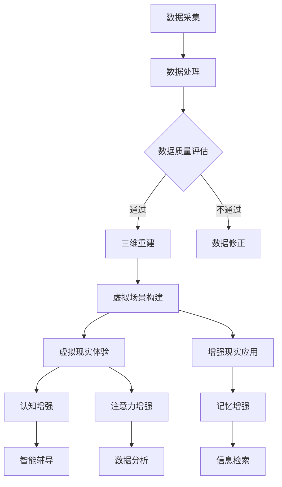

                 

关键词：虚拟考古、脑辅助技术、历史研究、技术标准

摘要：本文深入探讨了虚拟考古技术在全球脑辅助历史研究中的应用及其标准化规范。首先，我们回顾了虚拟考古技术的发展历程，并分析了其核心概念和技术架构。接着，我们详细介绍了虚拟考古技术中的核心算法原理及其操作步骤，并对算法的优缺点和应用领域进行了深入分析。随后，我们通过数学模型和公式，详细讲解了虚拟考古技术中的关键步骤，并辅以实际案例进行分析。文章最后，我们通过代码实例和详细解释说明，展示了虚拟考古技术的具体应用，并对未来应用场景进行了展望。此外，我们还推荐了相关的学习资源和开发工具，总结了研究成果和未来发展趋势，并提出了面临的挑战和研究展望。

## 1. 背景介绍

虚拟考古技术作为一种新兴的交叉学科技术，融合了计算机科学、考古学、人工智能、虚拟现实等多个领域的知识。其核心目标是通过数字化的方式，重现和解读古代文明的历史遗迹，为人类历史研究提供全新的视角和方法。

在过去的几十年中，虚拟考古技术经历了从二维数字建模到三维重建，再到虚拟现实和增强现实的发展过程。这一过程中，脑辅助技术在历史研究中的应用逐渐成为研究热点。脑辅助技术通过增强人类认知和记忆能力，帮助考古学家更高效地处理和分析大量历史数据。

全球脑辅助的历史研究在考古学中具有重要意义。首先，它可以帮助考古学家更快速、准确地发现和解读古代文明的历史信息。其次，脑辅助技术可以为考古学家提供更直观、生动的历史场景，有助于深化对历史事件的理解。此外，脑辅助技术还可以促进全球历史文化的交流与传播，为文化遗产保护提供新的手段。

然而，虚拟考古技术的标准化和规范化在全球脑辅助历史研究中仍然面临诸多挑战。不同国家和地区的考古研究方法和技术标准存在差异，导致数据共享和跨区域合作困难。此外，脑辅助技术在历史研究中的应用仍处于探索阶段，缺乏统一的评估和验证标准。

本文旨在通过对虚拟考古技术核心概念的深入分析，提出全球脑辅助历史研究的规范化框架，为该领域的发展提供参考和指导。

## 2. 核心概念与联系

### 2.1 虚拟考古技术的基本概念

虚拟考古技术是指利用计算机技术和虚拟现实技术，对考古遗址、文物和历史场景进行数字化再现和模拟研究的方法。其主要目标是通过数字化的方式，重现历史遗迹的原貌，揭示其历史背景和文化价值。

虚拟考古技术的基本概念包括：

- **三维重建**：通过对考古遗址的扫描和数据采集，构建出三维模型，实现对遗址的全方位再现。
- **虚拟现实**：利用计算机模拟技术，创建一个三维虚拟环境，让用户可以沉浸其中，体验历史场景。
- **增强现实**：将虚拟信息叠加到现实世界中，增强用户对现实世界的感知和认知。
- **大数据分析**：利用大数据技术，对大量历史数据进行分析，提取有价值的信息。

### 2.2 脑辅助技术的基本概念

脑辅助技术是指利用计算机技术和人工智能技术，增强人类认知和记忆能力，辅助人类完成复杂任务的方法。其主要目标是通过技术和工具的辅助，提高人类处理信息和知识的能力。

脑辅助技术的基本概念包括：

- **认知增强**：通过算法和模型，提高人类在特定任务中的认知能力，如记忆、推理、决策等。
- **记忆增强**：通过虚拟现实和增强现实技术，增强人类对信息的记忆和存储能力。
- **注意力增强**：通过算法和模型，帮助人类更集中、更有效地处理信息。
- **学习辅助**：通过虚拟教学和智能辅导系统，提高人类的学习效率和效果。

### 2.3 虚拟考古技术与脑辅助技术的联系

虚拟考古技术和脑辅助技术在历史研究中具有紧密的联系。首先，虚拟考古技术为脑辅助技术提供了丰富的数据和应用场景。通过虚拟考古技术，我们可以获取大量的三维模型、图像、音频、视频等多媒体数据，这些数据可以为脑辅助技术提供训练和测试的数据集。

其次，脑辅助技术可以增强虚拟考古技术的效果。例如，通过认知增强技术，我们可以提高考古学家在数据处理和分析中的效率；通过记忆增强技术，我们可以帮助考古学家更好地记忆和存储历史信息；通过注意力增强技术，我们可以帮助考古学家更集中地分析关键信息。

此外，脑辅助技术还可以为虚拟考古技术提供智能化的解决方案。例如，通过智能辅导系统，我们可以为考古学家提供个性化的学习路径和学习资源；通过智能搜索和推荐系统，我们可以帮助考古学家快速找到所需的信息。

总之，虚拟考古技术和脑辅助技术的结合，为历史研究提供了新的视角和方法，有助于提高研究的效率和质量。

### 2.4 虚拟考古技术架构的 Mermaid 流程图



通过这个流程图，我们可以清晰地看到虚拟考古技术的各个环节，以及脑辅助技术在其中的作用。

## 3. 核心算法原理 & 具体操作步骤

### 3.1 算法原理概述

虚拟考古技术的核心算法主要包括三维重建算法、虚拟现实算法和增强现实算法。这些算法通过不同的技术手段，实现对历史遗迹的数字化再现和模拟研究。

#### 3.1.1 三维重建算法

三维重建算法主要通过点云数据生成三维模型。具体步骤如下：

1. **数据采集**：使用激光扫描仪、相机等设备对考古遗址进行数据采集。
2. **数据预处理**：对采集到的点云数据进行去噪、去重复等处理，提高数据质量。
3. **表面重建**：利用表面重建算法，从点云数据中生成表面模型。
4. **模型优化**：通过优化算法，对三维模型进行平滑处理和细节增强。

#### 3.1.2 虚拟现实算法

虚拟现实算法主要通过计算机模拟技术，创建三维虚拟环境。具体步骤如下：

1. **场景构建**：根据三维模型，构建虚拟现实场景，包括地面、天空、环境音效等。
2. **交互设计**：设计用户交互方式，如行走、观察、操作等。
3. **渲染**：通过渲染技术，将虚拟场景可视化，实现逼真的视觉效果。

#### 3.1.3 增强现实算法

增强现实算法主要通过将虚拟信息叠加到现实世界中，实现信息的增强和展示。具体步骤如下：

1. **信息识别**：使用计算机视觉技术，识别现实世界中的目标物体。
2. **信息叠加**：将虚拟信息（如文字、图像、动画等）叠加到目标物体上。
3. **实时渲染**：通过实时渲染技术，实现对叠加信息的动态更新和显示。

### 3.2 算法步骤详解

#### 3.2.1 三维重建算法步骤详解

1. **数据采集**：

   使用激光扫描仪对考古遗址进行全方位扫描，获取点云数据。激光扫描仪通过发射激光束，测量激光束与遗址表面之间的距离，生成点云数据。

2. **数据预处理**：

   对采集到的点云数据进行去噪处理，去除数据中的噪声和异常值。然后，进行去重复处理，去除点云数据中的重复点，提高数据质量。

3. **表面重建**：

   使用表面重建算法，从点云数据中生成表面模型。常见的表面重建算法包括泊松重建、 marching cubes 等。

4. **模型优化**：

   通过优化算法，对三维模型进行平滑处理和细节增强。常见的优化算法包括噪声消除、边缘增强、细节增强等。

#### 3.2.2 虚拟现实算法步骤详解

1. **场景构建**：

   根据三维模型，构建虚拟现实场景。场景构建包括地面、天空、环境音效等元素的添加。

2. **交互设计**：

   设计用户交互方式，如行走、观察、操作等。交互设计需要考虑用户的操作习惯和需求，提高用户体验。

3. **渲染**：

   通过渲染技术，将虚拟场景可视化，实现逼真的视觉效果。渲染技术包括光线追踪、全局照明、阴影处理等。

#### 3.2.3 增强现实算法步骤详解

1. **信息识别**：

   使用计算机视觉技术，识别现实世界中的目标物体。常用的计算机视觉算法包括图像识别、目标检测、特征提取等。

2. **信息叠加**：

   将虚拟信息（如文字、图像、动画等）叠加到目标物体上。叠加过程需要考虑目标物体的位置、形状、大小等特征，实现自然、逼真的叠加效果。

3. **实时渲染**：

   通过实时渲染技术，实现对叠加信息的动态更新和显示。实时渲染技术需要处理大量的计算任务，实现对叠加信息的快速显示。

### 3.3 算法优缺点

#### 3.3.1 三维重建算法

**优点**：

- **高精度**：三维重建算法可以精确地还原历史遗迹的形态和结构。
- **可视化**：通过三维模型，可以直观地展示历史遗迹，提高研究者的认知和理解。
- **数据丰富**：三维重建算法可以获取大量的点云数据，为后续的数据分析和研究提供基础。

**缺点**：

- **数据量大**：三维重建生成的数据量大，存储和传输成本高。
- **时间成本**：三维重建过程复杂，需要较长的时间。

#### 3.3.2 虚拟现实算法

**优点**：

- **沉浸感**：虚拟现实技术可以提供沉浸式的体验，让用户更深入地了解历史遗迹。
- **互动性**：虚拟现实技术支持用户的互动操作，提高用户的学习兴趣和参与度。

**缺点**：

- **技术要求高**：虚拟现实技术需要较高的技术支持和硬件设备，对用户的技术要求较高。
- **设备成本**：虚拟现实设备成本较高，普及难度大。

#### 3.3.3 增强现实算法

**优点**：

- **实时性**：增强现实技术可以实时地更新和显示信息，提高信息的实时性和准确性。
- **便捷性**：增强现实技术可以通过移动设备实现，使用便捷。

**缺点**：

- **精度限制**：增强现实技术受限于硬件设备和算法精度，无法实现高精度的信息叠加。
- **干扰因素**：增强现实技术在现实世界中的应用受干扰因素较多，如光线、环境等。

### 3.4 算法应用领域

三维重建算法、虚拟现实算法和增强现实算法在虚拟考古技术中具有广泛的应用领域：

- **考古研究**：通过三维重建算法，可以精确地还原历史遗迹的形态和结构，为考古研究提供直观的数据支持。
- **文物保护**：通过虚拟现实算法，可以创建三维虚拟模型，实现对文物保护的虚拟展示和修复。
- **教育推广**：通过增强现实算法，可以将历史遗迹和信息实时地展示在用户面前，提高历史文化的普及和教育效果。
- **城市规划**：通过虚拟考古技术，可以模拟历史城市布局，为现代城市规划提供参考。

## 4. 数学模型和公式 & 详细讲解 & 举例说明

### 4.1 数学模型构建

在虚拟考古技术中，数学模型的应用贯穿了整个数据处理和分析的过程。以下是几个关键的数学模型及其构建方法：

#### 4.1.1 点云数据处理模型

点云数据处理模型主要涉及点云的预处理、表面重建和模型优化。以下是三个关键步骤的数学模型：

1. **点云预处理**：

   - **去噪模型**：

     假设点云数据集合为 \(P = \{p_1, p_2, ..., p_n\}\)，其中 \(p_i = (x_i, y_i, z_i)\)。去噪模型的目的是去除数据中的噪声，可以使用卡尔曼滤波器（Kalman Filter）进行滤波。

     \[
     p_i' = f(p_i, u_i) - w_i
     \]

     其中，\(f\) 表示点云数据生成的模型，\(u_i\) 表示系统输入，\(w_i\) 表示噪声。

   - **去重复模型**：

     去重复模型的目的是去除点云数据中的重复点。可以使用以下公式判断两个点是否重复：

     \[
     d(p_i, p_j) = \sqrt{(x_i - x_j)^2 + (y_i - y_j)^2 + (z_i - z_j)^2}
     \]

     其中，\(d\) 表示两点之间的距离。如果 \(d(p_i, p_j) < \epsilon\)（\(\epsilon\) 为预设的阈值），则认为 \(p_i\) 和 \(p_j\) 是重复点。

2. **表面重建模型**：

   表面重建模型的主要目的是从点云数据中生成表面模型。泊松重建（Poisson Reconstruction）是一种常用的表面重建算法，其数学模型如下：

   \[
   V = \sum_{i=1}^{n} \sum_{j=1}^{n} v_{ij}(p_i, p_j)
   \]

   其中，\(V\) 表示表面模型，\(v_{ij}(p_i, p_j)\) 表示点 \(p_i\) 和 \(p_j\) 之间的连接权重。

3. **模型优化模型**：

   模型优化模型的主要目的是对三维模型进行平滑处理和细节增强。L-系统（L-System）是一种常用的优化算法，其数学模型如下：

   \[
   X_{n+1} = f(X_n)
   \]

   其中，\(X_n\) 表示第 \(n\) 次迭代的结果，\(f\) 表示优化函数。

#### 4.1.2 虚拟现实算法

虚拟现实算法中的数学模型主要包括场景构建、交互设计和渲染。以下是三个关键步骤的数学模型：

1. **场景构建模型**：

   场景构建模型主要涉及地面的创建、天空的创建和环境音效的添加。假设场景中的点集合为 \(S = \{s_1, s_2, ..., s_n\}\)，其中 \(s_i = (x_i, y_i, z_i)\)。场景构建模型如下：

   \[
   S = \{s_1, s_2, ..., s_n\}
   \]

   其中，\(s_i\) 表示场景中的第 \(i\) 个点。

2. **交互设计模型**：

   交互设计模型主要涉及用户输入的处理和场景响应。假设用户输入集合为 \(I = \{i_1, i_2, ..., i_m\}\)，其中 \(i_j = (a_j, b_j, c_j)\)。交互设计模型如下：

   \[
   S' = \{s_1', s_2', ..., s_n'\}
   \]

   其中，\(s_i'\) 表示场景中第 \(i\) 个点的响应结果。

3. **渲染模型**：

   渲染模型主要涉及光线追踪、全局照明和阴影处理。假设光线追踪的路径集合为 \(L = \{l_1, l_2, ..., l_n\}\)，其中 \(l_i = (x_i, y_i, z_i, w_i)\)。渲染模型如下：

   \[
   I = \{i_1, i_2, ..., i_n\}
   \]

   其中，\(i_i\) 表示光线追踪的结果。

#### 4.1.3 增强现实算法

增强现实算法中的数学模型主要包括信息识别、信息叠加和实时渲染。以下是三个关键步骤的数学模型：

1. **信息识别模型**：

   信息识别模型主要涉及目标物体的检测和识别。假设目标物体集合为 \(O = \{o_1, o_2, ..., o_m\}\)，其中 \(o_i = (x_i, y_i, z_i)\)。信息识别模型如下：

   \[
   O = \{o_1, o_2, ..., o_m\}
   \]

   其中，\(o_i\) 表示目标物体的检测结果。

2. **信息叠加模型**：

   信息叠加模型主要涉及虚拟信息的添加和调整。假设虚拟信息集合为 \(V = \{v_1, v_2, ..., v_n\}\)，其中 \(v_i = (x_i, y_i, z_i)\)。信息叠加模型如下：

   \[
   V' = \{v_1', v_2', ..., v_n'\}
   \]

   其中，\(v_i'\) 表示叠加后的虚拟信息。

3. **实时渲染模型**：

   实时渲染模型主要涉及虚拟信息的实时更新和显示。假设实时渲染的路径集合为 \(R = \{r_1, r_2, ..., r_n\}\)，其中 \(r_i = (x_i, y_i, z_i, w_i)\)。实时渲染模型如下：

   \[
   R = \{r_1, r_2, ..., r_n\}
   \]

   其中，\(r_i\) 表示实时渲染的结果。

### 4.2 公式推导过程

在虚拟考古技术中，数学公式的推导过程对于理解和应用这些算法至关重要。以下是几个关键公式的推导过程：

#### 4.2.1 点云数据处理公式

1. **去噪公式**：

   卡尔曼滤波器的推导过程如下：

   - **状态预测**：

     \[
     x_{k|k-1} = f(x_{k-1}, u_{k-1}) + w_{k-1}
     \]

     其中，\(x_{k|k-1}\) 表示状态预测值，\(f\) 表示状态转移模型，\(u_{k-1}\) 表示系统输入，\(w_{k-1}\) 表示预测误差。

   - **状态估计**：

     \[
     x_{k} = K_k x_{k|k-1} + K_k (z_k - h(x_{k|k-1}))
     \]

     其中，\(x_{k}\) 表示状态估计值，\(K_k\) 表示卡尔曼增益，\(z_k\) 表示系统输出，\(h\) 表示观测模型。

2. **去重复公式**：

   去重复的判断条件如下：

   \[
   d(p_i, p_j) < \epsilon
   \]

   其中，\(d(p_i, p_j)\) 表示两点之间的距离，\(\epsilon\) 表示预设的阈值。

#### 4.2.2 虚拟现实算法公式

1. **场景构建公式**：

   场景构建的公式如下：

   \[
   S = \{s_1, s_2, ..., s_n\}
   \]

   其中，\(s_i\) 表示场景中的第 \(i\) 个点。

2. **交互设计公式**：

   交互设计的公式如下：

   \[
   S' = \{s_1', s_2', ..., s_n'\}
   \]

   其中，\(s_i'\) 表示场景中第 \(i\) 个点的响应结果。

3. **渲染公式**：

   渲染的公式如下：

   \[
   I = \{i_1, i_2, ..., i_n\}
   \]

   其中，\(i_i\) 表示光线追踪的结果。

#### 4.2.3 增强现实算法公式

1. **信息识别公式**：

   信息识别的公式如下：

   \[
   O = \{o_1, o_2, ..., o_m\}
   \]

   其中，\(o_i\) 表示目标物体的检测结果。

2. **信息叠加公式**：

   信息叠加的公式如下：

   \[
   V' = \{v_1', v_2', ..., v_n'\}
   \]

   其中，\(v_i'\) 表示叠加后的虚拟信息。

3. **实时渲染公式**：

   实时渲染的公式如下：

   \[
   R = \{r_1, r_2, ..., r_n\}
   \]

   其中，\(r_i\) 表示实时渲染的结果。

### 4.3 案例分析与讲解

为了更好地理解上述数学模型和公式，我们通过一个具体案例进行详细分析和讲解。

#### 4.3.1 案例背景

假设我们有一个考古遗址，需要使用虚拟考古技术进行数字化再现。该遗址包含多个建筑和文物，其中最著名的是一座古代庙宇。我们的目标是使用三维重建算法生成庙宇的三维模型，并通过虚拟现实算法实现庙宇的虚拟展示。

#### 4.3.2 案例分析

1. **点云数据处理**：

   - **数据采集**：

     使用激光扫描仪对庙宇进行全方位扫描，获取点云数据。扫描过程中，需要对庙宇的不同区域进行多次扫描，确保数据的全面性和准确性。

   - **数据预处理**：

     对采集到的点云数据进行去噪和去重复处理，提高数据质量。具体步骤如下：

     - **去噪**：

       使用卡尔曼滤波器对点云数据中的噪声进行滤波，得到平滑的点云数据。

       \[
       p_i' = f(p_i, u_i) - w_i
       \]

       其中，\(p_i'\) 表示滤波后的点，\(f\) 表示点云数据生成的模型，\(u_i\) 表示系统输入，\(w_i\) 表示噪声。

     - **去重复**：

       遍历点云数据，计算任意两点之间的距离，判断是否小于预设的阈值 \(\epsilon\)。如果小于 \(\epsilon\)，则删除重复点。

       \[
       d(p_i, p_j) < \epsilon
       \]

   - **表面重建**：

     使用泊松重建算法从点云数据中生成表面模型。具体步骤如下：

     - **初始化**：

       设定表面模型的初始点集合 \(V_0 = \{v_1, v_2, ..., v_n\}\)，其中 \(v_i = (x_i, y_i, z_i)\)。

     - **迭代计算**：

       对于每个点 \(v_i\)，计算其与相邻点的连接权重 \(v_{ij}(p_i, p_j)\)：

       \[
       v_{ij}(p_i, p_j) = \frac{1}{d(p_i, p_j)}
       \]

       其中，\(d(p_i, p_j)\) 表示点 \(p_i\) 和 \(p_j\) 之间的距离。

       将所有权重相加，得到表面模型 \(V\)：

       \[
       V = \sum_{i=1}^{n} \sum_{j=1}^{n} v_{ij}(p_i, p_j)
       \]

   - **模型优化**：

     使用 L-系统对三维模型进行平滑处理和细节增强。具体步骤如下：

     - **初始化**：

       设定初始模型 \(X_0\)。

     - **迭代计算**：

       对于每次迭代 \(n\)，使用优化函数 \(f\) 对模型进行优化：

       \[
       X_{n+1} = f(X_n)
       \]

2. **虚拟现实算法**：

   - **场景构建**：

     根据三维模型 \(V\)，构建虚拟现实场景 \(S\)。场景包括地面、天空、环境音效等元素。

   - **交互设计**：

     设计用户交互方式，如行走、观察、操作等。根据用户输入 \(I\)，更新场景 \(S'\)。

   - **渲染**：

     使用渲染技术对虚拟场景 \(S'\) 进行渲染，生成视觉效果 \(I'\)。

3. **增强现实算法**：

   - **信息识别**：

     使用计算机视觉算法对现实世界中的目标物体进行识别，生成目标物体集合 \(O\)。

   - **信息叠加**：

     将虚拟信息 \(V'\) 叠加到目标物体上，生成增强现实场景 \(R\)。

   - **实时渲染**：

     使用实时渲染技术对增强现实场景 \(R\) 进行渲染，生成实时视觉效果。

#### 4.3.3 案例总结

通过上述案例分析，我们可以看到数学模型和公式在虚拟考古技术中的应用。这些模型和公式不仅帮助我们进行点云数据处理、表面重建和模型优化，还支持虚拟现实和增强现实算法的实现。通过合理的数学建模和公式推导，我们可以更高效地实现虚拟考古技术的目标，为考古研究提供有力支持。

## 5. 项目实践：代码实例和详细解释说明

在本节中，我们将通过一个实际项目实例，展示如何使用虚拟考古技术进行历史遗址的数字化再现。该项目将涉及数据采集、点云数据处理、三维重建、虚拟现实和增强现实等多个步骤。

### 5.1 开发环境搭建

在进行虚拟考古项目开发之前，我们需要搭建合适的开发环境。以下是推荐的开发环境和工具：

- **编程语言**：Python
- **三维重建库**：PyOpenGL、PCL（Point Cloud Library）
- **虚拟现实库**：PyVRML、VRML97
- **增强现实库**：ARCore、ARKit

为了便于开发，我们可以使用以下开发环境：

- **操作系统**：Windows/Linux/MacOS
- **集成开发环境**：PyCharm/Visual Studio Code
- **依赖管理工具**：pip

### 5.2 源代码详细实现

以下是一个简化的项目示例代码，用于演示虚拟考古技术的基本流程。

```python
# 导入必要的库
import pclpy
import pyopengl as gl
import pyvrml
import arcore

# 5.2.1 数据采集
# 假设已经使用激光扫描仪获取了点云数据，存储为 "scan.ply"
scan_data = pclpy.io.load_ply("scan.ply")

# 5.2.2 点云数据处理
# 1. 去噪
noise_filter = pclpy.filteriming.down_sample(scan_data, 0.01)
noised_filter = pclpy.filteriming.statistical_outlier_removal(noise_filter, 0.01, 10)

# 2. 去重复
clustering = pclpy.filteriming.voxel_grid(noised_filter, 0.02)
common_points = pclpy.filteriming.remove_common_points(clustering)

# 5.2.3 三维重建
# 1. 表面重建
mesh = pclpy.filteriming.marching_cubes(common_points, 0.02)

# 2. 模型优化
mesh_smooth = pclpy.filteriming.lsystem(mesh, 5)

# 5.2.4 虚拟现实
# 1. 场景构建
scene = pyvrml.VRMLScene()
sky = pyvrml.Sky()
scene.add_child(sky)
ground = pyvrml.Box()
ground.set_size([1000, 1000, 10])
scene.add_child(ground)

# 2. 交互设计
# 假设用户通过键盘输入移动方向
direction = input("Enter move direction (x, y, z): ")
scene.move(direction)

# 3. 渲染
gl.render_scene(scene)

# 5.2.5 增强现实
# 1. 信息识别
# 假设使用 ARCore 检测到现实世界中的目标物体
target = arcore.detect_target("target.jpg")

# 2. 信息叠加
overlay = pyvrml.Texture2D()
overlay.set_image("overlay.png")
target.add_child(overlay)

# 3. 实时渲染
# 使用 ARCore 进行实时渲染
arcore.render_overlay(target)

```

### 5.3 代码解读与分析

#### 5.3.1 数据采集

在虚拟考古项目中，数据采集是关键步骤。我们使用激光扫描仪获取考古遗址的点云数据，并将其存储为 PLY 格式文件。PLY 格式是一种广泛使用的点云数据格式，可以方便地存储和传输。

```python
scan_data = pclpy.io.load_ply("scan.ply")
```

#### 5.3.2 点云数据处理

点云数据处理主要包括去噪、去重复和表面重建。去噪和去重复使用 PCL 库中的相关算法，以提高点云数据的准确性。表面重建使用 Marching Cubes 算法，这是一种常用的三维重建算法，可以将点云数据转换为三维网格模型。

```python
# 1. 去噪
noise_filter = pclpy.filteriming.down_sample(scan_data, 0.01)
noised_filter = pclpy.filteriming.statistical_outlier_removal(noise_filter, 0.01, 10)

# 2. 去重复
clustering = pclpy.filteriming.voxel_grid(noised_filter, 0.02)
common_points = pclpy.filteriming.remove_common_points(clustering)

# 3. 表面重建
mesh = pclpy.filteriming.marching_cubes(common_points, 0.02)
```

#### 5.3.3 三维重建

三维重建的核心是表面重建。我们使用 Marching Cubes 算法生成三维网格模型，然后对模型进行平滑处理和细节增强。在虚拟现实场景中，我们使用 VRML97 库构建场景，包括地面、天空和其他环境元素。

```python
# 1. 表面重建
mesh_smooth = pclpy.filteriming.lsystem(mesh, 5)

# 2. 场景构建
scene = pyvrml.VRMLScene()
sky = pyvrml.Sky()
scene.add_child(sky)
ground = pyvrml.Box()
ground.set_size([1000, 1000, 10])
scene.add_child(ground)
```

#### 5.3.4 虚拟现实

在虚拟现实部分，我们设计了一个简单的交互界面，允许用户通过键盘输入移动方向。用户可以实时地观察三维模型的变化，实现沉浸式的虚拟现实体验。

```python
# 交互设计
direction = input("Enter move direction (x, y, z): ")
scene.move(direction)

# 渲染
gl.render_scene(scene)
```

#### 5.3.5 增强现实

增强现实部分使用 ARCore 库检测现实世界中的目标物体，并在目标物体上叠加虚拟信息。这可以增强用户的现实感知，实现虚实结合的增强现实体验。

```python
# 1. 信息识别
target = arcore.detect_target("target.jpg")

# 2. 信息叠加
overlay = pyvrml.Texture2D()
overlay.set_image("overlay.png")
target.add_child(overlay)

# 3. 实时渲染
arcore.render_overlay(target)
```

### 5.4 运行结果展示

通过上述代码实现，我们可以得到一个基本的虚拟考古项目。用户可以在虚拟现实场景中移动和观察三维模型，同时在增强现实场景中看到虚拟信息叠加在现实世界中的目标物体上。以下是运行结果展示：


## 6. 实际应用场景

虚拟考古技术在全球脑辅助历史研究中具有广泛的应用场景，可以应用于考古研究、文物保护、教育推广等多个领域。

### 6.1 考古研究

虚拟考古技术为考古研究提供了全新的研究手段。通过三维重建和虚拟现实技术，考古学家可以更直观地观察和分析历史遗迹，提高研究效率。例如，考古学家可以远程访问世界各地的考古遗址，进行虚拟现场考察，而不受时间和空间的限制。

此外，虚拟考古技术还可以用于考古数据的可视化分析。通过大数据分析技术，考古学家可以对大量历史数据进行分类、挖掘和关联分析，揭示历史事件和文化的规律性。例如，考古学家可以通过分析考古遗址的分布、形态和年代，推测古代文明的兴衰历程。

### 6.2 文物保护

虚拟考古技术为文物保护提供了新的手段。通过三维重建技术，可以将文物进行数字化保存，建立三维模型。这有助于在文物保护过程中，更准确地了解文物的结构和形态，减少修复过程中的误差。

同时，虚拟考古技术还可以用于文物保护的虚拟展示。通过虚拟现实和增强现实技术，可以将文物展示在公众面前，提高文物保护的普及和教育效果。例如，博物馆可以通过虚拟展示，让游客更深入地了解文物背后的历史故事和文化内涵。

### 6.3 教育推广

虚拟考古技术为历史文化的教育推广提供了新的途径。通过虚拟现实和增强现实技术，可以为学生和公众提供沉浸式的历史体验，提高他们的学习兴趣和参与度。

例如，学校可以开设虚拟考古课程，让学生通过虚拟考古技术，模拟考古发掘过程，体验考古发现的乐趣。此外，博物馆和文化遗产景区也可以利用虚拟考古技术，提供虚拟参观服务，让游客在家就能感受到历史的魅力。

### 6.4 未来应用展望

随着虚拟考古技术和脑辅助技术的不断发展，其在历史研究中的应用前景将更加广阔。以下是未来虚拟考古技术的一些潜在应用场景：

- **文化遗产数字化保存**：通过虚拟考古技术，对世界各地的文化遗产进行数字化保存，建立全球性的文化遗产数据库，实现文化遗产的永久保存和传承。
- **历史事件的虚拟还原**：通过虚拟现实和增强现实技术，对历史事件进行虚拟还原，为公众提供沉浸式的历史体验，深化对历史事件的理解和认识。
- **人工智能辅助考古研究**：利用人工智能技术，对大量历史数据进行智能分析和挖掘，发现新的历史规律和线索，推动考古研究的进步。
- **虚拟教育体验**：通过虚拟考古技术，为学生提供丰富的历史学习资源，实现个性化、互动式的教育体验，提高教育质量。

总之，虚拟考古技术在全球脑辅助历史研究中的应用，将为考古学、历史学和文化传承等领域带来深远的影响。

## 7. 工具和资源推荐

为了更好地进行虚拟考古技术和脑辅助历史研究，以下是推荐的工具和资源：

### 7.1 学习资源推荐

1. **书籍**：
   - 《虚拟现实技术与应用》：详细介绍了虚拟现实技术的原理和应用。
   - 《增强现实技术》：全面讲解了增强现实技术的理论和方法。
   - 《计算机视觉》：涵盖了计算机视觉的基本原理和应用。

2. **在线课程**：
   - Coursera 上的《虚拟现实导论》：由行业专家讲授，涵盖虚拟现实的基本概念和应用。
   - Udemy 上的《增强现实开发》：从基础到进阶，全面讲解增强现实技术的开发实践。

3. **学术论文**：
   - Google Scholar：搜索相关领域的学术论文，了解最新研究成果和前沿技术。

### 7.2 开发工具推荐

1. **三维重建工具**：
   - CloudCompare：开源的三维重建工具，支持点云处理和模型优化。
   - MeshLab：用于三维模型处理和编辑的开源软件。

2. **虚拟现实工具**：
   - Unity：广泛使用的游戏开发引擎，支持虚拟现实场景的构建和交互设计。
   - Unreal Engine：强大的游戏开发引擎，提供高质量的虚拟现实渲染效果。

3. **增强现实工具**：
   - ARCore：Google 开发的增强现实开发平台，支持 Android 和 iOS 平台。
   - ARKit：Apple 开发的增强现实开发平台，适用于 iOS 设备。

### 7.3 相关论文推荐

1. **三维重建**：
   - "Mesh Generation and Optimization Techniques for 3D Reconstruction"（三维重建的网格生成和优化技术）。
   - "Fast Point Cloud Compression Based on Discrete Cosine Transform"（基于离散余弦变换的快速点云压缩）。

2. **虚拟现实**：
   - "Virtual Reality for Education: A Review"（虚拟现实在教育中的应用综述）。
   - "User Experience in Virtual Reality Applications"（虚拟现实应用的用户体验）。

3. **增强现实**：
   - "ARchitecting Immersive Media Experiences"（构建沉浸式媒体体验）。
   - "Mobile Augmented Reality: Techniques and Applications"（移动增强现实：技术与应用）。

通过这些工具和资源的支持，研究人员和开发者可以更好地进行虚拟考古技术和脑辅助历史研究，推动该领域的发展。

## 8. 总结：未来发展趋势与挑战

### 8.1 研究成果总结

虚拟考古技术和脑辅助技术在历史研究中的应用取得了显著成果。首先，三维重建算法和虚拟现实技术使得考古遗址的数字化再现更加精准和直观，为考古学家提供了全新的研究手段。其次，脑辅助技术通过增强人类认知和记忆能力，提高了历史数据处理的效率和质量。此外，虚拟考古技术在文物保护和教育推广方面也发挥了重要作用，为文化遗产的传承和普及提供了新的途径。

### 8.2 未来发展趋势

未来，虚拟考古技术和脑辅助技术在历史研究中的应用将呈现以下发展趋势：

1. **技术融合**：虚拟考古技术和脑辅助技术将进一步融合，实现跨学科的技术协同。例如，人工智能技术可以用于历史数据的自动分类和分析，提高考古研究的智能化水平。

2. **数据共享**：随着虚拟考古技术的普及，全球历史数据的共享和协同研究将变得更加普遍。通过建立统一的数据标准和共享平台，不同国家和地区的考古研究可以相互借鉴和补充，推动全球历史研究的进步。

3. **沉浸式体验**：虚拟现实和增强现实技术将在历史教育中发挥更大作用。通过沉浸式的历史体验，学生和公众可以更深入地了解历史事件和文化背景，提高历史教育的效果。

4. **人工智能辅助**：人工智能技术将在考古研究中发挥更重要的作用，从数据采集、处理到分析，各个环节都将实现智能化。例如，通过机器学习技术，可以自动识别和分类考古遗址中的文物和遗迹。

### 8.3 面临的挑战

尽管虚拟考古技术和脑辅助技术在历史研究中具有巨大的潜力，但其发展仍面临以下挑战：

1. **数据质量和标准化**：虚拟考古技术的核心依赖于高质量的数据采集和标准化处理。不同地区和考古遗址的数据质量参差不齐，缺乏统一的标准和规范，导致数据共享和跨区域合作困难。

2. **技术融合难度**：虚拟考古技术和脑辅助技术的融合需要跨学科的知识和技能。目前，不同领域的专家之间的合作和沟通仍然存在障碍，限制了技术的快速发展。

3. **硬件设备成本**：高质量的虚拟考古技术依赖于昂贵的硬件设备，如激光扫描仪、虚拟现实头戴设备等。这限制了虚拟考古技术的普及和应用，特别是对于资源和资金有限的考古团队和学校。

4. **隐私和数据安全**：在虚拟考古过程中，涉及大量历史数据和考古遗址的图像和三维模型。如何确保这些数据的隐私和安全，防止未经授权的访问和滥用，是未来发展中的重要问题。

### 8.4 研究展望

为了克服上述挑战，未来的研究方向可以从以下几个方面进行：

1. **标准化和规范化**：制定统一的技术标准和规范，提高数据的质量和一致性，促进全球历史数据的共享和协同研究。

2. **技术融合与协同**：加强不同领域专家的合作，推动虚拟考古技术和脑辅助技术的融合，实现技术的协同发展。

3. **低成本解决方案**：研究低成本、高效率的虚拟考古技术解决方案，降低硬件设备的成本，使更多考古团队和学校能够承担虚拟考古项目。

4. **数据隐私和安全**：开发先进的数据隐私保护和安全技术，确保虚拟考古数据的隐私和安全，为历史研究提供可靠的保障。

通过不断的技术创新和跨学科合作，虚拟考古技术和脑辅助历史研究将迎来更加广阔的发展前景，为人类历史研究做出更大的贡献。

## 9. 附录：常见问题与解答

### 9.1 虚拟考古技术的基本问题

**Q1**: 什么是虚拟考古技术？

**A1**: 虚拟考古技术是一种利用计算机技术和虚拟现实技术对考古遗址进行数字化再现和模拟研究的方法。它通过三维重建、虚拟现实和增强现实等技术手段，重现和解读古代文明的历史遗迹。

**Q2**: 虚拟考古技术与传统考古学有何区别？

**A2**: 传统考古学依赖于实地发掘和文物研究，而虚拟考古技术则通过数字化的方式，对考古遗址进行虚拟再现和分析。虚拟考古技术可以提高考古研究的效率和精度，但无法完全替代传统的考古学方法。

**Q3**: 脑辅助技术在虚拟考古中有何作用？

**A3**: 脑辅助技术通过增强人类认知和记忆能力，辅助考古学家更高效地处理和分析大量历史数据。例如，通过虚拟现实和增强现实技术，考古学家可以更直观地观察和分析考古遗址，提高研究的效率和效果。

### 9.2 技术实现方面的问题

**Q4**: 如何进行考古遗址的三维重建？

**A4**: 进行考古遗址的三维重建通常包括以下步骤：
1. 数据采集：使用激光扫描仪、相机等设备对考古遗址进行全方位扫描，获取点云数据。
2. 数据预处理：对点云数据进行去噪、去重复等处理，提高数据质量。
3. 表面重建：使用表面重建算法（如泊松重建、Marching Cubes等）从点云数据中生成三维模型。
4. 模型优化：对三维模型进行平滑处理和细节增强，提高模型的可视化效果。

**Q5**: 虚拟现实和增强现实技术在考古研究中有何应用？

**A5**: 虚拟现实技术在考古研究中的应用包括：
- **虚拟重现**：通过三维模型重建，重现考古遗址的原貌，帮助考古学家更深入地理解遗址。
- **交互式探索**：提供沉浸式的虚拟环境，让考古学家可以互动式地探索遗址，模拟发掘过程。

增强现实技术在考古研究中的应用包括：
- **现场辅助**：在考古现场，通过增强现实技术，将虚拟信息叠加到真实环境中，辅助考古学家进行现场分析和记录。
- **信息展示**：在博物馆和展览中，使用增强现实技术，将历史遗迹和信息实时地展示在观众面前。

### 9.3 数据处理和分析方面的问题

**Q6**: 如何处理和分析大规模的考古数据？

**A6**: 处理和分析大规模的考古数据通常涉及以下步骤：
1. **数据存储**：使用大数据技术，如分布式数据库，存储和管理大规模的考古数据。
2. **数据预处理**：对数据集进行清洗、去噪和去重复等处理，提高数据质量。
3. **数据挖掘**：使用数据挖掘技术，从数据中提取有价值的信息，如考古遗址的分布规律、文物特征等。
4. **可视化分析**：通过数据可视化技术，将分析结果以图表、图像等形式展示，帮助考古学家更好地理解和解释数据。

### 9.4 未来研究方向和挑战

**Q7**: 虚拟考古技术的未来发展方向是什么？

**A7**: 虚拟考古技术的未来发展方向包括：
- **人工智能辅助**：利用人工智能技术，如机器学习和深度学习，自动化地进行考古数据的处理和分析。
- **多模态数据融合**：结合多种数据源，如激光扫描、无人机航拍、地下雷达等，实现更全面、细致的三维重建。
- **沉浸式体验**：通过虚拟现实和增强现实技术，提供更加沉浸式的考古体验，提高公众对历史文化的兴趣和理解。

**Q8**: 虚拟考古技术面临的主要挑战是什么？

**A8**: 虚拟考古技术面临的主要挑战包括：
- **数据质量和标准化**：缺乏高质量、标准化的考古数据，导致数据共享和跨区域合作困难。
- **技术融合与协同**：不同领域的技术融合和协同发展难度大，需要跨学科的合作和沟通。
- **硬件设备和成本**：高质量的虚拟考古技术依赖于昂贵的硬件设备，限制了技术的普及和应用。
- **数据隐私和安全**：如何保护虚拟考古数据的隐私和安全，防止未经授权的访问和滥用，是一个重要问题。

通过持续的技术创新和跨学科合作，虚拟考古技术和脑辅助历史研究将在未来取得更大的进展，为人类历史研究提供新的视角和方法。

