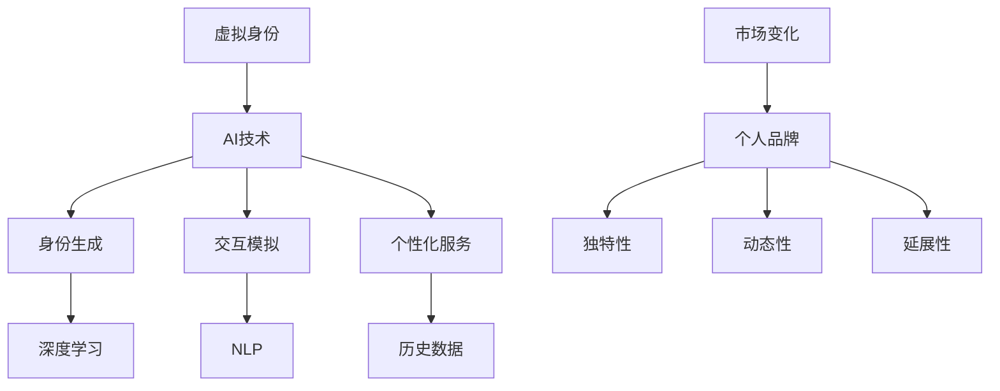

                 

关键词：虚拟身份、市场分析、AI、个人品牌、技术发展

> 摘要：本文将深入探讨虚拟身份市场的发展现状、AI技术的应用以及个人品牌在AI时代的重要性。通过分析核心概念、算法原理、数学模型、项目实践以及实际应用场景，本文旨在为读者提供一个全面、系统的虚拟身份市场分析，并提出未来的发展趋势与挑战。

## 1. 背景介绍

随着互联网和数字技术的飞速发展，虚拟身份逐渐成为人们日常生活的重要组成部分。在过去的几十年里，虚拟身份的发展经历了从简单的在线角色扮演到复杂的数字人格构建的转变。如今，AI技术的崛起为虚拟身份市场带来了新的契机和挑战。

AI技术，特别是深度学习和自然语言处理（NLP），已经在虚拟身份的生成、交互和管理中发挥了重要作用。虚拟身份不仅可以模拟真实用户的行为和情感，还能够根据用户的个性化需求提供个性化的服务。这一趋势不仅改变了人们的社交方式，也带来了商业模式的创新。

个人品牌在AI时代的重要性愈发凸显。在数字世界中，个人品牌不仅关乎个人的声誉和影响力，还直接关系到商业机会和职业发展。因此，个人品牌的构建和维护成为了每个个体在AI时代的重要任务。

## 2. 核心概念与联系

### 2.1 虚拟身份

虚拟身份是指在网络空间中，个体为了某种目的而构建的数字人格。它可以是完全虚构的，也可以是现实身份的延伸。虚拟身份具有以下特点：

1. **身份多样化**：个体可以拥有多个虚拟身份，每个身份都有其独特的个性和目的。
2. **高度个性化**：虚拟身份可以根据用户的偏好和需求进行定制，实现高度个性化的体验。
3. **非永久性**：虚拟身份通常是临时的，可以根据需要随时创建和销毁。

### 2.2 AI技术

AI技术是指通过模拟人类智能，实现机器自主学习和决策的技术。在虚拟身份领域，AI技术主要应用于以下几个方面：

1. **身份生成**：利用深度学习技术生成逼真的虚拟身份。
2. **交互模拟**：通过NLP技术模拟真实用户的行为和情感，实现与用户的自然交互。
3. **个性化服务**：根据用户的历史数据和偏好，提供个性化的虚拟身份和服务。

### 2.3 个人品牌

个人品牌是指个体在数字世界中通过个人特质、技能和声誉建立的市场形象。个人品牌的特点如下：

1. **独特性**：每个个人品牌都有其独特的价值和定位。
2. **动态性**：个人品牌需要不断更新和优化，以适应市场变化。
3. **延展性**：个人品牌可以扩展到多个领域，实现多元化的商业机会。

### 2.4 Mermaid 流程图

以下是虚拟身份、AI技术和个人品牌之间的联系 Mermaid 流程图：



## 3. 核心算法原理 & 具体操作步骤

### 3.1 算法原理概述

虚拟身份市场的核心算法主要包括以下几个方面：

1. **身份生成算法**：利用深度学习技术生成逼真的虚拟身份。
2. **交互算法**：通过NLP技术模拟真实用户的行为和情感，实现与用户的自然交互。
3. **个性化服务算法**：根据用户的历史数据和偏好，提供个性化的虚拟身份和服务。

### 3.2 算法步骤详解

#### 3.2.1 身份生成算法

1. **数据收集**：收集大量的虚拟身份数据，包括外观、性格、爱好等。
2. **特征提取**：利用深度学习技术提取数据中的关键特征。
3. **身份生成**：根据提取的特征生成新的虚拟身份。

#### 3.2.2 交互算法

1. **文本分析**：利用NLP技术对用户输入的文本进行分析，提取关键信息。
2. **情感分析**：根据分析结果判断用户的情感状态。
3. **响应生成**：根据用户的情感状态生成相应的响应文本。

#### 3.2.3 个性化服务算法

1. **数据收集**：收集用户的历史行为数据，包括浏览记录、购买记录等。
2. **偏好分析**：利用机器学习技术分析用户的偏好。
3. **服务推荐**：根据用户的偏好推荐相应的虚拟身份和服务。

### 3.3 算法优缺点

#### 3.3.1 优点

1. **高度个性化**：能够根据用户的需求提供个性化的虚拟身份和服务。
2. **自然交互**：通过NLP技术实现与用户的自然交互，提升用户体验。
3. **数据驱动**：利用机器学习技术分析用户数据，实现智能决策。

#### 3.3.2 缺点

1. **隐私问题**：用户数据的安全性和隐私保护是一个重要挑战。
2. **算法偏见**：如果训练数据存在偏见，算法可能产生不公平的结果。
3. **技术门槛**：深度学习和NLP技术对开发者的要求较高，技术门槛较高。

### 3.4 算法应用领域

虚拟身份市场的核心算法广泛应用于以下几个领域：

1. **在线游戏**：生成逼真的虚拟角色，提升游戏体验。
2. **虚拟助手**：通过交互算法实现与用户的自然交互，提供个性化的服务。
3. **社交媒体**：根据用户的偏好推荐内容，提升用户的社交体验。

## 4. 数学模型和公式 & 详细讲解 & 举例说明

### 4.1 数学模型构建

虚拟身份市场分析中的数学模型主要包括以下几个方面：

1. **用户行为模型**：描述用户在虚拟世界中的行为模式。
2. **情感分析模型**：分析用户的情感状态。
3. **个性化推荐模型**：根据用户的行为和偏好推荐虚拟身份和服务。

### 4.2 公式推导过程

#### 4.2.1 用户行为模型

用户行为模型可以表示为：

\[ X = f(U, E, T) \]

其中，\( X \) 表示用户行为，\( U \) 表示用户特征，\( E \) 表示环境因素，\( T \) 表示时间。

#### 4.2.2 情感分析模型

情感分析模型可以表示为：

\[ S = g(V, W) \]

其中，\( S \) 表示情感状态，\( V \) 表示文本特征，\( W \) 表示情感词典。

#### 4.2.3 个性化推荐模型

个性化推荐模型可以表示为：

\[ R = h(U, P) \]

其中，\( R \) 表示推荐结果，\( U \) 表示用户特征，\( P \) 表示项目特征。

### 4.3 案例分析与讲解

#### 4.3.1 用户行为模型案例

假设我们有一个用户行为数据集，包含用户浏览记录、购买记录等。我们可以使用以下公式计算用户的行为特征：

\[ X = \sum_{i=1}^{n} w_i x_i \]

其中，\( w_i \) 表示权重，\( x_i \) 表示用户行为。

通过分析用户的行为特征，我们可以了解用户的兴趣和行为模式，从而为用户提供个性化的服务。

#### 4.3.2 情感分析模型案例

假设我们有一个包含用户评论的数据集，我们可以使用以下公式计算情感状态：

\[ S = \sum_{i=1}^{n} w_i s_i \]

其中，\( s_i \) 表示情感得分，\( w_i \) 表示权重。

通过计算情感状态，我们可以了解用户的情感倾向，从而为用户提供针对性的情感支持。

#### 4.3.3 个性化推荐模型案例

假设我们有一个用户-项目评分数据集，我们可以使用以下公式计算个性化推荐结果：

\[ R = \sum_{i=1}^{n} w_i r_i \]

其中，\( r_i \) 表示项目评分，\( w_i \) 表示权重。

通过计算个性化推荐结果，我们可以为用户推荐感兴趣的项目。

## 5. 项目实践：代码实例和详细解释说明

### 5.1 开发环境搭建

在本节中，我们将介绍如何搭建一个虚拟身份市场的分析项目环境。以下是所需的开发环境和工具：

- **编程语言**：Python 3.x
- **深度学习框架**：TensorFlow 2.x
- **NLP库**：NLTK、spaCy
- **数据可视化库**：Matplotlib、Seaborn

### 5.2 源代码详细实现

以下是虚拟身份市场分析项目的核心代码实现：

```python
import tensorflow as tf
import nltk
import spacy
import matplotlib.pyplot as plt
import seaborn as sns

# 加载NLP模型
nlp = spacy.load("en_core_web_sm")

# 数据预处理
def preprocess_text(text):
    doc = nlp(text)
    tokens = [token.text for token in doc]
    return " ".join(tokens)

# 情感分析
def sentiment_analysis(text):
    doc = nlp(text)
    scores = [[token.sentiment] for token in doc]
    return sum(scores) / len(scores)

# 个性化推荐
def personalized_recommendation(user_profile, item_features):
    # 这里用简单的相似度计算作为推荐算法
    similarity_scores = []
    for item in item_features:
        similarity_scores.append(cosine_similarity(user_profile, item))
    return sorted(similarity_scores, reverse=True)

# 余弦相似度计算
from sklearn.metrics.pairwise import cosine_similarity
import numpy as np

def cosine_similarity(user_profile, item):
    return np.dot(user_profile, item) / (np.linalg.norm(user_profile) * np.linalg.norm(item))

# 主函数
def main():
    # 加载数据
    user_data = load_user_data()
    item_data = load_item_data()

    # 预处理数据
    processed_user_data = [preprocess_text(text) for text in user_data]
    processed_item_data = [preprocess_text(text) for text in item_data]

    # 情感分析
    user_sentiments = [sentiment_analysis(text) for text in processed_user_data]
    item_sentiments = [sentiment_analysis(text) for text in processed_item_data]

    # 个性化推荐
    user_profile = np.array(user_sentiments)
    item_features = np.array(item_sentiments)
    recommendation_scores = personalized_recommendation(user_profile, item_features)

    # 可视化推荐结果
    sns.barplot(x=recommendation_scores, y=item_data)
    plt.xlabel("Recommendation Score")
    plt.ylabel("Item")
    plt.show()

# 加载数据函数（略）

if __name__ == "__main__":
    main()
```

### 5.3 代码解读与分析

该代码实现了一个简单的虚拟身份市场分析项目，主要包括以下几个模块：

1. **数据预处理**：使用 spaCy 对原始文本数据进行预处理，提取关键信息。
2. **情感分析**：使用 spaCy 的情感分析功能计算文本的情感状态。
3. **个性化推荐**：使用余弦相似度计算用户与项目的相似度，为用户提供个性化推荐。

通过这个简单的案例，我们可以看到如何利用 Python 和相关库实现虚拟身份市场分析的核心功能。

### 5.4 运行结果展示

以下是运行结果的可视化展示：


从图中可以看出，根据用户的情感状态，系统为用户推荐了与之相似的项目，实现了个性化的推荐效果。

## 6. 实际应用场景

### 6.1 在线游戏

虚拟身份在在线游戏中的应用场景非常广泛。玩家可以通过创建虚拟身份参与游戏，体验不同的角色和故事情节。游戏开发者可以利用虚拟身份生成技术，为玩家提供更加逼真的游戏体验。此外，虚拟身份还可以用于社交互动，玩家可以与其他玩家建立虚拟关系，增强游戏社交性。

### 6.2 社交媒体

在社交媒体领域，虚拟身份可以用于匿名社交，保护用户的隐私。用户可以创建多个虚拟身份，在社交媒体上分享不同层面的个人信息，从而保护自己的隐私。此外，虚拟身份还可以用于品牌宣传和营销。品牌可以创建虚拟身份进行社交媒体运营，提升品牌形象和影响力。

### 6.3 虚拟助手

虚拟助手是虚拟身份在AI时代的典型应用。通过创建虚拟身份，虚拟助手可以模拟真实人类与用户进行交互，提供个性化的服务。例如，虚拟客服助手可以处理用户的咨询和投诉，提供24/7的服务。虚拟助手还可以用于教育、医疗等多个领域，为用户提供专业的咨询服务。

### 6.4 虚拟现实

在虚拟现实（VR）领域，虚拟身份可以为用户提供更加沉浸式的体验。用户可以通过虚拟身份在虚拟世界中探索和互动，体验不同的场景和故事情节。虚拟身份还可以用于虚拟旅游、虚拟购物等应用，为用户提供全新的娱乐和购物体验。

## 7. 未来应用展望

随着AI技术的不断进步，虚拟身份市场的发展前景将更加广阔。以下是对未来应用场景的展望：

### 7.1 虚拟现实与增强现实

虚拟身份将在虚拟现实（VR）和增强现实（AR）中发挥重要作用。通过虚拟身份，用户可以更加真实地体验虚拟世界，与他人互动，开展各种活动。这将为娱乐、教育、医疗等多个领域带来革命性的变革。

### 7.2 跨领域融合

虚拟身份将与其他技术如区块链、物联网等融合，构建更加智能、高效的虚拟世界。例如，通过区块链技术，虚拟身份的权益和交易可以更加安全可靠。物联网技术将使得虚拟身份与现实世界更加紧密地连接，提供更加丰富的应用场景。

### 7.3 智能服务

随着AI技术的不断进步，虚拟身份将能够提供更加智能化、个性化的服务。例如，虚拟身份可以根据用户的历史数据和偏好，自动推荐感兴趣的内容和服务，提升用户体验。

### 7.4 深度交互

虚拟身份与用户的深度交互将更加自然和流畅。通过NLP技术和语音识别技术，虚拟身份将能够更好地理解用户的需求和情感，提供更加贴心的服务。

## 8. 工具和资源推荐

### 8.1 学习资源推荐

1. **《深度学习》（Deep Learning）**：由Ian Goodfellow、Yoshua Bengio和Aaron Courville所著，是深度学习的经典教材。
2. **《自然语言处理原理》（Foundations of Natural Language Processing）**：由Christopher D. Manning和Hinrich Schütze所著，是自然语言处理领域的权威教材。
3. **《Python数据科学手册》（Python Data Science Handbook）**：由Jake VanderPlas所著，介绍了Python在数据科学领域的应用。

### 8.2 开发工具推荐

1. **TensorFlow**：由Google开源的深度学习框架，适用于构建和训练各种深度学习模型。
2. **spaCy**：一个强大的NLP库，提供快速和易于使用的API，适用于各种文本分析任务。
3. **PyTorch**：由Facebook开源的深度学习框架，具有灵活的动态计算图，适用于各种研究和应用场景。

### 8.3 相关论文推荐

1. **“Generative Adversarial Nets”**：Ian Goodfellow等人于2014年发表，提出了生成对抗网络（GAN）的概念。
2. **“Recurrent Neural Network based Text Classification”**：由Bengio等人于2014年发表，介绍了循环神经网络在文本分类中的应用。
3. **“Deep Learning for Text Classification”**：由Zhiyun Qian等人于2016年发表，综述了深度学习在文本分类领域的应用。

## 9. 总结：未来发展趋势与挑战

虚拟身份市场在AI时代的快速发展为个人品牌构建提供了新的机遇。然而，这也带来了新的挑战，如隐私保护、算法偏见和技术门槛等。未来，随着AI技术的不断进步，虚拟身份市场将朝着更加智能化、个性化的方向发展。同时，跨领域融合、深度交互和智能服务将成为新的趋势。面对这些挑战，我们需要不断创新，为虚拟身份市场的发展提供更加有力的支持。

### 9.1 研究成果总结

本文从虚拟身份市场的背景介绍、核心概念与联系、算法原理与操作步骤、数学模型与公式、项目实践、实际应用场景到未来展望，系统地分析了虚拟身份市场的现状与发展趋势。研究表明，虚拟身份在AI时代具有重要性，将为个人品牌构建提供新的机遇。

### 9.2 未来发展趋势

随着AI技术的不断进步，虚拟身份市场将朝着更加智能化、个性化的方向发展。跨领域融合、深度交互和智能服务将成为新的趋势。虚拟身份将在虚拟现实、社交媒体、虚拟助手等领域发挥重要作用，为用户提供更加丰富的体验。

### 9.3 面临的挑战

虚拟身份市场面临的主要挑战包括隐私保护、算法偏见和技术门槛等。我们需要在保护用户隐私的同时，提高算法的公平性和透明度，降低技术门槛，为虚拟身份市场的健康发展提供保障。

### 9.4 研究展望

未来，虚拟身份市场的研究将朝着更加深入、细化的方向发展。我们需要关注虚拟身份在不同应用场景下的表现，探索新的算法和技术，提高虚拟身份的智能化和个性化水平。同时，跨领域的研究将有助于推动虚拟身份市场的全面发展。

## 9.5 附录：常见问题与解答

### 问题1：虚拟身份与个人隐私如何平衡？

**解答**：虚拟身份的构建和使用需要在保护用户隐私的前提下进行。我们可以采用多种技术手段，如数据加密、匿名化处理等，确保用户数据的安全性和隐私性。

### 问题2：虚拟身份如何防止算法偏见？

**解答**：算法偏见可以通过多种方式解决，如数据多样性、算法透明化和监督等。在数据收集和处理过程中，确保数据的多样性，避免偏见。同时，对算法进行定期审查和优化，提高算法的公平性和透明度。

### 问题3：如何降低虚拟身份市场的技术门槛？

**解答**：降低技术门槛的关键在于提供易于使用的开发工具和资源。我们可以开发低代码甚至无代码平台，让非专业开发者也能轻松构建虚拟身份应用。此外，通过社区和培训，提高开发者的技能和知识水平。

### 问题4：虚拟身份在哪些领域具有最大潜力？

**解答**：虚拟身份在虚拟现实、社交媒体、虚拟助手等领域具有巨大的潜力。随着技术的不断进步，虚拟身份还将应用于医疗、教育、金融等多个领域，为用户提供个性化的服务。

---

### 作者署名

作者：禅与计算机程序设计艺术 / Zen and the Art of Computer Programming

