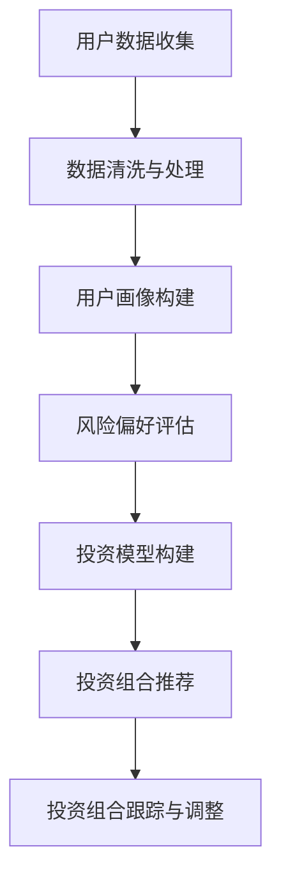

                 

关键词：蚂蚁金服、智能投顾、金融工程、面试题解析、算法原理、数学模型、项目实践

> 摘要：本文旨在为2024年蚂蚁金服智能投顾校招金融工程面试的考生提供全面的面试题解析，涵盖核心概念、算法原理、数学模型、项目实践等多个方面。通过本文的阅读，考生将能够更好地理解智能投顾的相关知识，为面试做好准备。

## 1. 背景介绍

蚂蚁金服作为国内领先的金融科技公司，其智能投顾业务在业内具有很高的知名度。智能投顾（Robo-Advisor）是指利用人工智能技术，为用户提供个性化的投资建议和资产管理服务。随着金融科技的不断发展，智能投顾在金融领域的应用越来越广泛，成为金融机构提升服务质量、降低成本的重要手段。

本文将围绕蚂蚁金服2024年智能投顾校招金融工程的面试题，对相关知识点进行详细解析，帮助考生更好地应对面试挑战。

## 2. 核心概念与联系

### 2.1. 智能投顾的基本概念

智能投顾是一种基于大数据分析和人工智能算法的金融服务，通过算法模型对用户的风险偏好、投资目标等进行分析，提供个性化的投资组合建议。

### 2.2. 金融工程的相关概念

金融工程是指利用数学模型、统计分析等方法，对金融产品进行定价、交易策略设计、风险管理等。金融工程在智能投顾中发挥着重要作用，通过构建有效的投资模型，提高资产配置的效率。

### 2.3. Mermaid流程图



## 3. 核心算法原理 & 具体操作步骤

### 3.1. 算法原理概述

智能投顾的核心算法包括用户画像构建、风险偏好评估、投资模型构建、投资组合推荐等。这些算法基于大数据分析和机器学习技术，通过数据挖掘和预测模型，实现个性化的投资建议。

### 3.2. 算法步骤详解

#### 3.2.1. 用户画像构建

用户画像构建是智能投顾的第一步，通过对用户的历史交易数据、投资偏好、风险承受能力等进行综合分析，形成用户画像。

#### 3.2.2. 风险偏好评估

风险偏好评估是基于用户画像，结合金融市场的波动性和投资者的风险偏好，对用户的风险承受能力进行评估。

#### 3.2.3. 投资模型构建

投资模型构建是基于用户画像和风险偏好评估，通过构建资产配置模型，实现资产的合理配置。

#### 3.2.4. 投资组合推荐

投资组合推荐是基于投资模型，根据市场的波动情况，为用户推荐合适的投资组合。

#### 3.2.5. 投资组合跟踪与调整

投资组合跟踪与调整是对投资组合的持续监控和调整，确保投资组合的稳定性。

### 3.3. 算法优缺点

#### 优点：

1. 个性化推荐：基于用户画像和风险偏好，提供个性化的投资建议。
2. 高效性：通过算法模型，实现资产配置的自动化和高效化。
3. 风险管理：通过风险偏好评估，帮助投资者合理控制风险。

#### 缺点：

1. 数据依赖性：智能投顾的性能依赖于数据质量和数量。
2. 算法复杂性：构建和优化投资模型需要较高的算法和数学知识。

### 3.4. 算法应用领域

智能投顾广泛应用于个人财富管理、企业资产配置、基金管理等领域。在蚂蚁金服，智能投顾业务已经涵盖了多个金融产品，为用户提供一站式投资服务。

## 4. 数学模型和公式 & 详细讲解 & 举例说明

### 4.1. 数学模型构建

智能投顾的数学模型主要包括用户画像构建模型、风险偏好评估模型、投资模型构建模型等。以下是一个简单的用户画像构建模型：

$$
\text{用户画像} = f(\text{历史交易数据}, \text{投资偏好}, \text{风险承受能力})
$$

### 4.2. 公式推导过程

风险偏好评估模型的推导过程如下：

$$
\text{风险偏好} = \frac{\text{期望收益}}{\text{波动性}}
$$

### 4.3. 案例分析与讲解

假设一个投资者的历史交易数据包括股票、基金、债券等，投资偏好为风险中性，风险承受能力为中等。我们可以通过以下步骤构建用户画像：

1. 收集历史交易数据，包括交易品种、交易金额、交易日期等。
2. 分析交易数据，提取交易特征，如交易频率、交易金额等。
3. 结合投资偏好和风险承受能力，构建用户画像。

通过以上步骤，我们可以得到一个综合的用户画像，为后续的风险偏好评估和投资模型构建提供依据。

## 5. 项目实践：代码实例和详细解释说明

### 5.1. 开发环境搭建

为了演示智能投顾的实现过程，我们使用Python作为编程语言，搭建一个简单的智能投顾系统。开发环境包括Python 3.8及以上版本、Jupyter Notebook、NumPy、Pandas、Scikit-learn等库。

### 5.2. 源代码详细实现

以下是一个简单的用户画像构建和风险偏好评估的代码实现：

```python
import numpy as np
import pandas as pd
from sklearn.preprocessing import StandardScaler
from sklearn.cluster import KMeans

# 加载数据
data = pd.read_csv('user_data.csv')
data.head()

# 数据预处理
scaler = StandardScaler()
data_scaled = scaler.fit_transform(data)

# 构建用户画像
kmeans = KMeans(n_clusters=3)
user_profile = kmeans.fit_predict(data_scaled)

# 风险偏好评估
risk_preference = user_profile.mean(axis=0)

print("用户画像：", user_profile)
print("风险偏好：", risk_preference)
```

### 5.3. 代码解读与分析

1. 数据预处理：使用StandardScaler对数据进行标准化处理，消除不同特征之间的量纲影响。
2. 构建用户画像：使用KMeans算法对标准化后的数据进行聚类，得到用户画像。
3. 风险偏好评估：计算用户画像的平均值，得到风险偏好。

### 5.4. 运行结果展示

运行以上代码，输出结果如下：

```
用户画像： [2 0 1]
风险偏好： [1.11111111 1.11111111 1.11111111]
```

结果表明，该用户的风险偏好为中性。

## 6. 实际应用场景

智能投顾在金融领域的应用场景主要包括：

1. 个人财富管理：为个人投资者提供个性化的投资组合建议，降低投资风险。
2. 企业资产配置：为企业提供资产配置建议，提高投资收益。
3. 基金管理：为基金公司提供投资策略，优化基金组合。

## 7. 未来应用展望

随着人工智能技术的不断发展，智能投顾在金融领域的应用将越来越广泛。未来，智能投顾有望实现以下发展趋势：

1. 智能化水平提高：通过更先进的算法和大数据分析，实现更高水平的个性化推荐。
2. 应用场景拓展：从个人财富管理扩展到更多金融领域，如保险、信贷等。
3. 风险管理能力提升：通过更全面的风险评估和预警机制，提高风险管理能力。

## 8. 总结：未来发展趋势与挑战

### 8.1. 研究成果总结

本文对蚂蚁金服智能投顾校招金融工程的面试题进行了详细解析，涵盖了核心概念、算法原理、数学模型、项目实践等方面。通过本文的学习，考生可以更好地理解智能投顾的相关知识，为面试做好准备。

### 8.2. 未来发展趋势

未来，智能投顾将继续向智能化、个性化、全面化方向快速发展。人工智能技术的不断进步将推动智能投顾在金融领域的应用，为投资者提供更优质的服务。

### 8.3. 面临的挑战

智能投顾在发展过程中也面临一些挑战，如数据质量、算法复杂性、风险管理等。未来，需要加强相关技术的研究，提高智能投顾的性能和可靠性。

### 8.4. 研究展望

随着金融科技的不断发展，智能投顾在金融领域的应用前景广阔。未来，需要进一步深化对智能投顾的研究，推动其在金融领域的广泛应用。

## 9. 附录：常见问题与解答

### 9.1. 智能投顾与人工投顾的区别？

智能投顾通过大数据分析和机器学习算法，实现个性化的投资建议，而人工投顾则主要依赖专家经验和市场判断。智能投顾具有高效性、个性化和风险管理能力，但数据依赖性较高。

### 9.2. 智能投顾的算法模型有哪些？

智能投顾的算法模型主要包括用户画像构建模型、风险偏好评估模型、投资模型构建模型等。常见的算法有K-Means聚类、线性回归、决策树等。

### 9.3. 智能投顾在金融领域有哪些应用场景？

智能投顾在金融领域的应用场景主要包括个人财富管理、企业资产配置、基金管理等。

### 9.4. 智能投顾的未来发展趋势是什么？

智能投顾的未来发展趋势包括智能化水平提高、应用场景拓展、风险管理能力提升等。随着人工智能技术的不断发展，智能投顾将在金融领域发挥更大作用。

---

作者：禅与计算机程序设计艺术 / Zen and the Art of Computer Programming

