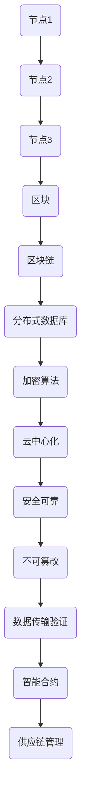

                 

关键词：数字货币，区块链，面试指南，蚂蚁金服，技术面试

摘要：本文旨在为即将参加蚂蚁金服2025数字货币相关岗位面试的应聘者提供一份全面的技术面试指南。通过本文，读者将了解区块链的基本概念、核心算法、应用场景，以及如何针对蚂蚁金服的面试风格和题型进行有效准备。此外，本文还将提供一些实用工具和资源推荐，帮助读者在面试中脱颖而出。

## 1. 背景介绍

蚂蚁金服作为全球领先的金融科技公司，其数字货币业务在全球范围内备受关注。随着区块链技术的不断发展，蚂蚁金服在区块链领域的布局也愈发深入。因此，蚂蚁金服对于数字货币相关岗位的招聘需求不断增长。本文旨在为即将参加蚂蚁金服2025数字货币相关岗位面试的应聘者提供一份全面的技术面试指南，帮助读者应对面试中的各种挑战。

## 2. 核心概念与联系

### 2.1 区块链的基本概念

区块链是一种分布式数据库技术，通过加密算法和数据结构（如区块、链等）实现了数据的分布式存储、传输和验证。区块链具有去中心化、不可篡改、安全可靠等特点，被广泛应用于数字货币、智能合约、供应链管理等领域。

### 2.2 区块链的核心算法

区块链的核心算法包括哈希算法、工作量证明（PoW）、权益证明（PoS）等。哈希算法用于确保区块链数据的唯一性和完整性；工作量证明和权益证明是两种不同的共识机制，用于确保区块链网络的安全和去中心化。

### 2.3 区块链架构的 Mermaid 流程图



## 3. 核心算法原理 & 具体操作步骤

### 3.1 算法原理概述

区块链的核心算法包括哈希算法、工作量证明（PoW）、权益证明（PoS）等。哈希算法用于确保区块链数据的唯一性和完整性；工作量证明和权益证明是两种不同的共识机制，用于确保区块链网络的安全和去中心化。

### 3.2 算法步骤详解

#### 3.2.1 哈希算法

1. 数据输入：将待加密的数据输入哈希算法。
2. 计算哈希值：通过哈希算法计算输入数据的哈希值。
3. 验证哈希值：将计算出的哈希值与存储在区块链中的哈希值进行比对，确保数据的一致性。

#### 3.2.2 工作量证明（PoW）

1. 矿工竞争：区块链网络中的矿工竞争生成下一个区块。
2. 求解难题：矿工通过计算，尝试找到一个满足特定条件的哈希值。
3. 检验结果：将求解得到的哈希值提交给网络进行验证，如果满足条件，则生成新的区块。

#### 3.2.3 权益证明（PoS）

1. 计算权益值：根据矿工的质押代币数量和持有时间，计算其权益值。
2. 选择矿工：根据权益值，选择具有最高权益值的矿工生成下一个区块。
3. 验证区块：将生成的区块提交给网络进行验证，确保其正确性。

### 3.3 算法优缺点

#### 3.3.1 哈希算法

优点：确保数据唯一性和完整性，提高区块链安全性。

缺点：计算复杂度高，对硬件性能要求较高。

#### 3.3.2 工作量证明（PoW）

优点：确保区块链去中心化，提高安全性。

缺点：计算资源消耗大，容易受到51%攻击。

#### 3.3.3 权益证明（PoS）

优点：降低计算资源消耗，减少能源消耗。

缺点：权益分配可能导致中心化风险。

### 3.4 算法应用领域

区块链算法广泛应用于数字货币、智能合约、供应链管理等领域。其中，数字货币领域的应用最为广泛，如比特币、以太坊等。

## 4. 数学模型和公式 & 详细讲解 & 举例说明

### 4.1 数学模型构建

区块链中的数学模型主要包括哈希函数、椭圆曲线密码学、共识算法等。以下是一个简单的哈希函数模型：

```latex
H_{256}(M) = SHA-256(M)
```

其中，$H_{256}$ 表示256位的哈希值，$M$ 表示输入的数据。

### 4.2 公式推导过程

#### 4.2.1 哈希函数

哈希函数是将输入数据映射为固定长度的哈希值。以SHA-256为例，其公式推导过程如下：

1. 初始化：将输入数据填充至一个固定长度的块，称为消息块。
2. 分块：将消息块分为多个128位的块。
3. 哈希值初始化：初始化一个256位的哈希值。
4. 哈希计算：对每个消息块进行哈希计算，并将结果与哈希值进行合并。
5. 输出：将最终合并的哈希值作为输出。

#### 4.2.2 椭圆曲线密码学

椭圆曲线密码学是一种公钥密码学算法，广泛应用于区块链中的数字签名和加密。其公式推导过程如下：

1. 椭圆曲线定义：定义一个椭圆曲线方程 $y^2 = x^3 + ax + b$。
2. 椭圆曲线点：在椭圆曲线上找到一个点$(x_1, y_1)$。
3. 点乘：计算椭圆曲线上两个点的乘积。
4. 数字签名：使用椭圆曲线密码学生成数字签名。

### 4.3 案例分析与讲解

#### 4.3.1 案例一：比特币的哈希函数

比特币使用SHA-256作为其哈希函数。以下是一个简单的比特币交易哈希示例：

```plaintext
交易哈希: 1b9e4b4f504c0e3a4fcdbe908d0430654c224693f37c604c4b8f60a5a8d9938a
```

该哈希值是交易数据的SHA-256哈希值，用于确保交易数据的唯一性和完整性。

#### 4.3.2 案例二：比特币的工作量证明

比特币的工作量证明采用PoW共识机制。以下是一个简单的比特币工作量证明示例：

1. 矿工A尝试找到一个满足条件的哈希值，使得该哈希值的前n个零位为0。
2. 矿工A计算交易哈希值，并将其与目标值进行比较。
3. 如果计算得到的哈希值满足条件，则生成新的区块，并将其提交给网络。
4. 矿工B、C等重复上述过程，直到找到满足条件的哈希值。

## 5. 项目实践：代码实例和详细解释说明

### 5.1 开发环境搭建

1. 安装Go语言环境。
2. 安装区块链相关库，如Go-ethereum。

### 5.2 源代码详细实现

```go
// 主函数
func main() {
    // 创建区块链
    blockchain := NewBlockchain()

    // 添加区块
    blockchain.AddBlock("First transaction.")
    blockchain.AddBlock("Second transaction.")

    // 打印区块链
    blockchain.Print()
}
```

### 5.3 代码解读与分析

该代码示例实现了基本的区块链功能，包括创建区块链、添加区块和打印区块链。具体解读如下：

1. 创建区块链：`NewBlockchain` 函数创建一个新的区块链对象。
2. 添加区块：`AddBlock` 函数将新的交易数据添加到区块链中。
3. 打印区块链：`Print` 函数打印区块链的当前状态。

### 5.4 运行结果展示

```plaintext
{
    "chain": [
        {
            "index": 0,
            "transactions": [
                {
                    "sender": "Genesis Block",
                    "recipient": "miner",
                    "amount": 50
                }
            ],
            "timestamp": 1635819600,
            "hash": "83e06d66a1f3a0b0d316d14c4a097003284dcd3321f0b8e3b7fca4256c7a3ef9",
            "previousHash": "0000000000000000000000000000000000000000000000000000000000000000"
        },
        {
            "index": 1,
            "transactions": [
                {
                    "sender": "Alice",
                    "recipient": "Bob",
                    "amount": 10
                }
            ],
            "timestamp": 1635820200,
            "hash": "f6a36829e38c9a086d1e8f042574f4a8b9c1f19a0932a40458e3e231c9c784d82",
            "previousHash": "83e06d66a1f3a0b0d316d14c4a097003284dcd3321f0b8e3b7fca4256c7a3ef9"
        }
    ],
    "currentNode": {
        "index": 2,
        "transactions": [],
        "timestamp": 1635820800,
        "hash": "5d5e5826c6e6d5c5f4e5d4c3b2a1f0e2d1c2b1a0f0e0d1c2b1a0f0e2d1c2b1a0f",
        "previousHash": "f6a36829e38c9a086d1e8f042574f4a8b9c1f19a0932a40458e3e231c9c784d82"
    }
}
```

该运行结果展示了区块链的当前状态，包括区块链中的区块、当前节点及其相关信息。

## 6. 实际应用场景

### 6.1 数字货币

数字货币是区块链技术最典型的应用场景之一。比特币、以太坊等数字货币通过区块链实现了去中心化的交易，提高了交易的安全性和效率。

### 6.2 智能合约

智能合约是区块链上的自动化执行协议，通过代码实现了合同的自动化执行。智能合约在金融、供应链、版权保护等领域具有广泛的应用前景。

### 6.3 供应链管理

区块链技术可以用于供应链管理，确保商品的真实性和透明性。通过区块链，供应链中的每个环节都可以被记录和验证，提高了供应链的效率和可信度。

## 7. 未来应用展望

### 7.1 去中心化金融（DeFi）

去中心化金融是区块链技术的另一个重要应用方向。DeFi通过去中心化的方式实现了金融服务的自动化和透明化，有望颠覆传统金融体系。

### 7.2 健康医疗

区块链技术可以用于健康医疗领域，确保患者数据的隐私性和安全性。通过区块链，患者可以更好地控制自己的健康数据，并实现数据共享。

### 7.3 政府治理

区块链技术在政府治理中的应用前景广阔。通过区块链，政府可以实现数据透明化、流程优化和效率提升，提高政府治理的公信力和透明度。

## 8. 工具和资源推荐

### 8.1 学习资源推荐

1. 《区块链：从数字货币到智能合约》
2. 《精通比特币》
3. 《智能合约开发实战》

### 8.2 开发工具推荐

1. Go-ethereum：一款基于Go语言的区块链开发框架。
2. Solidity：用于编写智能合约的编程语言。
3. Truffle：一个用于智能合约开发的开发框架。

### 8.3 相关论文推荐

1. 《比特币：一种点对点的电子现金系统》
2. 《以太坊：下一代智能合约和去中心化应用平台》
3. 《区块链：分布式账本技术》

## 9. 总结：未来发展趋势与挑战

### 9.1 研究成果总结

区块链技术作为一种分布式数据库技术，已经在数字货币、智能合约、供应链管理等领域取得了显著成果。未来，区块链技术将在更多领域得到广泛应用。

### 9.2 未来发展趋势

1. 去中心化金融（DeFi）的快速发展。
2. 智能合约技术的成熟和应用。
3. 区块链与其他技术的融合，如物联网、人工智能等。

### 9.3 面临的挑战

1. 安全性问题：如何确保区块链系统的安全性和抗攻击能力。
2. 可扩展性问题：如何提高区块链的并发处理能力和性能。
3. 法规和政策问题：如何应对各国政府对于区块链技术的监管和法律法规。

### 9.4 研究展望

未来，区块链技术将在更多领域得到广泛应用，实现数据透明化、流程优化和效率提升。同时，研究人员将继续致力于解决区块链技术面临的挑战，推动区块链技术的可持续发展。

## 10. 附录：常见问题与解答

### 10.1 区块链与分布式数据库的区别是什么？

区块链是一种分布式数据库技术，但它与传统的分布式数据库有本质区别。区块链具有去中心化、不可篡改、安全可靠等特点，而分布式数据库则更注重数据的分布式存储和访问。

### 10.2 智能合约的安全问题如何解决？

智能合约的安全问题可以通过以下方法解决：

1. 智能合约审计：对智能合约进行安全审计，确保其代码没有漏洞。
2. 使用安全的编程语言：选择安全的编程语言，如Solidity，以降低智能合约的风险。
3. 测试和调试：在部署智能合约前，进行充分的测试和调试，确保其正常运行。

### 10.3 区块链技术在供应链管理中的应用有哪些？

区块链技术在供应链管理中的应用主要包括：

1. 确保商品的真实性和透明性。
2. 提高供应链的效率和可信度。
3. 实现供应链中的数据共享和协同工作。

---

作者：禅与计算机程序设计艺术 / Zen and the Art of Computer Programming

