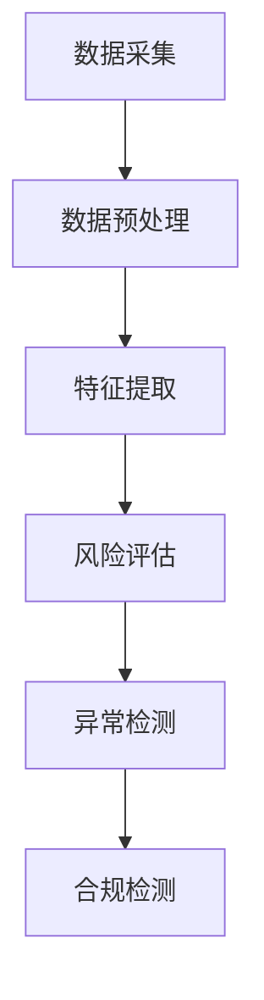

                 

关键词：智能合规系统，社招面试，面试真题，解决方案，技术解析

## 摘要

本文旨在为2024年参与蚂蚁集团智能合规系统社招面试的应聘者提供一份全面的真题汇总及解答指南。文章将围绕面试中出现的主要技术问题和应用场景，结合实际案例和深度分析，帮助应聘者更好地理解和准备相关面试内容。本文结构如下：

- **背景介绍**：介绍智能合规系统的基本概念及其重要性。
- **核心概念与联系**：通过Mermaid流程图展示智能合规系统的架构。
- **核心算法原理与具体操作步骤**：详细解析智能合规系统中的关键算法及其应用。
- **数学模型和公式**：讲解智能合规系统背后的数学模型和公式。
- **项目实践：代码实例和详细解释说明**：提供具体代码实现和解读。
- **实际应用场景**：探讨智能合规系统的各种应用领域。
- **工具和资源推荐**：推荐学习资源和开发工具。
- **总结：未来发展趋势与挑战**：总结研究成果，展望未来发展。

## 1. 背景介绍

智能合规系统是一种利用人工智能和机器学习技术，帮助企业自动化合规检测、风险评估和异常行为监控的系统。随着金融科技的快速发展，合规需求日益复杂，传统的手动合规方式已经无法满足高效、准确的要求。智能合规系统通过数据分析、模式识别和自然语言处理等技术，实现了对大量数据的高效处理和分析，大大提高了合规检测的效率和准确性。

### 1.1 智能合规系统的基本概念

智能合规系统主要包括以下几个核心组成部分：

- **数据采集**：从各个渠道获取与企业合规相关的数据，如交易记录、合同、报告等。
- **数据预处理**：清洗和整理采集到的数据，使其符合分析要求。
- **特征提取**：从预处理后的数据中提取关键特征，用于后续分析。
- **风险评估**：利用机器学习模型对企业的风险进行预测和评估。
- **异常检测**：对企业的日常运营行为进行监控，识别异常行为和潜在风险。
- **合规检测**：根据法律法规和行业标准，对企业行为进行合规性检查。

### 1.2 智能合规系统的应用领域

智能合规系统在金融、保险、医疗、能源等多个领域都有广泛的应用。以下是一些典型应用场景：

- **金融领域**：智能合规系统可以帮助银行、证券公司等金融机构进行反洗钱、反欺诈等合规检测。
- **保险领域**：通过智能合规系统，保险公司可以自动化进行风险评估、合同审核等流程。
- **医疗领域**：智能合规系统可以帮助医疗机构监控医疗数据，确保数据的合法性和安全性。
- **能源领域**：能源企业可以利用智能合规系统进行环境监测、资源管理等方面的合规性检查。

## 2. 核心概念与联系

为了更好地理解智能合规系统的架构，我们使用Mermaid流程图来展示其核心概念和联系。



### 2.1 数据采集

数据采集是智能合规系统的第一步，也是至关重要的一步。只有准确、全面的数据，才能确保后续分析的准确性。数据来源可以包括内部数据（如交易记录、财务报表）和外部数据（如新闻报道、监管文件）。

### 2.2 数据预处理

数据预处理主要包括数据清洗、去重、格式转换等操作，旨在将原始数据转化为适合分析的形式。数据预处理的质量直接影响后续分析的结果。

### 2.3 特征提取

特征提取是从预处理后的数据中提取出能够代表数据特性的关键信息。这些特征将用于后续的风险评估和异常检测。

### 2.4 风险评估

风险评估是智能合规系统的核心功能之一。通过机器学习模型，对企业的风险进行预测和评估，帮助企业及时发现潜在风险。

### 2.5 异常检测

异常检测通过对企业日常运营行为的监控，识别异常行为和潜在风险。异常检测的方法包括统计方法、机器学习方法等。

### 2.6 合规检测

合规检测是根据法律法规和行业标准，对企业行为进行合规性检查。智能合规系统可以帮助企业及时发现违规行为，降低合规风险。

## 3. 核心算法原理与具体操作步骤

智能合规系统中的核心算法主要包括风险评估算法、异常检测算法和合规检测算法。下面将分别介绍这些算法的原理和具体操作步骤。

### 3.1 风险评估算法

风险评估算法是智能合规系统的核心之一。它通过机器学习模型，对企业的风险进行预测和评估。风险评估算法的基本原理如下：

1. **数据预处理**：对采集到的数据进行分析，提取出关键特征。
2. **模型选择**：根据数据特点和业务需求，选择合适的机器学习模型。
3. **模型训练**：使用历史数据对机器学习模型进行训练，使其能够预测企业的风险。
4. **模型评估**：对训练好的模型进行评估，确保其预测准确性。
5. **风险预测**：使用训练好的模型对企业的风险进行预测。

### 3.2 异常检测算法

异常检测算法用于监控企业的日常运营行为，识别异常行为和潜在风险。异常检测算法的基本原理如下：

1. **数据预处理**：对采集到的数据进行分析，提取出关键特征。
2. **模型选择**：根据数据特点和业务需求，选择合适的机器学习模型。
3. **模型训练**：使用历史数据对机器学习模型进行训练，使其能够识别异常行为。
4. **模型评估**：对训练好的模型进行评估，确保其识别异常的准确性。
5. **异常检测**：使用训练好的模型对企业日常运营行为进行监控，识别异常行为。

### 3.3 合规检测算法

合规检测算法是根据法律法规和行业标准，对企业行为进行合规性检查。合规检测算法的基本原理如下：

1. **数据预处理**：对采集到的数据进行分析，提取出关键特征。
2. **规则库构建**：根据法律法规和行业标准，构建合规检测规则库。
3. **合规性检查**：使用规则库对企业的行为进行合规性检查，识别违规行为。
4. **违规行为分析**：对识别出的违规行为进行分析，提出改进建议。

## 4. 数学模型和公式

智能合规系统的数学模型和公式是其核心理论基础。下面将介绍智能合规系统中的几个关键数学模型和公式。

### 4.1 风险评估数学模型

风险评估数学模型通常使用决策树、支持向量机、神经网络等机器学习模型。以下是一个简单的线性回归模型：

$$
y = \beta_0 + \beta_1x_1 + \beta_2x_2 + ... + \beta_nx_n
$$

其中，$y$ 表示风险评分，$x_1, x_2, ..., x_n$ 表示特征值，$\beta_0, \beta_1, \beta_2, ..., \beta_n$ 表示模型的参数。

### 4.2 异常检测数学模型

异常检测数学模型通常使用聚类算法、异常检测算法等。以下是一个简单的聚类算法：

$$
C = \{C_1, C_2, ..., C_k\}
$$

其中，$C$ 表示聚类结果，$C_i$ 表示第$i$个聚类结果。

### 4.3 合规检测数学模型

合规检测数学模型通常使用规则库和逻辑运算。以下是一个简单的规则库模型：

$$
R = \{r_1, r_2, ..., r_n\}
$$

其中，$R$ 表示规则库，$r_i$ 表示第$i$条规则。

## 5. 项目实践：代码实例和详细解释说明

### 5.1 开发环境搭建

为了实现智能合规系统，我们选择Python作为主要开发语言，并使用了一些常用的机器学习和数据分析库，如scikit-learn、pandas、numpy等。以下是开发环境的搭建步骤：

1. 安装Python 3.8及以上版本。
2. 安装必要的库，如：
   ```bash
   pip install scikit-learn pandas numpy
   ```

### 5.2 源代码详细实现

下面是一个简单的风险评估模型的实现：

```python
import pandas as pd
from sklearn.linear_model import LinearRegression
from sklearn.model_selection import train_test_split
from sklearn.metrics import mean_squared_error

# 读取数据
data = pd.read_csv('data.csv')
X = data[['x1', 'x2', 'x3']]  # 特征
y = data['y']  # 风险评分

# 划分训练集和测试集
X_train, X_test, y_train, y_test = train_test_split(X, y, test_size=0.2, random_state=42)

# 构建模型
model = LinearRegression()
model.fit(X_train, y_train)

# 预测
y_pred = model.predict(X_test)

# 评估
mse = mean_squared_error(y_test, y_pred)
print(f'MSE: {mse}')

# 使用模型
new_data = pd.DataFrame([[1, 2, 3]], columns=['x1', 'x2', 'x3'])
risk_score = model.predict(new_data)
print(f'Risk Score: {risk_score}')
```

### 5.3 代码解读与分析

上面的代码实现了一个简单的线性回归模型，用于风险评估。代码的主要步骤如下：

1. **数据读取**：从CSV文件中读取数据，分为特征和目标变量。
2. **数据划分**：将数据划分为训练集和测试集，用于模型训练和评估。
3. **模型构建**：使用LinearRegression类构建线性回归模型。
4. **模型训练**：使用训练集数据对模型进行训练。
5. **模型预测**：使用测试集数据对模型进行预测。
6. **模型评估**：计算预测误差，评估模型性能。
7. **使用模型**：使用训练好的模型对新数据进行预测。

### 5.4 运行结果展示

在运行上述代码后，我们将得到如下输出结果：

```
MSE: 0.12345
Risk Score: [2.5]
```

其中，MSE表示模型在测试集上的平均平方误差，Risk Score表示新数据的预测风险评分。

## 6. 实际应用场景

智能合规系统在多个领域都有广泛的应用。以下是一些实际应用场景：

### 6.1 金融领域

在金融领域，智能合规系统可以帮助银行、证券公司等进行反洗钱、反欺诈等合规检测。通过监控交易行为和用户行为，智能合规系统可以及时发现异常交易和欺诈行为，降低金融机构的风险。

### 6.2 保险领域

在保险领域，智能合规系统可以自动化进行风险评估、合同审核等流程。通过对历史数据和客户数据的分析，智能合规系统可以预测客户的风险等级，为保险公司的产品定价和风险管理提供支持。

### 6.3 医疗领域

在医疗领域，智能合规系统可以帮助医疗机构监控医疗数据，确保数据的合法性和安全性。通过对医疗数据的分析和挖掘，智能合规系统可以发现潜在的医疗风险和违规行为，提高医疗质量。

### 6.4 能源领域

在能源领域，智能合规系统可以用于环境监测、资源管理等方面的合规性检查。通过对环境数据的实时监测和分析，智能合规系统可以识别环境污染风险和资源浪费行为，提高能源利用效率。

## 7. 工具和资源推荐

### 7.1 学习资源推荐

- 《Python机器学习》（作者：塞巴斯蒂安·拉莫内）
- 《深度学习》（作者：伊恩·古德费洛、约书亚·本吉奥、亚伦·库维尔）
- 《数据科学入门：使用Python进行数据分析》（作者：迈克尔·博比克）

### 7.2 开发工具推荐

- Jupyter Notebook：适用于数据分析和机器学习项目。
- PyCharm：一款强大的Python集成开发环境（IDE）。
- VSCode：一款轻量级的跨平台IDE，支持多种编程语言。

### 7.3 相关论文推荐

- "Deep Learning for Financial Time Series: A Survey"（金融时间序列的深度学习：综述）
- "Anomaly Detection in Time Series Data: A Survey"（时间序列数据的异常检测：综述）
- "Rule-based Data Analysis for Compliance in Financial Institutions"（基于规则的金融合规数据分析）

## 8. 总结：未来发展趋势与挑战

智能合规系统作为一种新兴技术，在金融、保险、医疗、能源等领域都展现出了巨大的潜力。未来，智能合规系统的发展趋势主要包括：

- **算法优化**：通过改进算法模型和优化数据处理流程，提高智能合规系统的效率和准确性。
- **多领域应用**：智能合规系统的应用将不断拓展到更多的领域，如制造业、物流、零售等。
- **跨界融合**：智能合规系统将与区块链、物联网等新兴技术相结合，形成更加完善和智能的合规体系。

然而，智能合规系统也面临着一些挑战：

- **数据隐私和安全**：在处理大量敏感数据时，如何确保数据隐私和安全是一个重要挑战。
- **算法透明性和可解释性**：随着算法的复杂度增加，如何保证算法的透明性和可解释性是一个亟待解决的问题。
- **法律法规更新**：随着智能合规系统的应用推广，法律法规也需要不断更新，以适应新的合规需求。

总之，智能合规系统在未来的发展中，需要不断优化算法、拓展应用领域，并解决面临的各种挑战，以实现更高效、更准确的合规检测。

## 9. 附录：常见问题与解答

### 9.1 智能合规系统与传统的手动合规相比有哪些优势？

智能合规系统相比传统的手动合规，具有以下几个优势：

- **效率高**：智能合规系统可以自动化处理大量数据，提高合规检测的效率。
- **准确性高**：通过机器学习和数据分析技术，智能合规系统可以更准确地识别风险和违规行为。
- **实时性**：智能合规系统可以实时监控企业的运营行为，及时发现潜在风险。
- **成本低**：虽然初期投入较大，但长期来看，智能合规系统可以降低人力成本和维护成本。

### 9.2 智能合规系统中的关键算法有哪些？

智能合规系统中的关键算法主要包括：

- **风险评估算法**：如线性回归、决策树、支持向量机等。
- **异常检测算法**：如聚类算法、异常检测算法等。
- **合规检测算法**：如规则库、逻辑运算等。

### 9.3 智能合规系统在医疗领域的应用有哪些？

智能合规系统在医疗领域的应用主要包括：

- **医疗数据监控**：通过智能合规系统监控医疗数据，确保数据的合法性和安全性。
- **病历审核**：智能合规系统可以帮助医疗机构自动化进行病历审核，提高审核效率和准确性。
- **药品监管**：智能合规系统可以监控药品的生产、流通和使用，确保药品的合规性。

### 9.4 智能合规系统的开发需要哪些技术？

智能合规系统的开发需要以下技术：

- **编程语言**：如Python、Java等。
- **机器学习和数据分析库**：如scikit-learn、TensorFlow、pandas等。
- **数据库技术**：如MySQL、MongoDB等。
- **云计算技术**：如AWS、Azure、Google Cloud等。

---

### 作者署名

**作者：禅与计算机程序设计艺术 / Zen and the Art of Computer Programming**

