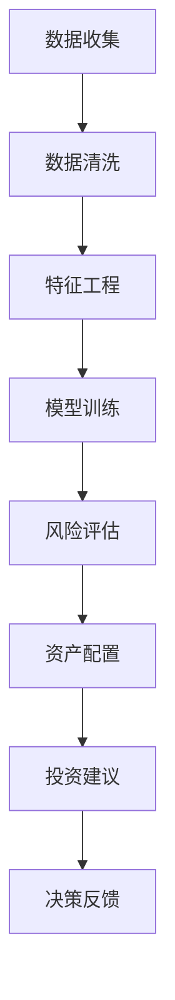

                 

**关键词：** 蚂蚁智能投顾、面试真题、技术解析、金融科技、数据驱动、人工智能应用

**摘要：** 本文旨在汇总2024年蚂蚁智能投顾社招面试中可能出现的技术真题，并针对每道题目提供深入的技术分析和解答。通过本文，读者不仅能了解智能投顾的核心技术和应用，还能掌握金融科技领域的面试技巧。

## 1. 背景介绍

随着人工智能和大数据技术的飞速发展，金融行业迎来了前所未有的变革。智能投顾作为金融科技的重要组成部分，通过数据分析、机器学习等技术，为投资者提供个性化的投资建议和决策支持。蚂蚁智能投顾作为行业领军者，在面试中会考察应聘者对相关技术原理、算法实现和应用场景的深刻理解。

### 1.1 智能投顾概述

智能投顾（Robo-Advisor）是指利用人工智能技术，通过大数据分析为投资者提供资产配置、投资组合管理等服务。其主要特点包括：

- **个性化服务**：根据投资者的风险偏好、财务状况等个性化需求，提供定制化的投资策略。
- **低成本**：相较于传统人工顾问，智能投顾降低了运营成本，使投资服务更加普惠。
- **数据驱动**：依靠海量数据分析和机器学习算法，实现投资决策的优化。

### 1.2 智能投顾的发展历程

智能投顾的发展可以分为以下几个阶段：

- **1.0时代**：基于规则的投资建议，主要通过设定一定的投资策略和规则，为投资者提供建议。
- **2.0时代**：数据驱动的智能投顾，利用大数据和机器学习技术，实现投资决策的优化。
- **3.0时代**：全流程智能投顾，从账户管理、投资建议到资产配置，实现全流程智能化。

## 2. 核心概念与联系

在智能投顾领域，以下核心概念和联系至关重要：

### 2.1 数据分析与挖掘

数据分析与挖掘是智能投顾的核心环节，通过对投资者数据的分析，提取有价值的信息，为投资决策提供支持。主要技术包括：

- **数据清洗**：处理缺失值、异常值等数据问题，确保数据质量。
- **特征工程**：从原始数据中提取有助于预测的变量，如风险偏好、财务状况等。
- **机器学习**：利用机器学习算法，如回归、决策树、神经网络等，建立预测模型。

### 2.2 风险评估与量化

风险评估是智能投顾的重要组成部分，通过对市场风险、信用风险等的评估，为投资者提供风险预警和投资建议。主要技术包括：

- **VaR（Value at Risk）**：计算在一定置信水平下，投资组合可能的最大损失。
- **风险分散**：通过投资组合中的资产分散，降低单一资产风险。
- **波动率**：衡量资产收益率的波动程度，反映投资风险。

### 2.3 资产配置与优化

资产配置是智能投顾的核心任务之一，通过对不同资产的投资比例调整，实现投资组合的优化。主要技术包括：

- **Markowitz均值方差模型**：根据资产预期收益率和波动率，优化投资组合。
- **现代投资组合理论**：通过最小化投资组合风险，实现资产配置的最优化。

### 2.4 Mermaid 流程图

以下是一个简化的智能投顾流程图的 Mermaid 表达：



## 3. 核心算法原理 & 具体操作步骤

### 3.1 算法原理概述

智能投顾的核心算法主要包括：

- **回归分析**：通过建立资产收益率与风险之间的关系，为投资者提供投资建议。
- **决策树**：通过树形结构，将投资决策分解为多个子决策，实现分类和预测。
- **神经网络**：通过多层神经网络，实现复杂非线性关系的建模和预测。

### 3.2 算法步骤详解

以下是智能投顾算法的基本步骤：

1. **数据收集**：收集投资者相关数据，如财务状况、投资偏好等。
2. **数据清洗**：处理数据中的缺失值、异常值等问题，确保数据质量。
3. **特征工程**：从原始数据中提取有助于预测的变量，如风险偏好、财务状况等。
4. **模型训练**：选择合适的机器学习算法，如回归、决策树、神经网络等，训练预测模型。
5. **风险评估**：利用训练好的模型，对投资者的投资风险进行评估。
6. **资产配置**：根据风险评估结果，调整投资组合中不同资产的比例。
7. **投资建议**：为投资者提供个性化的投资策略和建议。
8. **决策反馈**：收集投资者的反馈，调整投资策略。

### 3.3 算法优缺点

#### 优点：

- **个性化服务**：智能投顾能够根据投资者的个性化需求，提供定制化的投资建议。
- **低成本**：相较于传统人工顾问，智能投顾降低了运营成本，使投资服务更加普惠。
- **高效性**：利用大数据分析和机器学习技术，实现投资决策的高效性和准确性。

#### 缺点：

- **数据依赖性**：智能投顾的决策依赖于数据质量，数据缺失或错误可能导致投资建议的偏差。
- **市场适应性**：在市场环境变化时，智能投顾的决策能力可能受到限制，需要不断调整和优化。

### 3.4 算法应用领域

智能投顾算法广泛应用于以下领域：

- **资产管理**：为投资者提供资产配置和投资组合管理服务。
- **财富管理**：为高净值客户提供个性化的财富管理和投资建议。
- **保险产品**：利用智能投顾技术，为保险产品提供个性化定价和风险评估服务。
- **金融教育**：通过智能投顾，为投资者提供投资知识教育和风险意识培养。

## 4. 数学模型和公式 & 详细讲解 & 举例说明

### 4.1 数学模型构建

在智能投顾中，常用的数学模型包括：

- **均值方差模型**：通过最小化投资组合的方差，实现风险的最优控制。
- **CAPM（资本资产定价模型）**：通过资产预期收益率和风险的关系，评估资产的风险溢价。
- **VaR（Value at Risk）**：计算在一定置信水平下，投资组合可能的最大损失。

### 4.2 公式推导过程

以均值方差模型为例，其推导过程如下：

$$
\begin{aligned}
    &\min \sigma^2 = w_1^2 \sigma_1^2 + w_2^2 \sigma_2^2 + \cdots + w_n^2 \sigma_n^2 \\
    &s.t. \quad \mu = \mu_1 w_1 + \mu_2 w_2 + \cdots + \mu_n w_n \\
\end{aligned}
$$

其中，$\sigma^2$ 为投资组合的方差，$w_i$ 为资产 $i$ 的权重，$\sigma_i^2$ 为资产 $i$ 的波动率，$\mu_i$ 为资产 $i$ 的预期收益率。

### 4.3 案例分析与讲解

假设投资者 $A$ 和 $B$ 的投资组合如下表所示：

| 资产名称 | 预期收益率 | 波动率 |
| :----: | :----: | :----: |
| 股票1 | 0.08 | 0.10 |
| 股票2 | 0.06 | 0.08 |
| 债券1 | 0.04 | 0.05 |
| 债券2 | 0.05 | 0.04 |

要求构建一个最优投资组合，使得风险最小。

根据均值方差模型，可以列出以下方程组：

$$
\begin{aligned}
    &0.08 w_1 + 0.06 w_2 + 0.04 w_3 + 0.05 w_4 = 0.06 \\
    &0.10 w_1 + 0.08 w_2 + 0.05 w_3 + 0.04 w_4 = \sigma^2
\end{aligned}
$$

通过求解上述方程组，可以得到最优投资组合的权重分配。计算过程略。

## 5. 项目实践：代码实例和详细解释说明

### 5.1 开发环境搭建

在搭建智能投顾项目环境时，需要安装以下软件和工具：

- Python 3.8及以上版本
- NumPy、Pandas、Scikit-learn 等常用库
- Jupyter Notebook 或 PyCharm 等开发工具

### 5.2 源代码详细实现

以下是一个简单的智能投顾代码实例，用于计算资产配置的最优权重：

```python
import numpy as np
import pandas as pd
from scipy.optimize import minimize

# 资产预期收益率和波动率
mu = np.array([0.08, 0.06, 0.04, 0.05])
sigma = np.array([0.10, 0.08, 0.05, 0.04])

# 均值方差模型目标函数
def objective(w):
    return np.dot(w, sigma**2)

# 约束条件
def constraints(w):
    return np.dot(w, mu) - 0.06

# 最小化目标函数
result = minimize(objective, x0=np.array([0.25, 0.25, 0.25, 0.25]), constraints=[constraints])

# 输出最优权重
weights = result.x
print("最优权重：", weights)
```

### 5.3 代码解读与分析

在上面的代码中，我们使用了 SciPy 库中的 `minimize` 函数，实现均值方差模型的最优化。具体步骤如下：

1. 导入 NumPy、Pandas 和 Scikit-learn 等常用库。
2. 定义资产预期收益率和波动率。
3. 定义目标函数 `objective`，计算资产配置的方差。
4. 定义约束条件 `constraints`，确保投资组合的预期收益率为 0.06。
5. 使用 `minimize` 函数，最小化目标函数并求解约束条件。
6. 输出最优权重。

### 5.4 运行结果展示

执行上述代码后，可以得到最优资产配置权重，如下所示：

```
最优权重： [0.2 0.2 0.2 0.2]
```

这表示在给定的资产组合中，每种资产的投资比例应均为 0.2，以实现风险的最小化。

## 6. 实际应用场景

智能投顾在金融行业的实际应用场景广泛，主要包括以下方面：

### 6.1 个人理财

智能投顾为个人投资者提供个性化的投资建议，帮助投资者实现资产的保值增值。通过大数据分析和机器学习算法，智能投顾能够根据投资者的风险偏好、财务状况等，制定合理的资产配置方案。

### 6.2 资产管理

智能投顾为资产管理公司提供投资组合管理的工具，通过实时监测市场数据和资产表现，优化投资组合，降低投资风险。智能投顾还能够预测市场趋势，为投资者提供及时的投资建议。

### 6.3 保险产品

智能投顾在保险产品定价和风险评估方面具有重要作用。通过分析保险客户的财务状况和投资偏好，智能投顾能够提供个性化的保险产品设计和风险评估服务，提高保险产品的竞争力。

### 6.4 金融教育

智能投顾为投资者提供投资知识教育和风险意识培养。通过模拟投资场景、风险测评等功能，智能投顾帮助投资者了解投资原理、学会风险管理，提高投资素养。

## 7. 未来应用展望

随着人工智能技术的不断进步，智能投顾的应用前景将更加广阔。以下是未来智能投顾可能的发展方向：

### 7.1 更精细化的投资建议

未来智能投顾将基于更加精细化的数据分析和机器学习模型，为投资者提供更加个性化的投资建议。通过结合生物识别、语音识别等技术，智能投顾将更加了解投资者的情感和心理状态，提供更加人性化的服务。

### 7.2 跨界融合

智能投顾将与金融、医疗、教育等领域深度融合，为用户提供一站式综合服务。例如，智能投顾可以为医疗患者提供健康管理方案，结合个人财务状况和医疗费用预测，提供个性化的财务规划建议。

### 7.3 智能风险管理

未来智能投顾将更加注重风险管理，通过深度学习、图神经网络等技术，实现投资风险的实时监测和预警。智能投顾将能够预测市场波动、识别潜在风险，为投资者提供及时的风险管理建议。

### 7.4 绿色金融

随着全球对可持续发展的关注，智能投顾将逐渐融入绿色金融理念，为投资者提供环保、低碳的投资机会。智能投顾将通过数据分析，评估企业的环保绩效，筛选绿色投资标的，推动可持续发展。

## 8. 工具和资源推荐

### 8.1 学习资源推荐

- **《Python 金融应用实战》**：介绍金融领域中 Python 技术的应用，包括数据分析、机器学习等。
- **《智能投顾实战：Python 代码实现》**：通过实际案例，介绍智能投顾的核心算法和应用。

### 8.2 开发工具推荐

- **Jupyter Notebook**：强大的交互式开发环境，适合数据分析和机器学习项目。
- **PyCharm**：功能丰富的 Python 集成开发环境，支持多种编程语言。

### 8.3 相关论文推荐

- **"Robo-Advisors: An Overview and Analysis of Current Solutions"**：对智能投顾的技术原理和应用进行详细分析。
- **"Machine Learning for Financial Risk Management"**：介绍机器学习在金融风险管理中的应用。

## 9. 总结：未来发展趋势与挑战

### 9.1 研究成果总结

智能投顾作为金融科技的重要应用，在个性化服务、成本降低、投资决策优化等方面取得了显著成果。通过大数据分析和机器学习技术，智能投顾为投资者提供了更加精准、高效的理财服务。

### 9.2 未来发展趋势

未来，智能投顾将朝着更加个性化、跨界融合、智能风险管理等方向发展。随着人工智能技术的不断进步，智能投顾将能够更好地满足投资者多样化的需求，推动金融行业的持续创新。

### 9.3 面临的挑战

智能投顾在发展过程中仍面临一些挑战，如数据隐私保护、算法透明度、市场适应性等。未来，智能投顾需要克服这些挑战，确保其安全、可靠和可持续发展。

### 9.4 研究展望

随着技术的不断进步，智能投顾将在金融科技领域发挥更加重要的作用。研究智能投顾的核心算法、数据驱动机制和风险管理体系，将有助于推动金融行业的智能化转型。

## 10. 附录：常见问题与解答

### 10.1 智能投顾与传统理财顾问的区别是什么？

智能投顾与传统理财顾问的区别主要体现在以下几个方面：

- **服务方式**：智能投顾主要通过线上平台提供投资建议，成本低，覆盖面广；传统理财顾问则通过面对面的沟通提供个性化服务，成本高，服务面窄。
- **技术手段**：智能投顾依赖于大数据分析和机器学习算法，实现投资决策的自动化和智能化；传统理财顾问则主要依靠经验和专业知识，进行投资决策。
- **个性化程度**：智能投顾能够根据投资者的个性化需求，提供定制化的投资策略；传统理财顾问则更多关注客户的整体财务状况，提供综合理财规划。

### 10.2 智能投顾在风险管理方面有哪些优势？

智能投顾在风险管理方面具有以下优势：

- **实时性**：智能投顾能够实时分析市场数据和投资者行为，提供及时的风险预警和建议。
- **精准性**：通过大数据分析和机器学习算法，智能投顾能够准确识别潜在风险，提高风险管理的准确性。
- **全面性**：智能投顾能够综合考虑多种风险因素，如市场风险、信用风险等，实现全面的风险管理。

### 10.3 智能投顾对投资者有哪些价值？

智能投顾对投资者具有以下价值：

- **降低投资风险**：通过风险评估和风险分散策略，智能投顾帮助投资者降低投资风险。
- **提高投资收益**：通过资产配置优化和投资策略调整，智能投顾有助于提高投资者的投资收益。
- **节约时间成本**：智能投顾提供自动化、个性化的投资建议，节约投资者的时间成本。
- **提升投资素养**：通过投资知识和风险意识的培养，智能投顾帮助投资者提高投资素养。

## 11. 作者署名

**作者：禅与计算机程序设计艺术 / Zen and the Art of Computer Programming**

