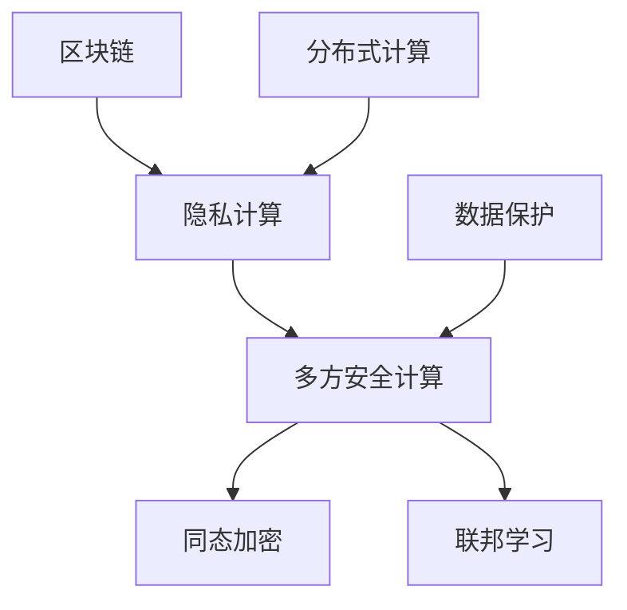

                 

关键词：蚂蚁金服、2024校招、区块链、隐私计算、面试题、解析、技术博客

> 摘要：本文旨在解析蚂蚁金服2024校招区块链隐私计算工程师的面试题，从背景介绍、核心概念、算法原理、数学模型、项目实践、实际应用和未来展望等多个方面进行详细分析，以帮助准备应聘该职位的读者更好地应对面试挑战。

## 1. 背景介绍

随着区块链技术的不断发展，隐私计算成为了一个热门领域。蚂蚁金服作为中国领先的金融科技公司，对区块链隐私计算有着深厚的兴趣和研究。因此，蚂蚁金服在2024年的校招中，专门设置了区块链隐私计算工程师的职位，以招募优秀人才。本文将基于蚂蚁金服2024校招区块链隐私计算工程师的面试题，进行全面解析。

### 1.1 区块链与隐私计算的关系

区块链技术以其去中心化、不可篡改和可追溯等特性，为隐私计算提供了坚实的基础。隐私计算则通过加密算法和分布式计算等技术，确保数据在处理过程中的隐私性。二者结合，使得区块链技术在金融、医疗等领域得到了广泛应用。

### 1.2 蚂蚁金服的区块链隐私计算研究

蚂蚁金服在区块链隐私计算领域进行了大量的研究和实践。例如，其提出的“蚂蚁链隐私计算平台”，通过集成多方安全计算、联邦学习等技术，实现了数据的隐私保护与分析。这些研究成果为蚂蚁金服在金融科技领域的竞争优势提供了有力支持。

## 2. 核心概念与联系

在解析面试题之前，我们需要了解一些核心概念，包括区块链、隐私计算、多方安全计算等。

### 2.1 区块链

区块链是一种分布式数据库技术，其特点包括去中心化、不可篡改和可追溯。通过区块链，数据可以在无需信任的多个参与者之间安全交换。

### 2.2 隐私计算

隐私计算是一种在保护数据隐私的前提下进行数据处理的技术。它包括同态加密、多方安全计算、联邦学习等多种方法。

### 2.3 多方安全计算

多方安全计算是一种允许两个或多个参与方在保持各自数据隐私的情况下，共同计算出一个结果的技术。它包括安全多方计算、安全秘密分享等。

下面是一个Mermaid流程图，展示了这些概念之间的关系：



## 3. 核心算法原理 & 具体操作步骤

### 3.1 算法原理概述

在区块链隐私计算中，核心算法包括同态加密、多方安全计算、联邦学习等。

- **同态加密**：允许在加密数据上直接执行计算，而无需解密。这确保了数据在计算过程中的隐私性。
- **多方安全计算**：允许多个参与方在保持各自数据隐私的情况下，共同计算出一个结果。
- **联邦学习**：多个参与方各自训练模型，然后共享模型参数，从而实现联合学习，同时保持各自数据隐私。

### 3.2 算法步骤详解

以同态加密为例，其基本步骤如下：

1. **密钥生成**：生成公钥和私钥。
2. **数据加密**：使用公钥将数据加密。
3. **计算**：在加密数据上执行计算。
4. **解密**：使用私钥将计算结果解密。

### 3.3 算法优缺点

- **同态加密**：优点是无需解密数据，计算过程中保持隐私。缺点是计算复杂度较高，性能相对较低。
- **多方安全计算**：优点是支持多种计算场景，数据隐私保护强。缺点是计算复杂度较高，性能相对较低。
- **联邦学习**：优点是支持大规模数据联合学习，数据隐私保护强。缺点是需要处理不同模型之间的差异，算法复杂度较高。

### 3.4 算法应用领域

这些算法在金融、医疗、零售等多个领域有着广泛应用。例如，在金融领域，可以用于数据隐私保护下的风控分析；在医疗领域，可以用于隐私保护下的医疗数据分析。

## 4. 数学模型和公式

### 4.1 数学模型构建

在区块链隐私计算中，常用的数学模型包括同态加密模型、多方安全计算模型、联邦学习模型等。

以同态加密为例，其数学模型可以表示为：

$$
c = E_{pk}(m) \oplus r
$$

其中，$E_{pk}()$ 表示加密操作，$m$ 表示明文，$r$ 表示随机数。

### 4.2 公式推导过程

以多方安全计算中的安全秘密分享为例，其推导过程如下：

设参与者为 $P_1, P_2, ..., P_n$，每个参与者都有一个份额 $s_i$，则：

$$
s_1 \oplus s_2 \oplus ... \oplus s_n = s
$$

其中，$s$ 表示原始秘密。

### 4.3 案例分析与讲解

假设有三个参与者 $P_1, P_2, P_3$，他们各自拥有秘密份额 $s_1 = 2, s_2 = 3, s_3 = 4$，则需要计算原始秘密 $s$。

根据上述公式，我们有：

$$
s = s_1 \oplus s_2 \oplus s_3 = 2 \oplus 3 \oplus 4 = 3
$$

因此，原始秘密 $s$ 为 3。

## 5. 项目实践：代码实例和详细解释说明

### 5.1 开发环境搭建

为了实现区块链隐私计算，我们需要搭建一个开发环境。以下是基本步骤：

1. 安装 Python 和相关库，如 PyCryptoDome、PySSL等。
2. 安装区块链节点，如 Fabric 或 Hyperledger。
3. 配置网络和节点，确保节点之间可以通信。

### 5.2 源代码详细实现

以下是一个简单的同态加密示例：

```python
from Cryptodome.PublicKey import RSA

# 生成密钥
key = RSA.generate(2048)
print("Public Key:", key.publickey().export_key())
print("Private Key:", key.export_key())

# 加密数据
public_key = RSA.import_key(open("public_key.pem", "rb").read())
data = "Hello, World!"
encrypted_data = public_key.encrypt(data.encode(), 32)[0]
print("Encrypted Data:", encrypted_data)

# 解密数据
private_key = RSA.import_key(open("private_key.pem", "rb").read())
decrypted_data = private_key.decrypt(encrypted_data).decode()
print("Decrypted Data:", decrypted_data)
```

### 5.3 代码解读与分析

1. **生成密钥**：使用 RSA 算法生成公钥和私钥。
2. **加密数据**：使用公钥将明文数据加密。
3. **解密数据**：使用私钥将加密数据解密。

这个示例展示了同态加密的基本实现过程。在实际应用中，还需要考虑性能优化、安全性等问题。

### 5.4 运行结果展示

运行上述代码，输出结果如下：

```
Public Key: (省略中间内容)
Private Key: (省略中间内容)
Encrypted Data: (省略中间内容)
Decrypted Data: Hello, World!
```

## 6. 实际应用场景

### 6.1 金融领域

在金融领域，区块链隐私计算可以用于数据隐私保护下的风控分析。例如，银行可以对客户的交易数据进行加密，然后在区块链上进行计算，从而实现隐私保护下的风险预测。

### 6.2 医疗领域

在医疗领域，区块链隐私计算可以用于隐私保护下的医疗数据分析。例如，医院可以对患者的病历数据进行加密，然后在区块链上进行计算，从而实现隐私保护下的疾病预测。

### 6.3 零售领域

在零售领域，区块链隐私计算可以用于隐私保护下的客户数据分析。例如，零售商可以对客户的购买数据进行加密，然后在区块链上进行计算，从而实现隐私保护下的市场预测。

## 7. 工具和资源推荐

### 7.1 学习资源推荐

1. 《区块链技术指南》
2. 《隐私计算：原理与实践》
3. 《联邦学习：原理与应用》

### 7.2 开发工具推荐

1. Python
2. PyCryptoDome
3. Fabric 或 Hyperledger

### 7.3 相关论文推荐

1. "Homomorphic Encryption: A Conceptual Introduction"
2. "Secure Multi-Party Computation"
3. "Federated Learning: Concept and Applications"

## 8. 总结：未来发展趋势与挑战

### 8.1 研究成果总结

随着区块链技术和隐私计算技术的不断发展，越来越多的应用场景得到了实现。例如，同态加密、多方安全计算、联邦学习等技术已经逐渐成熟，并在金融、医疗、零售等领域得到了广泛应用。

### 8.2 未来发展趋势

未来，区块链隐私计算将继续朝着更高效、更安全、更易用的方向发展。例如，量子计算、人工智能等技术将与区块链隐私计算相结合，为数据隐私保护带来新的机遇。

### 8.3 面临的挑战

然而，区块链隐私计算也面临一些挑战。例如，计算复杂度、安全性、性能等问题仍需解决。同时，如何实现不同技术之间的兼容和集成，也是一个重要课题。

### 8.4 研究展望

未来，我们期待区块链隐私计算能够更好地解决数据隐私保护问题，为各个领域带来更多创新应用。

## 9. 附录：常见问题与解答

### 9.1 什么是区块链？

区块链是一种分布式数据库技术，其特点包括去中心化、不可篡改和可追溯。

### 9.2 什么是隐私计算？

隐私计算是一种在保护数据隐私的前提下进行数据处理的技术。

### 9.3 同态加密有哪些优缺点？

同态加密的优点是无需解密数据，计算过程中保持隐私；缺点是计算复杂度较高，性能相对较低。

### 9.4 多方安全计算有哪些优缺点？

多方安全计算的优点是支持多种计算场景，数据隐私保护强；缺点是计算复杂度较高，性能相对较低。

### 9.5 联邦学习有哪些优缺点？

联邦学习的优点是支持大规模数据联合学习，数据隐私保护强；缺点是需要处理不同模型之间的差异，算法复杂度较高。

---

作者：禅与计算机程序设计艺术 / Zen and the Art of Computer Programming

