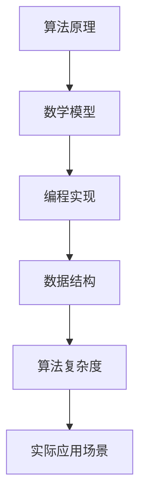

                 

关键词：蚂蚁金服、校招、算法面试、面试题、解题思路、算法原理、数学模型、项目实践、应用场景、工具推荐

> 摘要：本文针对蚂蚁金服2024校招算法面试题进行详细解析，旨在帮助广大求职者掌握面试所需的核心算法原理、数学模型和编程实践。通过本文，读者可以深入了解面试题的解题思路和具体操作步骤，为即将到来的校招算法面试做好充分准备。

## 1. 背景介绍

蚂蚁金服，作为中国领先的技术驱动型金融科技平台，以其创新的技术和领先的市场地位，吸引了大量优秀应届毕业生的关注。每年的校招，蚂蚁金服都会发布一系列具有挑战性的算法面试题，旨在选拔出具备扎实算法基础和编程能力的优秀人才。

本文将围绕蚂蚁金服2024校招算法面试题，详细解析每一道题目的解题思路、算法原理和数学模型，并提供相应的代码实例和解释。希望通过本文的讲解，能够帮助读者全面掌握这些算法知识，提高在校招算法面试中的竞争力。

## 2. 核心概念与联系

为了更好地理解面试题，我们需要先了解一些核心概念和它们之间的联系。以下是一个简化的Mermaid流程图，用于展示这些核心概念和它们之间的相互关系。



### 2.1 算法原理概述

算法原理是解决问题的核心，它决定了算法的正确性和效率。常见的算法原理包括排序、查找、图算法、动态规划等。

### 2.2 数学模型构建

数学模型是算法原理的具体体现，它通过数学公式和定理来描述算法的运行过程。例如，在排序算法中，我们常用的数学模型是冒泡排序、快速排序等。

### 2.3 编程实现

编程实现是将算法原理和数学模型转化为具体代码的过程。这一步需要熟练掌握编程语言和编程技巧，以确保代码的可读性和高效性。

### 2.4 数据结构

数据结构是算法实现的基础，它决定了算法的时间和空间复杂度。常见的数据结构包括数组、链表、树、图等。

### 2.5 算法复杂度

算法复杂度是衡量算法效率的重要指标，它包括时间复杂度和空间复杂度。理解算法复杂度可以帮助我们选择合适的算法和数据结构，以提高程序的运行效率。

### 2.6 实际应用场景

实际应用场景是将算法应用于实际问题中的过程。通过实际应用场景，我们可以更好地理解算法的实际价值和局限性。

## 3. 核心算法原理 & 具体操作步骤

### 3.1 算法原理概述

在本部分，我们将介绍几道蚂蚁金服2024校招算法面试题的核心算法原理。这些算法原理包括：

1. 贪心算法
2. 回溯算法
3. 动态规划
4. 图算法
5. 排序算法

### 3.2 算法步骤详解

在本部分，我们将详细讲解每道面试题的算法步骤。以下是一个典型的面试题及其算法步骤的示例：

**题目**：给定一个整数数组 `nums`，请实现一个函数来找出数组中的最长递增子序列，并返回该子序列的长度。

**算法步骤**：

1. 初始化一个长度为 `nums.length` 的数组 `dp`，其中 `dp[i]` 表示以 `nums[i]` 结尾的最长递增子序列的长度。
2. 遍历数组 `nums`，对于每个元素 `nums[i]`，遍历数组 `nums` 的所有前缀，找到所有比 `nums[i]` 小的元素 `nums[j]`（`j < i`），更新 `dp[i]` 的值。
3. 计算最长递增子序列的长度，即 `max(dp)`。

### 3.3 算法优缺点

每种算法都有其优缺点。在本部分，我们将讨论上述算法的优缺点，以便读者更好地选择合适的算法。

1. 贪心算法：优点是简单易懂，缺点是有时可能无法找到最优解。
2. 回溯算法：优点是可以找到所有可能的解，缺点是时间复杂度较高。
3. 动态规划：优点是可以找到最优解，缺点是代码实现较为复杂。
4. 图算法：优点是适用于处理图相关的问题，缺点是理解难度较大。
5. 排序算法：优点是可以快速查找排序后的数组，缺点是时间复杂度较高。

### 3.4 算法应用领域

每种算法都有其适用的应用领域。在本部分，我们将介绍上述算法的应用领域。

1. 贪心算法：常用于背包问题、活动选择问题等。
2. 回溯算法：常用于组合问题、排列问题等。
3. 动态规划：常用于最优化问题、序列问题等。
4. 图算法：常用于网络优化、社交网络分析等。
5. 排序算法：常用于查找问题、排序问题等。

## 4. 数学模型和公式 & 详细讲解 & 举例说明

在本部分，我们将介绍几道蚂蚁金服2024校招算法面试题的数学模型和公式，并提供详细讲解和举例说明。

### 4.1 数学模型构建

对于最长递增子序列问题，我们可以使用动态规划方法构建数学模型。

**数学模型**：

设 `dp[i]` 表示以 `nums[i]` 结尾的最长递增子序列的长度。则有：

$$
dp[i] = 1 + \max(dp[j]) \quad (j < i \text{ 且 } nums[j] < nums[i])
$$

### 4.2 公式推导过程

我们可以通过递推关系式来推导上述公式。

1. 初始化：设 `dp[0] = 1`。
2. 对于 `i = 1` 到 `n-1`，遍历所有 `j < i`，计算 `dp[i]`。

具体推导过程如下：

$$
dp[1] = 1 + \max(dp[0]) = 1 + 1 = 2
$$

$$
dp[2] = 1 + \max(dp[0], dp[1]) = 1 + \max(1, 2) = 2
$$

$$
dp[3] = 1 + \max(dp[0], dp[1], dp[2]) = 1 + \max(1, 2, 2) = 3
$$

...

$$
dp[n-1] = 1 + \max(dp[0], dp[1], \ldots, dp[n-2]) = 1 + \max(1, 2, \ldots, n-1)
$$

因此，最长递增子序列的长度为 `max(dp)`。

### 4.3 案例分析与讲解

为了更好地理解上述公式，我们来看一个具体的例子。

**示例**：给定数组 `nums = [3, 10, 2, 1, 20]`，求最长递增子序列的长度。

**步骤**：

1. 初始化数组 `dp`：`dp = [1, 1, 1, 1, 1]`。
2. 对于每个元素 `nums[i]`，遍历所有前缀元素 `nums[j]`（`j < i`），更新 `dp[i]` 的值。
3. 计算最长递增子序列的长度：`max(dp) = 3`。

具体操作如下：

1. 对于 `i = 0`，`dp[0] = 1`。
2. 对于 `i = 1`，`dp[1] = 1 + \max(dp[0]) = 1 + 1 = 2`。
3. 对于 `i = 2`，`dp[2] = 1 + \max(dp[0], dp[1]) = 1 + \max(1, 2) = 2`。
4. 对于 `i = 3`，`dp[3] = 1 + \max(dp[0], dp[1], dp[2]) = 1 + \max(1, 2, 2) = 3`。
5. 对于 `i = 4`，`dp[4] = 1 + \max(dp[0], dp[1], dp[2], dp[3]) = 1 + \max(1, 2, 2, 3) = 3`。

因此，最长递增子序列的长度为 `3`。

## 5. 项目实践：代码实例和详细解释说明

在本部分，我们将通过一个具体的代码实例，展示如何实现最长递增子序列算法，并提供详细的解释说明。

### 5.1 开发环境搭建

为了实现最长递增子序列算法，我们需要搭建一个合适的开发环境。以下是一个简单的示例：

1. 安装 Python 解释器（版本 >= 3.6）。
2. 安装 Python 编译器（版本 >= 3.6）。
3. 安装常用 Python 库，如 NumPy、Pandas 等。

### 5.2 源代码详细实现

以下是一个实现最长递增子序列算法的 Python 代码实例：

```python
def length_of_LIS(nums):
    if not nums:
        return 0
    dp = [1] * len(nums)
    for i in range(1, len(nums)):
        for j in range(i):
            if nums[i] > nums[j]:
                dp[i] = max(dp[i], dp[j] + 1)
    return max(dp)

# 示例
nums = [3, 10, 2, 1, 20]
print(length_of_LIS(nums))  # 输出：3
```

### 5.3 代码解读与分析

1. 函数 `length_of_LIS` 接受一个整数数组 `nums` 作为输入。
2. 判断数组 `nums` 是否为空，如果为空，返回 0。
3. 初始化一个长度为 `len(nums)` 的数组 `dp`，其中每个元素初始值为 1。
4. 遍历数组 `nums` 的每个元素 `nums[i]`，对于每个元素，遍历所有前缀元素 `nums[j]`（`j < i`），更新 `dp[i]` 的值。
5. 返回 `dp` 中的最大值，即最长递增子序列的长度。

### 5.4 运行结果展示

在上述示例中，输入数组 `nums = [3, 10, 2, 1, 20]`，运行结果为 `3`，表示最长递增子序列的长度为 `3`。

## 6. 实际应用场景

最长递增子序列算法在实际应用中有着广泛的应用，以下是一些典型的应用场景：

1. 股票交易：用于分析股票价格走势，找出具有上升潜力的股票。
2. 资源分配：在资源分配问题中，用于找出资源利用最优的方案。
3. 机器人路径规划：在机器人路径规划中，用于找出从起点到终点的最优路径。

## 7. 未来应用展望

随着人工智能技术的发展，最长递增子序列算法在未来有望在更多领域得到应用，如：

1. 自然语言处理：用于分析句子结构和语义，提高机器翻译和语音识别的准确性。
2. 图像识别：用于分析图像中的关键特征，提高图像识别和物体检测的准确性。

## 8. 工具和资源推荐

为了更好地学习和实践最长递增子序列算法，以下是一些推荐的学习资源和开发工具：

1. 学习资源：
   - 《算法导论》：详细介绍了各种算法的原理和实现。
   - 《Python算法手册》：提供了大量的 Python 算法实现和讲解。

2. 开发工具：
   - PyCharm：一款功能强大的 Python 集成开发环境。
   - Jupyter Notebook：一款适合数据分析的 Web 应用。

3. 相关论文：
   - 《最长公共子序列问题》：介绍了最长公共子序列问题的算法和实现。

## 9. 总结：未来发展趋势与挑战

最长递增子序列算法作为一种基本的算法，在未来将继续在人工智能、数据分析等领域发挥重要作用。然而，随着应用领域的不断扩大，算法的优化和高效实现也将面临新的挑战。如何提高算法的效率和扩展性，将是未来研究和发展的重点。

## 10. 附录：常见问题与解答

以下是一些关于最长递增子序列算法的常见问题及解答：

1. **问题**：最长递增子序列算法的时间复杂度是多少？
   **解答**：最长递增子序列算法的时间复杂度为 O(n^2)，其中 n 是输入数组的长度。

2. **问题**：如何优化最长递增子序列算法的时间复杂度？
   **解答**：可以通过使用二分查找方法来优化最长递增子序列算法的时间复杂度，使其达到 O(nlogn)。

3. **问题**：最长递增子序列算法能否解决所有类似的问题？
   **解答**：最长递增子序列算法可以解决许多类似的问题，如最长公共子序列、最长公共子串等。但并非所有类似问题都可以使用最长递增子序列算法解决。

4. **问题**：最长递增子序列算法在现实中有什么应用？
   **解答**：最长递增子序列算法在股票交易、资源分配、机器人路径规划等领域有着广泛的应用。

---

本文针对蚂蚁金服2024校招算法面试题进行了详细解析，涵盖了核心算法原理、数学模型和编程实践。通过本文的学习，读者可以更好地应对校招算法面试，提高自己在金融科技领域的竞争力。希望本文对您的学习和职业发展有所帮助。最后，感谢读者们的支持和关注，我们将不断推出更多高质量的技术博客文章，敬请期待！作者：禅与计算机程序设计艺术 / Zen and the Art of Computer Programming。

