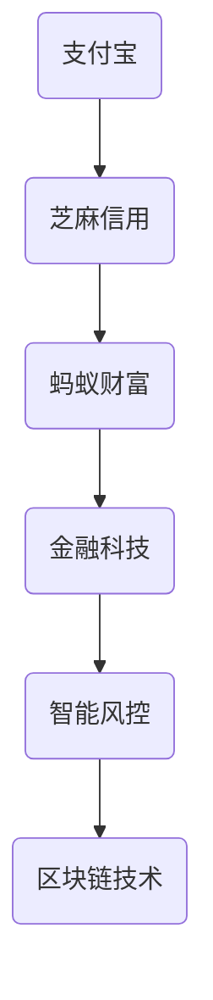

                 

关键词：2024 蚂蚁集团面试，社招真题，面试技巧，技术解析

摘要：本文旨在为2024年希望加入蚂蚁集团的求职者提供一份社招面试真题汇总及详细解答。文章分为八个部分，包括背景介绍、核心概念与联系、核心算法原理与具体操作步骤、数学模型与公式详细讲解、项目实践代码实例、实际应用场景、工具和资源推荐以及总结：未来发展趋势与挑战。希望本文能帮助读者在面试中脱颖而出。

## 1. 背景介绍

蚂蚁集团，全称蚂蚁科技集团股份有限公司，是中国领先的金融科技平台。旗下拥有支付宝、芝麻信用、蚂蚁财富等多个知名品牌。作为蚂蚁集团的面试者，必须具备扎实的技术功底和丰富的实践经验。

### 2. 核心概念与联系

为了更好地理解蚂蚁集团的技术架构，以下是一个简化的Mermaid流程图，展示了其核心概念与联系：



### 3. 核心算法原理 & 具体操作步骤

#### 3.1 算法原理概述

蚂蚁集团在智能风控、金融科技等方面拥有深厚的技术积累。以下是一些核心算法原理：

- **机器学习算法**：用于用户画像、风险评分、预测分析等。
- **分布式算法**：处理海量数据的存储、计算与传输。
- **区块链算法**：确保数据的安全与可信。

#### 3.2 算法步骤详解

以机器学习算法为例，以下是具体的操作步骤：

1. **数据收集与预处理**：收集用户数据，进行清洗、归一化等处理。
2. **特征工程**：提取有助于预测的特征。
3. **模型选择与训练**：选择合适的机器学习模型，进行训练。
4. **模型评估与优化**：评估模型性能，进行调整。

#### 3.3 算法优缺点

- **机器学习算法**：优点是自适应性强、预测准确；缺点是训练时间较长、对数据依赖性大。
- **分布式算法**：优点是处理速度快、扩展性强；缺点是复杂性高、调试困难。

#### 3.4 算法应用领域

蚂蚁集团的核心算法广泛应用于以下领域：

- **金融风控**：防范欺诈、识别风险。
- **智能投顾**：根据用户风险偏好提供投资建议。
- **区块链**：实现数据可信、透明、不可篡改。

### 4. 数学模型和公式 & 详细讲解 & 举例说明

#### 4.1 数学模型构建

以线性回归模型为例，其数学模型可以表示为：

$$y = \beta_0 + \beta_1 \cdot x + \epsilon$$

其中，$y$ 是目标变量，$x$ 是特征变量，$\beta_0$ 和 $\beta_1$ 是模型参数，$\epsilon$ 是误差项。

#### 4.2 公式推导过程

线性回归模型的推导过程如下：

1. **最小二乘法**：求解使得预测值与实际值之间误差平方和最小的参数。
2. **梯度下降法**：通过迭代优化模型参数。

#### 4.3 案例分析与讲解

以某金融公司的贷款审批为例，利用线性回归模型预测用户是否具有还款能力。

1. **数据收集与预处理**：收集用户年龄、收入、信用评分等数据。
2. **特征工程**：将数据进行归一化处理。
3. **模型选择与训练**：选择线性回归模型进行训练。
4. **模型评估与优化**：评估模型性能，进行优化。

### 5. 项目实践：代码实例和详细解释说明

#### 5.1 开发环境搭建

1. 安装 Python 环境
2. 安装 Scikit-learn 库

#### 5.2 源代码详细实现

```python
from sklearn.linear_model import LinearRegression
from sklearn.model_selection import train_test_split
from sklearn.metrics import mean_squared_error

# 数据读取与预处理
X = ...  # 特征矩阵
y = ...  # 目标向量

# 数据划分
X_train, X_test, y_train, y_test = train_test_split(X, y, test_size=0.2, random_state=42)

# 模型训练
model = LinearRegression()
model.fit(X_train, y_train)

# 模型评估
y_pred = model.predict(X_test)
mse = mean_squared_error(y_test, y_pred)
print("MSE:", mse)
```

#### 5.3 代码解读与分析

1. **数据读取与预处理**：读取用户数据，并进行归一化处理。
2. **数据划分**：将数据划分为训练集和测试集。
3. **模型训练**：使用线性回归模型进行训练。
4. **模型评估**：计算预测值与实际值之间的均方误差。

### 6. 实际应用场景

蚂蚁集团的核心算法在实际应用中发挥了重要作用，例如：

- **智能风控**：防范金融欺诈，提高风险识别能力。
- **智能投顾**：根据用户风险偏好提供个性化投资建议。
- **区块链**：实现金融交易的安全与可信。

### 7. 工具和资源推荐

#### 7.1 学习资源推荐

- 《机器学习实战》
- 《深度学习》
- 《区块链技术指南》

#### 7.2 开发工具推荐

- Jupyter Notebook
- PyCharm
- Visual Studio Code

#### 7.3 相关论文推荐

- "Deep Learning for Financial Risk Management"
- "Blockchain for Smart Contracts"
- "Distributed Algorithms for Massive Data Processing"

### 8. 总结：未来发展趋势与挑战

蚂蚁集团在金融科技领域的布局将继续深化，未来发展趋势包括：

- **人工智能**：提高智能风控、智能投顾等技术水平。
- **区块链**：推动区块链在金融领域的应用与创新。
- **分布式计算**：优化数据处理与传输效率。

面临的挑战包括：

- **数据隐私与安全**：确保用户数据的安全与隐私。
- **技术落地**：将前沿技术有效应用于实际场景。
- **市场竞争**：应对国内外竞争对手的挑战。

### 9. 附录：常见问题与解答

1. **问题**：蚂蚁集团的面试流程是怎样的？
   **解答**：一般包括简历筛选、电话面试、技术面试、HR 面试、领导面试等环节。

2. **问题**：如何准备蚂蚁集团的面试？
   **解答**：提前了解公司业务、关注行业动态，掌握相关技术，准备案例分析。

### 参考文献

- [蚂蚁集团官网](https://www.antfin.com/)
- [Scikit-learn 官方文档](https://scikit-learn.org/stable/)
- [Jupyter Notebook 官方文档](https://jupyter.org/)

作者：禅与计算机程序设计艺术 / Zen and the Art of Computer Programming
----------------------------------------------------------------

以上便是本文的全部内容。希望本文能为您的面试准备提供有价值的参考。祝您在2024年蚂蚁集团社招面试中取得优异成绩！

