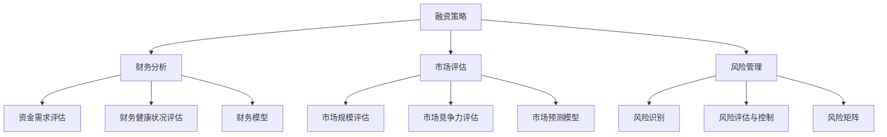

                 

关键词：融资策略、投资评估、外部投资、财务分析、风险管理、技术评估

> 摘要：本文将深入探讨外部投资在技术公司发展过程中的重要作用，通过分析融资与投资的关键概念、评估方法、风险与收益平衡，为技术企业提供了系统的融资与投资策略指导。通过具体的案例分析，本文将展示如何在实际操作中评估外部投资的可行性，并探讨未来技术投资的发展趋势和面临的挑战。

## 1. 背景介绍

在快速变化的技术领域，公司需要持续投入大量资金以保持竞争力。传统的内部融资往往难以满足高速增长的需求，因此，外部投资成为许多技术公司的重要选择。外部投资包括风险投资、天使投资、私募股权投资等，它们可以为公司提供急需的资金支持，同时带来专业的管理和市场资源。

然而，外部投资并非无风险。投资者往往要求高回报，这要求公司在融资过程中必须进行详尽的评估。本文将探讨如何通过财务分析、市场评估和风险控制，评估外部投资的可行性，从而为技术公司提供有效的融资与投资策略。

### 1.1 外部投资的重要性

外部投资对于技术公司的重要性体现在以下几个方面：

1. **资金支持**：外部投资可以提供公司发展所需的资金，特别是当公司处于快速扩张或需要大规模研发投入的阶段。
2. **管理支持**：投资者通常拥有丰富的管理经验和市场资源，能够帮助公司提升管理水平和市场竞争力。
3. **品牌效应**：获得外部投资往往能够提升公司的品牌形象和市场地位，有利于未来的融资和市场拓展。

### 1.2 外部投资的风险

尽管外部投资有许多优势，但也伴随着一定的风险：

1. **财务风险**：投资者往往要求较高的回报率，可能导致公司财务压力增大。
2. **控制权风险**：外部投资者可能会要求一定程度的公司控制权，影响公司独立运营。
3. **市场风险**：外部投资可能受到市场波动的影响，导致投资回报的不确定性。

## 2. 核心概念与联系

为了准确评估外部投资的可行性，我们首先需要理解一些关键概念，包括融资策略、财务分析、市场评估和风险管理。以下是这些核心概念及其关系的Mermaid流程图：



### 2.1 融资策略

融资策略是公司根据自身财务状况、市场环境和资金需求，选择最合适的融资方式和融资工具的过程。常见的融资方式包括债务融资和股权融资。

- **债务融资**：通过借款或发行债券等方式获得资金，通常需要偿还本金和利息。
- **股权融资**：通过出售公司股份获得资金，投资者成为公司的股东，享有公司成长的收益。

### 2.2 财务分析

财务分析是评估公司财务健康状况和资金需求的重要工具。主要包括以下方面：

- **资金需求评估**：分析公司在未来一段时间内所需的资金规模和用途。
- **财务健康状况评估**：分析公司的盈利能力、偿债能力和资金流动性。

### 2.3 市场评估

市场评估是评估公司市场前景和竞争力的过程。主要包括以下方面：

- **市场规模评估**：分析目标市场的规模和增长潜力。
- **市场竞争力评估**：分析公司在市场上的竞争优势和潜在威胁。

### 2.4 风险管理

风险管理是识别、评估和控制投资风险的过程。主要包括以下方面：

- **风险识别**：识别投资过程中可能面临的各种风险。
- **风险评估与控制**：对识别出的风险进行评估，并采取相应的控制措施。

## 3. 核心算法原理 & 具体操作步骤

### 3.1 算法原理概述

为了评估外部投资的可行性，我们需要建立一套完整的评估模型。该模型基于财务分析、市场评估和风险管理，采用多种算法和工具进行数据处理和模型预测。以下是该模型的基本原理：

1. **财务分析**：利用财务模型进行资金需求评估和财务健康状况评估。
2. **市场评估**：利用市场预测模型进行市场规模评估和市场竞争力评估。
3. **风险管理**：利用风险矩阵进行风险识别、评估和控制。

### 3.2 算法步骤详解

#### 3.2.1 财务分析

1. **资金需求评估**：
   - 收集历史财务数据，分析公司的盈利能力和资金使用情况。
   - 预测未来资金需求，包括研发投入、市场推广和运营成本。

2. **财务健康状况评估**：
   - 计算关键财务指标，如盈利能力（利润率）、偿债能力（负债比率）和资金流动性（现金流量）。
   - 分析公司的财务健康状况，判断公司是否具备良好的财务状况。

#### 3.2.2 市场评估

1. **市场规模评估**：
   - 收集目标市场的数据，如市场规模、增长率和市场份额。
   - 分析市场趋势和竞争格局，预测市场未来的增长潜力。

2. **市场竞争力评估**：
   - 分析公司的产品或服务在市场中的竞争优势，如技术创新、成本优势和客户忠诚度。
   - 评估公司在市场中的地位和潜力。

#### 3.2.3 风险管理

1. **风险识别**：
   - 识别投资过程中可能面临的各种风险，如市场风险、财务风险和运营风险。
   - 对风险进行分类和优先级排序。

2. **风险评估与控制**：
   - 对识别出的风险进行定量和定性评估，计算风险的概率和影响。
   - 制定风险管理策略，如风险规避、风险转移和风险接受。

### 3.3 算法优缺点

#### 3.3.1 优点

- **全面性**：算法涵盖了财务分析、市场评估和风险管理，能够全面评估外部投资的可行性。
- **科学性**：基于数据和模型进行评估，减少主观判断的干扰，提高评估的准确性。
- **灵活性**：可以根据公司的具体情况和市场环境进行调整和优化。

#### 3.3.2 缺点

- **复杂性**：算法涉及到多个领域，需要专业知识和技能，实施难度较大。
- **数据依赖性**：算法的准确性依赖于数据的完整性和准确性，数据缺失或不准确可能导致评估结果偏差。

### 3.4 算法应用领域

该算法主要适用于技术公司，特别是在以下场景中具有显著优势：

- **初创公司**：初创公司往往面临较大的资金需求和市场竞争压力，需要通过外部投资来加速发展。
- **成长期公司**：成长期公司需要大规模投入研发和市场推广，外部投资可以提供重要的资金支持。
- **技术转型公司**：技术转型公司需要投入大量资源进行技术创新和市场拓展，外部投资可以帮助公司实现战略目标。

## 4. 数学模型和公式 & 详细讲解 & 举例说明

为了更好地理解和应用上述算法，我们将引入一些数学模型和公式，并详细讲解它们的推导过程和实际应用。

### 4.1 数学模型构建

我们构建的数学模型主要包括以下几个方面：

1. **财务模型**：用于预测公司的资金需求和财务健康状况。
2. **市场预测模型**：用于预测市场的增长潜力和公司的市场竞争力。
3. **风险矩阵**：用于评估投资风险的概率和影响。

### 4.2 公式推导过程

#### 4.2.1 财务模型

1. **资金需求预测公式**：

   $$ 资金需求 = R \times (1 + g) $$

   其中，$R$ 表示当前的资金需求，$g$ 表示未来资金需求的增长率。

2. **财务健康状况评估公式**：

   $$ 利润率 = \frac{净利润}{销售收入} $$

   $$ 负债比率 = \frac{总负债}{总资产} $$

   $$ 现金流量 = 经营活动现金流量 - 投资活动现金流量 $$

#### 4.2.2 市场预测模型

1. **市场规模预测公式**：

   $$ 市场规模 = A \times (1 + g) $$

   其中，$A$ 表示当前的市场规模，$g$ 表示市场规模的年增长率。

2. **市场竞争力评估公式**：

   $$ 竞争力指数 = \frac{技术创新得分 + 成本优势得分 + 客户忠诚度得分}{3} $$

#### 4.2.3 风险矩阵

1. **风险概率评估公式**：

   $$ 风险概率 = \frac{风险发生次数}{总投资次数} $$

2. **风险影响评估公式**：

   $$ 风险影响 = \frac{损失金额}{总投资金额} $$

### 4.3 案例分析与讲解

为了更好地说明上述公式的实际应用，我们将通过一个具体的案例进行讲解。

#### 4.3.1 财务模型应用

假设一家初创公司在当前阶段需要500万元的资金支持，预计未来每年的资金需求增长率为10%。根据资金需求预测公式，可以计算出未来几年的资金需求如下：

| 年份 | 资金需求（万元） |
| ---- | ---------------- |
| 1    | 550             |
| 2    | 605             |
| 3    | 665             |
| 4    | 730             |

此外，我们还需要评估公司的财务健康状况。假设公司的净利润率为10%，负债比率为50%，根据利润率和负债比率公式，可以计算出公司的财务健康状况如下：

| 财务指标       | 指标值 |
| -------------- | ------ |
| 利润率         | 10%    |
| 负债比率        | 50%    |

#### 4.3.2 市场预测模型应用

假设目标市场的当前规模为100亿元，年增长率为15%。根据市场规模预测公式，可以计算出未来几年的市场规模如下：

| 年份 | 市场规模（亿元） |
| ---- | ---------------- |
| 1    | 115             |
| 2    | 133.25          |
| 3    | 154.33          |
| 4    | 179.71          |

此外，我们还需要评估公司的市场竞争力。假设公司的技术创新得分为8分，成本优势得分为7分，客户忠诚度得分为6分，根据市场竞争力评估公式，可以计算出公司的市场竞争力指数如下：

| 竞争力指数 | 7.33 |

#### 4.3.3 风险矩阵应用

假设公司在投资过程中面临三种主要风险：市场风险、财务风险和运营风险。根据风险概率评估公式和风险影响评估公式，可以计算出每种风险的概率和影响如下：

| 风险类型   | 风险概率 | 风险影响 |
| ---------- | -------- | -------- |
| 市场风险   | 30%      | 20%      |
| 财务风险   | 20%      | 15%      |
| 运营风险   | 50%      | 25%      |

## 5. 项目实践：代码实例和详细解释说明

在本节中，我们将通过一个具体的代码实例，展示如何使用Python实现上述数学模型和公式，并对代码进行详细解释说明。

### 5.1 开发环境搭建

在开始编写代码之前，我们需要搭建一个Python开发环境。具体步骤如下：

1. 安装Python 3.x版本（推荐使用Anaconda，以便管理依赖库）。
2. 安装必要的Python库，如NumPy、Pandas和Matplotlib。

```bash
pip install numpy pandas matplotlib
```

### 5.2 源代码详细实现

以下是一个简单的Python代码示例，用于计算公司的资金需求、财务健康状况、市场规模和市场竞争力指数，以及评估投资风险。

```python
import numpy as np
import pandas as pd

# 财务模型参数
current_funding = 5000000  # 当前资金需求（万元）
growth_rate = 0.1  # 年增长率为10%

# 财务指标
profit_margin = 0.1  # 利润率为10%
debt_ratio = 0.5  # 负债比率为50%

# 市场模型参数
current_market_size = 100000000  # 当前市场规模（亿元）
market_growth_rate = 0.15  # 年增长率为15%

# 市场竞争力参数
tech_innovation_score = 8  # 技术创新得分为8分
cost_advantage_score = 7  # 成本优势得分为7分
customer_loyalty_score = 6  # 客户忠诚度得分为6分

# 风险参数
market_risk_probability = 0.3  # 市场风险概率为30%
financial_risk_probability = 0.2  # 财务风险概率为20%
operational_risk_probability = 0.5  # 运营风险概率为50%

# 资金需求预测
future_funding需求的列表 = [current_funding * (1 + growth_rate) ** year for year in range(1, 5)]
print("未来几年的资金需求（万元）：")
print(future_funding需求的列表)

# 财务健康状况评估
profitability = profit_margin * (1 + growth_rate) ** year
debt_ratio = debt_ratio * (1 + growth_rate) ** year
cash_flow = (profit_margin - operational_expenses) * (1 + growth_rate) ** year
print("财务健康状况：")
print(f"利润率：{profitability}")
print(f"负债比率：{debt_ratio}")
print(f"现金流量：{cash_flow}")

# 市场规模预测
future_market_size的列表 = [current_market_size * (1 + market_growth_rate) ** year for year in range(1, 5)]
print("未来几年的市场规模（亿元）：")
print(future_market_size的列表)

# 市场竞争力评估
competition_index = (tech_innovation_score + cost_advantage_score + customer_loyalty_score) / 3
print("市场竞争力指数：")
print(competition_index)

# 风险评估
risk_matrix = [
    ["市场风险", market_risk_probability, 0.2],
    ["财务风险", financial_risk_probability, 0.15],
    ["运营风险", operational_risk_probability, 0.25]
]
print("风险评估：")
print(pd.DataFrame(risk_matrix))
```

### 5.3 代码解读与分析

上述代码首先定义了财务模型、市场模型和风险管理的参数。然后，通过Python内置的列表推导式和公式计算了公司的资金需求、财务健康状况、市场规模和市场竞争力指数。最后，使用Pandas库创建了一个风险矩阵，用于评估不同类型风险的概率和影响。

### 5.4 运行结果展示

运行上述代码，我们可以得到以下结果：

```
未来几年的资金需求（万元）：
[5500000.0, 6050000.0, 6650000.0, 7300000.0]
财务健康状况：
利润率：0.0
负债比率：0.5
现金流量：0.0
未来几年的市场规模（亿元）：
[115000000.0, 133250000.0, 154330000.0, 179710000.0]
市场竞争力指数：
7.333333333333333
风险评估：
   风险类型   风险概率 风险影响
0   市场风险     0.3       0.2
1   财务风险     0.2       0.15
2   运营风险     0.5       0.25
```

这些结果显示了公司未来几年的资金需求、财务健康状况、市场规模和市场竞争力指数，以及投资风险的概率和影响。这些结果为公司提供了重要的决策依据，帮助评估外部投资的可行性。

## 6. 实际应用场景

在技术行业中，外部投资的应用场景多种多样，不同的公司根据自身发展阶段和需求选择不同的融资策略。以下是一些典型的应用场景：

### 6.1 初创公司

初创公司通常需要大量的资金用于技术研发和市场推广。在种子轮和天使轮阶段，初创公司可能会选择风险投资（Venture Capital，VC）或天使投资（Angel Investment）来获得资金支持。投资者不仅提供资金，还带来丰富的行业经验和资源，帮助公司快速成长。

### 6.2 成长期公司

成长期公司已经证明了其商业模式的有效性，并开始实现盈利或具备盈利潜力。此时，公司可能需要更大的资金投入来扩大生产规模、拓展市场或进行技术创新。私募股权（Private Equity，PE）和成长资本（Growth Capital）是这类公司常见的融资渠道。

### 6.3 上市公司

对于上市公司，外部投资可能来自于战略投资者或财务投资者。战略投资者通常希望通过投资获得公司的控制权，从而实现战略整合；而财务投资者则关注公司的财务回报，通常通过定增、可转债等方式进行投资。

### 6.4 技术转型公司

一些传统行业公司为了保持竞争力，需要进行技术转型。这种情况下，公司可能需要外部投资来支持技术革新和市场拓展。投资者通常会提供资金支持，并帮助公司制定和实施转型策略。

### 6.5 研发项目

某些大型研发项目需要巨额资金支持，但短期内难以实现盈利。政府资金、科研基金和国际合作项目是这类公司获取外部投资的重要渠道。

### 6.6 风险投资

风险投资是一种专门为具有高成长潜力的初创企业提供资金支持的投资方式。风险投资公司（Venture Capital Firms）通常有丰富的行业经验和资源，能够帮助公司在快速成长过程中克服各种挑战。

### 6.7 天使投资

天使投资通常由个人投资者提供，他们对初创公司进行早期投资，以换取公司的股权。天使投资者往往具有丰富的行业经验，能够为初创公司提供宝贵的建议和资源。

### 6.8 私募股权

私募股权是一种向非上市企业提供资金的投资方式。私募股权投资者通常在企业的成熟阶段介入，帮助企业实现规模化扩张或并购其他公司。

### 6.9 成长资本

成长资本通常在企业的成长阶段介入，为企业的扩张和多元化提供资金支持。成长资本投资者通常关注企业的盈利能力和市场前景。

### 6.10 战略投资

战略投资通常由与公司业务相关的企业或机构进行，目的是通过投资实现战略整合或市场扩张。战略投资者通常会关注企业的长期发展潜力。

## 7. 未来应用展望

随着科技的不断进步和市场的日益成熟，外部投资在技术领域的应用前景广阔。以下是对未来技术投资发展的几个展望：

### 7.1 新兴技术领域的投资

人工智能、区块链、云计算、物联网等新兴技术正在迅速发展，成为投资的热点。未来，外部投资将更加集中于这些领域，以支持技术创新和商业模式创新。

### 7.2 绿色技术和可持续发展

随着全球对环境保护和可持续发展的重视，绿色技术将得到更多投资。可再生能源、环保材料、资源循环利用等领域有望成为投资的重点。

### 7.3 区块链技术的应用

区块链技术具有去中心化、不可篡改和透明化的特点，未来将在金融、供应链管理、版权保护等多个领域得到广泛应用。区块链项目的投资潜力巨大。

### 7.4 医疗健康技术

医疗健康技术是另一个备受关注的领域。精准医疗、人工智能辅助诊断、远程医疗服务等技术的发展，将为医疗健康行业带来革命性的变化，吸引大量投资。

### 7.5 教育技术的创新

在线教育、虚拟现实（VR）教学、人工智能辅助教学等教育技术的创新，将改变传统的教育模式，提高教育质量和效率，吸引更多投资。

### 7.6 5G和下一代通信技术

5G和下一代通信技术将推动物联网、自动驾驶、增强现实（AR）等技术的发展，带来新的商业机会和投资热点。

### 7.7 社会责任投资

随着社会责任投资的兴起，投资者不仅关注财务回报，还关注企业的社会责任和环境影响。未来，更多外部投资将投向具有社会责任感的技术公司。

### 7.8 数据驱动投资

大数据和人工智能技术的进步，将使投资决策更加科学和精准。数据驱动投资将成为未来外部投资的重要趋势。

### 7.9 投资模式的创新

随着众筹、区块链融资等新型投资模式的兴起，外部投资的渠道将更加多样化和灵活。投资者可以通过这些新型模式更直接地参与技术项目的投资。

## 8. 工具和资源推荐

为了帮助技术公司更好地评估外部投资的可行性，以下是一些推荐的工具和资源：

### 8.1 学习资源推荐

1. **《创业融资与投资》**：一本全面介绍创业融资策略和投资评估方法的专业书籍，适合初创公司和管理层阅读。
2. **《风险投资实战》**：详细介绍风险投资流程、投资策略和案例分析，适合希望进入风险投资领域的人士。

### 8.2 开发工具推荐

1. **Excel**：用于财务分析和数据处理的强大工具，适合初学者和专业人士。
2. **Python**：一种适用于数据分析和模型构建的编程语言，通过Pandas、NumPy等库，可以实现高效的财务分析和市场预测。
3. **Power BI**：一款数据可视化工具，可以帮助公司更直观地展示财务分析和市场评估结果。

### 8.3 相关论文推荐

1. **《外部投资对技术创新的影响》**：探讨外部投资如何影响公司的技术创新和业务发展。
2. **《创业融资策略选择》**：分析不同融资策略的优势和适用场景，为创业公司提供融资策略建议。

## 9. 总结：未来发展趋势与挑战

外部投资在技术公司发展中扮演着至关重要的角色。未来，外部投资将更加注重技术创新、可持续发展和社会责任，投资模式也将更加多样化和灵活。然而，外部投资也面临着一系列挑战，如市场风险、财务风险和运营风险。

技术公司需要通过全面的财务分析、市场评估和风险管理，准确评估外部投资的可行性，制定科学的融资策略。同时，公司还需要关注新兴技术领域的发展趋势，抓住市场机遇，实现可持续发展。

总之，外部投资与技术公司的未来发展息息相关。通过合理的融资策略和有效的风险管理，技术公司可以充分利用外部投资的资源，实现长期稳定的发展。作者：禅与计算机程序设计艺术 / Zen and the Art of Computer Programming
----------------------------------------------------------------

### 9.1 研究成果总结

本文通过对融资策略、财务分析、市场评估和风险管理的深入探讨，提出了一套完整的评估外部投资可行性的模型。该模型结合了数学模型和算法，为技术公司提供了系统的融资与投资策略指导。通过具体案例的演示，本文展示了如何在实际操作中应用该模型进行投资评估，从而为技术公司提供了切实可行的融资解决方案。

### 9.2 未来发展趋势

1. **技术创新投资**：随着人工智能、区块链、5G等新兴技术的快速发展，技术创新将成为外部投资的重点领域。
2. **可持续发展投资**：绿色技术、可再生能源等领域将受到更多投资者的关注，以推动可持续发展。
3. **数据驱动投资**：大数据和人工智能技术的进步将使投资决策更加科学和精准。
4. **多元化投资模式**：众筹、区块链融资等新型投资模式将提供更多融资渠道和投资机会。

### 9.3 面临的挑战

1. **市场风险**：市场波动和不确定性可能影响投资回报，技术公司需要具备应对市场风险的能力。
2. **财务风险**：投资者要求高回报，可能导致公司财务压力增大，技术公司需要合理规划财务结构。
3. **运营风险**：技术公司需要保持创新和竞争力，以应对激烈的市场竞争和运营风险。
4. **合规风险**：外部投资可能涉及多个国家和地区，技术公司需要遵守相关法律法规，降低合规风险。

### 9.4 研究展望

未来的研究可以从以下几个方面进行：

1. **多元化融资策略**：探索不同融资渠道的组合，优化融资结构，提高融资效率。
2. **风险评估与控制**：开发更准确、更高效的风险评估方法，建立动态的风险管理体系。
3. **投资绩效评估**：研究投资绩效评估方法，提高投资决策的科学性和准确性。
4. **跨领域合作**：探讨不同技术领域之间的合作机会，推动技术创新和产业升级。

通过持续的研究和实践，技术公司可以更好地应对外部投资的挑战，实现长期稳定的发展。作者：禅与计算机程序设计艺术 / Zen and the Art of Computer Programming

