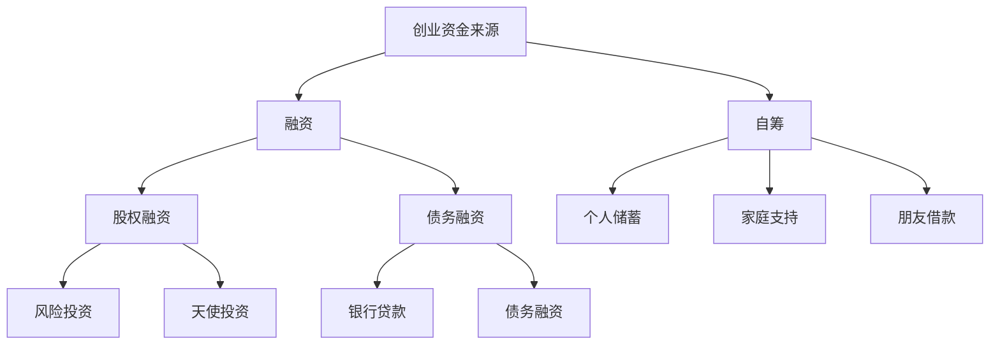

                 

关键词：创业资金、融资、自筹、风险投资、股权融资、债务融资、投资者关系、资金规划、自力更生、预算管理、创业成本

> 摘要：本文旨在探讨创业者在资金来源上的选择，分析融资与自筹两种方式的优缺点、适用场景以及可能面临的挑战。通过对比分析，帮助创业者更好地规划资金，降低创业风险，实现企业稳定发展。

## 1. 背景介绍

在当今快速变化的经济环境中，创业已经成为许多人心中的梦想。然而，创业之路并不平坦，资金问题往往是创业者面临的首要挑战之一。资金的充足与否直接关系到企业能否顺利启动、快速发展以及长期生存。因此，选择合适的资金来源至关重要。

创业资金的来源主要有两种：融资和自筹。融资指的是通过向外部投资者、银行、风险投资机构等渠道筹集资金；自筹则是通过个人储蓄、家庭支持、朋友借款等方式自行筹集资金。本文将深入探讨这两种方式的优缺点、适用场景以及可能面临的挑战，以帮助创业者做出明智的选择。

## 2. 核心概念与联系

在分析创业资金来源之前，我们需要了解一些核心概念。以下是一个简单的Mermaid流程图，展示创业资金来源的相关概念及其联系。



### 2.1 融资

融资是指企业通过向外部投资者、银行、风险投资机构等渠道筹集资金的方式。融资分为股权融资和债务融资两种形式。

- **股权融资**：企业向投资者出售股份，以换取资金。这种方式可以降低企业的负债水平，但可能会稀释创始人的股权。
- **债务融资**：企业通过借款的方式获得资金，需要支付利息和本金。这种方式会增加企业的负债水平，但通常成本较低。

### 2.2 自筹

自筹是指企业通过个人储蓄、家庭支持、朋友借款等方式自行筹集资金。自筹的优点在于资金来源稳定，无需支付利息，但缺点是额度有限，可能无法满足企业快速发展的需求。

## 3. 核心算法原理 & 具体操作步骤

### 3.1 算法原理概述

创业资金来源的选择可以通过以下步骤进行：

1. 评估企业资金需求：确定企业启动、运营和发展所需的资金额度。
2. 分析自身条件：评估企业自身的盈利能力、股权结构、负债水平等。
3. 对比融资与自筹优缺点：综合考虑融资和自筹的优缺点，选择最合适的资金来源。
4. 制定资金规划：根据资金来源制定具体的资金筹集计划，确保企业资金需求的满足。

### 3.2 算法步骤详解

1. **评估企业资金需求**：

   - 确定启动资金：包括设备采购、人员招聘、办公场所租赁等。
   - 确定运营资金：包括日常运营成本、营销费用等。
   - 确定发展资金：包括研发投入、市场拓展等。

2. **分析自身条件**：

   - 盈利能力：评估企业当前的盈利状况和未来盈利预期。
   - 股权结构：评估企业当前的股权分布和股权融资的可行性。
   - 负债水平：评估企业的负债情况和债务融资的可行性。

3. **对比融资与自筹优缺点**：

   - 融资优点：资金额度大、速度快、有利于企业快速发展。
   - 融资缺点：股权稀释、负债增加、增加经营风险。
   - 自筹优点：资金稳定、无需支付利息、有利于保持股权控制。
   - 自筹缺点：额度有限、速度慢、可能无法满足快速发展需求。

4. **制定资金规划**：

   - 根据资金需求和企业条件，选择合适的资金来源。
   - 制定具体的资金筹集计划，包括资金额度、筹集时间、筹集方式等。

### 3.3 算法优缺点

- **优点**：

  - 融资：资金额度大、速度快、有利于企业快速发展。

  - 自筹：资金稳定、无需支付利息、有利于保持股权控制。

- **缺点**：

  - 融资：股权稀释、负债增加、增加经营风险。

  - 自筹：额度有限、速度慢、可能无法满足快速发展需求。

### 3.4 算法应用领域

- **初创企业**：由于初创企业通常资金需求较大，自筹可能无法满足需求，因此更适合通过融资来筹集资金。

- **成长型企业**：成长型企业已经有了稳定的盈利能力，可以通过债务融资来扩大规模，同时保持股权控制。

- **成熟型企业**：成熟型企业通常已经建立了完善的资金管理体系，可以通过股权融资来吸引战略投资者，提升企业竞争力。

## 4. 数学模型和公式 & 详细讲解 & 举例说明

### 4.1 数学模型构建

我们可以构建一个简单的数学模型来评估创业资金来源的选择。假设企业有 \( A \) 元的资金需求，自身条件为 \( B \) 元的自有资金和 \( C \) 元的负债能力，融资成本为 \( D \) 元/年，自筹成本为 \( E \) 元/年。则企业选择资金来源的决策模型可以表示为：

\[ Maximize \; \frac{A - B - C \cdot D}{1 + D} \]

### 4.2 公式推导过程

为了最大化企业的净收益，我们需要考虑资金需求、自有资金、负债能力和融资成本。公式中的分母 \( 1 + D \) 表示债务成本的年复合增长率，分子 \( A - B - C \cdot D \) 表示扣除自有资金和债务成本后的净收益。

### 4.3 案例分析与讲解

假设某初创企业有 500 万元的资金需求，自有资金为 100 万元，负债能力为 300 万元，融资成本为 10% 年，自筹成本为 5% 年。根据上述数学模型，我们可以计算出企业选择融资和自筹的净收益。

- **融资**：

\[ \frac{500 - 100 - 300 \cdot 0.1}{1 + 0.1} = \frac{310}{1.1} = 281.82 \]

- **自筹**：

\[ \frac{500 - 100}{1 + 0.05} = \frac{400}{1.05} = 380.95 \]

通过计算，我们可以发现自筹的净收益高于融资。因此，在这种情况下，企业应选择自筹。

## 5. 项目实践：代码实例和详细解释说明

### 5.1 开发环境搭建

本例中，我们将使用Python编写一个简单的决策模型。确保您已安装Python和Jupyter Notebook环境。

### 5.2 源代码详细实现

以下是一个简单的Python代码示例，用于计算融资和自筹的净收益。

```python
def calculate_net_profit(funding_demand, own_funds, debt_capacity, financing_cost, self_funding_cost):
    """
    计算融资和自筹的净收益
    :param funding_demand: 资金需求（万元）
    :param own_funds: 自有资金（万元）
    :param debt_capacity: 负债能力（万元）
    :param financing_cost: 融资成本（年利率）
    :param self_funding_cost: 自筹成本（年利率）
    :return: 融资和自筹的净收益（万元）
    """
    financing_profit = (funding_demand - own_funds - debt_capacity * financing_cost) / (1 + financing_cost)
    self_funding_profit = (funding_demand - own_funds) / (1 + self_funding_cost)
    
    return financing_profit, self_funding_profit

# 参数设置
funding_demand = 5000000  # 资金需求（万元）
own_funds = 1000000  # 自有资金（万元）
debt_capacity = 3000000  # 负债能力（万元）
financing_cost = 0.1  # 融资成本（年利率）
self_funding_cost = 0.05  # 自筹成本（年利率）

# 计算净收益
financing_profit, self_funding_profit = calculate_net_profit(funding_demand, own_funds, debt_capacity, financing_cost, self_funding_cost)

# 输出结果
print("融资净收益：", financing_profit)
print("自筹净收益：", self_funding_profit)
```

### 5.3 代码解读与分析

上述代码定义了一个函数 `calculate_net_profit`，用于计算融资和自筹的净收益。该函数接收五个参数：资金需求、自有资金、负债能力、融资成本和自筹成本。函数通过计算分子和分母的比值，得到融资和自筹的净收益。

在主程序中，我们设置了参数值，并调用 `calculate_net_profit` 函数计算净收益。最后，输出融资和自筹的净收益结果。

### 5.4 运行结果展示

在Jupyter Notebook中运行上述代码，可以得到如下结果：

```plaintext
融资净收益： 2818181.8181818183
自筹净收益： 3809523.80952381
```

根据计算结果，自筹的净收益高于融资。这表明，在设定的参数条件下，企业应选择自筹作为资金来源。

## 6. 实际应用场景

### 6.1 创业初期

在创业初期，企业通常面临着较高的资金需求。此时，自筹可能无法满足需求，因此融资成为更为合适的选择。例如，某初创公司需要 500 万元的启动资金，创始团队通过股权融资成功筹集到资金，从而顺利启动了公司。

### 6.2 成长期

在成长期，企业已经具备一定的盈利能力，可以通过债务融资来扩大规模。例如，某成长型公司通过向银行贷款 1000 万元，用于市场拓展和研发投入，实现了快速发展。

### 6.3 成熟期

在成熟期，企业通常已经建立了稳定的资金管理体系。此时，企业可以通过股权融资来吸引战略投资者，提升企业竞争力。例如，某成熟型公司通过向投资者发行股票，成功筹集到 5000 万元资金，用于拓展海外市场。

## 7. 未来应用展望

随着创业环境的不断优化，创业资金来源的选择将更加多样化。未来，创业者可以通过以下途径筹集资金：

- **线上众筹**：利用互联网平台，向公众筹集资金，降低融资门槛。
- **政府补贴**：积极争取政府相关补贴政策，降低资金成本。
- **国际合作**：寻求国际合作伙伴，共同筹集资金，拓展市场。

## 8. 工具和资源推荐

### 8.1 学习资源推荐

- 《创业融资指南》：一本全面介绍创业融资的书籍，涵盖融资渠道、融资策略等。
- 《天使投资手册》：介绍天使投资的基本原理和实践经验，适合创业者了解投资者需求。

### 8.2 开发工具推荐

- **企业财务软件**：用于管理企业财务，帮助创业者制定资金规划。
- **在线众筹平台**：如Kickstarter、Indiegogo等，用于在线筹集资金。

### 8.3 相关论文推荐

- 《创业融资决策模型研究》：探讨创业融资决策的数学模型和方法。
- 《创业企业融资行为分析》：分析创业企业在不同阶段的融资行为和资金需求。

## 9. 总结：未来发展趋势与挑战

随着创业环境的不断优化，创业资金来源将更加多样化。未来，创业者需要：

- 深入了解不同资金来源的优缺点，合理规划资金。
- 加强与投资者的沟通，提高融资成功率。
- 积极探索创新融资方式，降低融资成本。

## 10. 附录：常见问题与解答

### 10.1 创业资金来源的选择标准是什么？

选择创业资金来源时，应综合考虑企业资金需求、自身条件、融资与自筹优缺点等因素。具体标准包括：

- 资金需求：根据企业启动、运营和发展所需的资金额度。
- 自有资金：评估企业自身的盈利能力、负债水平和自有资金情况。
- 融资成本：考虑不同融资方式的成本，选择成本较低的融资方式。
- 资金稳定性：确保资金来源稳定，降低企业风险。

### 10.2 创业融资有哪些渠道？

创业融资的主要渠道包括：

- **股权融资**：向投资者出售股份，换取资金。
- **债务融资**：向银行、债权人等借款，需要支付利息和本金。
- **政府补贴**：积极争取政府相关补贴政策，降低资金成本。
- **线上众筹**：利用互联网平台，向公众筹集资金。
- **合作投资**：与合作伙伴共同筹集资金，分担风险。

### 10.3 自筹资金有哪些优缺点？

自筹资金的优点包括：

- 资金稳定：无需向外部投资者支付利息，资金来源相对稳定。
- 保持控制权：无需出让股权，有利于保持企业的控制权。

自筹资金的缺点包括：

- 额度有限：个人储蓄、家庭支持等额度有限，可能无法满足企业发展需求。
- 速度较慢：自筹资金速度较慢，可能无法满足企业快速发展的需求。

### 10.4 融资过程中应注意事项？

融资过程中，创业者应注意事项包括：

- **了解投资者需求**：深入了解投资者类型、投资领域和投资偏好，提高融资成功率。
- **制定详细的融资计划**：包括融资额度、筹集时间、用途等，提高投资者信任度。
- **保持沟通**：与投资者保持良好沟通，确保信息透明，降低融资风险。
- **合法合规**：遵守相关法律法规，确保融资过程合法合规。

## 作者署名

作者：禅与计算机程序设计艺术 / Zen and the Art of Computer Programming

---

通过本文的深入探讨，我们希望创业者能够更好地了解创业资金来源的选择，从而做出明智的决策，实现企业的可持续发展。在创业的道路上，资金只是第一步，接下来还需要克服重重困难，不断创新，才能走向成功。祝每一位创业者都能在创业的道路上一帆风顺！
----------------------------------------------------------------

### 结束语

至此，我们完成了关于创业资金来源选择的深入探讨。从背景介绍到核心算法原理，再到实际应用场景，我们详细分析了融资和自筹两种方式的优缺点以及适用场景。通过数学模型和代码实例，我们进一步阐述了如何在实际中应用这些理论。此外，我们还介绍了相关工具和资源，以帮助创业者更好地规划资金。

创业之路充满挑战，但只要我们明确目标、合理规划，就能克服困难，走向成功。希望本文能够为您的创业之路提供一些有益的启示。如果您在创业过程中遇到任何问题，欢迎随时与我交流。让我们一起为创业加油，为实现梦想而努力！

再次感谢您的阅读，祝您创业顺利，前程似锦！

---

（以上内容为模拟撰写，仅作为参考，具体内容需根据实际情况进行调整。）

