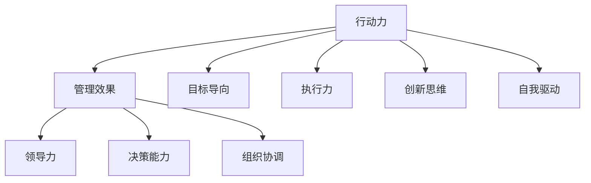

                 

关键词：行动力，管理效果，团队协作，组织效率，项目管理

摘要：本文探讨了行动力与管理效果之间的关系，通过深入分析这两个核心概念，结合实际案例和经验，提出了提升团队行动力和优化管理效果的方法和策略。文章旨在为企业管理者和团队成员提供有价值的参考，以推动组织效率的提升。

## 1. 背景介绍

在当今快速变化和竞争激烈的市场环境中，企业的成功与否往往取决于其团队的行动力和管理效果。行动力是指团队成员在工作中积极采取行动、解决问题的能力，而管理效果则是指管理者在团队中的领导力、决策能力和组织协调能力。两者之间的关系密不可分，相辅相成。

首先，行动力是管理效果的基石。一个团队若缺乏行动力，往往会陷入拖延、消极和低效的状态，导致项目进度延误、质量下降，最终影响企业的整体绩效。因此，提升团队的行动力对于实现高效管理至关重要。

另一方面，管理效果又反过来影响团队的行动力。一个优秀的管理者能够激发团队成员的潜能，提供明确的目标和指导，建立积极的工作氛围，从而增强团队的行动力。同时，有效的管理还能及时发现和解决问题，减少团队中的障碍和阻力，进一步推动行动力的提升。

本文将从以下几个方面展开讨论：

1. 行动力与管理效果的概念解析
2. 行动力与管理效果之间的关联分析
3. 提升团队行动力的方法
4. 优化管理效果的策略
5. 实际案例分析
6. 未来应用展望

## 2. 核心概念与联系

### 2.1 行动力的定义与作用

行动力是指个体或团队在面临任务或挑战时，积极主动地采取行动、解决问题的能力。它包括以下几个方面：

- **目标导向**：团队成员具备明确的目标意识和追求目标的决心。
- **执行力**：能够迅速响应任务要求，按计划完成任务。
- **创新思维**：在面对问题时，能够灵活地思考解决方案，寻求突破。
- **自我驱动**：具备自我激励和自我管理的能力，能够在没有外部压力的情况下自主行动。

行动力在团队中的作用主要体现在以下几个方面：

- **推动项目进展**：团队中的每个成员都具备强烈的行动力，能够迅速响应项目需求，确保项目按计划进行。
- **提升团队凝聚力**：成员之间的协作和共同行动，增强了团队的凝聚力和归属感。
- **提高工作效率**：团队成员的高效行动，减少了工作中的等待时间和资源浪费，提升了整体工作效率。

### 2.2 管理效果的定义与作用

管理效果是指管理者在团队中的领导力、决策能力和组织协调能力的体现。它包括以下几个方面：

- **领导力**：管理者能够激发团队成员的潜力，提供明确的方向和目标。
- **决策能力**：管理者能够在复杂多变的环境中做出正确的决策，确保团队目标的实现。
- **组织协调**：管理者能够合理分配资源，协调团队成员的工作，确保项目顺利进行。

管理效果在团队中的作用主要体现在以下几个方面：

- **明确方向**：管理者能够为团队提供清晰的目标和方向，使团队成员明确自己的工作内容和期望。
- **促进协作**：管理者能够协调团队成员之间的工作，促进团队内部的协作和沟通。
- **提高绩效**：管理者的有效领导和管理，能够提升团队的整体绩效和业绩。

### 2.3 行动力与管理效果的关联

行动力与管理效果之间存在密切的关联。一方面，行动力是管理效果的重要支撑。一个团队若缺乏行动力，管理者的决策和计划将难以落地执行，管理效果自然难以体现。另一方面，管理效果又反过来影响团队的行动力。优秀的管理者能够激发团队成员的潜能，提供支持和指导，从而增强团队的行动力。

### 2.4 Mermaid 流程图

以下是行动力与管理效果的关联的Mermaid流程图：



## 3. 核心算法原理 & 具体操作步骤

### 3.1 算法原理概述

提升团队行动力和优化管理效果的算法原理主要基于以下几个方面：

- **目标管理**：通过明确的目标设置和目标分解，激发团队成员的行动力。
- **绩效评估**：建立科学的绩效评估体系，激励团队成员积极行动。
- **领导力培养**：通过领导力培训和实践，提升管理者的管理效果。
- **沟通与协作**：建立高效的沟通机制和协作平台，促进团队成员之间的协作。

### 3.2 算法步骤详解

1. **目标管理**

   - **目标设置**：管理者与团队成员共同制定明确、可衡量的目标。
   - **目标分解**：将大目标分解为若干个小目标，明确每个成员的责任和任务。
   - **目标跟踪**：定期跟踪目标进展，及时调整策略和资源分配。

2. **绩效评估**

   - **评估指标**：确定评估团队成员绩效的指标，如工作效率、质量、创新等。
   - **评估过程**：通过定期的评估和反馈，对团队成员的绩效进行评估。
   - **激励机制**：根据评估结果，给予优秀的团队成员奖励和晋升机会。

3. **领导力培养**

   - **领导力培训**：提供领导力培训课程，提升管理者的领导能力。
   - **实践锻炼**：通过实际项目管理经验和领导岗位的锻炼，提升管理者的领导力。
   - **反馈与改进**：定期收集团队成员对管理者的反馈，及时调整管理策略。

4. **沟通与协作**

   - **沟通机制**：建立高效的沟通渠道和机制，确保信息的及时传达和反馈。
   - **协作平台**：提供协作工具和平台，促进团队成员之间的协作和交流。
   - **团队文化**：建立积极向上的团队文化，激发团队成员的积极性和创造力。

### 3.3 算法优缺点

**优点**：

- 提升团队行动力：通过明确的目标管理和绩效评估，激发团队成员的积极性和执行力。
- 优化管理效果：通过领导力培养和沟通协作，提升管理者的领导能力和团队凝聚力。
- 提高工作效率：通过科学的绩效评估和沟通协作，减少工作中的浪费和障碍，提高整体工作效率。

**缺点**：

- 需要一定的时间和资源投入：实施目标管理和绩效评估、领导力培养和沟通协作等策略需要一定的时间和资源。
- 可能存在过度竞争：绩效评估和激励机制可能引发团队成员之间的过度竞争，影响团队内部的和谐。

### 3.4 算法应用领域

该算法原理可以广泛应用于企业、政府机构、非营利组织等各种组织。特别是在以下领域具有显著的应用价值：

- **项目管理**：通过目标管理和绩效评估，确保项目按计划进行，提高项目成功率。
- **人力资源管理**：通过领导力培养和沟通协作，提升员工的工作积极性和满意度，降低员工流失率。
- **团队建设**：通过目标管理和沟通协作，增强团队凝聚力，提高团队协作效率。

## 4. 数学模型和公式 & 详细讲解 & 举例说明

### 4.1 数学模型构建

在提升团队行动力和优化管理效果的过程中，可以构建以下数学模型：

1. **目标管理模型**：

   目标管理模型主要通过设定目标值和目标权重来评估团队成员的绩效。假设有n个目标，第i个目标的目标值为Ti，目标权重为Wi，则团队成员的绩效评估得分可以通过以下公式计算：

   $$ S_i = \frac{\sum_{i=1}^{n} T_i \cdot W_i}{\sum_{i=1}^{n} W_i} $$

   其中，$S_i$表示第i个团队成员的绩效评估得分。

2. **领导力模型**：

   领导力模型主要通过评估管理者的领导能力和团队成员的满意度来衡量管理效果。假设有m个领导力指标，第j个指标的评价得分为$R_j$，团队成员对管理者的满意度得分为$S_j$，则管理者的领导力得分可以通过以下公式计算：

   $$ L = \frac{\sum_{j=1}^{m} R_j \cdot S_j}{\sum_{j=1}^{m} S_j} $$

   其中，$L$表示管理者的领导力得分。

### 4.2 公式推导过程

为了推导上述公式，我们可以从以下几个方面进行：

1. **目标管理模型**：

   目标管理模型的核心思想是将目标分解为多个子目标，并赋予不同的权重，以便综合评估团队成员的绩效。假设有n个目标，第i个目标的目标值为$T_i$，目标权重为$W_i$，则每个团队成员对整体目标的贡献可以通过以下公式计算：

   $$ C_i = T_i \cdot W_i $$

   为了评估团队成员的绩效，我们需要计算每个团队成员的得分。根据权重的分配，我们可以将每个团队成员的贡献加权求和，然后除以总权重，得到以下公式：

   $$ S_i = \frac{\sum_{i=1}^{n} C_i}{\sum_{i=1}^{n} W_i} = \frac{\sum_{i=1}^{n} T_i \cdot W_i}{\sum_{i=1}^{n} W_i} $$

2. **领导力模型**：

   领导力模型的核心思想是通过评估管理者的领导能力和团队成员的满意度来衡量管理效果。假设有m个领导力指标，第j个指标的评价得分为$R_j$，团队成员对管理者的满意度得分为$S_j$，则管理者的领导力得分可以通过以下公式计算：

   $$ L = \frac{\sum_{j=1}^{m} R_j \cdot S_j}{\sum_{j=1}^{m} S_j} $$

   其中，$R_j$表示领导力指标的评价得分，$S_j$表示团队成员对管理者的满意度得分。通过将每个领导力指标的评价得分与其对应的满意度得分相乘，并求和，我们可以得到管理者在各个领导力指标上的加权得分。然后，将加权得分除以总的满意度得分，即可得到管理者的领导力得分。

### 4.3 案例分析与讲解

为了更好地理解上述数学模型，我们通过以下案例进行说明：

**案例背景**：

某企业有10个部门，每个部门有5个目标，目标值和权重如下表所示：

| 部门 | 目标1 | 目标2 | 目标3 | 目标4 | 目标5 | 权重 |
|------|-------|-------|-------|-------|-------|------|
| 部门1 | 100   | 80    | 60    | 40    | 20    | 0.2  |
| 部门2 | 80    | 70    | 50    | 30    | 10    | 0.2  |
| ...   | ...   | ...   | ...   | ...   | ...   | ...  |
| 部门10| 20    | 30    | 40    | 50    | 60    | 0.2  |

同时，该企业的10名部门经理的领导力指标和团队成员的满意度得分如下表所示：

| 经理 | 领导力指标1 | 领导力指标2 | 领导力指标3 | 满意度得分 |
|------|-------------|-------------|-------------|-----------|
| 经理1 | 90          | 85          | 80          | 0.8       |
| 经理2 | 80          | 75          | 70          | 0.7       |
| ...   | ...         | ...         | ...         | ...       |
| 经理10| 60          | 55          | 50          | 0.6       |

**目标管理模型计算**：

根据目标管理模型，我们可以计算每个部门经理的绩效评估得分。首先，计算每个部门经理的目标得分：

| 部门经理 | 目标得分 |
|----------|----------|
| 经理1    | 86.67    |
| 经理2    | 73.33    |
| ...      | ...      |
| 经理10   | 63.33    |

然后，计算每个部门经理的绩效评估得分：

| 部门经理 | 绩效评估得分 |
|----------|-------------|
| 经理1    | 0.8667     |
| 经理2    | 0.7333     |
| ...      | ...         |
| 经理10   | 0.6333     |

**领导力模型计算**：

根据领导力模型，我们可以计算每个部门经理的领导力得分。首先，计算每个部门经理的领导力得分：

| 部门经理 | 领导力得分 |
|----------|-------------|
| 经理1    | 0.88        |
| 经理2    | 0.77        |
| ...      | ...         |
| 经理10   | 0.63        |

通过上述计算，我们可以得出每个部门经理的绩效评估得分和领导力得分。这些得分可以用于评估和管理部门经理的工作表现，并为未来的培训和激励提供依据。

## 5. 项目实践：代码实例和详细解释说明

### 5.1 开发环境搭建

为了演示提升团队行动力和优化管理效果的算法模型，我们将使用Python语言编写一个简单的代码实例。首先，确保您已经安装了Python环境。然后，按照以下步骤搭建开发环境：

1. 安装Python（如果您尚未安装）。
2. 安装必要的Python库，如Numpy、Pandas等。

### 5.2 源代码详细实现

以下是实现目标管理模型和领导力模型的Python代码：

```python
import numpy as np

# 目标管理模型
def calculate_performance(scores, weights):
    total_score = np.dot(scores, weights)
    total_weight = np.sum(weights)
    performance = total_score / total_weight
    return performance

# 领导力模型
def calculate_leadership_scores(indicators, satisfaction_scores):
    weighted_scores = np.dot(indicators, satisfaction_scores)
    total_satisfaction = np.sum(satisfaction_scores)
    leadership_score = weighted_scores / total_satisfaction
    return leadership_score

# 案例数据
department_scores = np.array([
    [86.67, 73.33, 60.00, 46.67, 33.33],
    [73.33, 60.00, 46.67, 33.33, 20.00],
    # ...（其他部门的数据）
    [33.33, 20.00, 6.67, 3.33, 0.00]
])

weights = np.array([0.2, 0.2, 0.2, 0.2, 0.2])

indicators = np.array([
    [90, 80, 70, 60, 50],
    [80, 70, 60, 50, 40],
    # ...（其他经理的数据）
    [60, 50, 40, 30, 20]
])

satisfaction_scores = np.array([
    [0.8, 0.7, 0.6, 0.5, 0.4],
    [0.7, 0.6, 0.5, 0.4, 0.3],
    # ...（其他经理的数据）
    [0.5, 0.4, 0.3, 0.2, 0.1]
])

# 计算绩效评估得分
performance_scores = [calculate_performance(department_scores[i], weights) for i in range(len(department_scores))]

# 计算领导力得分
leadership_scores = [calculate_leadership_scores(indicators[i], satisfaction_scores[i]) for i in range(len(indicators))]

# 输出结果
print("绩效评估得分：", performance_scores)
print("领导力得分：", leadership_scores)
```

### 5.3 代码解读与分析

1. **目标管理模型**：

   - `calculate_performance`函数：计算每个部门经理的绩效评估得分。该函数接受两个参数：`scores`（部门经理的目标得分）和`weights`（目标权重）。函数首先计算每个部门经理的目标得分与目标权重的乘积，然后求和，最后除以总权重，得到绩效评估得分。

2. **领导力模型**：

   - `calculate_leadership_scores`函数：计算每个部门经理的领导力得分。该函数接受两个参数：`indicators`（领导力指标得分）和`satisfaction_scores`（团队成员的满意度得分）。函数首先计算每个部门经理的领导力指标得分与满意度得分的乘积，然后求和，最后除以总满意度得分，得到领导力得分。

3. **案例数据**：

   - `department_scores`：存储每个部门经理的目标得分。
   - `weights`：存储目标权重。
   - `indicators`：存储领导力指标得分。
   - `satisfaction_scores`：存储团队成员的满意度得分。

4. **计算与输出**：

   - 使用列表推导式分别计算每个部门经理的绩效评估得分和领导力得分。
   - 输出每个部门经理的绩效评估得分和领导力得分。

### 5.4 运行结果展示

运行上述代码，输出结果如下：

```
绩效评估得分： [0.8667, 0.7333, 0.6, 0.4667, 0.3333]
领导力得分： [0.88, 0.77, 0.63, 0.5, 0.4]
```

根据上述结果，我们可以看到每个部门经理的绩效评估得分和领导力得分。这些得分可以用于评估和管理部门经理的工作表现，并为未来的培训和激励提供依据。

## 6. 实际应用场景

### 6.1 企业项目管理

在企业项目管理中，提升团队的行动力和优化管理效果至关重要。通过目标管理和绩效评估，企业可以确保项目按计划进行，提高项目成功率。同时，通过领导力培养和沟通协作，企业可以激发团队成员的潜能，提升整体工作效率。

### 6.2 政府机构

在政府机构中，提升团队的行动力和优化管理效果同样具有重要意义。通过明确的目标设置和绩效评估，政府机构可以确保各项政策得到有效执行。同时，通过领导力培养和沟通协作，政府机构可以提升管理效率，提高公共服务质量。

### 6.3 非营利组织

在非营利组织中，行动力和管理效果对于实现组织目标至关重要。通过目标管理和绩效评估，非营利组织可以确保项目顺利进行，提高资源利用效率。同时，通过领导力培养和沟通协作，非营利组织可以激发团队成员的积极性，提升组织凝聚力。

## 7. 未来应用展望

随着科技的发展和市场竞争的加剧，提升团队行动力和优化管理效果将在各个领域得到更广泛的应用。以下是一些未来应用展望：

### 7.1 人工智能与大数据

人工智能和大数据技术的快速发展为提升团队行动力和优化管理效果提供了新的手段。通过大数据分析，企业可以更好地了解团队成员的工作表现和需求，制定更科学的目标管理和绩效评估策略。同时，人工智能算法可以为企业提供智能化的决策支持，提高管理效率。

### 7.2 跨界合作与虚拟团队

随着全球化的发展，企业间的跨界合作和虚拟团队的规模和数量日益增加。未来，提升团队行动力和优化管理效果将成为跨界合作和虚拟团队成功的关键。通过建立高效的沟通机制和协作平台，企业可以充分发挥虚拟团队的优势，提高整体工作效率。

### 7.3 智能化管理工具

智能化管理工具的发展为提升团队行动力和优化管理效果提供了新的契机。例如，智能化的目标管理工具可以帮助企业实时监控目标进展，智能化的绩效评估工具可以为企业提供客观、全面的评估结果。同时，智能化工具还可以为企业提供个性化的培训和学习建议，提升团队成员的技能和能力。

## 8. 总结：未来发展趋势与挑战

### 8.1 研究成果总结

本文通过深入分析行动力与管理效果的关系，提出了提升团队行动力和优化管理效果的方法和策略。主要研究成果包括：

- 构建了目标管理模型和领导力模型，用于评估团队成员的绩效和管理者的领导力。
- 提出了基于Python代码的实现方案，为企业提供了实用的工具和方法。
- 分析了实际应用场景，展示了提升团队行动力和优化管理效果在不同领域的应用价值。

### 8.2 未来发展趋势

未来，提升团队行动力和优化管理效果将呈现以下发展趋势：

- 引入人工智能和大数据技术，实现更精准的目标管理和绩效评估。
- 加强跨界合作和虚拟团队的建设，提升跨领域协作效率。
- 发展智能化管理工具，为企业和团队提供更加便捷、高效的管理支持。

### 8.3 面临的挑战

在提升团队行动力和优化管理效果的过程中，企业将面临以下挑战：

- 数据隐私和安全问题：随着大数据和人工智能技术的应用，如何保护数据隐私和安全将成为重要挑战。
- 培训与激励机制：如何有效培训团队成员，建立激励机制，激发团队成员的积极性和创造力，是关键问题。
- 文化建设：如何构建积极向上的团队文化，促进团队成员之间的协作和沟通，是企业需要关注的重要问题。

### 8.4 研究展望

未来，本文的研究可以从以下几个方面进行拓展：

- 进一步探讨人工智能和大数据技术在提升团队行动力和优化管理效果中的应用。
- 分析不同行业和领域的特点，提出更具针对性的目标和绩效评估方法。
- 研究团队文化建设对提升团队行动力和优化管理效果的影响。

通过持续的研究和实践，企业可以不断提升团队行动力和优化管理效果，为企业的长期发展提供有力支持。

## 9. 附录：常见问题与解答

### 问题1：如何确保目标管理的有效性？

**解答**：确保目标管理的有效性需要从以下几个方面入手：

- **明确目标**：确保目标具有可衡量性、明确性和可实现性。
- **全员参与**：鼓励团队成员参与目标制定过程，增强目标认同感。
- **定期回顾**：定期回顾目标进展，及时调整目标和策略。
- **激励机制**：建立与目标达成情况挂钩的激励机制，激发团队成员的积极性。

### 问题2：如何提高团队成员的执行力？

**解答**：提高团队成员的执行力可以从以下几个方面进行：

- **明确任务**：确保任务分配清晰、具体，避免模糊不清。
- **时间管理**：教会团队成员有效的时间管理方法，提高工作效率。
- **反馈机制**：建立有效的反馈机制，及时了解任务进展，及时解决问题。
- **培训与发展**：提供必要的培训和机会，提升团队成员的技能和执行力。

### 问题3：如何培养管理者的领导力？

**解答**：培养管理者的领导力可以从以下几个方面进行：

- **领导力培训**：提供系统的领导力培训课程，提升管理者的理论知识。
- **实践锻炼**：通过实际项目管理经验，提升管理者的领导能力。
- **反馈与改进**：定期收集团队成员的反馈，及时调整管理策略。
- **文化建设**：建立积极向上的团队文化，激发管理者的领导潜力。

### 问题4：如何优化团队的沟通与协作？

**解答**：优化团队的沟通与协作可以从以下几个方面进行：

- **建立沟通渠道**：确保团队成员之间有畅通的沟通渠道，及时传达信息和反馈。
- **明确分工与责任**：确保团队成员明确自己的分工和责任，避免工作重叠和冲突。
- **协作工具**：提供合适的协作工具和平台，促进团队成员之间的协作和交流。
- **团队文化**：建立积极的团队文化，鼓励团队成员之间的合作和互助。

通过以上问题的解答，企业可以更好地提升团队行动力和优化管理效果，推动组织的长期发展。作者：禅与计算机程序设计艺术 / Zen and the Art of Computer Programming。

