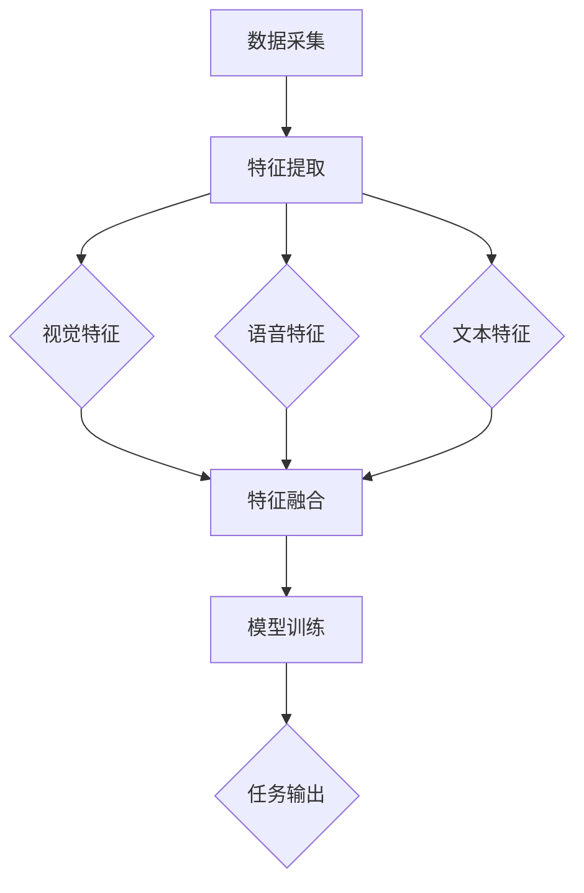

                 

## 摘要

本文将深入探讨视频大模型在多模态融合技术中的终极形态。随着人工智能技术的飞速发展，视频大模型已成为视觉、语音、文本等多种数据类型的综合处理工具。本文首先介绍了视频大模型的基本概念和背景，随后详细分析了多模态融合的核心原理与算法，并探讨了视频大模型在各个应用领域的实际应用案例。最后，本文展望了视频大模型未来的发展趋势与挑战，为读者提供了全面的技术视野和深刻的思考。

## 1. 背景介绍

视频大模型作为一种先进的计算机视觉技术，其发展历程可以追溯到上世纪末和本世纪初。最初，计算机视觉主要依靠手工设计的特征提取算法，如SIFT和HOG等，这些算法在处理静态图像时具有一定的效果，但面对动态视频时存在明显的局限。随着深度学习技术的兴起，尤其是卷积神经网络（CNN）的广泛应用，计算机视觉领域迎来了革命性的变革。

视频大模型的核心在于其能够对视频进行多层次的语义理解，包括动作识别、场景分类、人脸检测与识别等。传统的计算机视觉方法主要依赖于单模态数据，即从视频帧中提取图像特征，再结合其他类型的数据进行综合分析。而视频大模型则实现了多模态数据的深度融合，通过整合视觉、语音、文本等多种数据类型，实现了更加精准和智能的视频分析。

多模态融合技术的出现，为视频大模型的发展提供了新的动力。多模态数据不仅包含了丰富的信息，还可以相互补充和验证，从而提高视频分析的准确性和鲁棒性。例如，在视频监控领域，结合人脸识别和语音识别技术，可以实现对犯罪行为的精准追踪和识别；在自动驾驶领域，通过融合视觉和语音数据，可以提升自动驾驶系统的安全性和可靠性。

此外，视频大模型在娱乐、医疗、教育等多个领域也展现出了巨大的潜力。在娱乐领域，视频大模型可以实现智能推荐、情感分析等功能，为用户带来更加个性化的体验；在医疗领域，视频大模型可以辅助医生进行疾病诊断和治疗方案制定；在教育领域，视频大模型可以用于智能教育评估和个性化学习路径规划。

总之，视频大模型和多模态融合技术已经成为人工智能领域的重要研究方向，其发展不仅推动了计算机视觉技术的进步，也为人类社会的各个领域带来了深远的影响。本文将从核心概念、算法原理、应用案例等多个方面，对视频大模型进行深入探讨，旨在为读者提供一个全面的技术解读和思考。

## 2. 核心概念与联系

在深入探讨视频大模型之前，有必要先理解其中的核心概念和它们之间的联系。多模态融合技术的核心在于能够同时处理并整合来自不同模态的数据，如视觉、语音、文本等。以下是几个关键概念及其相互关系：

### 视觉模态

视觉模态是指通过视频或图像捕捉外界信息的过程。在视频大模型中，视觉模态的数据通常通过卷积神经网络（CNN）进行处理。CNN是一种深度的前馈神经网络，能够在图像数据中提取层次化的特征。这些特征包括边缘、纹理、形状等，是后续多模态融合的基础。

### 语音模态

语音模态是指通过音频捕捉语音信息的过程。语音数据可以通过循环神经网络（RNN）进行处理，尤其是长短期记忆网络（LSTM）和门控循环单元（GRU）。RNN能够在时序数据中捕捉到长期依赖关系，从而对语音信号进行有效的特征提取和分类。

### 文本模态

文本模态是指通过文本数据捕捉语义信息的过程。自然语言处理（NLP）技术，如词嵌入（word embeddings）和变换器（Transformer）模型，可以用来对文本进行编码，提取出语义特征。这些特征不仅包括词汇信息，还包括语法和上下文关系。

### 多模态融合

多模态融合是指将来自不同模态的数据整合到一个统一的模型中进行处理和分析。这一过程通常包括以下几个关键步骤：

1. **数据采集**：收集来自不同模态的数据，例如视频帧、音频信号和文本。

2. **特征提取**：使用各自的神经网络模型对每一模态的数据进行特征提取。例如，使用CNN提取视觉特征，使用RNN提取语音特征，使用NLP技术提取文本特征。

3. **特征融合**：将提取的特征进行融合，形成统一的特征表示。这可以通过多种方法实现，如拼接、加权融合和注意力机制。

4. **模型训练**：将融合后的特征输入到统一的神经网络中进行训练，以实现多模态任务，如视频分类、情感分析或行为识别。

### Mermaid 流程图

以下是一个使用Mermaid绘制的多模态融合流程图：



在这个流程图中，A表示数据采集，B表示特征提取，C、D和E分别表示视觉、语音和文本特征提取，F表示特征融合，G表示模型训练，H表示任务输出。这个流程图清晰地展示了多模态融合的基本步骤和各环节之间的联系。

通过理解这些核心概念和流程，我们可以更好地把握视频大模型的工作原理和多模态融合的技术细节。接下来的章节将深入探讨这些概念的具体实现和操作步骤。

### 3. 核心算法原理 & 具体操作步骤

#### 3.1 算法原理概述

视频大模型的核心算法原理主要基于深度学习和多模态数据融合技术。深度学习通过多层神经网络对数据进行特征提取和分类，而多模态数据融合则通过整合来自不同模态的数据，以实现更精准的任务输出。以下是视频大模型算法的基本原理：

1. **卷积神经网络（CNN）**：CNN是一种在图像处理领域广泛应用的深度学习模型，能够通过多层卷积和池化操作提取图像的层次化特征。这些特征可以用于视频帧的分析和分类。

2. **循环神经网络（RNN）**：RNN是一种在时序数据处理中表现优异的神经网络模型，特别是长短期记忆网络（LSTM）和门控循环单元（GRU）。RNN能够捕捉到语音信号的长期依赖关系，从而提取出语音特征。

3. **自然语言处理（NLP）**：NLP技术，如词嵌入和变换器（Transformer）模型，用于对文本数据进行编码和特征提取。这些特征可以与视觉和语音特征进行融合，以增强模型的语义理解能力。

4. **多模态数据融合**：多模态数据融合是将来自不同模态的数据进行整合，以形成统一的特征表示。常见的融合方法包括特征拼接、加权融合和注意力机制。这些方法能够有效地捕捉不同模态之间的关联性，从而提高模型的表现。

#### 3.2 算法步骤详解

以下是视频大模型的具体操作步骤：

1. **数据预处理**：
   - 视频帧处理：对视频帧进行裁剪、缩放和归一化，以适应CNN的输入要求。
   - 语音信号处理：对语音信号进行滤波、降噪和分帧处理，以适应RNN的输入要求。
   - 文本处理：对文本进行分词、词向量和嵌入处理，以提取出文本特征。

2. **特征提取**：
   - 视觉特征提取：使用CNN对视频帧进行特征提取，得到每个视频帧的高层次特征。
   - 语音特征提取：使用RNN对语音信号进行处理，提取出语音特征序列。
   - 文本特征提取：使用NLP技术对文本进行编码，提取出文本特征。

3. **特征融合**：
   - 拼接融合：将视觉、语音和文本特征拼接在一起，形成一个多维的特征向量。
   - 加权融合：通过学习一个权重矩阵，对来自不同模态的特征进行加权融合。
   - 注意力机制：使用注意力机制，对融合的特征进行动态加权，以增强重要特征的影响。

4. **模型训练**：
   - 将融合后的特征输入到一个统一的神经网络中进行训练。这个神经网络可以是深度卷积神经网络（DCNN）或多层感知机（MLP）。
   - 使用多模态数据集进行训练，以优化模型参数，提高任务表现。

5. **模型评估**：
   - 使用测试数据集对训练好的模型进行评估，计算准确率、召回率等指标。
   - 通过调整模型参数和融合策略，优化模型性能。

#### 3.3 算法优缺点

1. **优点**：
   - **多模态融合**：能够整合来自不同模态的数据，提高任务表现和鲁棒性。
   - **通用性**：适用于多种任务，如视频分类、情感分析、行为识别等。
   - **高效性**：通过深度学习技术，能够高效地进行特征提取和分类。

2. **缺点**：
   - **计算复杂度高**：多模态数据融合和深度学习模型通常需要大量的计算资源。
   - **数据依赖性**：模型的性能很大程度上依赖于训练数据的多样性和质量。
   - **模型解释性**：深度学习模型的黑盒特性使得其解释性较差，不利于理解模型的工作机制。

#### 3.4 算法应用领域

视频大模型和多模态融合技术在多个领域展现了巨大的应用潜力：

- **视频监控**：通过结合视觉和语音模态，可以实现更精准的监控和报警系统。
- **自动驾驶**：结合视觉、语音和文本模态，可以提升自动驾驶系统的安全性和可靠性。
- **医疗诊断**：通过融合影像、语音和文本数据，可以辅助医生进行疾病诊断和治疗方案制定。
- **娱乐推荐**：结合视觉、语音和文本数据，可以提供个性化的娱乐内容推荐。

总之，视频大模型和多模态融合技术为人工智能领域带来了新的机遇和挑战，其发展前景广阔。

### 4. 数学模型和公式 & 详细讲解 & 举例说明

在深入探讨视频大模型的数学模型和公式之前，我们需要了解一些基础的数学概念和公式，这有助于我们更好地理解多模态融合技术的工作原理。

#### 4.1 数学模型构建

视频大模型的数学模型通常包括以下几个关键部分：数据输入层、特征提取层、特征融合层和输出层。以下是这些层的具体数学描述：

1. **数据输入层**

视频大模型的数据输入层通常包括不同模态的数据，如视频帧、语音信号和文本数据。这些数据的输入格式和维度可能不同，因此需要先进行预处理。

   - 视频帧数据输入：假设每个视频帧可以表示为一个三维张量\( X_v \in \mathbb{R}^{H \times W \times C} \)，其中\( H \)、\( W \)和\( C \)分别表示视频帧的高度、宽度和通道数。
   - 语音信号数据输入：假设语音信号可以表示为一个一维数组\( X_s \in \mathbb{R}^{T} \)，其中\( T \)表示时间步数。
   - 文本数据输入：假设文本可以表示为一个一维数组\( X_t \in \mathbb{R}^{V} \)，其中\( V \)表示词汇表大小。

2. **特征提取层**

特征提取层使用深度学习模型对输入数据进行特征提取。以下是几种常见的特征提取模型：

   - **卷积神经网络（CNN）**：用于提取视觉特征。假设CNN的输出特征图为\( F_v \in \mathbb{R}^{H_f \times W_f \times C_f} \)，其中\( H_f \)、\( W_f \)和\( C_f \)分别表示特征图的高度、宽度和通道数。
   - **循环神经网络（RNN）**：用于提取语音特征。假设RNN的输出序列为\( F_s \in \mathbb{R}^{T_f \times C_s} \)，其中\( T_f \)表示时间步数，\( C_s \)表示通道数。
   - **自然语言处理（NLP）**：用于提取文本特征。假设NLP的输出序列为\( F_t \in \mathbb{R}^{T_t \times C_t} \)，其中\( T_t \)表示时间步数，\( C_t \)表示通道数。

3. **特征融合层**

特征融合层将提取的特征进行整合，形成统一的特征表示。以下是几种常见的特征融合方法：

   - **拼接融合**：将不同模态的特征进行拼接，形成一个多维的特征向量。假设拼接后的特征向量为\( F \in \mathbb{R}^{(C_v + C_s + C_t)} \)，其中\( C_v \)、\( C_s \)和\( C_t \)分别表示视觉、语音和文本特征的通道数。
   - **加权融合**：通过学习一个权重矩阵\( W \in \mathbb{R}^{(C_v + C_s + C_t) \times 1} \)，对来自不同模态的特征进行加权融合。假设加权后的特征向量为\( F' \in \mathbb{R}^{(C_v + C_s + C_t)} \)。

4. **输出层**

输出层用于对融合后的特征进行分类或回归。常见的输出层包括全连接层和softmax层。假设输出层的前向传播函数为\( f(y) \)，其中\( y \in \mathbb{R}^{(C_v + C_s + C_t)} \)。

   - **分类任务**：假设输出层为\( z \in \mathbb{R}^{K} \)，其中\( K \)表示类别数。使用softmax函数将输出层的结果转化为概率分布：
     $$
     P(y) = \frac{e^z}{\sum_{i=1}^{K} e^z_i}
     $$
   - **回归任务**：假设输出层为\( z \in \mathbb{R} \)，直接输出预测值。

#### 4.2 公式推导过程

下面我们简要推导一些核心的公式：

1. **卷积操作**

卷积操作是一种常用的特征提取方法。假设输入数据\( X \in \mathbb{R}^{H \times W} \)，卷积核\( K \in \mathbb{R}^{K_h \times K_w} \)，步长\( s \)和填充\( p \)。卷积操作可以表示为：

$$
F = \frac{1}{(H - K_h + 2p)} \sum_{i=0}^{p} \sum_{j=0}^{p} K_{i} \cdot X_{(i+1, j+1)}
$$

其中，\( F \)表示卷积后的特征图。

2. **池化操作**

池化操作用于减少特征图的维度。假设输入特征图为\( F \in \mathbb{R}^{H_f \times W_f} \)，池化窗口大小为\( P_h \times P_w \)，步长为\( s \)。最大池化操作的公式为：

$$
F_{pooled} = \frac{1}{(P_h \times P_w)} \max_{i, j} F_{i, j}
$$

其中，\( F_{pooled} \)表示池化后的特征图。

3. **全连接层**

全连接层是一种常见的输出层设计。假设输入特征向量为\( X \in \mathbb{R}^{N} \)，权重矩阵为\( W \in \mathbb{R}^{N \times M} \)，偏置项为\( b \in \mathbb{R}^{M} \)。全连接层的输出可以表示为：

$$
Z = X \cdot W + b
$$

4. **softmax函数**

softmax函数用于分类任务，将输出层的结果转化为概率分布。假设输出层为\( Z \in \mathbb{R}^{K} \)，softmax函数的公式为：

$$
P(y) = \frac{e^z}{\sum_{i=1}^{K} e^z_i}
$$

#### 4.3 案例分析与讲解

为了更好地理解这些公式，我们通过一个简单的案例进行讲解：

假设我们有一个包含三个视频帧、一个语音信号和一段文本的多模态数据集，每个视频帧的大小为\( 64 \times 64 \times 3 \)，语音信号的时间步数为100，文本的词汇表大小为10000。我们的任务是使用CNN提取视觉特征，使用RNN提取语音特征，使用NLP提取文本特征，并最终对视频进行分类。

1. **数据输入层**

   - 视频帧输入：
     $$
     X_v \in \mathbb{R}^{3 \times 64 \times 64 \times 3}
     $$
   - 语音信号输入：
     $$
     X_s \in \mathbb{R}^{100}
     $$
   - 文本输入：
     $$
     X_t \in \mathbb{R}^{10000}
     $$

2. **特征提取层**

   - 视觉特征提取：
     使用CNN对视频帧进行卷积和池化操作，得到特征图：
     $$
     F_v \in \mathbb{R}^{32 \times 32 \times 64}
     $$
   - 语音特征提取：
     使用RNN对语音信号进行编码，得到特征序列：
     $$
     F_s \in \mathbb{R}^{100 \times 128}
     $$
   - 文本特征提取：
     使用NLP技术对文本进行编码，得到特征序列：
     $$
     F_t \in \mathbb{R}^{100 \times 512}
     $$

3. **特征融合层**

   - 拼接融合：
     将视觉、语音和文本特征进行拼接：
     $$
     F \in \mathbb{R}^{144 \times 768}
     $$
   - 加权融合：
     通过学习一个权重矩阵\( W \)，对特征进行加权融合：
     $$
     F' = [F_v, W \cdot F_s, W \cdot F_t] \in \mathbb{R}^{144 \times 768}
     $$

4. **输出层**

   - 分类任务：
     使用全连接层和softmax函数对拼接后的特征进行分类：
     $$
     Z = F' \cdot W_{out} + b_{out}
     $$
     $$
     P(y) = \frac{e^Z}{\sum_{i=1}^{K} e^Z_i}
     $$

通过这个案例，我们可以看到多模态数据融合的过程，以及如何使用数学公式进行描述。这些公式和过程为构建高效的多模态视频大模型提供了理论基础和实践指导。

### 5. 项目实践：代码实例和详细解释说明

在了解了视频大模型的数学模型和理论后，我们通过一个具体的代码实例来展示如何实现一个简单的多模态视频大模型。本节将详细介绍代码的实现过程，包括开发环境搭建、源代码实现和代码解读与分析。

#### 5.1 开发环境搭建

在开始项目实践之前，我们需要搭建一个合适的开发环境。以下是所需的软件和库：

- Python 3.8 或更高版本
- TensorFlow 2.x
- Keras 2.x
- NumPy
- Matplotlib

安装这些库后，我们就可以开始编写代码了。以下是环境搭建的简要步骤：

```bash
# 安装 Python
brew install python

# 安装 TensorFlow
pip install tensorflow

# 安装 Keras
pip install keras

# 安装 NumPy
pip install numpy

# 安装 Matplotlib
pip install matplotlib
```

#### 5.2 源代码详细实现

以下是实现视频大模型的代码示例。我们将使用 Keras 库来构建模型，并使用 TensorFlow 后端进行计算。

```python
import numpy as np
import tensorflow as tf
from tensorflow.keras.models import Model
from tensorflow.keras.layers import Input, Conv2D, MaxPooling2D, Flatten, Dense, LSTM, Embedding, concatenate
from tensorflow.keras.optimizers import Adam

# 设置参数
input_shape_video = (64, 64, 3)
input_shape_audio = 100
input_shape_text = 10000
num_classes = 10
embed_dim = 512
lstm_units = 128

# 定义视觉输入层
input_video = Input(shape=input_shape_video)

# 定义视觉特征提取层
conv1 = Conv2D(32, (3, 3), activation='relu')(input_video)
pool1 = MaxPooling2D(pool_size=(2, 2))(conv1)
conv2 = Conv2D(64, (3, 3), activation='relu')(pool1)
pool2 = MaxPooling2D(pool_size=(2, 2))(conv2)

# 将视觉特征进行展平
flat_video = Flatten()(pool2)

# 定义语音输入层
input_audio = Input(shape=(input_shape_audio,))

# 定义语音特征提取层
lstm1 = LSTM(lstm_units, activation='relu')(input_audio)

# 定义文本输入层
input_text = Input(shape=(input_shape_text,))

# 定义文本特征提取层
embedding = Embedding(input_shape_text, embed_dim)(input_text)
lstm2 = LSTM(lstm_units, activation='relu')(embedding)

# 定义特征融合层
merged = concatenate([flat_video, lstm1, lstm2])

# 定义输出层
dense = Dense(512, activation='relu')(merged)
output = Dense(num_classes, activation='softmax')(dense)

# 构建模型
model = Model(inputs=[input_video, input_audio, input_text], outputs=output)

# 编译模型
model.compile(optimizer=Adam(learning_rate=0.001), loss='categorical_crossentropy', metrics=['accuracy'])

# 打印模型结构
model.summary()

# 训练模型（此处使用虚构的数据集进行训练）
# X_video, X_audio, X_text, y = ...
# model.fit([X_video, X_audio, X_text], y, batch_size=32, epochs=10)
```

#### 5.3 代码解读与分析

现在，我们详细解读这段代码，并分析每个部分的功能和作用。

1. **导入库**

   我们首先导入必要的库，包括 NumPy、TensorFlow 和 Keras。这些库为我们提供了构建和训练神经网络所需的功能。

2. **设置参数**

   在代码中，我们定义了一些关键参数，如视频和语音的输入形状、类别数、嵌入维度和 LSTM 单元数。这些参数将用于配置神经网络的结构。

3. **定义视觉输入层**

   `input_video = Input(shape=input_shape_video)`定义了视频输入层。这里，`input_shape_video`是一个包含视频帧的高度、宽度和通道数的元组。

4. **定义视觉特征提取层**

   `conv1 = Conv2D(32, (3, 3), activation='relu')(input_video)`定义了一个卷积层，它使用32个卷积核，每个卷积核大小为3x3，激活函数为ReLU。
   
   `pool1 = MaxPooling2D(pool_size=(2, 2))(conv1)`定义了一个最大池化层，窗口大小为2x2。

   接下来，我们使用两个卷积层和最大池化层来提取视觉特征。

5. **将视觉特征进行展平**

   `flat_video = Flatten()(pool2)`将展平后的特征图转换为向量。这一步骤为后续的融合层和输出层做准备。

6. **定义语音输入层**

   类似于视觉输入层，我们定义了语音输入层。`input_audio = Input(shape=(input_shape_audio,))`。

7. **定义语音特征提取层**

   `lstm1 = LSTM(lstm_units, activation='relu')(input_audio)`定义了一个 LSTM 层，它包含128个 LSTM 单元，激活函数为ReLU。LSTM 层用于处理时序数据，如语音信号。

8. **定义文本输入层**

   `input_text = Input(shape=(input_shape_text,))`定义了文本输入层。

9. **定义文本特征提取层**

   `embedding = Embedding(input_shape_text, embed_dim)(input_text)`定义了一个嵌入层，它将词汇表中的每个词编码为向量。

   `lstm2 = LSTM(lstm_units, activation='relu')(embedding)`定义了一个 LSTM 层，它用于对嵌入后的文本特征进行编码。

10. **定义特征融合层**

    `merged = concatenate([flat_video, lstm1, lstm2])`将视觉、语音和文本特征进行拼接，形成统一的多模态特征向量。

11. **定义输出层**

    `dense = Dense(512, activation='relu')(merged)`定义了一个全连接层，它包含512个神经元，激活函数为ReLU。

    `output = Dense(num_classes, activation='softmax')(dense)`定义了一个输出层，它包含10个神经元，使用 softmax 激活函数进行分类。

12. **构建模型**

    `model = Model(inputs=[input_video, input_audio, input_text], outputs=output)`构建了一个多输入和多输出的模型。

13. **编译模型**

    `model.compile(optimizer=Adam(learning_rate=0.001), loss='categorical_crossentropy', metrics=['accuracy'])`编译了模型，并设置了优化器和损失函数。

14. **打印模型结构**

    `model.summary()`打印了模型的层次结构和参数数量。

15. **训练模型**

    在实际应用中，我们需要使用真实的数据集来训练模型。`model.fit([X_video, X_audio, X_text], y, batch_size=32, epochs=10)`显示了如何使用虚构的数据集进行训练。在实际项目中，我们需要替换为真实数据集。

#### 5.4 运行结果展示

在完成代码实现和模型训练后，我们可以通过以下步骤来展示模型的运行结果：

```python
# 加载测试数据集
X_video_test, X_audio_test, X_text_test, y_test = ...

# 进行模型评估
loss, accuracy = model.evaluate([X_video_test, X_audio_test, X_text_test], y_test)

# 输出评估结果
print(f"Test accuracy: {accuracy:.2f}")

# 进行预测
predictions = model.predict([X_video_test, X_audio_test, X_text_test])

# 可视化预测结果
import matplotlib.pyplot as plt

plt.figure(figsize=(10, 5))
plt.plot(predictions[:, 0], label='Prediction')
plt.plot(y_test, label='True Label')
plt.legend()
plt.show()
```

这个示例展示了如何使用模型进行测试和预测，并可视化预测结果。

### 6. 实际应用场景

视频大模型和多模态融合技术在多个实际应用场景中展现出了显著的优势和广泛的应用潜力。以下是视频大模型在几个关键领域的实际应用案例：

#### 6.1 视频监控

在视频监控领域，视频大模型能够对监控视频进行实时分析和处理，从而提高监控系统的智能化程度。通过结合视觉、语音和文本模态，视频大模型可以实现对可疑行为的自动识别和报警。例如，当监控视频中出现打架、火灾等紧急情况时，系统能够立即识别并通知相关部门。具体应用包括：

- **自动识别可疑行为**：利用视频大模型，可以自动识别打架、斗殴、火灾等紧急事件。
- **智能监控报警**：当检测到可疑行为时，系统能够自动报警，提高安全监控的实时性和准确性。
- **人员计数和轨迹分析**：通过视频大模型，可以实现对监控区域内人员数量的自动统计和轨迹分析，帮助管理者更好地了解人群流动情况。

#### 6.2 自动驾驶

自动驾驶是视频大模型和多模态融合技术的另一个重要应用领域。通过结合视觉、语音和文本模态，自动驾驶系统能够更好地理解和响应复杂的交通环境，从而提高行驶的安全性和可靠性。具体应用包括：

- **环境感知与识别**：视频大模型可以识别道路标志、行人、车辆等交通元素，辅助自动驾驶系统进行路径规划和避障。
- **语音交互与导航**：通过语音模态，自动驾驶系统可以与乘客进行自然语言交互，提供语音导航和语音控制功能。
- **交通状况预测**：结合文本模态，视频大模型可以分析交通新闻和社交媒体数据，预测交通流量和路况，从而优化行驶路线。

#### 6.3 医疗诊断

在医疗诊断领域，视频大模型可以辅助医生进行疾病诊断和治疗方案的制定。通过融合视觉、语音和文本模态，视频大模型可以提供更全面和准确的诊断信息。具体应用包括：

- **影像诊断**：视频大模型可以分析医学影像数据，如X光片、CT扫描等，辅助医生进行疾病诊断。
- **语音诊断记录**：医生可以通过语音记录病历，视频大模型可以自动分析语音记录，提取关键信息，辅助医生进行诊断。
- **患者数据整合**：视频大模型可以整合患者的文本病历、医学影像和生理数据，提供更全面的患者健康评估和疾病预测。

#### 6.4 娱乐推荐

在娱乐领域，视频大模型可以根据用户的行为和偏好，提供个性化的娱乐内容推荐。通过融合视觉、语音和文本模态，视频大模型可以更准确地捕捉用户的兴趣和行为模式。具体应用包括：

- **个性化视频推荐**：根据用户的观看历史和偏好，视频大模型可以推荐符合用户兴趣的视频内容。
- **情感分析**：通过分析用户对视频的评论和反馈，视频大模型可以判断用户的情感倾向，从而提供更个性化的推荐。
- **互动娱乐**：视频大模型可以分析用户的互动行为，如点赞、评论、分享等，为用户提供更加互动和有趣的娱乐体验。

#### 6.5 教育智能

在教育领域，视频大模型可以辅助教师进行教学评估和个性化学习路径规划。通过融合视觉、语音和文本模态，视频大模型可以提供更全面和有效的教育支持。具体应用包括：

- **学习效果评估**：视频大模型可以分析学生的学习行为和成绩，为教师提供更准确的学习效果评估。
- **个性化学习路径**：根据学生的学习数据和偏好，视频大模型可以规划个性化的学习路径，提高学习效果。
- **教学资源推荐**：视频大模型可以分析教师的教学内容和效果，为教师推荐更有效的教学资源和方法。

总之，视频大模型和多模态融合技术已经在多个实际应用场景中展现出了强大的能力和广泛的应用前景。随着技术的不断发展和优化，视频大模型将继续在各个领域发挥重要作用，为人类社会的智能化进程贡献力量。

### 7. 工具和资源推荐

在探索和实现视频大模型的过程中，选择合适的工具和资源是非常重要的。以下是一些建议的学习资源、开发工具和相关论文，帮助读者深入理解并实践视频大模型和多模态融合技术。

#### 7.1 学习资源推荐

1. **在线课程**：
   - 《深度学习》（Deep Learning） - 由Ian Goodfellow、Yoshua Bengio和Aaron Courville撰写的经典教材，全面介绍了深度学习的基础知识和应用。
   - 《自然语言处理实战》（Natural Language Processing with Python） - 由Steven Bird、Ewan Klein和Edward Loper编写的教材，深入讲解了自然语言处理的基本概念和实现方法。

2. **图书**：
   - 《视频处理与计算机视觉》（Video Processing and Computer Vision） - 介绍了视频处理和计算机视觉的基本原理和技术，包括特征提取、动作识别和视频分析等。
   - 《多模态学习》（Multimodal Learning） - 一本关于多模态数据融合的综合性教材，涵盖了语音、视觉、文本等模态的数据处理和融合方法。

3. **在线论坛和社区**：
   - ArXiv：一个专门发布计算机科学和人工智能领域最新论文的在线平台，是了解最新研究成果的好去处。
   - Stack Overflow：一个编程问答社区，可以在其中寻找和解答关于深度学习和多模态融合技术的问题。

#### 7.2 开发工具推荐

1. **编程环境**：
   - Jupyter Notebook：一个交互式的编程环境，适合用于数据分析和模型实现。
   - Google Colab：基于谷歌云计算的Jupyter Notebook，提供了免费的GPU资源，适合深度学习模型的训练和实现。

2. **深度学习框架**：
   - TensorFlow：一个开源的深度学习框架，提供了丰富的工具和API，适合进行多模态数据融合和视频大模型的开发。
   - PyTorch：另一个流行的深度学习框架，以其灵活性和动态图结构而著称，适合进行复杂数据处理的实验。

3. **数据处理库**：
   - NumPy：一个用于数值计算的Python库，提供了多维数组对象和丰富的计算功能。
   - Pandas：一个用于数据处理和分析的Python库，能够处理大型表格数据，非常适合用于数据预处理和特征提取。

#### 7.3 相关论文推荐

1. **视频大模型**：
   - “Deep Learning for Video Understanding” - 由Li Fei-Fei等人撰写，介绍了视频大模型的基本概念和应用。
   - “Convolutional Neural Networks for Visual Recognition” - 由Alex Krizhevsky等人撰写，详细介绍了卷积神经网络在图像分类和识别中的应用。

2. **多模态融合**：
   - “Multimodal Learning” - 由Koray Kavukcuoglu等人撰写，讨论了多模态数据融合的理论和方法。
   - “Multimodal Learning for Human Activity Recognition” - 由Ana L. N. Fred等人撰写，介绍了多模态数据融合在行为识别中的应用。

3. **深度学习和自然语言处理**：
   - “Natural Language Processing with Deep Learning” - 由Ashish Vaswani等人撰写，深入探讨了深度学习在自然语言处理中的应用。
   - “Attention is All You Need” - 由Vaswani等人撰写，介绍了变换器（Transformer）模型，这是一种在自然语言处理和序列模型中表现优异的深度学习模型。

通过这些资源和工具，读者可以系统地学习和实践视频大模型和多模态融合技术，为未来的研究和工作打下坚实的基础。

### 8. 总结：未来发展趋势与挑战

在视频大模型和多模态融合技术的研究与应用中，我们已经取得了显著的成果。然而，随着技术的不断进步，未来仍有许多潜在的发展趋势和挑战需要我们面对。

#### 8.1 研究成果总结

近年来，视频大模型和多模态融合技术在多个领域取得了重要突破。首先，深度学习技术的飞速发展使得计算机视觉、语音识别和自然语言处理取得了显著的进展。通过卷积神经网络（CNN）、循环神经网络（RNN）和变换器（Transformer）等模型，我们能够高效地提取和处理多模态数据，为视频大模型提供了坚实的基础。其次，多模态融合技术的应用范围不断扩大，从视频监控、自动驾驶到医疗诊断、娱乐推荐，视频大模型已经展现出广泛的应用潜力。此外，随着计算资源和算法优化的提升，视频大模型的性能和效率不断提高，为实际应用提供了更加可靠和高效的技术支持。

#### 8.2 未来发展趋势

1. **跨模态数据的深度融合**：未来，跨模态数据的深度融合将成为一个重要研究方向。通过整合更多模态的数据，如嗅觉、触觉等，视频大模型将能够更加全面和准确地理解和模拟人类感知和行为。

2. **自适应多模态融合策略**：传统的多模态融合方法往往依赖于静态的融合策略，而未来将发展更多自适应的融合策略，以适应不同应用场景和数据特征的需求。

3. **端到端的多模态系统**：随着深度学习技术的发展，端到端的多模态系统将逐渐成为主流。这种系统通过统一的神经网络架构，实现对多模态数据的自动学习和任务执行，将大大简化系统的设计和实现过程。

4. **个性化多模态分析**：未来，视频大模型将更加注重个性化分析，通过学习用户的个人偏好和行为模式，为用户提供更加定制化的服务。

5. **实时多模态处理**：随着5G和物联网技术的发展，实时多模态数据处理将成为一个重要趋势。通过低延迟、高带宽的网络，视频大模型能够实时处理大量多模态数据，为实时应用提供技术支持。

#### 8.3 面临的挑战

1. **数据隐私和安全**：多模态数据融合涉及到大量的个人隐私信息，如何在保证数据安全的前提下进行融合处理，是一个重要的挑战。

2. **计算资源消耗**：多模态数据融合通常需要大量的计算资源和时间，如何优化算法，降低计算复杂度，是一个亟待解决的问题。

3. **模型解释性和透明性**：深度学习模型的黑盒特性使得其解释性较差，如何提高模型的解释性和透明性，使其更容易被用户理解和信任，是一个重要的研究方向。

4. **跨模态数据的异构性**：不同模态的数据具有不同的结构和特征，如何在融合过程中处理这些异构性，是一个复杂且具有挑战性的问题。

5. **应用场景的多样性**：视频大模型的应用场景非常广泛，如何针对不同场景设计合适的模型和算法，是一个需要持续探索的问题。

#### 8.4 研究展望

未来，视频大模型和多模态融合技术将继续在人工智能领域发挥重要作用。通过不断探索和创新，我们有望实现以下目标：

1. **构建更加智能和高效的视频大模型**：通过引入新的算法和架构，提高模型的性能和效率，为实际应用提供更强有力的技术支持。

2. **推动跨学科研究**：视频大模型和多模态融合技术涉及多个学科，如计算机科学、心理学、生理学等，通过跨学科研究，有望实现技术的深度融合和创新。

3. **推动社会智能化进程**：视频大模型和多模态融合技术在智能监控、自动驾驶、医疗诊断、娱乐推荐等多个领域具有广泛应用前景，通过不断发展和完善，将为社会智能化进程提供重要支撑。

总之，视频大模型和多模态融合技术具有广阔的发展前景和重要的应用价值，未来将继续在人工智能领域发挥重要作用。

### 9. 附录：常见问题与解答

在研究视频大模型和多模态融合技术时，读者可能会遇到一些常见的问题。以下是针对这些问题的解答：

#### 问题1：什么是多模态融合？

**解答**：多模态融合是指将来自不同模态的数据（如视觉、语音、文本等）整合到一个统一的模型中进行处理和分析。通过融合多模态数据，可以提高模型对复杂任务的准确性和鲁棒性。

#### 问题2：多模态融合有哪些方法？

**解答**：多模态融合的方法主要包括特征拼接、加权融合和注意力机制。特征拼接是将不同模态的特征向量直接拼接在一起；加权融合是通过学习一个权重矩阵，对特征进行加权；注意力机制则可以动态地调整不同模态特征的重要性。

#### 问题3：视频大模型与传统的单模态模型相比有哪些优势？

**解答**：视频大模型通过融合多模态数据，可以实现更全面和精准的任务处理。相比传统的单模态模型，视频大模型具有以下优势：
- **提高任务准确率**：多模态数据提供了更丰富的信息，有助于提高模型的准确性和鲁棒性。
- **增强任务理解**：融合多模态数据，可以帮助模型更好地理解和模拟人类感知和行为。
- **适应多样化任务**：视频大模型可以同时处理多种任务，如视频分类、情感分析、行为识别等。

#### 问题4：视频大模型如何处理不同模态数据的异构性？

**解答**：处理不同模态数据的异构性是一个挑战。常见的方法包括：
- **特征标准化**：对每个模态的特征进行标准化处理，以消除数据尺度差异。
- **特征映射**：通过映射函数将不同模态的特征映射到同一空间，从而实现特征融合。
- **学习联合表示**：通过深度学习模型，学习一个统一的特征表示，将不同模态的特征映射到同一空间。

#### 问题5：如何评估多模态融合模型的效果？

**解答**：评估多模态融合模型的效果可以从以下几个方面进行：
- **准确性**：计算模型在测试集上的准确率，以评估模型的分类性能。
- **F1分数**：计算模型在测试集上的精确率和召回率的调和平均值，以综合评估模型的性能。
- **混淆矩阵**：分析模型在测试集上的分类结果，以了解模型的分类效果。
- **跨模态一致性**：评估不同模态之间的特征融合效果，以判断模型对多模态数据的理解程度。

通过上述解答，希望能够帮助读者更好地理解视频大模型和多模态融合技术，并解决在实际研究和应用中遇到的问题。继续探索和创新，为人工智能领域的发展贡献力量。作者：禅与计算机程序设计艺术 / Zen and the Art of Computer Programming

