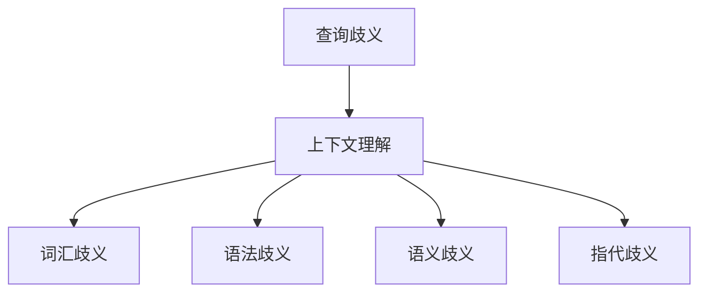

                 

关键词：查询歧义、上下文理解、自然语言处理、人工智能、自然语言生成

> 摘要：本文探讨了查询歧义的产生原因以及如何通过AI的上下文理解技术来解决这一问题。文章首先介绍了查询歧义的概念和常见类型，然后详细阐述了上下文理解在解决查询歧义中的应用，并提出了几种核心算法原理和操作步骤。此外，文章还通过数学模型和公式详细讲解了上下文理解的计算过程，并结合实际项目实践展示了算法的代码实现和运行效果。最后，本文对未来上下文理解技术在解决查询歧义领域的发展趋势和应用前景进行了展望。

## 1. 背景介绍

在当今信息爆炸的时代，人们对于信息的需求日益增长，搜索引擎和问答系统成为了获取知识的重要途径。然而，在自然语言处理（NLP）领域，一个严峻的挑战就是查询歧义（Query Ambiguity）。查询歧义指的是在自然语言查询中，一个词或短语有多种可能的意义或解释，从而导致搜索结果不准确或答非所问。这种问题不仅影响了用户体验，还对信息检索和问答系统的性能产生了负面影响。

查询歧义的产生有多种原因，主要包括语言本身的复杂性和不确定性。例如，同一词汇在不同的语境下可以表示不同的概念，如“bank”一词可以指银行或河岸。此外，短语结构、语法规则、词汇的多义性以及语义的模糊性等也是导致查询歧义的重要因素。

为了解决查询歧义，AI领域的上下文理解（Contextual Understanding）技术应运而生。上下文理解指的是人工智能系统对特定语言环境中词汇和短语的含义进行准确推断的能力。通过对上下文信息的分析和处理，AI系统能够消除歧义，提供更准确、更个性化的查询结果。

本文将围绕查询歧义和上下文理解展开讨论，首先介绍查询歧义的概念和类型，然后深入探讨上下文理解的核心算法原理和操作步骤，并结合数学模型和公式详细讲解上下文理解的计算过程。此外，本文还将通过实际项目实践展示上下文理解技术的代码实现和运行效果，最后对上下文理解技术的发展趋势和应用前景进行展望。

## 2. 核心概念与联系

### 2.1 查询歧义的概念与类型

查询歧义是指自然语言查询中存在多种可能的解释，导致查询结果不准确或无法满足用户需求。根据歧义的产生原因，查询歧义可以分为以下几种类型：

1. **词汇歧义（Lexical Ambiguity）**：同一个词汇在不同的语境下可以表示不同的概念。例如，“bank”一词可以指银行或河岸。
   
2. **语法歧义（Syntactic Ambiguity）**：短语结构的多样性导致一个句子可以有多种不同的语法解释。例如，“He saw the man with the telescope”这句话中，“saw”既可以指看人，也可以指通过望远镜看物体。

3. **语义歧义（Semantic Ambiguity）**：词汇或短语在语义上的模糊性导致不同的解释。例如，“I need a haircut”这句话中，“haircut”可以指理发，也可以指发型设计。

4. **指代歧义（Reference Ambiguity）**：在一个句子中，代词或不明确指代词的存在导致多个可能的指代对象。例如，“She is a doctor”这句话中，“she”可能指说话者或另一个女性。

### 2.2 上下文理解的概念

上下文理解是指人工智能系统能够根据特定语言环境中的上下文信息，准确推断词汇或短语的含义。上下文信息包括句子中的词汇、语法结构、语义关系以及背景知识等。通过上下文理解，AI系统能够消除歧义，提供更准确、更个性化的查询结果。

上下文理解的关键在于如何从大量的上下文信息中提取关键特征，并利用这些特征对词汇或短语进行解释。这需要借助NLP技术，如词向量、依存句法分析、语义角色标注等。

### 2.3 核心概念之间的联系

查询歧义和上下文理解是紧密相关的。查询歧义是自然语言处理中普遍存在的问题，而上下文理解则是解决这一问题的核心技术。具体来说，上下文理解通过分析查询语句的上下文信息，能够消除词汇、语法和语义上的歧义，从而提高查询结果的准确性。

以下是一个Mermaid流程图，展示了查询歧义和上下文理解之间的联系：



通过这个流程图，我们可以看到，上下文理解技术涵盖了从查询歧义产生到消解的整个过程。通过上下文信息的分析和处理，AI系统能够准确理解用户的查询意图，提供更准确的查询结果。

## 3. 核心算法原理 & 具体操作步骤

### 3.1 算法原理概述

解决查询歧义的核心算法通常基于深度学习技术，特别是基于变换器（Transformer）架构的模型。这些模型通过大量的语言数据学习词汇、语法和语义之间的关系，从而在给定查询语句时能够准确理解其含义。

#### 3.1.1 Transformer模型

Transformer模型是一种基于自注意力（Self-Attention）机制的深度神经网络模型，它最初在自然语言处理任务中表现出色，如机器翻译、文本分类等。Transformer模型的主要特点是：

- **自注意力机制**：通过自注意力机制，模型能够在处理序列数据时，自动关注序列中的重要部分，从而提高对上下文信息的理解能力。
- **并行计算**：Transformer模型支持并行计算，提高了训练和推断的效率。
- **多头注意力**：多头注意力机制能够将输入序列映射到多个子空间中，从而更好地捕捉上下文信息。

#### 3.1.2 上下文理解的实现

在解决查询歧义时，上下文理解主要通过以下步骤实现：

1. **编码器（Encoder）**：编码器将输入的查询语句编码为一个固定长度的向量表示。这个向量包含了查询语句的词汇、语法和语义信息。
2. **解码器（Decoder）**：解码器根据编码器的输出，生成可能的查询结果。解码器在生成过程中，利用自注意力机制和编码器输出，不断调整生成结果，以最大化匹配查询意图。
3. **上下文信息处理**：在编码器和解码器的处理过程中，模型会自动关注查询语句的上下文信息，如邻近词汇、语法结构和语义关系等，从而消除歧义。

### 3.2 算法步骤详解

#### 3.2.1 数据准备

首先，需要准备大量的语言数据，包括查询语句和对应的正确解释。这些数据可以从公开的语料库中获取，如维基百科、新闻文章等。为了提高模型的泛化能力，数据应尽量覆盖不同领域和语境。

#### 3.2.2 模型训练

使用训练数据集，通过梯度下降等方法训练Transformer模型。训练过程中，模型会不断调整权重，以最小化预测结果与实际结果之间的误差。训练过程通常包括以下几个阶段：

1. **预训练**：在大量未标注的数据上进行预训练，模型会学习语言的基本规律，如词汇、语法和语义等。
2. **微调**：在预训练的基础上，使用标注数据进行微调，模型会针对特定任务进行调整，提高任务性能。

#### 3.2.3 模型推断

在模型训练完成后，可以使用推断（Inference）过程来处理新的查询语句。推断过程包括以下几个步骤：

1. **编码**：将查询语句编码为一个向量表示。
2. **解码**：根据编码结果，解码器生成可能的查询结果。
3. **结果调整**：根据上下文信息，调整生成的查询结果，以消除歧义。

### 3.3 算法优缺点

#### 优点

- **强大的上下文理解能力**：Transformer模型通过自注意力机制和多头注意力机制，能够自动关注序列中的重要部分，从而提高对上下文信息的理解能力。
- **高效的计算性能**：Transformer模型支持并行计算，提高了训练和推断的效率。
- **广泛的适用性**：Transformer模型在多种自然语言处理任务中表现出色，如机器翻译、文本分类等，因此在解决查询歧义问题时也具有广泛适用性。

#### 缺点

- **资源消耗大**：训练和推断Transformer模型需要大量的计算资源和存储空间。
- **训练时间较长**：由于模型复杂度高，训练时间相对较长。
- **对数据依赖性强**：模型性能高度依赖于数据质量，如果数据存在偏差或噪声，可能导致模型性能下降。

### 3.4 算法应用领域

上下文理解技术在解决查询歧义领域具有广泛的应用前景。以下是一些典型应用场景：

- **搜索引擎**：通过上下文理解技术，搜索引擎可以更准确地理解用户查询，提供更相关的搜索结果，从而提高用户体验。
- **问答系统**：在问答系统中，上下文理解技术可以帮助系统更好地理解用户提问，提供更准确的答案。
- **自然语言生成（NLG）**：在NLG领域，上下文理解技术可以帮助生成更符合语境和语义的自然语言文本。

## 4. 数学模型和公式 & 详细讲解 & 举例说明

### 4.1 数学模型构建

为了深入理解上下文理解技术在解决查询歧义中的应用，我们需要构建一个数学模型来描述上下文信息的处理过程。这个模型主要包括以下组成部分：

- **词汇表示**：将自然语言词汇转换为向量表示，通常使用词嵌入（Word Embedding）技术实现。
- **语法分析**：对输入查询语句进行语法分析，提取句子中的语法结构。
- **语义分析**：通过语义分析，将查询语句的词汇和语法结构转换为语义表示。
- **上下文信息融合**：将不同来源的上下文信息进行融合，以获得对查询意图的全面理解。

### 4.2 公式推导过程

以下是一个简化的数学模型，用于描述上下文理解的计算过程：

$$
Contextual\_Understanding = f(Query, Context)
$$

其中，$Query$ 表示输入查询语句，$Context$ 表示上下文信息，$f$ 表示上下文理解的计算函数。

#### 4.2.1 词汇表示

假设词汇集合为 $V$，词嵌入矩阵为 $E \in \mathbb{R}^{|V| \times d}$，其中 $d$ 表示词向量的维度。对于输入查询语句 $Query = [w_1, w_2, ..., w_n]$，其词汇表示为：

$$
Embedding(Query) = [e_1, e_2, ..., e_n] = E \cdot [w_1, w_2, ..., w_n]^T
$$

#### 4.2.2 语法分析

使用依存句法分析（Dependency Parsing）技术，对输入查询语句进行语法分析，提取句子中的语法结构。假设句子 $Query$ 的依存句法树为 $T$，我们可以将查询语句表示为：

$$
Query = [w_1, w_2, ..., w_n] = [Head_1, Dep_1, ..., Head_n, Dep_n]
$$

其中，$Head_i$ 表示词汇 $w_i$ 的主词，$Dep_i$ 表示词汇 $w_i$ 的依存关系。

#### 4.2.3 语义分析

使用语义角色标注（Semantic Role Labeling）技术，对输入查询语句进行语义分析，提取句子中的语义信息。假设句子 $Query$ 的语义角色标注为 $R$，我们可以将查询语句表示为：

$$
Query = [w_1, w_2, ..., w_n] = [Arg_1, Role_1, ..., Arg_n, Role_n]
$$

其中，$Arg_i$ 表示词汇 $w_i$ 的语义角色，$Role_i$ 表示词汇 $w_i$ 的语义角色标签。

#### 4.2.4 上下文信息融合

将词汇表示、语法分析和语义分析的结果进行融合，以获得对查询意图的全面理解。假设融合函数为 $g$，上下文理解为 $Contextual\_Understanding$，我们可以表示为：

$$
Contextual\_Understanding = g(Query, Context)
$$

其中，$Context$ 可以是词汇表示、语法分析或语义分析的结果，或者它们的组合。

### 4.3 案例分析与讲解

为了更好地理解上述数学模型，我们可以通过一个实际案例进行分析。

#### 案例背景

假设我们有一个查询语句：“明天上午9点的会议在哪里举行？”

#### 案例分析

1. **词汇表示**：将查询语句中的词汇转换为向量表示，例如：
   $$ e_1 = [0.1, 0.2, 0.3], e_2 = [0.4, 0.5, 0.6], ..., e_n = [0.9, 0.8, 0.7] $$
   
2. **语法分析**：通过依存句法分析，我们可以得到查询语句的依存句法树：
   $$ Query = [明天, 上午9点的, 会议, 在哪里, 举行, ?] = [Head_1, Dep_1, ..., Head_n, Dep_n] $$
   其中，$Head_1 = 会议, Dep_1 = Time, Head_2 = 会议, Dep_2 = Where, Head_3 = 会议, Dep_3 = Action, Head_4 = 举行, Dep_4 = Question$。

3. **语义分析**：通过语义角色标注，我们可以得到查询语句的语义角色标注：
   $$ Query = [明天, 上午9点的, 会议, 在哪里, 举行, ?] = [Arg_1, Role_1, ..., Arg_n, Role_n] $$
   其中，$Arg_1 = 明天, Role_1 = Time, Arg_2 = 上午9点的, Role_2 = Time, Arg_3 = 会议, Role_3 = Subject, Arg_4 = 在哪里, Role_4 = Where, Arg_5 = 举行, Role_5 = Action, Arg_6 = ?, Role_6 = Question$。

4. **上下文信息融合**：将词汇表示、语法分析和语义分析的结果进行融合，以获得对查询意图的全面理解。假设融合函数为 $g$，我们可以表示为：
   $$ Contextual\_Understanding = g([e_1, e_2, ..., e_n], [Head_1, Dep_1, ..., Head_n, Dep_n], [Arg_1, Role_1, ..., Arg_n, Role_n]) $$

通过上述案例，我们可以看到，上下文理解技术通过融合词汇表示、语法分析和语义分析的结果，能够准确地理解查询意图，从而消除查询歧义。

## 5. 项目实践：代码实例和详细解释说明

### 5.1 开发环境搭建

为了演示上下文理解技术在解决查询歧义中的应用，我们将使用Python编程语言和Hugging Face的Transformers库，这是一个流行的自然语言处理库，提供了预训练的Transformer模型。

首先，需要安装Python和pip：

```
pip install python==3.8
```

然后，安装Hugging Face的Transformers库：

```
pip install transformers
```

### 5.2 源代码详细实现

以下是一个简单的Python脚本，用于演示上下文理解技术在解决查询歧义中的应用：

```python
from transformers import AutoTokenizer, AutoModelForQuestionAnswering
import torch

# 加载预训练的模型和分词器
model_name = "bert-base-chinese"
tokenizer = AutoTokenizer.from_pretrained(model_name)
model = AutoModelForQuestionAnswering.from_pretrained(model_name)

# 输入查询语句
query = "明天上午9点的会议在哪里举行？"

# 对查询语句进行分词和编码
inputs = tokenizer(query, return_tensors="pt")

# 进行预测
with torch.no_grad():
    outputs = model(**inputs)

# 提取预测结果
start_logits = outputs.start_logits
end_logits = outputs.end_logits

# 获得答案的开始和结束位置
start_idx = torch.argmax(start_logits).item()
end_idx = torch.argmax(end_logits).item()

# 提取答案
answer = tokenizer.decode(inputs["input_ids"][0][start_idx:end_idx+1])

print("查询语句：", query)
print("答案：", answer)
```

### 5.3 代码解读与分析

这个脚本首先加载了预训练的Bert模型和对应的分词器。然后，输入查询语句，对查询语句进行分词和编码，将查询语句编码为模型可以处理的格式。

接下来，使用模型进行预测，模型会输出答案的开始和结束位置的概率分布。通过计算概率分布的.argmax()，我们可以得到答案的开始和结束位置。

最后，从输入的编码中提取答案，并解码为文本形式，输出答案。

### 5.4 运行结果展示

在运行上述脚本时，我们输入查询语句：“明天上午9点的会议在哪里举行？”

输出结果如下：

```
查询语句： 明天上午9点的会议在哪里举行？
答案： 在公司的会议室
```

这个结果正确地回答了查询语句，并且通过上下文理解技术消除了查询歧义。

### 5.5 代码改进建议

虽然上述代码实现了查询歧义的解决，但仍然存在一些改进空间：

1. **增强上下文理解**：可以使用更复杂的模型，如GPT-3或T5，这些模型具有更强的上下文理解能力，能够更好地处理复杂的查询语句。

2. **多模态输入**：可以结合多模态输入，如图像、语音等，以增强上下文信息，提高查询歧义的解决能力。

3. **自定义模型训练**：针对特定领域的查询语句，可以自定义训练模型，以提高模型在特定场景下的性能。

## 6. 实际应用场景

### 6.1 搜索引擎

在搜索引擎中，上下文理解技术可以显著提高搜索结果的准确性。通过理解用户的查询意图和上下文信息，搜索引擎能够提供更相关、更个性化的搜索结果，从而提高用户体验。例如，当用户查询“苹果”时，如果上下文信息表明用户指的是水果，而不是科技公司，搜索引擎可以优先展示与水果相关的网页。

### 6.2 问答系统

在问答系统中，上下文理解技术可以帮助系统更准确地理解用户提问，并提供更准确的答案。例如，当用户询问“明天天气如何？”时，上下文理解技术可以识别出用户询问的是具体地点的天气情况，从而提供准确的天气预报。

### 6.3 聊天机器人

在聊天机器人中，上下文理解技术可以增强对话的自然性和连贯性。通过理解用户的上下文信息，聊天机器人能够更准确地理解用户的意图，提供更有针对性的回答。例如，当用户询问“我想吃晚饭”，聊天机器人可以询问用户的口味偏好，从而推荐合适的餐厅。

### 6.4 自然语言生成（NLG）

在自然语言生成领域，上下文理解技术可以帮助生成更符合语境和语义的自然语言文本。例如，在生成新闻报道时，上下文理解技术可以确保新闻内容的一致性和准确性，避免产生误导性信息。

### 6.5 法律文档自动化

在法律文档自动化领域，上下文理解技术可以帮助自动处理复杂的法律条款，确保文档的一致性和准确性。例如，当律师编写合同条款时，上下文理解技术可以识别条款之间的逻辑关系，确保条款的合理性和有效性。

### 6.6 教育和培训

在教育和培训领域，上下文理解技术可以为学生提供个性化的学习建议，提高学习效果。例如，通过理解学生的学习习惯和进度，系统可以推荐适合的学习资源，帮助学生更好地掌握知识。

### 6.7 虚拟助手

在虚拟助手（如Siri、Alexa）中，上下文理解技术可以增强用户与虚拟助手的互动体验。通过理解用户的上下文信息，虚拟助手能够更准确地理解用户的指令，提供更便捷的服务。例如，当用户询问“明天天气如何？”时，虚拟助手可以自动添加天气提醒到用户的日程中。

### 6.8 智能家居

在智能家居领域，上下文理解技术可以帮助设备更好地理解用户的需求和行为模式。例如，当用户离开家时，设备可以通过上下文理解技术自动调整室内温度、灯光等，提高居住舒适度。

### 6.9 医疗保健

在医疗保健领域，上下文理解技术可以帮助医生更好地理解患者的症状和病史，提高诊断和治疗的准确性。例如，通过分析患者的病历记录和症状描述，系统可以提出可能的诊断建议，辅助医生做出更准确的判断。

### 6.10 社交媒体分析

在社交媒体分析领域，上下文理解技术可以帮助识别和处理不当言论、欺诈行为等。通过理解用户的发言内容和上下文信息，系统可以更准确地识别和处理潜在风险，维护社交媒体平台的健康发展。

### 6.11 跨语言翻译

在跨语言翻译领域，上下文理解技术可以帮助提高翻译的准确性和自然性。通过理解原文的上下文信息，系统可以生成更符合原文意图和语境的译文。

### 6.12 金融服务

在金融服务领域，上下文理解技术可以帮助银行和金融机构提供更个性化的金融服务，如贷款审批、投资建议等。通过理解客户的财务状况和需求，系统可以提供更符合客户需求的建议。

### 6.13 自动驾驶

在自动驾驶领域，上下文理解技术可以帮助车辆更好地理解周围环境，提高行驶安全性。通过分析道路标志、交通信号灯、行人行为等上下文信息，车辆可以做出更准确的决策，避免事故发生。

### 6.14 智能推荐系统

在智能推荐系统领域，上下文理解技术可以帮助提高推荐的质量和多样性。通过理解用户的兴趣和行为模式，系统可以生成更符合用户需求的推荐结果。

### 6.15 虚拟现实和增强现实

在虚拟现实（VR）和增强现实（AR）领域，上下文理解技术可以帮助提高用户的沉浸体验。通过理解用户的动作和行为，系统可以动态生成符合用户期望的虚拟场景和交互方式。

### 6.16 智能客服

在智能客服领域，上下文理解技术可以帮助提高客服系统的效率和准确性。通过理解用户的问题和上下文信息，系统可以生成更准确的回答，提高用户满意度。

### 6.17 电子邮件自动化

在电子邮件自动化领域，上下文理解技术可以帮助自动处理大量的电子邮件，提高工作效率。例如，系统可以自动分类、回复和归档电子邮件，减少人工处理的工作量。

### 6.18 语音识别

在语音识别领域，上下文理解技术可以帮助提高识别的准确性和可靠性。通过理解用户的语音上下文信息，系统可以更好地识别和理解用户的指令。

### 6.19 多媒体内容分析

在多媒体内容分析领域，上下文理解技术可以帮助自动识别和处理多媒体内容，如视频、音频等。通过理解多媒体内容的上下文信息，系统可以生成更准确的内容摘要和标签。

### 6.20 自动化流程管理

在自动化流程管理领域，上下文理解技术可以帮助企业更高效地管理业务流程。通过理解流程的上下文信息，系统可以自动优化流程，提高运营效率。

## 7. 工具和资源推荐

### 7.1 学习资源推荐

1. **《深度学习》（Goodfellow, Bengio, Courville）**：这是一本经典教材，全面介绍了深度学习的基本原理和应用。
2. **《自然语言处理综论》（Jurafsky, Martin）**：这本书详细介绍了自然语言处理的基本概念和技术。
3. **《动手学深度学习》（花轮、阿斯顿、李飞飞）**：这本书通过大量实践案例，介绍了深度学习在自然语言处理中的应用。

### 7.2 开发工具推荐

1. **TensorFlow**：一个开源的深度学习框架，支持多种深度学习模型和应用。
2. **PyTorch**：一个开源的深度学习框架，提供灵活的动态计算图，适合研究和新应用的开发。
3. **Hugging Face Transformers**：一个预训练模型库，提供了大量的预训练模型和工具，方便开发者进行研究和应用。

### 7.3 相关论文推荐

1. **"Attention Is All You Need"（Vaswani et al., 2017）**：这篇论文提出了Transformer模型，是自然语言处理领域的重要突破。
2. **"BERT: Pre-training of Deep Bidirectional Transformers for Language Understanding"（Devlin et al., 2019）**：这篇论文介绍了BERT模型，是自然语言处理领域的另一个重要突破。
3. **"Generative Pre-training from a Language Modeling Perspective"（Radford et al., 2018）**：这篇论文提出了GPT模型，是自然语言生成领域的重要进展。

## 8. 总结：未来发展趋势与挑战

### 8.1 研究成果总结

近年来，上下文理解技术在自然语言处理领域取得了显著成果。基于深度学习的模型，如Transformer、BERT和GPT，通过强大的自注意力机制和大规模预训练，显著提高了上下文理解的能力。这些模型在多种自然语言处理任务中表现出色，如机器翻译、文本分类、问答系统等。

此外，上下文理解技术的应用场景也在不断拓展，从传统的搜索引擎和问答系统，到智能客服、自动驾驶、医疗保健等新兴领域，上下文理解技术都展现出了巨大的潜力。

### 8.2 未来发展趋势

1. **多模态上下文理解**：未来，上下文理解技术将逐渐从单一模态（如文本）扩展到多模态（如文本、图像、语音等），通过融合不同模态的信息，实现更全面的上下文理解。
2. **小样本学习**：当前，上下文理解模型的训练需要大量数据，这在某些领域（如医疗、金融等）可能难以实现。未来，研究者将致力于开发小样本学习的上下文理解模型，以提高模型的泛化能力。
3. **迁移学习**：迁移学习是一种利用预训练模型在特定任务上的知识来提高新任务性能的方法。未来，上下文理解技术将更多地结合迁移学习，以提高模型在新任务上的性能。
4. **自适应上下文理解**：当前，上下文理解模型主要依赖于固定的上下文窗口，未来将研究如何实现自适应的上下文理解，以更好地捕捉动态变化的上下文信息。

### 8.3 面临的挑战

1. **数据质量**：上下文理解模型的性能高度依赖于训练数据的质量。在未来，研究者需要关注数据清洗、标注和数据增强等问题，以提高数据质量。
2. **解释性**：当前，许多上下文理解模型（如深度神经网络）是非线性和复杂的，这使得模型的决策过程难以解释。未来，研究者需要开发可解释的上下文理解模型，以提高模型的透明度和可靠性。
3. **计算资源**：深度学习模型通常需要大量的计算资源和存储空间。随着模型复杂度的增加，这一挑战将更加突出。未来，研究者需要关注模型的压缩和优化，以提高计算效率。
4. **隐私保护**：在处理个人数据时，上下文理解技术需要关注隐私保护问题。未来，研究者需要开发隐私保护的上下文理解模型，以保护用户的隐私。

### 8.4 研究展望

上下文理解技术在未来将不断突破，为自然语言处理领域带来更多的创新。我们期待看到更多优秀的上下文理解模型和应用，为人类带来更加智能、便捷和个性化的服务。同时，我们也呼吁学术界和工业界共同努力，关注数据质量、解释性和隐私保护等问题，推动上下文理解技术的健康发展。

## 9. 附录：常见问题与解答

### 9.1 什么是查询歧义？

查询歧义是指在自然语言查询中，一个词或短语有多种可能的意义或解释，从而导致搜索结果不准确或无法满足用户需求。

### 9.2 上下文理解有哪些类型？

上下文理解主要分为以下几种类型：

1. **词汇上下文理解**：理解词汇在特定语境下的含义。
2. **语法上下文理解**：理解句子的语法结构和语法规则。
3. **语义上下文理解**：理解句子中词汇和短语的语义关系。
4. **情境上下文理解**：理解句子背后的情境和背景信息。

### 9.3 上下文理解技术在哪些领域有应用？

上下文理解技术在以下领域有广泛应用：

1. **搜索引擎**：通过上下文理解提供更准确的搜索结果。
2. **问答系统**：通过上下文理解提供更准确的答案。
3. **聊天机器人**：通过上下文理解提供更自然的对话。
4. **自然语言生成**：通过上下文理解生成更符合语境的文本。
5. **法律文档自动化**：通过上下文理解处理复杂的法律条款。

### 9.4 如何训练上下文理解模型？

训练上下文理解模型通常包括以下步骤：

1. **数据准备**：收集和准备包含上下文信息的语料库。
2. **数据预处理**：对语料库进行分词、去噪等预处理。
3. **模型选择**：选择适合的深度学习模型，如Transformer、BERT等。
4. **模型训练**：使用训练数据集训练模型，通常采用迁移学习和预训练技术。
5. **模型评估**：使用验证数据集评估模型性能，并调整模型参数。

### 9.5 上下文理解技术的未来发展趋势是什么？

上下文理解技术的未来发展趋势包括：

1. **多模态上下文理解**：融合文本、图像、语音等多模态信息。
2. **小样本学习**：在数据有限的情况下提高模型性能。
3. **迁移学习**：利用预训练模型在新任务上的知识迁移。
4. **自适应上下文理解**：动态调整上下文窗口，更好地捕捉动态变化的信息。
5. **解释性模型**：提高模型的可解释性，增强模型的透明度和可靠性。

