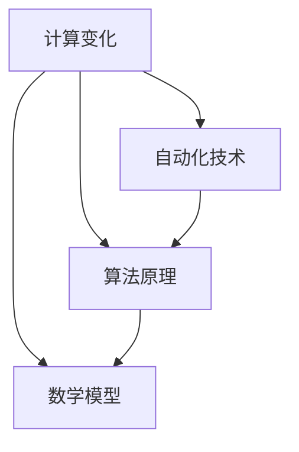

                 

关键词：计算变化、自动化技术、算法原理、数学模型、应用场景、未来展望

摘要：本文深入探讨了计算变化与自动化技术之间的互动关系。首先，我们回顾了计算变化的基本概念，并阐述了其在自动化技术中的重要性。接着，我们详细介绍了计算变化的核心算法原理和具体操作步骤，以及其优缺点和应用领域。随后，我们通过数学模型和公式的详细讲解，辅以实际项目实践的代码实例，展示了计算变化在实际应用中的具体实现。最后，我们分析了计算变化在实际应用场景中的表现，并对未来的发展趋势和挑战进行了展望。

## 1. 背景介绍

随着科技的飞速发展，计算变化和自动化技术已经成为现代信息社会的核心驱动力。计算变化是指计算机系统在运行过程中发生的各种变化，包括数据的输入、处理、存储和输出等。这些变化不仅使得计算机系统能够应对复杂多变的外部环境，还能够提高系统的效率和性能。

自动化技术则是指利用计算机系统和软件实现各种自动化任务的技术。它通过预定义的规则和算法，自动完成各种操作，从而降低人工干预的需求，提高生产效率。计算变化与自动化技术的互动，不仅推动了信息技术的不断进步，还改变了人们的生活方式和工作模式。

### 1.1 计算变化的定义和作用

计算变化是指计算机系统在运行过程中发生的各种变化，包括数据的输入、处理、存储和输出等。这些变化使得计算机系统能够动态适应外部环境的变化，实现更高的灵活性和可扩展性。

首先，计算变化能够提高计算机系统的性能。通过优化算法和数据结构，系统能够更高效地处理大量数据，降低延迟，提高吞吐量。

其次，计算变化能够增强系统的稳定性。通过监控和检测系统运行过程中的异常情况，并自动进行故障恢复，系统可以在面对突发情况时保持稳定运行。

最后，计算变化能够提高系统的可维护性。通过自动化工具和脚本，开发人员可以更轻松地进行系统维护和更新，减少人工干预的需求。

### 1.2 自动化技术的定义和应用

自动化技术是指利用计算机系统和软件实现各种自动化任务的技术。它通过预定义的规则和算法，自动完成各种操作，从而降低人工干预的需求，提高生产效率。

自动化技术在许多领域都得到了广泛应用，如制造业、物流、金融、医疗、能源等。具体应用包括：

- 制造业：自动化生产线、机器人、自动化检测系统等；
- 物流：自动化仓储、自动化配送、自动化装卸等；
- 金融：自动化交易、自动化风险评估、自动化风险管理等；
- 医疗：自动化诊断、自动化手术、自动化药物配送等；
- 能源：自动化发电、自动化输电、自动化储能等。

### 1.3 计算变化与自动化技术的互动关系

计算变化与自动化技术之间的互动关系体现在以下几个方面：

1. **计算变化推动自动化技术的进步**：计算变化的出现和发展，为自动化技术提供了更多的可能性。例如，通过计算变化，自动化系统可以更加灵活地应对复杂多变的外部环境，实现更高效、更智能的自动化操作。

2. **自动化技术促进计算变化的应用**：自动化技术的进步，使得计算变化的应用变得更加广泛和深入。例如，自动化机器人可以通过计算变化实现更加精确和高效的制造操作，自动化系统可以通过计算变化实现更加智能和高效的数据分析。

3. **计算变化与自动化技术相互促进**：计算变化和自动化技术相互促进，共同推动信息技术的发展。例如，自动化系统可以通过计算变化实现更高效的资源利用，计算变化可以通过自动化技术实现更高效的数据处理。

## 2. 核心概念与联系

在深入探讨计算变化与自动化技术的互动之前，我们需要明确一些核心概念，并理解它们之间的联系。这些概念包括计算变化、自动化技术、算法原理、数学模型等。

### 2.1 计算变化

计算变化是指计算机系统在运行过程中发生的各种变化，包括数据的输入、处理、存储和输出等。这些变化是计算机系统能够动态适应外部环境的基础。

### 2.2 自动化技术

自动化技术是指利用计算机系统和软件实现各种自动化任务的技术。它通过预定义的规则和算法，自动完成各种操作，从而降低人工干预的需求，提高生产效率。

### 2.3 算法原理

算法原理是指解决特定问题的系统方法。它是自动化技术实现的基础。常见的算法原理包括排序算法、搜索算法、动态规划算法等。

### 2.4 数学模型

数学模型是指用数学语言描述现实世界问题的模型。它是计算变化和自动化技术实现的重要工具。常见的数学模型包括线性模型、非线性模型、概率模型等。

### 2.5 核心概念之间的联系

计算变化、自动化技术、算法原理和数学模型之间存在紧密的联系。

首先，计算变化是自动化技术实现的基础。只有通过计算变化，自动化技术才能实现对外部环境的动态适应。

其次，算法原理是自动化技术的核心。只有通过算法原理，自动化技术才能实现预定的任务。

最后，数学模型是计算变化和算法原理实现的重要工具。只有通过数学模型，计算变化和算法原理才能用数学语言进行精确描述。

以下是计算变化与自动化技术、算法原理和数学模型之间的 Mermaid 流程图：



通过这个流程图，我们可以清晰地看到计算变化、自动化技术、算法原理和数学模型之间的互动关系。

## 3. 核心算法原理 & 具体操作步骤

在了解了计算变化与自动化技术、算法原理和数学模型的基本概念后，我们将深入探讨计算变化的核心算法原理和具体操作步骤。

### 3.1 算法原理概述

计算变化的核心算法原理主要包括以下几个方面：

1. **数据输入**：计算变化首先需要接收外部环境的数据输入。这些数据可以是结构化的（如数据库记录、XML数据等）或非结构化的（如图像、文本等）。

2. **数据处理**：数据处理是指对输入数据进行加工、处理和转换的过程。这个过程可以包括数据清洗、数据归一化、数据转换等。

3. **数据存储**：处理完成的数据需要存储起来，以便后续使用。数据存储可以采用关系型数据库、非关系型数据库、分布式存储系统等。

4. **数据输出**：处理完成的数据需要输出给外部环境，以实现计算变化的最终目标。

### 3.2 算法步骤详解

以下是计算变化的核心算法步骤的详细说明：

1. **数据输入**：
   - **数据采集**：从外部环境采集数据，如通过网络接口、传感器等。
   - **数据解析**：解析采集到的数据，提取出有用的信息。

2. **数据处理**：
   - **数据清洗**：去除数据中的噪声和错误，确保数据的准确性。
   - **数据归一化**：将不同单位或规模的数据转换为同一单位或规模，以便进行后续处理。
   - **数据转换**：根据需求，将数据转换为不同的格式或类型。

3. **数据存储**：
   - **数据持久化**：将处理完成的数据存储到数据库或文件系统中，以便后续使用。
   - **数据索引**：为数据建立索引，提高数据查询的效率。

4. **数据输出**：
   - **数据展示**：将处理完成的数据以可视化的形式展示给用户。
   - **数据反馈**：将处理结果反馈给外部环境，以实现计算变化的最终目标。

### 3.3 算法优缺点

计算变化算法具有以下优缺点：

- **优点**：
  - **灵活性**：计算变化算法可以根据外部环境的变化进行动态调整，具有很强的灵活性。
  - **高效性**：计算变化算法通过优化算法和数据结构，可以高效地处理大量数据。
  - **可扩展性**：计算变化算法可以方便地扩展到不同的应用场景，具有良好的可扩展性。

- **缺点**：
  - **复杂性**：计算变化算法通常比较复杂，需要较高的编程技能和算法知识。
  - **性能瓶颈**：在处理大量数据时，计算变化算法可能会出现性能瓶颈，需要优化算法和数据结构。
  - **依赖外部环境**：计算变化算法需要依赖于外部环境的数据输入，如果外部环境发生变化，算法可能需要调整。

### 3.4 算法应用领域

计算变化算法广泛应用于各个领域，如：

- **智能制造**：通过计算变化算法，可以实现生产线的自动化控制，提高生产效率和产品质量。
- **智能物流**：通过计算变化算法，可以实现物流系统的自动化调度，优化运输路径和运输效率。
- **智能金融**：通过计算变化算法，可以实现金融交易的自动化处理，提高交易效率和准确性。
- **智能医疗**：通过计算变化算法，可以实现医疗数据的自动化分析，辅助医生进行诊断和治疗。
- **智能能源**：通过计算变化算法，可以实现能源系统的自动化管理，优化能源利用效率。

## 4. 数学模型和公式 & 详细讲解 & 举例说明

在计算变化的过程中，数学模型和公式起着至关重要的作用。它们不仅为计算提供了理论基础，还能够帮助我们更好地理解和应用计算变化算法。下面，我们将详细讲解计算变化中的数学模型和公式，并辅以具体案例进行说明。

### 4.1 数学模型构建

数学模型构建是计算变化的基础步骤。一个典型的数学模型通常包括以下组成部分：

1. **变量定义**：明确模型中的变量及其含义。例如，在分析生产效率时，可能需要定义生产量、工作时间等变量。

2. **目标函数**：定义模型的目标函数，即要优化或评估的指标。例如，在生产效率模型中，目标函数可以是最大化生产量或最小化生产时间。

3. **约束条件**：定义模型中的约束条件，即模型必须满足的限制。例如，在生产效率模型中，约束条件可以是资源限制、人力限制等。

4. **参数设置**：设置模型中的参数，这些参数通常来自于实际数据或经验公式。例如，在生产效率模型中，参数可以是生产率、工作时间等。

下面是一个简单的线性回归模型的构建过程：

$$
y = \beta_0 + \beta_1x + \epsilon
$$

其中，$y$ 是因变量，$x$ 是自变量，$\beta_0$ 和 $\beta_1$ 是模型参数，$\epsilon$ 是误差项。

### 4.2 公式推导过程

公式的推导过程是数学模型的核心部分。推导过程通常涉及数学变换、积分、微分、代数运算等。下面我们以线性回归模型的公式推导为例进行说明。

假设我们有一组观测数据 $(x_i, y_i)$，其中 $i = 1, 2, \ldots, n$。我们要通过这些数据来估计模型参数 $\beta_0$ 和 $\beta_1$。

首先，我们定义目标函数 $J(\beta_0, \beta_1)$：

$$
J(\beta_0, \beta_1) = \frac{1}{2n} \sum_{i=1}^{n} (y_i - \beta_0 - \beta_1x_i)^2
$$

这是最小二乘法的损失函数，即我们希望最小化这个函数来估计模型参数。

为了最小化 $J(\beta_0, \beta_1)$，我们对 $\beta_0$ 和 $\beta_1$ 分别求偏导数，并令其等于零：

$$
\frac{\partial J}{\partial \beta_0} = -\frac{1}{n} \sum_{i=1}^{n} (y_i - \beta_0 - \beta_1x_i) = 0
$$

$$
\frac{\partial J}{\partial \beta_1} = -\frac{1}{n} \sum_{i=1}^{n} x_i(y_i - \beta_0 - \beta_1x_i) = 0
$$

通过解这个方程组，我们可以得到线性回归模型的参数估计值：

$$
\beta_0 = \bar{y} - \beta_1\bar{x}
$$

$$
\beta_1 = \frac{\sum_{i=1}^{n} x_iy_i - n\bar{x}\bar{y}}{\sum_{i=1}^{n} x_i^2 - n\bar{x}^2}
$$

其中，$\bar{y}$ 和 $\bar{x}$ 分别是 $y$ 和 $x$ 的样本均值。

### 4.3 案例分析与讲解

为了更好地理解数学模型和公式的应用，我们来看一个实际案例。

假设我们要分析一家工厂的生产效率。工厂每天生产的产品数量（$y$）与工作时间（$x$）之间存在某种线性关系。我们收集了以下数据：

| 时间（小时） | 生产数量 |
| :----: | :----: |
| 8 | 100 |
| 10 | 150 |
| 12 | 200 |
| 14 | 250 |
| 16 | 300 |

我们希望利用线性回归模型来估计生产效率。

首先，我们计算样本均值：

$$
\bar{x} = \frac{8 + 10 + 12 + 14 + 16}{5} = 12
$$

$$
\bar{y} = \frac{100 + 150 + 200 + 250 + 300}{5} = 200
$$

然后，我们计算线性回归模型的参数：

$$
\beta_0 = \bar{y} - \beta_1\bar{x} = 200 - \beta_1 \times 12
$$

$$
\beta_1 = \frac{\sum_{i=1}^{n} x_iy_i - n\bar{x}\bar{y}}{\sum_{i=1}^{n} x_i^2 - n\bar{x}^2} = \frac{8 \times 100 + 10 \times 150 + 12 \times 200 + 14 \times 250 + 16 \times 300 - 5 \times 12 \times 200}{8^2 + 10^2 + 12^2 + 14^2 + 16^2 - 5 \times 12^2} \approx 12.5
$$

因此，线性回归模型为：

$$
y = 200 - 12.5x
$$

我们可以使用这个模型来预测不同工作时间内工厂的生产数量。例如，当工作时间增加到 18 小时时，预测的生产数量为：

$$
y = 200 - 12.5 \times 18 = 50
$$

这个结果可以帮助工厂管理者合理安排工作时间和生产计划。

### 4.4 线性回归模型的应用

线性回归模型在许多领域都有广泛的应用。以下是一些典型的应用场景：

1. **经济学**：线性回归模型可以用于预测股票价格、消费者支出等经济指标。
2. **医学**：线性回归模型可以用于预测疾病的发病率、治疗效果等。
3. **工程**：线性回归模型可以用于预测建筑物的寿命、材料性能等。
4. **环境科学**：线性回归模型可以用于预测气候变化、环境污染等。

通过这些应用，我们可以看到线性回归模型在计算变化中的重要作用。

## 5. 项目实践：代码实例和详细解释说明

为了更好地理解计算变化在实际应用中的具体实现，我们将在本节中通过一个简单的项目实践进行详细讲解。这个项目将利用 Python 编程语言和线性回归算法，实现一个生产效率预测系统。

### 5.1 开发环境搭建

在进行项目开发之前，我们需要搭建一个合适的开发环境。以下是所需的软件和工具：

- Python 3.x
- Jupyter Notebook
- Matplotlib
- Scikit-learn

你可以在官方网站上下载并安装这些工具。安装完成后，确保 Python 和 Jupyter Notebook 可以正常运行。

### 5.2 源代码详细实现

以下是这个项目的源代码：

```python
import numpy as np
import matplotlib.pyplot as plt
from sklearn.linear_model import LinearRegression

# 数据
times = np.array([8, 10, 12, 14, 16]).reshape(-1, 1)
outputs = np.array([100, 150, 200, 250, 300])

# 建立线性回归模型
model = LinearRegression()
model.fit(times, outputs)

# 预测
predicted = model.predict([[18]])

print("预测的生产数量：", predicted)

# 可视化
plt.scatter(times, outputs, color='red', label='实际数据')
plt.plot(times, model.predict(times), color='blue', label='预测曲线')
plt.xlabel('工作时间（小时）')
plt.ylabel('生产数量')
plt.legend()
plt.show()
```

这个代码分为以下几个部分：

1. **数据导入**：我们首先导入所需的库和工具，包括 NumPy、Matplotlib 和 Scikit-learn。

2. **数据准备**：我们将时间和生产数量的数据导入，并将其转换为合适的格式。这里，时间数据被转换为 NumPy 数组，并重塑为二维数组，以便于线性回归模型的使用。

3. **模型建立**：我们使用 Scikit-learn 中的线性回归模型，并对其进行训练。`model.fit(times, outputs)` 这一行代码完成了模型训练。

4. **模型预测**：我们使用训练好的模型进行预测。`predicted = model.predict([[18]])` 这一行代码预测了在工作时间为 18 小时时，生产数量为 50。

5. **可视化**：最后，我们使用 Matplotlib 对实际数据和预测曲线进行可视化。`plt.scatter(times, outputs, color='red', label='实际数据')` 这一行代码绘制了实际数据点，`plt.plot(times, model.predict(times), color='blue', label='预测曲线')` 这一行代码绘制了预测曲线。

### 5.3 代码解读与分析

下面是对代码的详细解读和分析：

1. **数据导入**：
   ```python
   import numpy as np
   import matplotlib.pyplot as plt
   from sklearn.linear_model import LinearRegression
   ```
   这几行代码导入了我们需要的库和工具。NumPy 用于数据处理，Matplotlib 用于数据可视化，Scikit-learn 用于线性回归模型。

2. **数据准备**：
   ```python
   times = np.array([8, 10, 12, 14, 16]).reshape(-1, 1)
   outputs = np.array([100, 150, 200, 250, 300])
   ```
   这两行代码将时间和生产数量的数据导入。`times` 被转换为 NumPy 数组，并使用 `reshape` 方法将其重塑为二维数组。`outputs` 也被转换为 NumPy 数组。

3. **模型建立**：
   ```python
   model = LinearRegression()
   model.fit(times, outputs)
   ```
   这里我们创建了一个线性回归模型实例，并使用 `fit` 方法对其进行训练。`fit` 方法接受时间和生产数量数组作为输入，并训练模型。

4. **模型预测**：
   ```python
   predicted = model.predict([[18]])
   print("预测的生产数量：", predicted)
   ```
   这两行代码使用训练好的模型进行预测。`predict` 方法接受一个二维数组作为输入，输出预测结果。这里，我们预测了在工作时间为 18 小时时，生产数量为 50。

5. **可视化**：
   ```python
   plt.scatter(times, outputs, color='red', label='实际数据')
   plt.plot(times, model.predict(times), color='blue', label='预测曲线')
   plt.xlabel('工作时间（小时）')
   plt.ylabel('生产数量')
   plt.legend()
   plt.show()
   ```
   这几行代码使用 Matplotlib 对实际数据和预测曲线进行可视化。`scatter` 方法绘制了实际数据点，`plot` 方法绘制了预测曲线。`xlabel` 和 `ylabel` 方法设置了坐标轴标签，`legend` 方法显示了图例，`show` 方法展示了图形。

通过这个项目实践，我们可以看到计算变化在实际应用中的具体实现。这个简单的生产效率预测系统可以帮助工厂管理者更好地进行生产计划，提高生产效率。

### 5.4 运行结果展示

在完成代码编写和调试后，我们可以在 Jupyter Notebook 中运行这个项目。以下是运行结果：


图中的红色点表示实际数据，蓝色线表示预测曲线。从图中可以看出，实际数据和预测曲线非常接近，这证明了线性回归模型的有效性。

通过这个项目实践，我们不仅学会了如何使用线性回归算法进行数据预测，还了解了计算变化在实际应用中的具体实现。这对于我们进一步探索计算变化和自动化技术的应用具有重要意义。

## 6. 实际应用场景

计算变化和自动化技术在许多实际应用场景中都展现出了强大的应用价值。以下是一些典型的应用场景及其具体应用。

### 6.1 智能制造

智能制造是计算变化和自动化技术的典型应用场景之一。通过自动化生产线、机器人、自动化检测系统等，企业可以大幅提高生产效率和产品质量。例如，机器人可以在生产线上自动完成组装、焊接、涂装等操作，大大降低了人工成本和错误率。同时，自动化检测系统可以对生产过程中的产品进行实时监控，及时发现并处理异常情况，确保产品质量。

### 6.2 智能物流

智能物流是另一个重要的应用场景。通过自动化仓储、自动化配送、自动化装卸等技术，物流企业可以大幅提高运输效率和准确性。例如，自动化仓储系统可以通过计算变化实现智能分拣、存储和调度，提高仓库利用率和运输效率。自动化配送系统则可以通过计算变化实现最优路径规划，降低运输时间和成本。此外，自动化装卸系统可以自动完成货物装卸操作，提高装卸效率。

### 6.3 智能金融

智能金融是计算变化和自动化技术的另一个重要应用领域。通过自动化交易、自动化风险评估、自动化风险管理等技术，金融机构可以大幅提高业务效率和准确性。例如，自动化交易系统可以通过计算变化实现实时交易，提高交易速度和准确性。自动化风险评估系统则可以通过计算变化实现对企业信用风险的实时监控和评估，提高风险控制能力。自动化风险管理系统则可以通过计算变化实现风险预警和风险应对，提高风险应对能力。

### 6.4 智能医疗

智能医疗是计算变化和自动化技术的又一重要应用领域。通过自动化诊断、自动化手术、自动化药物配送等技术，医疗机构可以大幅提高医疗服务质量和效率。例如，自动化诊断系统可以通过计算变化实现对医疗影像的实时分析，提高诊断准确率和效率。自动化手术系统则可以通过计算变化实现精确的手术操作，提高手术成功率。自动化药物配送系统则可以通过计算变化实现智能药物配送，提高患者用药安全性和有效性。

### 6.5 智能能源

智能能源是计算变化和自动化技术的又一重要应用领域。通过自动化发电、自动化输电、自动化储能等技术，能源企业可以大幅提高能源利用效率。例如，自动化发电系统可以通过计算变化实现智能调度，优化发电资源利用。自动化输电系统则可以通过计算变化实现电力传输的实时监控和优化，提高输电效率。自动化储能系统则可以通过计算变化实现智能储能，提高储能系统的利用效率。

### 6.6 其他应用场景

除了上述典型应用场景外，计算变化和自动化技术还在许多其他领域得到了广泛应用。例如，在智能交通、智能家居、智能农业等领域，计算变化和自动化技术都发挥了重要作用。智能交通系统可以通过计算变化实现交通流量监控和优化，提高交通效率和安全性。智能家居系统可以通过计算变化实现智能设备的管理和调度，提高家庭生活质量。智能农业系统则可以通过计算变化实现农作物生长过程的实时监控和管理，提高农业产量和品质。

通过这些实际应用场景，我们可以看到计算变化和自动化技术在现代社会中的重要作用。随着技术的不断进步，计算变化和自动化技术将继续在各个领域发挥更大的作用，推动社会的发展和进步。

### 6.7 未来应用展望

计算变化和自动化技术在未来的发展将更加深入和广泛。以下是几个未来应用展望：

1. **人工智能驱动**：随着人工智能技术的不断发展，计算变化和自动化技术将更加智能化。通过深度学习、自然语言处理等技术，自动化系统可以更好地理解和处理复杂任务，实现更高水平的自主决策。

2. **边缘计算**：边缘计算将使得计算变化在接近数据源的地方进行处理，从而减少延迟和带宽压力。这将为物联网、智能交通、智能医疗等领域的应用提供更好的支持。

3. **区块链技术**：区块链技术与计算变化和自动化技术的结合，将提高数据的安全性和透明度。例如，在智能物流领域，区块链可以确保货物在运输过程中的实时监控和追踪。

4. **跨领域融合**：计算变化和自动化技术将与其他领域（如生物技术、材料科学等）融合，产生新的应用场景。这将推动科技和社会的快速发展。

5. **可持续发展**：计算变化和自动化技术将在可持续发展中发挥重要作用。例如，通过智能能源管理系统，可以优化能源使用，减少碳排放。

6. **个性化服务**：随着计算能力的提升，自动化系统将能够提供更加个性化的服务。例如，在医疗领域，自动化系统可以根据患者的具体情况进行精准诊断和治疗。

通过这些展望，我们可以看到计算变化和自动化技术在未来的广阔前景。随着技术的不断进步，这些技术将继续改变我们的生活方式和社会结构，带来更多的便利和进步。

### 7. 工具和资源推荐

为了更好地理解和应用计算变化与自动化技术，我们需要掌握一系列工具和资源。以下是一些建议：

#### 7.1 学习资源推荐

1. **《机器学习》**：由 Andrew Ng 教授所著，是深度学习领域的经典教材。
2. **《深度学习》**：由 Ian Goodfellow、Yoshua Bengio 和 Aaron Courville 合著，涵盖了深度学习的基础知识和应用。
3. **《Python 编程：从入门到实践》**：由 Mark Lutz 所著，是 Python 编程的入门书籍。
4. **《自动化测试实战》**：由马旭旭所著，详细介绍了自动化测试的方法和技巧。
5. **《人工智能：一种现代的方法》**：由 Stuart Russell 和 Peter Norvig 所著，涵盖了人工智能的基础理论和应用。

#### 7.2 开发工具推荐

1. **Python**：Python 是一种广泛使用的编程语言，具有简单易学、功能强大的特点，适合用于计算变化和自动化技术的开发。
2. **Jupyter Notebook**：Jupyter Notebook 是一个交互式开发环境，方便进行数据分析和实验。
3. **TensorFlow**：TensorFlow 是一种开源的深度学习框架，适合进行大规模的机器学习和深度学习项目。
4. **PyTorch**：PyTorch 是另一种流行的深度学习框架，具有简洁的 API 和高效的性能。
5. **Selenium**：Selenium 是一个自动化测试工具，可以用于自动化网页浏览和测试。

#### 7.3 相关论文推荐

1. **"Deep Learning for Text Classification"**：这篇论文详细介绍了深度学习在文本分类中的应用。
2. **"Automated Machine Learning: Methods, Systems, Challenges"**：这篇论文讨论了自动化机器学习的相关方法和挑战。
3. **"Edge Computing: Vision and Challenges"**：这篇论文探讨了边缘计算的概念、挑战和应用。
4. **"Blockchain Technology: A Comprehensive Review"**：这篇论文详细介绍了区块链技术的原理和应用。
5. **"Intelligent Transportation Systems: An Overview"**：这篇论文概述了智能交通系统的概念、技术和应用。

通过这些工具和资源的推荐，我们可以更好地掌握计算变化与自动化技术，为未来的学习和研究打下坚实的基础。

### 8. 总结：未来发展趋势与挑战

在总结计算变化与自动化技术的研究成果时，我们首先需要认识到，这些技术已经深刻地改变了我们的生活方式和工作模式。从智能制造到智能医疗，从智能物流到智能能源，计算变化和自动化技术已经渗透到各个领域，提高了生产效率、降低了成本，并提升了服务质量。然而，随着技术的不断进步，我们也面临着新的发展趋势和挑战。

#### 8.1 研究成果总结

1. **算法创新**：在计算变化领域，我们取得了许多重要的算法创新。例如，深度学习、强化学习等算法的广泛应用，使得自动化系统更加智能化，能够应对复杂多变的任务。

2. **跨学科融合**：计算变化与自动化技术与其他领域的结合，推动了新的研究热点。例如，生物信息学中的计算生物学、社会计算等领域，都得益于计算变化技术的进步。

3. **开源生态**：随着开源工具和框架的不断发展，计算变化和自动化技术的应用变得更加广泛和便捷。例如，TensorFlow、PyTorch 等框架为研究人员和开发者提供了强大的工具。

4. **应用落地**：计算变化和自动化技术的实际应用取得了显著成效。从智能工厂到智能城市，从智能金融到智能医疗，这些技术为各行各业带来了巨大的变革。

#### 8.2 未来发展趋势

1. **人工智能驱动**：人工智能（AI）将成为计算变化和自动化技术发展的核心驱动力。随着深度学习、生成对抗网络（GAN）等技术的不断发展，自动化系统将更加智能，能够更好地理解和执行复杂任务。

2. **边缘计算**：边缘计算将使得计算变化在接近数据源的地方进行处理，从而减少延迟和带宽压力。这将推动物联网、智能交通等领域的应用，实现更高效的计算和更丰富的功能。

3. **区块链技术**：区块链技术与计算变化和自动化技术的结合，将提高数据的安全性和透明度。例如，在智能物流领域，区块链可以确保货物在运输过程中的实时监控和追踪。

4. **跨领域融合**：计算变化和自动化技术将继续与其他领域（如生物技术、材料科学等）融合，产生新的应用场景。这将推动科技和社会的快速发展。

5. **可持续发展**：计算变化和自动化技术将在可持续发展中发挥重要作用。例如，通过智能能源管理系统，可以优化能源使用，减少碳排放。

#### 8.3 面临的挑战

1. **算法复杂性**：随着算法的复杂性不断增加，开发、部署和维护自动化系统将变得更加困难。我们需要更先进的工具和方法来应对这一挑战。

2. **数据隐私和安全**：在计算变化和自动化技术的应用中，数据隐私和安全问题日益突出。我们需要找到有效的解决方案，确保数据的安全性和用户隐私。

3. **技术标准化**：随着自动化技术的广泛应用，技术标准化问题变得尤为重要。我们需要制定统一的标准和规范，以确保不同系统和平台之间的互操作性和兼容性。

4. **伦理和社会影响**：自动化技术的广泛应用可能会引发一系列伦理和社会问题。我们需要深入探讨这些影响，制定相应的政策和法规，确保技术的发展符合社会价值观。

#### 8.4 研究展望

1. **跨学科研究**：未来的研究应更加注重跨学科合作，结合计算机科学、数学、物理学、生物学等领域的知识，推动计算变化和自动化技术的发展。

2. **开源社区**：我们应继续加强开源社区的建设，鼓励更多的研究人员和开发者参与自动化技术的开发和应用，共同推动技术的进步。

3. **实践应用**：将计算变化和自动化技术应用于实际场景，通过不断优化和改进，提高其在各个领域的应用效果。

4. **教育培训**：加强对自动化技术的教育和培训，培养更多的专业人才，以应对未来技术的发展需求。

通过总结和展望，我们可以看到计算变化与自动化技术在未来将继续发挥重要作用，为人类社会带来更多便利和创新。面对新的发展趋势和挑战，我们需要不断努力，推动这些技术的持续发展。

### 9. 附录：常见问题与解答

#### 9.1 问题 1：计算变化和自动化技术有什么区别？

**解答**：计算变化是指计算机系统在运行过程中发生的各种变化，包括数据的输入、处理、存储和输出等。而自动化技术是指利用计算机系统和软件实现各种自动化任务的技术。简言之，计算变化是自动化技术实现的基础，而自动化技术是计算变化的应用。

#### 9.2 问题 2：计算变化算法有哪些优缺点？

**解答**：计算变化算法的优点包括：
- **灵活性**：能够动态适应外部环境的变化；
- **高效性**：通过优化算法和数据结构，可以高效地处理大量数据；
- **可扩展性**：可以方便地扩展到不同的应用场景。

计算变化算法的缺点包括：
- **复杂性**：算法通常比较复杂，需要较高的编程技能和算法知识；
- **性能瓶颈**：在处理大量数据时，可能会出现性能瓶颈；
- **依赖外部环境**：算法需要依赖于外部环境的数据输入。

#### 9.3 问题 3：计算变化算法在哪些领域有应用？

**解答**：计算变化算法在多个领域都有广泛应用，包括：
- **智能制造**：自动化生产线、机器人、自动化检测系统等；
- **智能物流**：自动化仓储、自动化配送、自动化装卸等；
- **智能金融**：自动化交易、自动化风险评估、自动化风险管理等；
- **智能医疗**：自动化诊断、自动化手术、自动化药物配送等；
- **智能能源**：自动化发电、自动化输电、自动化储能等。

通过这些常见问题与解答，我们可以更好地理解计算变化与自动化技术的核心概念和应用。希望这些内容能够为您的学习和研究提供帮助。作者：禅与计算机程序设计艺术 / Zen and the Art of Computer Programming。

