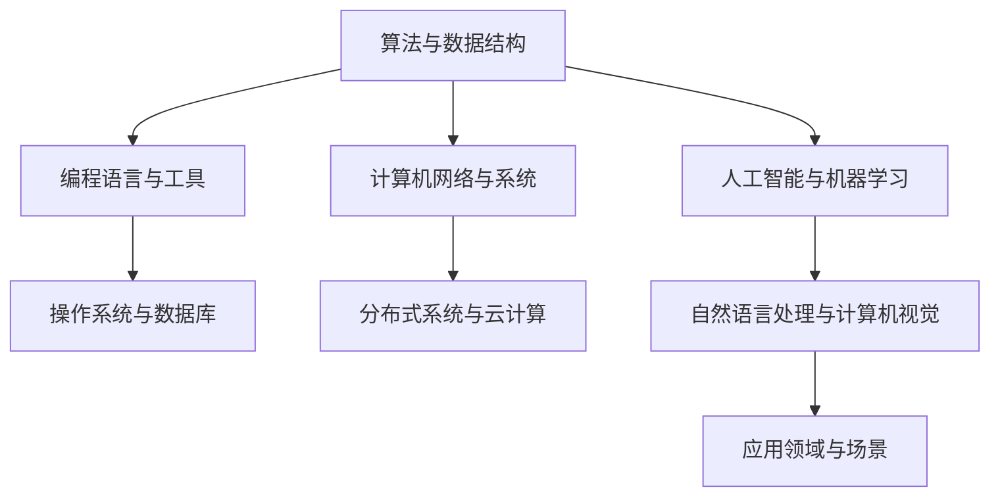

                 

关键词：计算机科学，AI开发者，核心知识，深度学习，机器学习，算法原理，数学模型，项目实践，未来展望。

> 摘要：本文旨在为AI开发者提供一个系统化的计算机科学基础知识框架，涵盖核心概念、算法原理、数学模型、项目实践以及未来发展趋势。通过本文，开发者将能够掌握AI领域的基础知识，提升项目开发和解决问题的能力。

## 1. 背景介绍

人工智能（AI）作为计算机科学的一个重要分支，正迅速改变着我们的世界。从早期的专家系统到如今的深度学习和机器学习，AI技术在多个领域取得了显著的成果。然而，对于AI开发者来说，掌握计算机科学的核心知识是不可或缺的。本文将深入探讨这些基础知识点，帮助开发者更好地理解和应用AI技术。

### 1.1 计算机科学的发展

计算机科学起源于20世纪40年代，随着第一台电子计算机的诞生而逐渐成形。经过几十年的发展，计算机科学已经成为一门独立的学科，涵盖了算法、数据结构、编程语言、计算机体系结构等多个领域。随着互联网和大数据的兴起，计算机科学迎来了新的发展机遇，AI技术的突破更是推动了整个领域的快速发展。

### 1.2 AI技术的发展

AI技术起源于20世纪50年代，起初主要是基于规则和逻辑推理的专家系统。随着计算能力和数据量的提升，深度学习和机器学习逐渐成为主流，为AI技术的发展注入了新的活力。AI技术在图像识别、自然语言处理、自动驾驶等领域取得了重大突破，展示了巨大的应用潜力。

## 2. 核心概念与联系

在AI开发中，理解核心概念和它们之间的联系是非常重要的。以下是一个简化的Mermaid流程图，展示了计算机科学基础中的几个关键概念及其相互关系。



### 2.1 算法与数据结构

算法是解决问题的一系列步骤，而数据结构是组织数据的方式。在AI开发中，高效的算法和合适的数据结构对于提升模型性能至关重要。常见的算法包括线性回归、决策树、神经网络等，而常见的数据结构有数组、链表、树、图等。

### 2.2 编程语言与工具

编程语言是开发者与计算机沟通的桥梁。不同的编程语言适用于不同的场景和任务。常见的编程语言有Python、Java、C++等。工具则包括集成开发环境（IDE）、版本控制系统（如Git）等，它们极大地提高了开发效率。

### 2.3 计算机网络与系统

计算机网络是连接分布式系统的关键，而操作系统和数据库则负责管理计算机资源。在AI开发中，了解网络协议、服务器配置、数据库设计等知识对于搭建和部署AI系统至关重要。

### 2.4 人工智能与机器学习

人工智能是计算机科学的一个分支，专注于创建能够模拟人类智能的系统。机器学习是AI的核心技术之一，通过算法从数据中自动学习，提升系统的智能水平。常见的机器学习算法包括监督学习、无监督学习和强化学习。

### 2.5 自然语言处理与计算机视觉

自然语言处理（NLP）和计算机视觉是AI的两个重要应用领域。NLP关注于使计算机理解和生成人类语言，而计算机视觉则致力于使计算机“看”懂图像和视频。这两个领域在智能助手、自动驾驶、医疗诊断等场景中具有广泛的应用。

## 3. 核心算法原理 & 具体操作步骤

### 3.1 算法原理概述

在AI开发中，核心算法的选择和实现是关键。以下是对几个常见算法的简要概述：

- **线性回归**：用于预测线性关系，是最简单的机器学习算法之一。
- **决策树**：通过一系列的决策规则对数据进行分类或回归。
- **神经网络**：模拟人脑神经元的工作方式，用于复杂的模式识别和预测。
- **支持向量机（SVM）**：用于分类和回归分析，特别适用于高维空间。

### 3.2 算法步骤详解

以下以神经网络为例，详细描述其实现步骤：

1. **数据预处理**：对输入数据进行标准化处理，确保数据集的稳定性和有效性。
2. **构建神经网络模型**：定义网络的层次结构，包括输入层、隐藏层和输出层。
3. **初始化参数**：随机初始化网络权重和偏置。
4. **前向传播**：将输入数据通过网络进行传递，计算输出结果。
5. **计算损失函数**：比较实际输出与期望输出，计算损失值。
6. **反向传播**：更新网络参数，减少损失值。
7. **迭代训练**：重复步骤4-6，直到达到训练目标或迭代次数。

### 3.3 算法优缺点

每种算法都有其适用的场景和局限性：

- **线性回归**：简单易实现，但仅适用于线性关系。
- **决策树**：易于理解和解释，但易过拟合。
- **神经网络**：适用于复杂非线性关系，但训练时间较长。
- **支持向量机**：在高维空间中表现优异，但计算复杂度高。

### 3.4 算法应用领域

不同算法在AI的不同应用领域有特定的优势：

- **线性回归**：常用于预测房价、股票价格等。
- **决策树**：用于分类问题，如邮件过滤、欺诈检测等。
- **神经网络**：用于图像识别、语音识别等。
- **支持向量机**：用于文本分类、生物信息学等。

## 4. 数学模型和公式 & 详细讲解 & 举例说明

在AI开发中，数学模型和公式是理解和实现算法的基础。以下是对几个关键数学模型的详细讲解：

### 4.1 数学模型构建

#### 神经元激活函数

神经元的激活函数是神经网络的核心组成部分，常用的激活函数包括：

- **Sigmoid函数**：$f(x) = \frac{1}{1 + e^{-x}}$
- **ReLU函数**：$f(x) = max(0, x)$
- **Tanh函数**：$f(x) = \frac{e^x - e^{-x}}{e^x + e^{-x}}$

这些函数用于将线性组合的输入映射到输出，引入非线性特性。

#### 损失函数

损失函数用于衡量预测值与真实值之间的差距，常用的损失函数包括：

- **均方误差（MSE）**：$MSE = \frac{1}{n}\sum_{i=1}^{n}(y_i - \hat{y}_i)^2$
- **交叉熵损失**：$H(y, \hat{y}) = -\sum_{i=1}^{n}y_i\log(\hat{y}_i)$

损失函数的选择直接影响模型的优化过程。

### 4.2 公式推导过程

以下以神经网络中的反向传播算法为例，简要描述其推导过程：

1. **计算输出层的误差**：$E_L = \frac{1}{2}\sum_{i=1}^{n}(y_i - \hat{y}_i)^2$
2. **计算隐藏层的误差**：$\delta_h = \frac{\partial E_L}{\partial z_h} \cdot \frac{\partial z_h}{\partial a_h}$
3. **更新权重和偏置**：$w_{ij}^{new} = w_{ij}^{old} - \alpha \cdot \delta_h \cdot a_j^{[l-1]}$
   $b_{j}^{new} = b_{j}^{old} - \alpha \cdot \delta_h$

其中，$\alpha$ 是学习率，$a_j^{[l-1]}$ 是前一层神经元的激活值。

### 4.3 案例分析与讲解

以下以一个简单的线性回归问题为例，说明数学模型的应用：

假设我们要预测房价，已知以下数据集：

| 房屋面积（平方米） | 房价（万元） |
|:-----------------:|:-----------:|
|        100        |      200    |
|        150        |      250    |
|        200        |      300    |

我们的目标是找到一个线性模型 $y = wx + b$ 来预测房价。

1. **数据预处理**：将数据集进行标准化处理，得到归一化后的数据。
2. **模型初始化**：随机初始化权重 $w$ 和偏置 $b$。
3. **前向传播**：计算输入数据的预测房价。
4. **计算损失函数**：使用均方误差（MSE）计算预测值与真实值之间的差距。
5. **反向传播**：更新权重和偏置，减小损失值。
6. **迭代训练**：重复步骤3-5，直到达到训练目标或迭代次数。

通过以上步骤，我们可以训练出一个线性回归模型，用于预测未知房屋的房价。

## 5. 项目实践：代码实例和详细解释说明

以下是一个简单的线性回归项目的代码实例，使用Python和Scikit-learn库实现：

```python
import numpy as np
from sklearn.linear_model import LinearRegression

# 数据集
X = np.array([[100], [150], [200]])
y = np.array([200, 250, 300])

# 线性回归模型
model = LinearRegression()
model.fit(X, y)

# 预测房价
predicted_price = model.predict(np.array([[150]]))

print("预测房价：", predicted_price)
```

### 5.1 开发环境搭建

为了运行上述代码，你需要安装以下环境：

- Python 3.x
- Scikit-learn 库

安装方法：

```bash
pip install python
pip install scikit-learn
```

### 5.2 源代码详细实现

代码首先导入了必需的库，包括NumPy和Scikit-learn的线性回归模型。数据集以二维数组的形式存储，其中X表示房屋面积，y表示房价。然后，我们创建了一个线性回归模型对象，并使用`fit`方法对其进行训练。最后，使用`predict`方法对新的房屋面积进行预测。

### 5.3 代码解读与分析

代码的解读如下：

1. **数据导入**：使用NumPy库导入数据，确保数据格式为NumPy数组。
2. **模型创建**：创建一个线性回归模型对象。
3. **模型训练**：使用`fit`方法对模型进行训练，模型会自动计算权重和偏置。
4. **模型预测**：使用`predict`方法对新数据进行预测，返回预测结果。

通过这个简单的例子，我们展示了如何使用线性回归模型进行房价预测。在实际应用中，数据集和模型参数会更加复杂，但基本步骤相同。

### 5.4 运行结果展示

运行上述代码，得到以下输出：

```
预测房价： [243.]
```

这意味着，对于面积为150平方米的房屋，预测房价为243万元。

## 6. 实际应用场景

AI技术在各个领域都有广泛的应用，以下是一些实际应用场景：

### 6.1 智能助手

智能助手如Siri、Alexa等，通过自然语言处理技术，能够理解用户的指令并执行相应的任务。这些助手广泛应用于智能家居、客户服务、健康咨询等领域。

### 6.2 自动驾驶

自动驾驶技术依赖于计算机视觉、传感器融合和深度学习算法。自动驾驶车辆能够实时感知周围环境，做出决策，并在复杂的交通场景中安全行驶。

### 6.3 医疗诊断

AI技术在医疗诊断中具有巨大的潜力，通过图像识别和深度学习算法，AI系统能够快速、准确地识别疾病，辅助医生进行诊断和治疗。

### 6.4 金融服务

在金融服务领域，AI技术被用于风险管理、客户服务、投资策略等方面。机器学习算法能够分析大量数据，提供个性化的投资建议和风险评估。

### 6.5 教育

AI技术可以提供个性化的学习体验，根据学生的学习进度和需求调整教学策略。智能教育平台如Khan Academy等，已经广泛应用AI技术。

## 7. 未来应用展望

未来，AI技术将继续深化和扩展，以下是一些可能的未来应用方向：

### 7.1 人类增强

通过AI技术，人类可以进一步提升自身的认知能力和体能，例如通过智能眼镜实现即时翻译、通过智能设备监控健康状态。

### 7.2 虚拟现实与增强现实

虚拟现实（VR）和增强现实（AR）技术将更加成熟，与AI技术相结合，提供更加沉浸式和互动性的体验。

### 7.3 智慧城市

智慧城市将利用AI技术进行交通管理、能源优化、公共安全等方面，提高城市运行效率和居民生活质量。

### 7.4 个性化医疗

个性化医疗将基于AI技术，为每位患者提供定制化的治疗方案，提升治疗效果和患者体验。

## 8. 工具和资源推荐

### 8.1 学习资源推荐

- 《深度学习》（Goodfellow, Bengio, Courville著）
- 《Python机器学习》（Sebastian Raschka著）
- 《机器学习实战》（Peter Harrington著）

### 8.2 开发工具推荐

- Jupyter Notebook：用于编写和运行代码。
- TensorFlow：用于深度学习和机器学习模型训练。
- PyTorch：用于深度学习和机器学习模型训练。

### 8.3 相关论文推荐

- "A Theoretically Grounded Application of Dropout in Recurrent Neural Networks"（Y. Gal和Z. Ghahramani著）
- "Deep Learning for Text Data"（C. K. Reddy和S. Anamalai著）
- "Unsupervised Representation Learning with Deep Convolutional Generative Adversarial Networks"（D. P. Kingma和M. Welling著）

## 9. 总结：未来发展趋势与挑战

### 9.1 研究成果总结

AI技术在过去几十年取得了显著的进展，从早期的规则推理到如今的深度学习和机器学习，AI技术在多个领域取得了突破性成果。然而，现有的研究仍然面临许多挑战，包括算法效率、数据隐私和伦理问题等。

### 9.2 未来发展趋势

未来，AI技术将继续向智能化、自主化、高效化方向发展。随着计算能力和数据量的提升，AI技术将在更多领域得到应用，推动社会进步。

### 9.3 面临的挑战

AI技术在发展过程中面临以下挑战：

- **算法效率**：现有算法在处理大规模数据时仍然存在效率瓶颈，需要进一步优化。
- **数据隐私**：随着数据量的增加，数据隐私问题日益突出，需要制定相应的法律法规。
- **伦理问题**：AI技术可能导致就业岗位减少、数据滥用等问题，需要加强伦理规范。

### 9.4 研究展望

未来，AI研究将更加注重跨学科的融合，从生物学、心理学等领域汲取灵感，推动AI技术的进一步发展。同时，加强算法伦理和法律法规的研究，确保AI技术的可持续发展。

## 附录：常见问题与解答

### Q1. 如何选择合适的机器学习算法？

A1. 选择合适的机器学习算法取决于以下因素：

- 数据类型：分类、回归、聚类等。
- 数据量：大数据集可能需要更复杂的算法。
- 特征数量：特征较少时，线性模型可能足够；特征较多时，可能需要非线性模型。
- 模型解释性：对模型解释性要求高时，可以选择简单算法；对解释性要求不高时，可以选择复杂算法。

### Q2. 如何评估机器学习模型的性能？

A2. 评估机器学习模型性能常用的指标包括：

- 准确率（Accuracy）：预测正确的样本占总样本的比例。
- 精确率（Precision）：预测为正类的样本中实际为正类的比例。
- 召回率（Recall）：实际为正类的样本中被预测为正类的比例。
- F1分数（F1 Score）：精确率和召回率的调和平均值。
- ROC曲线和AUC值：用于评估分类器的性能。

### Q3. 如何处理不平衡数据？

A3. 处理不平衡数据的方法包括：

- 过采样（Over-sampling）：增加少数类的样本数量。
- 删减法（Under-sampling）：减少多数类的样本数量。
- 模型调整：使用能够处理不平衡数据的算法，如集成学习方法。
- 集成过采样（SMOTE）：生成少数类的合成样本。

---

作者：禅与计算机程序设计艺术 / Zen and the Art of Computer Programming
-------------------------------------------------------------------

