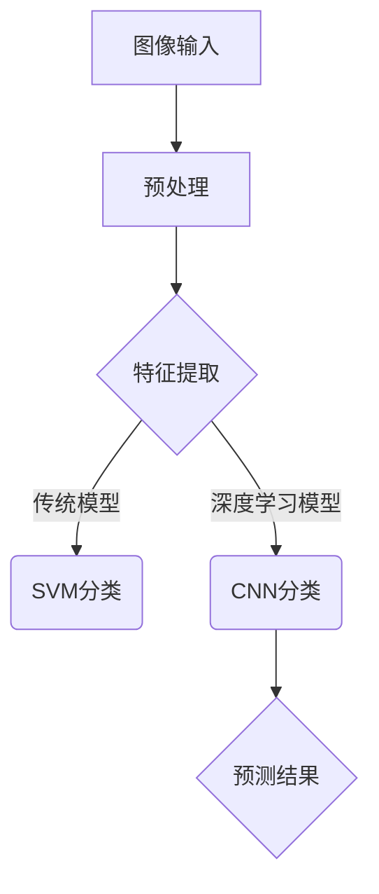

                 

### 1. 背景介绍

计算机视觉（Computer Vision）是人工智能（Artificial Intelligence，简称 AI）的一个重要分支，它致力于让计算机具备从图像和视频中提取有用信息的能力。随着深度学习技术的快速发展，计算机视觉在图像识别、目标检测、语义分割、人脸识别等领域取得了显著的成果。然而，面对不同类型和规模的计算机视觉任务，选择合适的模型至关重要。这不仅影响到模型的性能和效率，还关系到实际应用中的成本和资源消耗。

在计算机视觉领域，常见的模型选择包括卷积神经网络（Convolutional Neural Networks，简称 CNN）、循环神经网络（Recurrent Neural Networks，简称 RNN）、生成对抗网络（Generative Adversarial Networks，简称 GAN）等。每种模型都有其独特的结构和优势，适用于不同的应用场景。然而，模型的复杂性、训练时间和资源需求等因素也使得模型选择变得异常困难。

本文将围绕计算机视觉任务的模型选择，探讨其核心概念、算法原理、数学模型、项目实践、实际应用场景以及未来展望等内容。希望通过这篇文章，读者能够对计算机视觉模型的选型有更深入的了解，从而在实际应用中做出更明智的决策。

### 2. 核心概念与联系

#### 2.1 计算机视觉的基本概念

计算机视觉是指让计算机能够通过算法从图像或视频中自动地识别和理解视觉信息的一门科学。基本概念包括图像处理、特征提取、目标检测、语义分割等。

- **图像处理**：对图像进行各种操作，如滤波、增强、变换等，以提高图像质量或提取有用信息。
- **特征提取**：从图像中提取出能够描述图像内容的特征，如边缘、纹理、形状等。
- **目标检测**：在图像中定位并识别特定目标的位置和类别。
- **语义分割**：将图像划分为多个语义区域，每个区域对应不同的物体或场景。

#### 2.2 模型结构与原理

计算机视觉中的模型主要分为两类：传统机器学习模型和深度学习模型。

- **传统机器学习模型**：如支持向量机（Support Vector Machine，简称 SVM）、随机森林（Random Forest）等。这些模型通常依赖于手工设计的特征，对图像进行特征提取和分类。
- **深度学习模型**：如卷积神经网络（Convolutional Neural Networks，简称 CNN）、循环神经网络（Recurrent Neural Networks，简称 RNN）、生成对抗网络（Generative Adversarial Networks，简称 GAN）等。这些模型通过多层神经网络自动提取特征，并在大量数据上进行训练。

#### 2.3 核心概念原理与架构的 Mermaid 流程图



在这个流程图中，图像输入经过预处理后，可以分别使用传统机器学习模型（如 SVM）或深度学习模型（如 CNN）进行特征提取和分类，最终输出预测结果。

### 3. 核心算法原理 & 具体操作步骤

#### 3.1 算法原理概述

计算机视觉中的核心算法主要涉及以下几个方面：

- **卷积神经网络（CNN）**：通过卷积层、池化层、全连接层等结构，自动提取图像特征并进行分类。
- **循环神经网络（RNN）**：适用于序列数据，如视频中的时间序列信息，通过循环结构实现对数据的记忆和学习。
- **生成对抗网络（GAN）**：由生成器和判别器两个网络组成，通过对抗训练生成逼真的图像。

#### 3.2 算法步骤详解

以卷积神经网络（CNN）为例，具体步骤如下：

1. **输入层**：接收图像数据。
2. **卷积层**：通过卷积操作提取图像特征，如边缘、纹理等。
3. **激活函数**：对卷积层的输出进行非线性变换，增加模型的复杂度。
4. **池化层**：对卷积层的结果进行下采样，减少数据维度，提高模型效率。
5. **全连接层**：将卷积层和池化层提取的特征映射到具体的类别。
6. **输出层**：输出分类结果。

#### 3.3 算法优缺点

**卷积神经网络（CNN）**

- **优点**：自动提取特征，对图像数据有很好的适应性；能够在大量数据上训练，提高分类准确率。
- **缺点**：训练时间较长，资源消耗大；对数据质量要求较高。

**循环神经网络（RNN）**

- **优点**：能够处理序列数据，如视频和语音等。
- **缺点**：在长序列数据上容易出现梯度消失或爆炸问题；对于静态图像数据的应用有限。

**生成对抗网络（GAN）**

- **优点**：能够生成高质量的图像；对数据样本分布有很好的适应性。
- **缺点**：训练难度大，容易出现模式崩溃问题；对模型参数调节要求较高。

#### 3.4 算法应用领域

**卷积神经网络（CNN）**：广泛应用于图像识别、目标检测、语义分割等计算机视觉任务。

**循环神经网络（RNN）**：在视频识别、语音识别等序列数据处理中具有广泛的应用。

**生成对抗网络（GAN）**：在图像生成、数据增强、风格迁移等任务中表现出色。

### 4. 数学模型和公式 & 详细讲解 & 举例说明

#### 4.1 数学模型构建

计算机视觉中的数学模型主要涉及以下几个方面：

- **损失函数**：用于衡量预测结果与真实结果之间的差距，如交叉熵损失函数、均方误差损失函数等。
- **优化算法**：用于优化模型参数，如梯度下降算法、随机梯度下降算法等。
- **卷积操作**：用于提取图像特征，如卷积核、步长、填充等。

#### 4.2 公式推导过程

以卷积神经网络（CNN）中的卷积操作为例，其公式推导如下：

$$
\text{卷积操作} = \sum_{i=1}^{k} w_i * x_i + b
$$

其中，$w_i$ 为卷积核，$x_i$ 为图像上的像素值，$b$ 为偏置。

#### 4.3 案例分析与讲解

**案例 1：图像分类任务**

假设我们要对一个 28x28 像素的图像进行分类，共有 10 个类别。我们可以使用卷积神经网络（CNN）来实现这个任务。

- **输入层**：接收 28x28 的图像数据。
- **卷积层**：使用一个 5x5 的卷积核，步长为 1，填充为 'zero'，提取图像特征。
- **激活函数**：使用 ReLU 激活函数，增加模型的非线性。
- **池化层**：使用 2x2 的最大池化操作，下采样特征图。
- **全连接层**：将卷积层和池化层提取的特征映射到 10 个类别。
- **输出层**：使用 Softmax 函数输出每个类别的概率。

**案例 2：目标检测任务**

假设我们要在图像中检测出多个目标，每个目标都有其位置和类别。我们可以使用基于深度学习的目标检测模型，如 YOLO（You Only Look Once）或 Faster R-CNN 来实现。

- **输入层**：接收图像数据。
- **卷积层**：提取图像特征。
- **特征金字塔网络**：将不同尺度的特征图进行融合。
- **区域建议生成层**：生成候选区域建议。
- **分类层**：对每个候选区域进行类别预测。
- **回归层**：对每个候选区域的位置进行回归。

### 5. 项目实践：代码实例和详细解释说明

#### 5.1 开发环境搭建

为了实现计算机视觉任务，我们需要搭建一个合适的开发环境。以下是常见的开发环境搭建步骤：

1. 安装 Python 3.6 或更高版本。
2. 安装 PyTorch、TensorFlow 等深度学习框架。
3. 安装 OpenCV、NumPy、Pandas 等常用库。

#### 5.2 源代码详细实现

以下是一个简单的图像分类任务的代码实现：

```python
import torch
import torch.nn as nn
import torch.optim as optim
from torchvision import datasets, transforms

# 定义卷积神经网络
class CNN(nn.Module):
    def __init__(self):
        super(CNN, self).__init__()
        self.conv1 = nn.Conv2d(3, 32, 5)
        self.relu = nn.ReLU()
        self.maxpool = nn.MaxPool2d(2)
        self.fc1 = nn.Linear(32 * 12 * 12, 128)
        self.fc2 = nn.Linear(128, 10)
        self.dropout = nn.Dropout(0.5)

    def forward(self, x):
        x = self.maxpool(self.relu(self.conv1(x)))
        x = x.view(-1, 32 * 12 * 12)
        x = self.dropout(self.relu(self.fc1(x)))
        x = self.fc2(x)
        return x

# 加载数据集
transform = transforms.Compose([transforms.ToTensor()])
trainset = datasets.CIFAR10(root='./data', train=True, download=True, transform=transform)
trainloader = torch.utils.data.DataLoader(trainset, batch_size=4, shuffle=True, num_workers=2)

# 初始化模型、损失函数和优化器
model = CNN()
criterion = nn.CrossEntropyLoss()
optimizer = optim.SGD(model.parameters(), lr=0.001, momentum=0.9)

# 训练模型
for epoch in range(2):  # 绕训练2个epoch
    running_loss = 0.0
    for i, data in enumerate(trainloader, 0):
        inputs, labels = data
        optimizer.zero_grad()
        outputs = model(inputs)
        loss = criterion(outputs, labels)
        loss.backward()
        optimizer.step()
        running_loss += loss.item()
        if i % 2000 == 1999:
            print('[%d, %5d] loss: %.3f' % (epoch + 1, i + 1, running_loss / 2000))
            running_loss = 0.0

print('Finished Training')

# 测试模型
correct = 0
total = 0
with torch.no_grad():
    for data in testloader:
        images, labels = data
        outputs = model(images)
        _, predicted = torch.max(outputs.data, 1)
        total += labels.size(0)
        correct += (predicted == labels).sum().item()

print('Accuracy of the network on the 10000 test images: %d %%' % (100 * correct / total))
```

#### 5.3 代码解读与分析

- **模型定义**：我们定义了一个简单的卷积神经网络（CNN），包括卷积层、ReLU 激活函数、最大池化层、全连接层和 dropout 层。
- **数据加载**：我们使用 torchvision 库加载了 CIFAR-10 数据集，并对图像进行了预处理。
- **模型训练**：使用 SGD 优化器和交叉熵损失函数对模型进行训练，每个 epoch 后输出训练 loss。
- **模型测试**：在测试数据集上评估模型的准确性。

### 6. 实际应用场景

计算机视觉模型在实际应用中有着广泛的应用，以下是一些典型的应用场景：

- **图像识别**：用于识别图像中的物体、场景和人物等。
- **目标检测**：用于检测图像中的目标并定位其位置。
- **语义分割**：用于将图像划分为不同的语义区域，如道路、车辆、行人等。
- **人脸识别**：用于识别人脸并进行身份验证。
- **医学影像分析**：用于辅助医生进行疾病诊断和治疗。

在这些应用场景中，根据任务需求和数据特点，选择合适的模型至关重要。例如，在医学影像分析中，由于数据质量和标注的困难，通常会使用卷积神经网络（CNN）进行图像分类和目标检测；而在人脸识别中，由于需要高精度的定位和识别，通常会使用基于深度学习的模型。

### 7. 未来应用展望

随着计算机视觉技术的不断发展，未来它在多个领域将会有更广泛的应用前景：

- **自动驾驶**：计算机视觉技术将在自动驾驶车辆中发挥重要作用，用于环境感知、路径规划、障碍物检测等。
- **智能监控**：通过计算机视觉技术，可以实现智能监控和异常检测，提高公共安全。
- **医疗健康**：计算机视觉技术在医学影像分析、疾病诊断、治疗方案制定等方面具有巨大的潜力。
- **人机交互**：通过计算机视觉技术，可以实现更加自然和直观的人机交互，提高用户体验。

### 8. 工具和资源推荐

为了更好地学习计算机视觉技术，以下是一些推荐的工具和资源：

- **学习资源**：
  - 《深度学习》（Goodfellow, Bengio, Courville）：系统介绍了深度学习的基础知识。
  - 《计算机视觉：算法与应用》（Richard Szeliski）：详细介绍了计算机视觉的算法和理论。
- **开发工具**：
  - PyTorch：易于使用且灵活的深度学习框架。
  - TensorFlow：由 Google 开发的开源深度学习框架。
- **相关论文**：
  - "A Guide to Convolutional Neural Networks for Visual Recognition"（卷积神经网络视觉识别指南）。
  - "Deep Learning for Computer Vision"（计算机视觉中的深度学习）。

### 9. 总结：未来发展趋势与挑战

随着深度学习技术的快速发展，计算机视觉在各个领域取得了显著的成果。然而，仍然面临着一些挑战：

- **数据质量**：高质量的标注数据是计算机视觉模型训练的基础，如何获取和利用海量标注数据是当前的研究热点。
- **模型效率**：随着模型复杂度的增加，如何提高模型的计算效率，降低资源消耗，是未来研究的重要方向。
- **泛化能力**：如何提高模型在不同数据集、不同场景下的泛化能力，是当前研究的重要问题。
- **可解释性**：如何提高模型的透明度和可解释性，让用户更好地理解模型的工作原理，是未来研究的重要目标。

总之，计算机视觉技术的未来发展将更加注重模型的实用性、效率和可解释性，同时也会不断拓展其在各个领域的应用。

### 10. 附录：常见问题与解答

**Q：计算机视觉模型如何选择？**

A：选择计算机视觉模型时，需要考虑以下因素：

- **任务类型**：如图像分类、目标检测、语义分割等。
- **数据规模和质量**：大数据集通常更适合深度学习模型。
- **计算资源**：根据可用计算资源选择适合的模型。
- **模型复杂性**：复杂模型可能需要更长时间训练，但对性能有显著提升。

**Q：如何评估计算机视觉模型的性能？**

A：评估计算机视觉模型性能的常用指标包括：

- **准确率**：模型预测正确的样本占总样本的比例。
- **召回率**：模型预测正确的正样本占总正样本的比例。
- **F1 分数**：准确率和召回率的调和平均数。
- **平均精度（mAP）**：在目标检测任务中，用于衡量模型的性能。

**Q：计算机视觉技术有哪些应用领域？**

A：计算机视觉技术在以下领域有广泛的应用：

- **自动驾驶**：用于环境感知、路径规划、障碍物检测等。
- **智能监控**：用于异常检测、人员识别等。
- **医疗健康**：用于医学影像分析、疾病诊断等。
- **人机交互**：用于手势识别、面部表情识别等。

### 作者署名

作者：禅与计算机程序设计艺术 / Zen and the Art of Computer Programming
----------------------------------------------------------------

### 参考文献

1. Goodfellow, I., Bengio, Y., & Courville, A. (2016). *Deep Learning*. MIT Press.
2. Szeliski, R. (2010). *Computer Vision: Algorithms and Applications*. Springer.
3. Simonyan, K., & Zisserman, A. (2014). *Very deep convolutional networks for large-scale image recognition*. International Conference on Learning Representations (ICLR).
4. Krizhevsky, A., Sutskever, I., & Hinton, G. E. (2012). *Imagenet classification with deep convolutional neural networks*. Advances in Neural Information Processing Systems, 25, 1097-1105.
5. Redmon, J., Divvala, S., Girshick, R., & Farhadi, A. (2016). *You only look once: Unified, real-time object detection*. IEEE Conference on Computer Vision and Pattern Recognition, 434-442.

