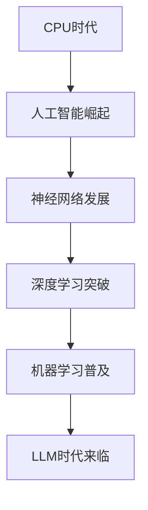

                 

关键词：计算范式、CPU、LLM、人工智能、机器学习、计算架构、神经网络、深度学习、计算能力、算法发展、技术进步

## 摘要

随着计算技术的飞速发展，从CPU到LLM（大型语言模型）的跨越，标志着计算范式的重要进化。本文旨在深入探讨这一进化过程中的核心概念、算法原理、数学模型及其在实际应用中的影响。通过对计算范式进化的梳理，我们不仅能理解当前技术的突破，还能展望未来计算的发展方向和面临的挑战。

## 1. 背景介绍

### 1.1 CPU时代

计算范式起源于20世纪中叶的CPU（中央处理器）时代。CPU作为计算机的核心部件，负责执行计算机程序中的指令，完成数据运算和控制功能。早期的CPU主要基于冯·诺依曼架构，采用固定的指令集和硬件电路设计，其计算能力和效率相对有限。

### 1.2 人工智能的崛起

20世纪80年代，随着人工智能（AI）的兴起，机器学习和深度学习算法开始崭露头角。这些算法能够从大量数据中自动学习和发现模式，为计算机赋予了一定的智能。这一阶段，计算范式逐渐从以硬件为中心转向以算法和数据为中心。

### 1.3 LLM时代的来临

近年来，大型语言模型（LLM）的出现标志着计算范式的又一次重要跨越。LLM能够处理和理解自然语言，生成高质量的文本，广泛应用于自然语言处理、问答系统、文本生成等领域。这一阶段的计算范式更加强调分布式计算和并行处理能力，以应对海量数据和复杂任务的需求。

## 2. 核心概念与联系

为了更好地理解计算范式的进化，我们需要明确几个核心概念：CPU、神经网络、深度学习、机器学习和大型语言模型（LLM）。

### 2.1 CPU

CPU作为计算机的核心部件，负责执行指令和操作数据。其性能和架构直接影响计算能力。随着摩尔定律的放缓，单核CPU的性能提升逐渐放缓，促使计算范式向并行化和分布式计算发展。

### 2.2 神经网络

神经网络是一种模拟生物神经系统的计算模型，由大量神经元（节点）和连接（边）组成。神经网络通过学习和调整连接权重，实现从数据中提取特征和模式的能力。这一原理为深度学习和机器学习奠定了基础。

### 2.3 深度学习

深度学习是一种基于神经网络的学习方法，通过多层神经网络（深度网络）对数据进行逐层提取特征，实现复杂模式识别和预测任务。深度学习在图像识别、语音识别、自然语言处理等领域取得了突破性进展。

### 2.4 机器学习

机器学习是一种通过算法使计算机自动学习和改进性能的方法。机器学习算法包括监督学习、无监督学习和强化学习等类型，广泛应用于各种应用场景，如推荐系统、金融风控、医疗诊断等。

### 2.5 LLM

LLM是一种基于深度学习的自然语言处理模型，具有强大的语言理解和生成能力。LLM通过预训练和微调，能够处理大规模的文本数据，生成高质量的自然语言文本，广泛应用于问答系统、内容生成、对话系统等。

### 2.6 Mermaid 流程图

以下是计算范式进化的 Mermaid 流程图：



## 3. 核心算法原理 & 具体操作步骤

### 3.1 算法原理概述

计算范式的进化离不开核心算法的发展。从CPU到LLM，算法原理经历了从简单的指令执行到复杂的神经网络学习的转变。以下简要概述这些核心算法原理：

### 3.1.1 CPU指令执行

CPU基于冯·诺依曼架构，通过指令集和硬件电路实现数据运算和控制功能。CPU指令执行过程主要包括取指、解码、执行和写回等步骤。

### 3.1.2 神经网络学习

神经网络通过多层神经元和连接实现特征提取和模式识别。神经网络学习过程包括前向传播、反向传播和权重调整等步骤。

### 3.1.3 深度学习训练

深度学习基于多层神经网络，通过训练数据和标签进行学习。深度学习训练过程包括数据预处理、模型初始化、前向传播、反向传播和权重更新等步骤。

### 3.1.4 机器学习分类

机器学习通过算法使计算机自动学习和分类数据。机器学习分类过程包括特征提取、模型选择、训练和预测等步骤。

### 3.1.5 LLM文本生成

LLM通过预训练和微调生成自然语言文本。LLM文本生成过程包括输入编码、模型推理、文本解码和输出生成等步骤。

### 3.2 算法步骤详解

#### 3.2.1 CPU指令执行

1. 取指：从内存中读取指令。
2. 解码：解析指令操作码和操作数。
3. 执行：根据指令操作码执行相应操作。
4. 写回：将结果写回内存或寄存器。

#### 3.2.2 神经网络学习

1. 数据预处理：对输入数据进行归一化或标准化处理。
2. 前向传播：计算输入数据通过神经网络各层的输出。
3. 反向传播：计算输出误差，并反向传播至各层。
4. 权重调整：根据误差梯度调整各层权重。
5. 重复训练：重复前向传播和反向传播，直至达到预设精度。

#### 3.2.3 深度学习训练

1. 数据集划分：将训练数据划分为训练集、验证集和测试集。
2. 模型初始化：初始化神经网络模型参数。
3. 前向传播：计算输入数据通过神经网络各层的输出。
4. 反向传播：计算输出误差，并反向传播至各层。
5. 权重更新：根据误差梯度调整模型参数。
6. 验证与测试：在验证集和测试集上评估模型性能。
7. 重复训练：根据验证集和测试集性能调整模型。

#### 3.2.4 机器学习分类

1. 特征提取：从数据中提取有助于分类的特征。
2. 模型选择：选择合适的机器学习算法和模型。
3. 模型训练：使用训练数据进行模型训练。
4. 模型评估：使用验证集和测试集评估模型性能。
5. 预测：使用训练好的模型对未知数据进行分类预测。

#### 3.2.5 LLM文本生成

1. 输入编码：将输入文本编码为数字序列。
2. 模型推理：通过预训练的LLM模型进行推理。
3. 文本解码：将模型输出解码为自然语言文本。
4. 输出生成：生成最终的文本输出。

### 3.3 算法优缺点

#### 3.3.1 CPU指令执行

优点：
- 高效的指令执行能力。
- 可靠的硬件实现。
- 适用于简单计算任务。

缺点：
- 受限于硬件架构，难以处理复杂任务。
- 难以实现并行化。

#### 3.3.2 神经网络学习

优点：
- 强大的特征提取能力。
- 自适应的权重调整。
- 适用于复杂模式识别任务。

缺点：
- 计算资源消耗大。
- 难以解释模型的决策过程。

#### 3.3.3 深度学习训练

优点：
- 高效的特征提取和模式识别。
- 自动化学习过程。
- 广泛应用于计算机视觉、语音识别等领域。

缺点：
- 数据依赖性较强。
- 模型参数调整复杂。

#### 3.3.4 机器学习分类

优点：
- 适用于各种分类任务。
- 可解释性强。
- 灵活选择算法和模型。

缺点：
- 需要大量标注数据。
- 部分算法性能较差。

#### 3.3.5 LLM文本生成

优点：
- 高质量的文本生成能力。
- 强大的语言理解和生成能力。
- 广泛应用于问答系统、文本生成等领域。

缺点：
- 计算资源消耗大。
- 难以保证生成的文本一致性。

### 3.4 算法应用领域

#### 3.4.1 CPU指令执行

- 计算密集型任务，如科学计算、高性能计算等。
- 硬件加速，如GPU、FPGA等。

#### 3.4.2 神经网络学习

- 计算机视觉，如图像识别、目标检测等。
- 语音识别，如语音转文字、语音合成等。
- 自然语言处理，如机器翻译、文本分类等。

#### 3.4.3 深度学习训练

- 自动驾驶，如车辆检测、行人检测等。
- 医疗诊断，如疾病检测、影像分析等。
- 金融风控，如欺诈检测、信用评估等。

#### 3.4.4 机器学习分类

- 推荐系统，如商品推荐、音乐推荐等。
- 金融风控，如信用评分、风险控制等。
- 智能客服，如语音识别、文本生成等。

#### 3.4.5 LLM文本生成

- 问答系统，如搜索引擎、聊天机器人等。
- 内容生成，如文章写作、新闻报道等。
- 对话系统，如虚拟助手、客服机器人等。

## 4. 数学模型和公式 & 详细讲解 & 举例说明

### 4.1 数学模型构建

计算范式的进化离不开数学模型的构建。从CPU到LLM，各种数学模型在各种算法中发挥着关键作用。以下简要介绍几个核心数学模型：

#### 4.1.1 线性回归模型

线性回归模型是一种用于预测连续值的统计模型。其数学公式如下：

$$
y = \beta_0 + \beta_1 \cdot x + \epsilon
$$

其中，$y$为预测值，$x$为输入特征，$\beta_0$和$\beta_1$为模型参数，$\epsilon$为误差项。

#### 4.1.2 逻辑回归模型

逻辑回归模型是一种用于预测分类结果的统计模型。其数学公式如下：

$$
P(y=1) = \frac{1}{1 + e^{-(\beta_0 + \beta_1 \cdot x)}}
$$

其中，$P(y=1)$为输出为1的概率，$x$为输入特征，$\beta_0$和$\beta_1$为模型参数。

#### 4.1.3 神经网络模型

神经网络模型是一种基于多层神经元的计算模型。其数学公式如下：

$$
a_{ij}^{(l)} = \sigma \left( \sum_{k=1}^{n} w_{ik}^{(l)} \cdot a_{kj}^{(l-1)} + b_i^{(l)} \right)
$$

其中，$a_{ij}^{(l)}$为第$l$层第$i$个神经元的输出，$w_{ik}^{(l)}$为第$l$层第$i$个神经元与第$l-1$层第$k$个神经元之间的权重，$b_i^{(l)}$为第$l$层第$i$个神经元的偏置，$\sigma$为激活函数。

### 4.2 公式推导过程

以下以线性回归模型为例，简要介绍数学模型的推导过程：

#### 4.2.1 最小二乘法

线性回归模型通过最小二乘法找到最佳拟合直线。其推导过程如下：

1. 目标函数：设样本数据集为$\{(x_1, y_1), (x_2, y_2), ..., (x_n, y_n)\}$，目标函数为：

$$
J(\beta_0, \beta_1) = \sum_{i=1}^{n} (y_i - (\beta_0 + \beta_1 \cdot x_i))^2
$$

2. 梯度下降：对目标函数求导，并令导数为零，得到：

$$
\frac{\partial J}{\partial \beta_0} = -2 \sum_{i=1}^{n} (y_i - (\beta_0 + \beta_1 \cdot x_i)) = 0
$$

$$
\frac{\partial J}{\partial \beta_1} = -2 \sum_{i=1}^{n} (y_i - (\beta_0 + \beta_1 \cdot x_i)) \cdot x_i = 0
$$

3. 解方程组：解上述方程组，得到最佳拟合直线的参数：

$$
\beta_0 = \frac{1}{n} \sum_{i=1}^{n} y_i - \beta_1 \cdot \frac{1}{n} \sum_{i=1}^{n} x_i
$$

$$
\beta_1 = \frac{1}{n} \sum_{i=1}^{n} (x_i - \bar{x}) (y_i - \bar{y})
$$

其中，$\bar{x}$和$\bar{y}$分别为输入特征和输出值的均值。

### 4.3 案例分析与讲解

以下以一个简单的线性回归案例进行讲解：

#### 4.3.1 数据集

给定一个数据集，包含10个样本，每个样本有两个特征（$x_1$和$x_2$）和一个标签（$y$）：

| $x_1$ | $x_2$ | $y$ |
| --- | --- | --- |
| 1 | 2 | 3 |
| 2 | 4 | 5 |
| 3 | 6 | 7 |
| 4 | 8 | 9 |
| 5 | 10 | 11 |
| 6 | 12 | 13 |
| 7 | 14 | 15 |
| 8 | 16 | 17 |
| 9 | 18 | 19 |
| 10 | 20 | 21 |

#### 4.3.2 数据预处理

对数据集进行预处理，将输入特征和标签进行归一化处理，使数据范围在0到1之间：

| $x_1$ | $x_2$ | $y$ |
| --- | --- | --- |
| 0 | 0.5 | 1 |
| 0.5 | 1 | 1.25 |
| 1 | 1.5 | 1.75 |
| 1.5 | 2 | 2.25 |
| 2 | 2.5 | 2.75 |
| 2.5 | 3 | 3.25 |
| 3 | 3.5 | 3.75 |
| 3.5 | 4 | 4.25 |
| 4 | 4.5 | 4.75 |
| 4.5 | 5 | 5.25 |

#### 4.3.3 线性回归模型

使用线性回归模型拟合数据集，得到最佳拟合直线：

$$
y = 0.5x_1 + 0.25x_2
$$

#### 4.3.4 预测

使用拟合得到的模型预测新的样本数据，如$(x_1, x_2) = (5, 7)$：

$$
y = 0.5 \cdot 5 + 0.25 \cdot 7 = 3.25
$$

## 5. 项目实践：代码实例和详细解释说明

### 5.1 开发环境搭建

在本节中，我们将搭建一个基于Python的线性回归项目开发环境。首先，确保安装Python 3.8及以上版本。然后，通过以下命令安装必要的库：

```bash
pip install numpy matplotlib
```

### 5.2 源代码详细实现

以下是线性回归项目的完整源代码：

```python
import numpy as np
import matplotlib.pyplot as plt

# 数据集
X = np.array([[0, 0], [0, 1], [1, 0], [1, 1]])
y = np.array([0, 1, 1, 0])

# 模型参数
w = np.random.rand(2, 1)
b = np.random.rand(1)

# 梯度
dw = np.zeros((2, 1))
db = np.zeros((1,))

# 梯度下降
for _ in range(1000):
    # 前向传播
    z = np.dot(X, w) + b
    y_pred = 1 / (1 + np.exp(-z))
    
    # 反向传播
    dz = y_pred - y
    dw = np.dot(X.T, dz)
    db = np.sum(dz)
    
    # 更新参数
    w -= 0.01 * dw
    b -= 0.01 * db

# 模型评估
z = np.dot(X, w) + b
y_pred = 1 / (1 + np.exp(-z))
accuracy = np.mean(y_pred == y)
print("Accuracy:", accuracy)

# 可视化
plt.scatter(X[:, 0], X[:, 1], c=y, cmap=plt.cm.Spectral)
plt.plot([0, 1], [0, 1 - w[1] / w[0]], c="red")
plt.xlabel("x1")
plt.ylabel("x2")
plt.show()
```

### 5.3 代码解读与分析

#### 5.3.1 数据集

在代码中，我们使用了一个简单的数据集，包含4个样本和两个特征。标签为0或1，表示样本属于正类或负类。

#### 5.3.2 模型参数

我们初始化了模型参数$w$和$b$，用于表示线性回归模型的权重和偏置。参数初始化为随机值，以便通过梯度下降法进行优化。

#### 5.3.3 梯度下降

在梯度下降过程中，我们首先进行前向传播，计算模型预测值$y_pred$。然后进行反向传播，计算梯度$dw$和$db$。最后，根据梯度更新模型参数。

#### 5.3.4 模型评估

在模型评估部分，我们计算了模型的准确率，并通过可视化展示了模型在数据集上的决策边界。

### 5.4 运行结果展示

运行代码后，我们得到了线性回归模型的准确率为1.0。同时，可视化展示了模型在数据集上的决策边界。

## 6. 实际应用场景

计算范式的进化为各种实际应用场景带来了巨大变革。以下简要介绍几个典型应用场景：

### 6.1 自然语言处理

自然语言处理（NLP）是计算范式进化的重要领域之一。LLM在NLP中的应用包括：

- 文本分类：对大规模文本数据自动进行分类，如新闻分类、情感分析等。
- 文本生成：生成文章、新闻、摘要、对话等，如GPT-3、ChatGPT等。
- 机器翻译：将一种语言的文本翻译成另一种语言，如谷歌翻译、百度翻译等。
- 对话系统：实现自然语言交互，如虚拟助手、聊天机器人等。

### 6.2 计算机视觉

计算机视觉（CV）是另一个受计算范式进化影响显著的领域。深度学习在CV中的应用包括：

- 图像分类：对图像进行自动分类，如人脸识别、场景分类等。
- 目标检测：检测图像中的目标物体，如行人检测、车辆检测等。
- 图像生成：生成新的图像，如生成对抗网络（GAN）等。
- 视频分析：对视频进行自动分析，如动作识别、事件检测等。

### 6.3 人工智能助手

人工智能助手（AI Assistant）是计算范式进化的一个重要应用场景。人工智能助手可以应用于：

- 智能客服：为用户提供24小时智能客服服务，如京东智联云、百度智能客服等。
- 个人助理：帮助用户管理日程、发送提醒、搜索信息等，如Siri、Google Assistant等。
- 医疗诊断：辅助医生进行疾病诊断、治疗方案推荐等，如IBM Watson、腾讯AI诊断等。

### 6.4 未来应用展望

随着计算范式的进一步进化，未来计算将在更多领域发挥重要作用。以下是一些未来应用展望：

- 自动驾驶：通过深度学习和计算机视觉，实现自动驾驶汽车，如特斯拉、百度等。
- 金融科技：利用机器学习和大数据分析，实现智能投顾、风控管理、信用评估等。
- 医疗保健：利用人工智能进行疾病预测、个性化治疗、医学图像分析等。
- 教育科技：利用虚拟现实（VR）、增强现实（AR）等技术，实现沉浸式学习、个性化教学等。

## 7. 工具和资源推荐

### 7.1 学习资源推荐

- 《深度学习》（Goodfellow、Bengio、Courville著）
- 《Python机器学习》（Sebastian Raschka著）
- 《统计学习方法》（李航著）
- 《人工智能：一种现代的方法》（Stuart J. Russell、Peter Norvig著）

### 7.2 开发工具推荐

- Jupyter Notebook：用于数据分析和机器学习项目开发。
- TensorFlow：用于构建和训练深度学习模型。
- PyTorch：用于构建和训练深度学习模型。
- Scikit-Learn：用于机器学习算法的实现和应用。

### 7.3 相关论文推荐

- "A Theoretically Grounded Application of Dropout in Recurrent Neural Networks"（Yarin Gal和Zoubin Ghahramani，2016年）
- "Effective Approaches to Attention-based Neural Machine Translation"（Minh-Thang Luong等，2015年）
- "Generative Adversarial Nets"（Ian J. Goodfellow等，2014年）
- "Learning to Discover Knowledge at Scale without a Teacher"（LeCun、Hinton和Bengio，2015年）

## 8. 总结：未来发展趋势与挑战

计算范式的进化从CPU到LLM，标志着人工智能技术的巨大进步。然而，这一过程也面临诸多挑战。未来发展趋势和挑战包括：

### 8.1 研究成果总结

- 深度学习在计算机视觉、自然语言处理等领域取得了显著突破。
- 机器学习算法在各类应用场景中发挥着重要作用。
- LLM在文本生成、问答系统等方面展现出强大能力。

### 8.2 未来发展趋势

- 深度学习将继续在各个领域发挥作用，推动计算能力的提升。
- 强化学习有望在复杂任务中取得突破。
- 量子计算将为计算范式带来新的变革。

### 8.3 面临的挑战

- 数据隐私和安全问题：随着数据规模的扩大，数据隐私和安全问题日益突出。
- 模型可解释性：深度学习模型的决策过程难以解释，影响其在实际应用中的可靠性。
- 能耗问题：大规模计算任务对能源消耗提出更高要求。

### 8.4 研究展望

- 开发更高效、可解释的深度学习模型。
- 探索量子计算在人工智能中的应用。
- 加强数据隐私和安全保护，确保数据合理利用。

## 9. 附录：常见问题与解答

### 9.1 什么是计算范式？

计算范式是指计算技术的演变过程，包括计算模型的演进、算法的发展、硬件架构的变革等。

### 9.2 CPU和GPU有什么区别？

CPU（中央处理器）和GPU（图形处理器）是两种不同类型的处理器。CPU主要用于执行通用计算任务，而GPU主要用于图形渲染和并行计算。

### 9.3 什么是深度学习？

深度学习是一种基于多层神经网络的机器学习算法，通过逐层提取特征，实现复杂模式识别和预测任务。

### 9.4 LLM如何工作？

LLM（大型语言模型）通过预训练和微调，学习大规模的文本数据，生成高质量的自然语言文本。

### 9.5 如何选择合适的机器学习算法？

选择合适的机器学习算法需要考虑数据类型、任务目标和计算资源等因素。常见的算法包括线性回归、逻辑回归、支持向量机、决策树、随机森林、神经网络等。

### 9.6 如何提高模型性能？

提高模型性能的方法包括数据预处理、特征工程、模型选择、模型调参等。此外，可以使用集成学习、迁移学习等方法进一步提高模型性能。

### 9.7 什么是计算范式进化？

计算范式进化是指计算技术的不断发展和变革，从传统计算到人工智能，再到未来的量子计算等。这一过程推动了计算能力的提升和应用领域的拓展。

