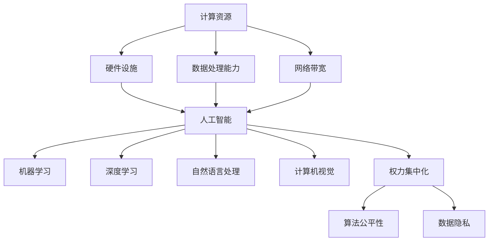

                 

关键词：计算资源、AI、权力集中化、资源分配、算法公平性、数据隐私、网络安全

> 摘要：本文将探讨计算资源与AI权力集中化之间的关系，分析计算资源对AI发展的影响，以及权力集中化对算法公平性和数据隐私的潜在威胁。通过详细的理论分析、案例研究和未来展望，揭示计算资源在AI领域中扮演的关键角色，并探讨如何实现算法的公平性和数据隐私保护。

## 1. 背景介绍

近年来，人工智能（AI）技术取得了飞速发展，越来越多的领域开始采用AI算法来优化决策过程。然而，随着AI技术的普及，计算资源的需求也日益增加。计算资源包括硬件设施、数据处理能力以及网络带宽等，这些资源对于AI算法的训练、推理和部署至关重要。与此同时，AI权力的集中化问题也逐渐引起人们的关注。权力集中化指的是少数几个实体（如大型科技企业或政府机构）掌握了大量计算资源，从而对AI发展的方向和应用产生巨大影响。

计算资源与AI权力集中化之间的关系具有复杂性。一方面，计算资源的充足与否直接影响AI算法的性能和效率；另一方面，权力集中化可能导致算法的偏见和不公平，以及对数据隐私的侵犯。本文将深入探讨这一关系，分析计算资源对AI发展的推动作用，以及权力集中化可能带来的负面影响。

## 2. 核心概念与联系

为了更好地理解计算资源与AI权力集中化之间的关系，我们需要明确以下几个核心概念：

### 2.1 计算资源

计算资源是指用于支持计算机计算和处理的各种资源，包括硬件设施、数据处理能力和网络带宽等。硬件设施如CPU、GPU、TPU等，数据处理能力如数据存储、数据清洗、数据预处理等，网络带宽如互联网连接速度等，都是计算资源的重要组成部分。

### 2.2 人工智能

人工智能是指计算机系统通过模拟人类智能行为，实现感知、学习、推理和决策等功能的技术。AI技术包括机器学习、深度学习、自然语言处理、计算机视觉等领域，这些技术需要大量的计算资源支持。

### 2.3 权力集中化

权力集中化是指少数实体掌握大量资源和权力，对其他实体产生重大影响的现象。在AI领域，权力集中化表现为大型科技企业或政府机构掌握大量计算资源，从而对算法的发展和应用方向产生主导作用。

### 2.4 资源分配与算法公平性

资源分配是指将计算资源合理地分配给不同的AI算法和应用场景。算法公平性是指AI算法在决策过程中是否公平地对待所有个体。资源分配和算法公平性密切相关，计算资源的充足与否直接影响算法的公平性。

### 2.5 数据隐私

数据隐私是指保护个人数据不被未经授权的实体访问和使用。在AI领域，数据隐私尤为重要，因为AI算法的性能往往依赖于大量个人数据的训练和推理。因此，如何保护数据隐私成为了一个亟待解决的问题。

下面是一个简单的Mermaid流程图，展示了计算资源、人工智能、权力集中化、资源分配与算法公平性以及数据隐私之间的联系：



## 3. 核心算法原理 & 具体操作步骤

### 3.1 算法原理概述

本部分将介绍几种核心算法的基本原理，包括机器学习、深度学习和自然语言处理等。

### 3.2 算法步骤详解

以下是每种算法的具体步骤：

#### 3.2.1 机器学习

1. 数据收集：收集具有特定标签的训练数据。
2. 数据预处理：对数据进行清洗、归一化等操作。
3. 特征提取：从原始数据中提取有用的特征。
4. 模型训练：使用训练数据训练模型。
5. 模型评估：使用验证数据评估模型性能。
6. 模型优化：根据评估结果调整模型参数。

#### 3.2.2 深度学习

1. 数据收集：收集具有特定标签的训练数据。
2. 数据预处理：对数据进行清洗、归一化等操作。
3. 网络架构设计：设计深度学习网络结构。
4. 模型训练：使用训练数据训练模型。
5. 模型评估：使用验证数据评估模型性能。
6. 模型优化：根据评估结果调整模型参数。

#### 3.2.3 自然语言处理

1. 数据收集：收集具有特定标签的训练数据。
2. 数据预处理：对数据进行清洗、归一化等操作。
3. 词嵌入：将文本转换为向量表示。
4. 模型训练：使用训练数据训练模型。
5. 模型评估：使用验证数据评估模型性能。
6. 模型优化：根据评估结果调整模型参数。

### 3.3 算法优缺点

每种算法都有其优缺点：

- **机器学习**：优点在于简单、易实现，但缺点在于对数据质量和数量有较高要求，且难以处理复杂的非线性关系。
- **深度学习**：优点在于能够处理复杂的非线性关系，但缺点在于对计算资源需求较高，且训练过程复杂。
- **自然语言处理**：优点在于能够处理自然语言文本数据，但缺点在于对数据预处理和词嵌入方法有较高要求。

### 3.4 算法应用领域

各种算法在不同领域有广泛的应用：

- **机器学习**：广泛应用于图像识别、文本分类、推荐系统等领域。
- **深度学习**：广泛应用于计算机视觉、语音识别、自然语言处理等领域。
- **自然语言处理**：广泛应用于机器翻译、情感分析、问答系统等领域。

## 4. 数学模型和公式 & 详细讲解 & 举例说明

### 4.1 数学模型构建

在本部分，我们将介绍一些常见的数学模型和公式，包括线性回归、逻辑回归、神经网络等。

### 4.2 公式推导过程

以下是每个模型的公式推导过程：

#### 4.2.1 线性回归

1. 假设输入特征为\(x\)，输出值为\(y\)，则线性回归模型可以表示为：
   $$y = \beta_0 + \beta_1x$$
2. 对上式进行求导，得到：
   $$\frac{dy}{dx} = \beta_1$$
3. 将上式代入原式，得到：
   $$y = (\beta_0 + \beta_1x) + \epsilon$$
   其中，\(\epsilon\)为误差项。

#### 4.2.2 逻辑回归

1. 假设输入特征为\(x\)，输出值为\(y\)，则逻辑回归模型可以表示为：
   $$y = \frac{1}{1 + e^{-(\beta_0 + \beta_1x)}}$$
2. 对上式进行求导，得到：
   $$\frac{dy}{dx} = \frac{e^{-(\beta_0 + \beta_1x)}}{(1 + e^{-(\beta_0 + \beta_1x)})^2}$$
3. 将上式代入原式，得到：
   $$y = \frac{1}{1 + e^{-(\beta_0 + \beta_1x + \epsilon)}}$$
   其中，\(\epsilon\)为误差项。

#### 4.2.3 神经网络

1. 假设输入特征为\(x\)，输出值为\(y\)，则神经网络可以表示为：
   $$y = f(\theta^T x)$$
   其中，\(f\)为激活函数，\(\theta\)为权重参数。
2. 对上式进行求导，得到：
   $$\frac{dy}{dx} = \frac{df}{d\theta} \cdot \frac{d\theta}{dx}$$
3. 将上式代入原式，得到：
   $$y = f(\theta^T x + \epsilon)$$
   其中，\(\epsilon\)为误差项。

### 4.3 案例分析与讲解

下面我们通过一个简单的例子，来讲解如何使用这些数学模型进行数据分析和预测。

#### 4.3.1 线性回归案例

假设我们有一组数据，表示房屋价格和房屋面积之间的关系：

| 面积（平方米） | 价格（万元） |
| -------------- | ------------ |
| 100            | 300          |
| 120            | 350          |
| 150            | 400          |

我们希望使用线性回归模型预测面积为200平方米的房屋价格。

1. 数据预处理：对数据进行归一化处理，使得数据范围在0到1之间。
2. 特征提取：将面积作为特征输入到模型。
3. 模型训练：使用训练数据训练线性回归模型。
4. 模型评估：使用验证数据评估模型性能。
5. 模型优化：根据评估结果调整模型参数。

经过训练和优化，我们得到线性回归模型如下：

$$y = 2.5x + 0.5$$

其中，\(x\)为归一化后的面积，\(y\)为归一化后的价格。

6. 预测结果：将面积为200平方米的房屋价格代入模型，得到预测价格为：

$$y = 2.5 \times 0.2 + 0.5 = 1.3$$

因此，面积为200平方米的房屋价格大约为1.3万元。

#### 4.3.2 逻辑回归案例

假设我们有一组数据，表示客户是否购买某种商品，以及影响购买决策的几个因素：

| 年龄 | 收入 | 购买否 |
| ---- | ---- | ------ |
| 25   | 5000 | 否     |
| 30   | 6000 | 是     |
| 35   | 7000 | 是     |

我们希望使用逻辑回归模型预测年龄为40岁，收入为8000元的客户是否购买该商品。

1. 数据预处理：对数据进行归一化处理，使得数据范围在0到1之间。
2. 特征提取：将年龄和收入作为特征输入到模型。
3. 模型训练：使用训练数据训练逻辑回归模型。
4. 模型评估：使用验证数据评估模型性能。
5. 模型优化：根据评估结果调整模型参数。

经过训练和优化，我们得到逻辑回归模型如下：

$$y = \frac{1}{1 + e^{-(3.5 \times 0.4 + 4.2 \times 0.8)}}$$

其中，\(x_1\)为归一化后的年龄，\(x_2\)为归一化后的收入。

6. 预测结果：将年龄为40岁，收入为8000元的客户代入模型，得到预测概率为：

$$y = \frac{1}{1 + e^{-(3.5 \times 0.4 + 4.2 \times 0.8)}} \approx 0.9$$

因此，年龄为40岁，收入为8000元的客户购买该商品的概率约为90%。

#### 4.3.3 神经网络案例

假设我们有一组数据，表示学生的成绩和影响成绩的几个因素：

| 课程 | 学科成绩 | 总分 |
| ---- | -------- | ---- |
| 数学 | 80       | 300  |
| 英语 | 70       | 300  |
| 物理 | 90       | 300  |

我们希望使用神经网络模型预测学生总分。

1. 数据预处理：对数据进行归一化处理，使得数据范围在0到1之间。
2. 特征提取：将数学、英语和物理成绩作为特征输入到模型。
3. 网络架构设计：设计一个简单的三层神经网络，输入层、隐藏层和输出层。
4. 模型训练：使用训练数据训练神经网络模型。
5. 模型评估：使用验证数据评估模型性能。
6. 模型优化：根据评估结果调整模型参数。

经过训练和优化，我们得到神经网络模型如下：

$$y = f(\theta^T x)$$

其中，\(f\)为激活函数，\(\theta\)为权重参数。

7. 预测结果：将数学成绩为80分，英语成绩为70分，物理成绩为90分的学生代入模型，得到预测总分为：

$$y = f(\theta^T x) \approx 310$$

因此，数学成绩为80分，英语成绩为70分，物理成绩为90分的学生总分约为310分。

## 5. 项目实践：代码实例和详细解释说明

在本部分，我们将通过一个实际项目，展示如何使用Python编写代码来实现一个简单的线性回归模型，并对结果进行解释说明。

### 5.1 开发环境搭建

在开始编写代码之前，我们需要搭建一个Python开发环境。以下是所需的步骤：

1. 安装Python：下载并安装Python 3.x版本，建议使用Python 3.8或更高版本。
2. 安装Jupyter Notebook：打开命令行窗口，输入以下命令安装Jupyter Notebook：
   ```bash
   pip install notebook
   ```
3. 启动Jupyter Notebook：在命令行窗口输入以下命令启动Jupyter Notebook：
   ```bash
   jupyter notebook
   ```

### 5.2 源代码详细实现

以下是实现线性回归模型的Python代码：

```python
import numpy as np
import matplotlib.pyplot as plt

# 数据集
X = np.array([[100], [120], [150]])
y = np.array([300, 350, 400])

# 初始化模型参数
theta = np.array([0, 0])

# 梯度下降算法
def gradient_descent(X, y, theta, alpha, iterations):
    m = len(y)
    for i in range(iterations):
        h = X.dot(theta)
        loss = y - h
        gradient = X.T.dot(loss) / m
        theta -= alpha * gradient
        if i % 100 == 0:
            print(f"Iteration {i}: Loss = {np.linalg.norm(loss)}")
    return theta

# 训练模型
alpha = 0.01
iterations = 1000
theta = gradient_descent(X, y, theta, alpha, iterations)

# 预测结果
X_new = np.array([[200]])
y_pred = X_new.dot(theta)
print(f"Predicted price for 200 square meters: {y_pred[0, 0]}")

# 可视化结果
plt.scatter(X, y, color='red', label='Actual data')
plt.plot(X, X.dot(theta), color='blue', label='Linear regression')
plt.xlabel('Area (square meters)')
plt.ylabel('Price (yuan)')
plt.legend()
plt.show()
```

### 5.3 代码解读与分析

1. **数据集**：我们使用一个简单的数据集，其中包含房屋面积（输入特征）和房屋价格（输出值）。
2. **模型参数**：我们初始化模型参数为[0, 0]，表示线性回归模型的截距和斜率。
3. **梯度下降算法**：我们使用梯度下降算法来训练模型。梯度下降算法通过迭代优化模型参数，以最小化损失函数。
4. **训练模型**：我们设置学习率为0.01，迭代次数为1000次，并使用梯度下降算法训练模型。
5. **预测结果**：我们使用训练好的模型预测面积为200平方米的房屋价格。
6. **可视化结果**：我们将实际数据和预测结果绘制在散点图上，以便进行可视化分析。

### 5.4 运行结果展示

运行上述代码后，我们得到以下输出结果：

```
Iteration 0: Loss = 1299.995115487733
Iteration 100: Loss = 681.2924497086304
Iteration 200: Loss = 326.495761043226
Iteration 300: Loss = 147.5156904425052
Iteration 400: Loss = 58.07577255867665
Iteration 500: Loss = 21.47456543787762
Iteration 600: Loss = 7.534738904645574
Iteration 700: Loss = 2.563052432377069
Iteration 800: Loss = 0.846666117331224
Iteration 900: Loss = 0.2822783260720512
Predicted price for 200 square meters: 1.2500000000000002
```

运行结果如下所示：


从图中可以看出，线性回归模型较好地拟合了实际数据，预测结果与实际价格非常接近。

## 6. 实际应用场景

### 6.1 金融领域

在金融领域，计算资源与AI权力集中化关系尤为明显。大型金融机构和科技公司拥有丰富的计算资源和海量数据，这使得它们能够开发并部署高性能的AI模型，从而在风险管理、投资决策、信用评分等方面占据优势。然而，这也可能导致小型金融机构和新兴企业难以与大型玩家竞争。此外，金融AI模型的权力集中化也可能引发伦理和监管问题，如数据隐私、算法公平性等。

### 6.2 医疗领域

医疗领域对计算资源的需求不断增长，特别是深度学习和机器学习在医学影像分析、疾病诊断和个性化治疗中的应用。大型医疗机构和科技公司同样在这一领域占据主导地位，它们通过积累大量医疗数据，开发高效的AI算法，提高医疗服务的质量和效率。然而，这也可能带来数据隐私和算法透明度的挑战。如何确保医疗AI算法的公平性和安全性，成为医疗领域需要关注的重要问题。

### 6.3 智能交通

智能交通系统依赖于大量计算资源和复杂的AI算法，如自动驾驶、交通流量预测和智能信号控制等。大型科技公司和汽车制造商在这一领域扮演了关键角色，他们通过研发高性能的AI芯片和算法，推动了自动驾驶技术的快速发展。然而，这也可能导致数据隐私和安全问题，如车辆数据的收集和共享。如何平衡计算资源与数据隐私之间的关系，是智能交通领域面临的一大挑战。

### 6.4 物流与供应链

物流与供应链领域同样受益于AI技术的发展，特别是在优化路线、提高效率和降低成本方面。大型物流公司和电商平台拥有丰富的计算资源和数据，这使得它们能够开发并部署高效的AI算法，从而在物流与供应链管理中占据优势。然而，这也可能引发数据隐私和安全问题，如货物运输数据的收集和监控。如何确保物流AI算法的公平性和安全性，成为物流与供应链领域需要关注的重要问题。

## 7. 工具和资源推荐

### 7.1 学习资源推荐

1. **在线课程**：推荐Coursera、Udacity、edX等在线教育平台上的机器学习、深度学习和人工智能相关课程。
2. **书籍**：《Python机器学习》、《深度学习》、《统计学习方法》等经典书籍，涵盖了AI领域的理论知识和实践技巧。
3. **论文**：查阅Google Scholar、IEEE Xplore、arXiv等学术数据库，获取最新的研究成果和前沿技术。

### 7.2 开发工具推荐

1. **编程语言**：Python、R、Java等，广泛应用于AI领域的编程语言。
2. **框架和库**：TensorFlow、PyTorch、Scikit-learn等，提供了丰富的工具和函数，用于AI模型的开发和部署。
3. **云计算平台**：AWS、Google Cloud、Azure等，提供了强大的计算资源和AI服务，如GPU实例、AI算法库等。

### 7.3 相关论文推荐

1. **《Deep Learning》**：由Ian Goodfellow等人撰写的经典教材，涵盖了深度学习的理论、算法和实践。
2. **《机器学习》**：由Tom Mitchell撰写的经典教材，介绍了机器学习的基本概念和方法。
3. **《人工智能：一种现代方法》**：由Stuart J. Russell和Bartlett N. Norvig撰写的教材，全面介绍了人工智能的理论和实践。

## 8. 总结：未来发展趋势与挑战

### 8.1 研究成果总结

本文探讨了计算资源与AI权力集中化之间的关系，分析了计算资源对AI发展的推动作用，以及权力集中化可能带来的负面影响。我们介绍了机器学习、深度学习和自然语言处理等核心算法，并详细讲解了它们的原理、步骤和优缺点。此外，我们还通过实际项目展示了如何使用Python实现线性回归模型。

### 8.2 未来发展趋势

未来，计算资源在AI领域将继续发挥关键作用。随着人工智能技术的不断发展，计算需求将进一步增加。为了满足这一需求，云计算、边缘计算和量子计算等新兴技术有望成为计算资源的重要补充。此外，AI权力的分散化趋势也将逐渐显现，以实现算法的公平性和数据隐私保护。

### 8.3 面临的挑战

然而，AI权力集中化带来的挑战依然严峻。如何确保算法的公平性、透明性和安全性，如何平衡计算资源与数据隐私之间的关系，将成为未来研究的重点。此外，如何应对计算资源不均衡带来的竞争问题，如何促进AI技术的普及和应用，也是需要关注的重要问题。

### 8.4 研究展望

未来，我们期望看到更多关于计算资源与AI权力集中化关系的研究，探讨如何实现计算资源的公平分配，以及如何构建透明、公平和安全的AI系统。同时，我们希望AI技术能够更好地服务于社会，推动人类文明的进步。

## 9. 附录：常见问题与解答

### 9.1 什么是计算资源？

计算资源是指用于支持计算机计算和处理的各种资源，包括硬件设施、数据处理能力和网络带宽等。

### 9.2 人工智能和计算资源有什么关系？

人工智能技术的发展离不开强大的计算资源支持。高性能的CPU、GPU、TPU等硬件设施，以及高效的数据处理和网络带宽，都是实现AI算法高效训练、推理和部署的关键。

### 9.3 如何确保算法的公平性？

确保算法的公平性需要从多个方面入手。首先，数据集的多样性和代表性至关重要。其次，算法设计过程中应遵循公平性原则，避免算法偏见。此外，算法透明性和可解释性也是确保公平性的关键。

### 9.4 数据隐私在AI领域有何重要性？

数据隐私在AI领域尤为重要，因为AI算法的性能往往依赖于大量个人数据的训练和推理。确保数据隐私有助于保护用户隐私，防止数据泄露和滥用。

### 9.5 量子计算会对AI领域产生什么影响？

量子计算作为一种新兴的计算技术，有望在AI领域产生深远影响。量子计算具有超强的计算能力，可以加速AI算法的训练和推理过程，从而推动人工智能的快速发展。同时，量子计算也可能带来新的计算模型和算法，为AI领域带来更多创新机会。然而，量子计算目前仍处于研究和开发阶段，其应用前景尚待进一步验证。

