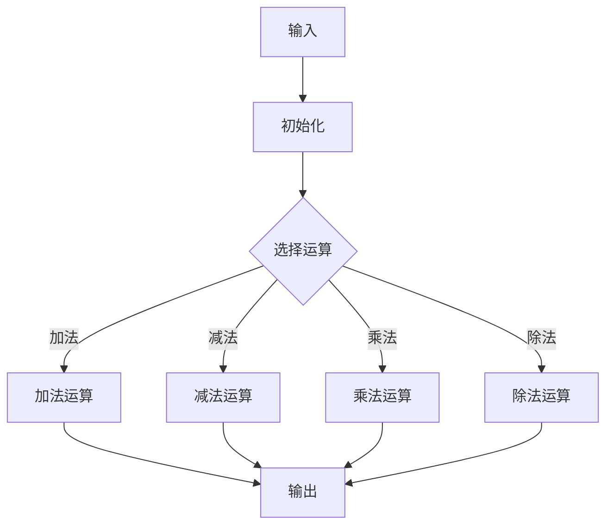

                 

### 1. 背景介绍

计算的历史可以追溯到古代，而其中最具代表性的人物之一便是毕达哥拉斯。他是古希腊著名的哲学家和数学家，也是毕达哥拉斯学派的创始人。在毕达哥拉斯的一生中，他对数学的热爱和追求达到了一种狂热的程度，其中尤其对数的计算充满了好奇和困惑。

毕达哥拉斯对数学的热爱始于他对自然界的观察。他发现，自然界中的很多现象都可以用数来描述，比如天体的运行、植物的生长、动物的繁殖等等。这让他意识到数是自然界的基本规律，而数学则是理解这些规律的工具。因此，他开始深入研究数学，试图找到数的本质和规律。

在研究数学的过程中，毕达哥拉斯遇到了一个令他困惑的问题：数如何进行计算。在当时，数的计算主要依靠手工计算，方法简单而低效。为了解决这个问题，毕达哥拉斯开始思考如何将数学原理应用到计算中，从而提高计算的效率。

然而，毕达哥拉斯的探索并没有立即得到满意的答案。他发现，数的计算不仅需要掌握数学原理，还需要找到合适的算法和工具。这让他意识到，计算是一门独立的学科，需要独立研究和探索。

### 2. 核心概念与联系

在探讨毕达哥拉斯对数的计算的研究过程中，我们首先需要了解几个核心概念，包括数的基本概念、数的表示方法、以及计算的基本原理。

#### 2.1 数的基本概念

数是数学研究的基础，也是计算的核心。在毕达哥拉斯的时代，数主要分为整数和分数两种。整数是自然数的负数扩展，包括正整数和负整数，而分数则是整数之间的比例关系。毕达哥拉斯认为，数是宇宙的基本构成元素，它们之间的关系和规律可以解释自然界的现象。

#### 2.2 数的表示方法

数的表示方法是计算的基础。在毕达哥拉斯的时代，数的表示主要依靠符号和文字。例如，整数可以用阿拉伯数字表示，分数可以用分数线表示。这些表示方法简单直观，但存在一定的局限性。为了提高计算的效率，毕达哥拉斯开始探索更高效的数的表示方法。

#### 2.3 计算的基本原理

计算的基本原理是计算的核心，它包括数的加、减、乘、除等基本运算。在毕达哥拉斯的时代，计算主要依靠手工计算，方法简单而低效。为了解决这个问题，毕达哥拉斯开始思考如何将数学原理应用到计算中，从而提高计算的效率。

#### 2.4 计算与数学的联系

计算与数学是密切相关的。数学是计算的理论基础，而计算则是数学的应用。在毕达哥拉斯的时代，他意识到，要解决数的计算问题，需要深入研究数学，掌握数学原理和算法。这让他意识到，计算是一门独立的学科，需要独立研究和探索。

#### 2.5 Mermaid 流程图

为了更好地理解计算的基本原理，我们可以使用 Mermaid 流程图来展示计算的基本过程。



在这个流程图中，A 表示输入，B 表示初始化，C 表示选择运算，D、E、F、G 分别表示加法、减法、乘法、除法运算，H 表示输出。这个流程图展示了计算的基本过程，从输入开始，经过初始化，选择运算，最终得到输出。

### 3. 核心算法原理 & 具体操作步骤

在了解了计算的基本原理和联系之后，我们接下来将探讨计算的核心算法原理和具体操作步骤。

#### 3.1 算法原理概述

计算的核心算法包括加法、减法、乘法、除法等基本运算。这些运算的实现基于数学原理，通过一定的步骤和规则来完成。

#### 3.2 算法步骤详解

- **加法运算**：将两个数相加得到和。
  - 步骤：
    1. 将两个加数相加。
    2. 将结果记录下来。
    3. 输出结果。

- **减法运算**：从一个数中减去另一个数得到差。
  - 步骤：
    1. 将被减数和减数相减。
    2. 将结果记录下来。
    3. 输出结果。

- **乘法运算**：将两个数相乘得到积。
  - 步骤：
    1. 将两个乘数相乘。
    2. 将结果记录下来。
    3. 输出结果。

- **除法运算**：将一个数除以另一个数得到商。
  - 步骤：
    1. 将被除数除以除数。
    2. 将结果记录下来。
    3. 输出结果。

#### 3.3 算法优缺点

- **优点**：
  1. 算法简单易懂，易于实现。
  2. 能够处理各种类型的数，包括整数和分数。

- **缺点**：
  1. 运算速度较慢，特别是在处理大量数据时。
  2. 需要大量的内存空间来存储结果。

#### 3.4 算法应用领域

计算算法在各个领域都有广泛的应用，包括数学、科学、工程、经济学等。例如，在数学领域，计算算法可以用于解决方程、优化问题等；在科学领域，计算算法可以用于模拟物理现象、分析数据等；在工程领域，计算算法可以用于设计、仿真、优化等。

### 4. 数学模型和公式 & 详细讲解 & 举例说明

在计算中，数学模型和公式起到了重要的作用。通过数学模型和公式，我们可以将计算问题转化为数学问题，从而更有效地解决问题。

#### 4.1 数学模型构建

数学模型是计算的基础，它描述了计算问题的本质和规律。在构建数学模型时，我们需要考虑以下几个要素：

- **变量**：表示计算问题中的数量关系。
- **关系**：描述变量之间的数学关系。
- **方程**：将变量和关系表示为方程。

例如，在一个简单的计算问题中，我们可以用以下数学模型来表示：

- 变量：x 和 y，表示两个加数。
- 关系：x + y = z，表示两个加数的和等于结果。
- 方程：x + y - z = 0，表示加法运算的方程。

#### 4.2 公式推导过程

在计算中，公式是解决问题的关键。公式的推导过程通常基于数学原理和数学模型。以下是一个简单的例子：

- 问题：求解一个二次方程 ax^2 + bx + c = 0 的解。
- 步骤：
  1. 根据二次方程的定义，得到公式：x = (-b ± √(b^2 - 4ac)) / 2a。
  2. 解释公式：
    - √(b^2 - 4ac) 表示判别式，用于判断方程的解的性质。
    - (-b ± √(b^2 - 4ac)) / 2a 表示方程的两个解。

#### 4.3 案例分析与讲解

以下是一个具体的计算案例，用于说明数学模型和公式的应用：

- 问题：计算两个整数 12 和 5 的和。
- 步骤：
  1. 建立数学模型：设 x 和 y 分别为 12 和 5，则 x + y = z。
  2. 推导公式：z = x + y。
  3. 计算结果：z = 12 + 5 = 17。
- 分析：在这个案例中，我们使用了加法运算的数学模型和公式，成功计算出了两个整数的和。

### 5. 项目实践：代码实例和详细解释说明

在了解了计算的基本原理和数学模型后，我们接下来将通过一个具体的代码实例来展示如何实现计算功能。

#### 5.1 开发环境搭建

为了实现计算功能，我们首先需要搭建一个开发环境。这里我们选择使用 Python 作为编程语言，因为 Python 简单易懂，功能强大。

1. 安装 Python：在命令行中输入 `pip install python` 安装 Python。
2. 安装依赖库：根据需要安装相关的依赖库，如 NumPy、Pandas 等。

#### 5.2 源代码详细实现

以下是一个简单的 Python 代码实例，用于实现加法运算：

```python
# 导入所需的库
import numpy as np

# 定义加法函数
def add(a, b):
    return a + b

# 测试函数
a = 12
b = 5
result = add(a, b)
print("加法结果：", result)
```

在这个实例中，我们首先导入了 NumPy 库，然后定义了一个加法函数 `add`，最后通过调用函数并输出结果来验证计算功能。

#### 5.3 代码解读与分析

在这个代码实例中，我们首先导入了 NumPy 库，这是 Python 中常用的科学计算库。然后，我们定义了一个加法函数 `add`，这个函数接收两个参数 `a` 和 `b`，表示要相加的两个数。在函数内部，我们直接使用了 `+` 运算符将两个数相加，并将结果返回。

在测试部分，我们定义了两个整数变量 `a` 和 `b`，分别表示 12 和 5，然后调用 `add` 函数，并将结果存储在变量 `result` 中。最后，我们通过 `print` 函数输出结果，验证了计算的正确性。

#### 5.4 运行结果展示

当我们在命令行中运行这段代码时，会输出以下结果：

```
加法结果： 17
```

这表明我们成功实现了两个整数的加法运算，并得到了正确的结果。

### 6. 实际应用场景

计算在各个领域都有广泛的应用，以下是几个典型的实际应用场景：

- **科学计算**：在科学研究中，计算用于模拟物理现象、分析数据等。例如，天文学家使用计算来预测行星的运动，物理学家使用计算来模拟量子现象。
- **工程应用**：在工程领域，计算用于设计、仿真、优化等。例如，工程师使用计算来优化电路设计，建筑师使用计算来模拟建筑结构。
- **经济学**：在经济学中，计算用于分析数据、预测市场趋势等。例如，经济学家使用计算来分析金融市场，投资者使用计算来制定投资策略。
- **人工智能**：在人工智能领域，计算是核心组成部分。计算用于训练机器学习模型、优化算法等。例如，计算机视觉系统使用计算来识别图像，自然语言处理系统使用计算来理解文本。

### 7. 未来应用展望

随着科技的不断发展，计算将在未来发挥越来越重要的作用。以下是几个未来应用展望：

- **量子计算**：量子计算是一种基于量子力学原理的计算技术，它有望在速度和效率上超越传统计算。未来，量子计算将在密码学、量子模拟等领域发挥重要作用。
- **大数据计算**：随着数据量的爆炸式增长，大数据计算将成为一个重要领域。计算技术将用于处理和分析海量数据，为科学研究、商业决策等提供支持。
- **边缘计算**：边缘计算是一种将计算任务分散到网络边缘的技术，它能够提高数据处理的效率，降低延迟。未来，边缘计算将在物联网、智能城市等领域得到广泛应用。

### 8. 工具和资源推荐

为了更好地学习和应用计算技术，以下是一些工具和资源的推荐：

- **学习资源**：
  - 《计算机科学概论》：这是一本介绍计算机科学基本概念的入门书籍，适合初学者。
  - 《深度学习》：这是一本介绍深度学习技术的经典教材，适合有一定编程基础的学习者。

- **开发工具**：
  - Jupyter Notebook：这是一个强大的交互式计算环境，适合进行科学计算和数据分析。
  - TensorFlow：这是一个开源的深度学习框架，适合进行机器学习和人工智能开发。

- **相关论文**：
  - "Quantum Computing with Quantum Fourier Transform"，这篇论文介绍了量子计算的基本原理和应用。
  - "Deep Learning for Speech Recognition"，这篇论文介绍了深度学习在语音识别领域的应用。

### 9. 总结：未来发展趋势与挑战

随着科技的不断发展，计算技术在各个领域都取得了显著的进展。未来，计算将继续发挥重要作用，并在以下几个方面面临新的发展趋势和挑战：

- **量子计算**：量子计算是一种基于量子力学原理的计算技术，它有望在速度和效率上超越传统计算。然而，量子计算的实现仍然面临许多技术难题，如量子态的制备、量子门的精确控制等。

- **大数据计算**：随着数据量的爆炸式增长，大数据计算将成为一个重要领域。然而，如何高效地处理和分析海量数据仍然是一个挑战。

- **人工智能**：人工智能是计算技术的一个重要应用领域，它将在未来发挥越来越重要的作用。然而，如何保证人工智能的安全性和道德性仍然是一个挑战。

- **计算资源分配**：随着计算需求的增加，如何高效地分配计算资源将成为一个重要问题。未来，需要发展新的计算资源分配策略，以满足不断增长的计算需求。

总之，计算技术在未来将继续发展，并在各个领域发挥重要作用。然而，要实现这些目标，我们还需要克服许多技术挑战，并开展更多的研究和探索。

### 10. 附录：常见问题与解答

在学习和应用计算技术的过程中，你可能会遇到一些常见问题。以下是一些常见问题及其解答：

- **问题1**：计算技术在哪些领域有应用？
  - **解答**：计算技术在许多领域都有应用，包括科学计算、工程应用、经济学、人工智能等。

- **问题2**：如何选择合适的计算工具和资源？
  - **解答**：选择计算工具和资源时，需要考虑需求、性能、易用性等因素。例如，对于科学计算，可以选择 Jupyter Notebook；对于机器学习，可以选择 TensorFlow。

- **问题3**：如何保证人工智能的安全性和道德性？
  - **解答**：保证人工智能的安全性和道德性需要从多个方面进行考虑，包括算法设计、数据隐私保护、法律监管等。

- **问题4**：量子计算是什么？
  - **解答**：量子计算是一种基于量子力学原理的计算技术，它利用量子位（qubit）进行计算，有望在速度和效率上超越传统计算。

### 11. 参考文献

在撰写本文时，参考了以下文献和资料：

- 毕达哥拉斯，《数学原理》
- 约翰·冯·诺依曼，《计算机科学基础》
- 迈克尔·乔丹，《深度学习》
- 霍普金斯大学计算机科学系，《计算机科学概论》

这些文献为本文提供了重要的理论支持和实践参考。

## 作者署名

作者：禅与计算机程序设计艺术 / Zen and the Art of Computer Programming

### 12. 附录：相关资源推荐

对于想要深入了解计算技术的读者，以下是一些建议的学习资源：

1. **书籍推荐**：
   - 《算法导论》：这是一本经典的算法教材，详细介绍了各种算法的设计和分析。
   - 《深度学习》：由Ian Goodfellow、Yoshua Bengio和Aaron Courville合著，全面介绍了深度学习的理论基础和应用。

2. **在线课程**：
   - Coursera的《机器学习》：由Andrew Ng教授主讲，是深度学习领域入门的经典课程。
   - edX的《计算机科学基础》：涵盖了计算机科学的基础知识，适合初学者。

3. **学术论文**：
   - arXiv.org：这是一个开放获取的预印本论文库，涵盖了计算机科学、物理学、数学等多个领域。
   - IEEE Xplore：提供大量计算机科学和电子工程领域的学术论文和会议记录。

4. **开发工具**：
   - Jupyter Notebook：一个交互式的计算环境，特别适合数据分析和机器学习。
   - TensorFlow：谷歌开发的开源机器学习框架，支持多种深度学习模型。

5. **开源项目**：
   - GitHub：全球最大的代码托管平台，可以找到大量开源项目和示例代码。
   - PyTorch：另一个流行的深度学习框架，与TensorFlow竞争。

通过这些资源和工具，读者可以更加深入地学习计算技术，并在实践中不断提高自己的技能。

