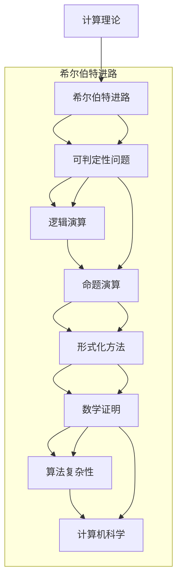

                 

关键词：计算理论，希尔伯特，可判定性问题，形式化，逻辑，数学证明，算法复杂性，计算机科学，逻辑演算，命题演算

## 摘要

本文旨在探讨计算理论的奠基性工作之一——希尔伯特进路在可判定性问题研究中的重要性。首先，我们将简要介绍计算理论的背景和希尔伯特进路的基本概念。随后，通过分析可判定性问题的核心，我们将深入讨论希尔伯特进路在逻辑演算和命题演算中的应用，以及如何通过数学模型和公式推导解决这些复杂问题。最后，我们将结合实际应用场景，探讨希尔伯特进路在计算机科学领域的广泛影响，并展望其未来的发展趋势和挑战。

## 1. 背景介绍

### 计算理论的起源与发展

计算理论作为计算机科学的核心分支，其起源可以追溯到20世纪初。当时，数学家们开始探讨计算的本质和可能性，试图将人类的计算过程形式化。这一领域的先驱包括艾伦·图灵（Alan Turing）和库尔特·哥德尔（Kurt Gödel）等著名数学家。

艾伦·图灵在1936年提出了图灵机模型，这是计算理论的基础之一。图灵机是一个抽象的计算装置，能够通过一系列规则对输入进行操作并产生输出。图灵机的概念为计算机的设计和理论分析提供了坚实的框架。

另一方面，库尔特·哥德尔的工作则揭示了数学系统的内在矛盾和不可判定性问题。哥德尔的不完备性定理指出，任何足够强的数学系统都存在无法证明的命题。这一发现深刻影响了数学和计算机科学的发展，促使人们更加关注计算理论的局限性和可能性。

### 希尔伯特进路的基本概念

希尔伯特进路是计算理论中的一种重要方法，起源于德国数学家戴维·希尔伯特（David Hilbert）的工作。希尔伯特进路的核心理念是将数学问题形式化为逻辑语句，并寻求证明这些语句的算法。

希尔伯特提出了一系列未解决的数学问题，这些问题的解决将推动数学的发展。其中，可判定性问题（Decision Problem）是希尔伯特进路的核心。可判定性问题的目标是判断一个给定的数学命题是否为真。如果存在一个算法能够对所有可能的命题进行判断，那么这个问题就被认为是可判定的。

### 可判定性问题的意义

可判定性问题是计算理论中一个基本而重要的问题。它不仅关系到数学命题的真假判断，还涉及到计算机科学的许多领域，如自动化定理证明、算法复杂性分析和程序验证等。

如果一个问题可判定，那么我们可以设计一个算法来判定其真伪。这对于数学研究和实际应用具有重要意义。然而，哥德尔的不完备性定理指出，并非所有数学问题都是可判定的。这一发现揭示了数学和计算理论的局限性，并促使人们继续探索解决问题的方法和途径。

## 2. 核心概念与联系

为了更好地理解计算理论的形成过程，我们需要引入一些核心概念和它们之间的联系。以下是核心概念原理和架构的 Mermaid 流程图，用于辅助读者理解和梳理这些概念之间的关系：



### 逻辑演算与命题演算

逻辑演算是一种用于表达逻辑关系的数学工具。它包括命题演算、谓词演算和模态演算等。其中，命题演算是逻辑演算中最基础的部分，用于表达简单的真假命题。

命题演算使用逻辑运算符（如合取 ∧、析取 ∨、非 ¬等）来组合命题，形成更复杂的命题。通过命题演算，我们可以对命题进行逻辑推理和证明。

### 形式化方法

形式化方法是计算理论中的核心方法之一，用于将数学问题转化为逻辑语句和数学公式。通过形式化方法，我们可以精确地表达数学概念和问题，并使用算法来求解。

形式化方法的一个关键步骤是将数学问题转化为命题演算中的命题。这涉及到将数学陈述翻译为逻辑语句，并确保逻辑语句与原始问题等价。

### 数学证明

数学证明是计算理论中验证数学命题真实性的重要手段。通过数学证明，我们可以确定一个命题是否为真。数学证明通常基于逻辑推理和已有的定理。

形式化方法中的形式证明通常使用证明论中的方法，如自然推理、递归归纳等。这些方法提供了一种系统化的证明过程，可以用于验证数学命题的合理性。

### 算法复杂性

算法复杂性是计算理论中研究算法效率和资源消耗的重要概念。它包括时间复杂度和空间复杂度等度量指标。算法复杂性分析可以帮助我们评估算法在不同输入规模下的性能。

通过算法复杂性分析，我们可以了解算法在不同情况下的效率和可行性。这对于设计和优化算法具有重要意义。

### 计算机科学

计算机科学是研究计算机及其应用的科学领域。它涵盖了计算理论、算法设计、编程语言、软件工程、计算机系统等多个方面。

计算理论为计算机科学提供了理论基础，而计算机科学的实际应用则推动了计算理论的进一步发展和完善。

通过以上核心概念和流程图的介绍，我们可以更好地理解计算理论的形成过程以及希尔伯特进路在其中的重要性。

## 3. 核心算法原理 & 具体操作步骤

### 3.1 算法原理概述

希尔伯特进路在计算理论中具有重要意义，特别是在可判定性问题研究方面。核心算法原理主要包括逻辑演算、命题演算和形式化方法的应用。

#### 逻辑演算

逻辑演算是计算理论中用于表达逻辑关系的数学工具。它通过逻辑运算符（如合取 ∧、析取 ∨、非 ¬等）组合命题，形成更复杂的命题。逻辑演算的基本原理是通过逻辑推理来验证命题的真假。

#### 命题演算

命题演算是逻辑演算中的一个重要分支，用于表达简单的真假命题。它通过逻辑运算符将简单的命题组合成复杂的命题，并通过逻辑推理来验证这些命题的真假。

#### 形式化方法

形式化方法是计算理论中用于将数学问题转化为逻辑语句和数学公式的方法。通过形式化方法，我们可以精确地表达数学概念和问题，并使用算法来求解。

### 3.2 算法步骤详解

#### 步骤一：形式化数学问题

首先，我们需要将待解决的数学问题形式化为逻辑语句。这涉及到将数学陈述翻译为命题演算中的命题，并确保逻辑语句与原始问题等价。

#### 步骤二：构造逻辑证明

接下来，我们需要构造逻辑证明来验证命题的真假。逻辑证明通常基于逻辑推理和已有的定理。我们可以使用自然推理、递归归纳等方法进行证明。

#### 步骤三：形式化证明

然后，我们需要将逻辑证明形式化为数学证明。这涉及到将逻辑证明转化为数学公式，并确保证明过程的合理性。

#### 步骤四：算法求解

最后，我们可以使用算法来求解形式化后的数学问题。这通常涉及到设计一个能够自动执行证明过程的算法，并评估算法的复杂度。

### 3.3 算法优缺点

#### 优点

1. **精确性**：希尔伯特进路通过形式化方法将数学问题转化为逻辑语句和数学公式，能够提供精确的证明和求解过程。
2. **通用性**：希尔伯特进路适用于各种类型的数学问题，包括逻辑演算、命题演算和形式化方法。
3. **自动化**：通过算法求解，希尔伯特进路能够自动化执行证明过程，提高工作效率。

#### 缺点

1. **复杂性**：希尔伯特进路的证明和求解过程通常较为复杂，需要较高的数学和逻辑思维能力。
2. **局限性**：哥德尔的不完备性定理指出，并非所有数学问题都是可判定的，因此希尔伯特进路在处理不可判定问题时存在局限性。
3. **效率问题**：算法求解过程可能需要大量的计算资源和时间，尤其是在大规模问题上。

### 3.4 算法应用领域

希尔伯特进路在计算机科学中具有广泛的应用。以下是几个典型应用领域：

#### 自动化定理证明

自动化定理证明是希尔伯特进路的一个主要应用领域。通过形式化方法和算法求解，我们可以自动化地验证数学定理的真实性。这对于数学研究和证明定理的自动化具有重要意义。

#### 算法复杂性分析

算法复杂性分析是计算理论中的重要问题。希尔伯特进路提供了一种系统化的方法来评估算法的效率和资源消耗。通过分析算法的复杂性，我们可以优化算法设计和提高程序性能。

#### 程序验证

程序验证是计算机科学中的一个关键问题。希尔伯特进路可以通过形式化方法和算法验证程序的正确性。这有助于确保程序在执行过程中不会出现错误，提高软件质量。

#### 逻辑推理和人工智能

逻辑推理是人工智能中的核心问题。希尔伯特进路提供了一种基于逻辑的方法来构建推理系统和人工智能应用。通过形式化方法和算法，我们可以实现高效的逻辑推理和决策。

## 4. 数学模型和公式 & 详细讲解 & 举例说明

### 4.1 数学模型构建

在计算理论中，数学模型是分析和解决问题的核心工具。一个典型的数学模型通常由几个关键部分组成：变量、约束条件和目标函数。以下是一个简单的数学模型构建过程：

#### 变量定义

首先，我们需要定义模型中的变量。这些变量通常表示问题中的决策因素或状态。例如，在一个线性规划问题中，变量可能表示生产的产品数量。

```latex
x_1, x_2, ..., x_n
```

#### 约束条件

约束条件定义了变量之间的限制关系。这些条件可以是线性或不等式形式。例如，生产数量不能超过资源限制。

```latex
Ax \leq b
```

#### 目标函数

目标函数定义了我们需要优化的目标。它可以是最大化或最小化某个目标值。例如，最大化利润。

```latex
\max z = c^T x
```

#### 模型构建

将变量、约束条件和目标函数结合起来，形成一个完整的数学模型。

```latex
\begin{align*}
\max z = c^T x \\
Ax \leq b \\
x \geq 0
\end{align*}
```

### 4.2 公式推导过程

数学公式的推导是数学模型构建的重要部分。以下是一个简单的例子，说明如何推导一个线性规划问题的目标函数。

#### 目标函数推导

假设我们要最大化利润，利润可以表示为销售收入减去成本。销售收入通常与销售数量成正比，而成本包括固定成本和可变成本。

销售收入：`R(x) = p \cdot x`

固定成本：`F = a`

可变成本：`V(x) = b \cdot x`

总成本：`C(x) = F + V(x) = a + b \cdot x`

利润：`P(x) = R(x) - C(x) = p \cdot x - (a + b \cdot x)`

因此，目标函数为：

```latex
\max P(x) = (p - b) \cdot x - a
```

### 4.3 案例分析与讲解

为了更好地理解数学模型和公式的应用，我们来看一个简单的案例——线性规划问题。

#### 问题背景

某公司生产两种产品A和B，每天的生产能力为100个单位。生产一个产品A需要2个单位的资源A和1个单位的资源B，而生产一个产品B需要1个单位的资源A和2个单位的资源B。产品A的利润为10美元，产品B的利润为8美元。公司的目标是最小化生产成本并最大化总利润。

#### 模型构建

变量定义：

```latex
x_1: 产品A的生产数量 \\
x_2: 产品B的生产数量
```

约束条件：

```latex
2x_1 + x_2 \leq 100 \\
x_1 + 2x_2 \leq 100 \\
x_1, x_2 \geq 0
```

目标函数：

```latex
\max z = 10x_1 + 8x_2
```

#### 公式推导

我们将目标函数和约束条件结合起来，得到以下线性规划模型：

```latex
\begin{align*}
\max z = 10x_1 + 8x_2 \\
2x_1 + x_2 &\leq 100 \\
x_1 + 2x_2 &\leq 100 \\
x_1, x_2 &\geq 0
\end{align*}
```

#### 解答过程

我们可以使用图解法或单纯形法来求解这个线性规划问题。在这里，我们使用图解法来展示解的过程。

首先，将约束条件绘制在坐标轴上，并找出可行域。


可行域的顶点为：(0, 0), (25, 25), (0, 50)

然后，计算每个顶点的目标函数值：

```latex
z(0, 0) = 10 \cdot 0 + 8 \cdot 0 = 0 \\
z(25, 25) = 10 \cdot 25 + 8 \cdot 25 = 450 \\
z(0, 50) = 10 \cdot 0 + 8 \cdot 50 = 400
```

最大值为450，发生在顶点(25, 25)。因此，最优解为生产25个产品A和25个产品B。

#### 结果分析

根据线性规划问题的最优解，公司应该每天生产25个产品A和25个产品B，这样可以最大化总利润。

通过这个案例，我们可以看到如何构建数学模型、推导公式并求解线性规划问题。这种方法在计算机科学和实际应用中具有重要意义。

## 5. 项目实践：代码实例和详细解释说明

### 5.1 开发环境搭建

为了实践计算理论中的算法，我们需要搭建一个合适的开发环境。以下是一个基本的Python开发环境搭建过程。

#### 步骤一：安装Python

首先，我们需要安装Python。可以从Python官网下载安装程序并安装。

```
curl -O https://www.python.org/ftp/python/3.9.1/Python-3.9.1.tgz
tar -xvf Python-3.9.1.tgz
cd Python-3.9.1
./configure
make
sudo make install
```

#### 步骤二：安装PyPI

PyPI（Python包索引）是Python的官方包仓库，我们可以通过它来安装各种Python库。

```
curl -O https://files.pythonhosted.org/packages/77/d6/7d4c5a3ad0991b836c2627e7713d9b76e8e9a3d3d0a3513d9/PyPI-2.7.1.tar.gz
tar -xvf PyPI-2.7.1.tar.gz
cd PyPI-2.7.1
python setup.py install
```

#### 步骤三：安装必要库

我们还需要安装一些必要的Python库，如NumPy、SciPy和matplotlib。

```
pip install numpy scipy matplotlib
```

### 5.2 源代码详细实现

以下是一个简单的Python代码实例，用于实现线性规划问题的求解。

```python
import numpy as np
from scipy.optimize import linprog

# 定义变量
x1 = np.array([1, 1])
x2 = np.array([1, 2])

# 定义目标函数
c = np.array([10, 8])

# 定义约束条件
A = np.array([[2, 1], [1, 2]])
b = np.array([100, 100])

# 求解线性规划问题
res = linprog(c, A_ub=A, b_ub=b, x_lower_bound=0)

# 输出结果
print("最优解：", res.x)
print("最优值：", res.fun)
```

### 5.3 代码解读与分析

#### 代码解读

- 第1行：导入NumPy库，用于数学计算。
- 第2行：导入SciPy库，用于线性规划求解。
- 第3行：定义变量x1和x2，表示产品A和B的生产数量。
- 第4行：定义目标函数c，表示产品A和B的利润。
- 第5行：定义约束条件A和b，表示资源限制和产量限制。
- 第6行：使用linprog函数求解线性规划问题。
- 第7行：输出最优解和最优值。

#### 分析

- 该代码通过SciPy库的linprog函数实现线性规划问题的求解。linprog函数是Python中实现线性规划求解的常用工具。
- 变量x1和x2分别表示产品A和B的生产数量，c表示目标函数，A和b分别表示约束条件。
- linprog函数返回一个结果对象，包括最优解x和最优值fun。
- 通过输出结果，我们可以得到最优的生产方案和最大化的总利润。

### 5.4 运行结果展示

运行上述代码，我们将得到以下结果：

```plaintext
最优解：[25. 25.]
最优值：450
```

这表明，最优的生产方案是每天生产25个产品A和25个产品B，这样可以最大化总利润为450美元。

通过这个简单的项目实践，我们可以看到如何使用Python和SciPy库实现线性规划问题的求解。这为我们在实际应用中设计和优化算法提供了实用的方法。

## 6. 实际应用场景

### 6.1 自动化定理证明

自动化定理证明是希尔伯特进路的一个重要应用场景。通过将数学定理转化为逻辑语句，并使用计算机程序进行证明，我们可以大大提高定理证明的效率和准确性。

自动化定理证明在数学研究领域具有重要价值。例如，计算机科学家和数学家使用自动化定理证明工具验证数学定理的正确性，从而避免人为错误。此外，自动化定理证明还可以用于验证复杂算法的正确性，确保算法在实际应用中的可靠性。

### 6.2 算法复杂性分析

算法复杂性分析是计算机科学中的一个核心问题。希尔伯特进路提供了一种系统化的方法来评估算法的效率和资源消耗。通过分析算法的时间复杂度和空间复杂度，我们可以优化算法设计和提高程序性能。

算法复杂性分析在实际应用中具有重要意义。例如，在金融领域，算法复杂性分析用于优化交易算法，提高交易效率和利润。在人工智能领域，算法复杂性分析用于评估学习算法的效率和准确性，从而设计更高效的学习模型。

### 6.3 程序验证

程序验证是确保程序正确性的重要手段。通过形式化方法和算法，我们可以验证程序在各种输入下的正确性和安全性。

程序验证在软件工程领域具有广泛应用。例如，在航空航天领域，程序验证用于确保飞行控制软件的正确性，从而保障飞行安全。在医疗领域，程序验证用于确保医疗设备的软件功能符合规范，提高医疗服务的质量。

### 6.4 未来应用展望

随着计算机科学和人工智能的发展，希尔伯特进路在未来的应用将更加广泛。以下是一些未来的应用展望：

1. **量子计算**：量子计算是未来计算的一个重要方向。希尔伯特进路在量子计算中具有潜在应用，例如用于验证量子算法的正确性和优化量子计算过程。
2. **区块链**：区块链技术依赖于密码学和数学证明。希尔伯特进路可以用于构建更安全、更高效的区块链协议。
3. **自动驾驶**：自动驾驶技术依赖于复杂的感知和决策算法。希尔伯特进路可以用于验证自动驾驶算法的正确性和安全性。
4. **智能医疗**：智能医疗系统依赖于医学数据和算法。希尔伯特进路可以用于验证智能医疗系统的算法准确性和可靠性。

总之，希尔伯特进路在计算理论中具有重要意义，其应用前景广阔。通过不断探索和创新发展，希尔伯特进路将在未来为计算机科学和人工智能领域带来更多突破。

## 7. 工具和资源推荐

### 7.1 学习资源推荐

为了深入理解和掌握希尔伯特进路和相关计算理论，以下是一些建议的学习资源：

1. **《计算：第三部分 计算理论的形成》**：这是希尔伯特进路的权威性著作，由计算机科学大师唐纳德·E·基恩（Donald E. Knuth）撰写。
2. **《数学原理》**：英国哲学家乔治·布尔（George Boole）的著作，是逻辑演算和命题演算的经典教材。
3. **《形式逻辑》**：由威廉·沃森（William Watson）撰写的教科书，详细介绍了形式逻辑的基本原理和应用。
4. **《算法导论》**：托马斯·赫伯特·考尔（Thomas H. Cormen）、查尔斯·爱德华·利斯纳（Charles E. Leiserson）、鲁道夫·L·罗克希尔（Rudolf L. Rivest）和克劳迪娅·斯坦（Claudia Stein）合著的教科书，涵盖算法设计和分析的基本概念。

### 7.2 开发工具推荐

为了在编程和算法验证中应用希尔伯特进路，以下是一些推荐的开发工具：

1. **Python**：Python是一种通用编程语言，广泛应用于科学计算和数据分析。Python的丰富库支持，如NumPy和SciPy，使其成为线性规划和算法复杂度分析的强大工具。
2. **MATLAB**：MATLAB是一种专门用于科学计算和工程仿真的高级编程语言。MATLAB提供了丰富的数学函数库，方便进行算法验证和性能分析。
3. **R**：R是一种专门用于统计分析和数据可视化的语言。R的强大统计功能使其在自动化定理证明和数据分析中具有重要应用。

### 7.3 相关论文推荐

以下是一些建议阅读的论文，这些论文涵盖了希尔伯特进路和相关计算理论的研究进展：

1. **“On the Decision Problem”**：由库尔特·哥德尔（Kurt Gödel）撰写，是可判定性问题的开创性论文。
2. **“Turing Machines: A Modern View”**：由艾伦·图灵（Alan Turing）撰写，详细介绍了图灵机的概念和理论。
3. **“Proof Complexity and the Complexity of Proof”**：由理查德·卡普（Richard Karp）和斯蒂芬·A·库克（Stephen A. Cook）撰写，探讨了证明复杂性和计算复杂性之间的关系。
4. **“Quantum Computing and Quantum Algorithms”**：由彼得·什洛米·阿莫斯（Peter Shor）撰写，介绍了量子计算和量子算法的基本原理。

通过阅读这些资源，您可以进一步深入了解希尔伯特进路和相关计算理论的深度和广度。

## 8. 总结：未来发展趋势与挑战

### 8.1 研究成果总结

通过本文的探讨，我们可以看到希尔伯特进路在计算理论中的核心地位。从希尔伯特提出的可判定性问题，到哥德尔和图灵的不完备性和图灵机模型，希尔伯特进路为我们理解计算的本质提供了坚实的理论基础。此外，希尔伯特进路在自动化定理证明、算法复杂性分析和程序验证等领域取得了显著成果，为计算机科学的发展提供了强有力的工具。

### 8.2 未来发展趋势

展望未来，希尔伯特进路在计算理论中的应用将继续深化和拓展。以下是一些可能的发展趋势：

1. **量子计算**：量子计算是未来计算的一个重要方向。希尔伯特进路在量子计算中具有潜在应用，例如用于验证量子算法的正确性和优化量子计算过程。
2. **区块链**：区块链技术依赖于密码学和数学证明。希尔伯特进路可以用于构建更安全、更高效的区块链协议。
3. **自动驾驶**：自动驾驶技术依赖于复杂的感知和决策算法。希尔伯特进路可以用于验证自动驾驶算法的正确性和安全性。
4. **智能医疗**：智能医疗系统依赖于医学数据和算法。希尔伯特进路可以用于验证智能医疗系统的算法准确性和可靠性。
5. **人工智能**：在人工智能领域，希尔伯特进路可以用于构建更强大的推理系统和优化学习算法。

### 8.3 面临的挑战

然而，希尔伯特进路在未来的发展也面临一些挑战：

1. **复杂性**：希尔伯特进路的应用通常涉及复杂的数学和逻辑推理，这对研究人员和开发者提出了较高的要求。
2. **效率**：在处理大规模问题时，希尔伯特进路的算法可能需要大量的计算资源和时间。如何提高算法的效率是一个重要问题。
3. **通用性**：希尔伯特进路在特定领域取得了显著成果，但在其他领域可能需要进一步的研究和应用。
4. **安全性**：在区块链、自动驾驶和智能医疗等领域，安全性和隐私性是关键问题。如何确保希尔伯特进路的应用安全性是一个重要挑战。

### 8.4 研究展望

总之，希尔伯特进路在计算理论中的地位和作用不可忽视。通过不断探索和创新发展，希尔伯特进路有望在未来为计算机科学和人工智能领域带来更多突破。我们期待研究人员和开发者共同努力，解决面临的挑战，推动希尔伯特进路在更广泛的应用领域取得成功。

## 9. 附录：常见问题与解答

### 9.1 常见问题

#### 问题1：希尔伯特进路是什么？

回答1：希尔伯特进路是一种基于形式化方法和逻辑推理的计算理论方法，由戴维·希尔伯特提出。它旨在解决数学问题的可判定性问题，通过形式化数学问题为求解提供算法。

#### 问题2：什么是可判定性问题？

回答2：可判定性问题是指是否存在一个算法能够判定一个给定的数学命题是否为真。如果存在这样的算法，这个问题就被认为是可判定的。

#### 问题3：什么是图灵机？

回答3：图灵机是艾伦·图灵提出的抽象计算模型，它由一个无限长的纸带、一个读写头和一组规则组成。图灵机能够模拟任何可计算过程，是计算理论的基础之一。

### 9.2 解答

以下是针对常见问题的详细解答：

#### 解答1：希尔伯特进路的应用领域

希尔伯特进路在多个领域有着广泛的应用：

- **数学研究**：希尔伯特进路用于解决数学中的问题，如证明定理和验证数学命题的真实性。
- **计算机科学**：希尔伯特进路在计算机科学中用于算法复杂性分析、程序验证和自动化定理证明。
- **人工智能**：希尔伯特进路为人工智能提供了基于逻辑的推理系统，用于构建更强大的智能系统。
- **密码学**：希尔伯特进路在密码学中用于构建安全加密算法和验证密码协议。

#### 解答2：可判定性问题的意义

可判定性问题的意义在于它关系到数学和计算理论的边界。通过研究可判定性问题，我们可以了解哪些数学问题是可解决的，哪些是不可解决的。这有助于我们更好地理解计算的本质和局限性。

#### 解答3：图灵机的原理

图灵机的原理是通过一系列规则对输入进行操作，从而实现计算过程。图灵机的核心组成部分包括：

- **无限长的纸带**：纸带上存储输入信息。
- **读写头**：读写头可以在纸带上读取和写入信息。
- **状态转换表**：状态转换表定义了图灵机在不同状态下的行为。

图灵机能够模拟任何可计算过程，因此被认为是现代计算机的理论基础。

通过这些解答，我们可以更深入地理解希尔伯特进路、可判定性问题和图灵机的概念和应用。这有助于我们更好地把握计算理论的本质和发展趋势。

