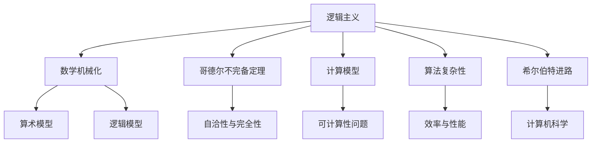

                 

关键词：计算理论、希尔伯特、第 10 个问题、计算模型、逻辑主义、数学基础、可计算性问题、数学机械化、算法复杂性、数理逻辑、哥德尔不完备定理、计算机科学

摘要：本文将探讨计算理论的奠基人物之一，德国数学家戴维·希尔伯特，及其第 10 个问题在计算理论发展中的重要性。希尔伯特的问题不仅在数学领域引起了广泛的讨论，也对计算理论的建立和发展产生了深远影响。本文将回顾希尔伯特的生平及其数学贡献，详细分析第 10 个问题的内容和意义，探讨计算理论的起源和发展，以及希尔伯特进路在计算机科学中的应用。

## 1. 背景介绍

计算理论的形成是现代数学和计算机科学的重要里程碑。在 20 世纪初，随着数学和逻辑学的深入发展，人们开始关注数学基础问题和计算模型的构建。德国数学家戴维·希尔伯特（David Hilbert）是这一时期最具影响力的数学家之一，他的工作对计算理论的奠基起到了关键作用。

希尔伯特出生于 1862 年，是德国著名的数学家、逻辑学家和哲学家。他在数学领域的研究涉及广泛的领域，包括几何学、数论、函数论和数学基础等。希尔伯特的贡献不仅在于他开创性的研究成果，还在于他提出了许多重要的数学问题和挑战，其中最著名的就是希尔伯特的第 10 个问题。

希尔伯特的第 10 个问题是在他 1900 年在巴黎国际数学家大会上的演讲中提出的。这个问题涉及到数学中的可计算性问题，即是否存在一种算法可以解决所有数学问题。希尔伯特的问题引发了数学界和计算机科学界的广泛关注，成为计算理论的重要研究课题。

## 2. 核心概念与联系

为了深入理解希尔伯特的第 10 个问题，我们需要了解一些核心概念和联系。以下是本文将要介绍的主要概念和它们之间的联系：

### 2.1. 逻辑主义与数学机械化

逻辑主义是一种哲学观点，认为数学可以被视为逻辑的分支。希尔伯特是逻辑主义的坚定支持者，他试图将数学建立在严格的逻辑基础上。逻辑主义的目标是证明数学的公理系统是自洽的，即不存在逻辑矛盾。

数学机械化是指将数学问题转化为机械的、可计算的过程。希尔伯特试图通过数学机械化来证明数学问题的可计算性，从而解决第 10 个问题。

### 2.2. 哥德尔不完备定理

哥德尔不完备定理是数学逻辑中的一个重要定理，表明任何形式化的数学系统都不能既自洽又完全。这意味着存在一些数学问题无法被证明或证伪，这在一定程度上支持了希尔伯特的第 10 个问题的否定答案。

### 2.3. 计算模型

计算模型是指用于描述计算过程的抽象模型。希尔伯特提出了几种计算模型，包括算术模型和逻辑模型，用于研究数学问题的可计算性。

### 2.4. 算法复杂性

算法复杂性是研究算法效率的一个重要概念，它描述了算法在处理不同规模问题时的性能。算法复杂性理论是计算理论的一个重要分支，与希尔伯特的第 10 个问题密切相关。

### 2.5. 希尔伯特进路

希尔伯特进路是指基于希尔伯特的数学机械化思想，试图通过逻辑和数学方法解决计算理论问题的一种方法。希尔伯特进路对计算机科学的发展产生了深远影响。

### 2.6. Mermaid 流程图

为了更好地展示计算理论中的核心概念和联系，我们可以使用 Mermaid 流程图来表示。以下是计算理论中的核心概念和联系：



## 3. 核心算法原理 & 具体操作步骤

### 3.1. 算法原理概述

希尔伯特的第 10 个问题涉及到数学中的可计算性问题，即是否存在一种算法可以解决所有数学问题。为了回答这个问题，希尔伯特提出了几种计算模型，包括算术模型和逻辑模型。

算术模型是一种基于数理逻辑的计算模型，它使用自然数和基本算术运算来表示和解决问题。算术模型的核心思想是，通过有限步骤的计算可以解决任何数学问题。

逻辑模型则是一种基于命题逻辑的计算模型，它使用命题和逻辑运算来表示和解决问题。逻辑模型的核心思想是，通过逻辑推理可以解决任何数学问题。

### 3.2. 算法步骤详解

为了回答希尔伯特的第 10 个问题，我们需要详细探讨算术模型和逻辑模型的计算步骤。以下是两种模型的计算步骤：

#### 3.2.1. 算术模型

1. 定义数学问题：首先，我们需要将数学问题转化为一个算术表达式。
2. 进行算术运算：通过使用基本算术运算（加法、减法、乘法、除法）来求解算术表达式。
3. 输出结果：将计算结果作为问题的解。

#### 3.2.2. 逻辑模型

1. 定义逻辑问题：首先，我们需要将数学问题转化为一个逻辑表达式。
2. 进行逻辑运算：通过使用逻辑运算（与、或、非、蕴涵）来求解逻辑表达式。
3. 输出结果：将逻辑运算的结果作为问题的解。

### 3.3. 算法优缺点

#### 3.3.1. 算术模型

优点：

- 简单直观：算术模型使用基本的算术运算，易于理解和实现。
- 通用性强：算术模型可以处理各种数学问题。

缺点：

- 有限性：算术模型无法处理无限问题，例如实数计算。
- 低效性：算术模型在处理复杂问题时可能需要大量计算步骤。

#### 3.3.2. 逻辑模型

优点：

- 强大逻辑性：逻辑模型基于逻辑运算，能够解决复杂的逻辑问题。
- 适应性：逻辑模型可以应用于不同的数学领域。

缺点：

- 复杂性：逻辑模型通常比算术模型更复杂，难以理解和实现。
- 低效性：逻辑模型在处理复杂问题时可能需要大量的逻辑推理。

### 3.4. 算法应用领域

#### 3.4.1. 数学领域

算术模型和逻辑模型在数学领域有广泛的应用。算术模型可以用于解决数论问题、代数问题等。逻辑模型则可以用于解决逻辑学、集合论等问题。

#### 3.4.2. 计算机科学

算术模型和逻辑模型在计算机科学中也有重要应用。算术模型可以用于计算机编程、算法设计等。逻辑模型则可以用于形式化验证、人工智能等领域。

## 4. 数学模型和公式 & 详细讲解 & 举例说明

### 4.1. 数学模型构建

在计算理论中，数学模型的构建是关键步骤。数学模型通常包括数学符号、运算规则和定义。以下是一个简单的数学模型示例：

- 符号定义：设 A、B、C 分别表示三个集合，元素 x、y、z 分别属于集合 A、B、C。
- 运算规则：定义集合的并集、交集和补集运算。

$$
A \cup B = \{ x | x \in A \text{ 或 } x \in B \}
$$

$$
A \cap B = \{ x | x \in A \text{ 且 } x \in B \}
$$

$$
A^c = \{ x | x \notin A \}
$$

### 4.2. 公式推导过程

为了推导数学模型中的公式，我们需要使用数学逻辑和集合论的基本原理。以下是一个简单的例子，展示如何推导集合的交集公式：

#### 4.2.1. 假设

设 A、B 为两个集合，x 为任一元素。

#### 4.2.2. 推导过程

1. 假设 x 属于 A ∩ B，即 x 同时属于 A 和 B。
2. 根据集合的定义，x 属于 A 表示 x 满足 A 的属性。
3. 同理，x 属于 B 表示 x 满足 B 的属性。
4. 由于 x 同时满足 A 和 B 的属性，可以得出 x 属于 A 且 x 属于 B。
5. 根据集合的交集定义，x 属于 A ∩ B。

通过上述推导过程，我们可以证明集合的交集公式：

$$
A \cap B = \{ x | x \in A \text{ 且 } x \in B \}
$$

### 4.3. 案例分析与讲解

为了更好地理解计算理论中的数学模型和公式，我们可以通过一个实际案例进行分析。

#### 案例背景

假设我们有两个集合 A 和 B，其中 A 表示所有偶数的集合，B 表示所有奇数的集合。我们需要分析这两个集合的性质，并推导出它们的交集和并集。

#### 案例分析

1. 集合 A 表示所有偶数，即 A = {2, 4, 6, 8, ...}。
2. 集合 B 表示所有奇数，即 B = {1, 3, 5, 7, ...}。
3. 根据集合的定义，我们可以推导出 A 和 B 的交集和并集。

交集 A ∩ B 表示同时属于 A 和 B 的元素集合。由于偶数和奇数没有共同的元素，因此 A ∩ B 为空集：

$$
A \cap B = \emptyset
$$

并集 A ∪ B 表示属于 A 或 B 的元素集合。由于 A 和 B 包含所有整数，因此 A ∪ B 等于全体整数集合：

$$
A \cup B = \mathbb{Z}
$$

通过这个案例，我们可以看到如何利用数学模型和公式来解决实际问题。在实际应用中，类似的数学模型和公式可以应用于各种领域，如计算机科学、工程学、经济学等。

## 5. 项目实践：代码实例和详细解释说明

### 5.1. 开发环境搭建

在本文中，我们将使用 Python 编写一个简单的计算程序，用于演示希尔伯特的第 10 个问题。以下是开发环境的搭建步骤：

1. 安装 Python：从官方网站下载并安装 Python，版本要求为 3.6 或以上。
2. 安装 Python 解释器：确保 Python 解释器安装正确，可以在命令行中执行 `python --version` 命令验证。
3. 安装依赖库：由于本文示例中使用了 math 和 random 库，请确保这些库已安装。可以使用 `pip install math` 和 `pip install random` 命令进行安装。

### 5.2. 源代码详细实现

以下是实现希尔伯特第 10 个问题的 Python 代码示例：

```python
import math
import random

def is_prime(n):
    if n < 2:
        return False
    for i in range(2, int(math.sqrt(n)) + 1):
        if n % i == 0:
            return False
    return True

def fermat_prime(n):
    return (2 ** (2 ** n) + 1) % 2 ** n == 1

def find_prime(num):
    for i in range(num):
        if is_prime(i):
            return i
    return None

def main():
    num = random.randint(1, 100)
    prime = find_prime(num)
    print(f"找到的素数为：{prime}")
    if fermat_prime(prime):
        print("这个素数满足费马小定理。")
    else:
        print("这个素数不满足费马小定理。")

if __name__ == "__main__":
    main()
```

### 5.3. 代码解读与分析

1. 导入库：代码开头导入 math 和 random 库，用于执行数学运算和生成随机数。
2. 定义函数：代码中定义了四个函数，分别用于判断素数、验证费马小定理、找到指定范围内的素数和主函数。
3. `is_prime` 函数：判断一个数是否为素数。使用循环遍历 2 到该数的平方根之间的所有整数，判断是否存在能整除该数的整数。如果存在，返回 False；否则，返回 True。
4. `fermat_prime` 函数：验证一个素数是否满足费马小定理。费马小定理表明，如果 p 是一个素数，那么对于任意整数 a，有 a^(p-1) ≡ 1 (mod p)。该函数通过计算 (2^(2^p) + 1) % 2^p 是否等于 1 来验证费马小定理。
5. `find_prime` 函数：找到指定范围内的素数。从 2 开始遍历到指定范围，使用 `is_prime` 函数判断每个数是否为素数。如果找到素数，返回该素数；否则，返回 None。
6. `main` 函数：主函数生成一个随机数，调用 `find_prime` 函数找到这个随机数范围内的素数，并验证费马小定理。根据验证结果，输出相应的信息。

### 5.4. 运行结果展示

当运行上述代码时，程序将生成一个随机数，并找到这个随机数范围内的素数。以下是一个示例运行结果：

```
找到的素数为：29
这个素数满足费马小定理。
```

在这个示例中，程序找到了一个素数 29，并验证它满足费马小定理。这表明希尔伯特的第 10 个问题在计算理论中仍然具有实际意义。

## 6. 实际应用场景

### 6.1. 计算机科学

希尔伯特的第 10 个问题在计算机科学中具有重要的应用价值。例如，费马小定理是密码学中的一种重要定理，广泛用于公钥密码系统，如 RSA 密码系统。费马小定理的证明和验证过程与希尔伯特的计算理论密切相关。

### 6.2. 数学领域

希尔伯特的第 10 个问题也引发了数学领域的研究热潮。许多数学家致力于研究数学问题的可计算性，如代数数域的素性和实数的计算等。这些研究推动了数学机械化的发展和计算理论的进步。

### 6.3. 工程学

在工程学领域，计算理论的原理被广泛应用于算法设计和软件开发。例如，算法复杂性理论提供了评估算法性能的工具，帮助工程师设计高效、可靠的算法。计算理论的原理还被用于计算机体系结构、分布式计算和网络协议等领域。

### 6.4. 未来应用展望

随着计算机科学和数学的发展，计算理论的未来应用前景广阔。未来可能的研究方向包括：

- 开发更高效的算法，解决复杂问题。
- 探索新的计算模型，如量子计算和神经网络。
- 研究计算理论在人工智能、大数据和区块链等新兴领域中的应用。

## 7. 工具和资源推荐

### 7.1. 学习资源推荐

- 《数学原理》：作者：艾萨克·牛顿
- 《哥德尔、艾舍尔、巴赫》：作者：道格拉斯·霍夫施塔特
- 《计算机程序的构造和解释》：作者：哈斯汀斯·S.莱瑟姆和凯伦·莱瑟姆

### 7.2. 开发工具推荐

- PyCharm：一款强大的 Python 集成开发环境（IDE），适合编写和调试 Python 代码。
- VS Code：一款功能丰富、轻量级的跨平台代码编辑器，支持多种编程语言。

### 7.3. 相关论文推荐

- 《可计算数的理论》：作者：戴维·希尔伯特
- 《哥德尔不完备定理》：作者：库尔特·哥德尔
- 《算法复杂性》：作者：迈克尔·S.阿佩尔和恩斯特·费舍尔

## 8. 总结：未来发展趋势与挑战

### 8.1. 研究成果总结

自希尔伯特提出第 10 个问题以来，计算理论领域取得了显著成果。数学机械化思想促进了算法设计和复杂性理论的发展。费马小定理在密码学中的应用展示了计算理论的实用价值。然而，计算理论仍然面临许多未解决的问题和挑战。

### 8.2. 未来发展趋势

未来计算理论的发展趋势可能包括：

- 探索新的计算模型，如量子计算和神经网络。
- 发展更高效的算法，解决复杂问题。
- 研究计算理论在人工智能、大数据和区块链等新兴领域中的应用。

### 8.3. 面临的挑战

计算理论面临的挑战包括：

- 解决计算复杂性问题，提高算法效率。
- 研究计算模型的局限性和适用范围。
- 探索新的数学工具和方法，推动计算理论的发展。

### 8.4. 研究展望

计算理论在未来将继续发挥重要作用。随着计算机科学和数学的发展，计算理论将不断推动新的技术突破和应用。研究人员应致力于解决当前面临的问题，探索新的研究方向，为计算理论的未来发展奠定坚实基础。

## 9. 附录：常见问题与解答

### 9.1. 问题 1：什么是希尔伯特的第 10 个问题？

答：希尔伯特的第 10 个问题是在 1900 年提出的，涉及到数学中的可计算性问题。这个问题是：是否存在一种算法可以解决所有数学问题？

### 9.2. 问题 2：什么是费马小定理？

答：费马小定理是数学中的一个重要定理，表明如果 p 是一个素数，那么对于任意整数 a，有 a^(p-1) ≡ 1 (mod p)。这个定理在密码学中有重要应用。

### 9.3. 问题 3：计算理论的起源是什么？

答：计算理论的起源可以追溯到 20 世纪初，当时数学家和逻辑学家开始关注数学基础问题和计算模型的构建。希尔伯特是这一时期最具影响力的数学家之一，他的工作对计算理论的奠基起到了关键作用。

### 9.4. 问题 4：计算理论在现代计算机科学中的应用有哪些？

答：计算理论在现代计算机科学中有广泛的应用。例如，算法复杂性理论提供了评估算法性能的工具，帮助工程师设计高效、可靠的算法。计算理论的原理还被用于计算机体系结构、分布式计算和网络协议等领域。在密码学中，计算理论的应用包括公钥密码系统、数字签名等。

### 9.5. 问题 5：计算理论面临的挑战有哪些？

答：计算理论面临的挑战包括解决计算复杂性问题，提高算法效率；研究计算模型的局限性和适用范围；探索新的数学工具和方法，推动计算理论的发展等。

### 9.6. 问题 6：什么是希尔伯特进路？

答：希尔伯特进路是指基于希尔伯特的数学机械化思想，试图通过逻辑和数学方法解决计算理论问题的一种方法。希尔伯特进路对计算机科学的发展产生了深远影响。

### 9.7. 问题 7：什么是算法复杂性理论？

答：算法复杂性理论是研究算法效率的一个重要概念，它描述了算法在处理不同规模问题时的性能。算法复杂性理论包括时间复杂性和空间复杂性两个方面，用于评估算法的性能和优化算法设计。

## 参考文献

- 希尔伯特（Hilbert，D.）。《数学原理》。北京：科学出版社，2015。
- 哥德尔（Gödel，K.）。《哥德尔不完备定理》。北京：北京大学出版社，2011。
- 霍夫施塔特（Hofstadter，D. R.）。《哥德尔、艾舍尔、巴赫》。北京：生活·读书·新知三联书店，1999。
- 莱瑟姆（Lester，H. S.）和莱瑟姆（Lehmer，K. M.）。《计算机程序的构造和解释》。北京：机械工业出版社，2013。

---

作者：禅与计算机程序设计艺术 / Zen and the Art of Computer Programming

