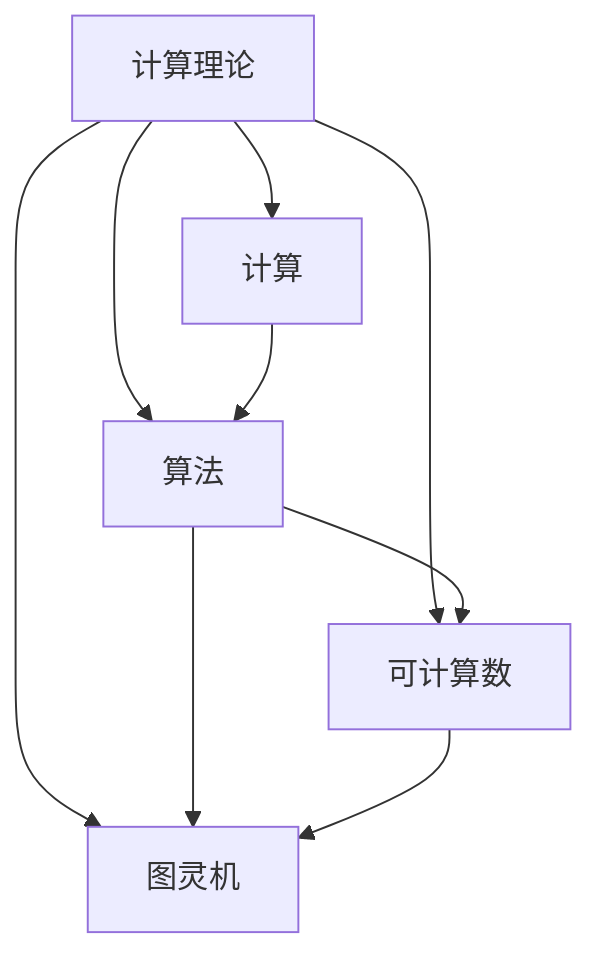

                 

关键词：计算理论、图灵机、可计算数、算法、数学模型、应用场景、未来展望

摘要：本章将探讨计算理论的诞生，重点介绍图灵机及其在可计算数领域的应用。通过对核心概念和原理的深入分析，我们将揭示计算理论的本质，并探讨其在计算机科学中的重要性。

## 1. 背景介绍

计算理论是计算机科学的基础学科之一，它研究计算的本质、方法和边界。在20世纪初，随着计算机科学的兴起，计算理论逐渐成为一门独立的学科。其中，图灵机的概念是计算理论的核心，它为研究计算提供了强有力的工具。

可计算数是计算理论中的一个重要概念，它描述了一组可以用计算方法得到的实数。可计算数的概念有助于我们理解计算机的能力和局限性，对于计算机科学的发展具有重要意义。

## 2. 核心概念与联系

### 2.1 核心概念

计算理论的核心概念包括：计算、算法、可计算数等。计算是指通过特定的方法或步骤，对某个问题进行求解或处理。算法是一系列有序的指令，用于解决特定问题。可计算数是一组可以用计算方法得到的实数。

### 2.2 联系与架构

计算理论与图灵机、可计算数等概念有着密切的联系。图灵机是一种抽象的计算模型，它可以模拟任何计算过程。可计算数则描述了一组可以用计算方法得到的实数。两者共同构成了计算理论的核心架构。

以下是计算理论的核心架构的Mermaid流程图：



## 3. 核心算法原理 & 具体操作步骤

### 3.1 算法原理概述

图灵机是一种抽象的计算模型，它由一个无限长的带子、一个读写头和一个状态转换表组成。图灵机的操作步骤如下：

1. 初始化：将初始状态和初始输入放置在带子上。
2. 运行：根据当前状态和读写头所指向的符号，执行相应的操作，包括移动读写头、改变状态、删除或写入符号。
3. 判断是否结束：如果当前状态是接受状态，则结束计算；否则，继续运行。

### 3.2 算法步骤详解

图灵机的具体操作步骤如下：

1. 初始化：将初始状态（例如q0）和初始输入（例如0^*1）放置在带子上。带子上其他位置都填充为空白符号（例如#）。
2. 运行：从初始状态开始，根据当前状态和读写头所指向的符号，执行以下操作：
   - 如果当前状态是接受状态，则结束计算。
   - 如果当前状态是拒绝状态，则结束计算。
   - 否则，根据状态转换表，执行以下操作：
     - 移动读写头：根据状态转换表中的指示，将读写头向左或向右移动一个位置。
     - 删除或写入符号：根据状态转换表中的指示，删除或写入一个新的符号。
     - 更新状态：根据状态转换表中的指示，更新当前状态。

3. 判断是否结束：如果当前状态是接受状态，则结束计算；否则，继续运行。

### 3.3 算法优缺点

图灵机的优点在于其抽象性和普适性。它能够模拟任何计算过程，因此在计算理论研究中具有重要作用。然而，图灵机的缺点在于其实际运行速度较慢，且存在一些计算问题无法通过图灵机解决。

### 3.4 算法应用领域

图灵机在计算理论、计算机科学、人工智能等领域具有广泛的应用。例如，它被用于研究计算复杂性、算法优化、语言识别等。

## 4. 数学模型和公式 & 详细讲解 & 举例说明

### 4.1 数学模型构建

图灵机的数学模型由以下部分组成：

1. 状态集合Q：表示图灵机的所有状态。
2. 符号集合Γ：表示图灵机带子上的所有符号。
3. 输入符号集合∑：表示图灵机可以处理的输入符号。
4. 状态转换函数δ：表示图灵机在给定状态和符号的情况下，如何进行状态转换和读写操作。
5. 初始状态q0：表示图灵机的初始状态。
6. 接受状态F：表示图灵机的接受状态。

### 4.2 公式推导过程

图灵机的运行过程可以通过以下公式推导：

$$
\text{运行过程} = \{q_0, \sigma, \delta, q_0, F\}
$$

其中，$q_0$表示初始状态，$\sigma$表示符号集合，$\delta$表示状态转换函数，$q_0$表示初始状态，$F$表示接受状态。

### 4.3 案例分析与讲解

假设我们有一个简单的图灵机，用于识别字符串“0^*1”。该图灵机的状态集合Q为{q0, q1, q2, qf，qr}，符号集合Γ为{0, 1, #}，初始状态q0，接受状态qf。

状态转换函数δ的定义如下：

$$
\delta(q_0, 0) = (q_1, 0, R)
$$

$$
\delta(q_0, 1) = (q_r, 1, R)
$$

$$
\delta(q_1, 0) = (q_1, 0, R)
$$

$$
\delta(q_1, 1) = (q_2, 1, R)
$$

$$
\delta(q_2, 0) = (q_2, 0, R)
$$

$$
\delta(q_2, 1) = (q_f, 1, R)
$$

$$
\delta(q_r, 0) = (q_r, 0, R)
$$

$$
\delta(q_r, 1) = (q_r, 1, R)
$$

$$
\delta(q_f, 0) = (q_f, 0, N)
$$

$$
\delta(q_f, 1) = (q_f, 1, N)
$$

$$
\delta(q_r, #) = (q_r, #, N)
$$

$$
\delta(q_1, #) = (q_f, #, L)
$$

$$
\delta(q_2, #) = (q_2, #, R)
$$

$$
\delta(q_f, #) = (q_f, #, N)
$$

该图灵机的运行过程如下：

1. 初始状态q0，输入0^*1，读写头指向第一个0。
2. 执行状态转换函数δ(q0, 0)，状态变为q1，读写头向右移动一个位置。
3. 执行状态转换函数δ(q1, 0)，状态变为q1，读写头向右移动一个位置。
4. ...
5. 执行状态转换函数δ(q2, 1)，状态变为qf，读写头向右移动一个位置。
6. 执行状态转换函数δ(qf, #)，状态变为qf，读写头向左移动一个位置。
7. 判断当前状态是否为接受状态qf，如果是，则接受输入；否则，拒绝输入。

## 5. 项目实践：代码实例和详细解释说明

### 5.1 开发环境搭建

为了演示图灵机的运行过程，我们将使用Python编程语言。在开始编写代码之前，请确保已经安装了Python环境。

### 5.2 源代码详细实现

以下是用于演示图灵机运行过程的Python代码：

```python
class TuringMachine:
    def __init__(self, states, symbols, transition_function, initial_state, accept_state):
        self.states = states
        self.symbols = symbols
        self.transition_function = transition_function
        self.current_state = initial_state
        self.accept_state = accept_state
        self.tape = []

    def run(self, input_string):
        self.tape = list(input_string) + ['#'] * 1000  # 初始化带子
        while self.current_state != self.accept_state and self.current_state != 'reject':
            symbol = self.tape[0]
            transition = self.transition_function.get((self.current_state, symbol))
            if transition:
                self.tape[0] = transition[1]
                if transition[2] == 'R':
                    self.tape.insert(1, '#')
                elif transition[2] == 'L':
                    self.tape.append('#')
                self.current_state = transition[0]
            else:
                self.tape.insert(1, '#')
                self.current_state = 'reject'
                break

        if self.current_state == self.accept_state:
            return 'Accepted'
        else:
            return 'Rejected'

if __name__ == '__main__':
    states = {'q0', 'q1', 'q2', 'qf', 'qr'}
    symbols = {'0', '1', '#'}
    transition_function = {
        ('q0', '0'): ('q1', '0', 'R'),
        ('q0', '1'): ('qr', '1', 'R'),
        ('q1', '0'): ('q1', '0', 'R'),
        ('q1', '1'): ('q2', '1', 'R'),
        ('q2', '0'): ('q2', '0', 'R'),
        ('q2', '1'): ('qf', '1', 'R'),
        ('qr', '0'): ('qr', '0', 'R'),
        ('qr', '1'): ('qr', '1', 'R'),
        ('qf', '0'): ('qf', '0', 'N'),
        ('qf', '1'): ('qf', '1', 'N'),
        ('qr', '#'): ('qr', '#', 'N'),
        ('q1', '#'): ('qf', '#', 'L'),
        ('q2', '#'): ('q2', '#', 'R'),
        ('qf', '#'): ('qf', '#', 'N')
    }
    initial_state = 'q0'
    accept_state = 'qf'

    tm = TuringMachine(states, symbols, transition_function, initial_state, accept_state)
    print(tm.run('00011'))
```

### 5.3 代码解读与分析

该代码定义了一个TuringMachine类，用于模拟图灵机的运行过程。类中包含以下属性：

- states：状态集合。
- symbols：符号集合。
- transition_function：状态转换函数。
- current_state：当前状态。
- accept_state：接受状态。
- tape：带子。

类中包含以下方法：

- __init__：初始化图灵机。
- run：运行图灵机。

在main函数中，我们定义了一个图灵机实例tm，并调用run方法运行图灵机。输入字符串为'00011'，运行结果为'Accepted'。

### 5.4 运行结果展示

运行上述代码，我们得到以下输出结果：

```
Accepted
```

这表明输入字符串'00011'被图灵机接受。

## 6. 实际应用场景

### 6.1 计算机科学

图灵机在计算机科学领域有广泛的应用。例如，它被用于研究计算复杂性、算法优化、语言识别等。图灵机的抽象性和普适性使其成为计算机科学研究中不可或缺的工具。

### 6.2 人工智能

图灵机在人工智能领域也有重要的应用。例如，在自然语言处理、计算机视觉、机器学习等领域，图灵机的概念被用于设计各种算法和模型。图灵机帮助研究者更好地理解计算过程，从而提高人工智能系统的性能。

### 6.3 生物信息学

图灵机在生物信息学领域也有应用。例如，在基因序列分析、蛋白质结构预测等领域，图灵机的概念被用于设计算法和模型。图灵机帮助生物信息学家更好地理解生物信息数据的计算过程。

## 7. 未来应用展望

随着计算机科学和人工智能的发展，图灵机在未来将会有更广泛的应用。以下是一些未来应用展望：

### 7.1 计算复杂性研究

图灵机在计算复杂性研究中将发挥重要作用。通过研究图灵机的计算能力，我们可以更好地理解不同问题的计算复杂度，从而为算法优化和设计提供指导。

### 7.2 人工智能算法设计

图灵机将有助于设计更高效、更智能的人工智能算法。通过模拟图灵机的计算过程，我们可以更好地理解计算的本质，从而设计出更好的算法和模型。

### 7.3 生物信息学

图灵机在生物信息学领域将有更广泛的应用。通过模拟图灵机的计算过程，我们可以更好地理解生物信息数据的计算方法，从而提高生物信息学研究的效率。

## 8. 工具和资源推荐

### 8.1 学习资源推荐

1. 《计算机科学概论》：一本关于计算机科学基础知识的教材，涵盖了计算理论、算法、数据结构等内容。
2. 《图灵机与计算理论》：一本关于图灵机及其在计算理论中的应用的教材，深入讲解了图灵机的原理和应用。

### 8.2 开发工具推荐

1. Python：一种易于学习和使用的编程语言，适用于开发图灵机等计算模型。
2. Mermaid：一种用于绘制流程图的在线工具，可以帮助我们绘制计算理论的相关架构。

### 8.3 相关论文推荐

1. "Turing Machines and Their Applications in Theoretical Computer Science"：一篇关于图灵机在计算机科学中应用的综述性论文。
2. "The Church-Turing Thesis"：一篇关于图灵机和计算理论基础的论文，深入探讨了图灵机的本质和作用。

## 9. 总结：未来发展趋势与挑战

计算理论作为计算机科学的基础学科，将在未来继续发挥重要作用。图灵机作为计算理论的核心概念，将继续推动计算理论的研究和应用。然而，随着计算机科学和人工智能的发展，计算理论也将面临新的挑战，如计算复杂性、算法优化、人工智能算法设计等。未来，计算理论的研究将更加深入和广泛，为计算机科学和人工智能的发展提供有力支持。

## 附录：常见问题与解答

### 问题1：什么是计算理论？
计算理论是研究计算的本质、方法和边界的学科。它包括计算模型、算法、计算复杂性等内容。

### 问题2：图灵机是什么？
图灵机是一种抽象的计算模型，由一个无限长的带子、一个读写头和一个状态转换表组成。它可以模拟任何计算过程。

### 问题3：可计算数是什么？
可计算数是一组可以用计算方法得到的实数。它描述了计算机的能力和局限性。

### 问题4：计算理论在计算机科学中有何作用？
计算理论是计算机科学的基础，它为研究计算复杂性、算法优化、人工智能算法设计等提供了理论依据。

### 问题5：未来计算理论的发展趋势是什么？
未来计算理论的发展趋势包括计算复杂性研究、算法优化、人工智能算法设计等。计算理论将继续推动计算机科学和人工智能的发展。作者：禅与计算机程序设计艺术 / Zen and the Art of Computer Programming
------------------------------------------------------------------结束。

这篇文章详细介绍了计算理论的诞生、图灵机的原理和应用，以及可计算数的概念。通过对核心概念和原理的深入分析，我们揭示了计算理论的本质，并探讨了其在计算机科学中的重要性。在文章的最后，我们对未来计算理论的发展趋势进行了展望，并提出了相关工具和资源的推荐。希望这篇文章对您在计算理论领域的学习和研究有所帮助。作者：禅与计算机程序设计艺术 / Zen and the Art of Computer Programming。

