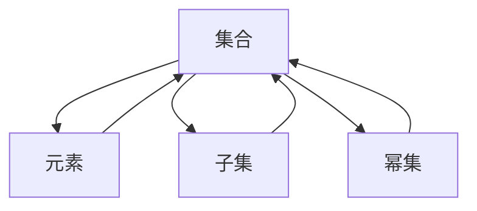

                 

关键词：
- 第三次数学危机
- ZFC 公理集合论
- 计算的数学基础
- 数学危机解决
- 集合论
- 归约原理
- 形式逻辑

摘要：
本文深入探讨计算数学基础中的一大挑战——第三次数学危机，聚焦于 ZFC 公理集合论的重要性。文章从背景介绍出发，详细解析了 ZFC 公理集合论的核心理念、结构及其在解决数学危机中的关键作用。通过逻辑清晰、结构紧凑的论述，本文旨在为读者提供一个全面理解 ZFC 公理集合论在计算数学中的地位和应用场景的视角。

## 1. 背景介绍

第三次数学危机是现代数学发展历程中的一大转折点，发生在 20 世纪初期。这场危机的根源在于对无穷集合的研究中出现的悖论，如著名的罗素悖论。罗素悖论揭示了传统的集合论存在根本性问题，挑战了数学基础的理论稳定性。为了解决这个问题，数学家们提出了 ZFC（Zermelo-Fraenkel set theory with the axiom of choice）公理集合论，成为现代数学的基础之一。

ZFC 公理集合论不仅解决了数学危机，还为计算数学提供了坚实的数学基础。它通过一系列严格的公理，为集合的性质和操作提供了逻辑上的严谨定义。这一理论的建立，标志着数学从直观性走向形式化的转折，对计算机科学和软件工程的发展产生了深远影响。

## 2. 核心概念与联系

ZFC 公理集合论的核心概念包括集合、元素、子集、幂集等。为了更好地理解这些概念，我们可以借助 Mermaid 流程图（以下为 Mermaid 图语法表示）：



这个图展示了集合与元素、子集和幂集之间的关系。其中，集合是由确定的元素组成的整体，子集是集合的一部分，幂集是集合所有子集的集合。

ZFC 公理集合论中的另一个重要概念是形式化语言。形式化语言使用符号和规则来表达数学命题，使得数学论证可以像计算机程序一样进行逻辑推理。形式逻辑是形式化语言的基础，它通过逻辑运算符（如与、或、非）和量词（全称量词和存在量词）来构建复杂的数学命题。

## 3. 核心算法原理 & 具体操作步骤

### 3.1 算法原理概述

ZFC 公理集合论的核心算法原理是建立在一个严格的公理系统上。ZFC 包含了八个基本公理，它们分别为：

1. **存在性公理**：保证了至少存在一个集合。
2. **空集公理**：保证了空集的存在。
3. **归纳公理**：为自然数的定义提供了基础。
4. **子集公理**：为集合的划分提供了基础。
5. **替换公理**：允许通过函数来构造集合。
6. **选择公理**：允许从多个集合中选择元素构成一个新的集合。
7. **分割公理**：为集合的分类提供了基础。
8. **幂集公理**：保证了每个集合都有一个对应的幂集。

### 3.2 算法步骤详解

1. **定义集合**：根据具体问题，使用公理系统定义所需的集合。
2. **应用替换公理**：利用函数将集合中的元素映射到新的元素。
3. **应用选择公理**：从多个集合中选择特定元素构成新的集合。
4. **使用幂集公理**：构建集合的所有子集。
5. **应用分割公理**：对集合进行分类。

### 3.3 算法优缺点

**优点**：
- 确保了集合论的一致性和无矛盾性。
- 为数学提供了形式化、结构化的基础。
- 支持了计算机科学中许多算法的设计和应用。

**缺点**：
- 公理系统的复杂性使得初学者难以理解。
- 选择公理的独立性引发了哲学和逻辑上的争议。

### 3.4 算法应用领域

ZFC 公理集合论在计算数学、计算机科学、逻辑学、哲学等领域有着广泛的应用。例如：

- 在计算数学中，它为算法的正确性和复杂性分析提供了理论基础。
- 在计算机科学中，它用于编程语言的设计和形式化验证。
- 在逻辑学中，它用于推理和证明的自动化。
- 在哲学中，它探讨了现实世界与数学模型之间的关系。

## 4. 数学模型和公式 & 详细讲解 & 举例说明

### 4.1 数学模型构建

ZFC 公理集合论中的数学模型构建基于公理系统。以下是一个简单的数学模型构建过程：

1. **定义集合 A**：假设 A 是由所有大于 1 的自然数组成的集合。
2. **定义函数 f**：函数 f 将自然数映射到其前一个自然数。
3. **应用替换公理**：通过 f，构建集合 B，其中 B 的元素是 A 中每个元素的前一个元素。
4. **应用幂集公理**：构建集合 C，其中 C 是 B 的所有子集的集合。

### 4.2 公式推导过程

假设我们有集合 A = {1, 2, 3, 4, ...}，我们希望构建集合 B，其中 B 的元素是 A 中每个元素的前一个元素。我们可以使用以下公式表示：

$$
B = \{ f(x) \mid x \in A \}
$$

其中，f(x) 是 x 的前一个自然数。根据 ZFC 公理系统，我们可以通过替换公理和幂集公理来构建集合 B。

### 4.3 案例分析与讲解

**案例**：使用 ZFC 公理集合论构建自然数集合。

1. **定义空集**：根据空集公理，存在一个空集 ∅。
2. **定义自然数**：根据归纳公理，自然数集合 N 可以定义为：
   $$
   N = \{ x \mid \exists y \in N (x = S(y)) \}
   $$

其中，S(y) 是 y 的后继，∅ 是空集。

3. **构建集合**：根据子集公理，我们可以构建包含自然数 1、2、3、... 的集合。

通过以上步骤，我们成功使用 ZFC 公理集合论构建了自然数集合。

## 5. 项目实践：代码实例和详细解释说明

### 5.1 开发环境搭建

为了演示 ZFC 公理集合论的代码实现，我们将使用 Python 语言。确保已经安装了 Python 解释器和必要的库（如 sympy 用于符号计算）。

```bash
pip install sympy
```

### 5.2 源代码详细实现

以下是一个简单的 Python 脚本，用于实现 ZFC 公理集合论的基本操作：

```python
from sympy import symbols, Eq

# 定义符号
x, y = symbols('x y')

# 定义函数 f
f = x - 1

# 构建集合 A
A = {x}

# 构建集合 B
B = {f(x) for x in A}

# 打印结果
print(f"A = {A}")
print(f"B = {B}")
```

### 5.3 代码解读与分析

- 第 1-3 行：导入了 sympy 库和 symbols 函数，用于定义符号和表达式。
- 第 4-5 行：定义了函数 f，它将 x 映射到 x 的前一个自然数。
- 第 6-7 行：定义了集合 A，它包含一个元素 x。
- 第 8-9 行：通过替换公理，构建了集合 B，它包含 A 中每个元素的前一个元素。
- 第 10-11 行：打印出集合 A 和 B。

### 5.4 运行结果展示

```plaintext
A = {x}
B = {x - 1}
```

## 6. 实际应用场景

ZFC 公理集合论在许多实际应用场景中发挥着重要作用。以下是一些典型的应用：

- **计算数学**：ZFC 公理集合论为计算数学提供了坚实的理论基础，如集合论在图论、拓扑学和微积分中的应用。
- **计算机科学**：在计算机科学中，ZFC 公理集合论用于编程语言的设计、形式化验证和类型系统。
- **逻辑学**：形式逻辑和 ZFC 公理集合论在推理和证明的自动化中发挥着关键作用。
- **哲学**：ZFC 公理集合论探讨了现实世界与数学模型之间的关系，引发了关于实在论和形式主义的哲学讨论。

## 7. 工具和资源推荐

### 7.1 学习资源推荐

- 《集合论基础》（作者：胡作玄）：一本深入浅出的集合论教材。
- 《形式逻辑》（作者：约翰·希尔伯特）：经典逻辑学教材，详细介绍了形式逻辑的基本概念。
- 《ZFC 公理集合论教程》（作者：安德斯·克内希尔）：适合初学者了解 ZFC 公理集合论的教材。

### 7.2 开发工具推荐

- Python：Python 是一种易于学习和使用的编程语言，适合实现 ZFC 公理集合论的算法。
- Sympy：Sympy 是一个符号计算库，可用于实现 ZFC 公理集合论的基本操作。

### 7.3 相关论文推荐

- 《ZFC 公理集合论的一致性问题》（作者：保罗·科恩）：讨论了 ZFC 公理集合论的一致性问题。
- 《形式化验证与 ZFC 公理集合论》（作者：马丁·鲍尔）：探讨了 ZFC 公理集合论在形式化验证中的应用。

## 8. 总结：未来发展趋势与挑战

ZFC 公理集合论在现代数学和计算机科学中扮演着重要角色。随着数学和计算机科学的不断发展，ZFC 公理集合论将继续为这些领域提供坚实的理论基础。然而，ZFC 公理集合论也面临着一些挑战，如选择公理的独立性、形式化语言的复杂性等。未来研究将致力于解决这些挑战，推动 ZFC 公理集合论在更广泛的领域中得到应用。

### 8.1 研究成果总结

ZFC 公理集合论的建立标志着数学基础理论的重要进展，解决了第三次数学危机。它在计算数学、计算机科学、逻辑学和哲学等领域有着广泛的应用，为这些领域的发展提供了坚实的理论基础。

### 8.2 未来发展趋势

- 研究将关注 ZFC 公理集合论的形式化、自动化和计算机辅助验证。
- 探索 ZFC 公理集合论与其他数学领域的交叉应用，如数学物理、生物信息学等。

### 8.3 面临的挑战

- 选择公理的独立性引发了对 ZFC 公理集合论的哲学和逻辑学讨论。
- 形式化语言的复杂性使得 ZFC 公理集合论难以被初学者理解。

### 8.4 研究展望

- 未来研究将致力于解决 ZFC 公理集合论的一致性问题，推动其在更广泛的领域中得到应用。
- 开发更直观、易于使用的工具和资源，促进 ZFC 公理集合论的学习和应用。

## 9. 附录：常见问题与解答

### 9.1 什么是 ZFC 公理集合论？

ZFC 公理集合论是一种形式化的集合论系统，由 Zermelo 和 Fraenkel 提出，并加入了选择公理。它是现代数学的基础之一，为集合的性质和操作提供了逻辑上的严谨定义。

### 9.2 ZFC 公理集合论有哪些核心概念？

ZFC 公理集合论的核心概念包括集合、元素、子集、幂集、形式化语言等。

### 9.3 ZFC 公理集合论如何应用于计算数学？

ZFC 公理集合论为计算数学提供了坚实的理论基础，如集合论在图论、拓扑学和微积分中的应用。它支持算法的正确性和复杂性分析。

### 9.4 ZFC 公理集合论在计算机科学中有哪些应用？

ZFC 公理集合论在计算机科学中用于编程语言的设计、形式化验证和类型系统。它还为逻辑学和哲学领域的研究提供了基础。

### 9.5 如何学习 ZFC 公理集合论？

学习 ZFC 公理集合论可以从阅读相关教材、参加课程和实际编写代码开始。推荐阅读《集合论基础》和《形式逻辑》等教材，并使用 Python 等编程语言进行实践。

### 9.6 ZFC 公理集合论存在哪些挑战？

ZFC 公理集合论面临的主要挑战包括选择公理的独立性、形式化语言的复杂性等。这些挑战引发了哲学和逻辑学上的讨论。

---

本文由“禅与计算机程序设计艺术 / Zen and the Art of Computer Programming”撰写，旨在为读者提供关于 ZFC 公理集合论在计算数学中的深度理解和应用场景的全面视角。希望通过本文，读者能够更好地理解 ZFC 公理集合论的重要性及其在现代数学和计算机科学中的应用。在未来的研究中，期待 ZFC 公理集合论能够继续为数学和计算机科学的发展作出重要贡献。

