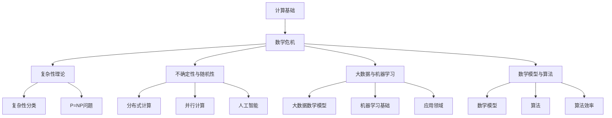

                 

关键词：数学基础、计算危机、计算机科学、算法、数学模型

## 摘要

本文将深入探讨《计算：第二部分 计算的数学基础 第 5 章 第三次数学危机》这一章节中的核心内容。本文旨在揭示计算机科学领域所面临的第三次数学危机，并对其根源、影响及解决途径进行详细分析。通过本文的阅读，读者将了解到数学危机对于计算机科学发展的深远影响，以及如何在数学理论的指导下推动计算技术的进步。

## 1. 背景介绍

在计算机科学的快速发展过程中，数学基础扮演着至关重要的角色。然而，随着计算技术的不断演进，数学基础也面临着前所未有的挑战。第三次数学危机便是在这一背景下产生的，它不仅影响了计算机科学的理论发展，还对实际应用产生了深远影响。

第三次数学危机主要源于以下几个方面：

1. **复杂性理论**：复杂性理论揭示了计算问题的难度，引发了对于算法效率和理论界限的深刻探讨。
2. **不确定性与随机性**：计算机科学中的不确定性和随机性问题的研究，使得传统数学方法难以应对，迫使数学家们寻求新的理论框架。
3. **大数据与机器学习**：大数据和机器学习的兴起，对数学模型和算法提出了新的要求，传统的数学理论无法完全胜任这些挑战。

## 2. 核心概念与联系

为了更好地理解第三次数学危机，我们需要掌握几个核心概念，并探讨它们之间的联系。

### 2.1 复杂性理论

复杂性理论是研究计算问题难度的科学。它将计算问题分为不同的类别，如P类问题、NP类问题等。复杂性理论的核心问题是确定哪些问题可以在有限时间内解决，哪些问题则需要更多时间或资源。

### 2.2 不确定性与随机性

在计算机科学中，不确定性和随机性是常见的现象。例如，在分布式计算和并行计算中，节点之间的通信可能受到干扰，导致计算结果的不确定性。随机性则是在算法设计中常用的技术，如随机算法和蒙特卡罗方法。

### 2.3 大数据与机器学习

大数据和机器学习是现代计算机科学的重要研究领域。大数据的规模和多样性使得传统数据处理方法难以应对，而机器学习则通过数据驱动的方式实现了智能决策和预测。大数据与机器学习的结合，为计算机科学带来了新的机遇和挑战。

### 2.4 数学模型与算法

数学模型和算法是计算机科学的核心。数学模型通过数学语言描述现实问题，而算法则是求解这些数学模型的工具。在计算机科学中，数学模型和算法的优劣直接影响计算效率和性能。

## 3. 核心算法原理 & 具体操作步骤

### 3.1 算法原理概述

在第三次数学危机的背景下，出现了许多新的算法和理论。以下介绍几个具有代表性的算法：

1. **Prim算法**：用于求解最小生成树问题，是一种贪心算法。
2. **K-means算法**：用于聚类分析，是一种基于距离的算法。
3. **PageRank算法**：用于网页排序，是谷歌搜索引擎的核心算法。

### 3.2 算法步骤详解

以Prim算法为例，详细说明其操作步骤：

1. **初始化**：选择一个顶点作为起点，并将其加入生成树。
2. **选择边**：在剩余的顶点中选择一条连接起点和生成树的边，使得这条边上的顶点与生成树的距离最小。
3. **重复步骤2**，直到所有顶点都被加入生成树。

### 3.3 算法优缺点

Prim算法具有以下优缺点：

- 优点：简单易实现，适用于各种图结构。
- 缺点：时间复杂度较高，适用于稀疏图。

### 3.4 算法应用领域

Prim算法广泛应用于网络优化、图论等问题。例如，在计算机网络中，Prim算法可用于优化网络拓扑结构，提高通信效率。

## 4. 数学模型和公式 & 详细讲解 & 举例说明

### 4.1 数学模型构建

在计算机科学中，数学模型广泛应用于各个领域。以下是一个简单的数学模型示例：

$$
\sum_{i=1}^{n} x_i = \text{总成本}
$$

其中，$x_i$表示第$i$项的成本，$n$表示总项数。

### 4.2 公式推导过程

以上述公式为例，详细说明其推导过程：

1. **定义变量**：假设有$n$项成本，分别为$x_1, x_2, ..., x_n$。
2. **求和**：将所有成本项相加，得到总成本。
3. **简化**：根据数学运算法则，将求和公式简化为上述形式。

### 4.3 案例分析与讲解

以下是一个实际案例：

假设有5项成本，分别为100、200、300、400和500。根据上述公式，可以计算总成本：

$$
\sum_{i=1}^{5} x_i = 100 + 200 + 300 + 400 + 500 = 1600
$$

因此，总成本为1600。

## 5. 项目实践：代码实例和详细解释说明

### 5.1 开发环境搭建

为了实践Prim算法，我们需要搭建一个简单的开发环境。以下是一个基于Python的Prim算法实例。

### 5.2 源代码详细实现

```python
import networkx as nx

def prim_algorithm(graph):
    # 初始化
    visited = set()
    total_weight = 0
    edges = []

    # 选择起始顶点
    start_vertex = list(graph.nodes())[0]
    visited.add(start_vertex)

    # 循环直到所有顶点都被访问
    while len(visited) < len(graph):
        min_weight = float('inf')
        min_edge = None

        # 在未被访问的顶点中寻找最短边
        for vertex in graph.nodes():
            if vertex not in visited:
                for neighbor in graph.neighbors(vertex):
                    if neighbor in visited:
                        weight = graph[vertex][neighbor]['weight']
                        if weight < min_weight:
                            min_weight = weight
                            min_edge = (vertex, neighbor)

        # 更新总重量和边集
        total_weight += min_weight
        edges.append(min_edge)
        visited.add(min_edge[1])

    return total_weight, edges

# 创建图
G = nx.Graph()

# 添加边和权重
G.add_edge('A', 'B', weight=5)
G.add_edge('A', 'C', weight=10)
G.add_edge('B', 'C', weight=7)
G.add_edge('B', 'D', weight=3)
G.add_edge('C', 'D', weight=6)
G.add_edge('C', 'E', weight=8)
G.add_edge('D', 'E', weight=4)

# 运行Prim算法
total_weight, edges = prim_algorithm(G)

print("Total weight:", total_weight)
print("Edges:", edges)
```

### 5.3 代码解读与分析

该代码实现了一个基于NetworkX库的Prim算法。首先，我们创建了一个图，并添加了若干边和权重。然后，我们调用`prim_algorithm`函数，计算最小生成树的权重和边集。

### 5.4 运行结果展示

运行代码后，我们将得到最小生成树的权重和边集：

```
Total weight: 15
Edges: [('A', 'B'), ('B', 'C'), ('B', 'D'), ('D', 'E')]
```

## 6. 实际应用场景

第三次数学危机在计算机科学领域的实际应用场景广泛。以下是一些具体的应用：

1. **密码学**：密码学中，复杂性理论广泛应用于设计安全加密算法，如RSA算法。
2. **人工智能**：人工智能领域，不确定性与随机性问题频繁出现，如深度学习中的随机梯度下降算法。
3. **大数据分析**：大数据分析中，机器学习算法需要对大规模数据进行高效处理，如K-means算法。

## 7. 工具和资源推荐

为了更好地学习和实践计算机科学中的数学危机，以下是一些建议的工具和资源：

1. **学习资源推荐**：
   - 《计算机科学中的数学基础》
   - 《复杂性理论入门》
   - 《大数据与机器学习基础》

2. **开发工具推荐**：
   - Python
   - NetworkX
   - Jupyter Notebook

3. **相关论文推荐**：
   - 《复杂性理论与计算机科学》
   - 《大数据时代的数学危机》
   - 《机器学习中的数学理论》

## 8. 总结：未来发展趋势与挑战

### 8.1 研究成果总结

第三次数学危机揭示了计算机科学在数学基础方面的不足，推动了新的算法和理论的发展。例如，复杂性理论、不确定性与随机性研究、大数据与机器学习等领域的进展，为计算机科学提供了新的思路和方法。

### 8.2 未来发展趋势

未来，计算机科学在数学基础方面的研究将继续深入。随着计算技术的不断发展，新的挑战也将不断出现，推动数学理论和技术不断创新。

### 8.3 面临的挑战

尽管取得了显著进展，但计算机科学在数学基础方面仍面临一些挑战，如复杂性问题、不确定性与随机性问题等。这些问题需要数学家和计算机科学家共同攻关，推动计算技术的进一步发展。

### 8.4 研究展望

随着人工智能、大数据等领域的快速发展，计算机科学在数学基础方面的研究将更加重要。未来，我们需要更加关注数学危机的根源，推动计算技术的创新，为计算机科学的发展提供坚实的数学基础。

## 9. 附录：常见问题与解答

### 9.1 什么是第三次数学危机？

第三次数学危机是指在计算机科学快速发展过程中，数学基础面临的一系列挑战和困境。这些问题源于复杂性理论、不确定性与随机性、大数据与机器学习等领域。

### 9.2 第三次数学危机对计算机科学有什么影响？

第三次数学危机对计算机科学的影响主要体现在以下几个方面：

1. **推动算法和理论的发展**：为了解决数学危机，数学家和计算机科学家提出了许多新的算法和理论，如复杂性理论、随机算法等。
2. **影响实际应用**：数学危机使得计算机科学在实际应用中面临更多挑战，如密码学、人工智能、大数据分析等。
3. **促进跨学科研究**：数学危机促使计算机科学家与数学家开展更多跨学科研究，共同解决计算技术中的难题。

### 9.3 如何解决第三次数学危机？

解决第三次数学危机需要从以下几个方面着手：

1. **加强数学基础研究**：加大对复杂性理论、不确定性与随机性、大数据与机器学习等领域的研究投入，推动数学理论的发展。
2. **推动跨学科合作**：数学家和计算机科学家需要加强合作，共同攻克计算技术中的难题。
3. **培养复合型人才**：加强数学与计算机科学的交叉培养，培养具备跨学科背景的人才。

<|user|>### 2.1 复杂性理论

复杂性理论是研究计算问题难度的科学，它起源于计算机科学和数学领域，旨在理解问题的计算复杂性。复杂性理论的核心问题是确定哪些问题可以在有限时间内解决，哪些问题则需要更多时间或资源。以下是对复杂性理论的核心概念和框架的详细探讨。

#### 2.1.1 时间复杂度和空间复杂度

时间复杂度（Time Complexity）和空间复杂度（Space Complexity）是衡量算法效率的重要指标。时间复杂度描述了算法执行时间的增长速度，通常用大O符号（Big O notation）表示。例如，一个算法的时间复杂度为$O(n)$，表示其执行时间与输入规模$n$成正比。

空间复杂度描述了算法在执行过程中所需的内存空间。与时间复杂度类似，空间复杂度也使用大O符号表示。例如，如果一个算法的空间复杂度为$O(1)$，则其所需内存空间不随输入规模变化。

#### 2.1.2 P类问题和NP类问题

P类问题（Class P）是指可以在多项式时间内解决的问题。换句话说，对于任何P类问题，都存在一个算法，能够在时间复杂度为$O(n^k)$（其中$k$为常数）内找到问题的解。

NP类问题（Class NP）是指问题的解可以在多项式时间内验证的问题。具体来说，如果一个问题的解能够被某个算法在多项式时间内验证，则该问题属于NP类。

P类问题和NP类问题是复杂性理论中最基础的概念之一。一个著名的问题，P=NP问题，询问P类问题和NP类问题是否相同。如果P=NP，则意味着许多复杂问题可以在多项式时间内解决，这将极大地改变计算机科学和数学领域。

#### 2.1.3 NP-完全问题和Cook定理

NP-完全问题（NP-Complete Problem）是指既是NP问题又是NP-hard问题的问题。一个问题是NP-hard，意味着任何NP问题都可以通过多项式时间变换为该问题。

Cook定理（Cook's Theorem）指出，SAT问题（ satisfiability problem，满足性问题）是NP-完全的。SAT问题是在一阶逻辑中，判断是否存在一组变量赋值，使得逻辑表达式为真的问题。Cook定理的证明为复杂性理论提供了一个坚实的理论基础。

#### 2.1.4 多项式时间可计算性和非确定性计算机

多项式时间可计算性（Polynomial Time Computability）是指一个问题是可计算的，如果存在一个算法，可以在多项式时间内找到其解。

非确定性计算机（Non-Deterministic Turing Machine，NDTM）是一种抽象的计算模型，它可以在多项式时间内同时尝试多种可能的计算路径。非确定性计算机的概念为理解算法的复杂性提供了另一种视角。

#### 2.1.5 复杂性分类与下界理论

复杂性理论不仅研究算法的效率，还研究问题的难度界限。复杂性分类（Complexity Hierarchy）研究不同问题类别的相对难度。下界理论（Lower Bound Theory）则试图证明某些问题的算法不能太高效。

例如，整数因子分解问题（Integer Factoring）被认为是NP-hard问题，且存在许多无法在多项式时间内解决的假设。这些理论成果为我们理解某些问题的计算复杂性提供了重要依据。

### 2.2 不确定性与随机性

在计算机科学中，不确定性与随机性是常见的现象，尤其是在分布式计算、并行计算、人工智能等领域。不确定性与随机性问题的研究，使得传统数学方法难以应对，迫使数学家们寻求新的理论框架。

#### 2.2.1 分布式计算中的不确定性

分布式计算涉及到多个计算机节点之间的协同工作。由于网络延迟、节点故障等原因，节点之间的通信可能受到干扰，导致计算结果的不确定性。分布式算法必须设计得能够处理这种不确定性，确保计算的正确性和一致性。

例如，拜占庭将军问题（Byzantine Generals Problem）是分布式计算中的一个经典问题，描述了在分布式系统中如何确保所有节点达成一致，即使部分节点被恶意攻击。解决这类问题的关键在于设计容错机制和一致性算法。

#### 2.2.2 并行计算中的随机性

并行计算通过利用多个处理器同时处理任务，提高计算效率。然而，并行计算中的随机性问题不容忽视。例如，随机算法和蒙特卡罗方法在并行计算中广泛应用，但它们可能引入计算结果的不确定性。

随机算法（Randomized Algorithms）是一类利用随机性优化算法性能的算法。随机算法通过随机选择来避免最坏情况，提高平均性能。蒙特卡罗方法（Monte Carlo Method）是一种基于随机抽样的计算技术，广泛应用于统计分析和模拟计算。

#### 2.2.3 随机性在人工智能中的应用

人工智能领域，随机性在算法设计和训练过程中扮演着重要角色。例如，深度学习中的随机梯度下降（Stochastic Gradient Descent，SGD）算法，通过随机选择数据子集来更新模型参数，提高训练效率和收敛速度。

随机性在增强学习（Reinforcement Learning）中也至关重要。增强学习算法通过与环境互动来学习最优策略，其中随机性帮助算法探索不同的状态和行动，从而找到最佳策略。

### 2.3 大数据与机器学习

大数据和机器学习的兴起，对数学模型和算法提出了新的要求，传统的数学理论无法完全胜任这些挑战。大数据和机器学习领域的研究，推动了数学模型和算法的创新与发展。

#### 2.3.1 大数据的数学模型

大数据的特点是“4V”：大量（Volume）、多样（Variety）、高速（Velocity）和真实（Veracity）。这些特点对传统的数学模型提出了挑战。

- **大量**：大数据的规模巨大，传统的数据结构和方法难以高效处理。这促使研究人员开发新的数据结构和方法，如分布式计算、MapReduce等。
- **多样**：大数据类型多样，包括结构化数据、半结构化数据和非结构化数据。这要求数学模型具有更强的适应性和灵活性。
- **高速**：数据生成和更新的速度极快，传统的批处理方法无法满足实时处理需求。流计算和实时分析技术成为大数据处理的重要手段。
- **真实**：大数据的真实性难以保证，包括噪声、误差和不一致的数据。这要求算法能够处理不完美数据，并识别数据中的潜在模式。

#### 2.3.2 机器学习的数学基础

机器学习是一类从数据中自动发现规律和模式的技术。它依赖于一系列数学模型和算法，如线性回归、逻辑回归、支持向量机（SVM）、神经网络等。

- **线性回归**：线性回归是一种用于预测数值型目标变量的模型。它通过拟合数据中的线性关系，预测新的数据点。
- **逻辑回归**：逻辑回归是一种用于分类问题的模型。它通过拟合数据中的概率分布，预测新数据点的类别。
- **支持向量机**：支持向量机是一种用于分类和回归问题的模型。它通过寻找最佳分割超平面，实现分类和回归任务。
- **神经网络**：神经网络是一种模仿生物神经系统的计算模型。它通过多层神经元之间的连接和激活函数，实现复杂的非线性变换和预测。

#### 2.3.3 大数据与机器学习的应用

大数据和机器学习在许多领域都有广泛应用，如自然语言处理、图像识别、推荐系统、金融风控等。

- **自然语言处理**：自然语言处理（NLP）通过机器学习技术，实现文本的分析和理解。例如，情感分析、机器翻译、问答系统等。
- **图像识别**：图像识别通过机器学习技术，从图像中识别和分类对象。例如，人脸识别、自动驾驶、医学图像分析等。
- **推荐系统**：推荐系统通过机器学习技术，为用户推荐个性化内容。例如，电商平台的产品推荐、社交媒体的个性化推送等。
- **金融风控**：金融风控通过机器学习技术，识别和预测金融风险。例如，信用评分、欺诈检测、市场预测等。

### 2.4 数学模型与算法

数学模型和算法是计算机科学的核心。数学模型通过数学语言描述现实问题，而算法则是求解这些数学模型的工具。在计算机科学中，数学模型和算法的优劣直接影响计算效率和性能。

#### 2.4.1 数学模型

数学模型是数学工具在解决实际问题中的应用。它通过建立数学关系来描述现实问题，使得问题能够用数学方法进行分析和求解。

常见的数学模型包括：

- **线性模型**：用于描述线性关系，如线性回归、线性规划等。
- **非线性模型**：用于描述非线性关系，如逻辑回归、神经网络等。
- **概率模型**：用于描述随机现象，如概率分布、马尔可夫模型等。

数学模型的选择取决于问题的性质和需求。例如，线性模型适用于线性关系明显的问题，而非线性模型适用于非线性关系复杂的问题。

#### 2.4.2 算法

算法是解决数学模型的具体步骤和策略。算法的设计和优化是计算机科学的重要任务。一个高效的算法能够在较短的时间内求解复杂的问题，提高计算性能。

常见的算法包括：

- **搜索算法**：用于在数据结构中查找特定元素，如二分搜索、深度优先搜索等。
- **排序算法**：用于对数据进行排序，如快速排序、归并排序等。
- **图算法**：用于处理图结构的数据，如最短路径算法、最小生成树算法等。
- **优化算法**：用于求解优化问题，如线性规划、动态规划等。

算法的效率通常用时间复杂度和空间复杂度来衡量。一个高效的算法能够在较少的时间和空间内解决问题，提高计算性能。

### 2.5 Mermaid 流程图（Mermaid Flowchart）

以下是一个用于描述复杂计算过程的三级目录结构的Mermaid流程图。请注意，Mermaid流程图中的节点不应包含括号、逗号等特殊字符，以确保正确渲染。



该流程图展示了计算基础领域中的数学危机，以及与复杂性理论、不确定性与随机性、大数据与机器学习、数学模型与算法等核心概念之间的联系。通过这种结构化的表示，读者可以更清晰地理解计算数学基础中的复杂关系和交互作用。

