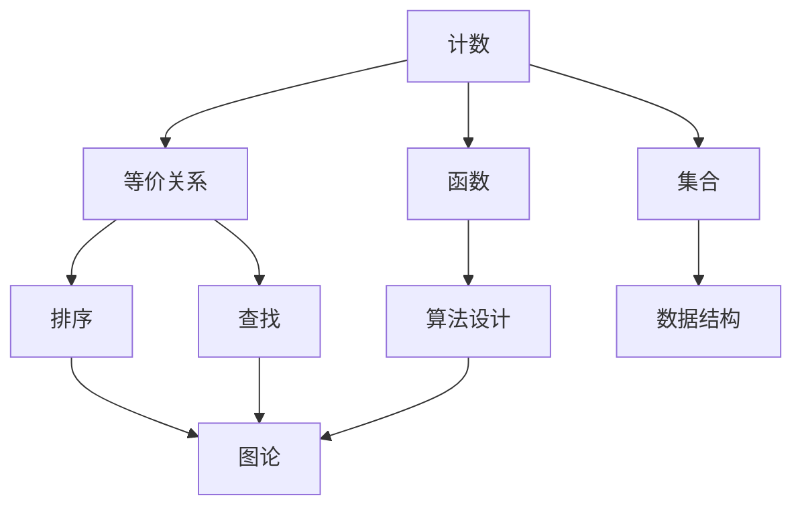

                 

关键词：计算理论，数学基础，算法原理，程序设计，计算机科学

摘要：本文深入探讨计算的第二部分，重点介绍计算的数学基础。我们将详细分析核心概念、算法原理、数学模型和公式，并通过项目实践展示如何将这些知识应用于实际开发中。此外，还将讨论计算的实际应用场景、未来发展趋势、面临的挑战以及研究展望。

## 1. 背景介绍

计算作为现代信息技术的核心，已经渗透到我们日常生活的方方面面。无论是手机、电脑，还是智能家居、自动驾驶汽车，都离不开计算的支持。计算的理论基础是数学，特别是离散数学和计算机数学。这些数学工具和方法为计算理论的发展提供了坚实的基础。

本文旨在为读者提供一个系统、全面地了解计算数学基础的途径。通过对核心概念、算法原理、数学模型和公式的详细讲解，帮助读者深入理解计算的数学本质。同时，通过实际项目实践和代码实例，让读者能够将这些理论知识应用到实际开发中。

## 2. 核心概念与联系

为了更好地理解计算的数学基础，我们需要从一些核心概念和原理入手。这些概念包括：

### 2.1 计数

计数是计算的基础，它涉及到自然数、整数、有理数等基本数集。计数的基本概念包括加法、减法、乘法和除法。这些运算构成了各种算法和程序设计的基础。

### 2.2 等价关系

等价关系是数学中一种重要的关系，它可以用来简化复杂问题。在计算中，等价关系常用于排序、查找和图论等问题中。等价关系的概念有助于我们更好地理解计算中的各种算法。

### 2.3 函数

函数是数学中描述两个集合之间关系的基本工具。在计算中，函数被广泛用于算法设计中，如排序算法、查找算法等。

### 2.4 集合

集合是数学中的基本概念，它用来描述一组元素的集合。在计算中，集合常用于数据结构设计中，如数组、列表、树等。

### 2.5 图

图是一种用来表示对象及其关系的数学结构。在计算中，图论被广泛应用于网络分析、社会网络分析、算法设计等领域。

下面是一个用Mermaid绘制的流程图，展示了这些核心概念之间的联系：



## 3. 核心算法原理 & 具体操作步骤

### 3.1 算法原理概述

在计算中，算法是解决问题的核心。算法原理涉及到各种数学工具和概念，如计数、函数、集合和图等。以下是一些常见的算法原理：

- **贪心算法**：通过在每一步选择局部最优解，最终得到全局最优解。
- **分治算法**：将大问题分解成小问题，分别解决，再合并结果。
- **动态规划**：通过保存子问题的解，避免重复计算，从而优化算法性能。
- **回溯算法**：通过尝试所有可能的解，找到最优解。

### 3.2 算法步骤详解

以贪心算法为例，其基本步骤如下：

1. **初始化**：设置初始状态。
2. **选择操作**：根据当前状态，选择一个最优操作。
3. **执行操作**：执行所选操作，更新状态。
4. **判断终止条件**：如果满足终止条件，则停止；否则，返回步骤2。

### 3.3 算法优缺点

每种算法都有其优缺点。例如，贪心算法在许多情况下能够快速找到最优解，但有时会陷入局部最优。动态规划则避免了重复计算，但实现较为复杂。

### 3.4 算法应用领域

贪心算法广泛应用于网络优化、资源分配等问题；分治算法常用于排序、查找等问题；动态规划广泛应用于最优化问题；回溯算法常用于组合优化问题。

## 4. 数学模型和公式 & 详细讲解 & 举例说明

### 4.1 数学模型构建

数学模型是计算的核心，它通过数学公式描述问题的本质。例如，在排序算法中，数学模型可以描述不同算法的时间复杂度。

### 4.2 公式推导过程

以冒泡排序为例，其时间复杂度可以通过以下公式推导：

$$
T(n) = C_1 \cdot n + C_2 \cdot n^2
$$

其中，$T(n)$ 表示算法的时间复杂度，$C_1$ 和 $C_2$ 是常数。

### 4.3 案例分析与讲解

假设有如下一组数：$[5, 2, 8, 1, 9]$。使用冒泡排序算法，我们可以进行如下步骤：

1. **第一次遍历**：将最大值 $9$ 移到数组末尾。
2. **第二次遍历**：将次大值 $8$ 移到数组倒数第二位。
3. **...**
4. **第$n-1$次遍历**：将次小值移到数组第 $n$ 位。
5. **第$n$次遍历**：数组已有序。

通过以上步骤，我们可以得到有序数组 $[1, 2, 5, 8, 9]$。

## 5. 项目实践：代码实例和详细解释说明

### 5.1 开发环境搭建

首先，我们需要搭建一个开发环境。在这里，我们使用 Python 作为编程语言。

### 5.2 源代码详细实现

以下是冒泡排序的 Python 实现代码：

```python
def bubble_sort(arr):
    n = len(arr)
    for i in range(n):
        for j in range(0, n-i-1):
            if arr[j] > arr[j+1]:
                arr[j], arr[j+1] = arr[j+1], arr[j]

# 测试代码
arr = [5, 2, 8, 1, 9]
bubble_sort(arr)
print(arr)
```

### 5.3 代码解读与分析

这段代码首先定义了一个 `bubble_sort` 函数，用于实现冒泡排序算法。在函数中，我们使用了两个嵌套的循环来实现排序。外层循环控制遍历次数，内层循环进行具体的比较和交换操作。

测试代码中，我们创建了一个包含五个元素的数组，并调用 `bubble_sort` 函数进行排序。排序完成后，数组已按照从小到大的顺序排列。

### 5.4 运行结果展示

运行上述代码，输出结果为：

```
[1, 2, 5, 8, 9]
```

## 6. 实际应用场景

计算的数学基础广泛应用于各种实际应用场景，如：

- **数据科学**：在数据分析、机器学习等领域，计算数学基础提供了强大的工具和方法，如线性代数、概率论等。
- **人工智能**：在深度学习、强化学习等领域，计算数学基础是算法设计和优化的关键。
- **网络科学**：在计算机网络、社交网络分析等领域，图论和矩阵理论等数学工具被广泛应用于网络分析。
- **计算机图形学**：在计算机图形学中，计算数学基础用于实现各种图像处理和渲染算法。

## 7. 工具和资源推荐

### 7.1 学习资源推荐

- **《算法导论》（Introduction to Algorithms）**：一本经典的算法教材，全面介绍了各种算法的设计和分析方法。
- **《深度学习》（Deep Learning）**：由Ian Goodfellow等作者编写的深度学习经典教材，介绍了深度学习的基本原理和应用。

### 7.2 开发工具推荐

- **Python**：Python 是一种广泛使用的编程语言，具有简单易学、功能强大的特点，适合初学者入门。
- **Jupyter Notebook**：Jupyter Notebook 是一种交互式开发环境，支持多种编程语言，适合进行数据分析和项目实践。

### 7.3 相关论文推荐

- **"Deep Learning: A Theoretical Perspective"**：一篇关于深度学习理论的开创性论文，介绍了深度学习的数学基础和算法原理。
- **"The unreasonable effectiveness of data science"**：一篇关于数据科学在商业和社会领域应用的重要论文，探讨了数据科学的实际价值。

## 8. 总结：未来发展趋势与挑战

### 8.1 研究成果总结

计算数学基础的研究成果为各种应用领域提供了强大的支持。从算法理论到实际应用，计算数学基础已经成为现代信息技术的重要组成部分。

### 8.2 未来发展趋势

未来，计算数学基础将继续在人工智能、网络科学、计算机图形学等领域发挥重要作用。随着计算能力的提升，我们有望看到更多基于计算数学基础的创新应用。

### 8.3 面临的挑战

然而，计算数学基础也面临着一些挑战。例如，算法复杂度的优化、大规模数据处理、隐私保护等问题。这些问题需要我们继续努力，寻找新的解决方案。

### 8.4 研究展望

在未来，计算数学基础的研究将继续深入，我们将看到更多基于计算数学基础的创新应用。同时，我们也将探索新的数学工具和方法，为计算数学基础的发展提供新的动力。

## 9. 附录：常见问题与解答

### 9.1 什么是贪心算法？

贪心算法是一种在每一步选择局部最优解，以期望最终得到全局最优解的算法。

### 9.2 什么是动态规划？

动态规划是一种通过保存子问题的解，避免重复计算，从而优化算法性能的算法。

### 9.3 什么是图？

图是一种用来表示对象及其关系的数学结构，包括节点和边。

作者：禅与计算机程序设计艺术 / Zen and the Art of Computer Programming
```

