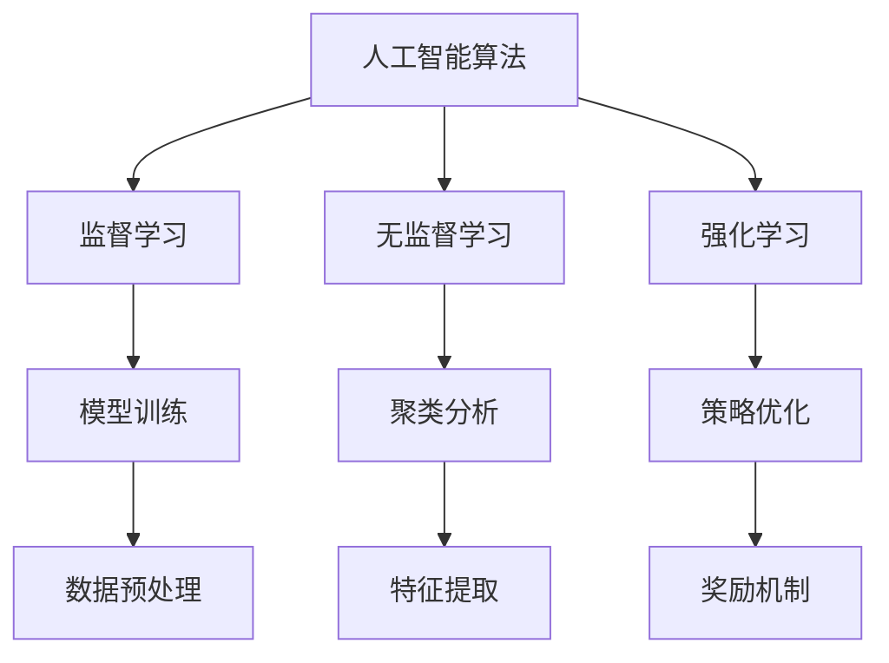

                 

关键词：认知发展、复杂性理论、人工智能、算法、数学模型、实践应用

## 摘要

在信息技术快速发展的今天，人工智能（AI）和复杂性理论成为了研究的热点。本文旨在探讨认知发展中浅薄与复杂的对立，分析人工智能在处理复杂任务中的表现，以及如何利用算法和数学模型来优化认知过程。通过阐述核心概念、算法原理、数学模型和实际应用，本文揭示了在认知发展中实现浅薄与复杂平衡的重要性。

## 1. 背景介绍

### 1.1 人工智能的发展

人工智能作为一门综合性学科，涉及计算机科学、数学、认知科学等多个领域。从最初的规则系统到现代的深度学习，AI经历了多次重大变革。如今，人工智能已经在图像识别、自然语言处理、自动驾驶等领域取得了显著成果。

### 1.2 复杂性理论的兴起

复杂性理论是研究复杂系统性质和演化规律的学科。随着计算机技术和网络技术的发展，复杂性理论逐渐成为研究热点。复杂性理论关注系统内部各种因素之间的相互作用，以及系统在演化过程中的自适应性和自组织性。

### 1.3 浅薄与复杂的对立

在认知发展中，浅薄与复杂是一种对立现象。浅薄通常指简单的、易理解的认知过程，而复杂则指涉及多层次、多因素的认知过程。浅薄认知往往易于实现，但难以处理复杂问题；复杂认知则能处理复杂问题，但难以理解和实现。

## 2. 核心概念与联系

### 2.1 人工智能算法

人工智能算法是解决特定问题的程序，包括监督学习、无监督学习和强化学习等。这些算法在不同场景下表现出不同的适应能力。

### 2.2 复杂性理论原理

复杂性理论关注系统在演化过程中的复杂性和规律性。核心概念包括熵、自组织、自适应等。

### 2.3 Mermaid 流程图



## 3. 核心算法原理 & 具体操作步骤

### 3.1 算法原理概述

人工智能算法的核心原理是基于数据驱动和学习机制，通过调整模型参数来优化性能。复杂性理论则关注系统内部的动态变化和相互作用。

### 3.2 算法步骤详解

#### 3.2.1 监督学习

1. 数据预处理
2. 特征提取
3. 模型训练
4. 模型评估

#### 3.2.2 无监督学习

1. 数据预处理
2. 特征提取
3. 模型训练
4. 聚类分析

#### 3.2.3 强化学习

1. 策略优化
2. 奖励机制
3. 模型训练
4. 策略评估

### 3.3 算法优缺点

#### 监督学习

- 优点：适用于有标签数据，能够准确预测未知数据。
- 缺点：对数据质量和数量要求较高，难以处理复杂问题。

#### 无监督学习

- 优点：无需标签数据，能够发现潜在模式和规律。
- 缺点：对噪声敏感，难以评估模型性能。

#### 强化学习

- 优点：能够处理动态环境，具备自适应能力。
- 缺点：训练过程复杂，对奖励机制设计要求较高。

### 3.4 算法应用领域

人工智能算法在图像识别、自然语言处理、推荐系统、自动驾驶等领域具有广泛的应用。

## 4. 数学模型和公式 & 详细讲解 & 举例说明

### 4.1 数学模型构建

#### 4.1.1 监督学习

假设给定一个训练数据集 \(\{x_1, y_1\}, \{x_2, y_2\}, ..., \{x_n, y_n\}\)，其中 \(x_i\) 表示输入特征，\(y_i\) 表示输出标签。

$$
y_i = f(x_i; \theta)
$$

其中，\(f\) 表示函数，\(\theta\) 表示模型参数。

#### 4.1.2 无监督学习

假设给定一个数据集 \(\{x_1, x_2, ..., x_n\}\)。

$$
x_i = g(x_{i-1}; \theta)
$$

其中，\(g\) 表示函数，\(\theta\) 表示模型参数。

#### 4.1.3 强化学习

假设给定一个环境 \(S\) 和一个策略 \(π\)。

$$
R = π(S)
$$

其中，\(R\) 表示奖励，\(π\) 表示策略。

### 4.2 公式推导过程

#### 4.2.1 监督学习

假设给定一个训练数据集 \(\{x_1, y_1\}, \{x_2, y_2\}, ..., \{x_n, y_n\}\)，其中 \(x_i\) 表示输入特征，\(y_i\) 表示输出标签。

$$
\begin{aligned}
L &= -\sum_{i=1}^n y_i \log(f(x_i; \theta)) \\
\frac{\partial L}{\partial \theta} &= 0
\end{aligned}
$$

通过求解上述方程组，可以得到最优的模型参数 \(\theta\)。

#### 4.2.2 无监督学习

假设给定一个数据集 \(\{x_1, x_2, ..., x_n\}\)。

$$
\begin{aligned}
L &= \sum_{i=1}^n \|x_i - g(x_{i-1}; \theta)\|^2 \\
\frac{\partial L}{\partial \theta} &= 0
\end{aligned}
$$

通过求解上述方程组，可以得到最优的模型参数 \(\theta\)。

#### 4.2.3 强化学习

假设给定一个环境 \(S\) 和一个策略 \(π\)。

$$
\begin{aligned}
L &= \sum_{t=1}^T R_t \\
R_t &= π(S_t) - Q(S_t, A_t)
\end{aligned}
$$

其中，\(Q(S_t, A_t)\) 表示状态-动作值函数。

通过优化上述公式，可以得到最优的策略 \(π\)。

### 4.3 案例分析与讲解

以图像识别为例，说明如何利用监督学习算法构建数学模型并进行训练。

#### 4.3.1 数据预处理

将图像数据转换为灰度图，并归一化处理。

$$
x_i = \frac{I_i - \mu}{\sigma}
$$

其中，\(I_i\) 表示图像像素值，\(\mu\) 和 \(\sigma\) 分别表示图像像素值的均值和标准差。

#### 4.3.2 特征提取

使用卷积神经网络（CNN）提取图像特征。

$$
h_i = f(x_i; \theta)
$$

其中，\(h_i\) 表示特征向量，\(f\) 表示卷积神经网络函数，\(\theta\) 表示模型参数。

#### 4.3.3 模型训练

使用梯度下降法优化模型参数。

$$
\theta = \theta - \alpha \nabla_{\theta} L
$$

其中，\(\alpha\) 表示学习率，\(\nabla_{\theta} L\) 表示损失函数关于模型参数的梯度。

#### 4.3.4 模型评估

使用交叉验证方法评估模型性能。

$$
\text{accuracy} = \frac{\text{正确分类的样本数}}{\text{总样本数}}
$$

## 5. 项目实践：代码实例和详细解释说明

### 5.1 开发环境搭建

- 安装 Python 3.8 及以上版本
- 安装 TensorFlow 2.x
- 安装 NumPy、Pandas 等常用库

### 5.2 源代码详细实现

以下是一个基于卷积神经网络进行图像识别的 Python 代码实例。

```python
import tensorflow as tf
from tensorflow.keras import layers

# 定义卷积神经网络模型
model = tf.keras.Sequential([
    layers.Conv2D(32, (3, 3), activation='relu', input_shape=(28, 28, 1)),
    layers.MaxPooling2D((2, 2)),
    layers.Conv2D(64, (3, 3), activation='relu'),
    layers.MaxPooling2D((2, 2)),
    layers.Conv2D(64, (3, 3), activation='relu'),
    layers.Flatten(),
    layers.Dense(64, activation='relu'),
    layers.Dense(10, activation='softmax')
])

# 编译模型
model.compile(optimizer='adam',
              loss='sparse_categorical_crossentropy',
              metrics=['accuracy'])

# 加载训练数据
(x_train, y_train), (x_test, y_test) = tf.keras.datasets.mnist.load_data()

# 数据预处理
x_train = x_train.reshape(-1, 28, 28, 1).astype('float32') / 255
x_test = x_test.reshape(-1, 28, 28, 1).astype('float32') / 255

# 训练模型
model.fit(x_train, y_train, epochs=5, batch_size=32)

# 评估模型
test_loss, test_acc = model.evaluate(x_test, y_test, verbose=2)
print('\nTest accuracy:', test_acc)
```

### 5.3 代码解读与分析

该代码实例使用 TensorFlow 框架构建了一个简单的卷积神经网络（CNN）模型，用于对 MNIST 数据集进行图像识别。主要步骤如下：

1. 定义 CNN 模型结构，包括卷积层、池化层和全连接层。
2. 编译模型，指定优化器和损失函数。
3. 加载并预处理训练数据和测试数据。
4. 训练模型，并保存训练过程中的损失和准确率。
5. 评估模型在测试集上的性能。

## 6. 实际应用场景

人工智能和复杂性理论在各个领域具有广泛的应用。

### 6.1 图像识别

卷积神经网络在图像识别领域取得了显著成果，如人脸识别、医学图像分析等。

### 6.2 自然语言处理

深度学习模型在自然语言处理领域表现出色，如机器翻译、情感分析等。

### 6.3 自动驾驶

自动驾驶技术利用人工智能和复杂性理论实现自主导航和决策。

### 6.4 未来应用展望

随着人工智能和复杂性理论的不断发展，未来将在更多领域得到应用，如智能医疗、金融分析、物联网等。

## 7. 工具和资源推荐

### 7.1 学习资源推荐

- 《深度学习》（Goodfellow et al.）
- 《人工智能：一种现代方法》（Doyle et al.）
- 《复杂性科学导论》（Bak et al.）

### 7.2 开发工具推荐

- TensorFlow
- PyTorch
- Keras

### 7.3 相关论文推荐

- "Deep Learning for Image Recognition"（2012）
- "A Theoretical Framework for Backpropagation"（1986）
- "The Blind Watchmaker"（1986）

## 8. 总结：未来发展趋势与挑战

### 8.1 研究成果总结

本文分析了人工智能和复杂性理论在认知发展中的应用，探讨了浅薄与复杂的关系。通过算法原理、数学模型和实际应用案例分析，揭示了人工智能在处理复杂任务中的潜力。

### 8.2 未来发展趋势

随着技术的不断进步，人工智能和复杂性理论将在更多领域取得突破。深度学习和强化学习等技术将继续发展，为复杂问题提供更加有效的解决方案。

### 8.3 面临的挑战

人工智能和复杂性理论在发展过程中面临许多挑战，如算法可解释性、数据隐私保护和计算资源消耗等。如何解决这些问题将成为未来研究的重要方向。

### 8.4 研究展望

人工智能和复杂性理论在认知发展中具有重要的应用价值。未来研究应关注如何实现浅薄与复杂之间的平衡，为复杂问题提供更加智能和高效的解决方案。

## 9. 附录：常见问题与解答

### 9.1 如何选择合适的算法？

选择合适的算法需要考虑问题的性质、数据特点和应用场景。通常，监督学习适用于有标签数据，无监督学习适用于无标签数据，强化学习适用于动态环境。

### 9.2 复杂性理论在计算机科学中的应用？

复杂性理论在算法分析、网络科学、分布式系统等领域具有广泛的应用。通过研究复杂性，可以揭示系统内部的规律性和演化趋势。

### 9.3 如何优化机器学习模型的性能？

优化机器学习模型的性能可以从以下几个方面入手：数据预处理、特征提取、模型选择、超参数调优等。此外，可以使用集成学习方法提高模型性能。

## 作者署名

作者：禅与计算机程序设计艺术 / Zen and the Art of Computer Programming
----------------------------------------------------------------

以上就是关于“认知发展中的浅薄与复杂”的文章。如果您需要进一步的修改或补充，请告诉我。

