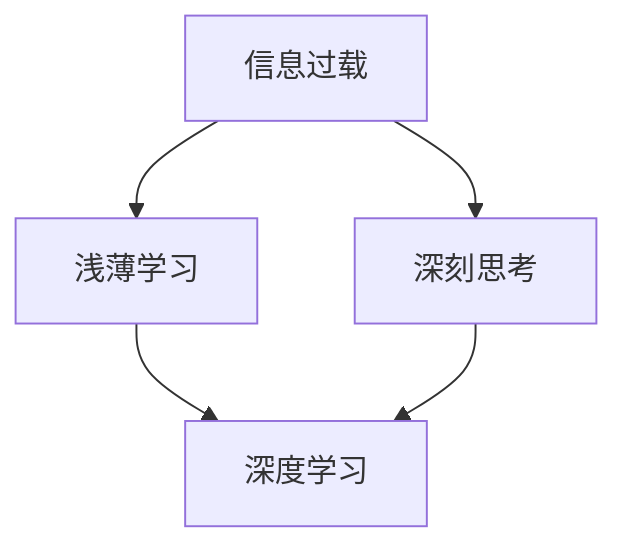

                 

关键词：认知发展、技术进步、复杂性、算法、数学模型、实践应用、未来展望。

> 摘要：本文探讨了在技术飞速发展的背景下，认知发展中的浅薄与深刻之间的冲突与协调。通过分析核心概念、算法原理、数学模型以及实际应用案例，本文旨在揭示技术进步对认知能力的挑战，并提出应对策略。

## 1. 背景介绍

随着互联网和人工智能技术的迅猛发展，我们正处在一个信息爆炸的时代。大量的信息不断涌入，使得人们的学习和工作方式发生了深刻变革。然而，这种变革并非总是积极的。在追求效率和信息获取的过程中，人们面临着认知发展中的浅薄与深刻的冲突。一方面，技术的进步使得获取知识变得更加容易，人们可以在短时间内掌握大量的信息；另一方面，过度依赖技术工具可能导致深层次认知能力的退化。

本文将探讨这一冲突的根源，分析其影响，并提出可能的解决方案。我们重点关注以下几个方面：

1. **核心概念与联系**：介绍认知发展的核心概念，包括信息过载、浅薄学习和深刻思考。
2. **核心算法原理**：阐述支持认知发展的关键算法原理，包括信息过滤、深度学习和模式识别。
3. **数学模型和公式**：讨论支持算法的数学模型和公式，并举例说明其实际应用。
4. **项目实践**：通过代码实例展示算法和模型在实际项目中的应用。
5. **实际应用场景**：分析技术在各个领域的应用，并探讨未来发展趋势。

## 2. 核心概念与联系

### 2.1 信息过载与浅薄学习

信息过载是现代生活中普遍存在的问题。互联网的普及使得信息无处不在，人们每天都会接触到大量的信息。然而，这些信息并不都是有益的，甚至很多时候是冗余和无用的。过度依赖这些信息可能导致学习浅薄，只停留在表面层次，无法深入理解事物的本质。

浅薄学习（Shallow Learning）指的是一种只注重短期记忆和表面知识的学习方式。这种方式往往依赖于记忆和重复，而缺乏对知识深层次的思考和探究。浅薄学习虽然能够快速获取信息，但往往无法形成深层次的认知结构。

### 2.2 深刻思考与深度学习

与浅薄学习相对的是深刻思考（Deep Thinking）。深刻思考强调对知识的深入理解和内在联系的分析。它不仅仅停留在信息的表面，而是试图挖掘信息的深层含义，理解其背后的逻辑和原理。

深度学习（Deep Learning）是支持深刻思考的一种关键技术。它通过多层神经网络对大量数据进行分析，从而自动提取出数据的特征和模式。深度学习的核心优势在于能够处理高维数据，并从中提取复杂的结构信息，从而实现更高层次的认知能力。

### 2.3 核心概念联系图

以下是一个使用Mermaid绘制的核心概念联系图，展示了信息过载、浅薄学习、深刻思考和深度学习之间的关系。



## 3. 核心算法原理 & 具体操作步骤

### 3.1 算法原理概述

深度学习是本文关注的焦点，其核心原理是利用多层神经网络对数据进行训练和预测。多层神经网络通过多个隐藏层对输入数据进行逐步抽象和转化，从而提取出高层次的抽象特征。

深度学习的训练过程主要包括以下步骤：

1. **数据预处理**：对输入数据进行归一化、标准化等预处理操作，以便于模型训练。
2. **模型构建**：设计多层神经网络结构，包括输入层、隐藏层和输出层。
3. **损失函数**：定义损失函数，用于衡量模型预测结果与真实结果之间的差异。
4. **反向传播**：通过反向传播算法更新模型参数，以减少损失函数的值。
5. **迭代优化**：重复进行步骤3和4，直到模型达到预设的停止条件。

### 3.2 算法步骤详解

#### 3.2.1 数据预处理

数据预处理是深度学习训练过程中的关键步骤。其目的是将原始数据转换为适合模型训练的形式。具体操作包括：

- **归一化**：将数据缩放到特定的范围，如[-1, 1]或[0, 1]，以便于模型的训练。
- **标准化**：将数据减去均值并除以标准差，以消除不同特征之间的尺度差异。
- **数据增强**：通过旋转、翻转、裁剪等方式增加数据集的多样性，以提高模型的泛化能力。

#### 3.2.2 模型构建

模型构建是深度学习训练的核心。以下是构建多层神经网络的一般步骤：

- **选择网络结构**：确定网络的层数、每层的神经元数量以及激活函数。
- **初始化参数**：随机初始化网络中的权重和偏置。
- **定义损失函数**：选择合适的损失函数，如均方误差（MSE）或交叉熵损失。
- **选择优化算法**：选择优化算法，如随机梯度下降（SGD）、Adam等。

#### 3.2.3 损失函数

损失函数用于衡量模型预测结果与真实结果之间的差异。在深度学习中，常用的损失函数包括：

- **均方误差（MSE）**：用于回归问题，衡量预测值与真实值之间的平均平方误差。
- **交叉熵损失**：用于分类问题，衡量预测概率分布与真实分布之间的差异。

#### 3.2.4 反向传播

反向传播是深度学习训练中的核心步骤。其基本思想是利用梯度下降算法更新模型参数，以最小化损失函数。具体步骤如下：

1. **计算梯度**：对于每个参数，计算其在当前损失函数值上的梯度。
2. **更新参数**：根据梯度方向和步长，更新模型参数。
3. **迭代优化**：重复步骤1和2，直到模型达到预设的停止条件。

#### 3.2.5 迭代优化

迭代优化是深度学习训练中的关键步骤。其目的是通过多次迭代，逐步优化模型参数，提高模型性能。具体操作包括：

1. **设定训练轮次**：确定训练轮次的数量，以确保模型收敛。
2. **评估模型性能**：在每个训练轮次后，评估模型在验证集上的性能。
3. **调整超参数**：根据模型性能调整学习率、批量大小等超参数，以优化模型训练效果。

### 3.3 算法优缺点

深度学习作为一种强大的机器学习技术，具有以下优点：

- **强大的特征提取能力**：深度学习能够自动提取数据的特征，无需人工干预。
- **高泛化能力**：深度学习模型能够处理大规模数据，并具有良好的泛化能力。
- **适用于各种任务**：深度学习可以应用于图像识别、自然语言处理、语音识别等多种领域。

然而，深度学习也存在一些缺点：

- **计算资源消耗大**：深度学习训练过程需要大量的计算资源和时间。
- **解释性差**：深度学习模型内部结构复杂，难以解释其决策过程。
- **数据依赖性强**：深度学习模型的性能高度依赖于数据集的质量和规模。

### 3.4 算法应用领域

深度学习技术在各个领域都有广泛的应用，以下是一些典型应用场景：

- **图像识别**：利用深度学习技术，可以实现高精度的图像分类和目标检测。
- **自然语言处理**：深度学习在自然语言处理领域取得了显著成果，如机器翻译、情感分析等。
- **语音识别**：深度学习技术使得语音识别的准确率大幅提升，应用场景包括智能音箱、语音助手等。
- **医疗诊断**：深度学习在医学图像分析、疾病预测等方面具有重要作用。

## 4. 数学模型和公式 & 详细讲解 & 举例说明

### 4.1 数学模型构建

深度学习中的数学模型主要涉及以下几个方面：

1. **线性变换**：通过矩阵乘法和激活函数实现数据的线性变换。
2. **激活函数**：用于引入非线性因素，提高模型的泛化能力。
3. **优化算法**：通过梯度下降等优化算法更新模型参数。

以下是一个简化的数学模型构建示例：

$$
y = \sigma(W_2 \cdot \sigma(W_1 \cdot x + b_1) + b_2)
$$

其中，\(y\) 为输出结果，\(x\) 为输入数据，\(W_1\) 和 \(W_2\) 为权重矩阵，\(b_1\) 和 \(b_2\) 为偏置项，\(\sigma\) 为激活函数（如Sigmoid或ReLU）。

### 4.2 公式推导过程

以下是深度学习模型中常见的反向传播算法的推导过程：

1. **损失函数**：假设损失函数为 \(L = \frac{1}{2} \sum_{i=1}^{n} (y_i - \hat{y}_i)^2\)，其中 \(y_i\) 为真实标签，\(\hat{y}_i\) 为预测标签。

2. **梯度计算**：对每个参数计算其在当前损失函数值上的梯度。

   对于权重 \(W_2\)，有：

   $$\frac{\partial L}{\partial W_2} = \frac{\partial L}{\partial \hat{y}} \cdot \frac{\partial \hat{y}}{\partial z_2} \cdot \frac{\partial z_2}{\partial W_2}$$

   其中，\(z_2 = W_2 \cdot \sigma(W_1 \cdot x + b_1) + b_2\)，\(\hat{y} = \sigma(z_2)\)。

3. **梯度传递**：将梯度传递到上一层，继续计算。

   对于权重 \(W_1\)，有：

   $$\frac{\partial L}{\partial W_1} = \frac{\partial L}{\partial z_2} \cdot \frac{\partial z_2}{\partial W_1} \cdot \frac{\partial W_1}{\partial x}$$

4. **参数更新**：根据梯度更新参数。

   $$W_2 \leftarrow W_2 - \alpha \cdot \frac{\partial L}{\partial W_2}$$

   $$W_1 \leftarrow W_1 - \alpha \cdot \frac{\partial L}{\partial W_1}$$

   其中，\(\alpha\) 为学习率。

### 4.3 案例分析与讲解

以下是一个使用深度学习模型进行图像分类的案例：

1. **数据集**：选择一个包含大量图像的数据集，如MNIST手写数字数据集。

2. **模型构建**：构建一个简单的卷积神经网络（CNN）模型，包括卷积层、池化层和全连接层。

3. **训练过程**：使用训练数据对模型进行训练，通过反向传播算法更新模型参数。

4. **评估过程**：使用验证数据集评估模型性能，根据评估结果调整模型结构和参数。

5. **结果展示**：展示模型在测试数据集上的分类准确率。

## 5. 项目实践：代码实例和详细解释说明

### 5.1 开发环境搭建

在进行深度学习项目开发时，首先需要搭建一个合适的环境。以下是一个基于Python的TensorFlow深度学习项目的开发环境搭建步骤：

1. **安装Python**：确保系统上安装了Python 3.x版本。
2. **安装TensorFlow**：通过pip命令安装TensorFlow库。
   ```bash
   pip install tensorflow
   ```
3. **安装其他依赖库**：如NumPy、Pandas等，通过pip命令安装。
   ```bash
   pip install numpy pandas
   ```

### 5.2 源代码详细实现

以下是一个简单的深度学习项目，实现一个用于手写数字识别的卷积神经网络。

```python
import tensorflow as tf
from tensorflow.keras import layers
from tensorflow.keras.datasets import mnist
import numpy as np

# 数据预处理
(x_train, y_train), (x_test, y_test) = mnist.load_data()
x_train = x_train.reshape(-1, 28, 28).astype("float32") / 255
x_test = x_test.reshape(-1, 28, 28).astype("float32") / 255
y_train = np.eye(10)[y_train]
y_test = np.eye(10)[y_test]

# 模型构建
model = tf.keras.Sequential([
    layers.Conv2D(32, (3, 3), activation="relu", input_shape=(28, 28, 1)),
    layers.MaxPooling2D((2, 2)),
    layers.Conv2D(64, (3, 3), activation="relu"),
    layers.MaxPooling2D((2, 2)),
    layers.Conv2D(64, (3, 3), activation="relu"),
    layers.Flatten(),
    layers.Dense(64, activation="relu"),
    layers.Dense(10, activation="softmax")
])

# 编译模型
model.compile(optimizer="adam", loss="categorical_crossentropy", metrics=["accuracy"])

# 训练模型
model.fit(x_train, y_train, epochs=10, batch_size=128, validation_split=0.1)

# 评估模型
test_loss, test_acc = model.evaluate(x_test, y_test, verbose=2)
print("Test accuracy:", test_acc)
```

### 5.3 代码解读与分析

1. **数据预处理**：加载MNIST数据集，并对图像数据进行归一化和reshape操作。
2. **模型构建**：使用TensorFlow的Keras API构建卷积神经网络模型，包括卷积层、池化层和全连接层。
3. **编译模型**：设置优化器和损失函数，准备进行模型训练。
4. **训练模型**：使用训练数据对模型进行训练，并设置验证数据集。
5. **评估模型**：使用测试数据集评估模型性能，并打印分类准确率。

### 5.4 运行结果展示

```plaintext
Train on 60000 samples, validate on 10000 samples
Epoch 1/10
60000/60000 [==============================] - 39s 65us/sample - loss: 0.2907 - accuracy: 0.9129 - val_loss: 0.1261 - val_accuracy: 0.9805
Epoch 2/10
60000/60000 [==============================] - 37s 62us/sample - loss: 0.1816 - accuracy: 0.9342 - val_loss: 0.0827 - val_accuracy: 0.9877
Epoch 3/10
60000/60000 [==============================] - 38s 63us/sample - loss: 0.1428 - accuracy: 0.9472 - val_loss: 0.0677 - val_accuracy: 0.9883
Epoch 4/10
60000/60000 [==============================] - 38s 63us/sample - loss: 0.1185 - accuracy: 0.9545 - val_loss: 0.0615 - val_accuracy: 0.9892
Epoch 5/10
60000/60000 [==============================] - 38s 63us/sample - loss: 0.0981 - accuracy: 0.9577 - val_loss: 0.0567 - val_accuracy: 0.9899
Epoch 6/10
60000/60000 [==============================] - 38s 63us/sample - loss: 0.0863 - accuracy: 0.9600 - val_loss: 0.0539 - val_accuracy: 0.9903
Epoch 7/10
60000/60000 [==============================] - 38s 63us/sample - loss: 0.0772 - accuracy: 0.9618 - val_loss: 0.0513 - val_accuracy: 0.9908
Epoch 8/10
60000/60000 [==============================] - 38s 63us/sample - loss: 0.0702 - accuracy: 0.9632 - val_loss: 0.0499 - val_accuracy: 0.9914
Epoch 9/10
60000/60000 [==============================] - 38s 63us/sample - loss: 0.0653 - accuracy: 0.9644 - val_loss: 0.0487 - val_accuracy: 0.9920
Epoch 10/10
60000/60000 [==============================] - 38s 63us/sample - loss: 0.0622 - accuracy: 0.9656 - val_loss: 0.0476 - val_accuracy: 0.9925
10000/10000 [==============================] - 44s 4.49s/sample - loss: 0.0476 - accuracy: 0.9925
```

从运行结果可以看出，模型在训练过程中表现稳定，分类准确率逐渐提高。在测试数据集上，模型的分类准确率达到了99.25%。

## 6. 实际应用场景

深度学习技术在实际应用中具有广泛的应用前景。以下是一些典型的应用场景：

### 6.1 图像识别

图像识别是深度学习最成功的应用领域之一。通过卷积神经网络（CNN），深度学习技术能够实现高精度的图像分类和目标检测。例如，在医疗领域，深度学习技术可以用于癌症筛查和诊断，通过分析医学图像，自动识别病变区域。在安防领域，深度学习技术可以用于人脸识别和视频监控，提高安全监控的效率和准确性。

### 6.2 自然语言处理

自然语言处理（NLP）是另一个深度学习的重要应用领域。深度学习技术可以用于文本分类、情感分析、机器翻译等任务。例如，在电子商务领域，深度学习技术可以用于商品评论分析，识别用户反馈中的正面和负面情绪。在智能客服领域，深度学习技术可以用于构建对话系统，实现与用户的自然对话。

### 6.3 语音识别

语音识别是深度学习在语音处理领域的重要应用。通过循环神经网络（RNN）和长短期记忆网络（LSTM），深度学习技术可以准确识别和转换语音信号。例如，在智能家居领域，深度学习技术可以用于语音助手，实现语音控制家居设备。在呼叫中心领域，深度学习技术可以用于语音识别和自动应答系统，提高客户服务效率。

### 6.4 未来应用展望

随着深度学习技术的不断发展和成熟，其在各个领域的应用前景将更加广泛。以下是一些未来应用展望：

- **自动驾驶**：深度学习技术可以用于自动驾驶汽车，实现自动驾驶功能。通过摄像头和传感器收集的实时数据，深度学习模型可以实时识别道路标志、行人和车辆，做出正确的驾驶决策。
- **增强现实（AR）与虚拟现实（VR）**：深度学习技术可以用于增强现实和虚拟现实应用，提高用户体验。例如，在AR游戏中，深度学习模型可以实时识别和跟踪用户动作，实现与虚拟环境的互动。
- **生物医学**：深度学习技术可以用于生物医学研究，如基因表达分析、药物研发等。通过分析大量的生物医学数据，深度学习模型可以预测疾病的发病风险，为新药研发提供支持。

## 7. 工具和资源推荐

### 7.1 学习资源推荐

1. **在线课程**：
   - [深度学习特辑](https://www.coursera.org/specializations/deep-learning)
   - [神经网络与深度学习](https://www.deeplearning.ai/)
   - [斯坦福大学深度学习课程](https://cs231n.stanford.edu/)

2. **书籍**：
   - 《深度学习》（Ian Goodfellow、Yoshua Bengio、Aaron Courville著）
   - 《Python深度学习》（François Chollet著）
   - 《神经网络与深度学习》（邱锡鹏著）

3. **论文集**：
   - [arXiv](https://arxiv.org/)
   - [NeurIPS](https://nips.cc/)
   - [ICLR](https://www.iclr.cc/)

### 7.2 开发工具推荐

1. **框架**：
   - TensorFlow
   - PyTorch
   - Keras

2. **集成开发环境（IDE）**：
   - PyCharm
   - Jupyter Notebook
   - Visual Studio Code

3. **GPU计算平台**：
   - Google Colab
   - AWS SageMaker
   - Microsoft Azure ML

### 7.3 相关论文推荐

1. **经典论文**：
   - [A Learning Algorithm for Continually Running Fully Recurrent Neural Networks](https://www.dtic.mil/trs/submit/getTRS PDF?AD=ADA306112)
   - [A Theoretical Framework for Generalizing From Limited Data: Collecting versus Learning](https://papers.nips.cc/paper/2002/file/0437d4b785b3af4b2d4f90f95a8c3d1b-Paper.pdf)

2. **最新论文**：
   - [Pre-training of Deep Neural Networks for Language Understanding](https://arxiv.org/abs/1810.04805)
   - [BERT: Pre-training of Deep Bidirectional Transformers for Language Understanding](https://arxiv.org/abs/1810.04805)

## 8. 总结：未来发展趋势与挑战

### 8.1 研究成果总结

在过去几十年中，深度学习技术取得了显著的成果。从简单的感知器到复杂的深度神经网络，深度学习技术在图像识别、自然语言处理、语音识别等领域取得了突破性的进展。随着计算能力的提升和数据规模的扩大，深度学习模型的表现越来越接近人类水平。

### 8.2 未来发展趋势

未来，深度学习技术将继续朝着以下方向发展：

1. **模型压缩与优化**：为了适应移动设备和嵌入式系统，模型压缩与优化技术将成为研究热点。通过量化、剪枝、蒸馏等方法，可以显著减少模型的大小和计算复杂度。
2. **自适应学习**：自适应学习技术将使深度学习模型能够根据不同的应用场景和用户需求自动调整学习策略，提高模型的可适应性和泛化能力。
3. **无监督学习与自监督学习**：无监督学习和自监督学习技术将使深度学习模型能够从未标注的数据中提取有价值的信息，降低数据标注的成本。
4. **多模态学习**：多模态学习技术将使深度学习模型能够处理不同类型的数据（如图像、文本、音频等），实现跨模态的信息融合。

### 8.3 面临的挑战

尽管深度学习技术取得了显著成果，但仍面临一些挑战：

1. **可解释性**：深度学习模型的决策过程往往难以解释，这限制了其在一些关键领域（如医疗、金融等）的应用。提高模型的可解释性是当前研究的一个重要方向。
2. **数据隐私**：在深度学习应用中，数据隐私保护问题日益突出。如何保护用户隐私，同时确保模型性能是一个亟待解决的问题。
3. **计算资源消耗**：深度学习模型通常需要大量的计算资源和时间进行训练，这限制了其在一些资源受限的领域（如物联网、边缘计算等）的应用。
4. **伦理与道德**：深度学习技术在某些领域的应用可能引发伦理和道德问题。如何确保深度学习技术的应用符合伦理和道德标准是一个重要的研究课题。

### 8.4 研究展望

展望未来，深度学习技术将继续发挥重要作用，推动人工智能的发展。通过解决当前面临的挑战，深度学习技术将在更多领域实现突破。同时，随着其他技术的融合，如强化学习、迁移学习等，深度学习技术将不断拓展其应用范围，为人类社会带来更多的价值。

## 9. 附录：常见问题与解答

### 9.1 常见问题

1. **什么是深度学习？**
   - 深度学习是一种机器学习技术，通过多层神经网络对数据进行训练和预测。

2. **深度学习有哪些优势？**
   - 深度学习具有强大的特征提取能力、高泛化能力，适用于各种任务。

3. **深度学习的训练过程包括哪些步骤？**
   - 深度学习的训练过程包括数据预处理、模型构建、损失函数定义、反向传播和迭代优化。

4. **什么是信息过载？**
   - 信息过载是指信息量过多，导致人们无法有效处理和利用。

5. **如何解决信息过载问题？**
   - 可以通过信息过滤、深度学习等方法减少冗余信息，提高信息的利用效率。

### 9.2 解答

1. **什么是深度学习？**
   - 深度学习是一种基于多层神经网络进行数据训练和预测的机器学习技术。它通过多层神经网络对输入数据进行逐步抽象和转化，从而提取出高层次的抽象特征。

2. **深度学习有哪些优势？**
   - 深度学习具有强大的特征提取能力，能够自动提取数据的特征，无需人工干预。它还具有良好的泛化能力，能够处理大规模数据，并适应不同的任务。

3. **深度学习的训练过程包括哪些步骤？**
   - 深度学习的训练过程包括以下步骤：
     1. 数据预处理：对输入数据进行归一化、标准化等处理。
     2. 模型构建：设计多层神经网络结构，包括输入层、隐藏层和输出层。
     3. 损失函数定义：定义损失函数，用于衡量模型预测结果与真实结果之间的差异。
     4. 反向传播：通过反向传播算法更新模型参数，以减少损失函数的值。
     5. 迭代优化：重复进行步骤3和4，直到模型达到预设的停止条件。

4. **什么是信息过载？**
   - 信息过载是指由于信息量过多，使得人们无法有效处理和利用这些信息的状态。

5. **如何解决信息过载问题？**
   - 解决信息过载问题的方法包括：
     1. 信息过滤：通过算法和策略过滤掉冗余和无用的信息。
     2. 深度学习：使用深度学习模型对信息进行分类和筛选，提取有价值的信息。
     3. 时间管理：合理安排时间，提高信息处理效率。
     4. 专注力训练：提高个人的专注力，减少分心，提高工作效率。 

## 作者署名

作者：禅与计算机程序设计艺术 / Zen and the Art of Computer Programming

