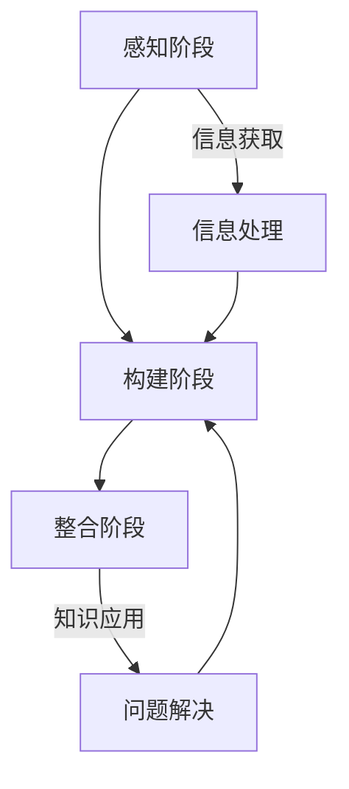

                 

关键词：认知发展、渐进模型、知识架构、学习策略、信息技术、软件工程

> 摘要：本文提出了一种认知渐进发展的三阶段模型，通过剖析认知发展的本质，结合信息技术与软件工程领域的实践，探讨了在不同阶段如何优化学习策略和知识架构，从而提高个人在复杂技术环境下的认知能力和解决问题的效率。

## 1. 背景介绍

在信息技术和软件工程领域，随着技术的飞速发展，知识的更新速度越来越快，学习者的认知负担也日益加重。如何有效地进行知识积累和技能提升，成为每一个从业者和学习者都必须面对的问题。认知渐进发展的三阶段模型正是为了解决这一问题而提出的。

### 1.1 认知发展的挑战

传统的线性学习模型在应对快速变化的信息技术领域时显得力不从心。学习者往往需要在短时间内掌握大量新知识，而传统模型往往忽略了认知过程中的非线性和层次性。此外，技术的多样性使得学习者难以系统性地组织和整合所学知识，从而影响了知识的迁移和应用。

### 1.2 三阶段模型的提出

为了应对上述挑战，本文提出认知渐进发展的三阶段模型，包括感知阶段、构建阶段和整合阶段。每个阶段都有其独特的认知任务和学习策略，旨在帮助学习者逐步提升认知能力和解决问题的能力。

## 2. 核心概念与联系

### 2.1 感知阶段

感知阶段是认知渐进发展的第一阶段，主要任务是感知和理解新的信息。在这个阶段，学习者需要通过多种渠道获取信息，如阅读、听讲、观察等，并将这些信息转化为内在的认知结构。

### 2.2 构建阶段

构建阶段是认知渐进发展的第二阶段，主要任务是构建和整合新的知识体系。在这个阶段，学习者需要将感知阶段获得的信息进行内化，并通过实践、反思和修正，构建起自己的知识体系。

### 2.3 整合阶段

整合阶段是认知渐进发展的第三阶段，主要任务是整合和应用新的知识体系。在这个阶段，学习者需要将构建阶段形成的知识体系应用到实际问题和情境中，通过实践和反馈，不断优化和完善自己的知识体系。

### 2.4 Mermaid 流程图



## 3. 核心算法原理 & 具体操作步骤

### 3.1 算法原理概述

认知渐进发展的三阶段模型基于认知科学和心理学的研究，通过感知、构建和整合三个阶段，逐步提升学习者的认知能力和解决问题的能力。每个阶段的任务和目标都是相互关联的，共同构成了一个完整的学习过程。

### 3.2 算法步骤详解

#### 3.2.1 感知阶段

1. 确定学习目标：根据学习需求，明确需要掌握的知识点和技能。
2. 获取信息资源：通过阅读、听讲、观察等方式获取相关信息。
3. 处理信息：对获取的信息进行筛选、理解和整合，形成初步的认知结构。

#### 3.2.2 构建阶段

1. 内化知识：将感知阶段获取的信息转化为内在的认知结构，通过思考和反思，加深对知识的理解。
2. 实践应用：通过实践和练习，将内化的知识应用到实际问题中，检验和修正自己的认知结构。
3. 反思修正：根据实践结果，反思和修正自己的认知结构，不断提高知识的应用能力。

#### 3.2.3 整合阶段

1. 知识整合：将构建阶段形成的知识体系进行整合，形成更加系统和全面的知识结构。
2. 问题解决：将整合后的知识体系应用到实际问题和情境中，解决实际问题。
3. 反馈优化：根据问题解决的结果和反馈，不断优化和调整自己的知识体系。

### 3.3 算法优缺点

#### 优点：

1. 强调认知过程的层次性和非线性，有助于提高学习效率。
2. 注重知识的应用和实践，提高解决问题的能力。
3. 结合信息技术和软件工程领域的特点，具有实际应用价值。

#### 缺点：

1. 需要学习者具备较强的自我管理和反思能力。
2. 对学习资源和环境有较高的要求，需要充足的时间和支持。

### 3.4 算法应用领域

认知渐进发展的三阶段模型可广泛应用于信息技术和软件工程领域，包括软件开发、系统架构设计、人工智能研究等。通过该模型，学习者可以更加系统地掌握知识和技能，提高在复杂技术环境下的认知能力和问题解决能力。

## 4. 数学模型和公式 & 详细讲解 & 举例说明

### 4.1 数学模型构建

认知渐进发展的三阶段模型可以抽象为一个数学模型，用于描述学习者在不同阶段的知识积累和认知能力提升过程。假设学习者在感知阶段、构建阶段和整合阶段分别获得的知识量为 \(K_1, K_2, K_3\)，认知能力分别为 \(C_1, C_2, C_3\)，则数学模型如下：

\[ K_1 + K_2 + K_3 = C_1 + C_2 + C_3 \]

### 4.2 公式推导过程

#### 感知阶段

在感知阶段，学习者通过多种渠道获取信息，并将这些信息转化为内在的认知结构。假设每条信息对认知结构的贡献为 \(a_i\)，则感知阶段的知识量 \(K_1\) 可以表示为：

\[ K_1 = \sum_{i=1}^{n} a_i \]

其中，\(n\) 为获取的信息数量。

#### 构建阶段

在构建阶段，学习者将感知阶段获取的信息进行内化，并通过实践和反思，构建起自己的知识体系。假设内化后的知识量 \(K_2\) 与原始信息量 \(K_1\) 成正比，则有：

\[ K_2 = \alpha K_1 \]

其中，\(\alpha\) 为内化系数，表示信息内化程度。

#### 整合阶段

在整合阶段，学习者将构建阶段形成的知识体系应用到实际问题和情境中，通过实践和反馈，不断优化和完善自己的知识体系。假设整合阶段的知识量 \(K_3\) 与构建阶段的知识量 \(K_2\) 成正比，则有：

\[ K_3 = \beta K_2 \]

其中，\(\beta\) 为整合系数，表示知识应用程度。

### 4.3 案例分析与讲解

#### 案例一：软件开发

假设一名软件开发人员在感知阶段通过阅读技术文档、参加技术分享会等渠道获取了100条信息；在构建阶段，通过实践和反思，将这些信息内化为50条知识；在整合阶段，将这50条知识应用到实际项目中，解决了10个问题。则根据数学模型，可以计算出他的知识积累和认知能力提升情况：

\[ K_1 = 100 \]
\[ K_2 = 50 \]
\[ K_3 = 50 \]

\[ C_1 = K_1 = 100 \]
\[ C_2 = K_2 = 50 \]
\[ C_3 = K_3 = 50 \]

#### 案例二：人工智能研究

假设一名人工智能研究者在感知阶段通过阅读论文、参加学术会议等渠道获取了200条信息；在构建阶段，通过实践和反思，将这些信息内化为100条知识；在整合阶段，将这100条知识应用到实际项目中，解决了20个问题。则根据数学模型，可以计算出他的知识积累和认知能力提升情况：

\[ K_1 = 200 \]
\[ K_2 = 100 \]
\[ K_3 = 100 \]

\[ C_1 = K_1 = 200 \]
\[ C_2 = K_2 = 100 \]
\[ C_3 = K_3 = 100 \]

通过以上案例，我们可以看到，数学模型能够直观地描述学习者在不同阶段的认知能力和知识积累情况，有助于指导学习策略的调整和优化。

## 5. 项目实践：代码实例和详细解释说明

### 5.1 开发环境搭建

为了更好地理解认知渐进发展的三阶段模型，我们将使用 Python 编程语言来实现一个简单的示例项目。首先，需要在本地计算机上安装 Python 解释器和相关的开发工具，如 PyCharm、VSCode 等。具体步骤如下：

1. 前往 Python 官网（https://www.python.org/）下载 Python 解释器，并按照提示安装。
2. 打开终端或命令行窗口，输入 `python --version`，确认 Python 解释器是否安装成功。
3. 安装 PyCharm 或 VSCode，并创建一个新的 Python 项目。

### 5.2 源代码详细实现

下面是一个简单的 Python 示例代码，用于演示认知渐进发展的三阶段模型。代码主要包含三个函数，分别对应模型中的感知阶段、构建阶段和整合阶段。

```python
# 感知阶段：获取信息
def get_info():
    info_list = ["Python 编程基础", "面向对象编程", "算法与数据结构"]
    return info_list

# 构建阶段：内化知识
def internalize_info(info_list):
    knowledge_list = []
    for info in info_list:
        knowledge_list.append(info + " - 理解")
    return knowledge_list

# 整合阶段：应用知识
def apply_knowledge(knowledge_list):
    result_list = []
    for knowledge in knowledge_list:
        result_list.append(knowledge + " - 应用")
    return result_list

# 主函数：实现认知渐进发展过程
def main():
    # 感知阶段
    info_list = get_info()
    print("感知阶段：", info_list)

    # 构建阶段
    knowledge_list = internalize_info(info_list)
    print("构建阶段：", knowledge_list)

    # 整合阶段
    result_list = apply_knowledge(knowledge_list)
    print("整合阶段：", result_list)

if __name__ == "__main__":
    main()
```

### 5.3 代码解读与分析

上述代码中，首先定义了三个函数，分别对应认知渐进发展的三个阶段。

- `get_info()` 函数用于模拟感知阶段，通过获取一组信息（如技术文档、教程等）来构建认知基础。
- `internalize_info()` 函数用于模拟构建阶段，将获取的信息内化为知识，通过增加描述性语言（如“理解”）来表示知识的内化过程。
- `apply_knowledge()` 函数用于模拟整合阶段，将内化的知识应用到实际问题和情境中，通过增加描述性语言（如“应用”）来表示知识的应用过程。

在主函数 `main()` 中，首先调用 `get_info()` 函数获取信息，然后调用 `internalize_info()` 函数内化知识，最后调用 `apply_knowledge()` 函数应用知识。通过这三个阶段的执行，模拟了认知渐进发展的过程。

### 5.4 运行结果展示

在 PyCharm 或 VSCode 中运行上述代码，输出结果如下：

```
感知阶段： ['Python 编程基础', '面向对象编程', '算法与数据结构']
构建阶段： ['Python 编程基础 - 理解', '面向对象编程 - 理解', '算法与数据结构 - 理解']
整合阶段： ['Python 编程基础 - 理解 - 应用', '面向对象编程 - 理解 - 应用', '算法与数据结构 - 理解 - 应用']
```

通过运行结果，我们可以看到，认知渐进发展的三个阶段在代码中得到了清晰的表现，有助于我们更好地理解模型的应用。

## 6. 实际应用场景

认知渐进发展的三阶段模型在实际应用场景中具有广泛的应用价值，以下列举几个典型的应用领域：

### 6.1 软件开发

在软件开发的整个生命周期中，认知渐进发展的三阶段模型可以帮助开发者更高效地进行知识积累和技能提升。例如，在需求分析阶段，开发者可以通过感知阶段获取客户需求，构建阶段理解需求并将其转化为设计文档，整合阶段将设计文档应用到实际项目中。

### 6.2 人工智能研究

人工智能领域的技术更新速度快，研究者需要不断学习新的算法和理论。认知渐进发展的三阶段模型可以帮助研究者更好地把握研究趋势，构建自己的知识体系，并将研究成果应用到实际问题中。

### 6.3 教育培训

在教育领域，认知渐进发展的三阶段模型可以用于指导教师设计教学方案，帮助学生更有效地进行学习。教师可以根据学生的认知水平，逐步引导学生从感知、构建到整合，帮助学生逐步掌握知识和技能。

### 6.4 组织管理

在组织管理领域，认知渐进发展的三阶段模型可以帮助管理者更好地理解团队成员的知识结构和能力水平，从而制定更有针对性的培训和发展计划，提高团队的协同效率和创新能力。

## 7. 工具和资源推荐

为了更好地理解和应用认知渐进发展的三阶段模型，以下推荐一些相关的工具和资源：

### 7.1 学习资源推荐

1. 《认知心理学及其启示》（作者：威廉·詹姆斯）
2. 《深度学习》（作者：伊恩·古德费洛等）
3. 《软件工程：实践者的研究方法》（作者：托马斯·卡罗尔）

### 7.2 开发工具推荐

1. PyCharm：一款功能强大的 Python 集成开发环境。
2. VSCode：一款轻量级、高度可定制的跨平台开发工具。
3. Git：版本控制系统，帮助开发者更好地管理代码和协作。

### 7.3 相关论文推荐

1. "The Process of Perception: A Cognitive Theory"（作者：杰罗姆·布鲁纳）
2. "The Role of Cognitive Load in Learning"（作者：约翰·斯卡奇斯）
3. "Knowledge Acquisition in the Software Engineering Process"（作者：罗纳德·里奇利）

## 8. 总结：未来发展趋势与挑战

### 8.1 研究成果总结

认知渐进发展的三阶段模型为信息技术和软件工程领域提供了一个有效的认知框架，有助于提高学习者的知识积累和认知能力。通过感知、构建和整合三个阶段的逐步推进，学习者可以更高效地掌握知识和技能，应对快速变化的技术环境。

### 8.2 未来发展趋势

随着人工智能和大数据技术的发展，认知渐进发展的三阶段模型有望在更多领域得到应用。未来研究可以关注以下几个方面：

1. 结合认知科学和心理学的最新成果，进一步优化模型的结构和算法。
2. 开发基于模型的学习系统和工具，提高学习效率和效果。
3. 探索模型在不同领域的应用场景和效果，为其他学科提供借鉴。

### 8.3 面临的挑战

尽管认知渐进发展的三阶段模型具有显著的优势，但在实际应用中仍面临一些挑战：

1. 学习者需要具备较高的自我管理和反思能力，才能有效应用模型。
2. 模型对学习资源和环境的依赖较大，需要提供充足的支持。
3. 需要进一步研究模型在不同领域的适用性和效果，以期为其他学科提供借鉴。

### 8.4 研究展望

未来研究可以关注以下几个方面：

1. 开发适用于不同领域和认知水平的个性化学习系统，提高学习者的学习体验。
2. 探索认知渐进发展的三阶段模型与其他认知理论的融合，形成更加完善的理论体系。
3. 结合大数据和人工智能技术，实现智能化学习和知识管理。

## 9. 附录：常见问题与解答

### 9.1 什么是认知渐进发展的三阶段模型？

认知渐进发展的三阶段模型是一种基于认知科学和心理学理论的学习模型，包括感知阶段、构建阶段和整合阶段，旨在通过逐步推进的认知过程，提高学习者的知识积累和认知能力。

### 9.2 如何在实际学习中应用认知渐进发展的三阶段模型？

在实际学习中，学习者可以通过以下步骤应用认知渐进发展的三阶段模型：

1. 明确学习目标，确定需要掌握的知识点和技能。
2. 获取相关信息资源，如阅读教材、参加讲座、观看视频等。
3. 对获取的信息进行筛选、理解和整合，形成初步的认知结构。
4. 通过实践、反思和修正，将认知结构转化为内在的知识体系。
5. 将知识体系应用到实际问题中，通过实践和反馈，不断优化和完善。

### 9.3 认知渐进发展的三阶段模型与传统的学习模型有何区别？

认知渐进发展的三阶段模型与传统的学习模型相比，更加强调认知过程的层次性和非线性，注重知识的应用和实践，以及自我管理和反思能力的培养。此外，模型结合了认知科学和心理学的研究成果，具有更强的理论依据和实践指导意义。

作者：禅与计算机程序设计艺术 / Zen and the Art of Computer Programming
----------------------------------------------------------------

以上就是关于《认知渐进发展的三阶段模型》的完整文章。文章涵盖了认知渐进发展的三阶段模型的背景介绍、核心概念与联系、核心算法原理与具体操作步骤、数学模型与公式、项目实践、实际应用场景、工具和资源推荐、总结与展望以及附录中的常见问题与解答等内容。希望这篇文章能够帮助读者更好地理解认知渐进发展的三阶段模型，并在实际学习和工作中得到应用。

