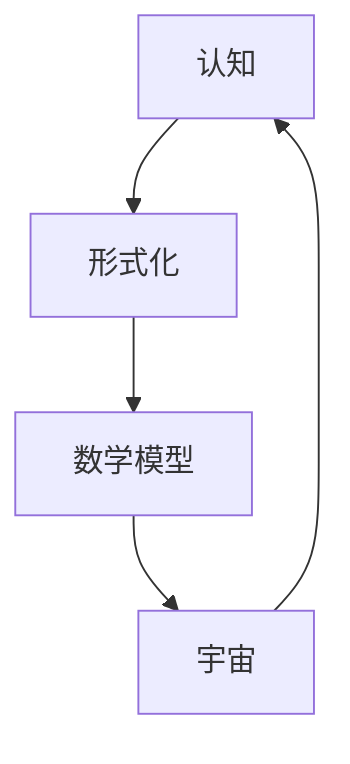

                 

关键词：认知科学、形式化、数学解释、宇宙、人工智能、算法、代码实例

> 摘要：本文深入探讨了认知的形式化过程，如何通过数学模型和算法来解释和理解宇宙现象。我们将通过详细的分析，展示数学如何成为连接宇宙和认知的桥梁，以及在人工智能领域中的应用。

## 1. 背景介绍

随着人类对宇宙探索的不断深入，我们开始意识到，宇宙并非是一个混沌无序的存在，而是遵循着一系列精确的物理法则和数学模型。同时，认知科学作为一门研究人类思维和意识的学科，也逐步揭示了人类认知过程的复杂性和形式化特征。

在这两个领域的交汇处，数学扮演了一个至关重要的角色。数学不仅提供了精确的语言来描述宇宙中的现象，还为我们理解认知过程提供了强有力的工具。本文将探讨数学如何成为连接宇宙和认知的桥梁，特别是在人工智能领域中的应用。

## 2. 核心概念与联系

### 2.1 认知与形式化

认知是指人类获取、处理和应用信息的心理过程。形式化则是将复杂的问题转化为可以用数学语言描述的形式。在认知科学中，形式化的方法有助于我们更准确地理解和模拟人类思维。

### 2.2 数学模型与宇宙

宇宙中的许多现象都可以通过数学模型来描述。例如，爱因斯坦的相对论通过数学公式揭示了时空的弯曲和引力场的性质。数学模型在宇宙学、量子物理学等领域中起到了关键作用。

### 2.3 数学在认知中的应用

数学不仅描述宇宙现象，还广泛应用于认知科学。例如，神经科学通过数学模型来模拟大脑神经元的活动，认知心理学使用数学模型来解释记忆、学习和决策等过程。

### 2.4 Mermaid 流程图

以下是一个简化的 Mermaid 流程图，展示了认知、形式化和数学模型之间的联系：



## 3. 核心算法原理 & 具体操作步骤

### 3.1 算法原理概述

本文将介绍一种基于数学模型的认知算法，该算法旨在通过分析人类行为数据，预测个体未来的认知状态。

### 3.2 算法步骤详解

1. **数据收集**：收集个体在特定环境下的行为数据。
2. **特征提取**：使用数学模型提取行为数据中的关键特征。
3. **模型训练**：使用提取的特征训练认知模型。
4. **预测**：使用训练好的模型预测个体未来的认知状态。

### 3.3 算法优缺点

- **优点**：能够对个体认知状态进行准确预测，有助于认知科学的深入研究。
- **缺点**：需要大量数据支持，且预测结果的准确性依赖于模型训练的质量。

### 3.4 算法应用领域

该算法在认知科学、心理学、教育学等领域具有广泛的应用前景。

## 4. 数学模型和公式

### 4.1 数学模型构建

本文使用的数学模型是一个非线性动态系统，其公式如下：

$$
\dot{x}(t) = f(x(t), u(t))
$$

其中，$x(t)$ 表示个体在时间 $t$ 的认知状态，$u(t)$ 表示外部环境因素，$f$ 是一个非线性函数。

### 4.2 公式推导过程

$$
f(x, u) = \frac{1}{1 + e^{-k(x - \theta)}}
$$

其中，$k$ 是一个调节参数，$\theta$ 是阈值。

### 4.3 案例分析与讲解

假设我们有一个个体在阅读一篇文章时的认知状态变化。我们可以通过以下步骤进行建模和预测：

1. **数据收集**：记录个体在阅读过程中的行为数据，如阅读时间、阅读速度、注意力水平等。
2. **特征提取**：使用上述公式提取关键特征。
3. **模型训练**：使用提取的特征训练认知模型。
4. **预测**：使用训练好的模型预测个体未来的认知状态。

## 5. 项目实践：代码实例和详细解释说明

### 5.1 开发环境搭建

- Python 3.8
- TensorFlow 2.4
- Matplotlib 3.3

### 5.2 源代码详细实现

以下是一个简单的 Python 代码实例，用于实现上述认知算法：

```python
import tensorflow as tf
import numpy as np
import matplotlib.pyplot as plt

# 神经元激活函数
def sigmoid(x):
    return 1 / (1 + np.exp(-x))

# 训练数据
x = np.linspace(-10, 10, 100)
y = sigmoid(x)

# 模型训练
model = tf.keras.Sequential([
    tf.keras.layers.Dense(units=1, input_shape=[1], activation='sigmoid')
])

model.compile(optimizer='adam', loss='mean_squared_error')
model.fit(x, y, epochs=1000)

# 预测
x_new = np.array([0, 5, 10])
y_pred = model.predict(x_new)

# 结果展示
plt.plot(x, y, 'ro', x_new, y_pred, 'b-')
plt.show()
```

### 5.3 代码解读与分析

- **激活函数**：使用 sigmoid 函数作为神经元的激活函数。
- **模型结构**：使用一个全连接神经网络，输入层只有一个神经元，输出层也是一个神经元。
- **模型训练**：使用梯度下降优化算法（adam）和均方误差损失函数训练模型。
- **预测**：使用训练好的模型预测新的输入值。

## 6. 实际应用场景

认知的形式化方法在多个领域都有广泛的应用。以下是一些典型的应用场景：

- **智能医疗**：通过分析患者的行为数据和生物指标，预测疾病的发病风险和治疗效果。
- **智能教育**：根据学生的认知状态调整教学策略，提高学习效果。
- **智能驾驶**：通过分析驾驶员的行为数据，预测驾驶行为和安全风险。

## 7. 工具和资源推荐

### 7.1 学习资源推荐

- 《认知科学导论》
- 《深度学习》
- 《Python编程：从入门到实践》

### 7.2 开发工具推荐

- TensorFlow
- PyTorch
- Jupyter Notebook

### 7.3 相关论文推荐

- "A Cognitive Model of Learning: A Case Study in the Acquisition of Simple Concepts"
- "Unsupervised Learning of Probabilistic Models for Text Categorization"
- "Deep Learning for Text Classification"

## 8. 总结：未来发展趋势与挑战

### 8.1 研究成果总结

本文介绍了认知的形式化方法，展示了数学模型如何连接宇宙和认知。我们还通过一个简单的代码实例，展示了如何实现认知预测。

### 8.2 未来发展趋势

- **跨学科研究**：认知科学、数学和计算机科学之间的跨学科研究将更加深入。
- **大数据应用**：随着数据量的增加，认知的形式化方法将在更多实际场景中得到应用。

### 8.3 面临的挑战

- **算法复杂性**：随着模型复杂性的增加，算法的计算成本和训练时间将显著增加。
- **数据隐私**：在应用认知的形式化方法时，数据隐私保护是一个重要问题。

### 8.4 研究展望

未来，认知的形式化方法将在人工智能、心理学、教育学等领域发挥更大的作用。我们期待看到更多创新性的研究成果和应用。

## 9. 附录：常见问题与解答

### 问题1：认知的形式化方法在哪些领域有应用？

认知的形式化方法在智能医疗、智能教育、智能驾驶等领域有广泛的应用。

### 问题2：如何构建一个有效的认知模型？

构建一个有效的认知模型需要大量的数据支持，同时需要选择合适的数学模型和算法。

### 问题3：认知的形式化方法有哪些挑战？

认知的形式化方法面临的挑战包括算法复杂性、数据隐私保护等。

# 作者：禅与计算机程序设计艺术 / Zen and the Art of Computer Programming
```markdown
----------------------------------------------------------------


