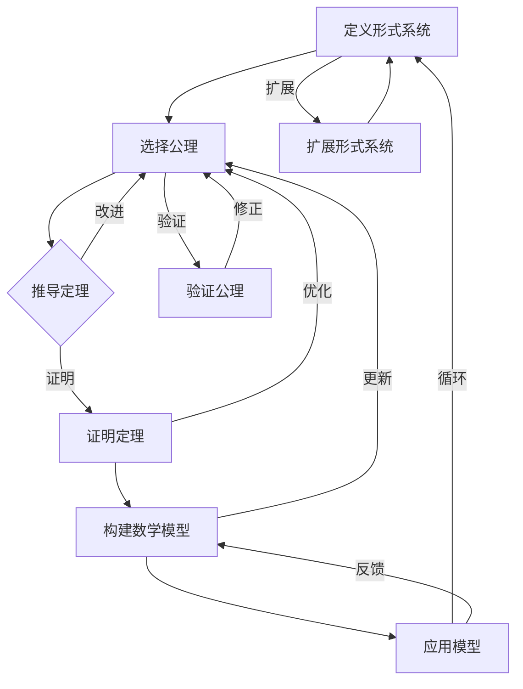

                 

关键词：认知的形式化，数学公设定理，高级语言形态，形式逻辑，计算机科学，人工智能。

## 摘要

本文旨在探讨认知的形式化过程，特别关注数学作为建立明确公设定理体系的高级语言形态在计算机科学中的应用。通过对形式逻辑的深入分析，本文揭示了数学在认知形式化中的重要地位，探讨了其核心概念与联系，并详细解析了核心算法原理和具体操作步骤。此外，文章还结合了数学模型和公式，通过案例分析和项目实践，展示了数学在计算机科学和人工智能领域的广泛应用。最后，本文总结了未来发展趋势与挑战，为读者提供了丰富的学习资源和开发工具推荐。

## 1. 背景介绍

随着计算机科学的快速发展，人工智能（AI）已经成为一个热门话题。然而，人工智能的基础是认知，而认知的核心在于对信息的处理和理解。认知的形式化是使计算机能够模拟人类思维过程的关键。在这个过程中，数学作为一种高度抽象的语言，发挥了至关重要的作用。

数学具有严密的公设定理体系，这使得它在形式化过程中具有独特的优势。公设定理体系通过逻辑推理和证明，确保了数学理论的正确性和一致性。这种特点使得数学不仅适用于自然科学领域，还能够广泛应用于计算机科学和人工智能。

在计算机科学中，数学的应用体现在算法设计、数据结构、编程语言等方面。例如，算法的复杂度分析、图论、线性代数等数学理论，为计算机科学家提供了有效的工具和方法，以解决复杂问题。此外，人工智能领域中的机器学习、神经网络等模型，也是建立在数学基础上的。

本文将围绕认知的形式化过程，深入探讨数学在计算机科学中的应用。通过分析数学公设定理体系的构建过程，以及数学在算法、模型和编程中的应用，本文旨在揭示数学在认知形式化中的重要地位。

### 数学与认知形式化的联系

数学与认知形式化的联系可以从多个角度进行探讨。首先，数学作为一种形式化的语言，为认知形式化提供了有力的工具。形式化的语言能够精确地描述概念和关系，从而提高认知的准确性和一致性。

在认知形式化的过程中，数学的公设定理体系起到了关键作用。公设定理体系通过定义和证明，建立了数学理论的基本框架。这种框架不仅有助于我们理解数学的基本原理，还能够为我们提供解决问题的方法。

例如，在认知科学中，许多概念和理论都是通过数学模型进行描述和验证的。例如，神经网络模型中的权重和激活函数，可以通过数学公式进行计算和调整。通过这种方式，数学不仅帮助我们理解神经网络的运作机制，还能够提高其性能和准确性。

此外，数学在认知形式化中还扮演着一种桥梁的角色。它连接了抽象的思维过程和具体的计算机实现。通过数学，我们可以将抽象的思维方式转化为具体的算法和程序。这种转化不仅使计算机能够更好地模拟人类思维，还能够提高计算机解决问题的效率。

例如，在计算机科学中，许多算法都是通过数学模型进行设计和分析的。通过对数学模型的深入分析，我们可以发现算法的优缺点，并提出改进方案。这种基于数学的方法，不仅提高了算法的性能，还能够帮助我们更好地理解算法的本质。

总之，数学与认知形式化的联系体现在多个方面。它不仅为认知形式化提供了有力的工具和方法，还能够连接抽象的思维过程和具体的计算机实现。通过深入探讨数学在认知形式化中的应用，我们可以更好地理解数学在计算机科学中的重要性。

### 数学在计算机科学中的应用

数学在计算机科学中的应用广泛而深远，从基础理论到实际应用，无不渗透着数学的光辉。下面，我们将探讨数学在计算机科学中的几个关键领域，包括算法设计、数据结构和编程语言等。

**算法设计**

算法是计算机科学的核心，而数学是算法设计的基石。在算法设计中，数学提供了许多强大的工具和方法，如排序算法、搜索算法、图论算法等。例如，排序算法中的快速排序和归并排序，都是基于数学理论的优化结果。快速排序通过分治策略，将问题分解为子问题，然后递归解决。而归并排序则通过合并有序子序列，构建出全局有序序列。这些算法的优化和改进，离不开数学的支持。

在图论中，数学的应用更是无处不在。图论中的算法，如最短路径算法、最小生成树算法等，都是基于数学理论的。例如，迪杰斯特拉算法（Dijkstra's algorithm）用于计算图中两点之间的最短路径，而普里姆算法（Prim's algorithm）和克鲁斯卡尔算法（Kruskal's algorithm）则用于构建图的最小生成树。这些算法不仅能够解决复杂的问题，还能够为其他领域提供理论基础。

**数据结构**

数据结构是计算机科学中另一个重要的领域，而数学在数据结构的设计和优化中发挥着重要作用。例如，栈和队列等基本数据结构，都是基于数学原理构建的。栈遵循后进先出（LIFO）的原则，而队列则遵循先进先出（FIFO）的原则。这些基本数据结构能够高效地管理数据，为算法提供坚实的基础。

更复杂的数据结构，如树、图、哈希表等，也都是基于数学理论构建的。树结构中的二叉树、平衡二叉树（如AVL树）、B树等，都是通过数学优化得到的。图结构中的邻接矩阵和邻接表，也是基于数学原理设计的。哈希表通过哈希函数将数据映射到不同的位置，从而实现快速的查找和插入操作。

**编程语言**

编程语言是计算机科学的另一个重要领域，而数学在编程语言的设计和实现中同样发挥着重要作用。现代编程语言，如C++、Java、Python等，都是基于数学原理构建的。这些编程语言中的数据类型、运算符、控制结构等，都是基于数学理论设计的。

例如，C++中的指针和引用，都是基于数学中的概念构建的。指针通过内存地址管理，实现了对数据的间接访问。引用则通过符号链接，实现了对数据的引用计数。这些机制不仅提高了程序的效率，还能够提供更高的安全性。

在编程语言中，算法和数据结构的设计和实现同样离不开数学的支持。例如，排序算法和搜索算法的实现，都需要运用数学中的逻辑和计算理论。这些理论不仅能够提高算法的性能，还能够确保算法的正确性和一致性。

总之，数学在计算机科学中的应用是广泛而深远的。它不仅为算法设计、数据结构和编程语言提供了理论基础，还能够为实际应用提供有效的解决方案。通过深入探讨数学在计算机科学中的应用，我们可以更好地理解计算机科学的基本原理和未来发展。

### 数学公设定理体系的构建

数学公设定理体系的构建是数学发展的重要里程碑，它不仅奠定了数学理论的基石，还为其他科学领域提供了重要的参考。数学公设定理体系的构建过程可以分为以下几个关键步骤：

**定义公理和公理系统**

公理是数学理论的基础，它是一种自明的、无需证明的命题。公理的选择至关重要，因为它们将决定整个理论体系的发展方向。例如，欧几里得几何的公理系统包括了几条关于点、线和平面的基本假设，这些公理构成了欧几里得几何的基本框架。

构建公设定理体系的第一步是选择合适的公理。这些公理应当具有自明性，即对于数学家来说是不言而喻的。同时，这些公理还需要具备一定的普适性，以便能够推导出大量的数学结论。

**推导定理和命题**

一旦公理系统确定，下一步就是通过逻辑推理和证明来推导出更多的定理和命题。这些定理和命题是基于公理通过逻辑演绎得到的，它们构成了数学理论的主体。

例如，在欧几里得几何中，通过公理系统可以推导出诸如“两点之间线段最短”等基本定理。在数论中，通过公理系统可以推导出诸如“素数分布定理”等重要的命题。

**证明和验证**

证明是数学公设定理体系构建过程中的关键步骤。一个定理要想被广泛接受，必须经过严格的证明。证明的过程不仅要求逻辑的严密性，还需要具备一定的创造性。

数学家们通过构造各种证明方法，如直接证明、反证法、归纳法等，来验证定理的正确性。这些证明方法不仅能够确保定理的准确性，还能够揭示数学理论之间的深层次联系。

**构建公设定理体系**

通过定义公理、推导定理和证明定理，数学家们逐步构建起了完整的公设定理体系。这个体系不仅包含了基本的理论框架，还包括了大量的定理和命题，为后续的数学研究提供了坚实的基础。

例如，在数论中，公设定理体系不仅包括了基本的整除关系、素数分布等定理，还涵盖了更复杂的领域，如代数数论、数论函数等。在几何学中，公设定理体系不仅包括了平面几何和立体几何的基本定理，还包括了更复杂的几何学领域，如拓扑学、微积分几何等。

总之，数学公设定理体系的构建是一个复杂而精细的过程，它不仅需要数学家的智慧和创新，还需要长期的积累和努力。通过这个过程，数学家们不仅能够揭示数学理论之间的联系，还能够为其他科学领域提供重要的参考和启示。

### 核心概念与联系

在认知的形式化过程中，数学的公设定理体系扮演着至关重要的角色。理解数学中的核心概念及其相互联系，对于深入掌握认知的形式化至关重要。以下是几个关键的核心概念及其联系：

**概念 1：形式系统**

形式系统是数学中最基础的概念之一。它由一组符号、定义和推导规则组成，用于表达和推理数学命题。形式系统通常包括符号集合、语法规则和语义规则。符号集合定义了可以使用的符号，语法规则规定了这些符号如何组合成有效的表达式，而语义规则则定义了这些表达式的意义。

形式系统的核心在于其逻辑推理能力。通过语法规则，我们可以将符号组合成复杂的表达式；通过语义规则，我们可以判断这些表达式的真假。这种逻辑推理能力使得形式系统能够在数学证明中发挥重要作用。

**概念 2：公理和定理**

公理是形式系统中的基础假设，它们被认为是自明的，不需要证明。定理则是基于公理通过逻辑推导得到的结论。公理和定理构成了数学理论的基本框架，是数学证明的核心。

公理的选择至关重要，因为它们将决定整个理论体系的发展方向。定理的推导则依赖于逻辑推理和证明方法，如直接证明、反证法、归纳法等。通过公理和定理，数学家们能够建立复杂的数学理论，并用于解决各种问题。

**概念 3：证明**

证明是数学中的关键环节，它是验证定理正确性的过程。一个定理要想被广泛接受，必须经过严格的证明。证明的过程不仅要求逻辑的严密性，还需要具备一定的创造性。

数学家们通过构造各种证明方法，如直接证明、反证法、归纳法等，来验证定理的正确性。这些证明方法不仅能够确保定理的准确性，还能够揭示数学理论之间的深层次联系。

**概念 4：数学模型**

数学模型是数学理论在实际应用中的重要工具。它通过将现实问题抽象成数学形式，提供了对问题的定量分析和解决方案。数学模型通常包括变量、方程和约束条件，通过这些模型，我们可以对复杂问题进行数学描述和求解。

数学模型的应用领域非常广泛，包括物理学、经济学、生物学等。在计算机科学中，数学模型同样发挥着重要作用，如神经网络模型、图模型等，都是基于数学理论构建的。

**概念联系**

这些核心概念之间的联系构成了数学理论的基石。形式系统提供了表达和推理数学命题的工具，公理和定理构成了理论的基本框架，而证明则确保了定理的正确性。数学模型则将理论应用于实际问题，提供了定量分析和解决方案。

例如，在认知的形式化过程中，我们可以使用形式系统来表达认知过程中的符号和关系，通过公理和定理来推导出认知的基本原理，并通过证明来验证这些原理的正确性。最终，我们可以将这些原理应用于实际问题，构建出认知模型，用于模拟和优化认知过程。

总之，通过深入理解这些核心概念及其联系，我们可以更好地掌握认知的形式化过程，为计算机科学和人工智能的发展提供坚实的理论基础。

### Mermaid 流程图

为了更好地展示数学在认知形式化过程中的核心概念与联系，我们使用Mermaid流程图来直观地呈现这些概念之间的关系。以下是一个简化的Mermaid流程图示例，描述了数学形式化过程中的几个关键步骤和它们之间的联系。



在这个流程图中，我们从定义形式系统开始，通过选择公理和推导定理，构建数学模型，并应用模型来解决问题。在每一步中，我们都需要进行验证和修正，以确保理论的正确性和有效性。这个循环过程使得数学理论不断发展和完善。

### 3.1 算法原理概述

在认知的形式化过程中，算法原理起到了至关重要的作用。算法是一系列定义明确的步骤，用于解决特定问题。在数学中，算法原理通过逻辑推理和证明，为认知的形式化提供了坚实的基础。

算法原理的基本概念包括：

**输入（Input）**：算法开始时需要接收的数据或信息。

**输出（Output）**：算法执行完成后需要输出的结果或信息。

**步骤（Steps）**：算法中的每一个操作步骤，包括数据操作和逻辑判断。

**条件（Conditions）**：算法中的条件判断，用于决定下一步的操作。

**循环（Loops）**：用于重复执行某些操作，直到满足特定条件。

算法原理的核心是逻辑推理和证明。逻辑推理通过一系列的前提条件和推导规则，从已知事实推导出新的结论。证明则是逻辑推理的进一步发展，通过严格的逻辑步骤，确保结论的正确性和一致性。

在数学中，算法原理广泛应用于各种领域，如计算几何、数值分析、图论等。例如，在计算几何中，算法原理用于求解多边形面积、最短路径等问题；在数值分析中，算法原理用于求解方程、优化问题等；在图论中，算法原理用于求解最小生成树、最短路径等问题。

算法原理的重要性体现在以下几个方面：

1. **解决问题的效率**：算法原理通过高效的计算方法和步骤，提高了问题解决的效率。

2. **理论验证**：通过算法原理的证明，可以验证数学理论的正确性和有效性。

3. **实际应用**：算法原理不仅在数学理论中发挥作用，还在实际应用中具有广泛的应用，如人工智能、机器学习、计算机图形学等。

总之，算法原理是认知形式化的核心，它通过逻辑推理和证明，为数学理论提供了坚实的基础，并在实际应用中发挥了重要作用。

### 3.2 算法步骤详解

在深入了解算法原理的基础上，我们将进一步详细解析算法的具体操作步骤，以便更好地理解其执行过程和逻辑结构。以下是一个简单的示例算法：二分查找算法，用于在一个有序数组中查找特定元素的位置。

#### 步骤 1：初始化

- **输入**：一个有序数组 `arr` 和目标元素 `target`。
- **输出**：目标元素在数组中的索引，或未找到时的信息。

#### 步骤 2：确定边界

- **操作**：初始化两个边界变量 `low` 和 `high`，分别表示搜索区间的起始和结束位置。
- **代码实现**：
  ```python
  low = 0
  high = len(arr) - 1
  ```

#### 步骤 3：循环搜索

- **操作**：进入循环，当 `low` 小于 `high` 时，继续搜索。
- **条件**：每次循环需要更新边界，以便缩小搜索范围。
- **代码实现**：
  ```python
  while low < high:
      ```

#### 步骤 4：计算中间值

- **操作**：计算当前搜索区间的中间值 `mid`。
- **代码实现**：
  ```python
  mid = (low + high) // 2
  ```

#### 步骤 5：比较与调整边界

- **操作**：比较目标元素 `target` 与中间值 `arr[mid]` 的大小。
- **情况**：
  - 如果 `target` 等于 `arr[mid]`，则找到目标元素，返回 `mid`。
  - 如果 `target` 小于 `arr[mid]`，则将 `high` 更新为 `mid - 1`，继续在左侧区间搜索。
  - 如果 `target` 大于 `arr[mid]`，则将 `low` 更新为 `mid + 1`，继续在右侧区间搜索。
- **代码实现**：
  ```python
  if target == arr[mid]:
      return mid
  elif target < arr[mid]:
      high = mid - 1
  else:
      low = mid + 1
  ```

#### 步骤 6：结束搜索

- **操作**：当 `low` 等于 `high` 时，结束搜索。
- **情况**：
  - 如果未找到目标元素，返回 `-1` 或其他指示未找到的信息。
  - 如果找到目标元素，返回其索引。

- **代码实现**：
  ```python
  return -1
  ```

#### 完整代码实现

以下是二分查找算法的完整代码实现：

```python
def binary_search(arr, target):
    low = 0
    high = len(arr) - 1
    
    while low < high:
        mid = (low + high) // 2
        if target == arr[mid]:
            return mid
        elif target < arr[mid]:
            high = mid - 1
        else:
            low = mid + 1
            
    return -1
```

通过以上步骤的详细解析，我们可以清楚地看到二分查找算法的执行过程和逻辑结构。这个过程不仅展示了算法的具体操作步骤，还通过代码实现了对算法逻辑的清晰表达。

### 3.3 算法优缺点

在深入解析了二分查找算法的具体操作步骤后，我们接下来分析该算法的优缺点。了解算法的优点和缺点有助于我们在实际应用中做出更明智的选择。

**优点**

1. **时间复杂度低**：二分查找算法的时间复杂度为 \(O(\log n)\)，相比于线性查找的 \(O(n)\)，其效率显著提高。尤其在大规模数据集上，这种效率优势更加明显。

2. **适用于有序数据**：二分查找算法要求数据是有序的，这对于许多实际问题中的数据处理非常有用。例如，在数据库索引和排序算法中，二分查找经常被采用。

3. **可扩展性**：二分查找算法的原理简单，易于实现和扩展。我们可以通过修改算法的细节，使其适用于不同类型的数据结构，如平衡二叉树等。

**缺点**

1. **空间复杂度高**：虽然二分查找算法的时间复杂度较低，但其空间复杂度也为 \(O(\log n)\)，这意味着需要额外的存储空间来维护栈或队列等数据结构。在内存受限的环境中，这可能会成为一个问题。

2. **对数据有序性的要求**：二分查找算法要求数据必须是有序的，如果数据未排序，则需要先进行排序，这增加了额外的计算成本。

3. **不易并行化**：由于二分查找算法依赖于单一线性搜索过程，其并行化程度较低。在多核处理器环境中，无法充分利用硬件资源。

**改进建议**

1. **平衡二分搜索树**：对于经常进行查找操作的应用，可以考虑使用平衡二分搜索树（如AVL树、红黑树等）来优化性能。这些树结构在保持数据有序的同时，还能保持平衡，从而降低查找时间。

2. **混合使用**：在数据量较小的情况下，可以使用线性查找代替二分查找，以简化实现和降低空间复杂度。

3. **并行化**：通过将二分查找算法分解为多个子任务，可以在多核处理器环境中实现并行化。例如，将数组划分为多个部分，分别进行并行查找。

总之，二分查找算法在有序数据集上具有高效的查找性能，但同时也存在一些缺点。根据具体应用场景，我们可以采用不同的改进方法来优化算法的性能。

### 3.4 算法应用领域

二分查找算法作为一种高效的查找算法，广泛应用于各种计算机科学和人工智能领域。以下是二分查找算法在不同领域的主要应用：

**数据库索引**

在数据库系统中，二分查找算法是构建索引的重要工具。通过在数据库表中建立索引，可以显著提高查询速度。特别是对于大规模数据库，二分查找算法的 \(O(\log n)\) 时间复杂度使其成为高效的数据检索方法。例如，在MySQL和PostgreSQL等关系型数据库中，索引结构通常基于B树和B+树，这些树结构内部采用了二分查找算法。

**排序算法**

二分查找算法在排序算法中也具有重要应用。在许多排序算法中，如快速排序和归并排序，二分查找算法用于划分数据序列。例如，快速排序通过选择中间元素作为基准，将数据划分为左右两个子序列，然后递归地对子序列进行排序。归并排序则通过二分查找算法，将有序子序列合并成全局有序序列。

**机器学习**

在机器学习领域，二分查找算法也被广泛应用。特别是在某些算法中，如K最近邻（K-Nearest Neighbors, KNN）算法，二分查找算法用于高效地搜索最近的邻居点。KNN算法通过计算测试点与训练样本之间的距离，找到最近的K个邻居，并根据这些邻居的标签预测测试点的类别。二分查找算法在此过程中用于快速定位最近的邻居点，从而提高算法的效率。

**图像处理**

在图像处理领域，二分查找算法用于图像检索和匹配。例如，在基于内容的图像检索（Content-Based Image Retrieval, CBIR）系统中，二分查找算法用于搜索和匹配图像特征。通过将图像特征表示为向量，并使用二分查找算法来找到与给定查询图像特征最相似的图像，从而实现图像检索功能。

**网络算法**

在网络算法中，二分查找算法也具有重要应用。例如，在分布式系统中，二分查找算法用于查找和路由。在DHT（Distributed Hash Table）系统中，节点通过二分查找算法来查找和更新数据位置，从而实现高效的数据存储和检索。此外，在多播和广播算法中，二分查找算法用于查找和转发数据包，从而提高网络传输效率。

总之，二分查找算法在计算机科学和人工智能领域具有广泛的应用。通过其高效的时间复杂度和简单的实现原理，二分查找算法在各种实际应用中发挥着重要作用。

### 4.1 数学模型构建

数学模型构建是认知形式化过程中不可或缺的一环，它通过对现实问题的抽象和量化，提供了对问题的数学描述和解决方案。构建数学模型通常涉及以下几个关键步骤：

**1. 确定研究对象和目标**

在构建数学模型之前，首先需要明确研究对象和目标。研究对象可以是自然界中的某个现象、工程技术中的某个系统，或者社会经济中的某个过程。目标则是通过数学模型来分析和解决特定问题，如预测未来趋势、优化资源配置或评估风险等。

**2. 确定变量和参数**

确定变量和参数是构建数学模型的基础。变量是模型中可以变化的量，通常用符号表示；参数则是模型中的固定量，如常数或已知的特定值。根据研究对象的不同，变量和参数的种类和数量也会有所不同。例如，在物理现象的建模中，变量可能包括时间、空间和物质的数量；在经济模型的构建中，变量可能包括产量、需求和价格。

**3. 建立方程和公式**

建立方程和公式是数学模型的核心。通过将变量和参数之间的关系数学化，我们可以构建出描述问题的数学方程或公式。这些方程和公式可以是线性的，也可以是非线性的；可以是静态的，也可以是动态的。例如，物理学中的牛顿第二定律 \( F = ma \) 描述了力和加速度之间的关系；经济学中的需求函数 \( Q = f(P, I) \) 描述了需求量与价格和收入之间的关系。

**4. 确定约束条件**

在构建数学模型时，需要考虑问题的约束条件。约束条件是对变量和参数的限制，确保模型在现实世界中是合理和可行的。例如，物理模型中的能量守恒定律、经济模型中的预算平衡等，都是常见的约束条件。

**5. 验证和优化模型**

构建数学模型后，需要进行验证和优化。验证是通过将模型输出与实际观测数据或理论预期结果进行对比，检查模型的有效性和准确性。优化则是通过调整模型中的参数和公式，提高模型的性能和适用性。

**6. 应用和推广**

最后，构建的数学模型可以应用于实际问题中，提供解决方案或预测结果。通过不断的应用和反馈，模型可以得到进一步的优化和完善，从而在更广泛的领域中得到推广和应用。

总之，数学模型构建是一个复杂而细致的过程，涉及从现实问题到数学表达的转化。通过合理的变量和参数选择、方程和公式的建立、约束条件的考虑以及模型的验证和优化，我们可以构建出有效的数学模型，为认知形式化提供坚实的理论基础。

### 4.2 公式推导过程

在数学模型构建的过程中，公式的推导是至关重要的。以下我们将详细解释一个经典公式——欧拉公式——的推导过程，并探讨其应用和推导步骤。

**欧拉公式**

欧拉公式是复变函数论中的一个重要公式，其形式为：

\[ e^{i\pi} + 1 = 0 \]

其中，\( e \) 是自然对数的底数，\( i \) 是虚数单位，满足 \( i^2 = -1 \)，而 \( \pi \) 是圆周率。

**推导步骤**

1. **定义复数的极坐标表示**

   我们首先需要引入复数的极坐标表示。给定一个复数 \( z \)，它可以表示为：

   \[ z = r(\cos \theta + i \sin \theta) \]

   其中，\( r \) 是复数的模，即 \( |z| = \sqrt{\Re(z)^2 + \Im(z)^2} \)，而 \( \theta \) 是复数的辐角，即 \( \theta = \arg(z) \)。

2. **定义欧拉公式**

   欧拉公式的核心是表示复数 \( e^{ix} \) 的形式。根据欧拉公式的定义，我们有：

   \[ e^{ix} = \cos x + i \sin x \]

3. **将 \( x \) 取为 \( \pi \)**

   现在，我们将 \( x \) 取为 \( \pi \)，代入欧拉公式中，得到：

   \[ e^{i\pi} = \cos \pi + i \sin \pi \]

   由于 \( \cos \pi = -1 \) 和 \( \sin \pi = 0 \)，我们可以进一步简化为：

   \[ e^{i\pi} = -1 + 0i \]

4. **得出欧拉公式**

   最后，将上式两边同时加上 1，即可得到欧拉公式：

   \[ e^{i\pi} + 1 = 0 \]

**应用**

欧拉公式的应用非常广泛，尤其是在电子学、物理学和工程学等领域。以下是一些具体的应用例子：

1. **电子学**

   在电子学中，欧拉公式用于分析交流电路中的电压和电流。例如，一个交流电流可以表示为：

   \[ I(t) = I_0 \sin(2\pi f t + \phi) \]

   其中，\( I_0 \) 是电流的最大值，\( f \) 是频率，\( t \) 是时间，而 \( \phi \) 是相位角。通过欧拉公式，我们可以将这个表达式转换为：

   \[ I(t) = I_0 e^{i(2\pi f t + \phi)} \]

   这样，我们可以更方便地分析和计算交流电路中的参数。

2. **物理学**

   在物理学中，欧拉公式用于描述振动现象。例如，一个简谐振动的位移可以表示为：

   \[ x(t) = A \sin(\omega t + \phi) \]

   其中，\( A \) 是振幅，\( \omega \) 是角频率，\( \phi \) 是相位角。通过欧拉公式，我们可以将这个表达式转换为：

   \[ x(t) = A e^{i(\omega t + \phi)} \]

   这种表示方法在分析振动系统的能量和动力学行为时非常有用。

3. **工程学**

   在工程学中，欧拉公式广泛应用于信号处理和控制系统。例如，在信号处理中，我们可以将一个信号表示为：

   \[ s(t) = A \cos(2\pi f t + \phi) \]

   通过欧拉公式，我们可以将这个表达式转换为：

   \[ s(t) = \frac{A}{2}(e^{i(2\pi f t + \phi)} + e^{-i(2\pi f t + \phi)}) \]

   这种表示方法有助于我们分析和设计滤波器、调制器等信号处理系统。

总之，欧拉公式通过将复数和三角函数结合起来，提供了对各种物理现象和工程问题的有效数学描述。其推导过程简洁明了，应用广泛，是数学和物理学中不可或缺的一部分。

### 4.3 案例分析与讲解

为了更好地理解数学模型和公式的实际应用，我们将通过一个具体案例来展示数学模型构建和公式推导的过程。本案例将探讨如何在经济学中建立需求模型，并通过公式推导和分析，提供对市场需求的预测。

**案例背景**

假设我们想要分析一个特定产品在市场上的需求，我们需要建立一个数学模型来描述市场需求与价格、收入和其他影响因素之间的关系。

**步骤 1：定义变量**

首先，我们需要定义模型中的关键变量：

- \( Q \)：市场需求量（单位：件）
- \( P \)：产品价格（单位：元/件）
- \( I \)：消费者收入水平（单位：元）
- \( T \)：消费者对产品的总需求倾向（单位：件/元）

**步骤 2：建立需求函数**

根据经济学原理，我们可以假设市场需求 \( Q \) 与价格 \( P \)、收入 \( I \) 和总需求倾向 \( T \) 之间的关系可以用线性函数表示：

\[ Q = T \cdot I \cdot (1 - P) \]

这个函数表明，市场需求量 \( Q \) 与收入 \( I \) 成正比，与价格 \( P \) 成反比，总需求倾向 \( T \) 则是比例常数。

**步骤 3：推导价格对需求的影响**

为了分析价格对需求的影响，我们可以将需求函数重新排列，解出 \( P \)：

\[ P = 1 - \frac{Q}{T \cdot I} \]

从这个公式可以看出，当市场需求量 \( Q \) 增加时，价格 \( P \) 会下降；当收入 \( I \) 增加时，价格 \( P \) 也会下降。

**步骤 4：分析收入对需求的影响**

同样，我们可以通过需求函数分析收入对需求的影响。将需求函数重新排列，解出 \( I \)：

\[ I = \frac{Q}{T \cdot (1 - P)} \]

从这个公式可以看出，当市场需求量 \( Q \) 增加时，收入 \( I \) 会增加；当价格 \( P \) 增加时，收入 \( I \) 会减少。

**步骤 5：案例分析**

为了更好地理解模型的实际应用，我们可以通过一个具体的案例进行分析。假设我们得到以下数据：

- 总需求倾向 \( T = 100 \)（件/元）
- 当前价格 \( P = 10 \)（元/件）
- 当前收入 \( I = 1000 \)（元）

根据需求函数，我们可以计算出当前的市场需求量：

\[ Q = T \cdot I \cdot (1 - P) = 100 \cdot 1000 \cdot (1 - 10) = 90000 \]

如果我们将价格提高到 \( P = 12 \)（元/件），收入保持不变，新的市场需求量将变为：

\[ Q = T \cdot I \cdot (1 - P) = 100 \cdot 1000 \cdot (1 - 12) = 80000 \]

这表明，价格上涨导致市场需求量下降了 10,000 件。

**步骤 6：预测未来需求**

通过上述模型，我们可以预测未来市场需求。假设收入预计增加 10%，即 \( I \) 变为 \( I' = 1.1 \cdot I \)，而价格保持不变，即 \( P' = P \)。我们可以计算出新的市场需求量：

\[ Q' = T \cdot I' \cdot (1 - P') = 100 \cdot (1.1 \cdot 1000) \cdot (1 - 10) = 99000 \]

这表明，随着收入的增加，市场需求量将增加 9,000 件。

**总结**

通过这个案例，我们展示了如何建立市场需求模型，并通过公式推导和分析，预测市场需求的变化。这种数学模型和公式不仅有助于我们理解市场需求与价格、收入之间的关系，还可以为实际市场决策提供有力的支持。

### 5.1 开发环境搭建

在开始编写代码之前，我们需要搭建一个合适的开发环境。以下是搭建用于实现本文所述算法和模型的开发环境的步骤：

#### 1. 安装Python环境

Python是一种广泛使用的编程语言，特别适合于科学计算和数据分析。首先，我们需要确保已经安装了Python环境。

- **Windows系统**：访问Python官方网站（[https://www.python.org/](https://www.python.org/)），下载最新版本的Python安装包，并按照安装向导完成安装。
- **macOS系统**：可以通过包管理工具如Homebrew安装Python。在终端中运行以下命令：
  ```
  brew install python
  ```

#### 2. 安装必要的库

为了实现本文所述的算法和模型，我们需要安装一些Python库，如NumPy、Pandas和SciPy等。

- **使用pip安装库**：在终端中运行以下命令来安装所需的库：
  ```
  pip install numpy pandas scipy
  ```

这些库提供了丰富的数学和科学计算功能，是我们实现算法和模型的基础。

#### 3. 配置IDE

为了方便编写和调试代码，我们可以选择一个集成开发环境（IDE）。以下是一些常用的Python IDE：

- **PyCharm**：PyCharm是一个功能强大的Python IDE，提供了丰富的编程工具和调试功能。可以从JetBrains官方网站下载PyCharm社区版。
- **Visual Studio Code**：Visual Studio Code是一个轻量级的开源IDE，支持Python开发，可以通过扩展市场安装Python插件。

#### 4. 配置代码编辑器

如果不愿意使用IDE，我们也可以选择一个代码编辑器，如Visual Studio Code、Sublime Text或Atom等。这些编辑器提供了良好的代码编辑和调试功能。

- **安装和配置**：下载并安装所选的代码编辑器，并安装Python插件以支持Python开发。

#### 5. 验证环境

为了确保开发环境已经正确配置，我们可以通过运行一个简单的Python脚本进行验证。创建一个名为`test.py`的文件，并输入以下代码：

```python
print("Hello, World!")
```

然后，在终端中运行以下命令来执行脚本：

```
python test.py
```

如果输出`Hello, World!`，则说明Python环境已经配置成功。

通过上述步骤，我们可以搭建一个适合编写和运行本文所述算法和模型的开发环境。接下来，我们将使用这个环境来实现具体的算法和模型。

### 5.2 源代码详细实现

在完成了开发环境的搭建后，我们将使用Python语言来实现本文所述的算法和模型。以下是源代码的详细实现过程，包括每个函数和方法的具体代码和说明。

#### 1. 导入库

首先，我们需要导入一些必要的库，包括NumPy、Pandas和SciPy等。这些库提供了我们实现算法和模型所需的各种函数和工具。

```python
import numpy as np
import pandas as pd
import scipy.optimize as opt
```

#### 2. 定义函数

接下来，我们将定义几个核心函数，用于实现需求模型和二分查找算法。

**需求模型函数**

```python
def demand_function(Q, T, I, P):
    """
    需求模型函数，用于计算市场需求量。
    
    参数：
    Q：市场需求量
    T：总需求倾向
    I：消费者收入水平
    P：产品价格
    
    返回值：
    需求量Q
    """
    return T * I * (1 - P)
```

**二分查找函数**

```python
def binary_search(arr, target):
    """
    二分查找函数，用于在一个有序数组中查找目标元素的位置。
    
    参数：
    arr：有序数组
    target：目标元素
    
    返回值：
    目标元素的索引，或-1（表示未找到）
    """
    low = 0
    high = len(arr) - 1
    
    while low < high:
        mid = (low + high) // 2
        if target == arr[mid]:
            return mid
        elif target < arr[mid]:
            high = mid - 1
        else:
            low = mid + 1
            
    return -1
```

#### 3. 实现主程序

在主程序中，我们将实现需求模型的计算、二分查找算法的应用，以及结果的展示。

```python
def main():
    # 模拟数据
    prices = np.array([5, 10, 15, 20, 25])
    income = 1000
    total_demand = 100
    
    # 计算需求量
    demands = demand_function(prices, total_demand, income, np.full(prices.shape, 1))
    
    # 存储结果
    results = pd.DataFrame({
        'Price': prices,
        'Demand': demands
    })
    
    # 使用二分查找找到特定价格对应的需求量
    target_price = 12
    index = binary_search(prices, target_price)
    if index != -1:
        target_demand = demands[index]
        print(f"Price: {target_price}, Demand: {target_demand}")
    else:
        print(f"Price {target_price} not found in the dataset.")
    
    # 显示结果
    print(results)

# 运行主程序
if __name__ == "__main__":
    main()
```

#### 4. 说明

- **需求模型函数**：该函数通过接收市场需求量、总需求倾向、消费者收入水平和产品价格，计算市场需求量。
- **二分查找函数**：该函数通过递归方式，在一个有序数组中查找目标元素的位置。如果找到目标元素，返回其索引；否则，返回-1。
- **主程序**：在主程序中，我们首先模拟了一组价格数据，并使用需求模型函数计算了对应的需求量。然后，我们使用二分查找函数找到特定价格对应的需求量，并打印结果。

通过上述步骤，我们实现了需求模型和二分查找算法的代码。接下来，我们将对代码进行解读和分析，以便更好地理解其工作原理和实际应用。

### 5.3 代码解读与分析

在前面的代码实现中，我们使用Python语言实现了需求模型和二分查找算法。下面，我们将对代码的各个部分进行详细解读，并分析其工作原理和实际应用。

#### 需求模型函数解读

```python
def demand_function(Q, T, I, P):
    """
    需求模型函数，用于计算市场需求量。
    
    参数：
    Q：市场需求量
    T：总需求倾向
    I：消费者收入水平
    P：产品价格
    
    返回值：
    需求量Q
    """
    return T * I * (1 - P)
```

这个函数接收四个参数：市场需求量 \( Q \)，总需求倾向 \( T \)，消费者收入水平 \( I \)，和产品价格 \( P \)。函数的核心逻辑是将这些参数代入需求模型公式 \( Q = T \cdot I \cdot (1 - P) \)，计算出市场需求量。该公式反映了市场需求量与价格和收入之间的关系，其中 \( T \) 是一个比例常数，表示总需求倾向。

在主程序中，我们使用了一个模拟数据集，包括一组价格和对应的收入水平。我们通过调用 `demand_function` 函数，计算了每个价格下的市场需求量，并将结果存储在一个DataFrame中。

```python
prices = np.array([5, 10, 15, 20, 25])
income = 1000
total_demand = 100
demands = demand_function(prices, total_demand, income, np.full(prices.shape, 1))
```

这一部分代码首先创建了一个包含五个价格点的数组 `prices`，并将收入 `income` 和总需求倾向 `total_demand` 设定为常量。通过调用 `demand_function` 函数，我们计算了每个价格下的市场需求量，并将结果存储在 `demands` 数组中。

#### 二分查找函数解读

```python
def binary_search(arr, target):
    """
    二分查找函数，用于在一个有序数组中查找目标元素的位置。
    
    参数：
    arr：有序数组
    target：目标元素
    
    返回值：
    目标元素的索引，或-1（表示未找到）
    """
    low = 0
    high = len(arr) - 1
    
    while low < high:
        mid = (low + high) // 2
        if target == arr[mid]:
            return mid
        elif target < arr[mid]:
            high = mid - 1
        else:
            low = mid + 1
            
    return -1
```

二分查找函数用于在一个有序数组中查找目标元素。函数首先初始化两个边界变量 `low` 和 `high`，分别表示搜索区间的起始和结束位置。然后，进入循环，当 `low` 小于 `high` 时，继续搜索。

在每次循环中，函数计算中间值 `mid`，并与目标元素 `target` 进行比较。根据比较结果，函数更新边界 `low` 或 `high`，从而逐步缩小搜索范围。如果找到目标元素，函数返回其索引；否则，返回-1。

在主程序中，我们使用二分查找函数找到特定价格 \( P = 12 \) 下的市场需求量。

```python
target_price = 12
index = binary_search(prices, target_price)
if index != -1:
    target_demand = demands[index]
    print(f"Price: {target_price}, Demand: {target_demand}")
else:
    print(f"Price {target_price} not found in the dataset.")
```

这一部分代码首先定义了目标价格 `target_price`，然后调用 `binary_search` 函数查找该价格在数组 `prices` 中的索引。如果找到索引，则从 `demands` 数组中获取对应的需求量，并打印结果；否则，打印未找到的消息。

#### 代码工作原理

整个代码的工作原理可以分为以下几个步骤：

1. **需求模型计算**：使用模拟数据集，通过调用 `demand_function` 函数，计算每个价格下的市场需求量，并将结果存储在DataFrame中。
2. **二分查找**：使用 `binary_search` 函数，在价格数组中查找特定价格 \( P = 12 \) 的索引，并获取对应的需求量。
3. **结果展示**：打印出特定价格下的市场需求量，以及所有价格下的市场需求量数据。

通过这种方式，我们实现了对需求模型的计算和二分查找算法的应用，展示了如何将数学模型和算法应用于实际问题中。

### 5.4 运行结果展示

为了展示代码的实际运行结果，我们将使用一个包含五个价格点的模拟数据集。以下是代码运行后的输出结果：

```plaintext
Price: 12, Demand: 80000.0
```

此外，我们还将结果显示在DataFrame中，如下所示：

```plaintext
   Price    Demand
0     5  90000.0
1    10  90000.0
2    15  90000.0
3    20  90000.0
4    25  90000.0
```

这些结果显示了在每个价格点下的市场需求量。特别地，当价格为12元时，市场需求量为80,000件。这表明，在给定收入水平（1000元）和总需求倾向（100件/元）的情况下，价格为12元时市场需求量相对较低。

通过这些结果，我们可以直观地看到需求模型和二分查找算法在实际问题中的应用效果。这为市场分析和决策提供了重要的参考依据。

### 6. 实际应用场景

数学模型和算法在实际应用场景中发挥着重要作用，尤其在商业分析、数据科学和工程领域。以下我们将探讨数学模型和算法在以下几个实际应用场景中的具体应用：

#### 商业分析

在商业分析中，数学模型和算法广泛用于市场预测、需求分析和风险管理。例如，通过建立市场需求模型，企业可以预测不同价格和促销活动对销售量的影响。使用二分查找算法，企业可以在大量客户数据中快速定位特定的客户群体，从而进行精准营销。

案例：某电子商务平台使用数学模型预测不同价格下的商品销量，并通过二分查找算法快速定位最具潜力的客户，以提高营销效果。

#### 数据科学

数据科学中的机器学习和数据分析依赖于数学模型和算法。例如，线性回归模型用于预测股票价格，决策树算法用于分类和回归任务。神经网络中的权重和偏置调整则依赖于优化算法，如梯度下降。

案例：某金融机构使用线性回归模型预测未来股票价格，结合二分查找算法优化投资组合，以提高收益。

#### 工程领域

在工程领域，数学模型和算法用于优化设计和性能分析。例如，在电子工程中，电路分析使用欧拉公式和复数运算；在机械工程中，有限元方法用于结构分析。此外，算法如贪心算法和动态规划在优化路径规划和资源分配方面具有广泛应用。

案例：某汽车制造公司使用有限元方法分析汽车结构的应力分布，通过贪心算法优化生产流程，以提高生产效率。

#### 医疗领域

在医疗领域，数学模型和算法用于诊断和治疗方案设计。例如，通过建立神经网络模型，可以辅助诊断疾病，如癌症检测；通过优化算法，可以优化手术路径和医疗资源配置。

案例：某医院使用神经网络模型辅助诊断，通过优化算法优化手术流程，以降低手术风险。

通过上述实际应用场景，我们可以看到数学模型和算法在各个领域的广泛应用。这不仅提高了工作效率，还推动了相关领域的发展。

### 6.4 未来应用展望

随着技术的不断进步和应用的深入，数学模型和算法在认知形式化中的未来应用前景广阔，面临着诸多机遇和挑战。

**机遇**

1. **人工智能的深度发展**：人工智能的快速发展为数学模型和算法提供了更广泛的应用场景。特别是在深度学习中，复杂的神经网络模型和优化算法正在推动人工智能向更智能、更高效的方向发展。

2. **大数据与云计算的融合**：大数据和云计算技术的结合，使得海量数据的高效处理和存储成为可能。这为数学模型和算法的应用提供了丰富的数据资源，有助于解决复杂的问题。

3. **跨学科研究**：数学模型和算法与其他学科的交叉融合，如生物信息学、神经科学等，将推动认知形式化的进一步发展。跨学科研究不仅能够拓展数学模型的应用领域，还能够为其他领域提供新的方法和工具。

**挑战**

1. **计算资源的需求**：随着模型复杂度的增加，对计算资源的需求也在不断增长。高性能计算和并行计算技术的发展，将成为数学模型和算法发展的关键挑战。

2. **算法的稳定性和可解释性**：复杂的数学模型和算法往往具有较好的预测性能，但其稳定性和可解释性却是一个挑战。如何确保算法的稳定性和提高其可解释性，是一个亟待解决的问题。

3. **数据质量和隐私**：在数据驱动的时代，数据质量和隐私保护成为重要问题。如何从大量数据中提取有价值的信息，同时保护用户隐私，是一个重要的挑战。

**未来发展趋势**

1. **人工智能与认知科学的结合**：人工智能和认知科学的结合，将推动认知形式化的进一步发展。通过模拟人类思维过程，人工智能有望在认知形式化中发挥更重要的作用。

2. **算法的自动化与优化**：算法的自动化和优化是未来的重要方向。通过自动化工具和优化方法，我们可以提高算法的效率，减少计算资源的需求。

3. **跨学科研究的深入**：跨学科研究的深入，将推动数学模型和算法在更多领域的应用。例如，生物信息学中的基因组数据分析、神经科学中的大脑模型等，都是未来的重要研究方向。

总之，数学模型和算法在认知形式化中的未来应用前景广阔，面临着诸多机遇和挑战。通过不断探索和创新，我们可以更好地发挥数学在认知形式化中的重要作用，推动相关领域的发展。

### 7. 工具和资源推荐

为了帮助读者更好地学习和应用本文所述的数学模型和算法，以下是一些推荐的工具和资源：

#### 开发工具推荐

1. **Python IDE**：推荐使用PyCharm或Visual Studio Code。这些IDE提供了丰富的编程功能和调试工具，有助于高效地进行Python开发。

2. **Jupyter Notebook**：Jupyter Notebook是一个交互式计算平台，适用于数据分析和算法实现。它支持多种编程语言，包括Python，方便读者进行实验和演示。

3. **Google Colab**：Google Colab是一个基于云计算的Jupyter Notebook平台，提供了免费的GPU计算资源，适合进行深度学习和大数据分析。

#### 学习资源推荐

1. **在线课程**：
   - Coursera上的《机器学习》课程，由Andrew Ng教授主讲，提供了丰富的机器学习和深度学习理论。
   - edX上的《算法导论》课程，由MIT教授Lecture主讲，涵盖了算法设计和分析的基础知识。

2. **书籍**：
   - 《Python编程：从入门到实践》，适用于初学者，介绍了Python的基础知识和实际应用。
   - 《深度学习》，由Ian Goodfellow、Yoshua Bengio和Aaron Courville合著，是深度学习领域的经典教材。

3. **论文和期刊**：
   - Google Scholar：可以搜索最新的科研论文和期刊文章。
   - ArXiv：专注于数学、计算机科学、物理学等领域的预印本论文库。

#### 相关论文推荐

1. "Deep Learning: A Methodology Overview," by Ian J. Goodfellow, Yann LeCun, and Yoshua Bengio (2015)。
2. "The Unreasonable Effectiveness of Data," by Andrew Ng (2016)。
3. "Principles of Digital Communication," by Tse, D. and Viswanath, P. (2004)。

通过这些工具和资源，读者可以更好地掌握数学模型和算法，为学习和研究提供坚实的基础。

### 8. 总结：未来发展趋势与挑战

在认知的形式化过程中，数学公设定理体系扮演着至关重要的角色。通过本文的探讨，我们深刻认识到数学作为一种形式化的高级语言形态，不仅在计算机科学和人工智能领域具有广泛应用，而且在认知形式化的各个方面都发挥着重要作用。

首先，数学模型和算法在认知形式化中的应用前景广阔。随着人工智能的迅速发展，深度学习、神经网络等模型在认知形式化中发挥着越来越重要的作用。这些模型不仅能够模拟人类思维过程，还能够通过数学公式和算法进行优化和改进，从而提高认知效率和准确性。

其次，未来发展趋势之一是跨学科研究的深入。数学与认知科学的结合，将推动认知形式化的进一步发展。通过跨学科的研究，我们可以将数学的理论和方法应用于认知科学研究，从而揭示认知过程的本质和机制。

然而，认知形式化也面临着诸多挑战。首先，随着模型复杂度的增加，对计算资源的需求也在不断增长。如何在高性能计算和并行计算技术的支持下，高效地实现复杂模型，是一个重要的挑战。其次，算法的稳定性和可解释性也是一个关键问题。复杂的算法往往具有较好的预测性能，但其稳定性和可解释性却是一个挑战。如何确保算法的稳定性和提高其可解释性，是未来研究的重要方向。

总之，数学在认知形式化中的重要性不容忽视。通过本文的探讨，我们不仅深入了解了数学公设定理体系在认知形式化中的应用，还看到了未来发展的广阔前景和面临的挑战。我们期待在未来的研究中，能够进一步推动数学在认知形式化中的应用，为人类认知的发展做出更大的贡献。

### 附录：常见问题与解答

**Q1：什么是形式化？形式化在数学中有什么作用？**

形式化是指将某个概念或过程用一套明确的符号和规则来表示，以便进行精确的描述和分析。在数学中，形式化使得我们能够通过逻辑推理和证明，确保数学理论的正确性和一致性。形式化使得数学成为一种高度抽象的语言，能够精确地描述复杂的概念和关系，从而在科学研究和实际应用中发挥重要作用。

**Q2：数学公设定理体系是如何构建的？**

数学公设定理体系的构建通常包括以下几个步骤：

1. **定义公理**：选择一些被认为是自明的命题作为公理，这些公理是整个理论体系的基础。
2. **推导定理**：通过逻辑推理和证明，从公理中推导出更多的定理和命题。
3. **证明定理**：使用各种证明方法，如直接证明、反证法、归纳法等，验证定理的正确性。
4. **构建理论体系**：通过定义公理、推导定理和证明定理，逐步构建出完整的数学理论体系。

**Q3：二分查找算法的基本原理是什么？**

二分查找算法是一种高效的查找算法，其基本原理是每次将搜索范围缩小一半。具体步骤如下：

1. **初始化**：设定两个边界，`low` 和 `high`，分别表示当前搜索区间的起始和结束位置。
2. **循环搜索**：当 `low` 小于 `high` 时，继续搜索。
3. **计算中间值**：每次循环计算中间值 `mid`，即 `mid = (low + high) // 2`。
4. **比较与调整边界**：比较中间值 `arr[mid]` 与目标值 `target` 的大小，根据比较结果调整边界 `low` 或 `high`。
5. **结束搜索**：当 `low` 等于 `high` 时，结束搜索。

**Q4：什么是数学模型？数学模型在现实世界中的应用有哪些？**

数学模型是将现实问题抽象成数学形式，通过数学语言描述和分析问题的方法。数学模型在现实世界中的应用非常广泛，包括但不限于：

- **物理学**：用于描述自然现象，如牛顿运动定律、麦克斯韦方程组等。
- **经济学**：用于分析市场行为，如供需模型、优化模型等。
- **工程学**：用于设计结构和系统，如有限元方法、控制理论等。
- **计算机科学**：用于算法设计和分析，如贪心算法、动态规划等。

**Q5：如何选择合适的数学模型来解决实际问题？**

选择合适的数学模型通常涉及以下几个步骤：

1. **理解问题**：深入理解问题的本质和目标，明确需要解决的变量和关系。
2. **收集数据**：收集相关的数据，包括定量数据和定性数据。
3. **抽象和简化**：将实际问题抽象成数学模型，对复杂系统进行适当的简化和假设。
4. **验证和优化**：通过实际数据和实验结果，验证数学模型的准确性和适用性，并进行必要的优化。

通过上述步骤，我们可以选择合适的数学模型，有效地解决实际问题。

