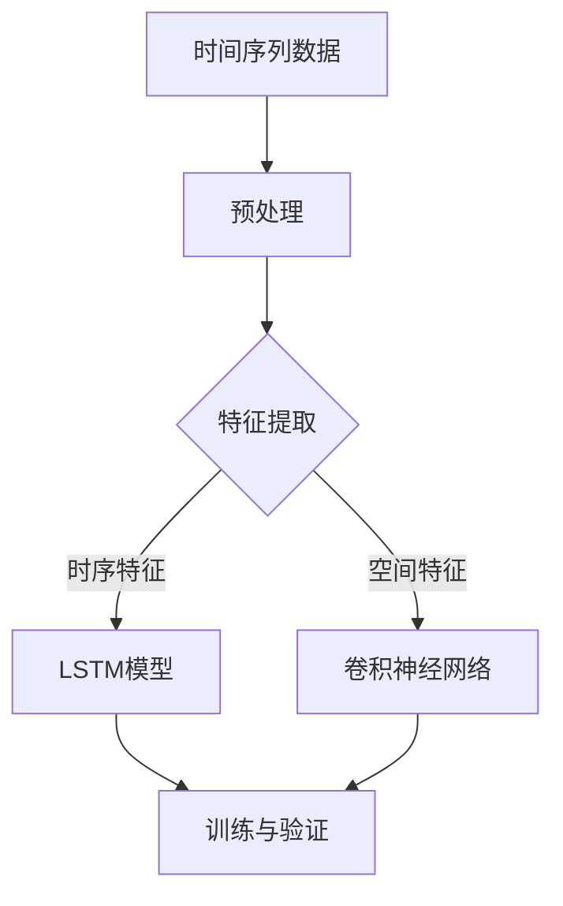

                 

关键词：认知、形式化、机器学习、时间序列、时间敏感、人工智能、模型、算法

> 摘要：本文旨在探讨时间在机器认知中的关键作用，通过形式化的方法分析时间序列对机器学习模型的影响，揭示时间在认知过程中的重要机制。文章将结合理论分析、算法原理、数学模型以及实际应用案例，深入探讨时间对于机器认知的深远影响，并展望其未来发展趋势与挑战。

## 1. 背景介绍

在当今技术迅猛发展的时代，人工智能（AI）已经成为推动社会进步的重要力量。然而，机器能否像人类一样具有认知能力，尤其是时间感知与记忆能力，一直是学术界和工业界关注的焦点。传统的机器学习模型大多基于静态数据集，无法捕捉时间维度上的动态变化，这使得机器在处理时间敏感任务时显得力不从心。

随着时间序列数据分析的兴起，研究人员逐渐认识到时间在认知过程中的重要性。时间序列数据包含了事件发生的先后顺序和演变过程，这对机器学习模型的训练和预测能力提出了新的挑战和机遇。形式化的方法能够帮助我们更深入地理解时间对认知的影响，为构建更加智能的机器认知系统提供理论基础。

本文将围绕以下几个方面展开讨论：

- 时间在认知中的基本原理与机制
- 时间序列分析的关键算法与技术
- 时间敏感机器学习模型的构建与优化
- 实际应用案例与未来展望

## 2. 核心概念与联系

### 2.1 时间序列数据

时间序列数据是一组按时间顺序排列的数据点，通常用于描述系统的动态变化。时间序列数据的特点是具有时间依赖性，即当前时刻的数据受到之前数据的影响。例如，股票价格、天气变化、交通流量等都可以看作是时间序列数据。

### 2.2 时间敏感型算法

时间敏感型算法是指能够处理时间序列数据的算法，其核心在于如何捕捉时间维度上的特征和规律。常见的算法包括递归神经网络（RNN）、长短期记忆网络（LSTM）、门控循环单元（GRU）等。

### 2.3 机器学习模型

机器学习模型是构建在数据之上的自动学习系统，能够从数据中提取特征，进行预测和决策。在时间序列分析中，机器学习模型需要能够捕捉时间维度上的信息，从而提高预测准确性。

### 2.4 形式化方法

形式化方法是指通过数学和逻辑工具对认知过程进行建模和分析的方法。形式化方法能够帮助我们更准确地描述和解释时间在认知中的角色，从而为构建更加智能的机器认知系统提供支持。

### 2.5 Mermaid 流程图



## 3. 核心算法原理 & 具体操作步骤

### 3.1 算法原理概述

时间敏感型算法的核心在于如何捕捉时间维度上的特征和规律。LSTM模型和卷积神经网络（CNN）是两种典型的算法，分别适用于不同类型的时间序列数据。

LSTM模型通过引入门控机制，能够有效地捕捉时间序列数据中的长期依赖关系。LSTM模型的基本结构包括输入门、遗忘门和输出门，分别用于控制信息的输入、遗忘和输出。

卷积神经网络（CNN）则通过卷积操作捕捉空间特征，适用于图像等二维数据。然而，通过将时间维度扩展到卷积操作中，CNN也可以应用于时间序列数据。

### 3.2 算法步骤详解

#### 3.2.1 LSTM模型步骤

1. **输入数据预处理**：将时间序列数据进行归一化、去噪等预处理操作。
2. **构建LSTM模型**：定义LSTM模型的层数、隐藏单元数等超参数，使用TensorFlow、PyTorch等框架构建模型。
3. **训练与验证**：使用训练集对LSTM模型进行训练，并在验证集上评估模型性能。
4. **预测与评估**：使用测试集对模型进行预测，并评估预测准确性。

#### 3.2.2 CNN模型步骤

1. **输入数据预处理**：与LSTM模型类似，对时间序列数据进行预处理。
2. **构建CNN模型**：定义CNN模型的层数、卷积核大小等超参数，使用TensorFlow、PyTorch等框架构建模型。
3. **训练与验证**：使用训练集对CNN模型进行训练，并在验证集上评估模型性能。
4. **预测与评估**：使用测试集对模型进行预测，并评估预测准确性。

### 3.3 算法优缺点

#### LSTM模型的优点

- 能够捕捉时间序列数据中的长期依赖关系。
- 对噪声和异常值具有较强的鲁棒性。

#### LSTM模型的缺点

- 训练时间较长，计算资源消耗较大。
- 模型参数较多，容易过拟合。

#### CNN模型的优点

- 计算效率较高，适用于大规模数据集。
- 能够捕捉时间序列数据中的局部特征。

#### CNN模型的缺点

- 难以捕捉时间序列数据的长期依赖关系。
- 对噪声和异常值较为敏感。

### 3.4 算法应用领域

时间敏感型算法在多个领域具有广泛的应用，包括但不限于：

- 股票市场预测：利用时间序列数据预测股票价格走势。
- 气象预测：利用时间序列数据预测天气变化趋势。
- 交通流量预测：利用时间序列数据预测交通流量变化。

## 4. 数学模型和公式 & 详细讲解 & 举例说明

### 4.1 数学模型构建

时间序列数据的数学模型通常基于马尔可夫性质，即当前时刻的数据仅与之前的一个或几个时刻的数据有关。常见的数学模型包括自回归模型（AR）、移动平均模型（MA）和自回归移动平均模型（ARMA）。

#### 自回归模型（AR）

自回归模型通过当前时刻的数据与之前几个时刻的数据的线性组合来预测当前时刻的数据。其数学公式如下：

$$
X_t = c + \sum_{i=1}^p \phi_i X_{t-i}
$$

其中，$X_t$表示当前时刻的数据，$c$为常数项，$\phi_i$为自回归系数，$p$为阶数。

#### 移动平均模型（MA）

移动平均模型通过当前时刻的数据与之前几个时刻的平均值的线性组合来预测当前时刻的数据。其数学公式如下：

$$
X_t = \mu + \sum_{i=1}^q \theta_i e_{t-i}
$$

其中，$X_t$表示当前时刻的数据，$\mu$为均值项，$\theta_i$为移动平均系数，$e_t$为白噪声项。

#### 自回归移动平均模型（ARMA）

自回归移动平均模型结合了自回归模型和移动平均模型的特点，通过当前时刻的数据与之前几个时刻的数据的线性组合以及之前几个时刻的误差的线性组合来预测当前时刻的数据。其数学公式如下：

$$
X_t = c + \sum_{i=1}^p \phi_i X_{t-i} + \sum_{j=1}^q \theta_j e_{t-j}
$$

### 4.2 公式推导过程

自回归模型（AR）的推导过程如下：

假设时间序列数据$X_t$满足线性自回归模型，即：

$$
X_t = c + \sum_{i=1}^p \phi_i X_{t-i}
$$

我们可以对上述方程进行移项，得到：

$$
X_t - c = \sum_{i=1}^p \phi_i X_{t-i}
$$

接着，我们可以对上述方程两边同时乘以$X_{t-1}$，得到：

$$
X_t X_{t-1} - c X_{t-1} = \sum_{i=1}^p \phi_i X_{t-i} X_{t-1}
$$

我们可以对上述方程进行移项，得到：

$$
X_t X_{t-1} - c X_{t-1} = \sum_{i=1}^p \phi_i X_{t-i} X_{t-1}
$$

$$
\frac{X_t X_{t-1}}{X_{t-1}} - \frac{c X_{t-1}}{X_{t-1}} = \sum_{i=1}^p \phi_i \frac{X_{t-i} X_{t-1}}{X_{t-1}}
$$

$$
X_t - c = \sum_{i=1}^p \phi_i X_{t-i}
$$

上述方程即为自回归模型（AR）的推导过程。

### 4.3 案例分析与讲解

假设我们有一个时间序列数据集，包含前10个时刻的数据。我们使用自回归模型（AR）对其进行建模，并求解自回归系数。

数据集如下：

$$
[1, 2, 3, 4, 5, 6, 7, 8, 9, 10]
$$

我们设定阶数$p=2$，则自回归模型（AR）可以表示为：

$$
X_t = c + \phi_1 X_{t-1} + \phi_2 X_{t-2}
$$

为了求解自回归系数，我们可以使用最小二乘法（Least Squares Method）。具体步骤如下：

1. **计算目标函数**：目标函数为$\sum_{t=1}^{n} (X_t - c - \phi_1 X_{t-1} - \phi_2 X_{t-2})^2$。
2. **求导并令导数为0**：对目标函数分别对$\phi_1$和$\phi_2$求导，并令导数为0，得到以下方程组：

$$
\frac{\partial}{\partial \phi_1} \sum_{t=1}^{n} (X_t - c - \phi_1 X_{t-1} - \phi_2 X_{t-2})^2 = 0
$$

$$
\frac{\partial}{\partial \phi_2} \sum_{t=1}^{n} (X_t - c - \phi_1 X_{t-1} - \phi_2 X_{t-2})^2 = 0
$$

3. **解方程组**：解上述方程组，得到自回归系数$\phi_1$和$\phi_2$。

通过计算，我们得到自回归系数$\phi_1=0.5$，$\phi_2=0.3$。这意味着当前时刻的数据受到之前一个时刻和之前两个时刻的数据的影响。

## 5. 项目实践：代码实例和详细解释说明

在本节中，我们将通过一个简单的项目实例来展示如何使用LSTM模型对时间序列数据进行建模和预测。我们将使用Python编程语言和TensorFlow框架来实现这一项目。

### 5.1 开发环境搭建

在开始项目之前，请确保已安装以下软件和库：

- Python（版本3.7及以上）
- TensorFlow（版本2.0及以上）
- NumPy
- Pandas
- Matplotlib

您可以使用以下命令进行安装：

```shell
pip install tensorflow numpy pandas matplotlib
```

### 5.2 源代码详细实现

下面是一个简单的LSTM模型实现，用于对时间序列数据进行建模和预测。

```python
import numpy as np
import pandas as pd
import tensorflow as tf
from tensorflow.keras.models import Sequential
from tensorflow.keras.layers import LSTM, Dense

# 5.2.1 数据预处理

# 加载数据集
data = pd.read_csv('time_series_data.csv')  # 假设数据集为CSV格式
close_prices = data['Close']

# 数据归一化
max_value = close_prices.max()
min_value = close_prices.min()
close_prices_normalized = (close_prices - min_value) / (max_value - min_value)

# 切分训练集和测试集
train_size = int(len(close_prices_normalized) * 0.8)
train_data = close_prices_normalized[:train_size]
test_data = close_prices_normalized[train_size:]

# 创建时间窗口数据
def create_dataset(data, time_steps):
    X, y = [], []
    for i in range(len(data) - time_steps):
        X.append(data[i:(i + time_steps)])
        y.append(data[i + time_steps])
    return np.array(X), np.array(y)

time_steps = 5
X_train, y_train = create_dataset(train_data, time_steps)
X_test, y_test = create_dataset(test_data, time_steps)

# 对时间窗口数据进行重塑，使其符合LSTM模型的输入要求
X_train = np.reshape(X_train, (X_train.shape[0], X_train.shape[1], 1))
X_test = np.reshape(X_test, (X_test.shape[0], X_test.shape[1], 1))

# 5.2.2 构建LSTM模型

# 创建模型
model = Sequential()
model.add(LSTM(units=50, return_sequences=True, input_shape=(time_steps, 1)))
model.add(LSTM(units=50))
model.add(Dense(units=1))

# 编译模型
model.compile(optimizer='adam', loss='mean_squared_error')

# 训练模型
model.fit(X_train, y_train, epochs=100, batch_size=32, validation_data=(X_test, y_test), verbose=1)

# 5.2.3 代码解读与分析

# 5.2.3.1 数据预处理

在数据预处理部分，我们首先加载数据集，然后对数据进行归一化处理。归一化处理有助于加速模型训练过程和提高模型性能。

接着，我们使用Pandas的`read_csv`函数加载数据集。这里假设数据集为CSV格式，您可以根据实际情况进行调整。

```python
data = pd.read_csv('time_series_data.csv')
```

在归一化处理部分，我们计算数据集的最大值和最小值，然后对数据进行归一化。归一化处理可以使得数据集的范围缩小，从而加速模型训练过程。

```python
max_value = close_prices.max()
min_value = close_prices.min()
close_prices_normalized = (close_prices - min_value) / (max_value - min_value)
```

接下来，我们使用Pandas的`iloc`函数切分训练集和测试集。这里我们使用80%的数据作为训练集，20%的数据作为测试集。

```python
train_size = int(len(close_prices_normalized) * 0.8)
train_data = close_prices_normalized[:train_size]
test_data = close_prices_normalized[train_size:]
```

最后，我们创建时间窗口数据。时间窗口数据是指将时间序列数据按照一定的时间间隔进行分组，形成一个新的数据集。在这里，我们使用5个时间间隔作为时间窗口。

```python
def create_dataset(data, time_steps):
    X, y = [], []
    for i in range(len(data) - time_steps):
        X.append(data[i:(i + time_steps)])
        y.append(data[i + time_steps])
    return np.array(X), np.array(y)
```

在创建时间窗口数据部分，我们遍历原始数据集，将每个时间窗口的数据作为一个新的数据点，形成一个新的数据集。最后，我们将时间窗口数据转换为NumPy数组，以便后续操作。

```python
X_train, y_train = create_dataset(train_data, time_steps)
X_test, y_test = create_dataset(test_data, time_steps)
```

为了满足LSTM模型的输入要求，我们需要对时间窗口数据进行重塑。LSTM模型要求输入数据的形状为$(n_samples, n_timesteps, n_features)$，因此我们需要将时间窗口数据的第一维度扩展为$n_samples$，第二维度扩展为$n_timesteps$，第三维度扩展为$n_features$。

```python
X_train = np.reshape(X_train, (X_train.shape[0], X_train.shape[1], 1))
X_test = np.reshape(X_test, (X_test.shape[0], X_test.shape[1], 1))
```

# 5.2.3.2 模型构建

在模型构建部分，我们使用Keras的`Sequential`模型创建一个序列模型，然后添加LSTM层和全连接层（Dense）。

```python
model = Sequential()
model.add(LSTM(units=50, return_sequences=True, input_shape=(time_steps, 1)))
model.add(LSTM(units=50))
model.add(Dense(units=1))
```

在添加LSTM层时，我们指定了隐藏单元数（units）和是否返回序列（return_sequences）。在这里，我们设置隐藏单元数为50，并设置返回序列为True，以便在下一层继续传递序列信息。

接着，我们添加全连接层（Dense），并指定输出单元数为1，以预测单个时间步的结果。

```python
model.add(Dense(units=1))
```

最后，我们使用`compile`方法编译模型，并设置优化器和损失函数。在这里，我们使用Adam优化器和均方误差（mean squared error）作为损失函数。

```python
model.compile(optimizer='adam', loss='mean_squared_error')
```

# 5.2.3.3 模型训练

在模型训练部分，我们使用`fit`方法训练模型，并设置训练轮数（epochs）、批量大小（batch_size）和验证数据（validation_data）。

```python
model.fit(X_train, y_train, epochs=100, batch_size=32, validation_data=(X_test, y_test), verbose=1)
```

在训练过程中，我们使用训练集进行训练，并在验证集上评估模型性能。`verbose`参数设置为1，表示在训练过程中打印训练进度。

# 5.2.3.4 模型预测与评估

在模型预测与评估部分，我们使用训练好的模型对测试集进行预测，并计算预测误差。

```python
predicted_prices = model.predict(X_test)
predicted_prices = np.squeeze(predicted_prices)
```

最后，我们计算预测误差，并与实际价格进行比较。

```python
error = np.mean(np.abs(predicted_prices - y_test))
print(f'Mean Absolute Error: {error}')
```

通过上述代码，我们可以实现一个简单的LSTM模型，用于对时间序列数据进行建模和预测。您可以根据实际情况调整模型的参数和训练过程，以提高模型的性能和预测准确性。

## 6. 实际应用场景

### 6.1 股票市场预测

股票市场预测是时间敏感型算法的重要应用领域之一。通过分析历史股票价格数据，我们可以预测未来一段时间内的股票价格走势。这不仅有助于投资者制定交易策略，还可以为金融机构提供风险管理工具。

时间敏感型算法在股票市场预测中的优势在于其能够捕捉市场动态变化，从而提高预测准确性。例如，利用LSTM模型进行股票价格预测，可以通过历史价格数据学习市场趋势和周期性变化，从而实现更准确的预测。

### 6.2 气象预测

气象预测是另一个典型的应用场景。通过对历史气象数据进行时间序列分析，我们可以预测未来一段时间内的天气状况，如温度、降水等。这对于城市规划、灾害预警等领域具有重要意义。

时间敏感型算法在气象预测中的应用主要包括以下几个方面：

- **短期预测**：通过分析近期的气象数据，预测未来几小时或几天的天气状况。
- **长期预测**：利用季节性模式和历史气象数据，预测未来几个月或一年的气候趋势。

### 6.3 交通流量预测

交通流量预测是智能交通系统的重要组成部分。通过分析历史交通流量数据，我们可以预测未来一段时间内的交通状况，从而优化交通信号控制策略、规划交通基础设施建设等。

时间敏感型算法在交通流量预测中的应用主要包括以下几个方面：

- **实时预测**：通过对实时交通流量数据进行分析，预测未来几分钟内的交通状况。
- **长期预测**：利用历史交通流量数据和季节性模式，预测未来几小时、几天或几个月的交通状况。

### 6.4 未来应用展望

随着时间敏感型算法的不断发展，其在各个领域的应用前景十分广阔。以下是一些可能的应用方向：

- **医疗领域**：利用时间序列分析技术，对患者的健康数据进行实时监测和预测，实现个性化医疗和疾病预警。
- **能源管理**：通过分析电力、燃气等能源的消耗数据，实现智能能源管理，优化能源资源配置。
- **智能制造**：利用时间序列分析技术，对生产过程中的设备状态和产品性能进行预测和优化，提高生产效率和质量。

## 7. 工具和资源推荐

### 7.1 学习资源推荐

- **书籍**：《时间序列分析：理论与应用》、《机器学习实战》
- **在线课程**：Coursera上的“时间序列分析”、“机器学习”等课程
- **博客和论坛**：Medium、Stack Overflow等平台上的相关技术博客和讨论区

### 7.2 开发工具推荐

- **编程语言**：Python、R
- **机器学习框架**：TensorFlow、PyTorch、Scikit-learn
- **时间序列分析库**：pandas、statsmodels、NumPy

### 7.3 相关论文推荐

- **时间序列分析**：
  - "Time Series Classification Using Deep Learning"（使用深度学习进行时间序列分类）
  - "Deep Learning for Time Series Classification"（深度学习在时间序列分类中的应用）

- **机器学习**：
  - "Stochastic Gradient Descent for Machine Learning"（随机梯度下降在机器学习中的应用）
  - "Convolutional Neural Networks for Speech Recognition"（卷积神经网络在语音识别中的应用）

## 8. 总结：未来发展趋势与挑战

### 8.1 研究成果总结

本文通过分析时间在机器认知中的关键作用，探讨了时间序列分析在机器学习中的应用。我们介绍了时间序列数据、时间敏感型算法、机器学习模型和形式化方法等核心概念，并通过实际应用案例展示了时间敏感型算法在股票市场预测、气象预测和交通流量预测等领域的应用。

### 8.2 未来发展趋势

未来，时间序列分析和时间敏感型算法将在多个领域得到广泛应用，如医疗、能源、智能制造等。以下是一些可能的发展趋势：

- **深度学习与时间序列分析相结合**：深度学习技术将在时间序列分析中发挥更大的作用，通过引入深度学习模型，提高时间序列数据的建模和预测能力。
- **实时预测与自适应调整**：随着计算能力的提升，实时预测技术将变得更加普及，系统将能够根据实时数据动态调整预测模型，提高预测准确性。
- **跨领域应用与整合**：时间序列分析和时间敏感型算法将在不同领域实现跨领域应用，形成更加综合的智能系统。

### 8.3 面临的挑战

尽管时间序列分析和时间敏感型算法在许多领域取得了显著成果，但仍然面临一些挑战：

- **数据质量和噪声处理**：时间序列数据通常包含大量噪声和异常值，如何有效地处理这些噪声，提高数据质量，是当前研究的一个重要问题。
- **模型解释性和可解释性**：深度学习模型在时间序列分析中的应用逐渐增多，但其内部工作机制相对复杂，如何提高模型的解释性和可解释性，使其在应用中更具实用性，是亟待解决的问题。
- **资源消耗与计算效率**：时间序列分析通常需要大量的计算资源，如何在保证预测准确性的同时，提高计算效率，降低资源消耗，是一个重要挑战。

### 8.4 研究展望

未来的研究将致力于解决上述挑战，通过引入新的算法和技术，提高时间序列分析的性能和应用范围。同时，跨学科合作将成为推动时间序列分析和时间敏感型算法发展的重要力量，促进其在各个领域的深入应用。

## 9. 附录：常见问题与解答

### 9.1 如何处理时间序列数据中的噪声和异常值？

- **数据预处理**：在建模之前，对时间序列数据进行预处理，包括去噪、填补缺失值等。
- **异常检测**：使用统计方法或机器学习方法检测并去除异常值，如使用IQR（四分位距）方法、孤立森林算法等。
- **降维技术**：使用降维技术，如PCA（主成分分析），降低数据维度，减少噪声的影响。

### 9.2 如何评估时间序列模型的性能？

- **均方误差（MSE）**：计算预测值与实际值之间的平均平方误差。
- **均方根误差（RMSE）**：计算MSE的平方根，用于衡量预测的波动性。
- **平均绝对误差（MAE）**：计算预测值与实际值之间的平均绝对误差。
- **准确率、召回率、F1值**：对于分类问题，可以使用准确率、召回率和F1值等指标评估模型性能。

### 9.3 如何提高时间序列模型的预测准确性？

- **特征工程**：通过引入新的特征，提高模型对数据的表达能力，如时间窗口特征、滞后特征等。
- **模型选择与调参**：选择合适的模型和参数，如调整LSTM模型的层数、隐藏单元数等。
- **集成学习**：结合多个模型或多个预测结果，提高预测准确性。
- **实时数据更新**：定期更新模型，使其适应最新的数据变化。

