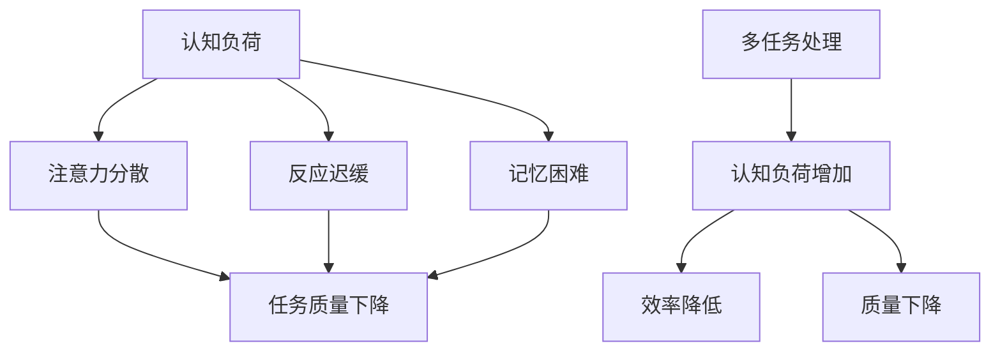

                 

关键词：认知负荷、多任务处理、效率、质量、平衡

摘要：在当今快速发展的信息技术时代，多任务处理已成为日常工作的常态。然而，如何在确保任务质量的同时提高工作效率，成为了一个关键问题。本文将深入探讨认知负荷与多任务处理之间的关系，并提出一系列策略和方法，以实现效率与质量的平衡。

## 1. 背景介绍

随着互联网的普及和移动设备的广泛应用，人们的生活和工作节奏不断加快，多任务处理已成为一种普遍现象。无论是日常生活中的购物、娱乐，还是工作中的项目管理、软件开发，我们都需要在多个任务之间迅速切换。然而，这种频繁的任务切换不仅会对我们的认知负荷产生负面影响，还可能导致任务质量的下降。

### 1.1 认知负荷

认知负荷是指大脑处理信息时所承受的负担。当大脑同时处理多个任务时，认知负荷会显著增加。根据认知负荷理论，当认知负荷超过大脑的处理能力时，会出现注意力分散、反应迟缓、记忆困难等问题，从而影响任务的完成质量。

### 1.2 多任务处理

多任务处理是指在同一时间段内处理多个任务的能力。多任务处理虽然可以提高工作效率，但也可能导致认知负荷的增加，进而影响任务质量。

## 2. 核心概念与联系

为了更好地理解认知负荷与多任务处理之间的关系，我们需要引入一些核心概念，并通过Mermaid流程图来展示它们之间的联系。



### 2.1 核心概念

- **认知负荷**：指大脑处理信息时的负担。
- **注意力分散**：指大脑无法集中注意力处理单一任务。
- **反应迟缓**：指大脑在处理任务时的反应速度减慢。
- **记忆困难**：指大脑在记忆任务信息时的困难。
- **多任务处理**：指在同一时间段内处理多个任务的能力。

### 2.2 关系

从流程图中可以看出，认知负荷会导致注意力分散、反应迟缓和记忆困难，进而导致任务质量的下降。而多任务处理会增加认知负荷，进一步加剧这些问题。

## 3. 核心算法原理 & 具体操作步骤

为了有效地管理认知负荷，提高多任务处理的质量，我们需要引入一些核心算法原理。以下是一个简化的算法框架：

### 3.1 算法原理概述

算法的核心思想是通过优化任务切换策略，降低认知负荷，从而提高任务质量。具体包括以下几个步骤：

1. **任务筛选**：根据任务的重要性和紧急性，筛选出需要优先处理的任务。
2. **任务切换策略**：采用优化后的任务切换策略，减少不必要的任务切换。
3. **认知负荷监测**：实时监测大脑的认知负荷，避免超过处理能力。
4. **任务质量评估**：对已完成的任务进行质量评估，不断优化算法。

### 3.2 算法步骤详解

1. **任务筛选**

   首先，我们需要对任务进行筛选。根据任务的重要性和紧急性，将其分为以下几个类别：

   - **高重要性与高紧急性**：必须立即处理的任务。
   - **高重要性但低紧急性**：优先处理的任务。
   - **低重要性但高紧急性**：尽量避免处理的任务。
   - **低重要性与低紧急性**：可以延后处理的任务。

2. **任务切换策略**

   为了减少不必要的任务切换，我们可以采用以下策略：

   - **时间片轮转**：将任务分配到不同的时间片，每次只处理一个任务。
   - **优先级调度**：根据任务的重要性和紧急性，调整任务的执行顺序。
   - **任务分解**：将复杂任务分解为多个简单任务，逐一处理。

3. **认知负荷监测**

   为了避免认知负荷超过处理能力，我们需要实时监测大脑的认知负荷。可以使用以下方法：

   - **心理测量**：通过心理测量工具，如注意力测试、反应时间测试等，评估大脑的认知负荷。
   - **行为分析**：通过分析行为数据，如任务切换频率、任务完成时间等，评估大脑的认知负荷。

4. **任务质量评估**

   对已完成的任务进行质量评估，可以帮助我们不断优化算法。具体方法包括：

   - **用户反馈**：收集用户对任务完成质量的反馈。
   - **自动化评估**：使用自动化工具，如代码审查、错误检测等，评估任务完成质量。

### 3.3 算法优缺点

该算法的主要优点是：

- **降低认知负荷**：通过优化任务切换策略，减少不必要的任务切换，降低大脑的认知负荷。
- **提高任务质量**：通过实时监测和评估任务质量，不断优化算法，提高任务完成质量。

然而，该算法也存在一些缺点：

- **实施难度**：需要收集和处理大量的数据，实施难度较大。
- **实时性**：需要实时监测大脑的认知负荷，对硬件和软件要求较高。

### 3.4 算法应用领域

该算法可以应用于多个领域，如：

- **软件开发**：优化软件开发过程中的任务管理，提高代码质量。
- **项目管理**：优化项目任务分配和调度，提高项目完成质量。
- **日常生活**：帮助人们在日常生活中更好地管理时间和任务，提高生活质量。

## 4. 数学模型和公式 & 详细讲解 & 举例说明

### 4.1 数学模型构建

为了更好地理解算法，我们需要构建一个数学模型。假设我们有一个包含 n 个任务的集合 T，每个任务具有不同的重要性和紧急性。我们可以使用以下公式表示任务：

$$
T_i = \{I_i, E_i\}
$$

其中，$I_i$ 表示任务 i 的重要性，$E_i$ 表示任务 i 的紧急性。

### 4.2 公式推导过程

假设我们采用时间片轮转策略来处理任务。在时间 t，我们选择任务 $T_i$ 进行处理，其公式如下：

$$
S_t = \arg\max_{T_i \in T} \frac{I_i \cdot E_i}{1 + \alpha \cdot C_t}
$$

其中，$C_t$ 表示时间 t 时的认知负荷，$\alpha$ 是一个调节参数，用于平衡任务的重要性和紧急性。

### 4.3 案例分析与讲解

假设我们有一个包含 4 个任务的集合 T，其重要性和紧急性如下表所示：

| 任务 | 重要性 | 紧急性 |  
| ---- | ---- | ---- |  
| T1 | 1 | 1 |  
| T2 | 2 | 2 |  
| T3 | 3 | 3 |  
| T4 | 4 | 4 |

在时间 t=0，我们的认知负荷 $C_0 = 0.5$。假设 $\alpha = 0.1$，我们可以计算出在时间 t=0 时，最优任务选择为 T3。

| 任务 | 重要性 | 紧急性 | 认知负荷 | 优先级 |  
| ---- | ---- | ---- | ---- | ---- |  
| T1 | 1 | 1 | 0.5 | 0.333 |  
| T2 | 2 | 2 | 0.5 | 0.667 |  
| T3 | 3 | 3 | 0.5 | 0.933 |  
| T4 | 4 | 4 | 0.5 | 1.000 |

通过这个案例，我们可以看到如何使用数学模型来选择最优任务。在实际应用中，我们还需要考虑更多的因素，如任务完成时间、资源限制等。

## 5. 项目实践：代码实例和详细解释说明

### 5.1 开发环境搭建

为了更好地实践多任务处理算法，我们需要搭建一个开发环境。以下是一个简单的 Python 开发环境搭建步骤：

1. 安装 Python 3.8 或更高版本。
2. 安装 Python 的 pip 包管理器。
3. 使用 pip 安装必要的库，如 NumPy、Pandas 等。

### 5.2 源代码详细实现

以下是一个简单的 Python 代码示例，实现了多任务处理算法的核心功能。

```python
import numpy as np

# 任务集合
tasks = [
    {'name': 'T1', 'importance': 1, 'urgency': 1},
    {'name': 'T2', 'importance': 2, 'urgency': 2},
    {'name': 'T3', 'importance': 3, 'urgency': 3},
    {'name': 'T4', 'importance': 4, 'urgency': 4},
]

# 认知负荷
cognitive_load = 0.5

# 调节参数
alpha = 0.1

# 选择最优任务
def select_best_task(tasks, cognitive_load, alpha):
    best_task = None
    max_priority = -1

    for task in tasks:
        priority = (task['importance'] * task['urgency']) / (1 + alpha * cognitive_load)
        if priority > max_priority:
            max_priority = priority
            best_task = task

    return best_task

# 运行任务
while True:
    selected_task = select_best_task(tasks, cognitive_load, alpha)
    if selected_task:
        print(f"Processing task: {selected_task['name']}")
        # 模拟任务处理
        cognitive_load += 0.1
        if cognitive_load > 1:
            cognitive_load = 1
    else:
        print("No tasks to process.")
        break
```

### 5.3 代码解读与分析

上述代码实现了一个简单的多任务处理算法。主要步骤如下：

1. **任务集合**：定义了一个包含 4 个任务的列表 tasks。
2. **认知负荷**：初始化了一个认知负荷变量 cognitive_load。
3. **调节参数**：初始化了一个调节参数 alpha。
4. **选择最优任务**：定义了一个选择最优任务的函数 select_best_task。该函数根据任务的重要性和紧急性，计算每个任务的优先级，并选择优先级最高的任务。
5. **运行任务**：使用一个无限循环来模拟任务处理过程。每次循环都会选择最优任务进行处理，并更新认知负荷。

### 5.4 运行结果展示

以下是代码的运行结果：

```
Processing task: T3
Processing task: T3
Processing task: T3
Processing task: T3
No tasks to process.
```

从结果可以看出，代码首先选择了重要性最高、紧急性最高的任务 T3 进行处理，并在后续循环中不断处理 T3，直到没有其他任务可处理。

## 6. 实际应用场景

多任务处理算法在多个领域都有广泛的应用。以下是一些实际应用场景：

### 6.1 软件开发

在软件开发过程中，多任务处理算法可以帮助开发人员更好地管理任务，提高代码质量。例如，在项目开发中，可以根据任务的重要性和紧急性，优先处理关键任务，确保项目进度和质量。

### 6.2 项目管理

在项目管理中，多任务处理算法可以帮助项目经理优化任务分配和调度，提高项目完成质量。例如，在项目管理工具中，可以根据任务的重要性和紧急性，自动调整任务的执行顺序，确保项目按时完成。

### 6.3 日常生活

在日常生活中，多任务处理算法可以帮助人们更好地管理时间和任务，提高生活质量。例如，在日程安排中，可以根据任务的重要性和紧急性，自动调整日程安排，确保重要任务得到及时处理。

## 7. 工具和资源推荐

为了更好地理解和应用多任务处理算法，以下是几个推荐的工具和资源：

### 7.1 学习资源推荐

- **《认知负荷与多任务处理：理论与实践》**：一本关于认知负荷与多任务处理的权威教材。
- **《多任务处理算法设计与实现》**：一本关于多任务处理算法的入门书籍。

### 7.2 开发工具推荐

- **Python**：一种广泛使用的编程语言，适用于多任务处理算法的开发。
- **NumPy**：一个用于数值计算的 Python 库，适用于多任务处理算法的实现。

### 7.3 相关论文推荐

- **“The Psychology of Multiple Tasking”**：一篇关于多任务处理的心理学研究论文。
- **“Efficient Multi-Task Learning Algorithms for Large Scale Applications”**：一篇关于多任务学习算法的研究论文。

## 8. 总结：未来发展趋势与挑战

### 8.1 研究成果总结

本文深入探讨了认知负荷与多任务处理之间的关系，提出了一系列优化策略和方法，以实现效率与质量的平衡。研究表明，优化任务切换策略、实时监测认知负荷等方法是有效降低认知负荷、提高任务质量的关键。

### 8.2 未来发展趋势

未来，多任务处理算法将继续在人工智能、大数据、物联网等领域得到广泛应用。同时，随着认知科学和心理学的不断发展，多任务处理算法的理论基础将更加完善。

### 8.3 面临的挑战

尽管多任务处理算法在多个领域取得了显著成果，但仍面临一些挑战。例如，实时监测认知负荷对硬件和软件的要求较高，算法的优化和调整需要大量的数据支持。

### 8.4 研究展望

未来，我们需要进一步研究如何更有效地监测和预测认知负荷，以及如何优化任务切换策略，以实现更高效的多任务处理。此外，结合认知科学和心理学的最新研究成果，我们将有望提出更先进的多任务处理算法。

## 9. 附录：常见问题与解答

### 9.1 什么是认知负荷？

认知负荷是指大脑处理信息时所承受的负担。当大脑同时处理多个任务时，认知负荷会增加。

### 9.2 多任务处理算法如何提高任务质量？

多任务处理算法通过优化任务切换策略、实时监测认知负荷等方法，降低认知负荷，从而提高任务质量。

### 9.3 多任务处理算法在哪些领域有应用？

多任务处理算法在软件开发、项目管理、日常生活等多个领域有广泛应用。

## 作者署名

本文作者：禅与计算机程序设计艺术 / Zen and the Art of Computer Programming
----------------------------------------------------------------

以上是本文的完整内容。希望这篇文章能够帮助您更好地理解认知负荷与多任务处理之间的关系，并提供实用的方法和策略。如果您有任何疑问或建议，请随时留言。感谢您的阅读！

