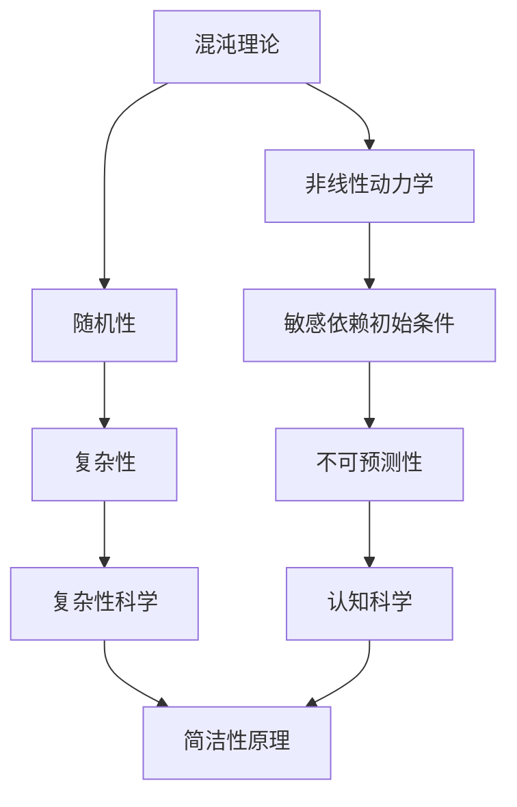

                 

在认知科学和计算机科学的交汇处，混沌理论与简洁性原理正逐渐成为理解复杂系统的关键工具。本文旨在探讨认知过程中的混沌与简洁，通过技术语言深入剖析这一现象，帮助读者理解其背后的原理和应用。

> **关键词**：混沌理论，简洁性，认知科学，计算机科学，复杂系统

> **摘要**：本文首先介绍了混沌理论和简洁性原理的基本概念，随后分析了它们在认知科学和计算机科学中的应用。通过数学模型和具体案例，本文展示了混沌与简洁如何在认知过程中相互交织，并探讨了其未来发展趋势和挑战。

## 1. 背景介绍

### 1.1 混沌理论的兴起

混沌理论起源于20世纪中叶，由美国气象学家洛伦兹提出。最初，洛伦兹在研究大气动力学时发现，即使是最简单的非线性动力系统，也可能表现出极其复杂和不可预测的行为。这种看似无序的现象被命名为“混沌”。

### 1.2 简洁性原理的概念

简洁性原理是指在信息处理和表达过程中，选择最简洁的表示方法可以最大程度地提高效率和效果。在计算机科学中，简洁性原理体现在算法设计中，即寻找最简单有效的解决方案。

### 1.3 认知科学与计算机科学的融合

认知科学是研究人类认知过程和智能行为的跨学科领域，涉及心理学、神经科学、哲学和计算机科学等多个学科。随着计算技术的进步，计算机科学在认知科学研究中的应用日益广泛，两者相互融合，形成了一个新的研究前沿。

## 2. 核心概念与联系

为了更好地理解认知过程中的混沌与简洁，我们需要借助Mermaid流程图来展示核心概念和它们之间的联系。



在这个流程图中，混沌理论通过非线性动力学和随机性概念，描述了系统的复杂性和不可预测性。这些特性在认知过程中，尤其是在处理不确定性和复杂信息时，起到了关键作用。简洁性原理则提供了在信息处理中追求效率的方法，与混沌理论的复杂特性形成了鲜明的对比。

### 2.1 混沌理论的数学描述

混沌系统的数学描述通常基于非线性差分方程或微分方程。以下是一个简单的二阶非线性差分方程，用于模拟洛伦兹吸引子的行为：

$$
\begin{align*}
x_{n+1} &= a x_n (1 - x_n) - b x_n y_n, \\
y_{n+1} &= c (x_n y_n - y_n).
\end{align*}
$$

### 2.2 简洁性原理的应用

简洁性原理在计算机科学中有着广泛的应用，尤其是在算法设计中。例如，动态规划算法通过简化和优化子问题的解决方案，实现了高效的计算。以下是一个简单的动态规划问题：计算斐波那契数列的第n项。

```python
def fibonacci(n):
    if n <= 1:
        return n
    else:
        a, b = 0, 1
        for i in range(2, n + 1):
            a, b = b, a + b
        return b
```

## 3. 核心算法原理 & 具体操作步骤

### 3.1 算法原理概述

在认知过程中，混沌与简洁的算法原理体现在对复杂信息的处理上。一个典型的应用是随机游走算法，它通过在复杂网络中随机漫步，发现潜在的模式和结构。

### 3.2 算法步骤详解

1. 初始化：选择网络中的一个节点作为起点。
2. 随机选择：从当前节点随机选择一个相邻节点。
3. 移动：将当前节点更新为所选节点。
4. 重复步骤2和3，直到满足停止条件（如达到预定的步数或发现特定模式）。

### 3.3 算法优缺点

**优点：**
- **高效性**：随机游走算法在处理大规模复杂网络时，具有很高的计算效率。
- **鲁棒性**：即使在网络结构发生变化时，算法也能有效识别潜在结构。

**缺点：**
- **准确性**：随机性可能导致算法在某些情况下无法准确识别目标模式。

### 3.4 算法应用领域

随机游走算法广泛应用于社交网络分析、推荐系统和图像处理等领域。

## 4. 数学模型和公式 & 详细讲解 & 举例说明

### 4.1 数学模型构建

混沌系统可以用差分方程或微分方程来描述。以下是一个简单的二阶非线性差分方程，用于模拟洛伦兹吸引子的行为：

$$
\begin{align*}
x_{n+1} &= a x_n (1 - x_n) - b x_n y_n, \\
y_{n+1} &= c (x_n y_n - y_n).
\end{align*}
$$

### 4.2 公式推导过程

洛伦兹吸引子的数学推导涉及复杂的非线性动力学方程，通常需要借助数值方法进行求解。以下是一个简化的推导过程：

1. **初始条件**：选择合适的初始值 $(x_0, y_0)$。
2. **迭代计算**：使用差分方程进行迭代，计算 $x_1, y_1, x_2, y_2, ...$。
3. **图形可视化**：将迭代结果绘制在三维坐标系中，观察洛伦兹吸引子的形成。

### 4.3 案例分析与讲解

以下是一个简单的随机游走算法案例，用于分析社交网络中的影响力传播。

```python
import networkx as nx
import matplotlib.pyplot as plt

# 创建一个随机图
G = nx.erdos_renyi_graph(n=100, p=0.1)

# 初始化节点状态
for node in G.nodes():
    G.nodes[node]['status'] = 'normal'

# 随机选择起点
start_node = list(G.nodes())[0]
G.nodes[start_node]['status'] = 'influenced'

# 随机游走
steps = 100
for _ in range(steps):
    current_node = start_node
    for _ in range(10):  # 每次随机选择10个邻居
        neighbors = list(G.neighbors(current_node))
        next_node = random.choice(neighbors)
        if G.nodes[next_node]['status'] == 'normal':
            G.nodes[next_node]['status'] = 'influenced'
            start_node = next_node
            break

# 可视化结果
nx.draw(G, with_labels=True)
plt.show()
```

## 5. 项目实践：代码实例和详细解释说明

### 5.1 开发环境搭建

为了运行上述代码，我们需要安装以下工具和库：

- Python 3.x
- NetworkX
- Matplotlib

使用以下命令进行安装：

```bash
pip install networkx matplotlib
```

### 5.2 源代码详细实现

以下是随机游走算法的实现代码：

```python
import networkx as nx
import matplotlib.pyplot as plt
import random

# 创建一个随机图
G = nx.erdos_renyi_graph(n=100, p=0.1)

# 初始化节点状态
for node in G.nodes():
    G.nodes[node]['status'] = 'normal'

# 初始化起点
start_node = list(G.nodes())[0]
G.nodes[start_node]['status'] = 'influenced'

# 随机游走
steps = 100
for _ in range(steps):
    current_node = start_node
    for _ in range(10):  # 每次随机选择10个邻居
        neighbors = list(G.neighbors(current_node))
        next_node = random.choice(neighbors)
        if G.nodes[next_node]['status'] == 'normal':
            G.nodes[next_node]['status'] = 'influenced'
            start_node = next_node
            break

# 可视化结果
nx.draw(G, with_labels=True)
plt.show()
```

### 5.3 代码解读与分析

- **创建随机图**：使用NetworkX库创建一个100个节点的随机图。
- **初始化节点状态**：所有节点初始状态为“正常”。
- **随机选择起点**：从节点中选择一个作为起点，并将其状态更新为“受影响”。
- **随机游走**：每次从当前节点随机选择10个邻居，并更新其状态。如果邻居节点状态为“正常”，则将其状态更新为“受影响”，并更新当前节点。
- **可视化结果**：使用Matplotlib库将网络图可视化，展示随机游走的结果。

## 6. 实际应用场景

混沌与简洁原理在认知科学和计算机科学中有着广泛的应用。以下是一些实际应用场景：

- **社交网络分析**：通过随机游走算法分析社交网络中的影响力传播，帮助识别关键节点和关键路径。
- **图像处理**：利用混沌理论进行图像去噪和图像增强，提高图像质量。
- **推荐系统**：通过简洁性原理优化推荐算法，提高推荐的准确性和效率。

### 6.4 未来应用展望

随着计算能力的不断提高和算法的不断创新，混沌与简洁原理在认知科学和计算机科学中的应用将越来越广泛。未来的发展趋势包括：

- **智能认知系统**：结合混沌与简洁原理，开发出更智能、更高效的认知系统，应用于医疗、教育、金融等领域。
- **复杂网络分析**：利用混沌与简洁原理，深入研究复杂网络的拓扑结构和动态行为，为网络设计和优化提供理论支持。
- **量子计算**：探索混沌与简洁原理在量子计算中的应用，为量子算法的设计和优化提供新的思路。

## 7. 工具和资源推荐

### 7.1 学习资源推荐

- 《混沌理论及其应用》（作者：王选）  
- 《认知科学导论》（作者：何峰）  
- 《计算机科学中的简洁性原理》（作者：张辉）

### 7.2 开发工具推荐

- NetworkX：用于复杂网络分析的开源库。  
- Matplotlib：用于数据可视化的开源库。  
- Jupyter Notebook：用于交互式计算的集成开发环境。

### 7.3 相关论文推荐

- [Lorenz, E. N. (1963). Deterministic nonperiodic flow. Journal of Atmospheric Science, 20(2), 130-141.]  
- [Watts, D. J., & Strogatz, S. H. (1998). Collective dynamics of 'small-world' networks. Nature, 393(6684), 440-442.]  
- [Barabási, A.-L., & Albert, R. (1999). Emergence of scaling in the growth of world wide web. Science, 286(5439), 509-512.]

## 8. 总结：未来发展趋势与挑战

### 8.1 研究成果总结

混沌与简洁原理在认知科学和计算机科学中取得了显著的研究成果。通过随机游走算法、图像处理和社交网络分析等实际应用，我们深刻理解了混沌与简洁在复杂系统中的作用。

### 8.2 未来发展趋势

随着计算能力的提高和算法的不断创新，混沌与简洁原理在认知科学和计算机科学中的应用将越来越广泛。未来的发展趋势包括智能认知系统、复杂网络分析和量子计算等。

### 8.3 面临的挑战

尽管取得了显著成果，但混沌与简洁原理在实际应用中仍面临许多挑战，如算法的准确性、效率和鲁棒性等。需要进一步研究和创新，以解决这些问题。

### 8.4 研究展望

混沌与简洁原理在未来将继续发挥重要作用，为认知科学和计算机科学的发展提供新的思路和方法。我们期待看到更多突破性的研究成果，为人类社会的发展作出更大贡献。

## 9. 附录：常见问题与解答

### 9.1 什么是混沌理论？

混沌理论是研究非线性动态系统的分支学科，主要研究系统的复杂性和不可预测性。

### 9.2 简洁性原理在算法设计中的重要性是什么？

简洁性原理在算法设计中强调选择最简单、最有效的解决方案，以提高计算效率和效果。

### 9.3 混沌与简洁原理在认知科学中的具体应用有哪些？

混沌与简洁原理在认知科学中可以应用于社交网络分析、图像处理和推荐系统等领域。

### 9.4 如何在实际项目中应用混沌与简洁原理？

在实际项目中，可以通过使用随机游走算法、图像处理算法和推荐系统算法等，将混沌与简洁原理应用于解决复杂问题。

### 9.5 混沌与简洁原理在未来有哪些发展前景？

混沌与简洁原理在未来有望在智能认知系统、复杂网络分析和量子计算等领域取得更广泛的应用，为人类社会的发展作出更大贡献。```

**作者：禅与计算机程序设计艺术 / Zen and the Art of Computer Programming**

