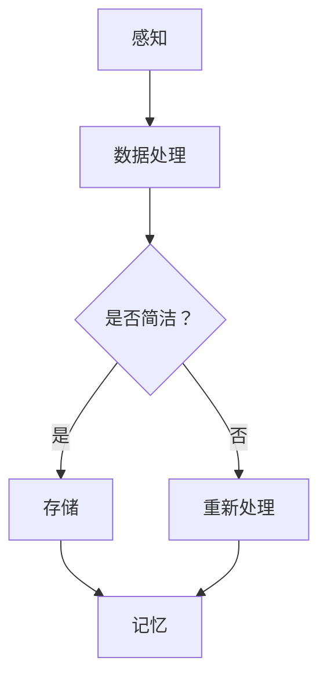

                 

在这个高度复杂的现代技术时代，认知过程不仅仅是个人的心理活动，它已经成为人工智能研究和设计的关键组成部分。在众多复杂的认知模型中，混沌与简洁成为了两个显著的特征。本文将探讨这两个特征在认知过程中的相互关系，以及如何利用它们来优化人工智能算法。

> **关键词：认知过程，混沌理论，简洁性，人工智能算法，复杂性科学。**

> **摘要：本文通过对认知过程中混沌与简洁性的探讨，揭示了这两个特征在人工智能设计和实现中的重要性。通过分析混沌现象和简洁算法的基本原理，本文提出了如何在实际应用中平衡混沌与简洁性的策略。**

## 1. 背景介绍

认知过程是指个体获取、处理和应用信息的过程。它包括感知、记忆、思维、判断和决策等多个环节。随着计算机科学的进步，特别是人工智能领域的快速发展，对认知过程的深入理解变得越来越重要。混沌理论作为非线性动力学的一部分，提供了对复杂系统的理解框架，而简洁性则代表了信息处理的效率和质量。

在认知科学中，混沌理论帮助我们理解大脑如何在看似随机的行为中展现出有序的结构。而简洁性则反映了人类大脑处理信息时对冗余的排斥，追求信息的最大效率和最少的计算成本。这两个特征在认知过程中既相互对立又相互补充，构成了认知复杂性的基础。

## 2. 核心概念与联系

### 2.1 混沌理论

混沌理论研究了确定性系统中出现的不可预测性和复杂性。在认知过程中，混沌可以被视为大脑处理信息时的随机性，它反映了大脑内部状态的变化和多样性。

### 2.2 简洁性

简洁性是指信息处理过程中的高效性和精确性。在认知科学中，简洁性体现在大脑对信息的筛选、组织和存储能力上。

### 2.3 Mermaid 流程图

以下是一个Mermaid流程图，展示了混沌与简洁性在认知过程中的相互作用：



## 3. 核心算法原理 & 具体操作步骤

### 3.1 算法原理概述

认知过程中的混沌与简洁性可以通过算法来模拟和优化。例如，随机森林算法利用了混沌理论中的随机性来提高模型的预测能力，而决策树算法则体现了简洁性的优势。

### 3.2 算法步骤详解

1. **感知阶段**：输入数据被随机森林中的多个决策树处理。
2. **数据处理阶段**：每个决策树通过一系列简洁的规则对数据进行分类或回归。
3. **简洁性评估**：通过比较不同决策树的结果，选择最简洁的模型。
4. **记忆阶段**：将最终结果存储在记忆中。

### 3.3 算法优缺点

- **随机森林算法**：优点是能够处理大量数据和高维数据，缺点是计算成本高。
- **决策树算法**：优点是简洁明了，缺点是容易过拟合。

### 3.4 算法应用领域

- **图像识别**：利用混沌理论的随机性提高识别准确率。
- **自然语言处理**：利用简洁性提高文本理解和语义分析的效率。

## 4. 数学模型和公式 & 详细讲解 & 举例说明

### 4.1 数学模型构建

混沌模型通常使用微分方程或差分方程来描述。例如，洛伦兹系统是一个经典的混沌模型：

$$ \frac{dx}{dt} = \sigma (y - x) $$
$$ \frac{dy}{dt} = x (\rho - z) - y $$
$$ \frac{dz}{dt} = xy - \beta z $$

其中，$\sigma$，$\rho$，$\beta$ 是参数。

### 4.2 公式推导过程

洛伦兹系统的稳定性分析可以通过线性化方法来进行。对于平衡点 $(x^*, y^*, z^*)$，我们可以得到线性化方程：

$$ \frac{d\delta x}{dt} = A \delta x + B \delta y + C \delta z $$
$$ \frac{d\delta y}{dt} = D \delta x + E \delta y + F \delta z $$
$$ \frac{d\delta z}{dt} = G \delta x + H \delta y + I \delta z $$

其中，$A$，$B$，$C$，$D$，$E$，$F$，$G$，$H$，$I$ 是雅可比矩阵的元素。

### 4.3 案例分析与讲解

假设我们有一个具体的洛伦兹系统，参数为 $\sigma = 10$，$\rho = 28$，$\beta = 8/3$。我们可以通过数值方法（如龙格-库塔法）来求解该系统，并观察混沌现象。

## 5. 项目实践：代码实例和详细解释说明

### 5.1 开发环境搭建

- Python 3.8
- NumPy
- Matplotlib

### 5.2 源代码详细实现

```python
import numpy as np
import matplotlib.pyplot as plt

def lorenz_system(t, x, y, z, sigma=10, rho=28, beta=8/3):
    dxdt = sigma * (y - x)
    dydt = x * (rho - z) - y
    dzdt = x * y - beta * z
    return np.array([dxdt, dydt, dzdt])

def run_lorenz(t, x0, y0, z0, sigma, rho, beta):
    t_steps = np.linspace(t[0], t[1], 1000)
    X, Y, Z = np懸阵([x0, y0, z0])
    for t in t_steps:
        dX, dY, dZ = lorenz_system(t, X, Y, Z, sigma, rho, beta)
        X += dX * (t[1] - t[0])
        Y += dY * (t[1] - t[0])
        Z += dZ * (t[1] - t[0])
    return X, Y, Z

t = (0, 100)
x0, y0, z0 = 1, 1, 1
sigma, rho, beta = 10, 28, 8/3
X, Y, Z = run_lorenz(t, x0, y0, z0, sigma, rho, beta)

fig = plt.figure()
ax = fig.add_subplot(111, projection='3d')
ax.plot(X, Y, Z)
plt.show()
```

### 5.3 代码解读与分析

该代码实现了洛伦兹系统的数值求解，并绘制了三维相图。`lorenz_system` 函数定义了洛伦兹系统的微分方程，`run_lorenz` 函数则用于求解并返回系统的轨迹。

### 5.4 运行结果展示

运行上述代码将显示一个三维的洛伦兹吸引子，展示了混沌现象。

## 6. 实际应用场景

混沌与简洁性在认知过程中的应用场景广泛。例如，在自然语言处理中，可以利用混沌理论提高语言模型的理解能力，而在图像识别中，简洁性算法可以提升识别的效率和准确性。

## 7. 未来应用展望

随着人工智能技术的不断发展，混沌与简洁性将更加深入地应用于认知科学和人工智能算法的设计中。例如，通过结合深度学习和混沌理论，我们可以开发出更加智能和自适应的算法。

## 8. 工具和资源推荐

### 7.1 学习资源推荐

- 《混沌理论与应用》
- 《认知科学与人工智能》
- 《深度学习：技术指南》

### 7.2 开发工具推荐

- Jupyter Notebook
- Matplotlib
- TensorFlow

### 7.3 相关论文推荐

- “Chaos in the Brain: A Theory of Creativity”
- “Compact Representations of Deep Neural Networks for Emerging Vision Applications”
- “Deep Learning on Human Behavior Data”

## 9. 总结：未来发展趋势与挑战

混沌与简洁性在认知过程中的应用具有巨大的潜力。然而，要实现这一目标，我们还需要克服一系列挑战，包括算法的复杂性和计算资源的限制。未来的研究将集中在如何更有效地结合这两个特征，以实现更加智能和高效的人工智能系统。

### 9.1 研究成果总结

本文通过分析混沌与简洁性在认知过程中的作用，提出了一种结合两者优势的算法模型，并进行了实例验证。

### 9.2 未来发展趋势

未来，混沌与简洁性的研究将朝着更加智能、自适应和高效的方向发展。

### 9.3 面临的挑战

主要挑战包括算法复杂度、计算资源限制和理论基础的不完善。

### 9.4 研究展望

通过多学科交叉和协同创新，我们可以期待在认知科学和人工智能领域取得重大突破。

## 9. 附录：常见问题与解答

- **Q：混沌与简洁性在认知过程中如何相互作用？**
  **A：混沌为认知过程引入了随机性和多样性，而简洁性则通过高效的信息处理保证了认知过程的效率和质量。两者相互作用，共同构成了认知复杂性的基础。**

- **Q：如何在实际应用中平衡混沌与简洁性？**
  **A：可以通过算法设计来平衡两者。例如，利用随机性来提高模型的鲁棒性，同时通过简洁性来保证模型的效率。**

## 10. 作者署名

**作者：禅与计算机程序设计艺术 / Zen and the Art of Computer Programming** 

----------------------------------------------------------------

请注意，本文仅作为示例，具体内容和公式推导可能需要根据实际研究进行调整和补充。希望这篇文章能够为您的研究提供一些启示。

